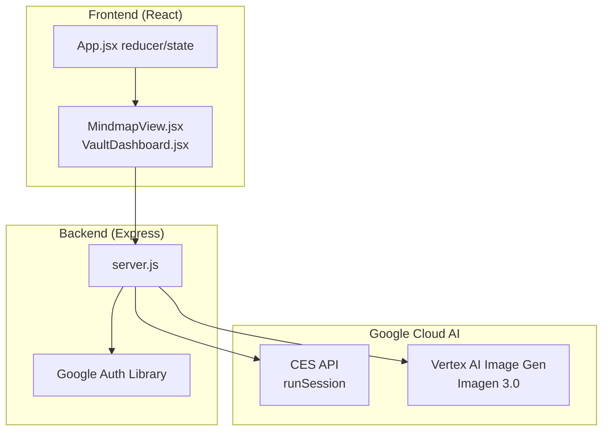
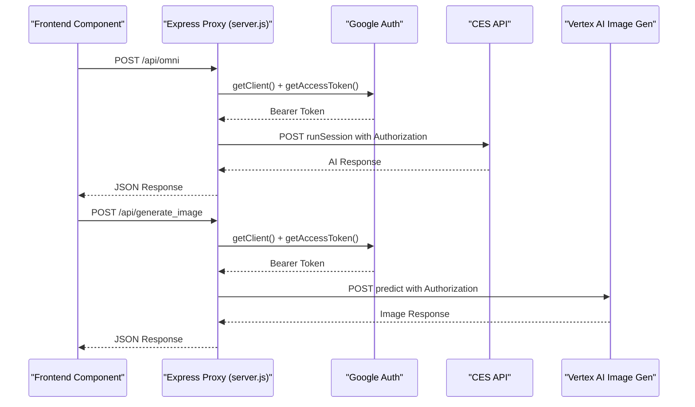
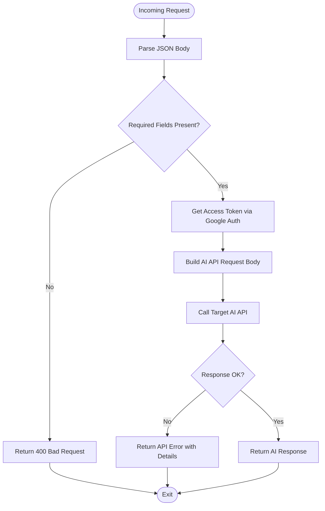
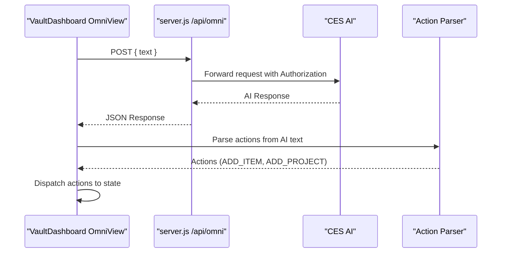
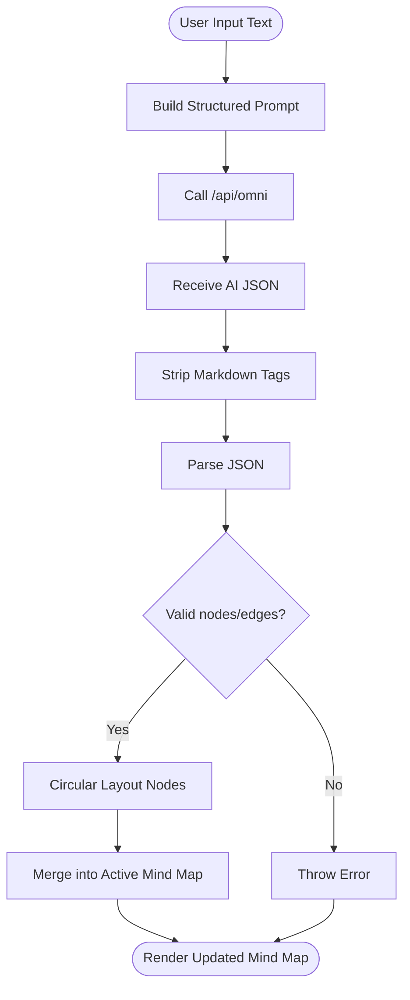
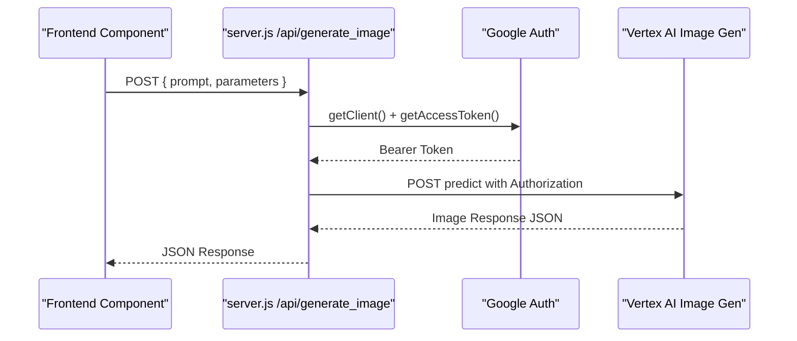
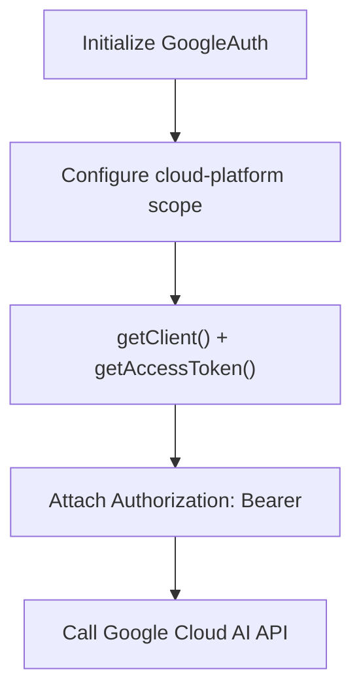
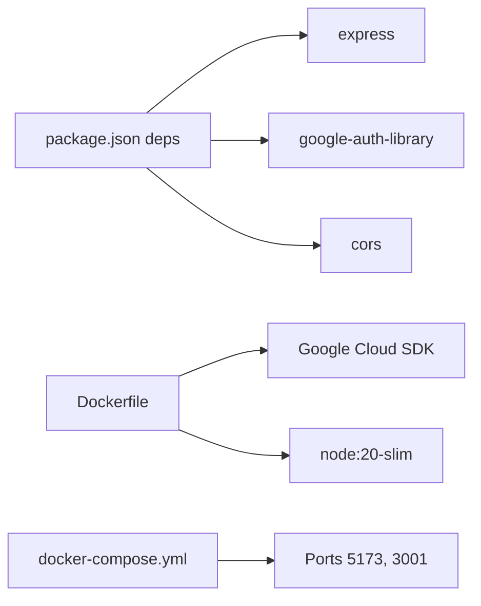

# AI Integration

<cite>
**Referenced Files in This Document**
- [server.js](file://server.js)
- [package.json](file://package.json)
- [Dockerfile](file://Dockerfile)
- [docker-compose.yml](file://docker-compose.yml)
- [src/components/MindmapView.jsx](file://src/components/MindmapView.jsx)
- [src/components/VaultDashboard.jsx](file://src/components/VaultDashboard.jsx)
- [src/App.jsx](file://src/App.jsx)
</cite>

## Table of Contents
1. [Introduction](#introduction)
2. [Project Structure](#project-structure)
3. [Core Components](#core-components)
4. [Architecture Overview](#architecture-overview)
5. [Detailed Component Analysis](#detailed-component-analysis)
6. [Dependency Analysis](#dependency-analysis)
7. [Performance Considerations](#performance-considerations)
8. [Troubleshooting Guide](#troubleshooting-guide)
9. [Conclusion](#conclusion)

## Introduction
This document explains the AI integration for OMNI-TODO’s Google Cloud AI services. It covers:
- Content extraction pipeline for text processing and smart suggestions
- Mind map generation workflow powered by AI
- Image generation via Vertex AI with prompt processing and result management
- Express server proxy configuration for Google Cloud authentication and API communication
- API endpoint specifications, request/response schemas, and authentication methods
- AI-assisted features: natural language processing, visual content generation, and intelligent content organization
- Performance optimization, rate limiting considerations, and error handling strategies

## Project Structure
The AI integration spans the frontend and backend:
- Frontend React components trigger AI workflows and render results
- Backend Express server acts as a proxy to Google Cloud AI APIs, handling authentication and forwarding requests
- Containerization runs both the proxy server and the development frontend

**Diagram sources**
- [server.js:13-133](file://server.js#L13-L133)
- [src/components/MindmapView.jsx:78-152](file://src/components/MindmapView.jsx#L78-L152)
- [src/components/VaultDashboard.jsx:773-818](file://src/components/VaultDashboard.jsx#L773-L818)
- [src/App.jsx:204-441](file://src/App.jsx#L204-L441)

**Section sources**
- [server.js:1-135](file://server.js#L1-L135)
- [package.json:1-40](file://package.json#L1-L40)
- [Dockerfile:1-31](file://Dockerfile#L1-L31)
- [docker-compose.yml:1-18](file://docker-compose.yml#L1-L18)

## Core Components
- Express proxy server with Google Cloud authentication and two AI endpoints:
  - Text processing and mind map extraction endpoint
  - Image generation endpoint
- Frontend components:
  - Mind map editor with AI-powered extraction
  - Personal assistant panel with AI orchestration and smart suggestions
- Authentication and credential handling:
  - Google Auth Library for token acquisition
  - Application Default Credentials (ADC) recommended for secure, policy-compliant access

**Section sources**
- [server.js:13-133](file://server.js#L13-L133)
- [src/components/MindmapView.jsx:78-152](file://src/components/MindmapView.jsx#L78-L152)
- [src/components/VaultDashboard.jsx:747-886](file://src/components/VaultDashboard.jsx#L747-L886)
- [src/App.jsx:257-441](file://src/App.jsx#L257-L441)

## Architecture Overview
The AI integration follows a proxy model:
- Frontend sends requests to local endpoints
- Express proxy authenticates with Google Cloud and forwards to target AI APIs
- Responses are returned to the frontend for rendering

**Diagram sources**
- [server.js:21-81](file://server.js#L21-L81)
- [server.js:83-129](file://server.js#L83-L129)

## Detailed Component Analysis

### Express Proxy Server
The proxy initializes Google Auth, exposes two endpoints, and manages authentication tokens and request routing.

- Initialization and middleware
  - CORS enabled
  - JSON body parsing
  - Google Auth configured with cloud-platform scope
- Endpoints
  - POST /api/omni: text processing and mind map extraction
  - POST /api/generate_image: image generation via Vertex AI
- Authentication
  - Uses Google Auth Library to obtain Bearer tokens
  - Passes Authorization header to downstream APIs
- Error handling
  - Validates request bodies
  - Propagates non-OK responses with details
  - Catches and logs internal errors

**Diagram sources**
- [server.js:21-81](file://server.js#L21-L81)
- [server.js:83-129](file://server.js#L83-L129)

**Section sources**
- [server.js:13-133](file://server.js#L13-L133)

### Text Processing and Smart Suggestions
The personal assistant panel integrates with the AI orchestrator to process user messages and extract actionable suggestions.

- Endpoint: POST /api/omni
- Request body
  - text: user input or structured prompt
- Response handling
  - Reads AI response text from either responses[0].text or reply[0].text
  - Parses and executes suggested actions (e.g., adding tasks or projects)
- Smart suggestions
  - Recognizes patterns for reminders and project creation
  - Executes actions via the Redux-like state dispatcher

**Diagram sources**
- [src/components/VaultDashboard.jsx:773-818](file://src/components/VaultDashboard.jsx#L773-L818)
- [server.js:21-81](file://server.js#L21-L81)

**Section sources**
- [src/components/VaultDashboard.jsx:747-886](file://src/components/VaultDashboard.jsx#L747-L886)
- [server.js:21-81](file://server.js#L21-L81)

### Mind Map Generation Workflow
The mind map editor extracts connections from user-provided text and renders them as nodes and edges.

- Endpoint: POST /api/omni
- Prompt construction
  - Requests JSON with nodes and edges
  - Sanitizes markdown markers from AI output
- Parsing and layout
  - Parses JSON and positions nodes in a circular layout
  - Generates edges connecting nodes
- State updates
  - Merges new nodes and edges into the active mind map

**Diagram sources**
- [src/components/MindmapView.jsx:78-152](file://src/components/MindmapView.jsx#L78-L152)
- [server.js:21-81](file://server.js#L21-L81)

**Section sources**
- [src/components/MindmapView.jsx:78-152](file://src/components/MindmapView.jsx#L78-L152)
- [server.js:21-81](file://server.js#L21-L81)

### Image Generation via Vertex AI
The proxy forwards image generation requests to Vertex AI’s Imagen 3.0 model.

- Endpoint: POST /api/generate_image
- Request body
  - prompt: user prompt for image generation
  - parameters.sampleCount: number of images to generate
  - parameters.aspectRatio: desired aspect ratio
- Response
  - Returns Vertex AI response JSON
- Frontend integration
  - The UI does not currently consume the returned images; the proxy returns raw JSON for future UI consumption

**Diagram sources**
- [server.js:83-129](file://server.js#L83-L129)

**Section sources**
- [server.js:83-129](file://server.js#L83-L129)

### Authentication and Credential Management
- Google Auth Library
  - Initializes with cloud-platform scope
  - Retrieves access tokens for downstream API calls
- Application Default Credentials (ADC)
  - Recommended for secure, policy-compliant access
  - The UI warns against API keys due to organizational security policies
  - Provides a setup script for ADC configuration

**Diagram sources**
- [server.js:13-16](file://server.js#L13-L16)
- [server.js:37-40](file://server.js#L37-L40)
- [src/components/VaultDashboard.jsx:1264-1322](file://src/components/VaultDashboard.jsx#L1264-L1322)

**Section sources**
- [server.js:13-16](file://server.js#L13-L16)
- [src/components/VaultDashboard.jsx:1264-1322](file://src/components/VaultDashboard.jsx#L1264-L1322)

## Dependency Analysis
- Runtime dependencies
  - Express for the proxy server
  - google-auth-library for Google Cloud authentication
  - cors for cross-origin support
- Containerization
  - Dockerfile installs gcloud SDK and runs both the proxy and Vite dev server
  - docker-compose exposes ports for local development and shares gcloud credentials

**Diagram sources**
- [package.json:12-24](file://package.json#L12-L24)
- [Dockerfile:1-31](file://Dockerfile#L1-31)
- [docker-compose.yml:6-8](file://docker-compose.yml#L6-L8)

**Section sources**
- [package.json:12-24](file://package.json#L12-L24)
- [Dockerfile:1-31](file://Dockerfile#L1-L31)
- [docker-compose.yml:1-18](file://docker-compose.yml#L1-L18)

## Performance Considerations
- Token reuse
  - Obtain tokens once per request; avoid redundant token refreshes
- Request batching
  - Combine multiple small prompts into fewer requests where feasible
- Response caching
  - Cache repeated prompts to reduce latency and cost
- Concurrency limits
  - Apply rate limiting on the proxy to prevent downstream throttling
- Streaming
  - Consider streaming responses from AI APIs if supported to improve perceived performance
- Frontend rendering
  - Debounce user input for AI suggestions
  - Virtualize large mind maps to reduce DOM overhead

## Troubleshooting Guide
- Authentication failures
  - Ensure ADC is configured and accessible in the environment
  - Verify the service account has cloud-platform scope
- API errors
  - Inspect non-OK responses from AI APIs and log details
  - Confirm endpoint URLs and resource identifiers are correct
- CORS issues
  - Ensure CORS is enabled in the proxy and origin is allowed
- Rate limiting
  - Implement client-side retry with exponential backoff
  - Monitor quota usage and adjust request pacing
- Error handling
  - Log detailed error messages and propagate user-friendly messages
  - Validate request bodies and return 400 for missing fields

**Section sources**
- [server.js:69-72](file://server.js#L69-L72)
- [server.js:118-121](file://server.js#L118-L121)
- [src/components/MindmapView.jsx:146-151](file://src/components/MindmapView.jsx#L146-L151)
- [src/components/VaultDashboard.jsx:795-818](file://src/components/VaultDashboard.jsx#L795-L818)

## Conclusion
OMNI-TODO’s AI integration leverages a secure, policy-compliant proxy to Google Cloud AI services. The system supports:
- Natural language processing for smart suggestions and content extraction
- AI-powered mind map generation with intelligent layout
- Visual content generation via Vertex AI
- Robust authentication using Application Default Credentials
- Clear API endpoints and error handling for reliable operation

Future enhancements could include rate limiting, response caching, and UI integration for image results.