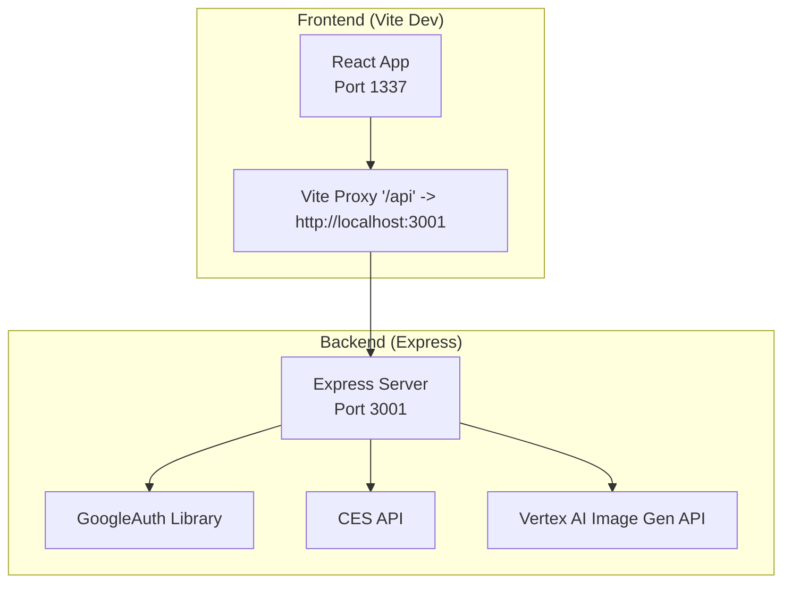
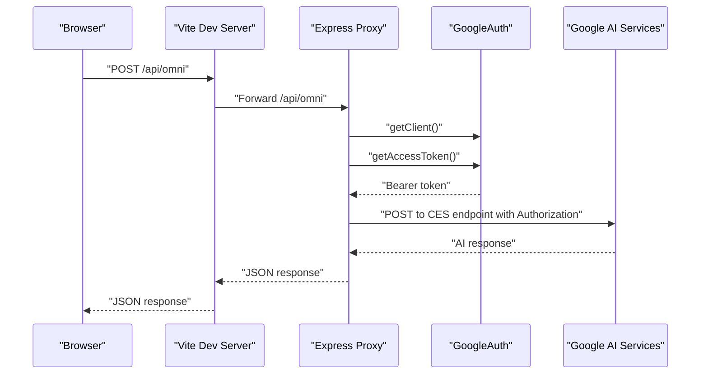
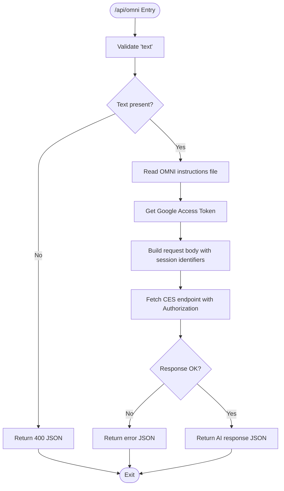
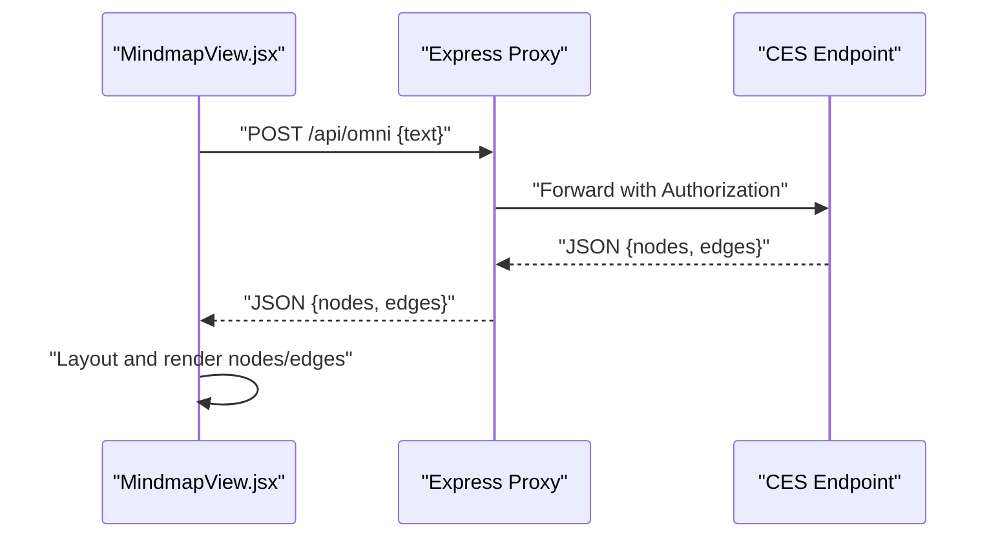
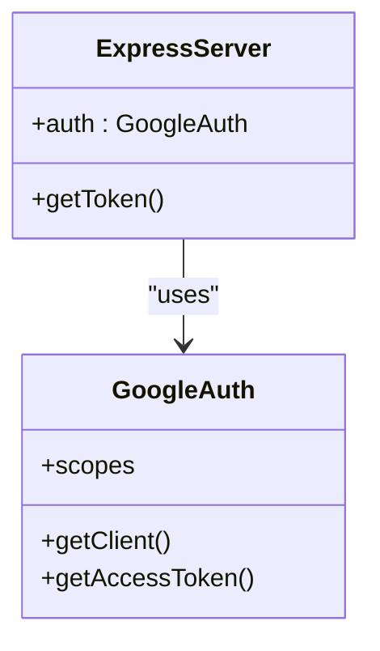
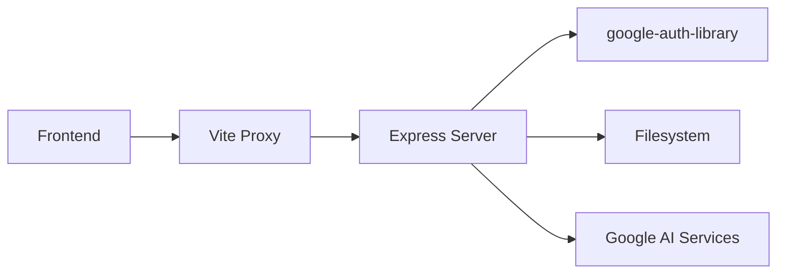

# AI Service Integration

<cite>
**Referenced Files in This Document**
- [server.js](file://server.js)
- [package.json](file://package.json)
- [vite.config.js](file://vite.config.js)
- [docker-compose.yml](file://docker-compose.yml)
- [Dockerfile](file://Dockerfile)
- [src/components/MindmapView.jsx](file://src/components/MindmapView.jsx)
- [src/components/VaultDashboard.jsx](file://src/components/VaultDashboard.jsx)
</cite>

## Table of Contents
1. [Introduction](#introduction)
2. [Project Structure](#project-structure)
3. [Core Components](#core-components)
4. [Architecture Overview](#architecture-overview)
5. [Detailed Component Analysis](#detailed-component-analysis)
6. [Dependency Analysis](#dependency-analysis)
7. [Performance Considerations](#performance-considerations)
8. [Security Considerations](#security-considerations)
9. [Monitoring and Logging](#monitoring-and-logging)
10. [Troubleshooting Guide](#troubleshooting-guide)
11. [Conclusion](#conclusion)

## Introduction
This document describes the AI service integration architecture in OMNI-TODO. It covers the Express proxy server that authenticates with Google Cloud services, routes requests to AI APIs, and returns processed responses to the frontend. It also documents the Vite development proxy configuration, authentication flow using Google Application Default Credentials (ADC), error handling strategies, security considerations, performance optimization techniques, and monitoring/logging approaches.

## Project Structure
The integration spans a frontend built with React and Vite, and a backend Express proxy server. The Vite dev server proxies API requests to the Express server, which obtains Google Cloud OAuth tokens and forwards requests to Google AI services.

**Diagram sources**
- [vite.config.js:11-16](file://vite.config.js#L11-L16)
- [server.js:10-16](file://server.js#L10-L16)
- [server.js:58-65](file://server.js#L58-L65)
- [server.js:107-114](file://server.js#L107-L114)

**Section sources**
- [vite.config.js:1-18](file://vite.config.js#L1-L18)
- [server.js:1-135](file://server.js#L1-L135)

## Core Components
- Express Proxy Server: Provides two endpoints for AI services:
  - POST /api/omni: Sends user text to a Google Cloud CES session endpoint.
  - POST /api/generate_image: Sends prompts to Vertex AI Imagen model.
- Frontend Components:
  - MindmapView.jsx: Calls /api/omni to generate mindmap JSON from user text.
  - VaultDashboard.jsx: Calls /api/omni for assistant chat and /api/generate_image for image generation.
- Vite Dev Proxy: Routes /api* requests to the Express server running on localhost:3001.
- Google Cloud Authentication: Uses google-auth-library with Application Default Credentials (ADC) to obtain Bearer tokens.

**Section sources**
- [server.js:21-81](file://server.js#L21-L81)
- [server.js:83-129](file://server.js#L83-L129)
- [src/components/MindmapView.jsx:95-99](file://src/components/MindmapView.jsx#L95-L99)
- [src/components/VaultDashboard.jsx:786-790](file://src/components/VaultDashboard.jsx#L786-L790)
- [src/components/VaultDashboard.jsx:1048-1052](file://src/components/VaultDashboard.jsx#L1048-L1052)
- [vite.config.js:11-16](file://vite.config.js#L11-L16)

## Architecture Overview
The frontend communicates with the backend via a development-time proxy. The backend authenticates with Google Cloud using ADC, retrieves an access token, and forwards requests to Google AI endpoints. Responses are returned to the frontend with minimal processing.

**Diagram sources**
- [vite.config.js:11-16](file://vite.config.js#L11-L16)
- [server.js:37-40](file://server.js#L37-L40)
- [server.js:58-65](file://server.js#L58-L65)

## Detailed Component Analysis

### Express Proxy Server
- Initialization:
  - Enables CORS globally and JSON parsing middleware.
  - Initializes GoogleAuth with cloud-platform scope.
- Endpoints:
  - /api/omni:
    - Validates presence of text.
    - Reads local OMNI instructions file (fallback to default if missing).
    - Obtains access token via GoogleAuth.
    - Builds request body with session/app/deployment identifiers and combined system+user text.
    - Posts to CES endpoint and returns JSON or error.
  - /api/generate_image:
    - Validates presence of prompt.
    - Obtains access token via GoogleAuth.
    - Builds request body with instances and parameters.
    - Posts to Vertex AI Imagen endpoint and returns JSON or error.
- Error handling:
  - Catches runtime errors and returns structured JSON with error messages.
  - Logs detailed errors to console.

**Diagram sources**
- [server.js:21-81](file://server.js#L21-L81)

**Section sources**
- [server.js:10-16](file://server.js#L10-L16)
- [server.js:21-81](file://server.js#L21-L81)
- [server.js:83-129](file://server.js#L83-L129)

### Frontend Integration
- MindmapView.jsx:
  - Sends user text to /api/omni.
  - Parses AI response to extract nodes/edges and adds them to the mindmap canvas.
- VaultDashboard.jsx:
  - Assistant chat: Sends user messages to /api/omni and displays responses.
  - Image generation: Sends prompts to /api/generate_image and stores base64 images in gallery.

**Diagram sources**
- [src/components/MindmapView.jsx:95-99](file://src/components/MindmapView.jsx#L95-L99)
- [server.js:58-65](file://server.js#L58-L65)

**Section sources**
- [src/components/MindmapView.jsx:95-152](file://src/components/MindmapView.jsx#L95-L152)
- [src/components/VaultDashboard.jsx:786-818](file://src/components/VaultDashboard.jsx#L786-L818)
- [src/components/VaultDashboard.jsx:1048-1076](file://src/components/VaultDashboard.jsx#L1048-L1076)

### Vite Development Proxy
- Proxies all /api* requests to http://localhost:3001.
- Allows cross-origin requests during development.

**Section sources**
- [vite.config.js:11-16](file://vite.config.js#L11-L16)

### Google Cloud Authentication and Credential Handling
- Uses google-auth-library with Application Default Credentials (ADC).
- Scope configured for cloud-platform.
- Token obtained via getClient().getAccessToken() and attached as Authorization: Bearer in outbound requests.
- Containerized setup installs Google Cloud SDK and exposes ports for both Vite and Express.

**Diagram sources**
- [server.js:14-16](file://server.js#L14-L16)
- [server.js:38-40](file://server.js#L38-L40)

**Section sources**
- [server.js:14-16](file://server.js#L14-L16)
- [server.js:38-40](file://server.js#L38-L40)
- [Dockerfile:10-12](file://Dockerfile#L10-L12)
- [docker-compose.yml:6-8](file://docker-compose.yml#L6-L8)

## Dependency Analysis
- Runtime dependencies:
  - express, cors, google-auth-library, dotenv.
- Development dependencies:
  - @vitejs/plugin-react, vite, tailwindcss, postcss, etc.
- Frontend depends on Vite proxy configuration to reach Express server.
- Express server depends on google-auth-library for token acquisition and on filesystem for OMNI instructions.

**Diagram sources**
- [package.json:12-24](file://package.json#L12-L24)
- [vite.config.js:11-16](file://vite.config.js#L11-L16)
- [server.js:3-5](file://server.js#L3-L5)

**Section sources**
- [package.json:12-38](file://package.json#L12-L38)
- [vite.config.js:11-16](file://vite.config.js#L11-L16)
- [server.js:3-5](file://server.js#L3-L5)

## Performance Considerations
- Request Batching:
  - Aggregate multiple small AI requests into fewer batched requests where supported by the upstream APIs. For example, group multiple prompts into a single Vertex AI predict call if the model allows batched instances.
- Response Caching:
  - Cache successful responses keyed by input hash to reduce repeated calls for identical prompts or texts.
- Concurrency Limits:
  - Limit concurrent outbound requests to prevent rate limiting and resource exhaustion.
- Streaming Responses:
  - If upstream APIs support streaming, enable streaming to improve perceived latency.
- Local Instructions:
  - Consider caching the OMNI instructions file in memory to avoid repeated disk reads.

[No sources needed since this section provides general guidance]

## Security Considerations
- Application Default Credentials (ADC):
  - Recommended approach avoids manual API key management. Ensure ADC is configured securely in the environment/container.
- Token Scope:
  - The configured scope limits permissions to cloud-platform. Verify least-privilege access for the service account.
- CORS:
  - Global CORS is enabled in development. Restrict origins in production environments.
- Secrets Exposure:
  - Avoid embedding secrets in client-side code. All sensitive operations occur server-side via ADC.
- Network Security:
  - Use HTTPS in production and restrict outbound traffic to trusted Google endpoints.
- Container Credentials:
  - The Dockerfile installs the Google Cloud SDK. Ensure credentials are mounted or configured appropriately in the container.

**Section sources**
- [server.js:10](file://server.js#L10)
- [server.js:14-16](file://server.js#L14-L16)
- [Dockerfile:10-12](file://Dockerfile#L10-L12)
- [docker-compose.yml:12-14](file://docker-compose.yml#L12-L14)

## Monitoring and Logging
- Console Logging:
  - The Express server logs detailed error messages and API error responses to the console.
- Frontend Error Surfaces:
  - Components surface errors to users via UI feedback (e.g., error messages in image generation).
- Suggested Enhancements:
  - Centralized logging with structured log entries (timestamp, level, service, request ID).
  - Metrics collection for request counts, latency, and error rates.
  - Health checks for the proxy server and upstream AI endpoints.
  - Alerting thresholds for quotas, timeouts, and frequent errors.

**Section sources**
- [server.js:78-80](file://server.js#L78-L80)
- [server.js:119-121](file://server.js#L119-L121)
- [src/components/VaultDashboard.jsx:1071-1072](file://src/components/VaultDashboard.jsx#L1071-L1072)

## Troubleshooting Guide
- Authentication Failures:
  - Ensure ADC is configured in the environment. In containers, verify Google Cloud SDK installation and credential availability.
  - Confirm the service account has the required roles for accessing the target AI endpoints.
- CORS Errors:
  - Verify Vite proxy is active and targets the correct Express port.
- Network Timeouts:
  - Check outbound connectivity to Google AI endpoints from the server environment.
  - Consider retry logic with exponential backoff for transient failures.
- Quota Limitations:
  - Monitor quotas for the target projects and models. Implement request throttling and user notifications when quotas are exceeded.
- Local Instructions Not Found:
  - The server falls back to defaults if the instructions file cannot be read. Verify file path and permissions.

**Section sources**
- [Dockerfile:10-12](file://Dockerfile#L10-L12)
- [vite.config.js:11-16](file://vite.config.js#L11-L16)
- [server.js:31-35](file://server.js#L31-L35)

## Conclusion
OMNI-TODO’s AI integration relies on a clean separation between frontend and backend, with the Express proxy handling Google Cloud authentication and forwarding requests to AI services. The Vite proxy simplifies development by routing API calls locally. Security is strengthened by using ADC and minimizing secret exposure. With the suggested performance and monitoring improvements, the integration can become more robust, scalable, and observable.