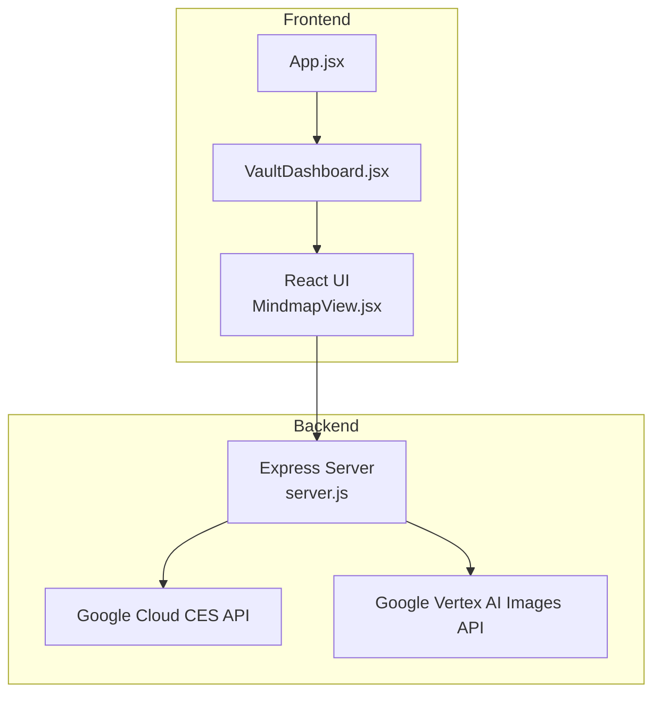
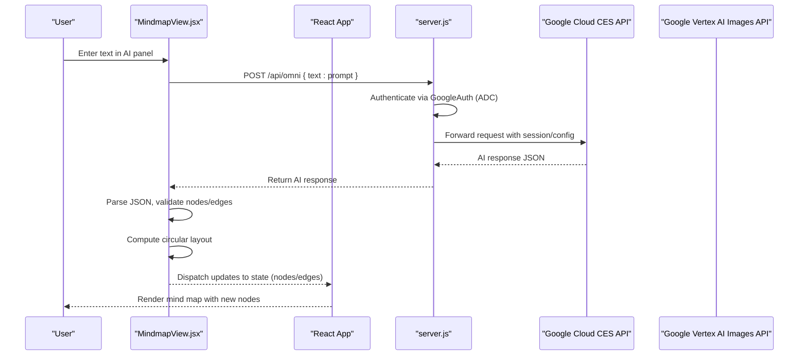
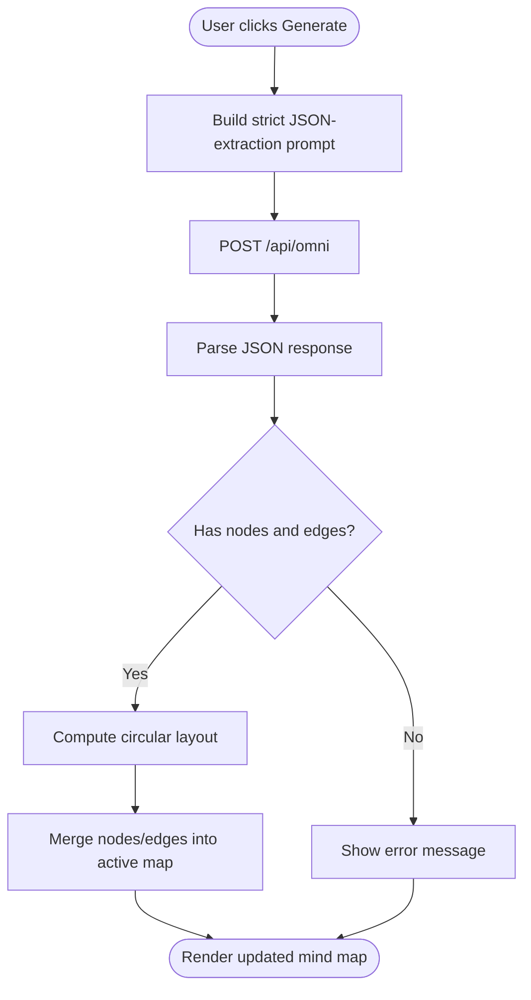
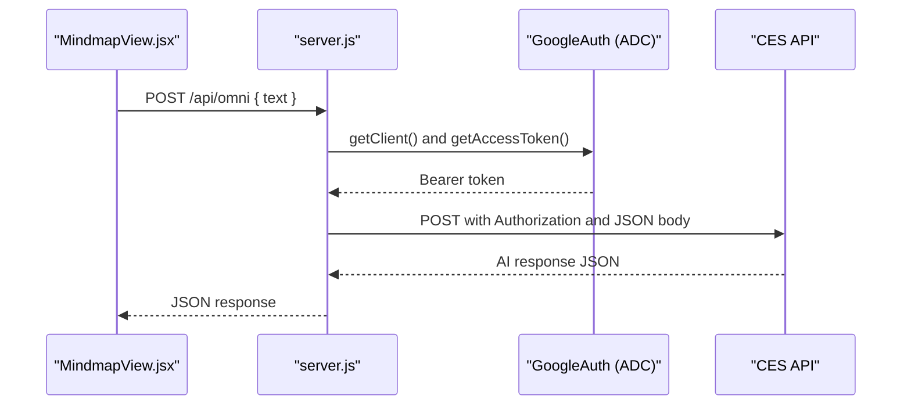
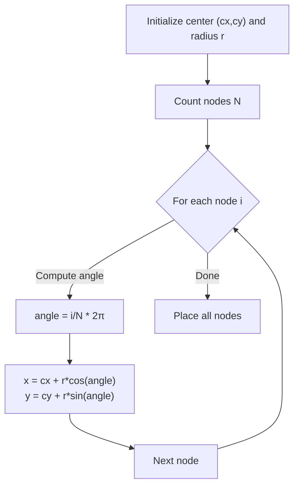
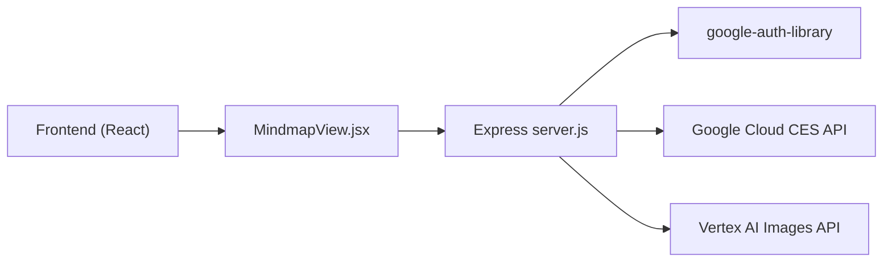

# Content Extraction

<cite>
**Referenced Files in This Document**
- [server.js](file://server.js)
- [MindmapView.jsx](file://src/components/MindmapView.jsx)
- [VaultDashboard.jsx](file://src/components/VaultDashboard.jsx)
- [App.jsx](file://src/App.jsx)
- [package.json](file://package.json)
</cite>

## Table of Contents
1. [Introduction](#introduction)
2. [Project Structure](#project-structure)
3. [Core Components](#core-components)
4. [Architecture Overview](#architecture-overview)
5. [Detailed Component Analysis](#detailed-component-analysis)
6. [Dependency Analysis](#dependency-analysis)
7. [Performance Considerations](#performance-considerations)
8. [Troubleshooting Guide](#troubleshooting-guide)
9. [Conclusion](#conclusion)

## Introduction
This document explains OMNI-TODO’s content extraction system powered by Google Cloud AI. It focuses on how user-provided text is transformed into structured mind map nodes and edges, how prompts are engineered to guide AI responses, how JSON responses are validated and processed, and how extracted nodes are positioned automatically. It also covers the integration between the frontend and backend, including request/response schemas, authentication, and error handling strategies.

## Project Structure
The system spans a React frontend and a Node.js/Express proxy server:
- Frontend: React components manage user input, render the mind map canvas, and orchestrate AI requests.
- Backend: Express routes proxy requests to Google Cloud AI APIs, attach contextual instructions, and return AI responses to the frontend.

**Diagram sources**
- [server.js:1-135](file://server.js#L1-L135)
- [MindmapView.jsx:1-310](file://src/components/MindmapView.jsx#L1-L310)
- [VaultDashboard.jsx:1-1544](file://src/components/VaultDashboard.jsx#L1-L1544)
- [App.jsx:1-441](file://src/App.jsx#L1-L441)

**Section sources**
- [server.js:1-135](file://server.js#L1-L135)
- [MindmapView.jsx:1-310](file://src/components/MindmapView.jsx#L1-L310)
- [VaultDashboard.jsx:1-1544](file://src/components/VaultDashboard.jsx#L1-L1544)
- [App.jsx:1-441](file://src/App.jsx#L1-L441)

## Core Components
- Frontend Mindmap View: Collects user text, constructs a strict JSON-extraction prompt, sends it to the backend, parses the AI response, and positions nodes in a circular layout.
- Backend Proxy: Authenticates with Google Application Default Credentials, attaches contextual instructions, forwards requests to Google Cloud AI, and returns responses to the frontend.
- Authentication: Uses Google Auth Library to obtain an access token scoped to cloud-platform.

**Section sources**
- [MindmapView.jsx:78-152](file://src/components/MindmapView.jsx#L78-L152)
- [server.js:13-81](file://server.js#L13-L81)

## Architecture Overview
The content extraction workflow integrates the frontend mind map editor with the backend proxy and Google Cloud AI.

**Diagram sources**
- [MindmapView.jsx:78-152](file://src/components/MindmapView.jsx#L78-L152)
- [server.js:21-81](file://server.js#L21-L81)

## Detailed Component Analysis

### Frontend: MindmapView.jsx
Responsibilities:
- Build a strict JSON-extraction prompt from user input.
- Call the backend endpoint to send the prompt.
- Parse and validate the AI response as JSON.
- Apply a circular layout to newly extracted nodes.
- Merge new nodes and edges into the active mind map.

Key behaviors:
- Prompt construction enforces a specific JSON schema and disallows markdown markers.
- Response parsing trims markdown delimiters and validates presence of nodes and edges.
- Circular layout computes positions around a central point with equal angular spacing.
- Error messages surface parsing failures and network errors.

**Diagram sources**
- [MindmapView.jsx:78-152](file://src/components/MindmapView.jsx#L78-L152)

**Section sources**
- [MindmapView.jsx:78-152](file://src/components/MindmapView.jsx#L78-L152)

### Backend: server.js
Responsibilities:
- Accept user prompts via POST /api/omni.
- Attach contextual instructions from a local file path (fallback to default if missing).
- Authenticate with Google Application Default Credentials and forward requests to Google Cloud CES API.
- Return AI responses to the frontend.

Security and robustness:
- Reads OMNI instructions from a configured path; logs a warning and continues if unavailable.
- Propagates non-OK responses from Google Cloud with error details.
- Uses CORS and JSON middleware.

**Diagram sources**
- [server.js:21-81](file://server.js#L21-L81)

**Section sources**
- [server.js:13-81](file://server.js#L13-L81)

### Integration Patterns: Request/Response Schemas and Authentication
- Endpoint: /api/omni
- Method: POST
- Request body:
  - text: string (user prompt or prebuilt prompt)
- Response body:
  - Depends on Google Cloud API; frontend expects either responses[0].text or reply[0].text, falling back to raw JSON if needed.
- Authentication:
  - Google Application Default Credentials (ADC) with scope for cloud-platform.
  - Token injected into Authorization header as Bearer.

Additional endpoint:
- /api/generate_image: For image generation using Vertex AI Images API.

**Section sources**
- [server.js:21-81](file://server.js#L21-L81)
- [server.js:83-129](file://server.js#L83-L129)

### AI Prompt Engineering Techniques
- Strict JSON schema requirement: The prompt instructs the model to return only a valid JSON object with nodes and edges arrays.
- Markdown-free output: The frontend strips markdown code blocks from the response before parsing.
- Context injection: The backend reads OMNI instructions from a local file and injects them into the request body as system context.

Practical implications:
- Ensures deterministic parsing and reduces ambiguity in node/edge extraction.
- Mitigates hallucinations by constraining output format.

**Section sources**
- [MindmapView.jsx:84-93](file://src/components/MindmapView.jsx#L84-L93)
- [server.js:29-35](file://server.js#L29-L35)

### JSON Parsing Logic and Validation
- The frontend trims markdown delimiters and attempts JSON.parse on the AI response text.
- Validation checks for the presence of nodes and edges arrays.
- On success, it generates new nodes and edges with unique identifiers and merges them into the active mind map.
- On failure, it surfaces a user-visible error message.

Error handling:
- Catches parsing exceptions and displays a descriptive message.
- Logs the underlying error for debugging.

**Section sources**
- [MindmapView.jsx:104-149](file://src/components/MindmapView.jsx#L104-L149)

### Automatic Layout Algorithm: Circular Arrangement
- Central coordinates and radius define the circle.
- Nodes are distributed evenly around the circumference using equal angular increments.
- Edges connect nodes based on the AI-provided source/target mapping.

**Diagram sources**
- [MindmapView.jsx:110-125](file://src/components/MindmapView.jsx#L110-L125)

**Section sources**
- [MindmapView.jsx:110-132](file://src/components/MindmapView.jsx#L110-L132)

### Integration with VaultDashboard and App
- VaultDashboard hosts multiple views including the mind map view and an OMNI assistant view.
- App manages encryption and IndexedDB-backed secure storage; the mind map view is embedded within VaultDashboard.
- MindmapView.jsx communicates with the backend via /api/omni and updates the Redux-style state managed by VaultDashboard.

**Section sources**
- [VaultDashboard.jsx:442-490](file://src/components/VaultDashboard.jsx#L442-L490)
- [App.jsx:204-255](file://src/App.jsx#L204-L255)

## Dependency Analysis
External libraries and integrations:
- Express and CORS for the backend server.
- google-auth-library for ADC-based authentication.
- @xyflow/react for rendering and editing the mind map graph.
- framer-motion for animations.
- lucide-react for icons.

**Diagram sources**
- [package.json:12-24](file://package.json#L12-L24)
- [server.js:1-16](file://server.js#L1-L16)

**Section sources**
- [package.json:12-24](file://package.json#L12-L24)
- [server.js:1-16](file://server.js#L1-L16)

## Performance Considerations
- Debounce and minimal re-renders: MindmapView.jsx uses React.memoized selectors and callbacks to minimize unnecessary updates during drag-and-drop and edge creation.
- Efficient layout computation: Circular layout is O(N) with constant-time trigonometric operations per node.
- Backend latency: Network round trips to Google Cloud APIs can dominate latency; consider caching or batching where feasible.

## Troubleshooting Guide
Common issues and resolutions:
- Missing OMNI instructions file:
  - Symptom: Warning logged and default behavior used.
  - Resolution: Ensure the file path exists or remove the path to rely on defaults.
- Malformed AI response:
  - Symptom: JSON parse error surfaced to the user.
  - Resolution: Verify the prompt enforces JSON-only output and strip markdown delimiters.
- Backend API errors:
  - Symptom: Non-OK response from Google Cloud with details.
  - Resolution: Inspect error details and verify credentials and scopes.
- Authentication failures:
  - Symptom: Unauthorized or permission denied responses.
  - Resolution: Confirm ADC setup and cloud-platform scope availability.

**Section sources**
- [server.js:29-35](file://server.js#L29-L35)
- [server.js:69-72](file://server.js#L69-L72)
- [MindmapView.jsx:146-149](file://src/components/MindmapView.jsx#L146-L149)

## Conclusion
OMNI-TODO’s content extraction system combines a strict JSON-extraction prompt, robust frontend parsing, and a simple yet effective circular layout to transform user text into interactive mind maps. The backend proxy securely authenticates via ADC and forwards requests to Google Cloud AI, returning structured responses to the frontend. Clear error handling and schema enforcement help maintain reliability and usability.