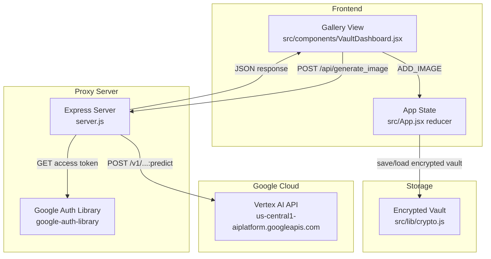
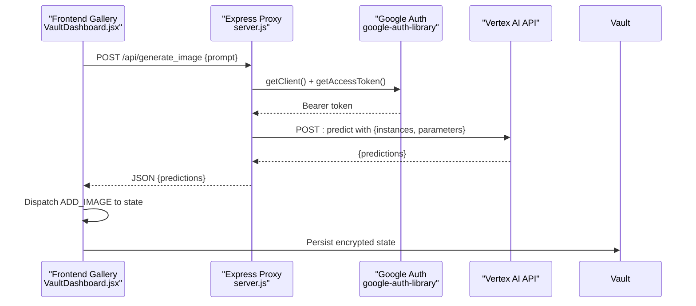
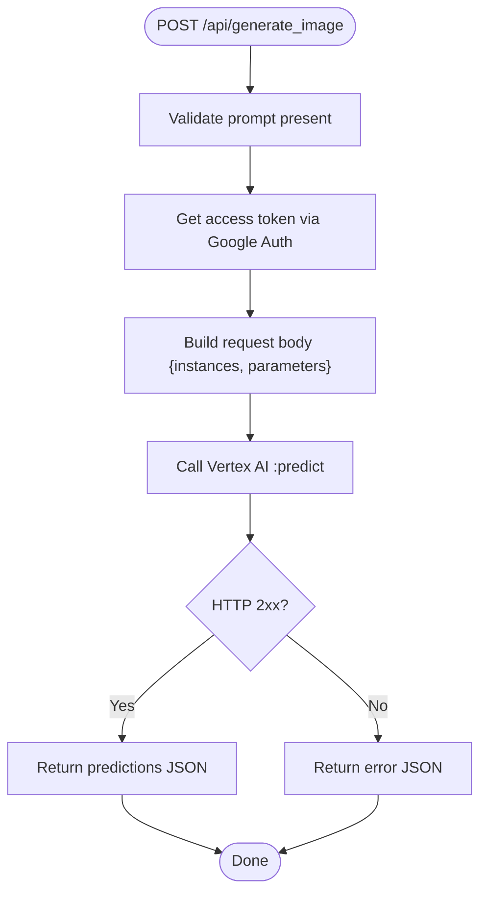
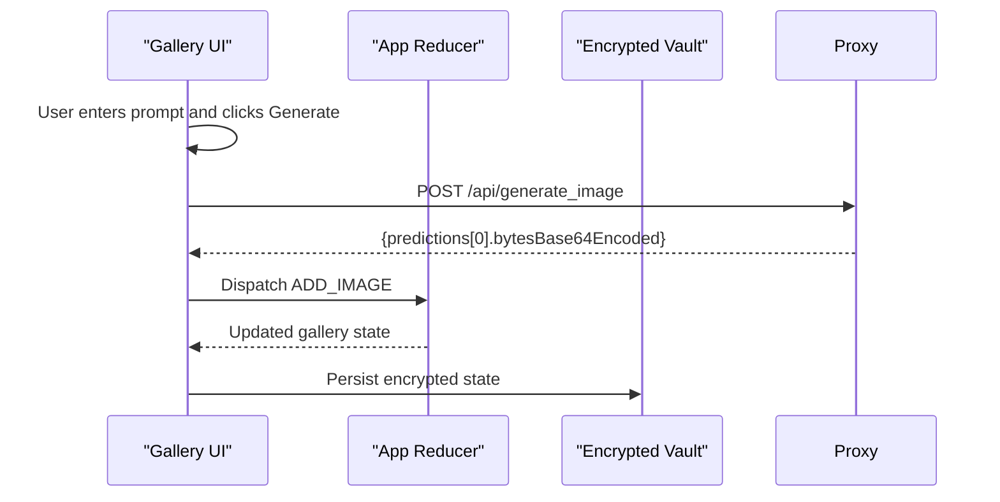
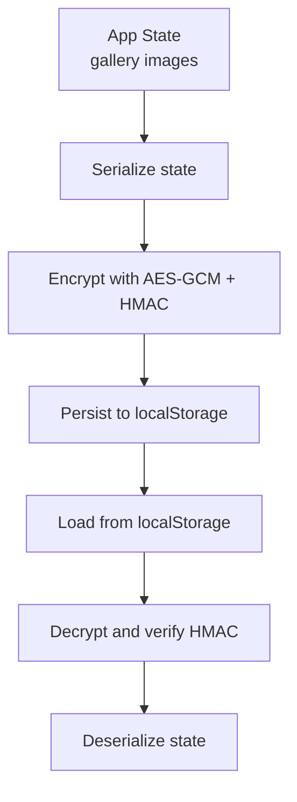
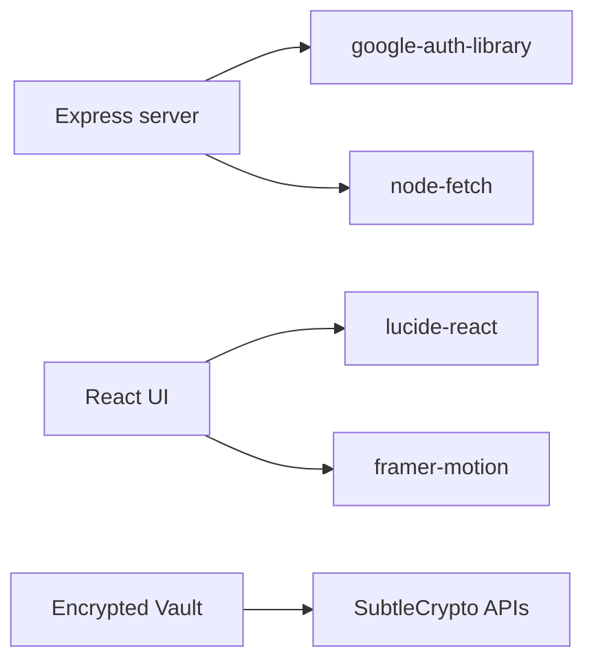

# Image Generation

<cite>
**Referenced Files in This Document**
- [server.js](file://server.js)
- [src/components/VaultDashboard.jsx](file://src/components/VaultDashboard.jsx)
- [src/App.jsx](file://src/App.jsx)
- [src/lib/crypto.js](file://src/lib/crypto.js)
- [package.json](file://package.json)
- [Dockerfile](file://Dockerfile)
- [docker-compose.yml](file://docker-compose.yml)
</cite>

## Table of Contents
1. [Introduction](#introduction)
2. [Project Structure](#project-structure)
3. [Core Components](#core-components)
4. [Architecture Overview](#architecture-overview)
5. [Detailed Component Analysis](#detailed-component-analysis)
6. [Dependency Analysis](#dependency-analysis)
7. [Performance Considerations](#performance-considerations)
8. [Troubleshooting Guide](#troubleshooting-guide)
9. [Conclusion](#conclusion)
10. [Appendices](#appendices)

## Introduction
This document explains OMNI-TODO’s image generation capability powered by Google Cloud Vertex AI. It covers:
- How user prompts are processed and transformed into structured image generation requests
- Integration with Google Cloud Vertex AI API, including authentication and request formatting
- Response handling for processed image data and error scenarios
- The Express server proxy configuration that securely routes requests to Google Cloud services
- API endpoint specifications, request/response schemas, and rate limiting considerations
- Image storage and retrieval mechanisms within the application’s encrypted vault system

## Project Structure
The image generation feature spans the frontend UI, the Express proxy server, and the encrypted vault storage:
- Frontend: A gallery view allows users to submit prompts and displays generated images
- Backend: An Express server authenticates with Google Cloud and forwards requests to Vertex AI
- Storage: Generated images are stored in-memory within the app state and persisted via the encrypted vault

**Diagram sources**
- [server.js:83-129](file://server.js#L83-L129)
- [src/components/VaultDashboard.jsx:1042-1186](file://src/components/VaultDashboard.jsx#L1042-L1186)
- [src/App.jsx:295-306](file://src/App.jsx#L295-L306)
- [src/lib/crypto.js:43-60](file://src/lib/crypto.js#L43-L60)

**Section sources**
- [server.js:1-135](file://server.js#L1-L135)
- [src/components/VaultDashboard.jsx:1035-1186](file://src/components/VaultDashboard.jsx#L1035-L1186)
- [src/App.jsx:265-306](file://src/App.jsx#L265-L306)
- [src/lib/crypto.js:1-112](file://src/lib/crypto.js#L1-L112)

## Core Components
- Express Proxy Server: Provides secure routing to Vertex AI, handles authentication, and returns image data
- Frontend Gallery View: Captures user prompts, submits them to the proxy, and renders generated images
- App State: Manages the gallery images and integrates with the encrypted vault for persistence
- Encrypted Vault: Stores the application state (including generated images) in an encrypted form

Key responsibilities:
- Prompt processing: The frontend validates the prompt and sends it to the proxy
- Authentication: The proxy obtains a Google OAuth access token and attaches it to Vertex AI requests
- Request formatting: The proxy constructs the Vertex AI predict request body
- Response handling: The proxy parses Vertex AI responses and forwards them to the frontend
- Storage: Images are stored in the app state and persisted via the encrypted vault

**Section sources**
- [server.js:83-129](file://server.js#L83-L129)
- [src/components/VaultDashboard.jsx:1042-1186](file://src/components/VaultDashboard.jsx#L1042-L1186)
- [src/App.jsx:295-306](file://src/App.jsx#L295-L306)
- [src/lib/crypto.js:43-60](file://src/lib/crypto.js#L43-L60)

## Architecture Overview
The image generation pipeline follows a client-server model:
- The frontend triggers generation via a POST to the proxy endpoint
- The proxy authenticates with Google Cloud and forwards the request to Vertex AI
- On success, the proxy returns the image data; on failure, it returns an error
- The frontend stores the image in the app state and persists it via the encrypted vault

**Diagram sources**
- [src/components/VaultDashboard.jsx:1042-1186](file://src/components/VaultDashboard.jsx#L1042-L1186)
- [server.js:83-129](file://server.js#L83-L129)
- [src/lib/crypto.js:43-60](file://src/lib/crypto.js#L43-L60)

## Detailed Component Analysis

### Express Proxy Server
The proxy exposes two endpoints:
- `/api/omni`: Routes to a legacy OMNI service (not covered here)
- `/api/generate_image`: Handles image generation requests to Vertex AI

Processing logic:
- Validates presence of the prompt
- Obtains an access token via Google Auth
- Builds the Vertex AI request body with instances and parameters
- Sends the request to Vertex AI and returns the response or error

**Diagram sources**
- [server.js:83-129](file://server.js#L83-L129)

**Section sources**
- [server.js:83-129](file://server.js#L83-L129)

### Frontend Gallery View
The gallery view manages:
- Prompt input and submission
- Loading and error states
- Rendering generated images
- Deleting images
- Expanding images in a modal

On successful generation:
- The frontend extracts the base64-encoded image bytes from the response
- It dispatches an action to add the image to the gallery state
- The image is displayed as a thumbnail and can be expanded

**Diagram sources**
- [src/components/VaultDashboard.jsx:1042-1186](file://src/components/VaultDashboard.jsx#L1042-L1186)
- [src/App.jsx:295-306](file://src/App.jsx#L295-L306)
- [src/lib/crypto.js:43-60](file://src/lib/crypto.js#L43-L60)

**Section sources**
- [src/components/VaultDashboard.jsx:1035-1186](file://src/components/VaultDashboard.jsx#L1035-L1186)
- [src/App.jsx:295-306](file://src/App.jsx#L295-L306)

### Encrypted Vault Storage
The vault persists the application state (including generated images) using:
- PBKDF2-derived keys
- AES-GCM for encryption
- HMAC-SHA-256 for integrity
- Local storage for persistence

The gallery images are stored in the app state and serialized to the vault for long-term persistence.

**Diagram sources**
- [src/lib/crypto.js:20-38](file://src/lib/crypto.js#L20-L38)
- [src/lib/crypto.js:43-60](file://src/lib/crypto.js#L43-L60)

**Section sources**
- [src/lib/crypto.js:1-112](file://src/lib/crypto.js#L1-L112)
- [src/App.jsx:326-340](file://src/App.jsx#L326-L340)

## Dependency Analysis
External libraries and integrations:
- Express: HTTP server and CORS support
- google-auth-library: Google Cloud authentication
- node-fetch: HTTP client for Vertex AI requests
- react, framer-motion, lucide-react: UI framework and icons

**Diagram sources**
- [package.json:12-24](file://package.json#L12-L24)
- [server.js:1-16](file://server.js#L1-L16)

**Section sources**
- [package.json:12-24](file://package.json#L12-L24)
- [server.js:1-16](file://server.js#L1-L16)

## Performance Considerations
- Authentication overhead: Access token acquisition occurs per request; consider caching tokens if latency becomes an issue
- Request batching: Vertex AI supports batched instances; current implementation sends single-instance requests
- Response parsing: Base64 decoding happens in the browser; large images increase memory usage
- State updates: Frequent state updates can trigger re-renders; consider debouncing or virtualization for large galleries

[No sources needed since this section provides general guidance]

## Troubleshooting Guide
Common issues and resolutions:
- Missing prompt: The proxy returns a 400 error if the prompt is absent
- Authentication failures: Ensure the environment provides valid Google Cloud credentials; the proxy uses the default credential chain
- Vertex AI errors: The proxy logs and returns the upstream error; inspect the response details for specifics
- Frontend rendering issues: Verify the response contains the expected base64 image field; otherwise, the UI throws an error

**Section sources**
- [server.js:87-89](file://server.js#L87-L89)
- [server.js:118-121](file://server.js#L118-L121)
- [src/components/VaultDashboard.jsx:1056-1075](file://src/components/VaultDashboard.jsx#L1056-L1075)

## Conclusion
OMNI-TODO’s image generation feature integrates a straightforward frontend gallery with a secure Express proxy that authenticates with Google Cloud and interacts with Vertex AI. Generated images are stored in the app state and persisted via an encrypted vault, ensuring confidentiality and integrity. While the current implementation focuses on simplicity, future enhancements could include request batching, token caching, and improved error handling.

[No sources needed since this section summarizes without analyzing specific files]

## Appendices

### API Endpoints

- POST /api/generate_image
  - Purpose: Generate an image from a text prompt
  - Request body:
    - prompt: string (required)
  - Response body:
    - predictions: array of objects containing:
      - bytesBase64Encoded: string (base64-encoded PNG bytes)
  - Status codes:
    - 200 OK: Successful generation
    - 400 Bad Request: Missing prompt
    - 500 Internal Server Error: Proxy or Vertex AI error

**Section sources**
- [server.js:83-129](file://server.js#L83-L129)
- [src/components/VaultDashboard.jsx:1042-1186](file://src/components/VaultDashboard.jsx#L1042-L1186)

### Authentication Flow
- The proxy uses google-auth-library to obtain an access token with the Cloud Platform scope
- The token is attached to Vertex AI requests via the Authorization header

**Section sources**
- [server.js:14-16](file://server.js#L14-L16)
- [server.js:91-93](file://server.js#L91-L93)
- [server.js:110](file://server.js#L110)

### Rate Limiting Considerations
- No explicit rate limiting is implemented in the proxy or frontend
- Vertex AI may enforce quotas; monitor response status and implement client-side retries with backoff if needed

[No sources needed since this section provides general guidance]

### Containerization Notes
- The Dockerfile installs the Google Cloud SDK and runs both the proxy server and the Vite dev server
- Environment variables and credentials are expected to be mounted or configured appropriately

**Section sources**
- [Dockerfile:10-12](file://Dockerfile#L10-L12)
- [Dockerfile:31](file://Dockerfile#L31)
- [docker-compose.yml:12-14](file://docker-compose.yml#L12-L14)