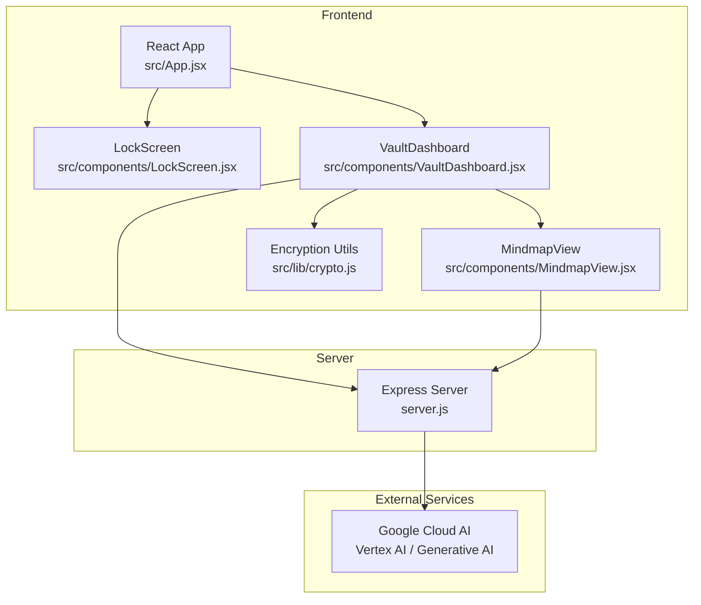
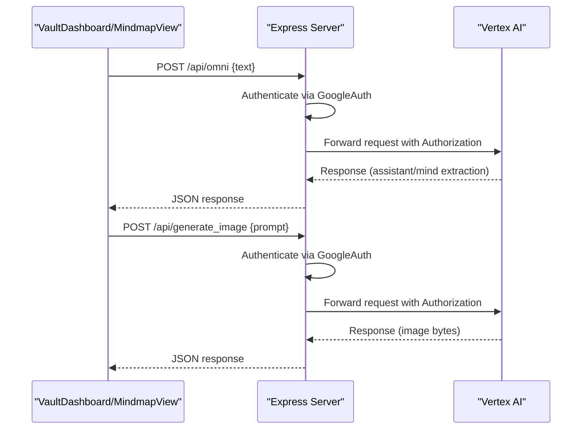
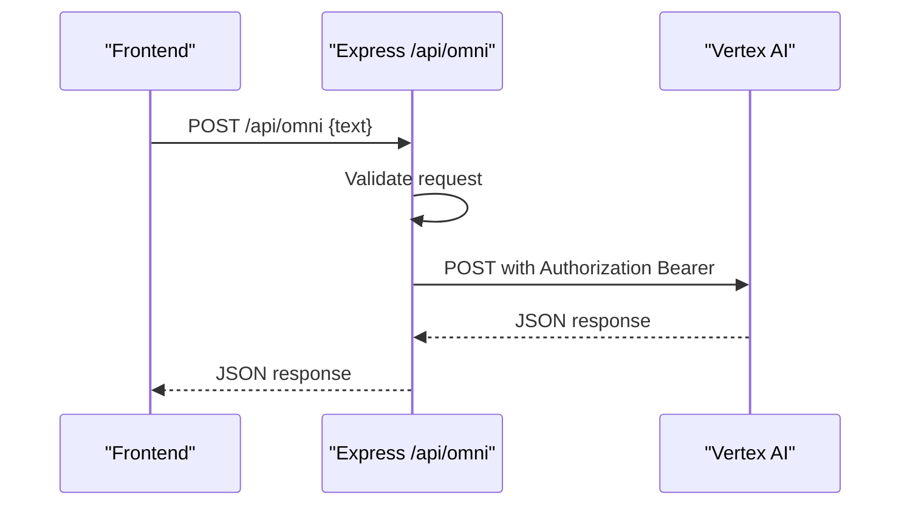
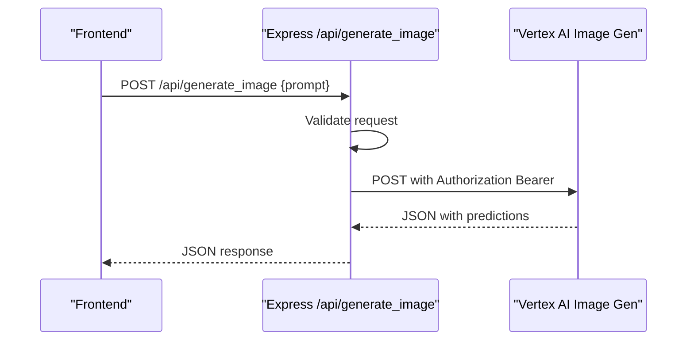
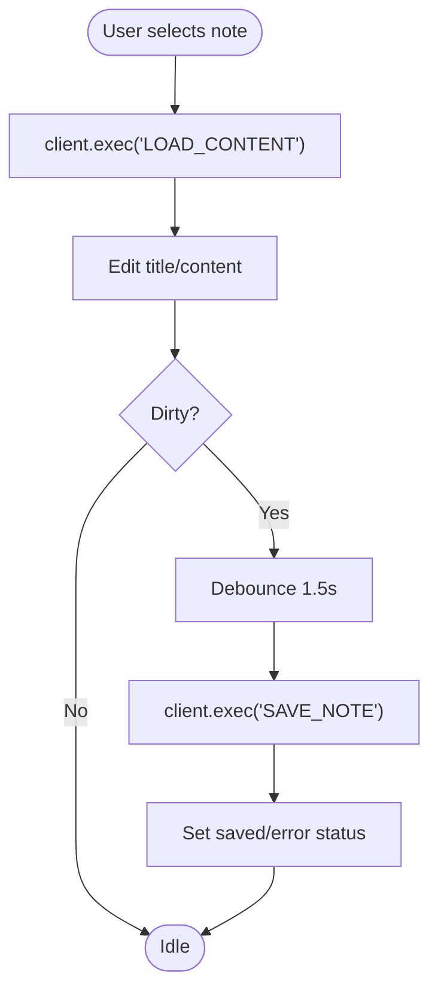
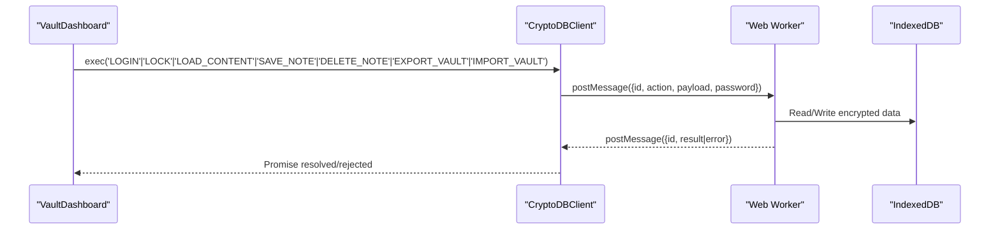
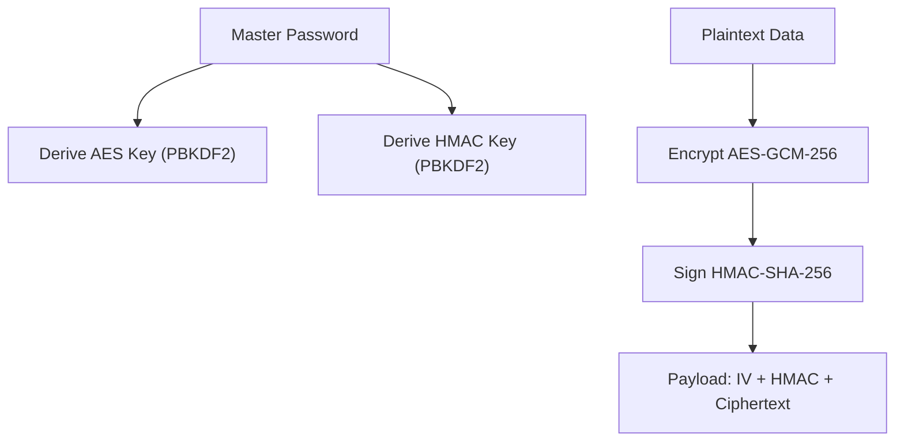
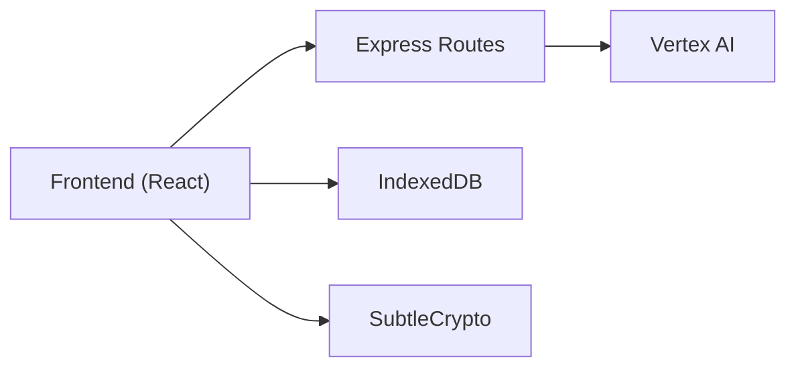

# API Reference

<cite>
**Referenced Files in This Document**
- [server.js](file://server.js)
- [package.json](file://package.json)
- [src/App.jsx](file://src/App.jsx)
- [src/components/LockScreen.jsx](file://src/components/LockScreen.jsx)
- [src/components/VaultDashboard.jsx](file://src/components/VaultDashboard.jsx)
- [src/components/MindmapView.jsx](file://src/components/MindmapView.jsx)
- [src/lib/crypto.js](file://src/lib/crypto.js)
</cite>

## Table of Contents
1. [Introduction](#introduction)
2. [Project Structure](#project-structure)
3. [Core Components](#core-components)
4. [Architecture Overview](#architecture-overview)
5. [Detailed Component Analysis](#detailed-component-analysis)
6. [Dependency Analysis](#dependency-analysis)
7. [Performance Considerations](#performance-considerations)
8. [Troubleshooting Guide](#troubleshooting-guide)
9. [Conclusion](#conclusion)
10. [Appendices](#appendices)

## Introduction
This document provides a comprehensive API reference for OMNI-TODO’s public interfaces and internal service integrations. It covers:
- Express server routes for AI content extraction and image generation
- Frontend component APIs, state management, and utility methods
- Authentication endpoints and data access patterns
- Service integration points to external AI platforms
- Web Worker communication APIs, IndexedDB access methods, and encryption service interfaces
- HTTP methods, URL patterns, request/response schemas, and error handling strategies
- Rate limiting, security considerations, and versioning information

## Project Structure
OMNI-TODO consists of:
- A frontend built with React and Vite
- A small Express proxy server for secure access to external AI services
- A Web Worker-based encrypted vault with IndexedDB persistence
- Local encryption utilities for file-based vaults

**Diagram sources**
- [server.js:1-135](file://server.js#L1-L135)
- [src/App.jsx:166-190](file://src/App.jsx#L166-L190)
- [src/components/VaultDashboard.jsx:786-818](file://src/components/VaultDashboard.jsx#L786-L818)
- [src/components/MindmapView.jsx:95-99](file://src/components/MindmapView.jsx#L95-L99)

**Section sources**
- [server.js:1-135](file://server.js#L1-L135)
- [src/App.jsx:166-190](file://src/App.jsx#L166-L190)
- [src/components/VaultDashboard.jsx:786-818](file://src/components/VaultDashboard.jsx#L786-L818)
- [src/components/MindmapView.jsx:95-99](file://src/components/MindmapView.jsx#L95-L99)

## Core Components
- Express server routes:
  - POST /api/omni: Proxies requests to Vertex AI for content extraction and assistant responses
  - POST /api/generate_image: Proxies requests to Vertex AI Image Generation for image creation
- Frontend components:
  - LockScreen: Handles master password entry and duress PIN behavior
  - VaultDashboard: Manages state, tabs, and integration with the encrypted vault and external APIs
  - MindmapView: Generates mindmaps from text using the OMNI endpoint
- Encryption and storage:
  - Web Worker-based CryptoDBClient with IndexedDB-backed encrypted vault
  - Local encryption utilities for file-based vaults

**Section sources**
- [server.js:21-81](file://server.js#L21-L81)
- [server.js:83-129](file://server.js#L83-L129)
- [src/components/LockScreen.jsx:5-91](file://src/components/LockScreen.jsx#L5-L91)
- [src/components/VaultDashboard.jsx:1389-1540](file://src/components/VaultDashboard.jsx#L1389-L1540)
- [src/components/MindmapView.jsx:7-310](file://src/components/MindmapView.jsx#L7-L310)
- [src/App.jsx:166-190](file://src/App.jsx#L166-L190)
- [src/lib/crypto.js:1-112](file://src/lib/crypto.js#L1-L112)

## Architecture Overview
The system integrates a React frontend with an Express proxy server that authenticates and forwards requests to Google Cloud AI services. The frontend also manages a secure, encrypted vault using a Web Worker and IndexedDB, and supports local file-based vaults.

**Diagram sources**
- [server.js:21-81](file://server.js#L21-L81)
- [server.js:83-129](file://server.js#L83-L129)
- [src/components/VaultDashboard.jsx:786-818](file://src/components/VaultDashboard.jsx#L786-L818)
- [src/components/MindmapView.jsx:95-99](file://src/components/MindmapView.jsx#L95-L99)

## Detailed Component Analysis

### Express Routes

#### POST /api/omni
- Purpose: Accepts user text and returns AI-assisted content extraction or assistant responses.
- Request body:
  - text: string (required)
- Response:
  - On success: JSON returned from Vertex AI
  - On failure: JSON with error field and optional details
- Error handling:
  - 400 Bad Request if text is missing
  - 500 Internal Server Error for proxy failures
- Security:
  - Uses GoogleAuth with cloud-platform scope
  - Fetches an access token and forwards Authorization header

**Diagram sources**
- [server.js:21-81](file://server.js#L21-L81)

**Section sources**
- [server.js:21-81](file://server.js#L21-L81)

#### POST /api/generate_image
- Purpose: Generates images from prompts using Vertex AI Image Generation.
- Request body:
  - prompt: string (required)
- Response:
  - On success: JSON containing predictions with base64-encoded image bytes
  - On failure: JSON with error field and optional details
- Error handling:
  - 400 Bad Request if prompt is missing
  - 500 Internal Server Error for proxy failures
- Security:
  - Uses GoogleAuth with cloud-platform scope
  - Fetches an access token and forwards Authorization header

**Diagram sources**
- [server.js:83-129](file://server.js#L83-L129)

**Section sources**
- [server.js:83-129](file://server.js#L83-L129)

### Frontend Component APIs

#### LockScreen
- Props:
  - onUnlock: function (password -> Promise<void>)
  - error: string (optional)
- Behavior:
  - Captures master password input
  - Submits password to unlock vault
  - Displays errors and busy states during unlock

**Section sources**
- [src/components/LockScreen.jsx:5-91](file://src/components/LockScreen.jsx#L5-L91)

#### VaultDashboard
- Props:
  - client: CryptoDBClient instance
  - initialNotes: array of note metadata
  - onLock: function
  - onNotesChange: function
- State management:
  - Tracks active tab, selected note, search, tags, saving status
  - Auto-saves note after 1.5 seconds of inactivity
- Methods:
  - createNote(): creates a new note via client
  - saveNote(): persists current note via client
  - deleteNote(id): deletes a note via client
  - handleExportVault(): exports encrypted vault file
- Integration:
  - Calls /api/omni for assistant responses
  - Calls /api/generate_image for image generation

**Diagram sources**
- [src/components/VaultDashboard.jsx:263-300](file://src/components/VaultDashboard.jsx#L263-L300)

**Section sources**
- [src/components/VaultDashboard.jsx:240-506](file://src/components/VaultDashboard.jsx#L240-L506)
- [src/components/VaultDashboard.jsx:786-818](file://src/components/VaultDashboard.jsx#L786-L818)
- [src/components/VaultDashboard.jsx:1042-1146](file://src/components/VaultDashboard.jsx#L1042-L1146)

#### MindmapView
- Props:
  - state: object (mindmaps array)
  - dispatch: function
- Methods:
  - generateWithAI(): sends prompt to /api/omni and updates mindmap nodes/edges
- Integration:
  - Calls /api/omni for AI-generated mindmap JSON

**Section sources**
- [src/components/MindmapView.jsx:7-310](file://src/components/MindmapView.jsx#L7-L310)

### Web Worker Communication APIs

#### CryptoDBClient
- Purpose: Encrypted vault operations via Web Worker and IndexedDB
- Methods:
  - exec(action, payload?, password?): Promise<any>
  - terminate(): void
- Supported actions:
  - LOGIN: Initializes session keys and loads note metadata
  - LOCK: Clears session keys
  - LOAD_CONTENT: Decrypts and returns note content
  - SAVE_NOTE: Encrypts and stores note content
  - DELETE_NOTE: Marks note deleted and clears content
  - EXPORT_VAULT: Returns encrypted vault dump
  - IMPORT_VAULT: Merges and encrypts imported vault data
- Error handling:
  - Throws on invalid payload, integrity checks, or session state

**Diagram sources**
- [src/App.jsx:166-190](file://src/App.jsx#L166-L190)

**Section sources**
- [src/App.jsx:166-190](file://src/App.jsx#L166-L190)

### IndexedDB Access Methods
- Stores:
  - meta: note metadata (id as keyPath)
  - content: encrypted note bodies (id as keyPath)
  - system: system variables (key as keyPath)
- Operations:
  - getSysVar(key) -> value
  - setSysVar(key, value)
  - getAllMeta()
  - getEncryptedContent(noteId)
  - putEncryptedContent(noteId, buffer)
  - markDeleted(noteId)
  - exportVault() -> ArrayBuffer
  - importVault(buffer) -> merged metadata

**Section sources**
- [src/App.jsx:15-28](file://src/App.jsx#L15-L28)
- [src/App.jsx:30-31](file://src/App.jsx#L30-L31)
- [src/App.jsx:74-163](file://src/App.jsx#L74-L163)

### Encryption Service Interfaces
- Master password derivation:
  - PBKDF2 with SHA-256, 100,000 iterations
  - Separate salts for AES and HMAC
- Symmetric encryption:
  - AES-GCM-256 with random IV per record
- Integrity:
  - HMAC-SHA-256 over IV + ciphertext
- File-based vault:
  - encryptData(obj, password) -> BASE1:salt:iv:ciphertext
  - decryptData(payload, password) -> object
  - saveVaultToFile(content, filename) -> Promise<boolean>

**Diagram sources**
- [src/App.jsx:33-72](file://src/App.jsx#L33-L72)
- [src/lib/crypto.js:7-38](file://src/lib/crypto.js#L7-L38)

**Section sources**
- [src/App.jsx:33-72](file://src/App.jsx#L33-L72)
- [src/lib/crypto.js:1-112](file://src/lib/crypto.js#L1-L112)

### Authentication Endpoints and Data Access Patterns
- Authentication:
  - Application Default Credentials (ADC) via GoogleAuth
  - Authorization: Bearer <access_token>
- Data access:
  - Frontend calls /api/omni and /api/generate_image
  - Backend validates inputs and proxies to Vertex AI
  - Vault operations handled locally via Web Worker and IndexedDB

**Section sources**
- [server.js:13-16](file://server.js#L13-L16)
- [server.js:21-81](file://server.js#L21-L81)
- [server.js:83-129](file://server.js#L83-L129)
- [src/components/VaultDashboard.jsx:786-818](file://src/components/VaultDashboard.jsx#L786-L818)
- [src/components/MindmapView.jsx:95-99](file://src/components/MindmapView.jsx#L95-L99)

### Service Integration Points
- Vertex AI (Generative Language):
  - Endpoint: projects/{project}/locations/{location}/apps/{app}/sessions/{session}:runSession
  - Method: POST
  - Headers: Authorization: Bearer {token}, Content-Type: application/json
- Vertex AI (Image Generation):
  - Endpoint: projects/{project}/locations/{location}/publishers/google/models/imagen-3.0-generate-001:predict
  - Method: POST
  - Headers: Authorization: Bearer {token}, Content-Type: application/json

**Section sources**
- [server.js:58-65](file://server.js#L58-L65)
- [server.js:107-114](file://server.js#L107-L114)

## Dependency Analysis
- Runtime dependencies:
  - express, cors, google-auth-library
- Frontend dependencies:
  - react, framer-motion, lucide-react, @xyflow/react

**Diagram sources**
- [package.json:12-24](file://package.json#L12-L24)
- [server.js:1-11](file://server.js#L1-L11)

**Section sources**
- [package.json:12-24](file://package.json#L12-L24)
- [server.js:1-11](file://server.js#L1-L11)

## Performance Considerations
- Auto-save debouncing: 1.5 seconds to reduce IndexedDB writes
- Web Worker offloads encryption/decryption from main thread
- Avoid unnecessary re-renders by memoizing derived data
- Minimize network calls by batching UI actions where appropriate

## Troubleshooting Guide
- /api/omni returns 400:
  - Ensure request body includes text
- /api/omni returns 500:
  - Check server logs for proxy errors and external service availability
- /api/generate_image returns 500:
  - Verify prompt presence and external service health
- Vault unlock fails:
  - Confirm master password correctness; duress PIN triggers cryptographic shredding
- Export/Import vault:
  - Ensure proper file format and matching password

**Section sources**
- [server.js:25-27](file://server.js#L25-L27)
- [server.js:87-89](file://server.js#L87-L89)
- [src/App.jsx:216-226](file://src/App.jsx#L216-L226)
- [src/components/VaultDashboard.jsx:141-171](file://src/components/VaultDashboard.jsx#L141-L171)

## Conclusion
OMNI-TODO exposes a focused set of public APIs for AI-assisted content extraction and image generation, backed by a secure, encrypted vault managed through a Web Worker and IndexedDB. The Express server centralizes authentication and request forwarding to Vertex AI, while the frontend provides a cohesive UX for note-taking, mindmapping, and media generation.

## Appendices

### HTTP Methods and URL Patterns
- POST /api/omni
- POST /api/generate_image

**Section sources**
- [server.js:21-81](file://server.js#L21-L81)
- [server.js:83-129](file://server.js#L83-L129)

### Request/Response Schemas

#### POST /api/omni
- Request: { text: string }
- Response (success): JSON from Vertex AI
- Response (error): { error: string, details?: any }

**Section sources**
- [server.js:21-81](file://server.js#L21-L81)

#### POST /api/generate_image
- Request: { prompt: string }
- Response (success): { predictions: [{ bytesBase64Encoded: string }] }
- Response (error): { error: string, details?: any }

**Section sources**
- [server.js:83-129](file://server.js#L83-L129)

### Security Considerations
- Use Application Default Credentials for authentication
- All vault data is encrypted with AES-GCM-256 and integrity-checked with HMAC-SHA-256
- IndexedDB-backed vault with optional file export/import
- Duress PIN triggers cryptographic shredding

**Section sources**
- [server.js:13-16](file://server.js#L13-L16)
- [src/App.jsx:33-72](file://src/App.jsx#L33-L72)
- [src/App.jsx:79-80](file://src/App.jsx#L79-L80)

### Versioning Information
- OMNI Core Version: 2.0.4-STABLE
- Vault Version: 3.0
- Encryption: AES-GCM-256 + HMAC-SHA-256

**Section sources**
- [src/components/VaultDashboard.jsx:231-233](file://src/components/VaultDashboard.jsx#L231-L233)
- [src/components/VaultDashboard.jsx:1380-1383](file://src/components/VaultDashboard.jsx#L1380-L1383)