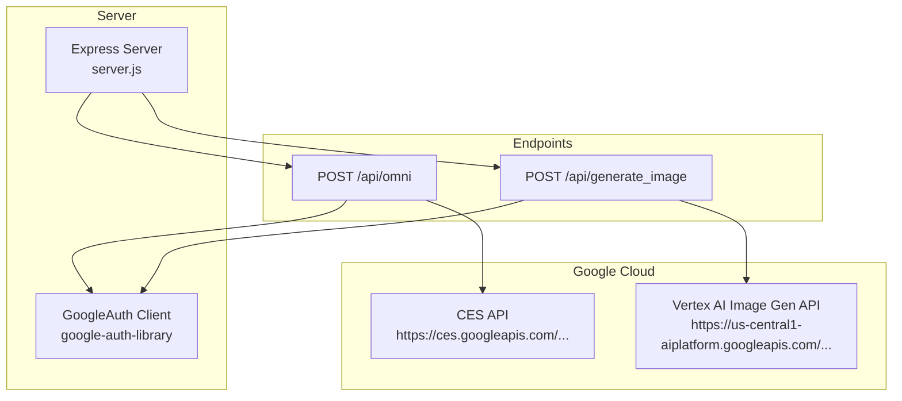
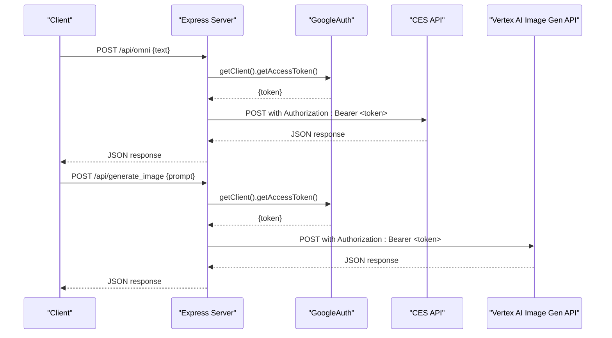
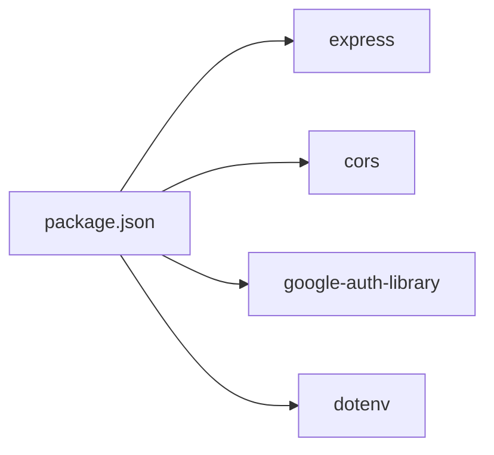

# Backend API

<cite>
**Referenced Files in This Document**
- [server.js](file://server.js)
- [package.json](file://package.json)
- [Dockerfile](file://Dockerfile)
- [docker-compose.yml](file://docker-compose.yml)
- [README.md](file://README.md)
- [VaultDashboard.jsx](file://src/components/VaultDashboard.jsx)
</cite>

## Table of Contents
1. [Introduction](#introduction)
2. [Project Structure](#project-structure)
3. [Core Components](#core-components)
4. [Architecture Overview](#architecture-overview)
5. [Detailed Component Analysis](#detailed-component-analysis)
6. [Dependency Analysis](#dependency-analysis)
7. [Performance Considerations](#performance-considerations)
8. [Troubleshooting Guide](#troubleshooting-guide)
9. [Conclusion](#conclusion)
10. [Appendices](#appendices)

## Introduction
This document describes the backend API of OMNI-TODO’s Express server, focusing on:
- The /api/omni endpoint for AI content extraction using Google Cloud CES
- The /api/generate_image endpoint for image generation via Vertex AI
- Google Cloud authentication using google-auth-library and Application Default Credentials (ADC)
- Proxy server architecture for forwarding requests to Google Cloud services
- Request validation, error handling, HTTP status codes, and response formats
- Security headers, CORS configuration, rate limiting considerations, and production deployment

## Project Structure
The backend is implemented as a small Express server with two primary routes and Google Cloud authentication integration. The frontend is React-based and includes UI elements for ADC configuration.

**Diagram sources**
- [server.js:13-135](file://server.js#L13-L135)

**Section sources**
- [server.js:1-135](file://server.js#L1-L135)
- [package.json:12-24](file://package.json#L12-L24)
- [README.md:1-17](file://README.md#L1-L17)

## Core Components
- Express server with CORS enabled globally and JSON body parsing
- GoogleAuth initialization scoped to cloud-platform
- Two proxy endpoints:
  - /api/omni: sends user text to CES and returns the response
  - /api/generate_image: sends prompt to Vertex AI Image Gen and returns the response
- Authentication flow:
  - Uses google-auth-library to obtain an access token
  - Attaches Authorization: Bearer <token> to downstream requests
- Local OMNI instruction file path used as system context for /api/omni

Key runtime behaviors:
- Input validation: checks presence of required fields (text for /api/omni, prompt for /api/generate_image)
- Error handling: logs errors and returns structured JSON with HTTP status codes
- CORS: enabled globally via cors()

**Section sources**
- [server.js:10-16](file://server.js#L10-L16)
- [server.js:21-81](file://server.js#L21-L81)
- [server.js:83-129](file://server.js#L83-L129)

## Architecture Overview
The server acts as a thin proxy to Google Cloud services. It authenticates with ADC, obtains an access token, and forwards requests to Google APIs with Authorization headers. Responses are proxied back to clients.

**Diagram sources**
- [server.js:21-81](file://server.js#L21-L81)
- [server.js:83-129](file://server.js#L83-L129)

## Detailed Component Analysis

### /api/omni Endpoint
Purpose:
- Accepts user text input and forwards it to Google Cloud CES with OMNI system instructions included as context.

Request
- Method: POST
- Path: /api/omni
- Content-Type: application/json
- Body:
  - text: string (required)

Response
- On success: JSON response from CES
- On validation error: 400 Bad Request with JSON { error: "<localized message>" }
- On Google API error: 500 Internal Server Error with JSON { error: "<localized message>", details: <response> }
- On internal server error: 500 Internal Server Error with JSON { error: "<localized message>", message: "<error.message>" }

Processing logic
- Validates presence of text
- Reads OMNI instructions from a local file path (optional; falls back to default if unreadable)
- Obtains access token via GoogleAuth
- Builds request body with config and inputs including system instructions and user text
- Sends request to CES endpoint
- Returns response or error

Security and headers
- Authorization: Bearer <token>
- Content-Type: application/json

HTTP status codes
- 200 OK on success
- 400 Bad Request on missing text
- 500 Internal Server Error on API or server errors

Example curl
- curl -X POST http://localhost:3001/api/omni -H "Content-Type: application/json" -d '{"text":"..."}'

Notes
- The endpoint reads a local instructions file path and includes it as SYSTEM_INSTRUCTIONS in the request body.

**Section sources**
- [server.js:21-81](file://server.js#L21-L81)

### /api/generate_image Endpoint
Purpose:
- Accepts a prompt and generates an image via Vertex AI Image Gen.

Request
- Method: POST
- Path: /api/generate_image
- Content-Type: application/json
- Body:
  - prompt: string (required)

Response
- On success: JSON response from Vertex AI Image Gen
- On validation error: 400 Bad Request with JSON { error: "<localized message>" }
- On Google API error: 500 Internal Server Error with JSON { error: "<localized message>", details: <response> }
- On internal server error: 500 Internal Server Error with JSON { error: "<localized message>", message: "<error.message>" }

Processing logic
- Validates presence of prompt
- Obtains access token via GoogleAuth
- Builds request body with instances and parameters (sampleCount, aspectRatio)
- Sends request to Vertex AI Image Gen endpoint
- Returns response or error

Security and headers
- Authorization: Bearer <token>
- Content-Type: application/json

HTTP status codes
- 200 OK on success
- 400 Bad Request on missing prompt
- 500 Internal Server Error on API or server errors

Example curl
- curl -X POST http://localhost:3001/api/generate_image -H "Content-Type: application/json" -d '{"prompt":"..."}'

**Section sources**
- [server.js:83-129](file://server.js#L83-L129)

### Google Cloud Authentication Flow
- Library: google-auth-library
- Scope: cloud-platform
- Token acquisition: auth.getClient().getAccessToken()
- Downstream requests: Authorization: Bearer <token>

Security considerations
- Tokens are short-lived; the library manages refresh internally
- Prefer Application Default Credentials (ADC) over manual keys
- Ensure the runtime environment has ADC configured (see Deployment section)

**Section sources**
- [server.js:13-16](file://server.js#L13-L16)
- [server.js:38-40](file://server.js#L38-L40)
- [server.js:91-93](file://server.js#L91-L93)

### Proxy Server Architecture
- Express server with cors() enabled globally
- JSON body parser enabled
- Two route handlers:
  - /api/omni: proxies to CES
  - /api/generate_image: proxies to Vertex AI Image Gen
- Error propagation: logs upstream errors and returns structured JSON with HTTP status

**Section sources**
- [server.js:10-11](file://server.js#L10-L11)
- [server.js:21-81](file://server.js#L21-L81)
- [server.js:83-129](file://server.js#L83-L129)

## Dependency Analysis
External libraries and their roles:
- express: HTTP server and routing
- cors: Cross-origin resource sharing
- google-auth-library: OAuth2 and ADC token management
- dotenv: Environment configuration (present in dependencies)

**Diagram sources**
- [package.json:12-24](file://package.json#L12-L24)

**Section sources**
- [package.json:12-24](file://package.json#L12-L24)

## Performance Considerations
- Token reuse: google-auth-library caches tokens; avoid frequent reinitialization
- Request batching: consider pooling concurrent calls to Google APIs
- Response streaming: for large images, consider streaming responses
- Concurrency limits: implement rate limiting at the application or gateway level
- Caching: cache static OMNI instructions locally to reduce disk reads

[No sources needed since this section provides general guidance]

## Troubleshooting Guide
Common issues and resolutions:
- Missing text or prompt:
  - Symptom: 400 Bad Request with error message
  - Resolution: Ensure the request body includes text or prompt respectively
- Google API errors:
  - Symptom: 500 Internal Server Error with details
  - Resolution: Inspect logs for upstream error details; verify service availability and quotas
- Authentication failures:
  - Symptom: Unauthorized or permission denied responses
  - Resolution: Verify ADC is configured; ensure the service account has cloud-platform scope
- CORS errors:
  - Symptom: Browser blocks cross-origin requests
  - Resolution: Confirm cors() is enabled; adjust origin policy if needed

**Section sources**
- [server.js:25-27](file://server.js#L25-L27)
- [server.js:87-89](file://server.js#L87-L89)
- [server.js:69-72](file://server.js#L69-L72)
- [server.js:118-121](file://server.js#L118-L121)

## Conclusion
The OMNI-TODO backend provides two essential proxy endpoints for AI content extraction and image generation via Google Cloud. It integrates securely with Google Cloud using ADC and google-auth-library, validates inputs, and returns structured error responses. For production, ensure ADC is configured, implement rate limiting, and consider caching and concurrency controls.

[No sources needed since this section summarizes without analyzing specific files]

## Appendices

### CORS Configuration
- Enabled globally via cors() middleware
- No explicit origin restrictions; adjust as needed for production environments

**Section sources**
- [server.js:10](file://server.js#L10)

### Security Headers
- No explicit security headers are set in the server
- Recommended additions for production:
  - Content-Security-Policy
  - Strict-Transport-Security
  - X-Content-Type-Options
  - X-Frame-Options
  - Referrer-Policy

[No sources needed since this section provides general guidance]

### Rate Limiting Considerations
- Not implemented in the server
- Recommended approaches:
  - In-memory or Redis-based counters
  - Gateway-level enforcement
  - Per-user or per-token limits

[No sources needed since this section provides general guidance]

### Production Deployment Considerations
- Containerization:
  - Dockerfile installs Node and Google Cloud SDK; exposes ports 5173 and 3001
  - Runs both the Express server and Vite dev server
- Compose:
  - docker-compose.yml maps host ports to container ports and mounts volumes
- ADC setup:
  - The frontend includes UI guidance for setting up ADC via a script
  - Ensure the runtime environment has ADC configured (e.g., service account, workload identity)

**Section sources**
- [Dockerfile:1-32](file://Dockerfile#L1-L32)
- [docker-compose.yml:1-18](file://docker-compose.yml#L1-L18)
- [VaultDashboard.jsx:1305-1320](file://src/components/VaultDashboard.jsx#L1305-L1320)

### Example curl Commands
- /api/omni
  - curl -X POST http://localhost:3001/api/omni -H "Content-Type: application/json" -d '{"text":"..."}'
- /api/generate_image
  - curl -X POST http://localhost:3001/api/generate_image -H "Content-Type: application/json" -d '{"prompt":"..."}'

[No sources needed since this section provides general guidance]