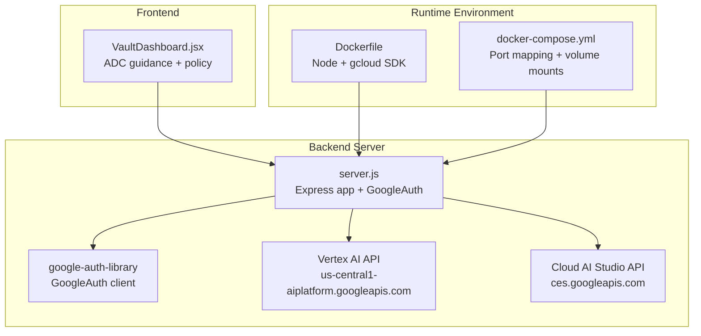
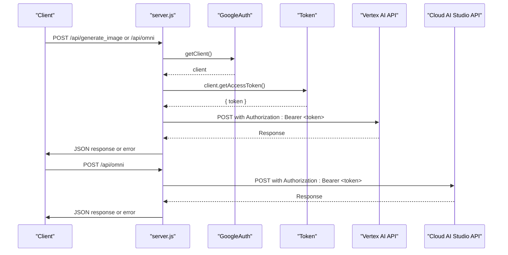
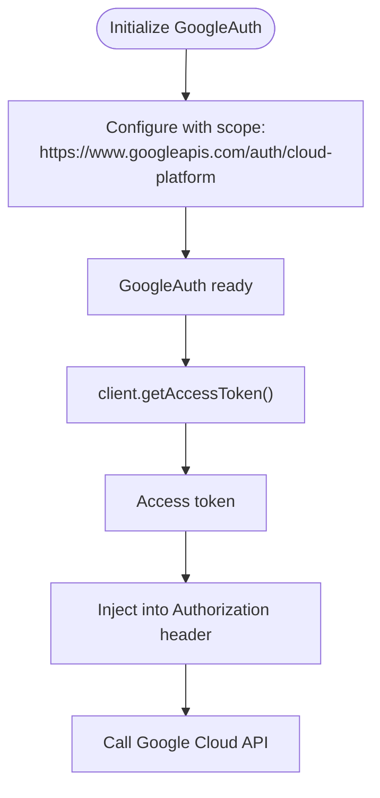
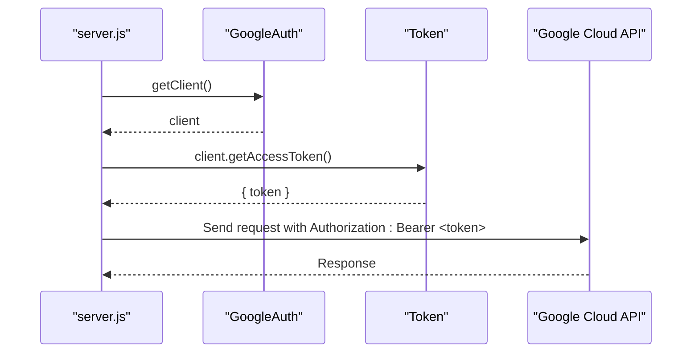
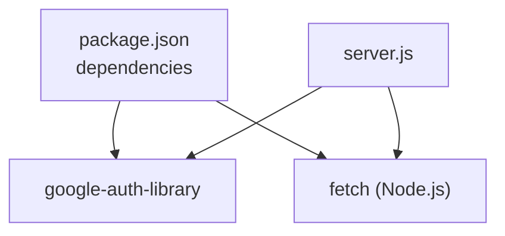

# Google Cloud Authentication

<cite>
**Referenced Files in This Document**
- [server.js](file://server.js)
- [package.json](file://package.json)
- [docker-compose.yml](file://docker-compose.yml)
- [Dockerfile](file://Dockerfile)
- [VaultDashboard.jsx](file://src/components/VaultDashboard.jsx)
</cite>

## Table of Contents
1. [Introduction](#introduction)
2. [Project Structure](#project-structure)
3. [Core Components](#core-components)
4. [Architecture Overview](#architecture-overview)
5. [Detailed Component Analysis](#detailed-component-analysis)
6. [Dependency Analysis](#dependency-analysis)
7. [Performance Considerations](#performance-considerations)
8. [Troubleshooting Guide](#troubleshooting-guide)
9. [Conclusion](#conclusion)

## Introduction
This document explains the Google Cloud authentication and authorization implementation in the backend server. The backend uses the google-auth-library to acquire OAuth 2.0 access tokens via Application Default Credentials (ADC) and injects them into outbound API requests to Google Cloud services such as Vertex AI and Cloud AI Studio. The implementation demonstrates initialization of the GoogleAuth client, token acquisition, and bearer token injection into HTTP requests. It also covers service account requirements, environment configuration, credential management, middleware-like patterns, token refresh behavior, error handling, and operational guidance for local development and production deployment.

## Project Structure
The authentication implementation resides in the backend server file and integrates with the runtime environment through Docker and docker-compose. The frontend includes a dashboard component that documents ADC usage and security policy enforcement.

**Diagram sources**
- [server.js:1-135](file://server.js#L1-L135)
- [Dockerfile:1-32](file://Dockerfile#L1-L32)
- [docker-compose.yml:1-18](file://docker-compose.yml#L1-L18)
- [VaultDashboard.jsx:1264-1322](file://src/components/VaultDashboard.jsx#L1264-L1322)

**Section sources**
- [server.js:1-135](file://server.js#L1-L135)
- [Dockerfile:1-32](file://Dockerfile#L1-L32)
- [docker-compose.yml:1-18](file://docker-compose.yml#L1-L18)
- [VaultDashboard.jsx:1264-1322](file://src/components/VaultDashboard.jsx#L1264-L1322)

## Core Components
- GoogleAuth initialization: Creates a GoogleAuth client configured with a specific OAuth 2.0 scope for Cloud Platform resources.
- Token acquisition: Retrieves an access token from the initialized client for use in Authorization headers.
- Request injection: Adds the Bearer token to outgoing HTTP requests to Google Cloud APIs.
- Error handling: Centralized try/catch around API endpoints to log and respond with structured error messages.

Key implementation references:
- GoogleAuth initialization with scope: [server.js:14-16](file://server.js#L14-L16)
- Token retrieval and request injection: [server.js:38-40](file://server.js#L38-L40), [server.js:91-93](file://server.js#L91-L93)
- Bearer token header usage: [server.js:60-62](file://server.js#L60-L62), [server.js:110-112](file://server.js#L110-L112)

**Section sources**
- [server.js:14-16](file://server.js#L14-L16)
- [server.js:38-40](file://server.js#L38-L40)
- [server.js:60-62](file://server.js#L60-L62)
- [server.js:91-93](file://server.js#L91-L93)
- [server.js:110-112](file://server.js#L110-L112)

## Architecture Overview
The backend server acts as a proxy for Google Cloud services. It authenticates using ADC, acquires tokens, and forwards requests to Vertex AI and Cloud AI Studio APIs. The flow is consistent across endpoints: initialize GoogleAuth, get a token, construct the request body, send the request with Authorization: Bearer, and handle responses and errors.

**Diagram sources**
- [server.js:21-81](file://server.js#L21-L81)
- [server.js:83-129](file://server.js#L83-L129)

**Section sources**
- [server.js:21-81](file://server.js#L21-L81)
- [server.js:83-129](file://server.js#L83-L129)

## Detailed Component Analysis

### GoogleAuth Initialization and Scope Management
- Initialization: A GoogleAuth instance is created with a Cloud Platform scope, enabling access to Google Cloud APIs.
- Scope: The configured scope is used implicitly when acquiring tokens via the client.
- Client usage: The same client instance is reused across endpoints to minimize overhead.

Implementation references:
- Initialization and scope: [server.js:14-16](file://server.js#L14-L16)
- Client reuse: [server.js:38-39](file://server.js#L38-L39), [server.js:91-92](file://server.js#L91-L92)

**Diagram sources**
- [server.js:14-16](file://server.js#L14-L16)
- [server.js:38-40](file://server.js#L38-L40)

**Section sources**
- [server.js:14-16](file://server.js#L14-L16)
- [server.js:38-40](file://server.js#L38-L40)

### Token Acquisition Workflow
- Token retrieval: Each request obtains a fresh access token from the GoogleAuth client before making outbound calls.
- Token usage: The returned token is attached as a Bearer token in the Authorization header.
- Endpoint consistency: Both image generation and OMNI endpoints follow the same token acquisition and injection pattern.

Implementation references:
- Token acquisition and injection (image endpoint): [server.js:91-93](file://server.js#L91-L93), [server.js:110-112](file://server.js#L110-L112)
- Token acquisition and injection (OMNI endpoint): [server.js:38-40](file://server.js#L38-L40), [server.js:60-62](file://server.js#L60-L62)

**Diagram sources**
- [server.js:38-40](file://server.js#L38-L40)
- [server.js:91-93](file://server.js#L91-L93)
- [server.js:110-112](file://server.js#L110-L112)
- [server.js:60-62](file://server.js#L60-L62)

**Section sources**
- [server.js:38-40](file://server.js#L38-L40)
- [server.js:91-93](file://server.js#L91-L93)
- [server.js:110-112](file://server.js#L110-L112)
- [server.js:60-62](file://server.js#L60-L62)

### Bearer Token Injection into API Requests
- Header format: Authorization: Bearer <token>
- Applied consistently across both endpoints
- Content-Type: application/json is included alongside the Authorization header

Implementation references:
- Image endpoint header injection: [server.js:110-112](file://server.js#L110-L112)
- OMNI endpoint header injection: [server.js:60-62](file://server.js#L60-L62)

**Section sources**
- [server.js:110-112](file://server.js#L110-L112)
- [server.js:60-62](file://server.js#L60-L62)

### Authentication Middleware Pattern
- While not a traditional Express middleware, the server follows a middleware-like pattern:
  - Initialize GoogleAuth once at startup
  - Reuse the client across request handlers
  - Centralized token acquisition per request
  - Consistent error handling and response formatting

Implementation references:
- Initialization: [server.js:14-16](file://server.js#L14-L16)
- Per-request token acquisition: [server.js:38-40](file://server.js#L38-L40), [server.js:91-93](file://server.js#L91-L93)
- Error handling: [server.js:77-80](file://server.js#L77-L80), [server.js:125-129](file://server.js#L125-L129)

**Section sources**
- [server.js:14-16](file://server.js#L14-L16)
- [server.js:38-40](file://server.js#L38-L40)
- [server.js:91-93](file://server.js#L91-L93)
- [server.js:77-80](file://server.js#L77-L80)
- [server.js:125-129](file://server.js#L125-L129)

### Token Refresh Mechanisms
- Automatic refresh: The google-auth-library manages token refresh internally when the client retrieves an access token.
- No manual refresh logic: The implementation relies on the library’s built-in token lifecycle management.

Implementation references:
- Token acquisition via client.getAccessToken(): [server.js:38-40](file://server.js#L38-L40), [server.js:91-93](file://server.js#L91-L93)

**Section sources**
- [server.js:38-40](file://server.js#L38-L40)
- [server.js:91-93](file://server.js#L91-L93)

### Error Handling for Authentication Failures
- Try/catch wrapping: All endpoint handlers are wrapped in try/catch to capture authentication and API errors.
- Logging: Errors are logged to the console with detailed messages.
- Structured responses: Endpoints return JSON with error keys and details for client consumption.
- API response validation: Non-2xx responses trigger structured error responses with details.

Implementation references:
- OMNI endpoint error handling: [server.js:77-80](file://server.js#L77-L80)
- Image endpoint error handling: [server.js:125-129](file://server.js#L125-L129)
- API response validation: [server.js:69-72](file://server.js#L69-L72), [server.js:118-121](file://server.js#L118-L121)

**Section sources**
- [server.js:77-80](file://server.js#L77-L80)
- [server.js:125-129](file://server.js#L125-L129)
- [server.js:69-72](file://server.js#L69-L72)
- [server.js:118-121](file://server.js#L118-L121)

### Service Account Requirements and Credential Management
- Application Default Credentials (ADC): The implementation relies on ADC for authentication.
- Frontend guidance: The dashboard component emphasizes ADC usage and disallows long-lived API keys due to organizational security policies.
- Container setup: The Dockerfile installs the Google Cloud SDK and sets up the environment for gcloud usage.

Implementation references:
- ADC emphasis in dashboard: [VaultDashboard.jsx:1264-1276](file://src/components/VaultDashboard.jsx#L1264-L1276)
- Security policy note (API keys disallowed): [VaultDashboard.jsx:1287-1289](file://src/components/VaultDashboard.jsx#L1287-L1289)
- ADC setup script reference: [VaultDashboard.jsx:1309-1310](file://src/components/VaultDashboard.jsx#L1309-L1310)
- Dockerfile gcloud installation: [Dockerfile:10-12](file://Dockerfile#L10-L12)

**Section sources**
- [VaultDashboard.jsx:1264-1276](file://src/components/VaultDashboard.jsx#L1264-L1276)
- [VaultDashboard.jsx:1287-1289](file://src/components/VaultDashboard.jsx#L1287-L1289)
- [VaultDashboard.jsx:1309-1310](file://src/components/VaultDashboard.jsx#L1309-L1310)
- [Dockerfile:10-12](file://Dockerfile#L10-L12)

### Environment Variable Configuration
- No explicit environment variables are referenced in the server code for authentication configuration.
- The implementation depends on ADC resolution by the google-auth-library, which typically reads from:
  - Default service account in Google Cloud environments
  - gcloud application default credentials on developer machines
  - Workload Identity (in Kubernetes/GKE)
- The docker-compose configuration includes commented guidance for sharing gcloud credentials from the host.

Implementation references:
- docker-compose ADC sharing guidance: [docker-compose.yml:12-14](file://docker-compose.yml#L12-L14)

**Section sources**
- [docker-compose.yml:12-14](file://docker-compose.yml#L12-L14)

### Setup Instructions

#### Local Development
- Install and configure gcloud CLI and ADC on your machine.
- Ensure the active account/service account has permissions for the target Google Cloud projects and APIs.
- Run the application locally or in Docker as configured.

References:
- ADC setup script reference in dashboard: [VaultDashboard.jsx:1309-1310](file://src/components/VaultDashboard.jsx#L1309-L1310)
- Dockerfile gcloud SDK installation: [Dockerfile:10-12](file://Dockerfile#L10-L12)
- docker-compose volume and environment configuration: [docker-compose.yml:1-18](file://docker-compose.yml#L1-L18)

#### Production Deployment
- Use a managed runtime with appropriate service account attached (e.g., Compute Engine default service account, Cloud Run service account, or Workload Identity).
- Ensure the service account has the minimum required IAM roles for Vertex AI and Cloud AI Studio access.
- Keep the application container lean and rely on ADC for credential resolution.

References:
- GoogleAuth dependency: [package.json:18-18](file://package.json#L18-L18)
- Dockerfile base image and exposure: [Dockerfile:1-32](file://Dockerfile#L1-L32)

**Section sources**
- [VaultDashboard.jsx:1309-1310](file://src/components/VaultDashboard.jsx#L1309-L1310)
- [Dockerfile:10-12](file://Dockerfile#L10-L12)
- [docker-compose.yml:1-18](file://docker-compose.yml#L1-L18)
- [package.json:18-18](file://package.json#L18-L18)

### Security Best Practices
- Prefer ADC over long-lived API keys; the dashboard enforces this policy.
- Limit IAM permissions to the principle of least privilege.
- Use HTTPS and secure network policies for outbound API calls.
- Monitor and rotate service account keys if used externally (not recommended per the dashboard policy).

References:
- ADC recommendation and policy: [VaultDashboard.jsx:1264-1276](file://src/components/VaultDashboard.jsx#L1264-L1276)
- API key disallowed policy: [VaultDashboard.jsx:1287-1289](file://src/components/VaultDashboard.jsx#L1287-L1289)

**Section sources**
- [VaultDashboard.jsx:1264-1276](file://src/components/VaultDashboard.jsx#L1264-L1276)
- [VaultDashboard.jsx:1287-1289](file://src/components/VaultDashboard.jsx#L1287-L1289)

### Examples of Proper Authentication Header Formatting
- Authorization: Bearer <access_token>
- Used in both endpoints for Vertex AI and Cloud AI Studio calls.

References:
- Image endpoint header: [server.js:110-112](file://server.js#L110-L112)
- OMNI endpoint header: [server.js:60-62](file://server.js#L60-L62)

**Section sources**
- [server.js:110-112](file://server.js#L110-L112)
- [server.js:60-62](file://server.js#L60-L62)

## Dependency Analysis
The authentication implementation depends on the google-auth-library for token management and Node.js fetch for HTTP requests. The runtime environment is containerized with Docker and orchestrated via docker-compose.

**Diagram sources**
- [package.json:18-18](file://package.json#L18-L18)
- [server.js:3-3](file://server.js#L3-L3)

**Section sources**
- [package.json:18-18](file://package.json#L18-L18)
- [server.js:3-3](file://server.js#L3-L3)

## Performance Considerations
- Token acquisition cost: Each request acquires a token via the GoogleAuth client. Consider implementing token caching at the application level if endpoints are frequently invoked to reduce repeated token exchanges.
- Concurrency: The current implementation performs token acquisition per request. For high-throughput scenarios, evaluate connection pooling and request batching where applicable.
- Network latency: Outbound calls to Google Cloud APIs introduce latency; ensure timeouts and retries are configured appropriately.

[No sources needed since this section provides general guidance]

## Troubleshooting Guide
Common issues and resolutions:

- Authentication failures
  - Verify ADC is properly configured on the host or container.
  - Confirm the active account/service account has required permissions.
  - Check that the configured scope aligns with the target APIs.

- Token acquisition errors
  - Ensure the GoogleAuth client is initialized correctly and reachable.
  - Review logs for detailed error messages emitted by the try/catch blocks.

- API response errors
  - Non-2xx responses are captured and returned with structured error details.
  - Inspect the error response body for API-specific error codes and messages.

- Docker/credential sharing
  - On Windows, follow the docker-compose guidance to run gcloud auth login inside the container if needed.
  - On Linux/Mac, consider mounting the gcloud credentials directory as shown in the commented configuration.

References:
- Error handling and logging: [server.js:77-80](file://server.js#L77-L80), [server.js:125-129](file://server.js#L125-L129)
- API response validation: [server.js:69-72](file://server.js#L69-L72), [server.js:118-121](file://server.js#L118-L121)
- docker-compose ADC guidance: [docker-compose.yml:12-14](file://docker-compose.yml#L12-L14)

**Section sources**
- [server.js:77-80](file://server.js#L77-L80)
- [server.js:125-129](file://server.js#L125-L129)
- [server.js:69-72](file://server.js#L69-L72)
- [server.js:118-121](file://server.js#L118-L121)
- [docker-compose.yml:12-14](file://docker-compose.yml#L12-L14)

## Conclusion
The backend server implements Google Cloud authentication using Application Default Credentials and the google-auth-library. It follows a consistent pattern of initializing GoogleAuth, acquiring access tokens, injecting Bearer tokens into outbound requests, and handling errors centrally. The design leverages ADC for secure credential management, aligning with organizational security policies that disallow long-lived API keys. For production, ensure appropriate service accounts and IAM permissions, and consider application-level token caching for performance optimization.