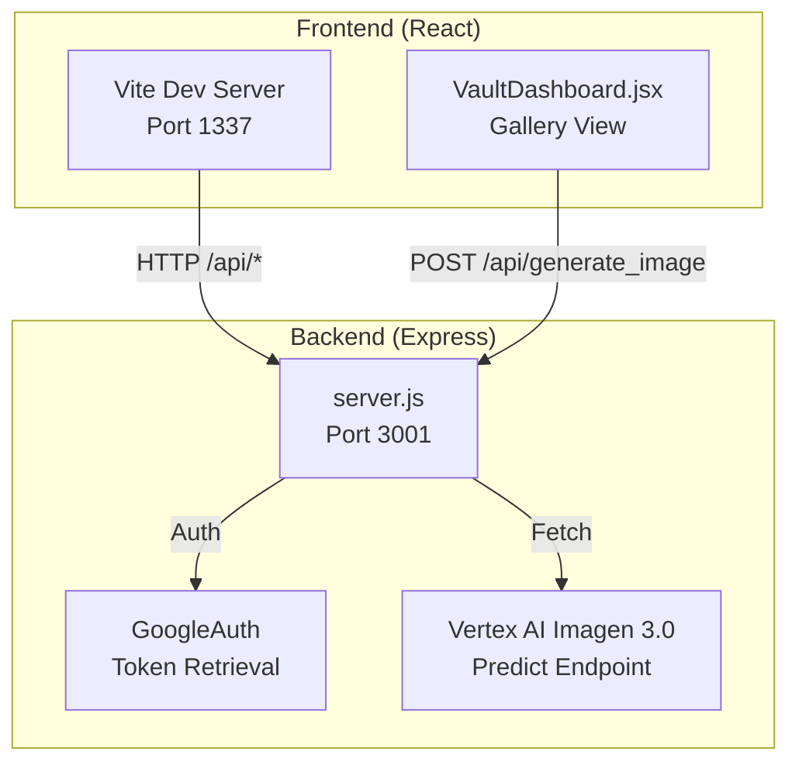
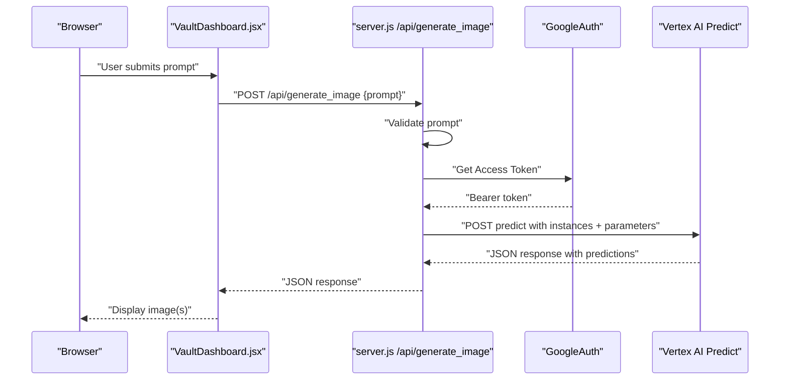
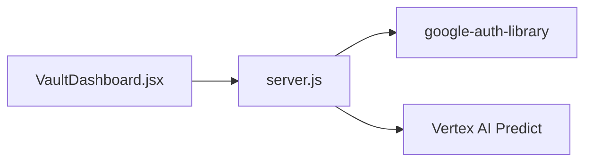

# /api/generate_image - Image Generation

<cite>
**Referenced Files in This Document**
- [server.js](file://server.js)
- [VaultDashboard.jsx](file://src/components/VaultDashboard.jsx)
- [package.json](file://package.json)
- [docker-compose.yml](file://docker-compose.yml)
- [Dockerfile](file://Dockerfile)
- [vite.config.js](file://vite.config.js)
</cite>

## Table of Contents
1. [Introduction](#introduction)
2. [Project Structure](#project-structure)
3. [Core Components](#core-components)
4. [Architecture Overview](#architecture-overview)
5. [Detailed Component Analysis](#detailed-component-analysis)
6. [Dependency Analysis](#dependency-analysis)
7. [Performance Considerations](#performance-considerations)
8. [Troubleshooting Guide](#troubleshooting-guide)
9. [Conclusion](#conclusion)
10. [Appendices](#appendices)

## Introduction
This document provides comprehensive API documentation for the POST /api/generate_image endpoint that powers AI image generation using Vertex AI’s Imagen 3.0. It covers request structure, validation, Vertex AI integration, response schema, error handling, and practical curl examples. It also includes production deployment considerations and parameter tuning guidance.

## Project Structure
The application consists of:
- A frontend built with React and Vite that sends requests to the backend.
- A Node.js/Express server that validates requests, authenticates with Google Cloud, and forwards requests to Vertex AI.
- A Dockerized development environment that exposes both the frontend and backend servers.



**Diagram sources**
- [vite.config.js:1-18](file://vite.config.js#L1-L18)
- [server.js:1-135](file://server.js#L1-L135)
- [VaultDashboard.jsx:1042-1076](file://src/components/VaultDashboard.jsx#L1042-L1076)

**Section sources**
- [vite.config.js:1-18](file://vite.config.js#L1-L18)
- [docker-compose.yml:1-17](file://docker-compose.yml#L1-L17)
- [Dockerfile:1-31](file://Dockerfile#L1-L31)

## Core Components
- Frontend trigger: The gallery view in VaultDashboard.jsx constructs a POST request to /api/generate_image with a prompt and handles the response.
- Backend handler: server.js defines /api/generate_image, validates the prompt, obtains a Google OAuth access token, and calls Vertex AI’s predict endpoint.
- Authentication: google-auth-library is used to retrieve an access token scoped to cloud-platform.
- Vertex AI integration: The server posts to the Vertex AI Imagen 3.0 predict endpoint with instances and parameters.

**Section sources**
- [VaultDashboard.jsx:1042-1076](file://src/components/VaultDashboard.jsx#L1042-L1076)
- [server.js:83-129](file://server.js#L83-L129)
- [package.json:12-24](file://package.json#L12-L24)

## Architecture Overview
The request flow for image generation:



**Diagram sources**
- [VaultDashboard.jsx:1042-1076](file://src/components/VaultDashboard.jsx#L1042-L1076)
- [server.js:83-129](file://server.js#L83-L129)

## Detailed Component Analysis

### Request Definition
- Method: POST
- Path: /api/generate_image
- Content-Type: application/json
- Body fields:
  - prompt (required): string describing the desired image.
  - samples (optional): integer controlling how many images to generate.
  - aspectRatio (optional): string representing the aspect ratio (e.g., "1:1").

Validation:
- If prompt is missing, the server responds with HTTP 400 and an error message.

Parameters currently configured in the server:
- sampleCount: 1
- aspectRatio: "1:1"

These can be extended to support dynamic values from the request body.

**Section sources**
- [server.js:83-105](file://server.js#L83-L105)
- [server.js:87-89](file://server.js#L87-L89)

### Request Body Format
- instances[0].prompt: The primary prompt string.
- parameters.sampleCount: Number of images to generate.
- parameters.aspectRatio: Aspect ratio string.

Example structure (paths):
- [server.js:95-105](file://server.js#L95-L105)

Frontend construction (paths):
- [VaultDashboard.jsx:1047-1052](file://src/components/VaultDashboard.jsx#L1047-L1052)

**Section sources**
- [server.js:95-105](file://server.js#L95-L105)
- [VaultDashboard.jsx:1047-1052](file://src/components/VaultDashboard.jsx#L1047-L1052)

### Vertex AI Integration
- Model: Imagen 3.0 (publisher: google, model: imagen-3.0-generate-001)
- Endpoint: https://us-central1-aiplatform.googleapis.com/v1/projects/{project}/locations/us-central1/publishers/google/models/imagen-3.0-generate-001:predict
- Authentication: Authorization: Bearer {access_token}
- Scopes: cloud-platform

Current project and region in the endpoint:
- Project: cerber-495808
- Location: us-central1

Note: The endpoint URL embeds project and location. For production, consider externalizing these values.

**Section sources**
- [server.js:14-16](file://server.js#L14-L16)
- [server.js:107-114](file://server.js#L107-L114)

### Response Schema
The server forwards the Vertex AI response directly. Typical fields include:
- predictions: array of prediction objects
  - bytesBase64Encoded: base64-encoded PNG bytes for the generated image

Frontend usage (paths):
- [VaultDashboard.jsx:1060-1068](file://src/components/VaultDashboard.jsx#L1060-L1068)

**Section sources**
- [server.js:116-123](file://server.js#L116-L123)
- [VaultDashboard.jsx:1060-1068](file://src/components/VaultDashboard.jsx#L1060-L1068)

### Error Handling
- Prompt validation: HTTP 400 if prompt is missing.
- Vertex AI errors: Forwarded HTTP status and error payload.
- Internal server errors: HTTP 500 with a generic message.

Error propagation (paths):
- [server.js:87-89](file://server.js#L87-L89)
- [server.js:118-121](file://server.js#L118-L121)
- [server.js:125-128](file://server.js#L125-L128)
- [VaultDashboard.jsx:1056-1058](file://src/components/VaultDashboard.jsx#L1056-L1058)

**Section sources**
- [server.js:87-89](file://server.js#L87-L89)
- [server.js:118-121](file://server.js#L118-L121)
- [server.js:125-128](file://server.js#L125-L128)
- [VaultDashboard.jsx:1056-1058](file://src/components/VaultDashboard.jsx#L1056-L1058)

### Authentication Flow
- Scope: https://www.googleapis.com/auth/cloud-platform
- Token acquisition: google-auth-library retrieves an access token for the current environment (service account or gcloud credentials)
- Environment variables: GOOGLE_APPLICATION_CREDENTIALS and related project variables are supported by the library

Environment and containerization:
- Dockerfile installs Google Cloud SDK and exposes ports for both frontend and backend.
- docker-compose shares gcloud credentials volume for Linux/Mac; Windows users may need to log in inside the container.

**Section sources**
- [server.js:14-16](file://server.js#L14-L16)
- [package.json:18](file://package.json#L18)
- [Dockerfile:10-12](file://Dockerfile#L10-L12)
- [docker-compose.yml:12-14](file://docker-compose.yml#L12-L14)

### Production Deployment Considerations
- Environment variables:
  - GOOGLE_APPLICATION_CREDENTIALS: path to service account JSON
  - GCLOUD_PROJECT or GOOGLE_CLOUD_PROJECT: project ID
- Containerization:
  - Use the provided Dockerfile and docker-compose.yml to run both frontend and backend.
  - Share gcloud credentials volume for local development.
- CORS and proxy:
  - Vite proxy routes /api to the Express server on port 3001.
- Endpoint hardcoding:
  - The Vertex AI endpoint currently embeds project and region. Externalize these values for multi-environment deployments.

**Section sources**
- [Dockerfile:10-12](file://Dockerfile#L10-L12)
- [docker-compose.yml:12-14](file://docker-compose.yml#L12-L14)
- [vite.config.js:11-16](file://vite.config.js#L11-L16)
- [server.js:107-114](file://server.js#L107-L114)

## Dependency Analysis
- Frontend depends on the backend API and displays images received from Vertex AI.
- Backend depends on google-auth-library for authentication and on Vertex AI for image generation.
- The server listens on port 3001 and is proxied by Vite on port 1337.



**Diagram sources**
- [VaultDashboard.jsx:1042-1076](file://src/components/VaultDashboard.jsx#L1042-L1076)
- [server.js:14-16](file://server.js#L14-L16)
- [server.js:107-114](file://server.js#L107-L114)

**Section sources**
- [package.json:12-24](file://package.json#L12-L24)
- [vite.config.js:11-16](file://vite.config.js#L11-L16)
- [server.js:107-114](file://server.js#L107-L114)

## Performance Considerations
- Concurrency: The current implementation generates one image per request. Increase sampleCount to generate multiple images in a single request.
- Latency: Network latency to Vertex AI and base64 decoding cost on the frontend contribute to total latency.
- Caching: Consider caching successful generations keyed by prompt and parameters to reduce repeated calls.
- Batch processing: For bulk generation, batch prompts on the client and send fewer requests.

[No sources needed since this section provides general guidance]

## Troubleshooting Guide
Common issues and resolutions:
- Missing prompt:
  - Symptom: HTTP 400 with an error message.
  - Resolution: Ensure the prompt field is present in the request body.
  - Reference: [server.js:87-89](file://server.js#L87-L89)
- Authentication failure:
  - Symptom: 401/403 from Vertex AI.
  - Resolution: Verify GOOGLE_APPLICATION_CREDENTIALS points to a valid service account JSON and that the service account has permissions for Vertex AI.
  - Reference: [server.js:14-16](file://server.js#L14-L16)
- Vertex AI errors:
  - Symptom: Non-2xx response forwarded from the server.
  - Resolution: Inspect the details in the response payload and adjust prompt or parameters.
  - Reference: [server.js:118-121](file://server.js#L118-L121)
- Internal server errors:
  - Symptom: HTTP 500.
  - Resolution: Check server logs for stack traces and environment configuration.
  - Reference: [server.js:125-128](file://server.js#L125-L128)

**Section sources**
- [server.js:87-89](file://server.js#L87-L89)
- [server.js:118-121](file://server.js#L118-L121)
- [server.js:125-128](file://server.js#L125-L128)

## Conclusion
The /api/generate_image endpoint integrates a React frontend with a Node.js backend and Vertex AI’s Imagen 3.0 to deliver prompt-driven image generation. The implementation validates inputs, authenticates via Google OAuth, and forwards requests to Vertex AI. Responses are returned to the frontend for display. For production, externalize configuration, manage credentials securely, and consider performance optimizations such as batching and caching.

[No sources needed since this section summarizes without analyzing specific files]

## Appendices

### API Definition
- Method: POST
- Path: /api/generate_image
- Headers:
  - Content-Type: application/json
- Body:
  - prompt (required): string
  - samples (optional): integer
  - aspectRatio (optional): string
- Example request (paths):
  - [VaultDashboard.jsx:1047-1052](file://src/components/VaultDashboard.jsx#L1047-L1052)
- Example response (paths):
  - [server.js:116-123](file://server.js#L116-L123)
  - [VaultDashboard.jsx:1060-1068](file://src/components/VaultDashboard.jsx#L1060-L1068)

**Section sources**
- [VaultDashboard.jsx:1047-1052](file://src/components/VaultDashboard.jsx#L1047-L1052)
- [server.js:116-123](file://server.js#L116-L123)
- [VaultDashboard.jsx:1060-1068](file://src/components/VaultDashboard.jsx#L1060-L1068)

### Curl Examples
- Test basic generation:
  ```bash
  curl -X POST http://localhost:3001/api/generate_image \
    -H "Content-Type: application/json" \
    -d '{"prompt":"a serene mountain landscape at sunset"}'
  ```
- Test with multiple samples and aspect ratio:
  ```bash
  curl -X POST http://localhost:3001/api/generate_image \
    -H "Content-Type: application/json" \
    -d '{"prompt":"minimalist interior design","samples":2,"aspectRatio":"16:9"}'
  ```

[No sources needed since this section provides general guidance]

### Parameter Tuning
- sampleCount: Increase to generate multiple variants in one request.
- aspectRatio: Adjust to match desired output proportions (e.g., "1:1", "16:9").
- Quality: Vertex AI parameters can influence quality; consider experimenting with additional parameters exposed by the model.

[No sources needed since this section provides general guidance]