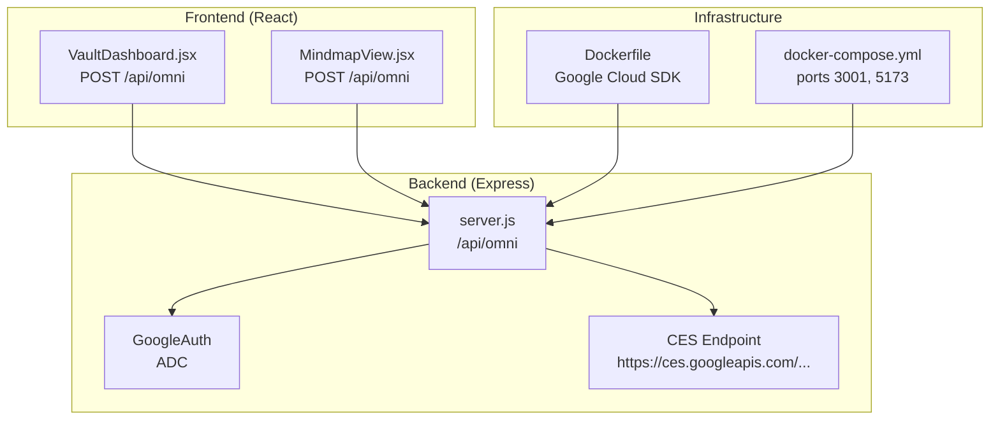
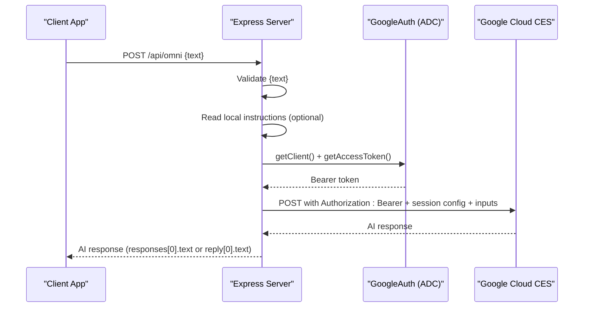
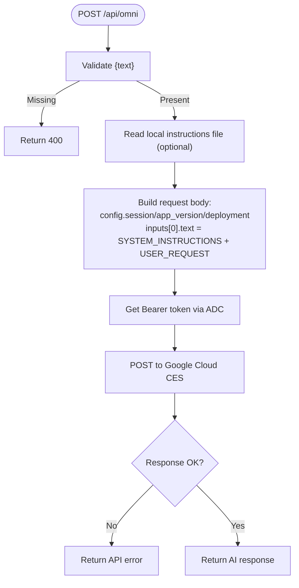
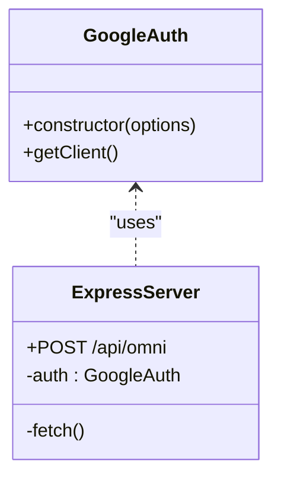
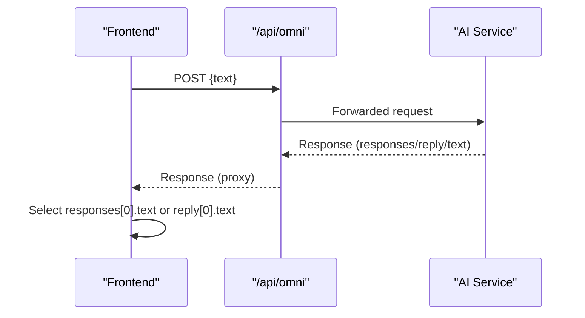
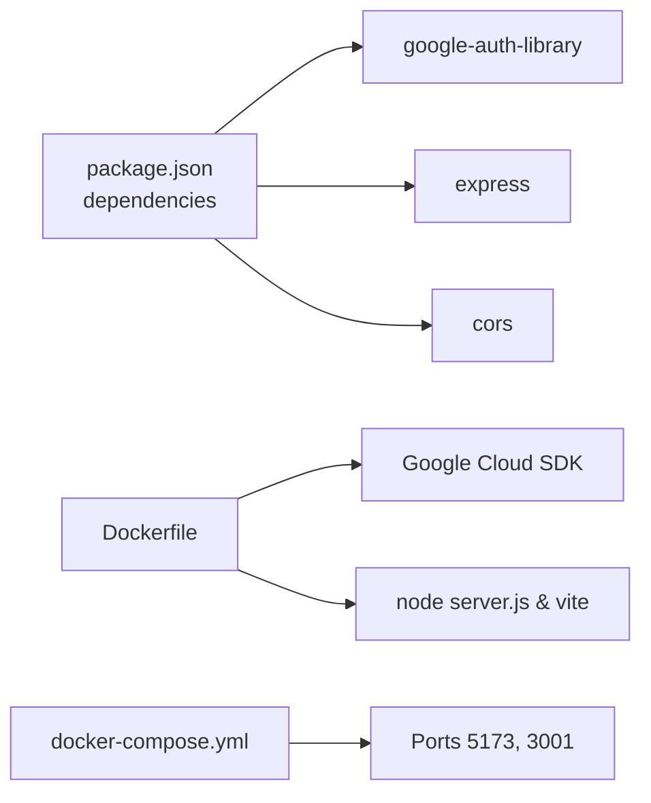

# /api/omni - Content Extraction

<cite>
**Referenced Files in This Document**
- [server.js](file://server.js)
- [package.json](file://package.json)
- [docker-compose.yml](file://docker-compose.yml)
- [Dockerfile](file://Dockerfile)
- [VaultDashboard.jsx](file://src/components/VaultDashboard.jsx)
- [MindmapView.jsx](file://src/components/MindmapView.jsx)
</cite>

## Table of Contents
1. [Introduction](#introduction)
2. [Project Structure](#project-structure)
3. [Core Components](#core-components)
4. [Architecture Overview](#architecture-overview)
5. [Detailed Component Analysis](#detailed-component-analysis)
6. [Dependency Analysis](#dependency-analysis)
7. [Performance Considerations](#performance-considerations)
8. [Troubleshooting Guide](#troubleshooting-guide)
9. [Conclusion](#conclusion)

## Introduction
This document provides comprehensive API documentation for the `/api/omni` endpoint, which extracts and processes AI content via Google Cloud CES (Conversational Entry Surface). The endpoint accepts a user text input, integrates system instructions, authenticates with Google Cloud using Application Default Credentials (ADC), and forwards the request to the Google Cloud API. It returns the AI service's response, with the frontend consuming either a `responses[0].text` or `reply[0].text` field depending on the response shape.

## Project Structure
The project consists of:
- A Node.js/Express backend exposing `/api/omni` and `/api/generate_image` endpoints
- A React/Vite frontend that calls `/api/omni` to power conversational AI interactions and mind map generation
- Docker configuration for local development with Google Cloud SDK installed

**Diagram sources**
- [server.js:1-135](file://server.js#L1-L135)
- [VaultDashboard.jsx:785-818](file://src/components/VaultDashboard.jsx#L785-L818)
- [MindmapView.jsx:95-152](file://src/components/MindmapView.jsx#L95-L152)
- [Dockerfile:1-32](file://Dockerfile#L1-L32)
- [docker-compose.yml:1-18](file://docker-compose.yml#L1-L18)

**Section sources**
- [server.js:1-135](file://server.js#L1-L135)
- [package.json:1-40](file://package.json#L1-L40)
- [docker-compose.yml:1-18](file://docker-compose.yml#L1-L18)
- [Dockerfile:1-32](file://Dockerfile#L1-L32)

## Core Components
- Express server with CORS and JSON middleware
- Google Cloud Authentication using `google-auth-library` with ADC
- Local system instructions file integration
- Forwarding to Google Cloud CES API with session configuration
- Frontend consumers:
  - Vault dashboard chat that displays AI responses
  - Mind map generator that parses structured JSON from AI

**Section sources**
- [server.js:1-135](file://server.js#L1-L135)
- [VaultDashboard.jsx:785-818](file://src/components/VaultDashboard.jsx#L785-L818)
- [MindmapView.jsx:95-152](file://src/components/MindmapView.jsx#L95-L152)

## Architecture Overview
The `/api/omni` endpoint follows this flow:
1. Validate incoming request body for required `text` parameter
2. Optionally read local system instructions file
3. Obtain an access token via ADC using `google-auth-library`
4. Construct a request body containing session configuration and combined system instructions + user text
5. Send a POST request to Google Cloud CES endpoint with Authorization: Bearer header
6. Return the AI service response to the client

**Diagram sources**
- [server.js:21-81](file://server.js#L21-L81)
- [VaultDashboard.jsx:785-818](file://src/components/VaultDashboard.jsx#L785-L818)
- [MindmapView.jsx:95-109](file://src/components/MindmapView.jsx#L95-L109)

## Detailed Component Analysis

### Request Definition
- Method: POST
- Path: `/api/omni`
- Headers:
  - Content-Type: application/json
- Body:
  - Required: `text` (string)
  - Optional: system instructions integrated into the request body
- Validation:
  - Returns 400 with error message if `text` is missing

**Section sources**
- [server.js:21-27](file://server.js#L21-L27)
- [VaultDashboard.jsx:785-790](file://src/components/VaultDashboard.jsx#L785-L790)
- [MindmapView.jsx:95-99](file://src/components/MindmapView.jsx#L95-L99)

### Request Transformation Logic
- Reads local system instructions file (if present) and combines with user input
- Builds a request body with:
  - config.session, config.app_version, config.deployment
  - inputs[0].text = "SYSTEM_INSTRUCTIONS: ... \n\nUSER_REQUEST: ..."
- Sends to Google Cloud CES endpoint with Authorization: Bearer

**Diagram sources**
- [server.js:21-81](file://server.js#L21-L81)

**Section sources**
- [server.js:29-54](file://server.js#L29-L54)

### Google Cloud Authentication and Integration
- Authentication library: `google-auth-library`
- Scope: cloud-platform
- Token acquisition: `auth.getClient()` followed by `client.getAccessToken()`
- Authorization header: `Authorization: Bearer <token>`
- Target endpoint: Google Cloud CES `https://ces.googleapis.com/...`
- Session configuration included in request body

**Diagram sources**
- [server.js:3-16](file://server.js#L3-L16)
- [server.js:37-65](file://server.js#L37-L65)

**Section sources**
- [server.js:3-16](file://server.js#L3-L16)
- [server.js:37-65](file://server.js#L37-L65)

### Response Schema and Processing Patterns
- Successful response:
  - The backend proxies the AI service response
  - Frontends commonly consume:
    - `data.responses[0].text` (when present)
    - `data.reply[0].text` (when present)
    - Fallback to JSON.stringify(data) if neither is available
- Error responses:
  - 400 for missing text
  - 500 for internal server errors
  - Forwarded API errors from Google Cloud with details

**Diagram sources**
- [server.js:67-75](file://server.js#L67-L75)
- [VaultDashboard.jsx:795-796](file://src/components/VaultDashboard.jsx#L795-L796)
- [MindmapView.jsx:101-102](file://src/components/MindmapView.jsx#L101-L102)

**Section sources**
- [server.js:67-75](file://server.js#L67-L75)
- [VaultDashboard.jsx:795-796](file://src/components/VaultDashboard.jsx#L795-L796)
- [MindmapView.jsx:101-102](file://src/components/MindmapView.jsx#L101-L102)

### Frontend Integration Examples
- Vault Dashboard:
  - Calls `/api/omni` with `{ text: userMessage }`
  - Displays `responses[0].text` or `reply[0].text` if available
- Mind Map View:
  - Calls `/api/omni` with `{ text: prompt }`
  - Parses JSON from AI response to generate nodes and edges

**Section sources**
- [VaultDashboard.jsx:785-818](file://src/components/VaultDashboard.jsx#L785-L818)
- [MindmapView.jsx:95-152](file://src/components/MindmapView.jsx#L95-L152)

## Dependency Analysis
- Runtime dependencies:
  - express, cors, google-auth-library
- Development dependencies:
  - vite, react, tailwindcss, etc.
- Containerization:
  - Dockerfile installs Google Cloud SDK and runs both the Express server and Vite dev server
  - docker-compose exposes ports 5173 (Vite) and 3001 (Express)

**Diagram sources**
- [package.json:12-24](file://package.json#L12-L24)
- [Dockerfile:1-32](file://Dockerfile#L1-L32)
- [docker-compose.yml:6-8](file://docker-compose.yml#L6-L8)

**Section sources**
- [package.json:12-24](file://package.json#L12-L24)
- [Dockerfile:1-32](file://Dockerfile#L1-L32)
- [docker-compose.yml:1-18](file://docker-compose.yml#L1-L18)

## Performance Considerations
- Network latency dominates due to external Google Cloud API calls; consider connection pooling and retry/backoff at the client if needed
- Avoid unnecessary repeated reads of the local instructions file; cache in memory if reused frequently
- Keep request bodies minimal; only include required session configuration and combined instructions + user text
- Rate limiting:
  - No built-in rate limiting in the Express server; implement at the application layer or rely on Google Cloud quotas
  - Consider client-side throttling for rapid successive requests

## Troubleshooting Guide
Common issues and resolutions:
- Missing text parameter:
  - Symptom: 400 error with a message indicating the text parameter is required
  - Resolution: Ensure the request body includes a non-empty `text` field
- Google Cloud authentication failures:
  - Symptom: 500 error from the proxy server or API errors from Google Cloud
  - Resolution: Configure Application Default Credentials (ADC) using the setup script referenced in the UI settings
- Local instructions file not found:
  - Symptom: Warning logged and default behavior used
  - Resolution: Verify the path to the instructions file or leave it absent to use defaults
- API errors from Google Cloud:
  - Symptom: Forwarded error response with details
  - Resolution: Check quotas, permissions, and session configuration in the request body

**Section sources**
- [server.js:25-27](file://server.js#L25-L27)
- [server.js:31-35](file://server.js#L31-L35)
- [server.js:69-72](file://server.js#L69-L72)
- [VaultDashboard.jsx:1264-1322](file://src/components/VaultDashboard.jsx#L1264-L1322)

## Conclusion
The `/api/omni` endpoint provides a straightforward integration point for AI content extraction via Google Cloud CES. It validates inputs, integrates optional system instructions, authenticates using ADC, and forwards requests to the AI service. The frontend consumes the response in flexible ways, supporting both plain text and structured JSON outputs. For production deployments, ensure proper ADC configuration, monitor quotas, and consider implementing client-side rate limiting and retries.