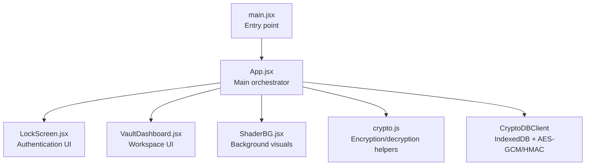
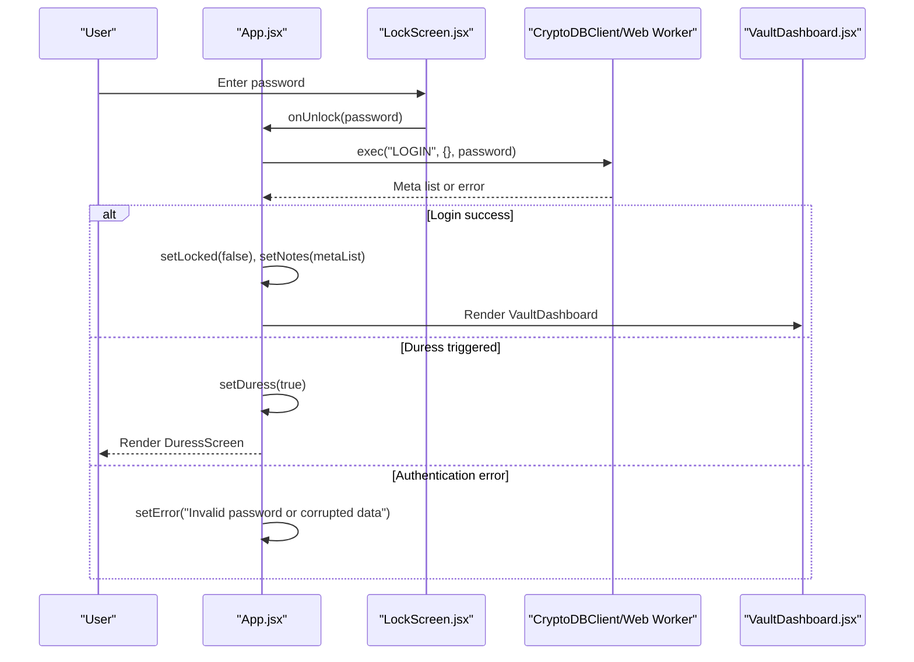
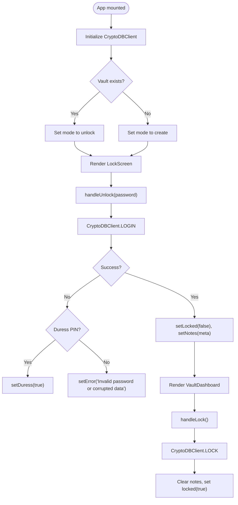
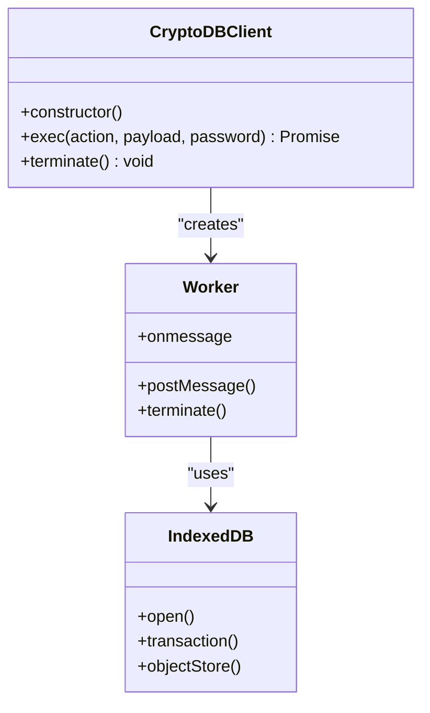
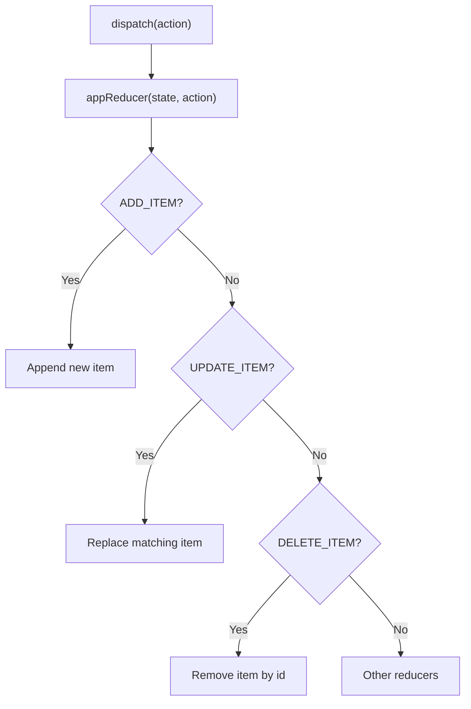
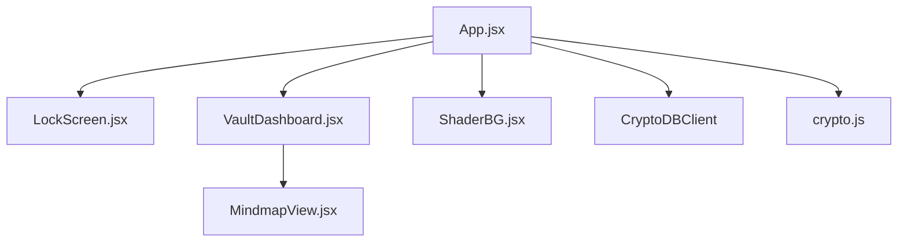

# App Component API

<cite>
**Referenced Files in This Document**
- [App.jsx](file://src/App.jsx)
- [LockScreen.jsx](file://src/components/LockScreen.jsx)
- [VaultDashboard.jsx](file://src/components/VaultDashboard.jsx)
- [ShaderBG.jsx](file://src/components/ShaderBG.jsx)
- [crypto.js](file://src/lib/crypto.js)
- [main.jsx](file://src/main.jsx)
- [package.json](file://package.json)
</cite>

## Table of Contents
1. [Introduction](#introduction)
2. [Project Structure](#project-structure)
3. [Core Components](#core-components)
4. [Architecture Overview](#architecture-overview)
5. [Detailed Component Analysis](#detailed-component-analysis)
6. [Dependency Analysis](#dependency-analysis)
7. [Performance Considerations](#performance-considerations)
8. [Troubleshooting Guide](#troubleshooting-guide)
9. [Conclusion](#conclusion)
10. [Appendices](#appendices)

## Introduction
This document provides comprehensive API documentation for the main App component that orchestrates the OMNI-TODO application. It covers the component’s state management using the useReducer pattern, authentication state transitions, lifecycle management, cryptographic operations via CryptoDBClient, Web Worker communication, dual-mode operation (lock/unlock), automatic encryption/decryption cycles, and persistence strategies. It also documents the component’s props interface, internal state structure, and integration points with child components.

## Project Structure
The application is a React + Vite project with a modular component architecture:
- Root rendering entry initializes the App component.
- App manages global state and renders either LockScreen or VaultDashboard based on lock state.
- Child components include LockScreen, VaultDashboard, and ShaderBG for background visuals.
- Cryptographic utilities reside under src/lib/crypto.js.
- CryptoDBClient encapsulates IndexedDB-backed cryptographic operations inside an inline Web Worker.

**Diagram sources**
- [main.jsx:6-10](file://src/main.jsx#L6-L10)
- [App.jsx:204-255](file://src/App.jsx#L204-L255)
- [LockScreen.jsx:5-91](file://src/components/LockScreen.jsx#L5-L91)
- [VaultDashboard.jsx:1389-1540](file://src/components/VaultDashboard.jsx#L1389-L1540)
- [ShaderBG.jsx:108-173](file://src/components/ShaderBG.jsx#L108-L173)
- [crypto.js:20-38](file://src/lib/crypto.js#L20-L38)

**Section sources**
- [main.jsx:1-11](file://src/main.jsx#L1-L11)
- [App.jsx:1-441](file://src/App.jsx#L1-L441)

## Core Components
This section focuses on the main App component and its immediate collaborators.

- App (main orchestrator):
  - Manages lock state, error state, and duress state.
  - Initializes and terminates CryptoDBClient via a Web Worker.
  - Implements handleUnlock and handleLock methods for authentication and lifecycle transitions.
  - Renders LockScreen when locked or VaultDashboard when unlocked.
  - Integrates ShaderBG for background visuals.

- LockScreen:
  - Provides authentication UI with password input, visibility toggle, and submission handling.
  - Emits onUnlock callback to App with the provided password.

- VaultDashboard:
  - Hosts the application workspace with multiple tabs (Base, Projects, Mindmaps, Omni, Gallery, Settings).
  - Receives state and dispatch from App and exposes onLock and onExportVault callbacks.
  - Settings panel integrates with CryptoDBClient for export/import operations.

- ShaderBG:
  - Renders animated shader backgrounds using Three.js.
  - Controlled by props for type, color, and opacity.

- CryptoDBClient:
  - Encapsulates IndexedDB-backed cryptographic operations in a Web Worker.
  - Supports actions such as LOGIN, LOCK, LOAD_CONTENT, SAVE_NOTE, DELETE_NOTE, EXPORT_VAULT, IMPORT_VAULT.
  - Uses AES-GCM for encryption and HMAC-SHA-256 for integrity verification.

- crypto.js:
  - Provides standalone encryption/decryption helpers for file-based vaults.
  - Handles persistent storage via localStorage and file picker APIs.

**Section sources**
- [App.jsx:204-255](file://src/App.jsx#L204-L255)
- [LockScreen.jsx:5-91](file://src/components/LockScreen.jsx#L5-L91)
- [VaultDashboard.jsx:1389-1540](file://src/components/VaultDashboard.jsx#L1389-L1540)
- [ShaderBG.jsx:108-173](file://src/components/ShaderBG.jsx#L108-L173)
- [crypto.js:20-38](file://src/lib/crypto.js#L20-L38)

## Architecture Overview
The App component orchestrates a dual-mode application:
- Locked mode: Presents LockScreen for authentication.
- Unlocked mode: Renders VaultDashboard with integrated cryptographic operations via CryptoDBClient.

**Diagram sources**
- [App.jsx:216-226](file://src/App.jsx#L216-L226)
- [LockScreen.jsx:10-16](file://src/components/LockScreen.jsx#L10-L16)
- [App.jsx:74-84](file://src/App.jsx#L74-L84)

**Section sources**
- [App.jsx:204-255](file://src/App.jsx#L204-L255)
- [LockScreen.jsx:5-91](file://src/components/LockScreen.jsx#L5-L91)
- [VaultDashboard.jsx:1389-1540](file://src/components/VaultDashboard.jsx#L1389-L1540)

## Detailed Component Analysis

### App Component API
- Purpose: Central orchestrator managing authentication, state transitions, and rendering of LockScreen or VaultDashboard.
- Props: None (no external props passed).
- Internal state:
  - locked: Boolean indicating whether the application is locked.
  - notes: Array of decrypted note metadata loaded during login.
  - error: String for displaying authentication errors.
  - duress: Boolean for triggering the duress screen.
- Lifecycle:
  - Initializes CryptoDBClient in useEffect and terminates it on unmount.
  - Automatically persists state to encrypted storage when unlocked and password is present.
- Methods:
  - handleUnlock(password): Authenticates via CryptoDBClient, loads note metadata, clears error, sets unlocked state.
  - handleLock(): Sends LOCK action to CryptoDBClient, clears notes and error, sets locked state.

**Diagram sources**
- [App.jsx:216-233](file://src/App.jsx#L216-L233)
- [App.jsx:74-84](file://src/App.jsx#L74-L84)

**Section sources**
- [App.jsx:204-255](file://src/App.jsx#L204-L255)

### LockScreen Component API
- Purpose: Provides authentication UI for unlocking the application.
- Props:
  - onUnlock: Function receiving the password string.
  - error: String to display authentication errors.
- Behavior:
  - Accepts password input, toggles visibility, submits on Enter or button click.
  - Disables input while busy to prevent concurrent operations.

**Section sources**
- [LockScreen.jsx:5-91](file://src/components/LockScreen.jsx#L5-L91)

### VaultDashboard Component API
- Purpose: Hosts the main workspace with multiple functional views and settings.
- Props:
  - state: Application state managed by useReducer in App.
  - dispatch: Reducer dispatcher for state updates.
  - onLock: Callback to lock the application.
  - onExportVault: Callback to trigger vault export.
- Behavior:
  - Renders a sidebar with navigation tabs and a mobile menu.
  - Switches views based on activeTab using AnimatePresence.
  - Settings panel integrates with CryptoDBClient for export/import.

**Section sources**
- [VaultDashboard.jsx:1389-1540](file://src/components/VaultDashboard.jsx#L1389-L1540)

### CryptoDBClient Integration
- Purpose: Encapsulates IndexedDB-backed cryptographic operations in a Web Worker.
- Capabilities:
  - LOGIN: Derive session keys, load metadata, and return decrypted note metadata.
  - LOCK: Clear session keys and return lock confirmation.
  - LOAD_CONTENT: Decrypt a specific note by ID.
  - SAVE_NOTE: Encrypt and persist note metadata and content.
  - DELETE_NOTE: Mark note as deleted and remove content.
  - EXPORT_VAULT: Decrypt and export all notes and metadata.
  - IMPORT_VAULT: Merge incoming vault with local data using CRDT LWW semantics.
- Security:
  - Uses AES-GCM for encryption and HMAC-SHA-256 for integrity.
  - Supports duress PIN to trigger cryptographic shredding.

**Diagram sources**
- [App.jsx:167-190](file://src/App.jsx#L167-L190)
- [App.jsx:74-163](file://src/App.jsx#L74-L163)

**Section sources**
- [App.jsx:167-190](file://src/App.jsx#L167-L190)
- [App.jsx:74-163](file://src/App.jsx#L74-L163)

### State Management with useReducer
- Purpose: Manage complex application state (items, projects, mindmaps, gallery, settings).
- Initial state:
  - items: Array of items.
  - projects: Array of projects.
  - mindmaps: Array of mindmaps.
  - gallery: Array of images.
  - settings: Theme, accent color, auto-lock, and lock timeout.
- Actions:
  - ADD_ITEM, UPDATE_ITEM, DELETE_ITEM
  - ADD_PROJECT, UPDATE_PROJECT, DELETE_PROJECT
  - ADD_MINDMAP, UPDATE_MINDMAP, DELETE_MINDMAP
  - ADD_IMAGE, DELETE_IMAGE
  - UPDATE_SETTINGS
  - LOAD (replace state with persisted data)

**Diagram sources**
- [App.jsx:273-306](file://src/App.jsx#L273-L306)

**Section sources**
- [App.jsx:265-306](file://src/App.jsx#L265-L306)

### Dual-Mode Operation (Lock/Unlock States)
- Modes:
  - Locked: Renders LockScreen; prevents access to VaultDashboard.
  - Unlocked: Renders VaultDashboard; enables full functionality.
- Transitions:
  - handleUnlock(password): Authenticates and transitions to unlocked.
  - handleLock(): Clears state and transitions to locked.
- Persistence:
  - Auto-save occurs when unlocked and password is present.
  - Manual export via Settings panel uses CryptoDBClient.

**Section sources**
- [App.jsx:216-233](file://src/App.jsx#L216-L233)
- [VaultDashboard.jsx:1389-1540](file://src/components/VaultDashboard.jsx#L1389-L1540)

### Automatic Encryption/Decryption Cycles
- Encryption:
  - Auto-save: On state change, encrypt state and persist to encrypted storage.
  - Export: Encrypt state and offer download via file picker.
- Decryption:
  - Unlock: Load encrypted vault, decrypt to state, and initialize reducer.
  - Import: Decrypt incoming vault and merge with local data using CRDT LWW semantics.

**Section sources**
- [App.jsx:327-340](file://src/App.jsx#L327-L340)
- [App.jsx:357-370](file://src/App.jsx#L357-L370)
- [App.jsx:397-407](file://src/App.jsx#L397-L407)
- [crypto.js:20-38](file://src/lib/crypto.js#L20-L38)

### Error Handling Mechanisms
- Authentication errors:
  - Invalid password or corrupted data triggers error message.
  - Duress PIN triggers cryptographic shredding and duress screen.
- Worker errors:
  - Errors from CryptoDBClient are propagated and handled in App.
- UI feedback:
  - LockScreen displays error messages.
  - Settings panel shows status indicators for export/import operations.

**Section sources**
- [App.jsx:216-226](file://src/App.jsx#L216-L226)
- [App.jsx:74-84](file://src/App.jsx#L74-L84)
- [LockScreen.jsx:58-62](file://src/components/LockScreen.jsx#L58-L62)
- [VaultDashboard.jsx:141-158](file://src/components/VaultDashboard.jsx#L141-L158)

## Dependency Analysis
- External libraries:
  - framer-motion for animations.
  - three for WebGL shader backgrounds.
  - @xyflow/react for mindmap visualization.
- Internal dependencies:
  - App depends on LockScreen, VaultDashboard, ShaderBG.
  - VaultDashboard depends on MindmapView and other view components.
  - App uses CryptoDBClient and crypto.js for cryptographic operations.

**Diagram sources**
- [App.jsx:204-255](file://src/App.jsx#L204-L255)
- [VaultDashboard.jsx:1389-1540](file://src/components/VaultDashboard.jsx#L1389-L1540)
- [ShaderBG.jsx:108-173](file://src/components/ShaderBG.jsx#L108-L173)
- [package.json:12-24](file://package.json#L12-L24)

**Section sources**
- [package.json:12-24](file://package.json#L12-L24)
- [App.jsx:204-255](file://src/App.jsx#L204-L255)

## Performance Considerations
- Web Worker isolation:
  - Cryptographic operations run off the main thread to prevent UI blocking.
- Auto-save throttling:
  - Debounce or batch state changes to reduce frequent encryption/decryption cycles.
- IndexedDB transactions:
  - Group operations within transactions to minimize latency.
- Animation optimization:
  - Use AnimatePresence with minimal re-renders; avoid unnecessary prop drilling.

## Troubleshooting Guide
- Authentication failures:
  - Verify password correctness and vault integrity.
  - Check for corrupted data and retry decryption.
- Duress activation:
  - Confirm duress PIN is not accidentally triggered.
  - Review cryptographic shredding behavior.
- Export/import issues:
  - Ensure file format compatibility and sufficient permissions.
  - Validate CRDT merge outcomes and resolve conflicts manually if needed.
- Worker termination:
  - Ensure cleanup on unmount to prevent memory leaks.

**Section sources**
- [App.jsx:216-226](file://src/App.jsx#L216-L226)
- [App.jsx:74-84](file://src/App.jsx#L74-L84)
- [VaultDashboard.jsx:141-158](file://src/components/VaultDashboard.jsx#L141-L158)

## Conclusion
The App component serves as the central orchestrator for OMNI-TODO, seamlessly integrating authentication, state management, cryptographic operations, and UI rendering. Its dual-mode operation ensures robust security, while the useReducer pattern and Web Worker-based CryptoDBClient enable efficient and secure data handling. Proper error handling and persistence strategies contribute to a resilient and user-friendly experience.

## Appendices

### Method Signatures
- handleUnlock(password: string): Promise<void>
  - Authenticates via CryptoDBClient, loads note metadata, clears error, sets unlocked state.
- handleLock(): Promise<void>
  - Sends LOCK action to CryptoDBClient, clears notes and error, sets locked state.
- State update handlers (from VaultDashboard):
  - onLock(): Triggers App.handleLock().
  - onExportVault(): Encrypts state and offers download via file picker.

**Section sources**
- [App.jsx:216-233](file://src/App.jsx#L216-L233)
- [VaultDashboard.jsx:1470-1477](file://src/components/VaultDashboard.jsx#L1470-L1477)