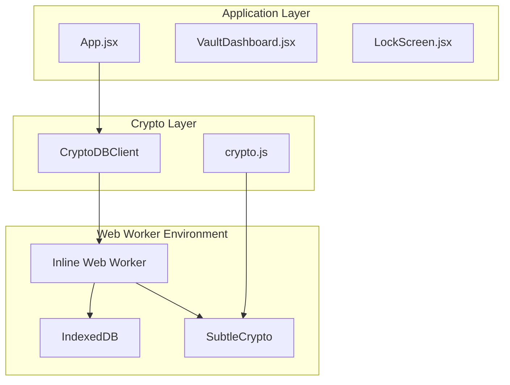
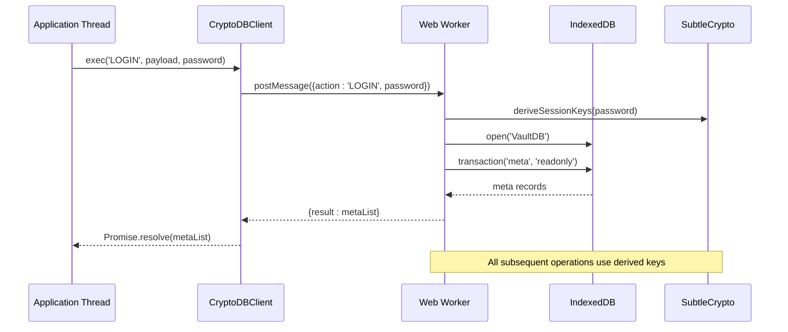
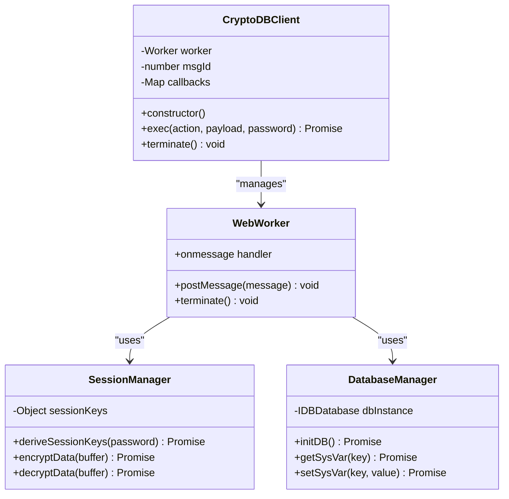
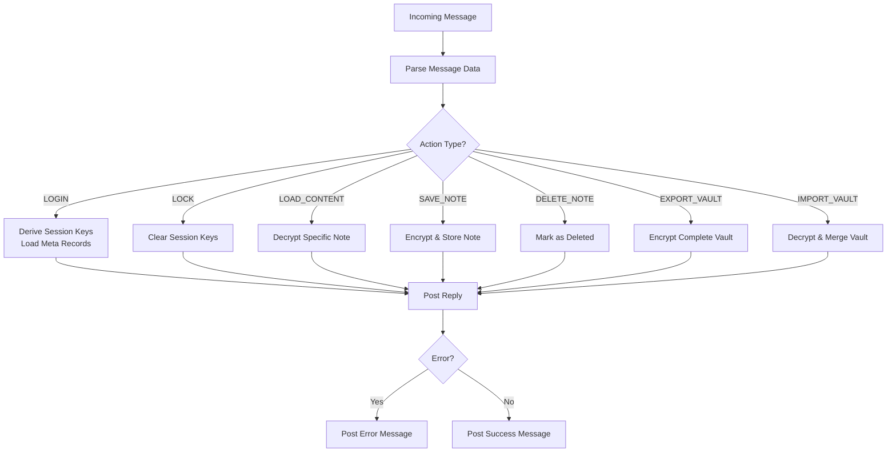
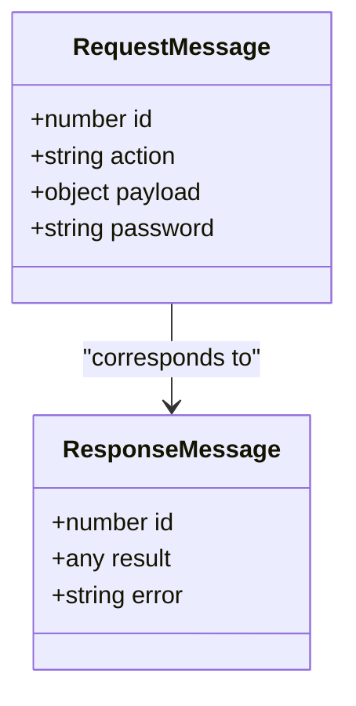
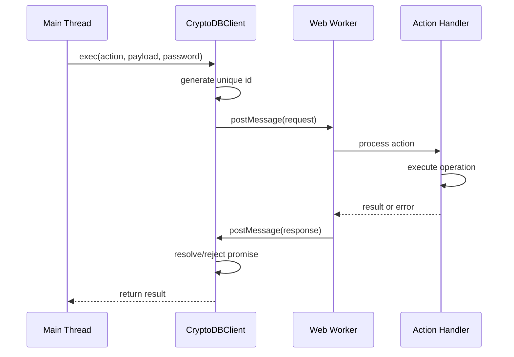
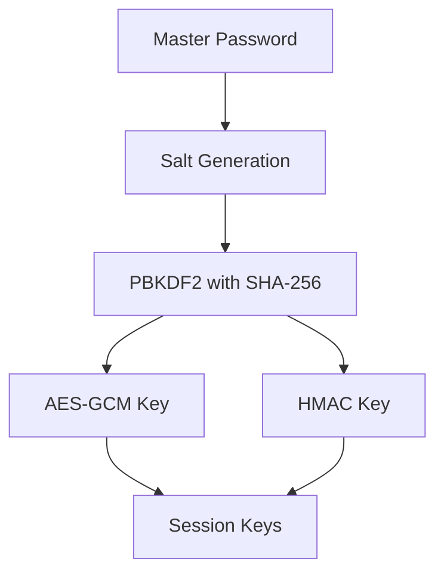
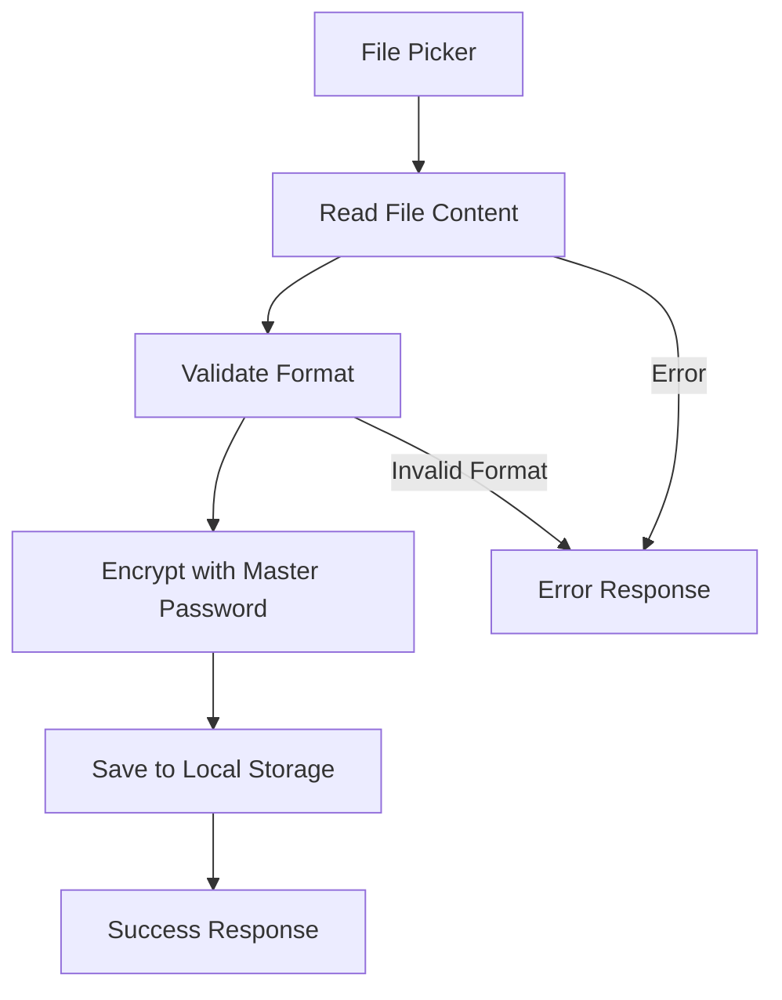
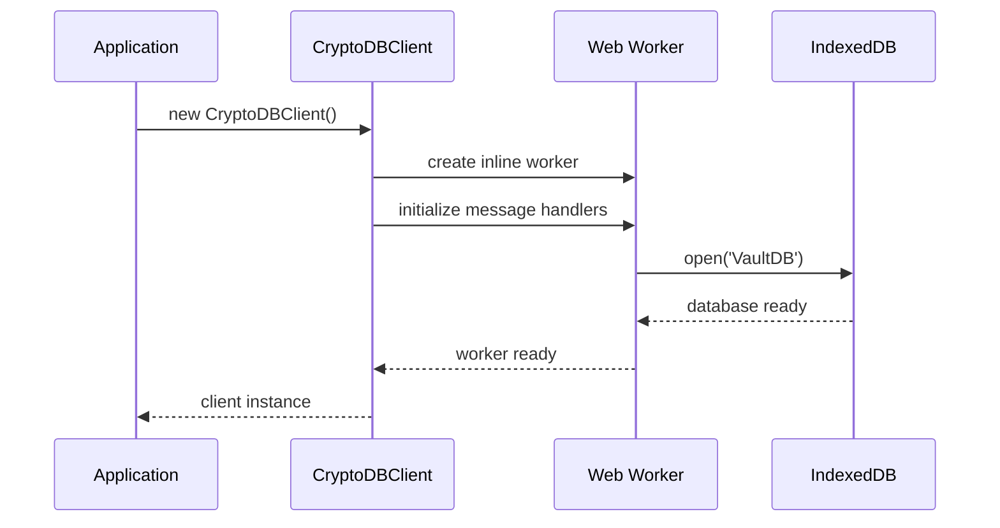

# CryptoDBClient API

<cite>
**Referenced Files in This Document**
- [App.jsx](file://src/App.jsx)
- [crypto.js](file://src/lib/crypto.js)
- [VaultDashboard.jsx](file://src/components/VaultDashboard.jsx)
- [LockScreen.jsx](file://src/components/LockScreen.jsx)
</cite>

## Table of Contents
1. [Introduction](#introduction)
2. [Project Structure](#project-structure)
3. [Core Components](#core-components)
4. [Architecture Overview](#architecture-overview)
5. [Detailed Component Analysis](#detailed-component-analysis)
6. [API Reference](#api-reference)
7. [Web Worker Communication Protocol](#web-worker-communication-protocol)
8. [Cryptographic Operations](#cryptographic-operations)
9. [Integration Patterns](#integration-patterns)
10. [Error Handling](#error-handling)
11. [Performance Considerations](#performance-considerations)
12. [Security Model](#security-model)
13. [Conclusion](#conclusion)

## Introduction

The CryptoDBClient is a sophisticated Web Worker-based cryptographic client designed for secure note-taking and data vault management. It provides a comprehensive API for encrypted data operations, database interactions, and secure communication patterns. Built with modern web technologies, it leverages AES-GCM encryption, HMAC integrity verification, and IndexedDB for persistent storage.

The client operates as a bridge between the main application thread and a dedicated Web Worker, ensuring that all cryptographic operations occur in a secure, isolated environment. This architecture provides both performance benefits and enhanced security through process isolation.

## Project Structure

The CryptoDBClient implementation is primarily located in the main application file with supporting cryptographic utilities:



**Diagram sources**
- [App.jsx:166-190](file://src/App.jsx#L166-L190)
- [crypto.js:1-112](file://src/lib/crypto.js#L1-L112)

**Section sources**
- [App.jsx:1-165](file://src/App.jsx#L1-L165)
- [crypto.js:1-112](file://src/lib/crypto.js#L1-L112)

## Core Components

The CryptoDBClient system consists of several interconnected components that work together to provide secure data management:

### CryptoDBClient Class
The main client interface that manages the Web Worker lifecycle and provides promise-based API calls.

### Inline Web Worker
A self-contained worker that handles all cryptographic operations, database transactions, and secure data processing.

### Cryptographic Utilities
Standalone functions for encryption, decryption, key derivation, and file operations.

### Database Management
IndexedDB-backed storage with transaction support and data integrity guarantees.

**Section sources**
- [App.jsx:166-190](file://src/App.jsx#L166-L190)
- [App.jsx:10-164](file://src/App.jsx#L10-L164)

## Architecture Overview

The CryptoDBClient follows a layered architecture with clear separation of concerns:



**Diagram sources**
- [App.jsx:166-190](file://src/App.jsx#L166-L190)
- [App.jsx:74-84](file://src/App.jsx#L74-L84)

The architecture ensures that sensitive cryptographic operations never touch the main application thread, providing both security and performance benefits.

## Detailed Component Analysis

### CryptoDBClient Implementation

The CryptoDBClient class serves as the primary interface for all cryptographic operations:



**Diagram sources**
- [App.jsx:166-190](file://src/App.jsx#L166-L190)
- [App.jsx:33-42](file://src/App.jsx#L33-L42)
- [App.jsx:15-28](file://src/App.jsx#L15-L28)

**Section sources**
- [App.jsx:166-190](file://src/App.jsx#L166-L190)

### Web Worker Message Handling

The Web Worker implements a robust message handling system:



**Diagram sources**
- [App.jsx:74-163](file://src/App.jsx#L74-L163)

**Section sources**
- [App.jsx:74-163](file://src/App.jsx#L74-L163)

## API Reference

### CryptoDBClient Class

#### Constructor
Creates a new CryptoDBClient instance with an embedded Web Worker.

**Signature:** `new CryptoDBClient()`

**Behavior:**
- Creates an inline Web Worker containing all cryptographic logic
- Initializes message ID counter and callback registry
- Sets up message event handler for response processing

#### exec Method
Executes a command against the Web Worker with promise-based return.

**Signature:** `exec(action, payload = {}, password = null) Promise`

**Parameters:**
- `action` (string): Command identifier from supported actions
- `payload` (object): Action-specific parameters
- `password` (string|null): Authentication credentials when required

**Returns:** Promise resolving to action-specific result or rejecting with error

**Example:**
```javascript
const client = new CryptoDBClient();
try {
  const notes = await client.exec('LOGIN', {}, masterPassword);
  const result = await client.exec('SAVE_NOTE', { 
    meta: noteMeta, 
    content: noteContent 
  }, masterPassword);
} catch (error) {
  console.error('Operation failed:', error.message);
}
```

#### terminate Method
Terminates the Web Worker and releases resources.

**Signature:** `terminate() void`

**Behavior:**
- Terminates the underlying Web Worker
- Cleans up message handlers and callback registry
- Releases memory resources

**Section sources**
- [App.jsx:166-190](file://src/App.jsx#L166-L190)

### Supported Actions

#### LOGIN
Initializes a session with the provided password.

**Parameters:**
- `password` (string): Master password for vault access

**Returns:** Array of note metadata objects (excluding deleted entries)

**Error Conditions:**
- `DURESS_TRIGGERED`: When duress PIN is used (special case)
- `NO_SESSION`: When called without proper authentication

**Section sources**
- [App.jsx:79-84](file://src/App.jsx#L79-L84)

#### LOCK
Ends the current session and clears sensitive data.

**Parameters:** None required

**Returns:** String literal `"LOCKED"`

**Section sources**
- [App.jsx:85-87](file://src/App.jsx#L85-L87)

#### LOAD_CONTENT
Retrieves and decrypts a specific note's content.

**Parameters:**
- `noteId` (string): Unique identifier of the note to load

**Returns:** Decrypted note content as string

**Error Conditions:**
- `NO_SESSION`: When called without active session
- `INTEGRITY_COMPROMISED`: When decryption fails

**Section sources**
- [App.jsx:88-97](file://src/App.jsx#L88-L97)

#### SAVE_NOTE
Creates or updates a note with encrypted content.

**Parameters:**
- `meta` (object): Note metadata including id, title, tags, timestamps
- `content` (string): Note content to be encrypted

**Returns:** String literal `"OK"`

**Section sources**
- [App.jsx:99-105](file://src/App.jsx#L99-L105)

#### DELETE_NOTE
Marks a note as deleted without immediate physical removal.

**Parameters:**
- `noteId` (string): Unique identifier of note to delete

**Returns:** String literal `"OK"`

**Section sources**
- [App.jsx:106-119](file://src/App.jsx#L106-L119)

#### EXPORT_VAULT
Exports the entire vault as an encrypted backup.

**Parameters:** None required

**Returns:** ArrayBuffer containing encrypted vault data

**Error Conditions:**
- `NO_SESSION`: When called without active session

**Section sources**
- [App.jsx:120-133](file://src/App.jsx#L120-L133)

#### IMPORT_VAULT
Imports and merges an encrypted vault backup.

**Parameters:**
- `fileBuffer` (ArrayBuffer): Encrypted vault data to import

**Returns:** Updated array of note metadata (excluding deleted entries)

**Error Conditions:**
- `NO_SESSION`: When called without active session
- `INTEGRITY_COMPROMISED`: When decryption fails

**Section sources**
- [App.jsx:134-161](file://src/App.jsx#L134-L161)

## Web Worker Communication Protocol

The communication protocol between the main thread and Web Worker follows a strict message format:

### Message Structure



**Diagram sources**
- [App.jsx:173-187](file://src/App.jsx#L173-L187)

### Message Flow



**Diagram sources**
- [App.jsx:173-187](file://src/App.jsx#L173-L187)

**Section sources**
- [App.jsx:173-187](file://src/App.jsx#L173-L187)

## Cryptographic Operations

### Key Derivation

The system uses PBKDF2 for key derivation with configurable parameters:



**Diagram sources**
- [App.jsx:33-42](file://src/App.jsx#L33-L42)

### Encryption Scheme

The implementation uses AES-GCM with HMAC-SHA-256 for combined confidentiality and integrity:

**Payload Format:** `IV || HMAC || CIPHERTEXT`

**Section sources**
- [App.jsx:54-72](file://src/App.jsx#L54-L72)

### File Operations

The system provides secure file handling for vault backups:



**Diagram sources**
- [crypto.js:63-79](file://src/lib/crypto.js#L63-L79)

**Section sources**
- [crypto.js:63-110](file://src/lib/crypto.js#L63-L110)

## Integration Patterns

### Client Initialization



**Diagram sources**
- [App.jsx:166-190](file://src/App.jsx#L166-L190)

### Error Handling Integration

The client integrates seamlessly with React applications:

```mermaid
flowchart TD
Try[User Action] --> Call[client.exec()]
Call --> Promise[Promise Returned]
Promise --> Resolve[Success Handler]
Promise --> Reject[Error Handler]
Reject --> Check{Error Type?}
Check --> |DURESS_TRIGGERED| Duress[Show Duress Screen]
Check --> |Other| Display[Display Error Message]
Resolve --> UpdateUI[Update Application State]
```

**Diagram sources**
- [App.jsx:216-226](file://src/App.jsx#L216-L226)

**Section sources**
- [App.jsx:216-226](file://src/App.jsx#L216-L226)

## Error Handling

The CryptoDBClient implements comprehensive error handling across all layers:

### Web Worker Errors
- `NO_SESSION`: Operation requires active session
- `INTEGRITY_COMPROMISED`: Decryption verification failed
- `CORRUPTED_PAYLOAD`: Malformed encrypted data
- `DURESS_TRIGGERED`: Special case for security breach

### Client Error Propagation
Errors thrown in the Web Worker are caught and re-thrown as JavaScript Error objects with original messages preserved.

### Application-Level Error Handling
Applications should handle errors gracefully, particularly the duress scenario which triggers special UI behavior.

**Section sources**
- [App.jsx:64-72](file://src/App.jsx#L64-L72)
- [App.jsx:89](file://src/App.jsx#L89)
- [App.jsx:222-225](file://src/App.jsx#L222-L225)

## Performance Considerations

### Asynchronous Operations
All operations return promises, enabling non-blocking execution and better user experience.

### Memory Management
The client properly cleans up Web Worker instances and message handlers to prevent memory leaks.

### Database Optimization
IndexedDB transactions are used efficiently to minimize database contention and improve performance.

### Cryptographic Efficiency
PBKDF2 parameters are tuned for security while maintaining reasonable performance characteristics.

## Security Model

### Isolation Guarantees
- Cryptographic operations occur in a separate Web Worker process
- No direct access to main application memory
- Secure key derivation and storage mechanisms

### Integrity Protection
- AES-GCM provides authenticated encryption
- HMAC-SHA-256 ensures data integrity verification
- Automatic corruption detection

### Access Control
- Session-based authentication model
- Password-based key derivation
- Optional duress mode for extreme security scenarios

### Data Protection
- All sensitive data is encrypted at rest
- Temporary data is overwritten during destructive operations
- Secure file export/import with validation

## Conclusion

The CryptoDBClient provides a robust, secure, and efficient solution for encrypted data management in web applications. Its Web Worker-based architecture ensures both security and performance, while the promise-based API makes integration straightforward for modern React applications.

Key strengths include comprehensive error handling, flexible action system, strong cryptographic foundations, and seamless integration patterns. The implementation demonstrates best practices for secure web development while maintaining excellent user experience through asynchronous operations and responsive UI patterns.

The modular design allows for easy extension and customization, making it suitable for various applications requiring secure data storage and management capabilities.