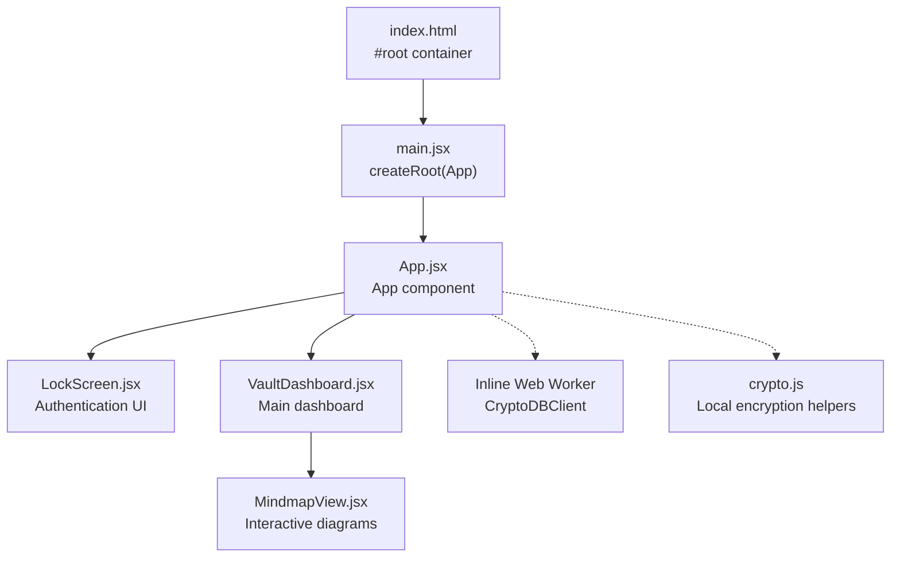
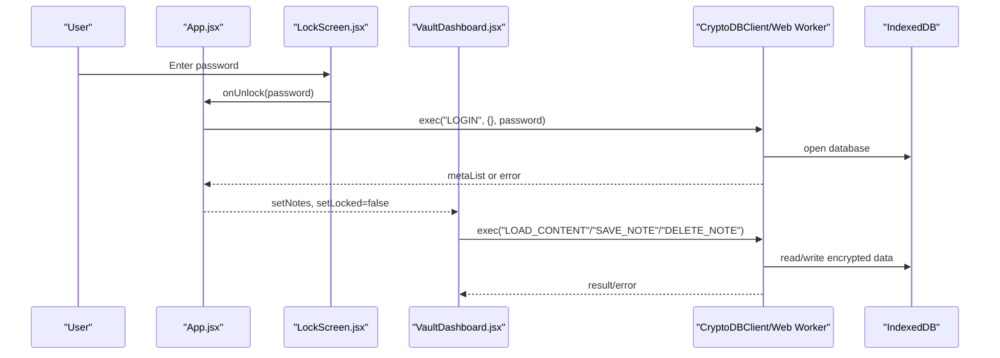
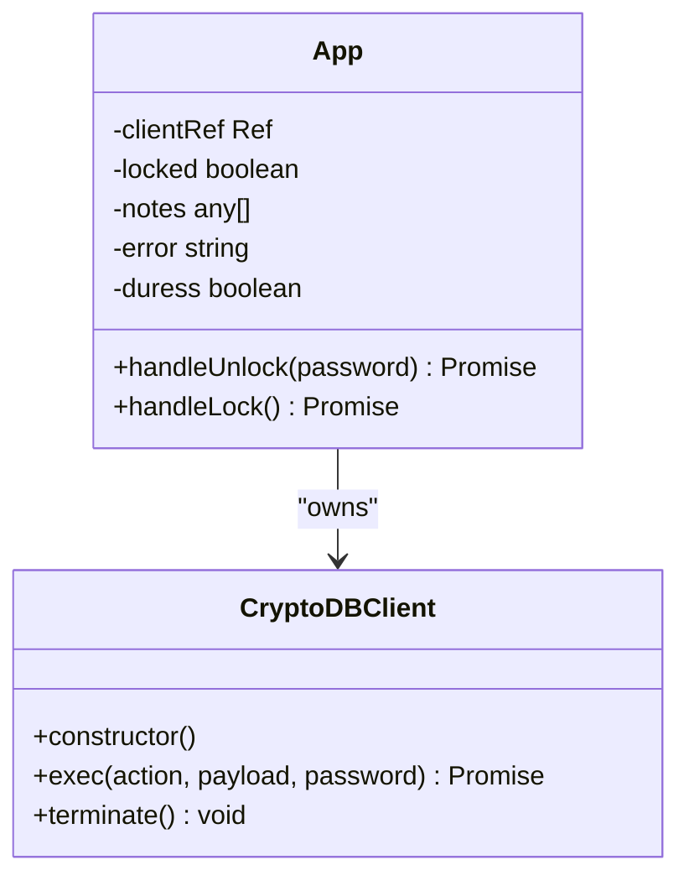
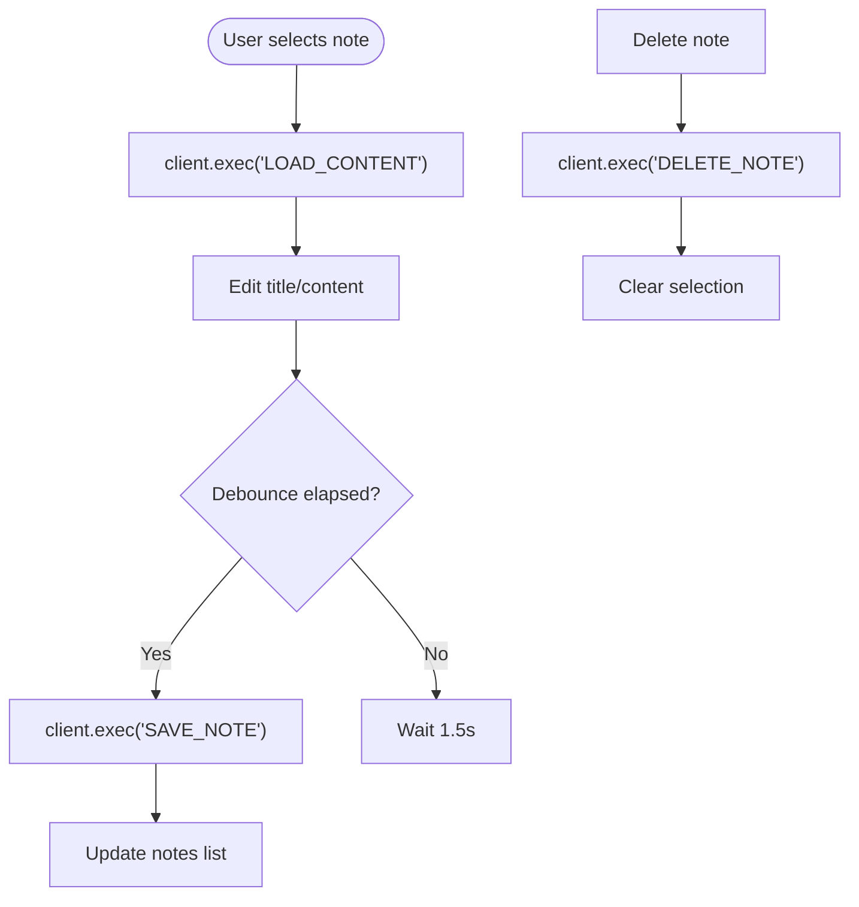
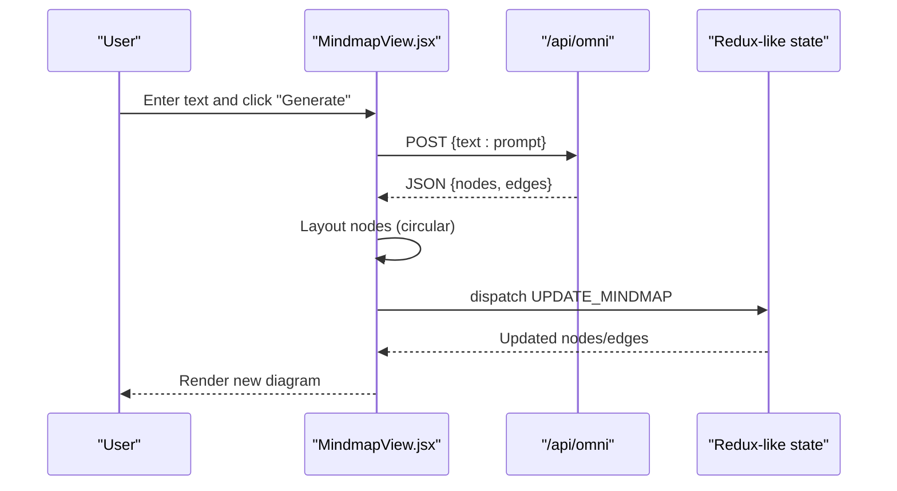
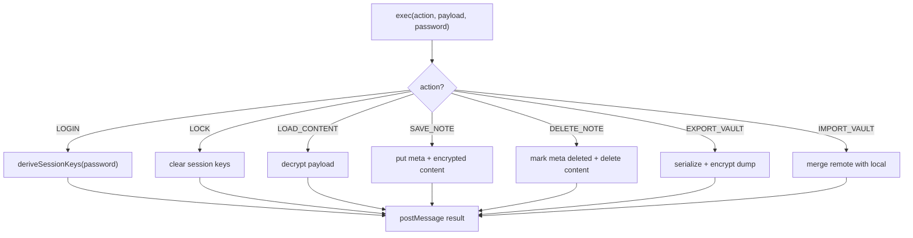
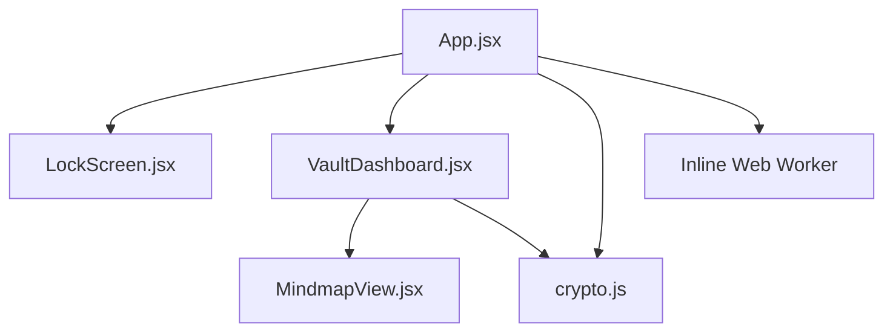

# Frontend API

<cite>
**Referenced Files in This Document**
- [App.jsx](file://src/App.jsx)
- [LockScreen.jsx](file://src/components/LockScreen.jsx)
- [VaultDashboard.jsx](file://src/components/VaultDashboard.jsx)
- [MindmapView.jsx](file://src/components/MindmapView.jsx)
- [crypto.js](file://src/lib/crypto.js)
- [main.jsx](file://src/main.jsx)
- [index.html](file://index.html)
- [package.json](file://package.json)
</cite>

## Table of Contents
1. [Introduction](#introduction)
2. [Project Structure](#project-structure)
3. [Core Components](#core-components)
4. [Architecture Overview](#architecture-overview)
5. [Detailed Component Analysis](#detailed-component-analysis)
6. [Dependency Analysis](#dependency-analysis)
7. [Performance Considerations](#performance-considerations)
8. [Troubleshooting Guide](#troubleshooting-guide)
9. [Conclusion](#conclusion)

## Introduction
This document provides comprehensive frontend API documentation for OMNI-TODO’s React component interfaces and state management systems. It focuses on:
- App.jsx state management, authentication handlers, and the CryptoDBClient Web Worker interface
- VaultDashboard.jsx public methods for note management, project tracking, and gallery operations
- LockScreen.jsx authentication API including password validation, duress detection, and security state transitions
- MindmapView.jsx interactive diagram APIs, node manipulation methods, and AI integration hooks
- CryptoDBClient Web Worker interface for cryptographic operations and IndexedDB access patterns
- Component prop interfaces, composition patterns, and error boundary handling

## Project Structure
The application is a React + Vite project with a modular component architecture. The main entry point renders the root App component, which orchestrates authentication, state, and component composition.

**Diagram sources**
- [index.html:9-11](file://index.html#L9-L11)
- [main.jsx:6-10](file://src/main.jsx#L6-L10)
- [App.jsx:204-255](file://src/App.jsx#L204-L255)
- [LockScreen.jsx:5-93](file://src/components/LockScreen.jsx#L5-L93)
- [VaultDashboard.jsx:1389-1540](file://src/components/VaultDashboard.jsx#L1389-L1540)
- [MindmapView.jsx:7-307](file://src/components/MindmapView.jsx#L7-L307)
- [crypto.js:1-112](file://src/lib/crypto.js#L1-L112)

**Section sources**
- [index.html:1-14](file://index.html#L1-L14)
- [main.jsx:1-11](file://src/main.jsx#L1-L11)
- [package.json:1-40](file://package.json#L1-L40)

## Core Components
This section documents the primary components and their public APIs.

- App.jsx
  - Manages authentication state, duress detection, and orchestrates CryptoDBClient.
  - Exposes handler functions for unlocking/locking and manages the locked/unlocked UI flow.
  - Provides a CryptoDBClient instance via a ref and handles worker lifecycle.

- LockScreen.jsx
  - Accepts props for authentication callbacks and displays error messages.
  - Handles password submission, show/hide toggle, and duress warnings.

- VaultDashboard.jsx
  - Hosts multiple views: BaseView (notes), ProjectsView, MindmapView, OmniView, GalleryView, and SettingsView.
  - Exposes public methods for note creation/deletion, saving, and settings updates via dispatch actions.
  - Integrates with CryptoDBClient for secure note persistence.

- MindmapView.jsx
  - Provides interactive diagram editing with React Flow.
  - Offers AI integration hooks for extracting mindmaps from text and generating nodes.

- crypto.js
  - Local encryption/decryption helpers for legacy vault storage.
  - File picker and save utilities for .vault files.

**Section sources**
- [App.jsx:204-255](file://src/App.jsx#L204-L255)
- [LockScreen.jsx:5-93](file://src/components/LockScreen.jsx#L5-L93)
- [VaultDashboard.jsx:1389-1540](file://src/components/VaultDashboard.jsx#L1389-L1540)
- [MindmapView.jsx:7-307](file://src/components/MindmapView.jsx#L7-L307)
- [crypto.js:1-112](file://src/lib/crypto.js#L1-L112)

## Architecture Overview
The frontend architecture centers around a secure state management model:
- Authentication and session lifecycle are handled in App.jsx with a duress PIN guard.
- VaultDashboard.jsx composes multiple specialized views and coordinates with CryptoDBClient for persistence.
- MindmapView.jsx integrates with external AI endpoints for mindmap generation.
- crypto.js provides local encryption/decryption for backward compatibility.

**Diagram sources**
- [App.jsx:216-233](file://src/App.jsx#L216-L233)
- [LockScreen.jsx:10-16](file://src/components/LockScreen.jsx#L10-L16)
- [VaultDashboard.jsx:258-316](file://src/components/VaultDashboard.jsx#L258-L316)
- [App.jsx:74-163](file://src/App.jsx#L74-L163)

## Detailed Component Analysis

### App.jsx: Authentication, State Management, and CryptoDBClient
- State and lifecycle
  - Tracks locked state, notes list, error message, and duress flag.
  - Initializes CryptoDBClient in a ref during mount and terminates on unmount.
  - Uses a constant DURESS_PIN for triggering cryptographic destruction.

- Authentication handlers
  - handleUnlock: Calls worker LOGIN action with password; sets notes and clears errors; triggers duress UI on DURESS_PIN.
  - handleLock: Calls worker LOCK action, resets UI state.

- CryptoDBClient interface
  - Inline Web Worker encapsulates IndexedDB schema, system variables, and cryptographic operations.
  - Actions: LOGIN, LOCK, LOAD_CONTENT, SAVE_NOTE, DELETE_NOTE, EXPORT_VAULT, IMPORT_VAULT.
  - Session keys derived via PBKDF2 with AES-GCM and HMAC-SHA-256.
  - Duress behavior: On DURESS_PIN, performs cryptographic shredding of IndexedDB stores.

- Propagation to child components
  - Passes client ref to VaultDashboard and initial notes to render unlocked state.

**Diagram sources**
- [App.jsx:167-190](file://src/App.jsx#L167-L190)
- [App.jsx:216-233](file://src/App.jsx#L216-L233)

**Section sources**
- [App.jsx:7-164](file://src/App.jsx#L7-L164)
- [App.jsx:204-255](file://src/App.jsx#L204-L255)

### LockScreen.jsx: Authentication API
- Props
  - onUnlock: Function to pass the entered password to the parent.
  - error: String to display authentication errors.

- Behavior
  - Password input with show/hide toggle and Enter key support.
  - Busy state prevents concurrent submissions.
  - Displays a duress warning with explicit risk messaging.

- Security state transitions
  - Delegates to parent for password validation and session creation.
  - No local cryptographic logic; relies on App.jsx for session handling.

**Section sources**
- [LockScreen.jsx:5-93](file://src/components/LockScreen.jsx#L5-L93)

### VaultDashboard.jsx: Public Methods and State Management
- Composition and views
  - BaseView: Notes editor with tagging, search, and CRUD operations.
  - ProjectsView: Project management with progress indicators.
  - MindmapView: Interactive diagram editor (see MindmapView.jsx).
  - OmniView: AI assistant that parses structured commands and executes actions.
  - GalleryView: AI image generation and gallery management.
  - SettingsView: Theme, lock timeout, and backup/restore controls.

- Public methods (via dispatch and worker calls)
  - createNote: Generates a new note via SAVE_NOTE and adds to the list.
  - deleteNote: Marks note deleted via DELETE_NOTE and removes from UI.
  - saveNote: Debounced autosave with tag extraction and preview generation.
  - Export/Import: Uses CryptoDBClient to export/import vault data.

- Props
  - client: CryptoDBClient instance for secure operations.
  - state/dispatch: Legacy state machine for non-crypto features.
  - onLock/onNotesChange: Lifecycle callbacks to App.jsx.

- Data flows
  - LOAD_CONTENT on selection to hydrate content.
  - SAVE_NOTE on change with debounced persistence.
  - DELETE_NOTE on removal.

**Diagram sources**
- [VaultDashboard.jsx:258-316](file://src/components/VaultDashboard.jsx#L258-L316)

**Section sources**
- [VaultDashboard.jsx:240-506](file://src/components/VaultDashboard.jsx#L240-L506)
- [VaultDashboard.jsx:1389-1540](file://src/components/VaultDashboard.jsx#L1389-L1540)

### MindmapView.jsx: Interactive Diagram APIs and AI Integration
- Props
  - state: Contains mindmaps array and settings.
  - dispatch: Updates mindmap nodes/edges.

- Public methods
  - addMindmap: Creates a new mindmap with a root node.
  - onNodesChange/onEdgesChange/onConnect: React Flow callbacks to update nodes and edges.
  - generateWithAI: Sends text to /api/omni, parses JSON, and injects nodes/edges.

- Node manipulation
  - Uses @xyflow/react utilities to apply changes and add edges.
  - Circular layout generator for AI-generated nodes.

- AI integration
  - Fetches from /api/omni with a structured prompt.
  - Parses JSON response and cleans markdown artifacts.
  - Dispatches UPDATE_MINDMAP with new nodes and edges.

**Diagram sources**
- [MindmapView.jsx:78-152](file://src/components/MindmapView.jsx#L78-L152)

**Section sources**
- [MindmapView.jsx:7-307](file://src/components/MindmapView.jsx#L7-L307)

### CryptoDBClient Web Worker Interface
- Initialization
  - Inline worker code embedded as a Blob; creates IndexedDB stores (meta, content, system).
  - System variables stored under SYSTEM_STORE with key/value semantics.

- Cryptographic operations
  - deriveSessionKeys: Derives AES-GCM and HMAC keys via PBKDF2 with master salt.
  - encryptData/decryptData: AES-GCM with random IV; HMAC-SHA-256 signature appended.
  - cryptoShred: Overwrites content with random garbage and clears stores for duress.

- IndexedDB access patterns
  - initDB: Opens DB with upgrade handling to create stores.
  - getSysVar/setSysVar: Reads/writes system variables transactionally.
  - Transactional reads/writes for meta/content stores.

- Action handlers
  - LOGIN: Validates DURESS_PIN, derives keys, loads meta list.
  - LOCK: Clears session keys.
  - LOAD_CONTENT: Decrypts content for a given noteId.
  - SAVE_NOTE: Upserts meta and encrypted content.
  - DELETE_NOTE: Marks meta deleted and removes content.
  - EXPORT_VAULT: Decrypts and serializes vault; re-encrypts for export.
  - IMPORT_VAULT: Merges remote vault with local using LWW (last writer wins).

**Diagram sources**
- [App.jsx:167-190](file://src/App.jsx#L167-L190)
- [App.jsx:74-163](file://src/App.jsx#L74-L163)

**Section sources**
- [App.jsx:9-164](file://src/App.jsx#L9-L164)
- [App.jsx:167-190](file://src/App.jsx#L167-L190)

### crypto.js: Local Encryption Utilities
- Key derivation
  - deriveKey: PBKDF2 with configurable salt and iterations.

- Data encryption/decryption
  - encryptData: PBKDF2-derived key, random salt/IV, AES-GCM, base64 encoding.
  - decryptData: Parses BASE1 format, derives key, verifies integrity, decrypts.

- Persistent storage
  - saveVault/loadVault: Wraps localStorage for .vault content.

- File system access
  - pickVaultFile/saveVaultToFile: Uses File System Access API or fallback download.

**Section sources**
- [crypto.js:1-112](file://src/lib/crypto.js#L1-L112)

## Dependency Analysis
- Runtime dependencies
  - React ecosystem: react, react-dom, framer-motion, lucide-react.
  - Diagramming: @xyflow/react.
  - 3D background: three.
  - Google Auth library for potential ADC integration.

- Build-time dependencies
  - Vite, TailwindCSS, PostCSS, ESLint, SWC/React compiler.

**Diagram sources**
- [package.json:12-24](file://package.json#L12-L24)
- [App.jsx:1-10](file://src/App.jsx#L1-L10)
- [VaultDashboard.jsx:1-10](file://src/components/VaultDashboard.jsx#L1-L10)

**Section sources**
- [package.json:1-40](file://package.json#L1-L40)

## Performance Considerations
- Debounced autosave
  - VaultDashboard saves notes after 1.5 seconds of inactivity to reduce IndexedDB writes.
- Web Worker offloading
  - CryptoDBClient isolates heavy cryptographic operations from the UI thread.
- React Flow rendering
  - MindmapView uses memoization and efficient updates via applyNodeChanges/applyEdgeChanges.
- Local encryption fallback
  - crypto.js uses PBKDF2 with high iteration counts for local vaults; consider moving to IndexedDB-backed crypto for sensitive data.

[No sources needed since this section provides general guidance]

## Troubleshooting Guide
- Authentication failures
  - Verify password correctness; check error messages from LockScreen.
  - Ensure CryptoDBClient is initialized and worker is reachable.

- Duress activation
  - DURESS_PIN triggers immediate cryptographic shredding. Confirm PIN usage and review security implications.

- IndexedDB issues
  - IndexedDB upgrade errors can occur on schema changes. Check browser console for open/upgrade errors.

- AI integration
  - MindmapView requires /api/omni endpoint availability. Validate network connectivity and response format.

- File operations
  - For saveVaultToFile, ensure File System Access API is supported or fall back to download.

**Section sources**
- [App.jsx:216-233](file://src/App.jsx#L216-L233)
- [App.jsx:74-163](file://src/App.jsx#L74-L163)
- [LockScreen.jsx:10-16](file://src/components/LockScreen.jsx#L10-L16)
- [MindmapView.jsx:78-152](file://src/components/MindmapView.jsx#L78-L152)
- [crypto.js:62-110](file://src/lib/crypto.js#L62-L110)

## Conclusion
OMNI-TODO’s frontend combines secure state management with modular component composition. App.jsx orchestrates authentication and the CryptoDBClient Web Worker, while VaultDashboard.jsx provides a rich, multi-view workspace. MindmapView.jsx demonstrates advanced integrations with AI and interactive diagramming. The crypto.js module offers backward-compatible encryption utilities. Together, these components form a cohesive, secure, and extensible frontend architecture.