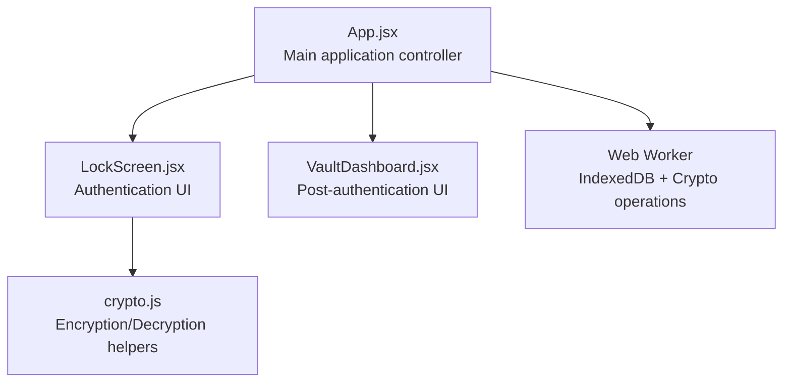
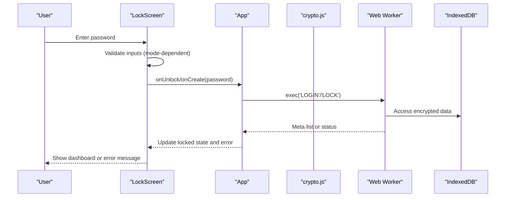
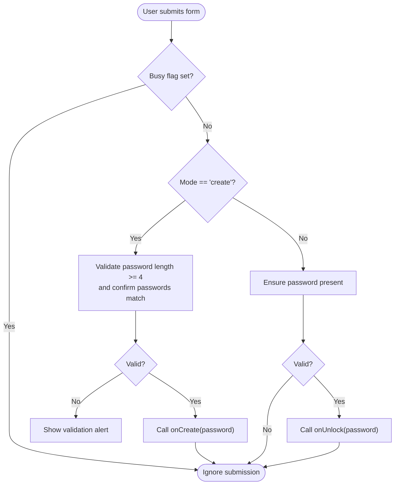
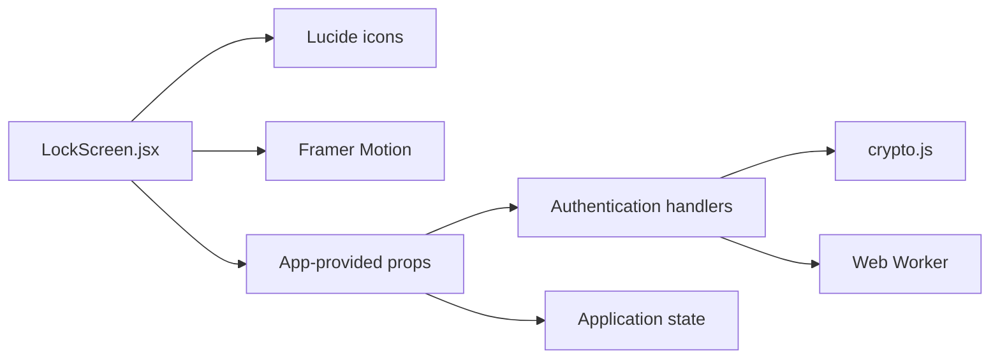

# LockScreen API

<cite>
**Referenced Files in This Document**
- [LockScreen.jsx](file://src/components/LockScreen.jsx)
- [App.jsx](file://src/App.jsx)
- [crypto.js](file://src/lib/crypto.js)
- [VaultDashboard.jsx](file://src/components/VaultDashboard.jsx)
</cite>

## Table of Contents
1. [Introduction](#introduction)
2. [Project Structure](#project-structure)
3. [Core Components](#core-components)
4. [Architecture Overview](#architecture-overview)
5. [Detailed Component Analysis](#detailed-component-analysis)
6. [Dependency Analysis](#dependency-analysis)
7. [Performance Considerations](#performance-considerations)
8. [Troubleshooting Guide](#troubleshooting-guide)
9. [Conclusion](#conclusion)

## Introduction
This document provides comprehensive API documentation for the LockScreen component responsible for authentication and security within the application. It covers the component's props interface, authentication flow, validation logic, error handling, and integration with the main App component and the underlying cryptographic subsystem. The LockScreen manages two primary authentication modes: create (vault creation) and unlock (vault access), and integrates with file import operations for vault restoration.

## Project Structure
The LockScreen component resides in the components directory and is integrated into the main App component. It interacts with the cryptographic library for encryption/decryption and with the VaultDashboard for post-authentication navigation.

**Diagram sources**
- [App.jsx:204-255](file://src/App.jsx#L204-L255)
- [LockScreen.jsx:98-221](file://src/components/LockScreen.jsx#L98-L221)
- [crypto.js:1-112](file://src/lib/crypto.js#L1-L112)
- [VaultDashboard.jsx:239-506](file://src/components/VaultDashboard.jsx#L239-L506)

**Section sources**
- [App.jsx:204-255](file://src/App.jsx#L204-L255)
- [LockScreen.jsx:98-221](file://src/components/LockScreen.jsx#L98-L221)

## Core Components
The LockScreen component exposes a props interface designed to integrate with the application's authentication and state management logic. It supports dual-mode operation (create/unlock) and provides hooks for vault creation, unlocking, and file import.

- Props interface
  - mode: string, either 'create' or 'unlock'
  - setMode: function, toggles between 'create' and 'unlock'
  - onUnlock: function, invoked with password to unlock vault
  - onCreate: function, invoked with password to create new vault
  - onOpenFile: function, invoked with selected file for vault import
  - hasVault: boolean, indicates presence of existing vault
  - error: string, displays authentication error messages

- Internal state
  - pw: string, master password input
  - pw2: string, password confirmation during creation
  - show: boolean, toggles password visibility
  - busy: boolean, prevents concurrent operations
  - fileRef: ref, hidden file input element

- Callbacks and methods
  - submit: validates inputs and invokes appropriate callback
  - pickFile: handles file selection and delegates to onOpenFile

**Section sources**
- [LockScreen.jsx:98-125](file://src/components/LockScreen.jsx#L98-L125)

## Architecture Overview
The LockScreen participates in a layered authentication architecture:
- UI Layer: LockScreen renders authentication forms and user feedback
- Application Layer: App manages authentication state, error handling, and mode switching
- Cryptographic Layer: crypto.js provides encryption/decryption primitives
- Security Layer: Web Worker enforces duress PIN and performs cryptographic operations

**Diagram sources**
- [LockScreen.jsx:105-119](file://src/components/LockScreen.jsx#L105-L119)
- [App.jsx:216-233](file://src/App.jsx#L216-L233)
- [crypto.js:20-38](file://src/lib/crypto.js#L20-L38)

## Detailed Component Analysis

### Props Interface and Mode Management
The LockScreen component accepts a comprehensive set of props enabling flexible authentication workflows:
- mode: Controls form rendering and validation rules
- setMode: Toggles between create and unlock modes
- onUnlock: Handles vault unlocking with password
- onCreate: Creates new vault with validated password
- onOpenFile: Processes selected vault file for import
- hasVault: Enables quick-switch to unlock mode
- error: Displays authentication errors

Mode switching logic:
- 'create' mode: Requires password confirmation and minimum length validation
- 'unlock' mode: Requires non-empty password input

**Section sources**
- [LockScreen.jsx:98-119](file://src/components/LockScreen.jsx#L98-L119)
- [LockScreen.jsx:202-213](file://src/components/LockScreen.jsx#L202-L213)

### Authentication Flow and Validation
The authentication flow varies by mode and includes robust validation and user feedback:

**Diagram sources**
- [LockScreen.jsx:105-119](file://src/components/LockScreen.jsx#L105-L119)

Password validation rules:
- Minimum length: 4 characters
- Confirmation: pw must equal pw2 during creation
- Unlock: password must be non-empty

User feedback mechanisms:
- Real-time error display when props.error is provided
- Loading state during authentication operations
- Toggle visibility for password input

**Section sources**
- [LockScreen.jsx:107-118](file://src/components/LockScreen.jsx#L107-L118)
- [LockScreen.jsx:180-184](file://src/components/LockScreen.jsx#L180-L184)

### Duress Detection Mechanism
The application implements a sophisticated duress detection system:
- Hardcoded PIN: "6666"
- Trigger behavior: Initiates cryptographic destruction of all data
- User notification: Renders a dedicated duress screen

Security implications:
- Immediate and irreversible data destruction
- No recovery path for destroyed data
- Psychological deterrent against coercion

**Section sources**
- [App.jsx:7-7](file://src/App.jsx#L7-L7)
- [App.jsx:74-84](file://src/App.jsx#L74-L84)
- [App.jsx:193-201](file://src/App.jsx#L193-L201)
- [App.jsx:222-226](file://src/App.jsx#L222-L226)

### Form Validation and Error Handling
The LockScreen implements layered validation and error handling:
- Client-side validation: Prevents invalid submissions
- Server-side validation: Delegated to application handlers
- Error propagation: Errors are displayed to the user
- User feedback: Clear messaging for validation failures

Validation scenarios:
- Creation mode: Length and confirmation checks
- Unlock mode: Presence validation
- File import: Format validation before processing

**Section sources**
- [LockScreen.jsx:107-118](file://src/components/LockScreen.jsx#L107-L118)
- [LockScreen.jsx:180-184](file://src/components/LockScreen.jsx#L180-L184)

### Method Signatures and Integration Points
The LockScreen component integrates with several application methods:

- Password validation
  - Signature: submit() -> Promise<void>
  - Behavior: Validates inputs based on mode and invokes appropriate callback

- Vault creation
  - Signature: onCreate(password: string) -> Promise<void>
  - Behavior: Encrypts empty state with password and saves to persistent storage

- Vault unlocking
  - Signature: onUnlock(password: string) -> Promise<void>
  - Behavior: Loads encrypted vault, decrypts with password, updates state

- File import operations
  - Signature: onOpenFile(file: File) -> void
  - Behavior: Reads file content, validates format, saves to persistent storage

- Mode switching
  - Signature: setMode(mode: 'create' | 'unlock') -> void
  - Behavior: Updates component mode and associated UI state

Integration with App component:
- State management: locked, notes, error, duress
- Authentication handlers: handleUnlock, handleLock
- Vault operations: handleCreate, handleUnlock, handleOpenFile

**Section sources**
- [LockScreen.jsx:105-125](file://src/components/LockScreen.jsx#L105-L125)
- [App.jsx:342-370](file://src/App.jsx#L342-L370)
- [App.jsx:372-389](file://src/App.jsx#L372-L389)

### Security State Transitions
The LockScreen participates in critical security state transitions:
- Locked state: Initial state requiring authentication
- Unlocked state: Post-authentication access to vault
- Duress state: Triggered by duress PIN, displays destruction screen
- Error state: Authentication failure with user feedback

State transitions:
- Successful unlock: locked=false, notes populated
- Failed unlock: error message displayed
- Duress trigger: duress=true, renders destruction screen
- Manual lock: handleLock resets state

**Section sources**
- [App.jsx:206-235](file://src/App.jsx#L206-L235)
- [App.jsx:228-233](file://src/App.jsx#L228-L233)

## Dependency Analysis
The LockScreen component has minimal external dependencies and maintains clear separation of concerns:

**Diagram sources**
- [LockScreen.jsx:1-3](file://src/components/LockScreen.jsx#L1-L3)
- [LockScreen.jsx:98-221](file://src/components/LockScreen.jsx#L98-L221)

Key dependencies:
- Lucide icons for UI elements
- Framer Motion for animations
- React state hooks for local state management
- Application-provided callbacks for authentication logic

**Section sources**
- [LockScreen.jsx:1-3](file://src/components/LockScreen.jsx#L1-L3)
- [LockScreen.jsx:98-221](file://src/components/LockScreen.jsx#L98-L221)

## Performance Considerations
- Input validation occurs synchronously on the UI thread, minimizing latency
- Busy state prevents concurrent operations, avoiding race conditions
- Animation transitions use hardware-accelerated CSS properties
- File operations are handled asynchronously to prevent UI blocking

Optimization opportunities:
- Debounce password input validation for improved responsiveness
- Implement lazy loading for heavy cryptographic operations
- Consider caching decrypted content for frequently accessed notes

## Troubleshooting Guide
Common issues and resolutions:

Authentication failures:
- Verify password meets minimum length requirement (4+ characters)
- Ensure password confirmation matches during creation
- Check for corrupted vault data or incorrect file format

Duress detection:
- Confirm duress PIN is exactly "6666"
- Understand that data destruction is immediate and irreversible
- Verify that duress screen appears after PIN entry

File import problems:
- Ensure .vault files are properly formatted
- Verify sufficient browser permissions for file access
- Check that file contains valid encrypted data

UI responsiveness:
- Busy state prevents multiple submissions
- Error messages provide clear feedback
- Password visibility toggle improves usability

**Section sources**
- [LockScreen.jsx:107-118](file://src/components/LockScreen.jsx#L107-L118)
- [LockScreen.jsx:180-184](file://src/components/LockScreen.jsx#L180-L184)
- [App.jsx:222-226](file://src/App.jsx#L222-L226)

## Conclusion
The LockScreen component provides a secure, user-friendly authentication interface with robust validation, clear error handling, and seamless integration with the application's cryptographic subsystem. Its dual-mode operation supports both vault creation and access, while the duress detection mechanism ensures maximum data protection. The component's clean API and clear separation of concerns facilitate maintainability and future enhancements.