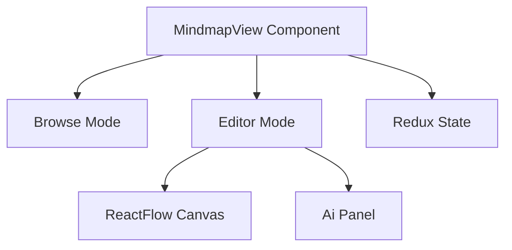
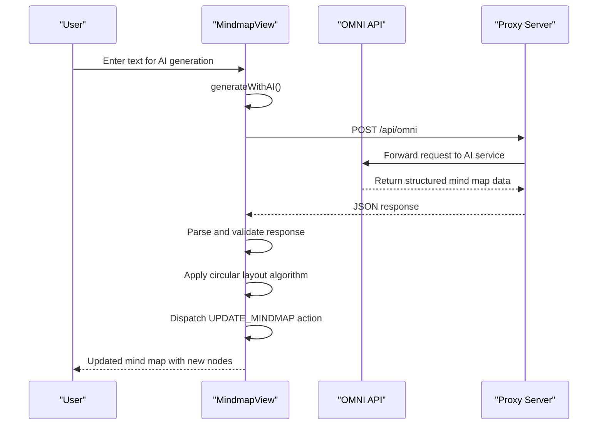

# MindmapView API

<cite>
**Referenced Files in This Document**
- [MindmapView.jsx](file://src/components/MindmapView.jsx)
- [App.jsx](file://src/App.jsx)
- [crypto.js](file://src/lib/crypto.js)
- [server.js](file://server.js)
- [package.json](file://package.json)
</cite>

## Table of Contents
1. [Introduction](#introduction)
2. [Component Overview](#component-overview)
3. [Props Interface](#props-interface)
4. [State Management](#state-management)
5. [XYFlow Integration](#xyflow-integration)
6. [AI Integration](#ai-integration)
7. [Data Persistence](#data-persistence)
8. [Component Methods](#component-methods)
9. [Usage Examples](#usage-examples)
10. [Integration Patterns](#integration-patterns)
11. [Troubleshooting](#troubleshooting)

## Introduction

MindmapView is a React component that provides interactive diagram creation and editing capabilities using the @xyflow/react library. It enables users to create, manipulate, and visualize mind maps with real-time collaboration features and AI-powered content generation.

The component integrates seamlessly with a Redux-like state management system and provides a comprehensive interface for managing mind map data structures, including nodes, edges, and metadata.

## Component Overview

MindmapView serves as a dual-mode interface:
- **Mind Map Browser Mode**: Displays existing mind maps with creation and deletion capabilities
- **Editor Mode**: Provides interactive canvas for creating and editing individual mind maps



**Diagram sources**
- [MindmapView.jsx:7-307](file://src/components/MindmapView.jsx#L7-L307)

## Props Interface

The MindmapView component expects a specific props interface for state management:

| Property | Type | Required | Description |
|----------|------|----------|-------------|
| `state` | Object | Yes | Application state containing mindmaps array and settings |
| `dispatch` | Function | Yes | Action dispatcher for state updates |

### State Structure

The component operates on a state object with the following structure:

```javascript
const state = {
  mindmaps: Array,           // Array of mind map objects
  settings: Object,          // Application settings
  // Other state properties...
};

const mindmap = {
  id: String,               // Unique identifier
  name: String,             // Mind map name
  nodes: Array,             // Node definitions
  edges: Array,             // Edge connections
  created: Date,            // Creation timestamp
  // Additional metadata...
};
```

**Section sources**
- [App.jsx:265-306](file://src/App.jsx#L265-L306)
- [MindmapView.jsx:7-18](file://src/components/MindmapView.jsx#L7-L18)

## State Management

MindmapView manages several internal state variables for UI and functionality:

### Internal State Variables

| State Variable | Type | Purpose |
|----------------|------|---------|
| `activeMapId` | String | Currently selected mind map ID |
| `newName` | String | New mind map name input |
| `aiText` | String | AI generation input text |
| `isGenerating` | Boolean | Loading state during AI processing |
| `aiError` | String | Error messages from AI operations |

### State Computation

The component uses React's `useMemo` for efficient state computation:

```javascript
const activeMap = useMemo(() => {
  return state.mindmaps?.find(m => m.id === activeMapId) || null;
}, [state.mindmaps, activeMapId]);
```

**Section sources**
- [MindmapView.jsx:8-18](file://src/components/MindmapView.jsx#L8-L18)

## XYFlow Integration

The component integrates with @xyflow/react for interactive diagram manipulation:

### Core XYFlow Features

1. **Node Manipulation**: Drag-and-drop positioning with real-time updates
2. **Edge Creation**: Visual connection between nodes
3. **Canvas Navigation**: Zoom, pan, and fit-to-view controls
4. **Visual Feedback**: Mini-map for navigation and background patterns

### XYFlow Configuration

```javascript
<ReactFlow
  nodes={activeMap.nodes || []}
  edges={activeMap.edges || []}
  onNodesChange={onNodesChange}
  onEdgesChange={onEdgesChange}
  onConnect={onConnect}
  fitView
  className="bg-theme-bg"
  colorMode={state.settings?.theme === 'liwood' ? 'light' : 'dark'}
>
  <Background color="var(--accent-color)" gap={20} size={1} opacity={0.15} />
  <Controls className="!bg-theme-panel !border-theme-border !fill-[var(--text-primary)]" />
  <MiniMap className="!bg-theme-panel !border-theme-border" maskColor="var(--border-color)" nodeColor="var(--accent-color)" />
</ReactFlow>
```

**Section sources**
- [MindmapView.jsx:177-190](file://src/components/MindmapView.jsx#L177-L190)

### Event Handlers

The component implements three primary event handlers:

1. **onNodesChange**: Handles node position updates
2. **onEdgesChange**: Manages edge modifications
3. **onConnect**: Creates new connections between nodes

**Section sources**
- [MindmapView.jsx:33-76](file://src/components/MindmapView.jsx#L33-L76)

## AI Integration

MindmapView provides AI-powered content generation through an external service integration:

### AI Generation Workflow



**Diagram sources**
- [MindmapView.jsx:78-152](file://src/components/MindmapView.jsx#L78-L152)
- [server.js:21-81](file://server.js#L21-L81)

### AI Prompt Structure

The component sends a structured prompt to the AI service:

```javascript
const prompt = `
Extract a mindmap from the following text. 
Return ONLY a valid JSON object without any markdown tags or code blocks.
The JSON must have this structure:
{
  "nodes": [{ "id": "1", "label": "Node Label" }],
  "edges": [{ "source": "1", "target": "2" }]
}
Text: ${aiText}
`;
```

### Response Processing

The AI response undergoes validation and transformation:

1. **JSON Parsing**: Extracts nodes and edges from AI response
2. **Layout Algorithm**: Applies circular positioning for generated nodes
3. **ID Generation**: Creates unique identifiers for new nodes and edges
4. **State Update**: Dispatches UPDATE_MINDMAP action with new data

**Section sources**
- [MindmapView.jsx:84-152](file://src/components/MindmapView.jsx#L84-L152)

## Data Persistence

The component participates in the application's encrypted storage system:

### Storage Integration

MindmapView works within a Redux-like state management system that automatically persists data:

```javascript
// Automatic encryption and saving
useEffect(() => {
  if (!locked && password) {
    const save = async () => {
      try {
        const payload = await encryptData(state, password);
        await saveVault(payload);
        setHasVault(true);
      } catch (e) {
        console.error("Auto-save failed", e);
      }
    };
    save();
  }
}, [state, locked, password]);
```

### Encryption Format

The storage system uses a standardized format:
- **Format**: `BASE1:salt:iv:ciphertext`
- **Algorithm**: AES-GCM with PBKDF2 key derivation
- **Storage**: Browser localStorage or file system

**Section sources**
- [App.jsx:326-340](file://src/App.jsx#L326-L340)
- [crypto.js:20-38](file://src/lib/crypto.js#L20-L38)

## Component Methods

### Public Methods

The component exposes several methods for programmatic interaction:

#### `addMindmap()`
Creates a new mind map with a root node.

**Parameters**: None
**Returns**: None
**Side Effects**: Dispatches ADD_MINDMAP action

#### `generateWithAI()`
Processes user text through AI service to generate mind map nodes.

**Parameters**: None
**Returns**: Promise<void>
**Side Effects**: Updates AI state, dispatches UPDATE_MINDMAP action

#### `onNodesChange(changes)`
Handles node position updates from XYFlow.

**Parameters**: `changes` (Array) - XYFlow change events
**Returns**: None
**Side Effects**: Dispatches UPDATE_MINDMAP action

#### `onEdgesChange(changes)`
Manages edge modifications from XYFlow.

**Parameters**: `changes` (Array) - XYFlow change events
**Returns**: None
**Side Effects**: Dispatches UPDATE_MINDMAP action

#### `onConnect(params)`
Creates new connections between nodes.

**Parameters**: `params` (Object) - XYFlow connection parameters
**Returns**: None
**Side Effects**: Dispatches UPDATE_MINDMAP action

**Section sources**
- [MindmapView.jsx:20-76](file://src/components/MindmapView.jsx#L20-L76)

## Usage Examples

### Component Initialization

Basic component setup with state management:

```jsx
function App() {
  const [state, dispatch] = useReducer(appReducer, emptyState);
  
  return (
    <MindmapView 
      state={state} 
      dispatch={dispatch} 
    />
  );
}
```

### Creating a New Mind Map

```javascript
// User input handler
const handleCreateMap = () => {
  if (newName.trim()) {
    dispatch({
      type: 'ADD_MINDMAP',
      payload: {
        name: newName,
        nodes: [{ 
          id: 'root', 
          position: { x: 250, y: 250 }, 
          data: { label: newName },
          type: 'input'
        }],
        edges: []
      }
    });
    setNewName('');
  }
};
```

### AI-Powered Content Generation

```javascript
// AI generation workflow
const handleAIGeneration = async () => {
  if (!aiText.trim() || !activeMap) return;
  
  setIsGenerating(true);
  setAiError('');
  
  try {
    const response = await fetch('/api/omni', {
      method: 'POST',
      headers: { 'Content-Type': 'application/json' },
      body: JSON.stringify({ text: prompt })
    });
    
    const data = await response.json();
    // Process AI response and update state
  } catch (error) {
    setAiError('Generation failed');
  } finally {
    setIsGenerating(false);
  }
};
```

### Real-time Collaboration Patterns

The component supports collaborative editing through state synchronization:

```javascript
// Node position update
const handleNodePosition = (changes) => {
  dispatch({
    type: 'UPDATE_MINDMAP',
    payload: {
      id: activeMapId,
      nodes: applyNodeChanges(changes, activeMap.nodes)
    }
  });
};
```

**Section sources**
- [MindmapView.jsx:20-152](file://src/components/MindmapView.jsx#L20-L152)

## Integration Patterns

### External Service Integration

The component integrates with multiple external systems:

1. **AI Service Proxy**: `/api/omni` endpoint for mind map generation
2. **Google Cloud Services**: Authentication and external API access
3. **Local Storage**: Encrypted data persistence

### Dependency Management

Key dependencies include:

```json
{
  "@xyflow/react": "^12.11.1",
  "framer-motion": "^12.40.0",
  "lucide-react": "^1.21.0"
}
```

**Section sources**
- [package.json:12-24](file://package.json#L12-L24)
- [server.js:1-81](file://server.js#L1-L81)

## Troubleshooting

### Common Issues and Solutions

#### AI Generation Failures
- **Symptom**: AI panel shows error messages
- **Cause**: Network connectivity or invalid AI response
- **Solution**: Check network connection and validate AI service availability

#### Mind Map Not Loading
- **Symptom**: Active mind map disappears
- **Cause**: Invalid map ID or corrupted state
- **Solution**: Reset activeMapId or reload application state

#### XYFlow Events Not Working
- **Symptom**: Nodes cannot be moved or connected
- **Cause**: Missing event handlers or invalid state
- **Solution**: Verify onNodesChange, onEdgesChange, and onConnect handlers

### Debugging Tips

1. **Console Logging**: Enable logging for state changes and API responses
2. **Network Inspection**: Monitor `/api/omni` requests and responses
3. **State Validation**: Verify mind map structure before dispatching updates

**Section sources**
- [MindmapView.jsx:146-152](file://src/components/MindmapView.jsx#L146-L152)