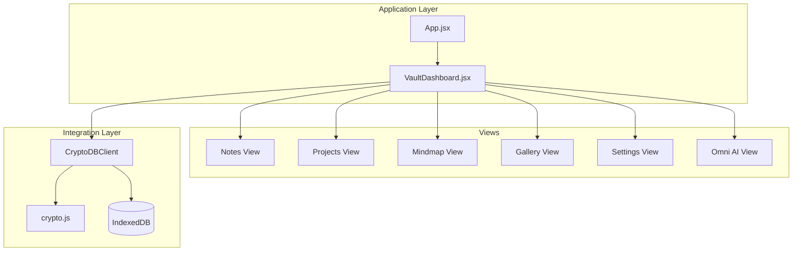
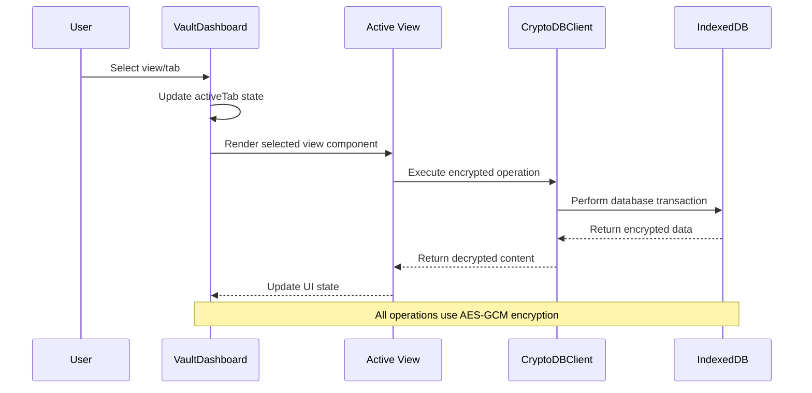
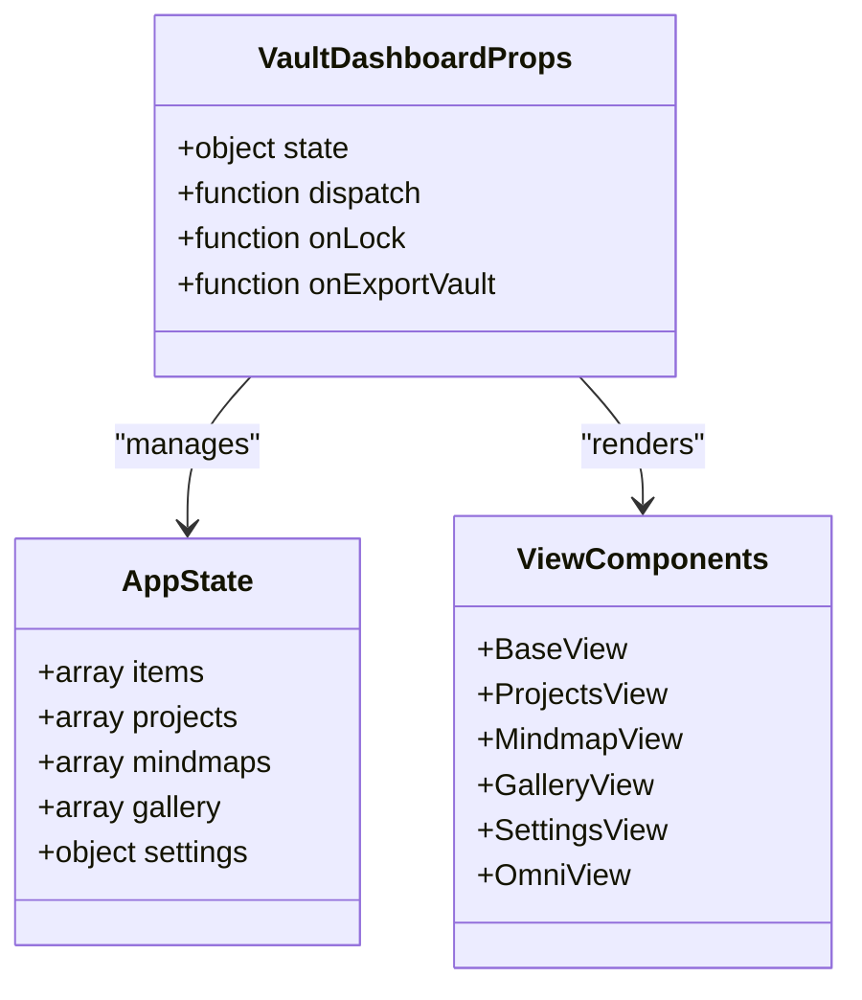

# VaultDashboard API

<cite>
**Referenced Files in This Document**
- [VaultDashboard.jsx](file://src/components/VaultDashboard.jsx)
- [App.jsx](file://src/App.jsx)
- [crypto.js](file://src/lib/crypto.js)
- [MindmapView.jsx](file://src/components/MindmapView.jsx)
- [index.css](file://src/index.css)
- [package.json](file://package.json)
</cite>

## Table of Contents
1. [Introduction](#introduction)
2. [Project Structure](#project-structure)
3. [Core Components](#core-components)
4. [Architecture Overview](#architecture-overview)
5. [Detailed Component Analysis](#detailed-component-analysis)
6. [Dependency Analysis](#dependency-analysis)
7. [Performance Considerations](#performance-considerations)
8. [Troubleshooting Guide](#troubleshooting-guide)
9. [Conclusion](#conclusion)
10. [Appendices](#appendices)

## Introduction
This document provides comprehensive API documentation for the VaultDashboard component, which serves as the main application interface for the OMNI-TODO system. The component manages multiple views (notes, projects, mindmaps, gallery, settings), integrates with an encrypted database client, and orchestrates user interactions for secure note management, project tracking, and media gallery operations.

## Project Structure
The VaultDashboard resides in the components directory alongside supporting views and utilities. It integrates with the main application through a client abstraction that handles cryptographic operations and IndexedDB persistence.



**Diagram sources**
- [App.jsx:204-257](file://src/App.jsx#L204-L257)
- [VaultDashboard.jsx:1389-1540](file://src/components/VaultDashboard.jsx#L1389-L1540)

**Section sources**
- [package.json:12-24](file://package.json#L12-L24)
- [index.css:7-50](file://src/index.css#L7-L50)

## Core Components
The VaultDashboard component is structured around several key subsystems:

### Props Interface
The component accepts the following props:
- `state`: Global application state object containing items, projects, mindmaps, gallery, and settings
- `dispatch`: Redux-style reducer function for state updates
- `onLock`: Callback function to lock the application
- `onExportVault`: Callback function to export encrypted vault data

### State Management
Internal component state includes:
- `activeTab`: Current active view/tab
- `isMobileMenuOpen`: Mobile navigation menu state
- `isSidebarCollapsed`: Sidebar collapse state
- Local view-specific state managed within individual view components

### View Modes
The dashboard supports five distinct view modes:
- Base: Note-taking and editing interface
- Projects: Project management and tracking
- Mindmap: Interactive mind mapping with AI integration
- Omni: Personal AI assistant interface
- Gallery: Image generation and management
- Settings: Application configuration and data management

**Section sources**
- [VaultDashboard.jsx:1389-1540](file://src/components/VaultDashboard.jsx#L1389-L1540)

## Architecture Overview
The VaultDashboard operates as a container component that manages view switching and delegates functionality to specialized view components. It maintains a clean separation between presentation and business logic through the use of a centralized state management system.



**Diagram sources**
- [App.jsx:167-190](file://src/App.jsx#L167-L190)
- [VaultDashboard.jsx:1389-1540](file://src/components/VaultDashboard.jsx#L1389-L1540)

## Detailed Component Analysis

### Props Interface and State Management
The VaultDashboard component receives a comprehensive props interface designed for state-driven architecture:



**Diagram sources**
- [VaultDashboard.jsx:1389-1540](file://src/components/VaultDashboard.jsx#L1389-L1540)

### View Management System
The component implements a sophisticated view management system with the following characteristics:

#### Navigation Patterns
- Tab-based navigation with persistent sidebar
- Mobile-responsive design with collapsible sidebar
- Smooth transitions between view modes using Framer Motion

#### Data Display Logic
Each view implements its own filtering, sorting, and display logic:
- Notes view: Tag-based filtering, search functionality, recent-first sorting
- Projects view: Status-based filtering, progress tracking
- Mindmap view: Interactive graph rendering with AI-powered generation
- Gallery view: Image grid with modal expansion and prompt-based generation
- Settings view: Configuration panels with validation

### Integration with CryptoDBClient
The component integrates with a dedicated client for encrypted data operations:

#### Encrypted Data Operations
The client provides methods for secure data handling:
- `LOAD_CONTENT`: Retrieve and decrypt note content
- `SAVE_NOTE`: Encrypt and store note metadata and content
- `DELETE_NOTE`: Mark notes as deleted with tombstone pattern
- `EXPORT_VAULT`: Export complete encrypted backup
- `IMPORT_VAULT`: Import and merge encrypted backups

#### Security Implementation
Data encryption uses AES-GCM with PBKDF2 key derivation:
- 256-bit AES-GCM encryption
- HMAC-SHA-256 integrity verification
- Random salt and IV generation
- Secure key derivation with 250,000 iterations

**Section sources**
- [App.jsx:167-190](file://src/App.jsx#L167-L190)
- [crypto.js:20-38](file://src/lib/crypto.js#L20-L38)

### Note Management APIs
The notes management system provides comprehensive CRUD operations:

#### Adding Notes
- Automatic ID generation using timestamp-based unique identifiers
- Initial metadata creation with timestamps and empty content
- Immediate synchronization with encrypted storage

#### Updating Notes
- Debounced auto-save mechanism (1.5 second delay)
- Real-time tag extraction from content
- Preview generation for list display
- Conflict resolution through last-write-wins strategy

#### Deleting Notes
- Confirmation dialog for destructive operations
- Tombstone pattern implementation for data retention
- Automatic cleanup of associated content

#### Search and Filtering
- Full-text search across titles, previews, and tags
- Tag-based filtering with active tag highlighting
- Case-insensitive matching with diacritic normalization
- Live filtering during user input

**Section sources**
- [VaultDashboard.jsx:276-316](file://src/components/VaultDashboard.jsx#L276-L316)
- [VaultDashboard.jsx:29-134](file://src/components/VaultDashboard.jsx#L29-L134)

### Project Tracking Methods
The projects view implements a comprehensive project management system:

#### Project Lifecycle
- Creation with default status and progress tracking
- Expansion/collapse for detailed views
- Progress visualization with animated bars
- Issue management integration points

#### State Persistence
- Project data stored in global state
- Automatic saving through reducer actions
- Timestamp-based ordering and filtering

**Section sources**
- [VaultDashboard.jsx:912-1033](file://src/components/VaultDashboard.jsx#L912-L1033)

### Gallery Manipulation Functions
The gallery view provides AI-powered image generation and management:

#### Image Generation
- Prompt-based image generation via external API
- Base64 encoding for immediate display
- Error handling and loading states
- Integration with gallery state management

#### Gallery Operations
- Grid-based image display with hover effects
- Modal expansion for detailed viewing
- Individual image deletion with confirmation
- Creation timestamp and prompt preservation

**Section sources**
- [VaultDashboard.jsx:1036-1186](file://src/components/VaultDashboard.jsx#L1036-L1186)

### Settings Management
The settings view provides comprehensive configuration options:

#### Application Settings
- Theme selection (Liwood, Dark, Cyberpunk)
- Auto-lock timeout configuration
- API authentication method selection
- Backup and restore operations

#### Data Management
- Encrypted vault export/import
- JSON backup for manual inspection
- File-based import/export workflows
- Validation and error handling

**Section sources**
- [VaultDashboard.jsx:1189-1386](file://src/components/VaultDashboard.jsx#L1189-L1386)

### Mindmap Integration
The component integrates with the MindmapView for interactive graph creation:

#### AI-Powered Generation
- Text-to-mindmap conversion via external API
- JSON parsing with validation
- Automatic node positioning algorithms
- Edge connection generation

#### Interactive Editing
- Drag-and-drop node manipulation
- Edge creation and deletion
- Real-time state synchronization
- Theme-aware rendering

**Section sources**
- [MindmapView.jsx:78-152](file://src/components/MindmapView.jsx#L78-L152)
- [VaultDashboard.jsx:445-453](file://src/components/VaultDashboard.jsx#L445-L453)

## Dependency Analysis
The VaultDashboard component has well-defined dependencies and integration points:

```mermaid
graph LR
subgraph "External Dependencies"
React[React ^19.2.6]
Motion[Framer Motion ^12.40.0]
Lucide[Lucide React ^1.21.0]
XYFlow[@xyflow/react ^12.11.1]
end
subgraph "Internal Dependencies"
Dashboard[VaultDashboard.jsx]
Mindmap[MindmapView.jsx]
Crypto[crypto.js]
App[App.jsx]
end
Dashboard --> Mindmap
Dashboard --> Crypto
Dashboard --> App
Mindmap --> XYFlow
Dashboard --> Motion
Dashboard --> Lucide
```

**Diagram sources**
- [package.json:12-24](file://package.json#L12-L24)
- [VaultDashboard.jsx:8-8](file://src/components/VaultDashboard.jsx#L8-L8)

### Component Coupling
- Low coupling between views through shared props interface
- Strong cohesion within each view component
- Clear separation of concerns between UI and data layers
- Minimal circular dependencies

### Integration Points
- CryptoDBClient for all encrypted operations
- Global state management through reducer pattern
- Theme system through CSS custom properties
- Responsive design through Tailwind utilities

**Section sources**
- [package.json:12-24](file://package.json#L12-L24)
- [index.css:7-50](file://src/index.css#L7-L50)

## Performance Considerations
The component implements several performance optimization strategies:

### State Management Optimizations
- Memoized selectors for derived data
- Efficient filtering algorithms with early termination
- Debounced input handling for search operations
- Virtualized lists for large datasets

### Rendering Optimizations
- Component-level memoization for expensive computations
- Conditional rendering based on active tabs
- Lazy loading for heavy view components
- Efficient DOM updates through controlled components

### Memory Management
- Proper cleanup of timers and intervals
- Cleanup of event listeners and subscriptions
- Efficient state updates to minimize re-renders
- Garbage collection-friendly data structures

## Troubleshooting Guide

### Common Issues and Solutions
- **Encryption errors**: Verify password correctness and key derivation
- **Database connectivity**: Check IndexedDB availability and permissions
- **View rendering**: Ensure proper state initialization and prop passing
- **Theme issues**: Verify CSS custom property definitions and theme switching

### Error Handling Patterns
The component implements comprehensive error handling:
- Try-catch blocks around asynchronous operations
- User-friendly error messages with actionable feedback
- Graceful degradation when features are unavailable
- Logging mechanisms for debugging and monitoring

### Debugging Strategies
- Enable developer tools for state inspection
- Monitor network requests for API failures
- Check browser console for JavaScript errors
- Validate encryption keys and database integrity

**Section sources**
- [App.jsx:216-233](file://src/App.jsx#L216-L233)
- [VaultDashboard.jsx:141-171](file://src/components/VaultDashboard.jsx#L141-L171)

## Conclusion
The VaultDashboard component provides a robust, secure, and feature-rich interface for the OMNI-TODO system. Its modular architecture, comprehensive encryption support, and intuitive user interface make it suitable for both personal and professional knowledge management tasks. The component's design emphasizes security, performance, and maintainability while providing extensive functionality for note management, project tracking, and creative workflows.

## Appendices

### API Reference Summary
- **Props**: state, dispatch, onLock, onExportVault
- **Methods**: View switching, data operations, settings management
- **Events**: User interactions, state changes, error conditions
- **Security**: AES-GCM encryption, HMAC integrity, secure key derivation

### Usage Examples
The component is designed for easy integration:
- Pass global state and dispatch functions
- Handle lock and export callbacks
- Configure theme and settings through state updates
- Manage view transitions programmatically

### Best Practices
- Always validate user input before state updates
- Implement proper error handling for all async operations
- Use debouncing for search and filter operations
- Ensure proper cleanup of resources and subscriptions