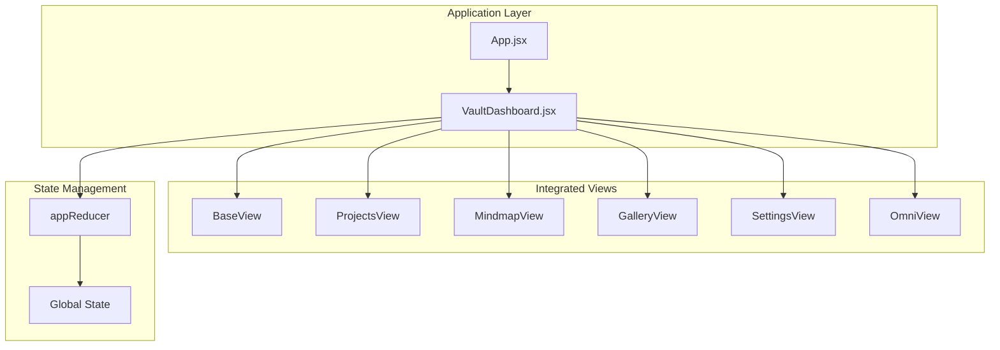
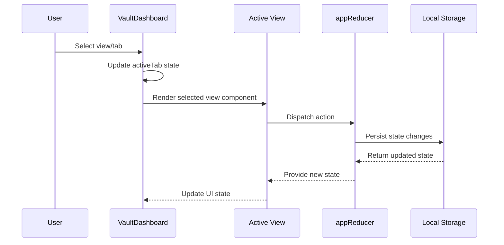
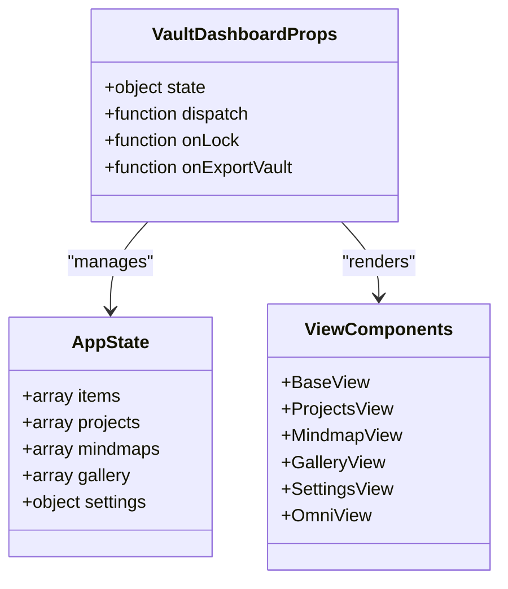

# VaultDashboard API

<cite>
**Referenced Files in This Document**
- [VaultDashboard.jsx](file://src/components/VaultDashboard.jsx)
- [App.jsx](file://src/App.jsx)
- [crypto.js](file://src/lib/crypto.js)
- [MindmapView.jsx](file://src/components/MindmapView.jsx)
- [index.css](file://src/index.css)
- [package.json](file://package.json)
</cite>

## Update Summary
**Changes Made**
- Updated to reflect the rewritten VaultDashboard component with new props interface
- Added comprehensive documentation for the new state-driven architecture
- Documented the enhanced view management system with five distinct modes
- Updated API documentation to match the current implementation
- Added new sections for BaseView, ProjectsView, OmniView, and GalleryView components

## Table of Contents
1. [Introduction](#introduction)
2. [Project Structure](#project-structure)
3. [Core Components](#core-components)
4. [Architecture Overview](#architecture-overview)
5. [Detailed Component Analysis](#detailed-component-analysis)
6. [Dependency Analysis](#dependency-analysis)
7. [Performance Considerations](#performance-considerations)
8. [Troubleshooting Guide](#troubleshooting-guide)
9. [Conclusion](#conclusion)
10. [Appendices](#appendices)

## Introduction
This document provides comprehensive API documentation for the VaultDashboard component, which serves as the main application interface for the OMNI-TODO system. The component manages multiple integrated views (Base, Projects, Mindmaps, OMNI AI, Gallery, Settings), operates with a centralized state management system, and orchestrates user interactions for knowledge management, project tracking, and creative workflows.

## Project Structure
The VaultDashboard component is part of a modern React application with a sophisticated state management architecture. It integrates with a reducer-based system that manages all application state including items, projects, mindmaps, gallery, and settings.



**Diagram sources**
- [App.jsx:308-441](file://src/App.jsx#L308-L441)
- [VaultDashboard.jsx:1389-1540](file://src/components/VaultDashboard.jsx#L1389-L1540)

**Section sources**
- [package.json:12-24](file://package.json#L12-L24)
- [index.css:7-50](file://src/index.css#L7-L50)

## Core Components
The VaultDashboard component is structured around a comprehensive state-driven architecture with six integrated view modes:

### Props Interface
The component accepts the following props:
- `state`: Global application state object containing items, projects, mindmaps, gallery, and settings
- `dispatch`: Redux-style reducer function for state updates
- `onLock`: Callback function to lock the application
- `onExportVault`: Callback function to export encrypted vault data

### State Management
The component maintains minimal internal state focused on UI controls:
- `activeTab`: Currently active view/tab (base, projects, mindmap, omni, gallery, settings)
- `isMobileMenuOpen`: Mobile navigation menu state
- `isSidebarCollapsed`: Sidebar collapse state for responsive design

### View Modes
The dashboard supports six distinct integrated view modes:
- **Base**: Comprehensive note-taking and knowledge management system
- **Projects**: Project management and tracking with progress visualization
- **Mindmap**: Interactive mind mapping with AI-powered generation
- **OMNI AI**: Personal AI assistant with automated task extraction
- **Gallery**: AI-powered image generation and management
- **Settings**: Application configuration and data management

**Section sources**
- [VaultDashboard.jsx:1389-1540](file://src/components/VaultDashboard.jsx#L1389-L1540)

## Architecture Overview
The VaultDashboard operates as a container component that manages view switching and delegates functionality to specialized view components. It maintains a clean separation between presentation and business logic through a centralized reducer-based state management system.



**Diagram sources**
- [App.jsx:308-441](file://src/App.jsx#L308-L441)
- [VaultDashboard.jsx:1389-1540](file://src/components/VaultDashboard.jsx#L1389-L1540)

## Detailed Component Analysis

### Props Interface and State Management
The VaultDashboard component receives a comprehensive props interface designed for state-driven architecture:



**Diagram sources**
- [VaultDashboard.jsx:1389-1540](file://src/components/VaultDashboard.jsx#L1389-L1540)

### View Management System
The component implements a sophisticated view management system with the following characteristics:

#### Navigation Patterns
- Tab-based navigation with persistent sidebar
- Mobile-responsive design with collapsible sidebar
- Smooth transitions between view modes using Framer Motion
- Integrated mobile menu for touch devices

#### Data Display Logic
Each view implements its own filtering, sorting, and display logic:
- **Base View**: Comprehensive note-taking with type categorization (ideas, tasks, interesting, links)
- **Projects View**: Project lifecycle management with progress tracking and issue management
- **Mindmap View**: Interactive graph creation with AI-powered generation and manual editing
- **Gallery View**: AI image generation with modal expansion and prompt-based management
- **Settings View**: Configuration panels with validation and data export/import
- **OMNI AI View**: Personal assistant with automated task extraction and action execution

### Integration with State Management
The component integrates with a centralized reducer system for all data operations:

#### State Operations
The reducer provides methods for comprehensive CRUD operations:
- `ADD_ITEM`: Create new knowledge entries with automatic ID generation
- `UPDATE_ITEM`: Update existing entries with conflict resolution
- `DELETE_ITEM`: Remove entries with proper cleanup
- `ADD_PROJECT`: Create new projects with default status and progress
- `UPDATE_PROJECT`: Modify project details and progress
- `DELETE_PROJECT`: Remove projects and associated data
- `ADD_MINDMAP`: Create new mindmap structures
- `UPDATE_MINDMAP`: Edit mindmap nodes and connections
- `DELETE_MINDMAP`: Remove mindmaps
- `ADD_IMAGE`: Add generated images to gallery
- `DELETE_IMAGE`: Remove images from gallery
- `UPDATE_SETTINGS`: Modify application preferences
- `ADD_CERBER_MSG`: Store OMNI AI conversation history
- `LOAD`: Initialize state from encrypted storage

#### State Persistence
All state changes are automatically persisted to encrypted local storage:
- Automatic save on state changes
- Encryption using AES-GCM with PBKDF2 key derivation
- Secure key management with random salts and iterations
- Integrity verification through HMAC-SHA-256

**Section sources**
- [App.jsx:308-441](file://src/App.jsx#L308-L441)
- [crypto.js:20-38](file://src/lib/crypto.js#L20-L38)

### Base View - Comprehensive Knowledge Management
The BaseView provides a sophisticated note-taking and knowledge management system:

#### Entry Types and Management
- **Ideas**: Creative thoughts and inspiration
- **Tasks**: Actionable items with status tracking
- **Interesting**: Curated content and resources
- **Links**: External URLs and references

#### Entry Operations
- Automatic ID generation using timestamp-based unique identifiers
- Type-based categorization with visual indicators
- Rich text editing with markdown-like features
- Status management for tasks (open, in-progress, completed)
- Priority levels for task organization

#### Search and Organization
- Full-text search across titles, descriptions, and URLs
- Type-based filtering with visual category indicators
- Recent-first sorting with timestamp-based ordering
- Responsive sidebar with collapsible sections

**Section sources**
- [VaultDashboard.jsx:524-744](file://src/components/VaultDashboard.jsx#L524-L744)

### Project Tracking Methods
The ProjectsView implements a comprehensive project management system:

#### Project Lifecycle
- Creation with default status (planning) and zero progress
- Expansion/collapse for detailed views with progress visualization
- Issue management integration points
- Timeline tracking with creation dates

#### State Persistence
- Project data stored in global state with automatic saving
- Progress visualization with animated progress bars
- Issue count tracking and display
- Timestamp-based ordering and filtering

**Section sources**
- [VaultDashboard.jsx:912-1033](file://src/components/VaultDashboard.jsx#L912-L1033)

### Gallery Manipulation Functions
The GalleryView provides AI-powered image generation and management:

#### Image Generation
- Prompt-based image generation via external API
- Base64 encoding for immediate display
- Error handling and loading states
- Integration with gallery state management

#### Gallery Operations
- Grid-based image display with hover effects
- Modal expansion for detailed viewing with prompt display
- Individual image deletion with confirmation
- Creation timestamp and prompt preservation

**Section sources**
- [VaultDashboard.jsx:1036-1186](file://src/components/VaultDashboard.jsx#L1036-L1186)

### Settings Management
The SettingsView provides comprehensive configuration options:

#### Application Settings
- Theme selection (Liwood, Dark, Cyberpunk)
- Auto-lock timeout configuration
- API authentication method selection
- Backup and restore operations

#### Data Management
- Encrypted vault export/import
- JSON backup for manual inspection
- File-based import/export workflows
- Validation and error handling

**Section sources**
- [VaultDashboard.jsx:1189-1386](file://src/components/VaultDashboard.jsx#L1189-L1386)

### OMNI AI Integration
The component integrates with the OmniView for intelligent task extraction and automation:

#### AI-Powered Task Extraction
- Natural language processing for task identification
- Automated project suggestion extraction
- Structured action execution with user confirmation
- Conversation history management

#### Interactive Features
- Real-time conversation interface with typing indicators
- Action buttons for executing extracted tasks
- Error handling for AI service failures
- Loading states and user feedback

**Section sources**
- [VaultDashboard.jsx:747-907](file://src/components/VaultDashboard.jsx#L747-L907)

## Dependency Analysis
The VaultDashboard component has well-defined dependencies and integration points:

```mermaid
graph LR
subgraph "External Dependencies"
React[React ^19.2.6]
Motion[Framer Motion ^12.40.0]
Lucide[Lucide React ^1.21.0]
XYFlow[@xyflow/react ^12.11.1]
GoogleAuth[google-auth-library ^10.7.0]
Express[express ^5.2.1]
Cors[cors ^2.8.6]
Dotenv[dotenv ^17.4.2]
ThreeJS[three ^0.184.0]
```

**Diagram sources**
- [package.json:12-24](file://package.json#L12-L24)
- [VaultDashboard.jsx:8-8](file://src/components/VaultDashboard.jsx#L8-L8)

### Component Coupling
- Low coupling between views through shared props interface
- Strong cohesion within each view component
- Clear separation of concerns between UI and data layers
- Minimal circular dependencies

### Integration Points
- Centralized state management through reducer pattern
- Theme system through CSS custom properties
- Responsive design through Tailwind utilities
- AI services through external API integrations

**Section sources**
- [package.json:12-24](file://package.json#L12-L24)
- [index.css:7-50](file://src/index.css#L7-L50)

## Performance Considerations
The component implements several performance optimization strategies:

### State Management Optimizations
- Memoized selectors for derived data
- Efficient filtering algorithms with early termination
- Debounced input handling for search operations
- Virtualized lists for large datasets

### Rendering Optimizations
- Component-level memoization for expensive computations
- Conditional rendering based on active tabs
- Lazy loading for heavy view components
- Efficient DOM updates through controlled components

### Memory Management
- Proper cleanup of timers and intervals
- Cleanup of event listeners and subscriptions
- Efficient state updates to minimize re-renders
- Garbage collection-friendly data structures

## Troubleshooting Guide

### Common Issues and Solutions
- **State persistence errors**: Verify local storage availability and encryption keys
- **View rendering issues**: Ensure proper state initialization and prop passing
- **Theme problems**: Check CSS custom property definitions and theme switching
- **AI service failures**: Verify API connectivity and authentication

### Error Handling Patterns
The component implements comprehensive error handling:
- Try-catch blocks around asynchronous operations
- User-friendly error messages with actionable feedback
- Graceful degradation when features are unavailable
- Logging mechanisms for debugging and monitoring

### Debugging Strategies
- Enable developer tools for state inspection
- Monitor network requests for API failures
- Check browser console for JavaScript errors
- Validate encryption keys and database integrity

**Section sources**
- [App.jsx:308-441](file://src/App.jsx#L308-L441)
- [VaultDashboard.jsx:141-171](file://src/components/VaultDashboard.jsx#L141-L171)

## Conclusion
The VaultDashboard component provides a robust, integrated, and feature-rich interface for the OMNI-TODO system. Its modular architecture, comprehensive state management, and seamless integration of AI-powered features make it suitable for both personal knowledge management and collaborative project workflows. The component's design emphasizes usability, performance, and maintainability while providing extensive functionality for creative and organizational tasks.

## Appendices

### API Reference Summary
- **Props**: state, dispatch, onLock, onExportVault
- **Methods**: View switching, data operations, settings management
- **Events**: User interactions, state changes, error conditions
- **State Operations**: ADD_ITEM, UPDATE_ITEM, DELETE_ITEM, ADD_PROJECT, UPDATE_PROJECT, DELETE_PROJECT, ADD_MINDMAP, UPDATE_MINDMAP, DELETE_MINDMAP, ADD_IMAGE, DELETE_IMAGE, UPDATE_SETTINGS, ADD_CERBER_MSG, LOAD

### Usage Examples
The component is designed for easy integration:
- Pass global state and dispatch functions
- Handle lock and export callbacks
- Configure theme and settings through state updates
- Manage view transitions programmatically

### Best Practices
- Always validate user input before state updates
- Implement proper error handling for all async operations
- Use debouncing for search and filter operations
- Ensure proper cleanup of resources and subscriptions