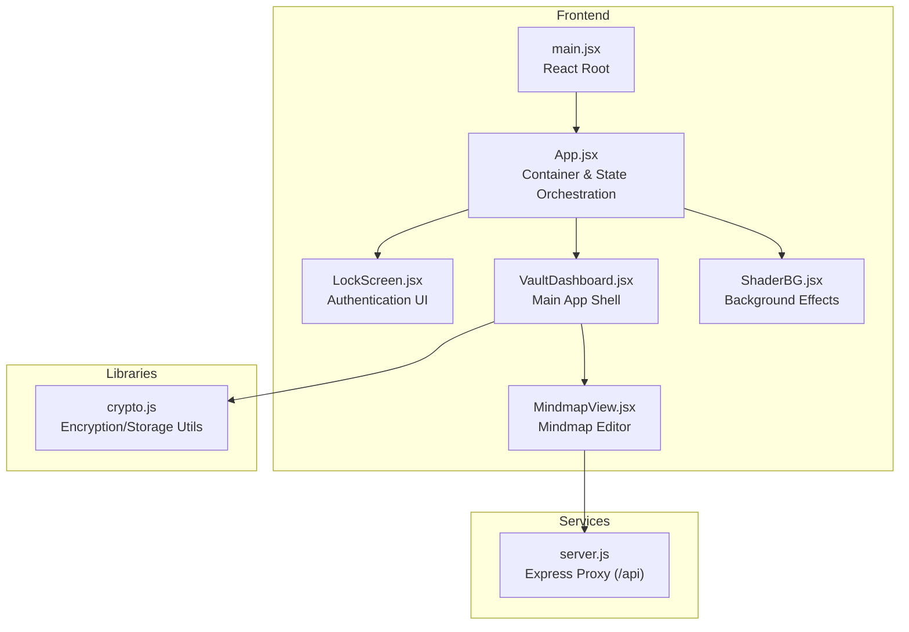
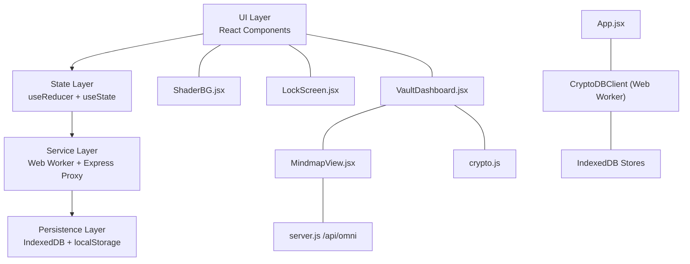
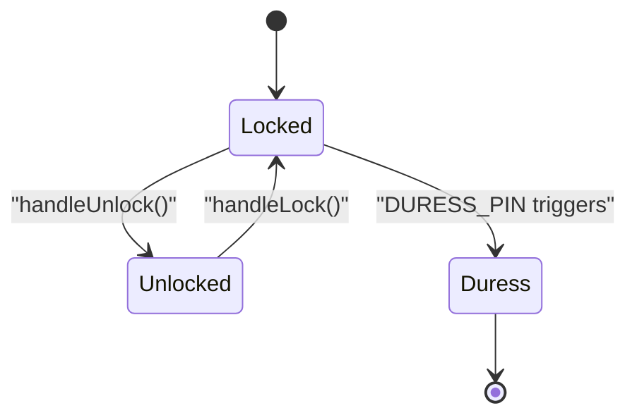
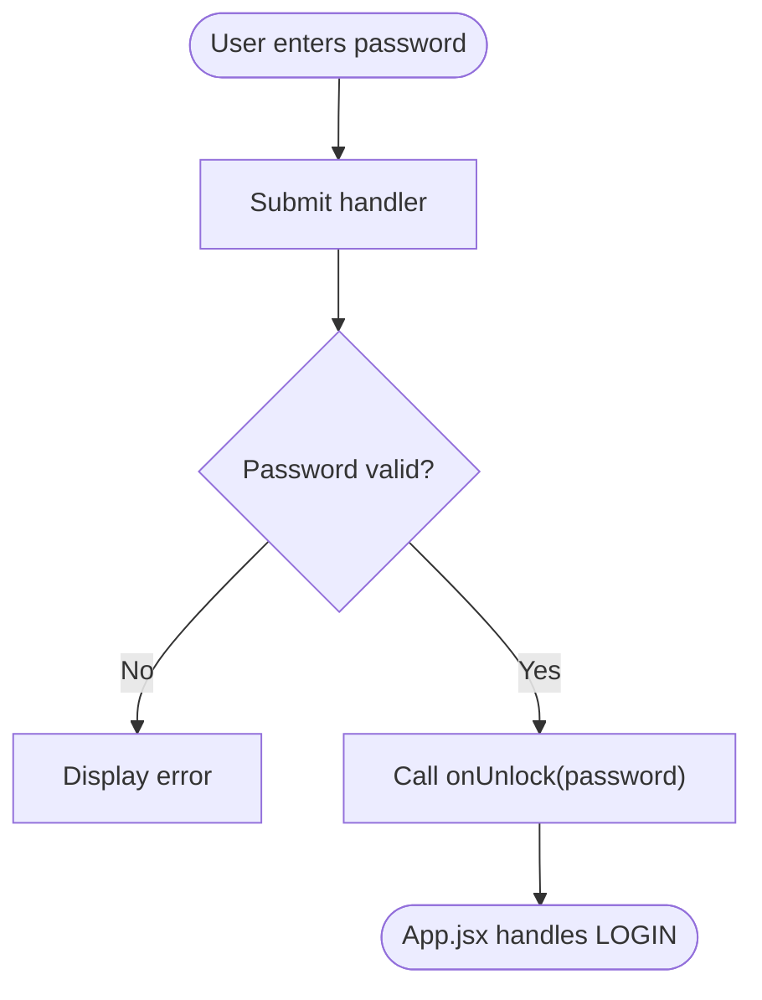
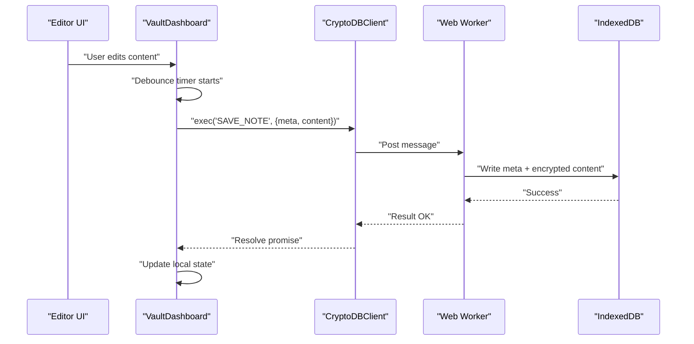
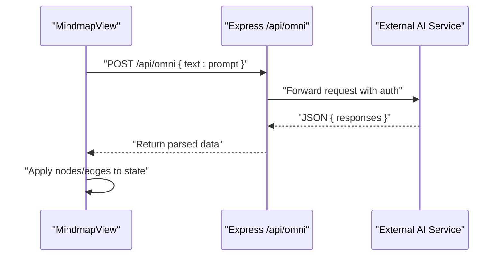
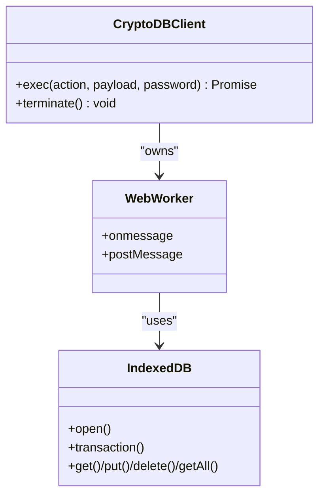
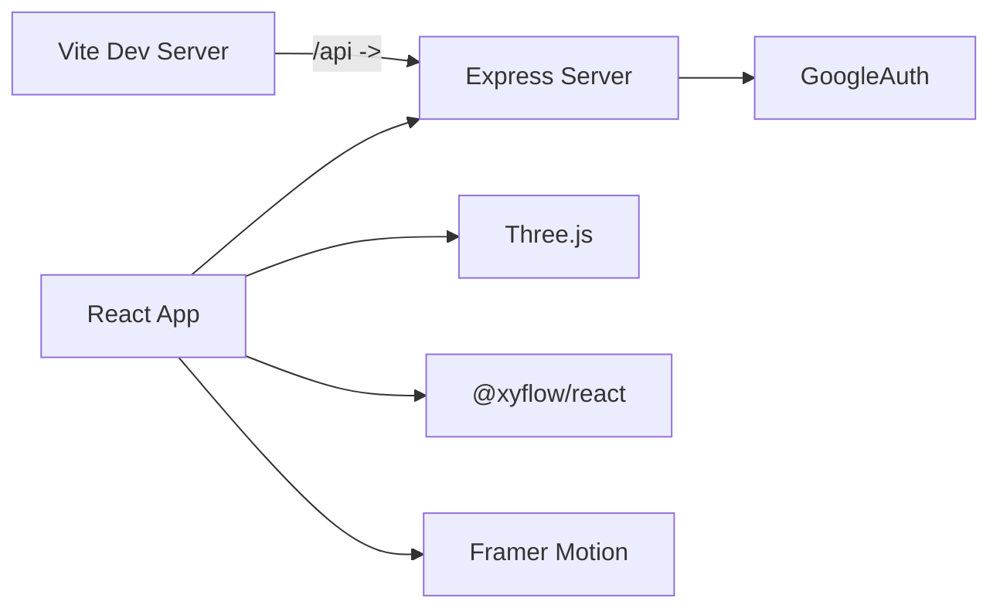

# Application Architecture

<cite>
**Referenced Files in This Document**
- [main.jsx](file://src/main.jsx)
- [App.jsx](file://src/App.jsx)
- [LockScreen.jsx](file://src/components/LockScreen.jsx)
- [VaultDashboard.jsx](file://src/components/VaultDashboard.jsx)
- [MindmapView.jsx](file://src/components/MindmapView.jsx)
- [ShaderBG.jsx](file://src/components/ShaderBG.jsx)
- [crypto.js](file://src/lib/crypto.js)
- [server.js](file://server.js)
- [vite.config.js](file://vite.config.js)
- [tailwind.config.js](file://tailwind.config.js)
- [package.json](file://package.json)
</cite>

## Table of Contents
1. [Introduction](#introduction)
2. [Project Structure](#project-structure)
3. [Core Components](#core-components)
4. [Architecture Overview](#architecture-overview)
5. [Detailed Component Analysis](#detailed-component-analysis)
6. [Dependency Analysis](#dependency-analysis)
7. [Performance Considerations](#performance-considerations)
8. [Troubleshooting Guide](#troubleshooting-guide)
9. [Conclusion](#conclusion)

## Introduction
This document describes the component-based architecture of OMNI-TODO, focusing on the React component hierarchy, state management patterns, and service integration. The application implements a dual-mode operation (lock/unlock) with automatic encryption/decryption cycles. It isolates sensitive cryptographic operations inside a Web Worker and integrates IndexedDB for secure persistence. UI components communicate via props and callbacks, while AI features are proxied through an Express server configured in Vite’s development environment.

## Project Structure
OMNI-TODO follows a feature-based component structure under src/components, with a single App container orchestrating state and rendering either LockScreen or VaultDashboard. Supporting libraries encapsulate cryptography, and a lightweight Express proxy exposes AI endpoints to the frontend.

**Diagram sources**
- [main.jsx:1-11](file://src/main.jsx#L1-L11)
- [App.jsx:1-441](file://src/App.jsx#L1-L441)
- [LockScreen.jsx:1-221](file://src/components/LockScreen.jsx#L1-L221)
- [VaultDashboard.jsx:1-800](file://src/components/VaultDashboard.jsx#L1-L800)
- [MindmapView.jsx:1-310](file://src/components/MindmapView.jsx#L1-L310)
- [ShaderBG.jsx:1-176](file://src/components/ShaderBG.jsx#L1-L176)
- [crypto.js:1-112](file://src/lib/crypto.js#L1-L112)
- [server.js:1-135](file://server.js#L1-L135)

**Section sources**
- [main.jsx:1-11](file://src/main.jsx#L1-L11)
- [App.jsx:1-441](file://src/App.jsx#L1-L441)
- [vite.config.js:1-19](file://vite.config.js#L1-L19)
- [tailwind.config.js:1-27](file://tailwind.config.js#L1-L27)

## Core Components
- App.jsx: Central orchestration of dual-mode UI, state, and Web Worker client. Manages lock state, error handling, and renders either LockScreen or VaultDashboard.
- LockScreen.jsx: Authentication UI enabling unlock/create modes, password masking, and duress PIN handling.
- VaultDashboard.jsx: Main shell containing sidebar navigation, note editor, settings panel, and integration with CryptoDBClient for IndexedDB-backed CRUD.
- MindmapView.jsx: Mindmap editor powered by React Flow, with AI generation via Express proxy.
- ShaderBG.jsx: Animated WebGL background using Three.js shader materials.
- crypto.js: Encryption/decryption helpers and persistent storage utilities for local vault files.
- server.js: Express proxy exposing /api/omni and /api/generate_image endpoints backed by external AI services.

**Section sources**
- [App.jsx:204-255](file://src/App.jsx#L204-L255)
- [LockScreen.jsx:5-93](file://src/components/LockScreen.jsx#L5-L93)
- [VaultDashboard.jsx:240-506](file://src/components/VaultDashboard.jsx#L240-L506)
- [MindmapView.jsx:7-310](file://src/components/MindmapView.jsx#L7-L310)
- [ShaderBG.jsx:108-176](file://src/components/ShaderBG.jsx#L108-L176)
- [crypto.js:20-60](file://src/lib/crypto.js#L20-L60)
- [server.js:21-81](file://server.js#L21-L81)

## Architecture Overview
OMNI-TODO employs a layered architecture:
- UI Layer: React functional components with Framer Motion transitions and Tailwind theming.
- State Layer: Local state in App.jsx plus Redux-style reducer pattern in VaultDashboard for structured data mutations.
- Service Layer: Express proxy server for AI integrations; Web Worker for cryptographic operations and IndexedDB persistence.
- Persistence Layer: IndexedDB stores encrypted note metadata and content; localStorage for vault file storage in the legacy crypto path.

**Diagram sources**
- [App.jsx:167-190](file://src/App.jsx#L167-L190)
- [App.jsx:10-164](file://src/App.jsx#L10-L164)
- [VaultDashboard.jsx:137-237](file://src/components/VaultDashboard.jsx#L137-L237)
- [MindmapView.jsx:786-799](file://src/components/MindmapView.jsx#L786-L799)
- [server.js:21-81](file://server.js#L21-L81)
- [crypto.js:43-60](file://src/lib/crypto.js#L43-L60)

## Detailed Component Analysis

### App.jsx: Dual-Mode Operation and State Machine
App.jsx implements a simple state machine with three primary states:
- Locked (authentication required)
- Unlocked (vault loaded)
- Duress (cryptographic destruction triggered)

Behavior highlights:
- Web Worker initialization and lifecycle management via CryptoDBClient.
- LOGIN action loads note metadata; LOCK clears session keys and resets UI.
- Error propagation from worker to UI for invalid credentials.

**Diagram sources**
- [App.jsx:204-255](file://src/App.jsx#L204-L255)
- [App.jsx:167-190](file://src/App.jsx#L167-L190)
- [App.jsx:74-87](file://src/App.jsx#L74-L87)

**Section sources**
- [App.jsx:204-255](file://src/App.jsx#L204-L255)
- [App.jsx:167-190](file://src/App.jsx#L167-L190)
- [App.jsx:74-87](file://src/App.jsx#L74-L87)

### LockScreen.jsx: Authentication UI and Security Signals
LockScreen.jsx provides:
- Password input with masking and submission handling.
- Mode switching between unlock and create.
- Duress warning and PIN behavior integrated into App.jsx.

**Diagram sources**
- [LockScreen.jsx:10-17](file://src/components/LockScreen.jsx#L10-L17)
- [LockScreen.jsx:105-119](file://src/components/LockScreen.jsx#L105-L119)

**Section sources**
- [LockScreen.jsx:5-93](file://src/components/LockScreen.jsx#L5-L93)
- [LockScreen.jsx:98-221](file://src/components/LockScreen.jsx#L98-L221)

### VaultDashboard.jsx: Redux-Style State and Data Flow
VaultDashboard.jsx manages structured state using a reducer-like pattern:
- Actions: ADD_ITEM, UPDATE_ITEM, DELETE_ITEM, ADD_PROJECT, etc.
- Auto-save debounce (1.5 seconds) persists changes to IndexedDB via CryptoDBClient.
- Settings panel supports export/import of encrypted vaults and manual locking.

**Diagram sources**
- [VaultDashboard.jsx:268-300](file://src/components/VaultDashboard.jsx#L268-L300)
- [VaultDashboard.jsx:290-291](file://src/components/VaultDashboard.jsx#L290-L291)
- [App.jsx:167-190](file://src/App.jsx#L167-L190)
- [App.jsx:10-164](file://src/App.jsx#L10-L164)

**Section sources**
- [VaultDashboard.jsx:240-506](file://src/components/VaultDashboard.jsx#L240-L506)
- [App.jsx:167-190](file://src/App.jsx#L167-L190)

### MindmapView.jsx: AI-Enhanced Mindmap Editor
MindmapView.jsx integrates AI-driven mindmap generation:
- Sends prompts to /api/omni via Express proxy.
- Parses AI JSON response and applies node/edge updates to the active mindmap.
- Provides manual node creation and back navigation.

**Diagram sources**
- [MindmapView.jsx:786-799](file://src/components/MindmapView.jsx#L786-L799)
- [server.js:21-81](file://server.js#L21-L81)

**Section sources**
- [MindmapView.jsx:78-152](file://src/components/MindmapView.jsx#L78-L152)
- [MindmapView.jsx:240-310](file://src/components/MindmapView.jsx#L240-L310)

### ShaderBG.jsx: Animated Background
ShaderBG.jsx renders animated noise/aurora backgrounds using Three.js and WebGL shaders. It initializes on mount and cleans up on unmount.

**Section sources**
- [ShaderBG.jsx:108-176](file://src/components/ShaderBG.jsx#L108-L176)

### CryptoDBClient and IndexedDB Integration
The inline Web Worker in App.jsx encapsulates:
- IndexedDB schema initialization (meta, content, system stores).
- Session key derivation via PBKDF2 and AES-GCM/HMAC-SHA-256.
- CRUD operations: LOGIN, LOAD_CONTENT, SAVE_NOTE, DELETE_NOTE, EXPORT_VAULT, IMPORT_VAULT.
- Duress mode: immediate cryptographic shredding of IndexedDB.

**Diagram sources**
- [App.jsx:167-190](file://src/App.jsx#L167-L190)
- [App.jsx:10-164](file://src/App.jsx#L10-L164)

**Section sources**
- [App.jsx:10-164](file://src/App.jsx#L10-L164)
- [App.jsx:167-190](file://src/App.jsx#L167-L190)

## Dependency Analysis
- Frontend dependencies include React, Framer Motion, Three.js, @xyflow/react, and Tailwind CSS.
- Express server depends on google-auth-library and CORS middleware.
- Vite dev server proxies /api to the Express server running on localhost:3001.

**Diagram sources**
- [vite.config.js:7-16](file://vite.config.js#L7-L16)
- [server.js:1-12](file://server.js#L1-L12)
- [package.json:12-24](file://package.json#L12-L24)

**Section sources**
- [package.json:12-24](file://package.json#L12-L24)
- [vite.config.js:7-16](file://vite.config.js#L7-L16)
- [server.js:1-12](file://server.js#L1-L12)

## Performance Considerations
- Web Worker isolation prevents blocking the UI during encryption/decryption and IndexedDB transactions.
- Debounced autosave reduces write frequency; tune delay in VaultDashboard for balancing safety vs. performance.
- Three.js background rendering uses requestAnimationFrame; ensure cleanup on component unmount.
- IndexedDB transactions batch writes; avoid excessive concurrent operations.

## Troubleshooting Guide
Common issues and resolutions:
- Authentication failures: Verify password correctness; check error messages propagated from App.jsx and LockScreen.jsx.
- Duress activation: If DURESS_PIN is entered, the worker triggers cryptographic shredding; reinitialize vault after destruction.
- Export/Import errors: Confirm file format and key validity; inspect status indicators in SettingsPanel.
- AI generation failures: Check Vite proxy configuration and server availability; review Express logs for API errors.
- IndexedDB quota exceeded: Clear old entries or reduce content size; consider periodic maintenance tasks.

**Section sources**
- [App.jsx:216-226](file://src/App.jsx#L216-L226)
- [App.jsx:80-81](file://src/App.jsx#L80-L81)
- [VaultDashboard.jsx:141-171](file://src/components/VaultDashboard.jsx#L141-L171)
- [server.js:77-81](file://server.js#L77-L81)

## Conclusion
OMNI-TODO demonstrates a clean separation of concerns: UI components manage presentation and user interactions, a Redux-style reducer pattern organizes state transitions, and a Web Worker ensures cryptographic operations remain off the main thread. The Express proxy enables AI-powered features while maintaining a secure client-side architecture. The dual-mode operation, robust error handling, and explicit data flow make the system resilient and maintainable.