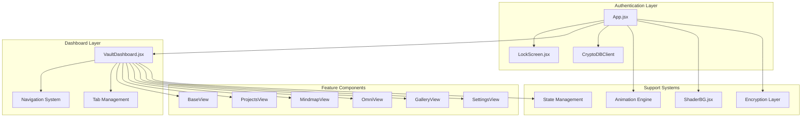
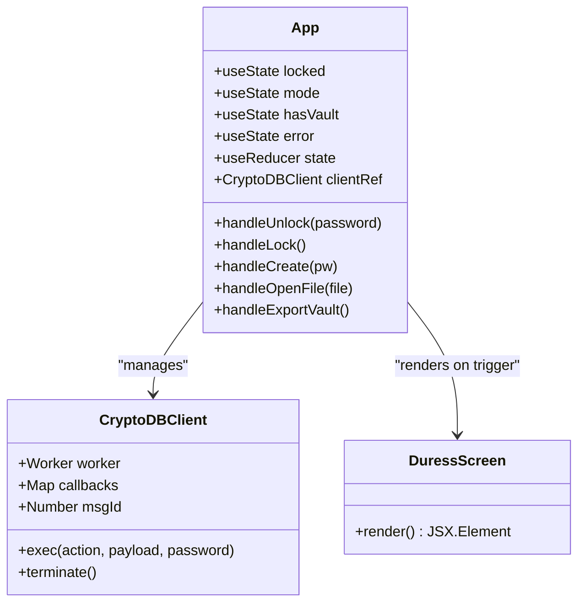
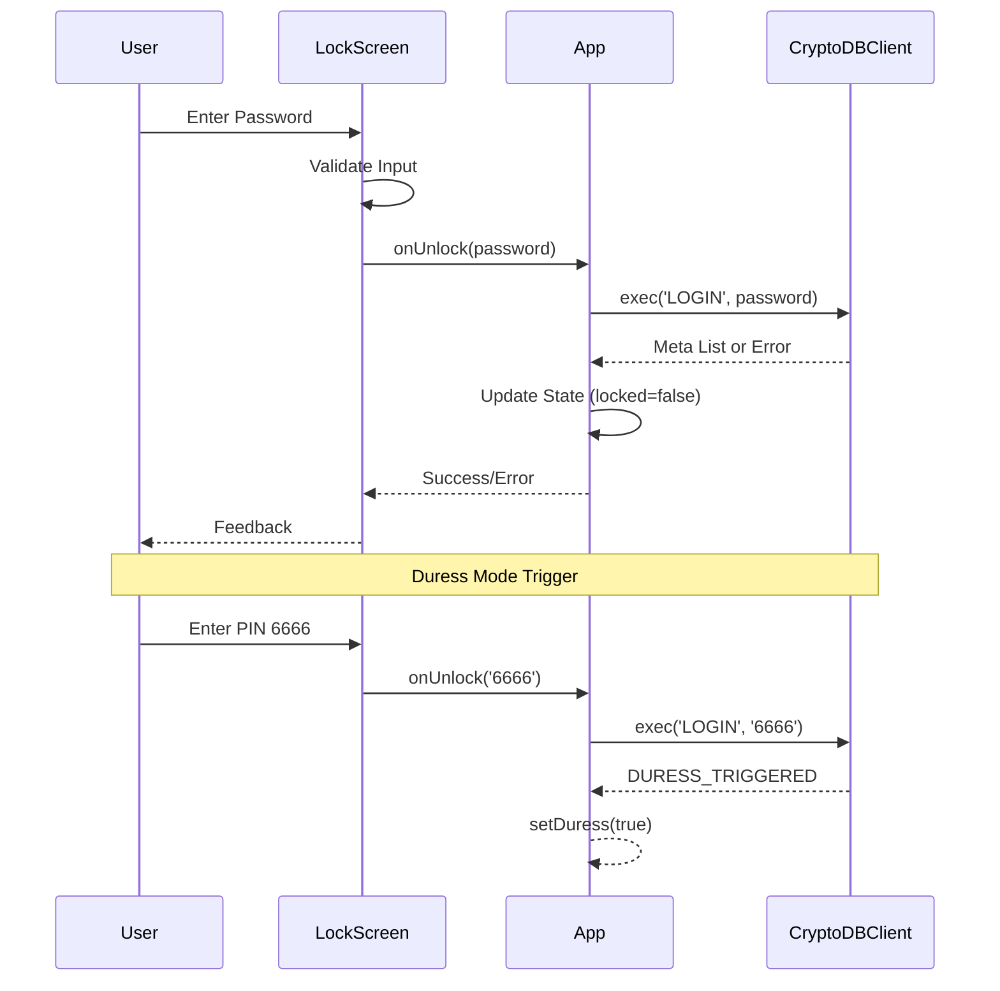
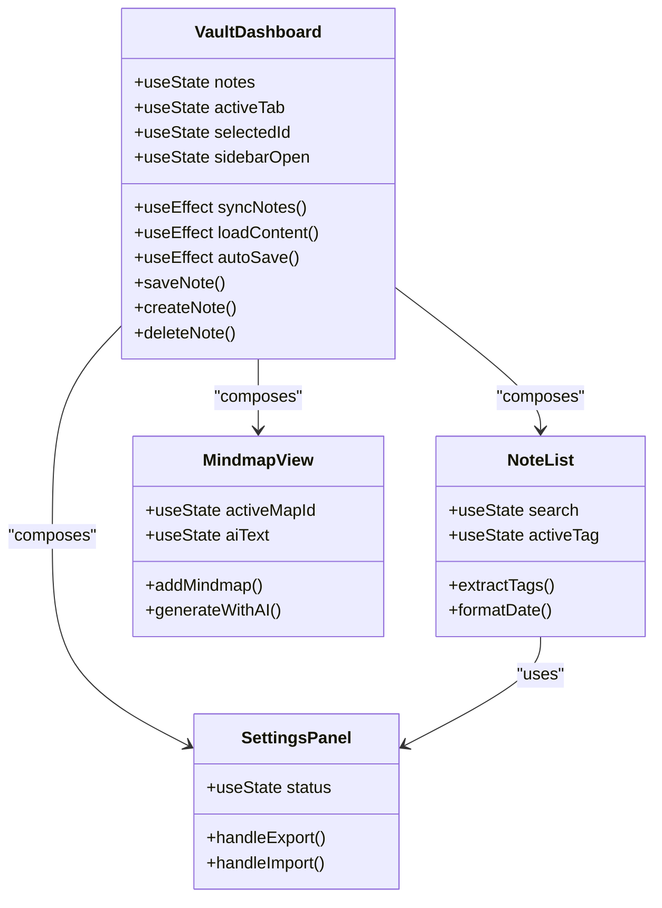
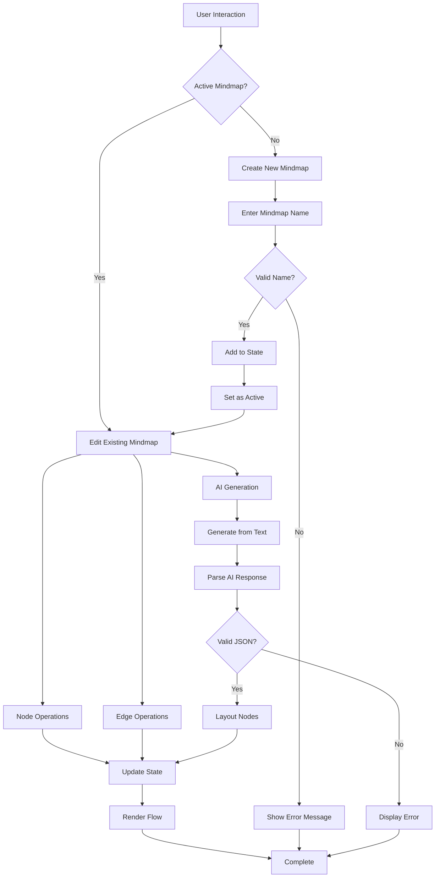
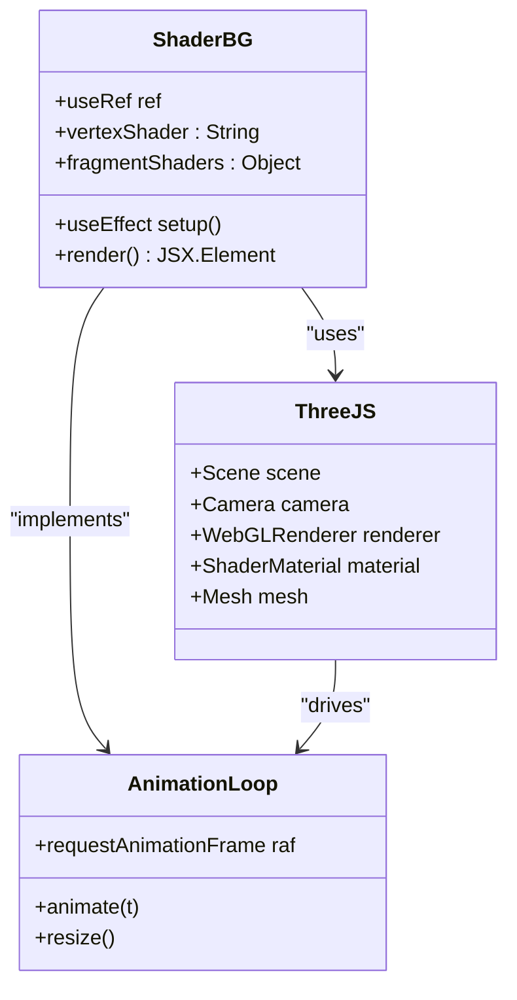
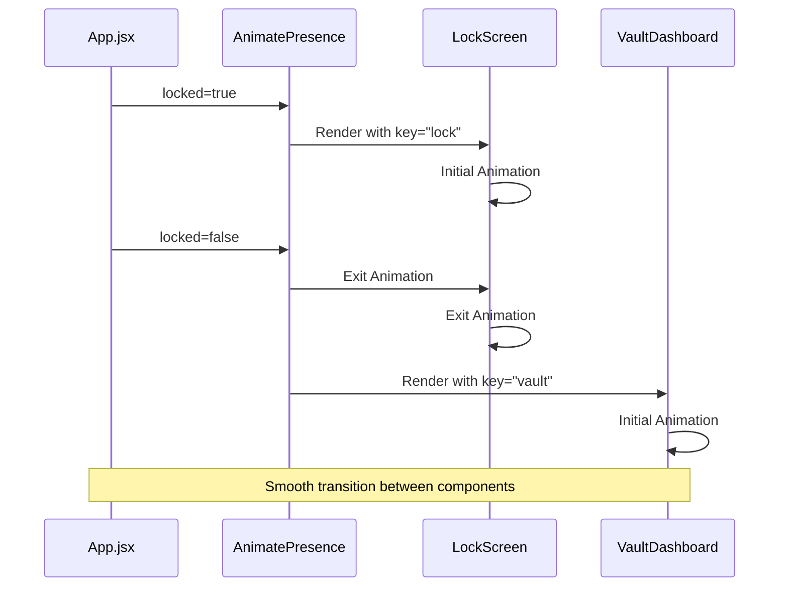
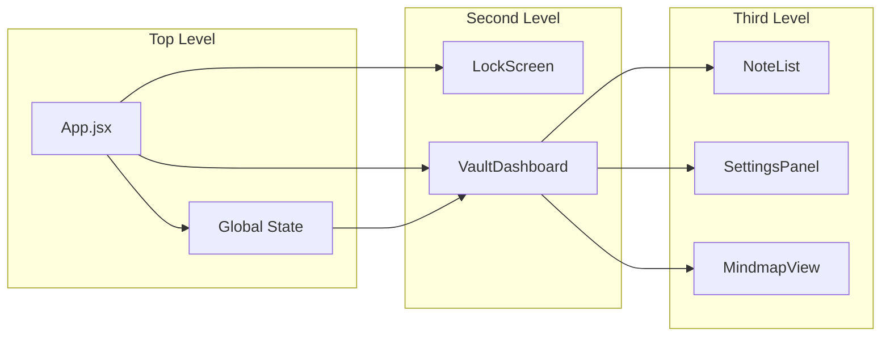
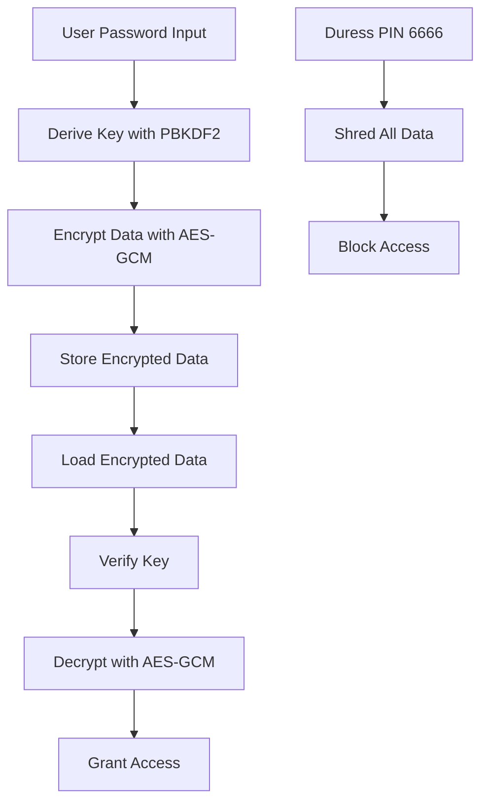

# Component Structure

<cite>
**Referenced Files in This Document**
- [App.jsx](file://src/App.jsx)
- [LockScreen.jsx](file://src/components/LockScreen.jsx)
- [VaultDashboard.jsx](file://src/components/VaultDashboard.jsx)
- [MindmapView.jsx](file://src/components/MindmapView.jsx)
- [ShaderBG.jsx](file://src/components/ShaderBG.jsx)
- [crypto.js](file://src/lib/crypto.js)
- [main.jsx](file://src/main.jsx)
- [package.json](file://package.json)
</cite>

## Table of Contents
1. [Introduction](#introduction)
2. [Project Structure](#project-structure)
3. [Core Components](#core-components)
4. [Architecture Overview](#architecture-overview)
5. [Detailed Component Analysis](#detailed-component-analysis)
6. [Animation and Transition System](#animation-and-transition-system)
7. [Dual-Mode Operation](#dual-mode-operation)
8. [Component Composition Strategies](#component-composition-strategies)
9. [Security and Authentication Flow](#security-and-authentication-flow)
10. [Performance Considerations](#performance-considerations)
11. [Troubleshooting Guide](#troubleshooting-guide)
12. [Conclusion](#conclusion)

## Introduction

OMNI-TODO is a sophisticated React-based secure note-taking and knowledge management application that implements a dual-mode architecture with robust encryption and animation-driven user interface. The application follows a hierarchical component structure where App.jsx serves as the root component, orchestrating authentication flow and conditional rendering of either LockScreen or VaultDashboard components.

The application emphasizes security through client-side encryption using AES-GCM-256 and PBKDF2 key derivation, while providing an elegant user experience through Framer Motion animations and Three.js shader backgrounds. The component architecture demonstrates modern React patterns including composition, prop drilling management, and state synchronization across multiple views.

## Project Structure

The project follows a clean, feature-based organization with clear separation of concerns:

```mermaid
graph TB
subgraph "Application Root"
MAIN[src/main.jsx]
APP[src/App.jsx]
end
subgraph "Components"
LOCK[LockScreen.jsx]
DASHBOARD[VaultDashboard.jsx]
MINDMAP[MindmapView.jsx]
SHADER[ShaderBG.jsx]
end
subgraph "Libraries"
CRYPTO[src/lib/crypto.js]
end
subgraph "Dependencies"
REACT[React 19.2.6]
FRAMER[Framer Motion 12.40.0]
THREE[Three.js 0.184.0]
XYFLOW[@xyflow/react 12.11.1]
end
MAIN --> APP
APP --> LOCK
APP --> DASHBOARD
DASHBOARD --> MINDMAP
APP --> SHADER
APP --> CRYPTO
APP -.-> REACT
APP -.-> FRAMER
DASHBOARD -.-> THREE
DASHBOARD -.-> XYFLOW
```

**Diagram sources**
- [main.jsx:1-11](file://src/main.jsx#L1-L11)
- [App.jsx:1-257](file://src/App.jsx#L1-L257)
- [package.json:12-24](file://package.json#L12-L24)

**Section sources**
- [main.jsx:1-11](file://src/main.jsx#L1-L11)
- [package.json:1-40](file://package.json#L1-L40)

## Core Components

The application's component hierarchy centers around four primary components, each serving distinct roles in the overall architecture:

### Root Component: App.jsx
The App.jsx component acts as the central orchestrator, managing authentication state, cryptographic operations, and conditional rendering. It implements a dual-mode operation system that seamlessly transitions between lock screen and dashboard views based on user authentication status.

### Authentication Layer: LockScreen.jsx
The LockScreen component handles user authentication through password verification and provides dual-mode functionality for both creation and unlocking of encrypted vaults. It manages form validation, error handling, and user feedback during authentication attempts.

### Dashboard System: VaultDashboard.jsx
The VaultDashboard serves as the primary application interface, implementing a multi-view system with BaseView, ProjectsView, MindmapView, OmniView, GalleryView, and SettingsView components. It manages complex state synchronization and provides comprehensive note-taking, project management, and media creation capabilities.

### Visual Enhancement: ShaderBG.jsx
The ShaderBG component provides dynamic background effects using Three.js shaders, offering customizable noise patterns and aurora effects that enhance the visual experience without impacting performance.

**Section sources**
- [App.jsx:204-255](file://src/App.jsx#L204-L255)
- [LockScreen.jsx:5-93](file://src/components/LockScreen.jsx#L5-L93)
- [VaultDashboard.jsx:240-506](file://src/components/VaultDashboard.jsx#L240-L506)
- [ShaderBG.jsx:108-176](file://src/components/ShaderBG.jsx#L108-L176)

## Architecture Overview

The application implements a hierarchical component architecture with clear separation of concerns and robust state management:



**Diagram sources**
- [App.jsx:167-255](file://src/App.jsx#L167-L255)
- [VaultDashboard.jsx:1389-1540](file://src/components/VaultDashboard.jsx#L1389-L1540)

The architecture demonstrates several key design patterns:

- **Conditional Rendering**: App.jsx uses AnimatePresence to manage smooth transitions between LockScreen and VaultDashboard
- **Composition Over Inheritance**: Components are composed rather than extended, promoting reusability
- **State Hoisting**: Authentication state is managed at the root level and passed down as props
- **Event Propagation**: Complex interactions are handled through callback functions passed as props

## Detailed Component Analysis

### App.jsx - Root Component Architecture

The App.jsx component serves as the central orchestrator, implementing sophisticated state management and dual-mode operation:



**Diagram sources**
- [App.jsx:167-255](file://src/App.jsx#L167-L255)
- [App.jsx:10-190](file://src/App.jsx#L10-L190)

The component implements several critical patterns:

**State Management**: Uses both useState for UI state and useReducer for complex application state, demonstrating proper state partitioning.

**Web Worker Integration**: Implements an inline Web Worker for cryptographic operations, ensuring UI responsiveness during encryption/decryption.

**Dual-Mode Operation**: Supports both authentication modes (create/unlock) with seamless switching between modes.

**Error Handling**: Comprehensive error handling for cryptographic operations, file operations, and user authentication.

**Section sources**
- [App.jsx:204-441](file://src/App.jsx#L204-L441)

### LockScreen.jsx - Authentication Component

The LockScreen component implements a sophisticated authentication interface with dual-mode support:



**Diagram sources**
- [LockScreen.jsx:105-119](file://src/components/LockScreen.jsx#L105-L119)
- [App.jsx:216-226](file://src/App.jsx#L216-L226)

Key features include:

**Form Validation**: Real-time validation for password strength and confirmation in create mode.

**Input Security**: Toggleable password visibility with enter-key submission support.

**Mode Management**: Seamless switching between create and unlock modes with appropriate UI states.

**Error Communication**: Clear error messaging for authentication failures.

**Section sources**
- [LockScreen.jsx:98-221](file://src/components/LockScreen.jsx#L98-L221)

### VaultDashboard.jsx - Multi-View Dashboard

The VaultDashboard implements a comprehensive multi-view system with sophisticated state management:



**Diagram sources**
- [VaultDashboard.jsx:240-506](file://src/components/VaultDashboard.jsx#L240-L506)
- [VaultDashboard.jsx:29-134](file://src/components/VaultDashboard.jsx#L29-L134)
- [VaultDashboard.jsx:137-237](file://src/components/VaultDashboard.jsx#L137-L237)
- [MindmapView.jsx:7-310](file://src/components/MindmapView.jsx#L7-L310)

The dashboard implements advanced patterns:

**Tab-Based Navigation**: Animated tab switching with Framer Motion transitions.

**State Synchronization**: Real-time synchronization between local state and encrypted storage.

**Auto-Save Mechanism**: Debounced saving with conflict resolution.

**Rich Component Composition**: Multiple specialized views (notes, projects, mindmaps, AI assistant, gallery, settings).

**Section sources**
- [VaultDashboard.jsx:1389-1544](file://src/components/VaultDashboard.jsx#L1389-L1544)

### MindmapView.jsx - Interactive Visualization

The MindmapView component provides sophisticated mind mapping capabilities with AI integration:



**Diagram sources**
- [MindmapView.jsx:78-152](file://src/components/MindmapView.jsx#L78-L152)

Advanced features include:

**Interactive Graph Editing**: Full CRUD operations on mindmap nodes and edges.

**AI-Powered Generation**: Natural language processing for automatic mindmap creation.

**Real-Time Collaboration**: React Flow integration for collaborative editing.

**Visual Customization**: Theme-aware rendering with dynamic color schemes.

**Section sources**
- [MindmapView.jsx:1-310](file://src/components/MindmapView.jsx#L1-L310)

### ShaderBG.jsx - Visual Effects System

The ShaderBG component implements dynamic background effects using WebGL shaders:



**Diagram sources**
- [ShaderBG.jsx:108-176](file://src/components/ShaderBG.jsx#L108-L176)

The shader system provides:

**Dynamic Patterns**: Configurable noise and aurora effects with adjustable parameters.

**Performance Optimization**: Efficient WebGL rendering with proper cleanup.

**Responsive Design**: Automatic resizing and device pixel ratio handling.

**Customizable Appearance**: Runtime color and opacity adjustments.

**Section sources**
- [ShaderBG.jsx:1-176](file://src/components/ShaderBG.jsx#L1-L176)

## Animation and Transition System

The application implements a sophisticated animation system using Framer Motion for smooth user experiences:

### Transition Patterns



**Diagram sources**
- [App.jsx:240-252](file://src/App.jsx#L240-L252)

### Animation Implementation Details

The animation system employs several key patterns:

**Component-Level Animations**: Individual components define their own entrance and exit animations using Framer Motion primitives.

**Transition Modes**: The AnimatePresence component uses "wait" mode to ensure smooth transitions between different component states.

**Performance Optimization**: Animations are optimized for performance with proper cleanup and resource management.

**Consistent Timing**: Standardized animation durations and easing functions create a cohesive user experience.

**Section sources**
- [App.jsx:5-5](file://src/App.jsx#L5)
- [App.jsx:240-252](file://src/App.jsx#L240-L252)

## Dual-Mode Operation

The application implements a sophisticated dual-mode operation system that seamlessly transitions between authentication and operational states:

### Authentication Flow

```mermaid
stateDiagram-v2
[*] --> CheckingVault
CheckingVault --> CreateMode : No Vault Found
CheckingVault --> UnlockMode : Vault Exists
CreateMode --> Locked : User Creates Vault
UnlockMode --> Locked : User Enters Password
Locked --> Unlocked : Authentication Success
Locked --> DuressTriggered : PIN 6666 Entered
Unlocked --> Locked : User Locks Session
DuressTriggered --> [*]
state Locked {
[*] --> WaitingForInput
WaitingForInput --> Processing : User Submits Password
Processing --> Unlocked : Success
Processing --> Locked : Failure
}
```

**Diagram sources**
- [App.jsx:308-407](file://src/App.jsx#L308-L407)
- [LockScreen.jsx:105-119](file://src/components/LockScreen.jsx#L105-L119)

### Mode-Specific Features

**Create Mode**: Provides password creation with confirmation and vault initialization.

**Unlock Mode**: Handles existing vault authentication with file import capabilities.

**Operational Mode**: Full dashboard functionality with all features enabled.

**Section sources**
- [App.jsx:308-441](file://src/App.jsx#L308-L441)

## Component Composition Strategies

The application demonstrates several advanced composition strategies:

### Props Drilling Management

The component hierarchy minimizes prop drilling through strategic state hoisting:



**Diagram sources**
- [App.jsx:240-250](file://src/App.jsx#L240-L250)
- [VaultDashboard.jsx:240-250](file://src/components/VaultDashboard.jsx#L240-L250)

### Event Propagation Patterns

The application uses a unidirectional event flow:

1. **User Interaction** → Component Handler
2. **Component Handler** → Parent Callback
3. **Parent Callback** → State Update
4. **State Update** → Re-render with New Props

### Component Reusability

Components are designed for maximum reusability through:

**Interface Consistency**: Similar prop interfaces across components
**State Isolation**: Local state management within components
**Event Abstraction**: Clear event handler interfaces
**Configuration Flexibility**: Runtime configuration through props

**Section sources**
- [VaultDashboard.jsx:29-134](file://src/components/VaultDashboard.jsx#L29-L134)
- [LockScreen.jsx:5-93](file://src/components/LockScreen.jsx#L5-L93)

## Security and Authentication Flow

The application implements robust security measures throughout the authentication and operational flows:

### Cryptographic Implementation



**Diagram sources**
- [crypto.js:7-38](file://src/lib/crypto.js#L7-L38)
- [App.jsx:79-87](file://src/App.jsx#L79-L87)

### Security Features

**Client-Side Encryption**: All data is encrypted before storage using industry-standard algorithms.

**Key Derivation**: PBKDF2 with configurable iterations for strong key stretching.

**Authenticated Encryption**: AES-GCM provides both confidentiality and integrity.

**Duress Mode**: Special PIN triggers automatic data destruction.

**Secure Storage**: Encrypted data stored in browser's localStorage.

**Section sources**
- [crypto.js:1-112](file://src/lib/crypto.js#L1-L112)
- [App.jsx:7-87](file://src/App.jsx#L7-L87)

## Performance Considerations

The application implements several performance optimization strategies:

### Memory Management

**Web Worker Isolation**: Cryptographic operations run in separate threads to prevent UI blocking.

**Component Cleanup**: Proper cleanup of Three.js resources and animation frames.

**State Optimization**: Minimized re-renders through selective state updates.

### Rendering Performance

**Selective Updates**: Only affected components re-render during state changes.

**Animation Optimization**: Efficient use of requestAnimationFrame for smooth animations.

**Resource Loading**: Lazy loading of heavy dependencies like Three.js and @xyflow/react.

### Storage Efficiency

**Incremental Saves**: Debounced auto-save prevents excessive writes.

**Efficient State Structure**: Optimized data structures for note and project management.

**Compression**: Encrypted data is compact and efficient for storage.

## Troubleshooting Guide

### Common Issues and Solutions

**Authentication Problems**
- Verify password correctness and try again
- Check for duress PIN activation (6666)
- Ensure vault file integrity if using external files

**Performance Issues**
- Close unused tabs to reduce memory usage
- Clear browser cache if experiencing slowdowns
- Check for ad blockers interfering with animations

**Animation Problems**
- Verify Framer Motion installation and version compatibility
- Check browser compatibility for WebGL requirements
- Disable hardware acceleration if experiencing rendering issues

**Storage Issues**
- Verify browser localStorage availability
- Check for storage quota limits
- Ensure proper file permissions for .vault exports

**Section sources**
- [App.jsx:216-226](file://src/App.jsx#L216-L226)
- [LockScreen.jsx:180-184](file://src/components/LockScreen.jsx#L180-L184)

## Conclusion

OMNI-TODO demonstrates a sophisticated React component architecture that successfully balances security, performance, and user experience. The hierarchical component structure, combined with robust state management and animation systems, creates a cohesive and powerful application.

Key architectural strengths include:

**Security-First Design**: Client-side encryption with PBKDF2 and AES-GCM ensures data protection without compromising usability.

**Modern React Patterns**: Proper use of hooks, composition, and state management demonstrates contemporary React development practices.

**Performance Optimization**: Strategic use of Web Workers, lazy loading, and efficient rendering prevents performance bottlenecks.

**User Experience Excellence**: Smooth animations, responsive design, and intuitive navigation create an engaging user interface.

**Maintainable Architecture**: Clear component boundaries, minimal prop drilling, and well-defined interfaces facilitate long-term maintenance and extension.

The application serves as an excellent example of how to implement complex functionality while maintaining code quality, security, and user experience standards.