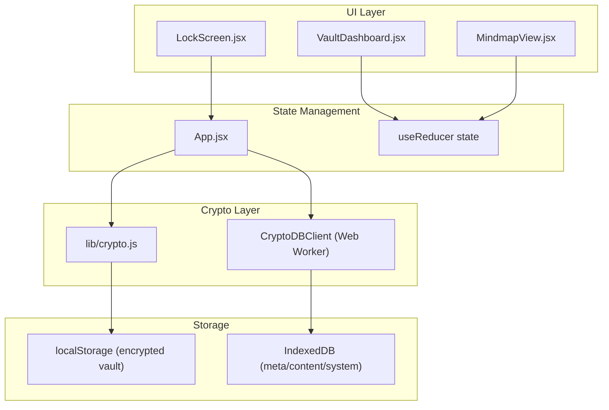
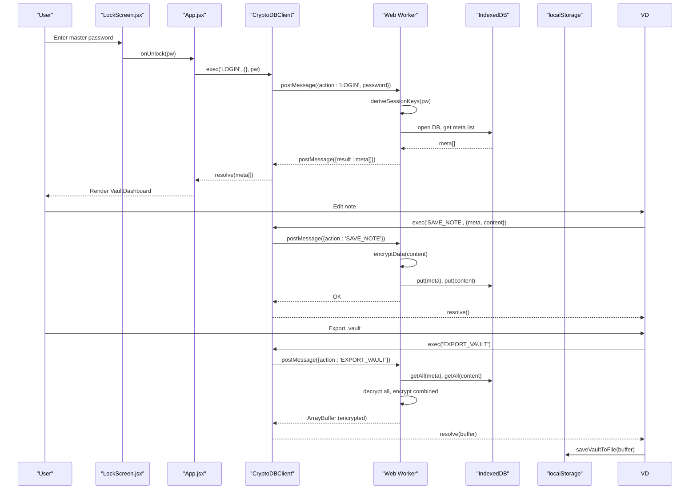
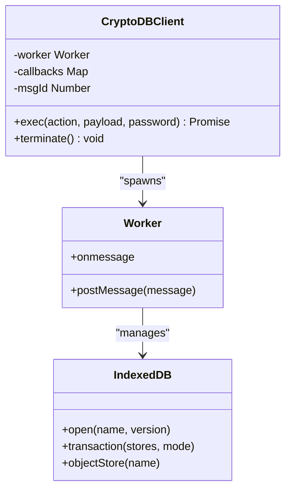
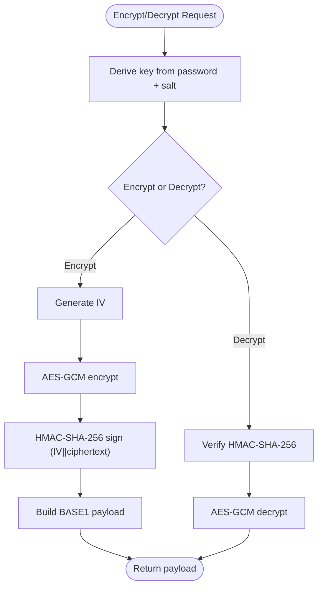
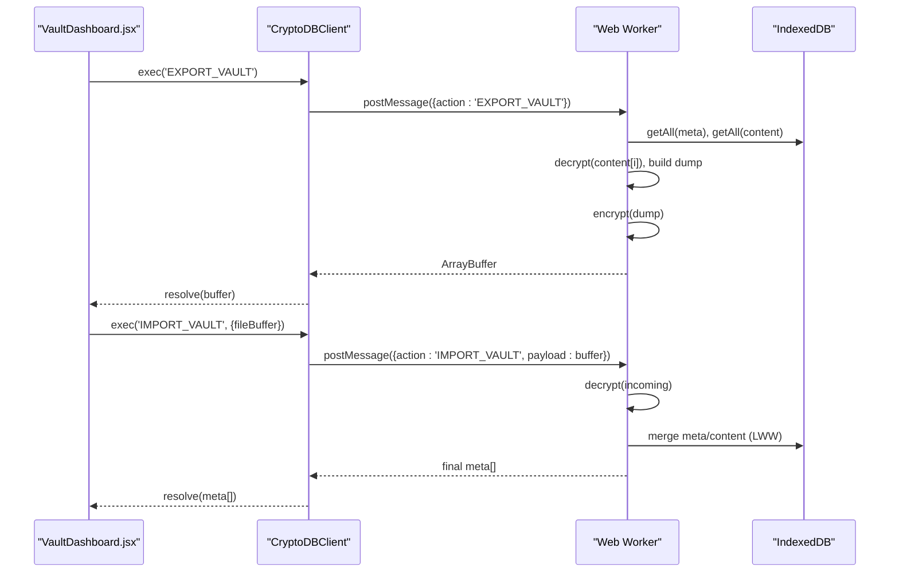
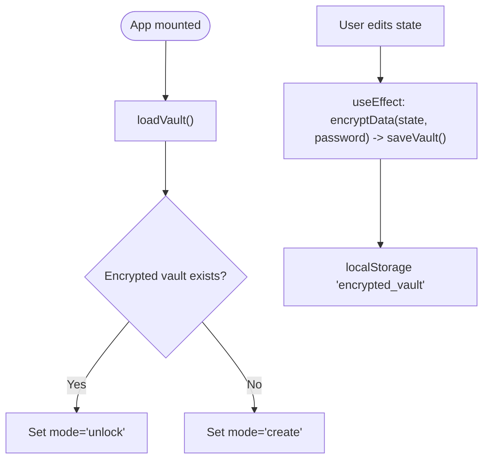
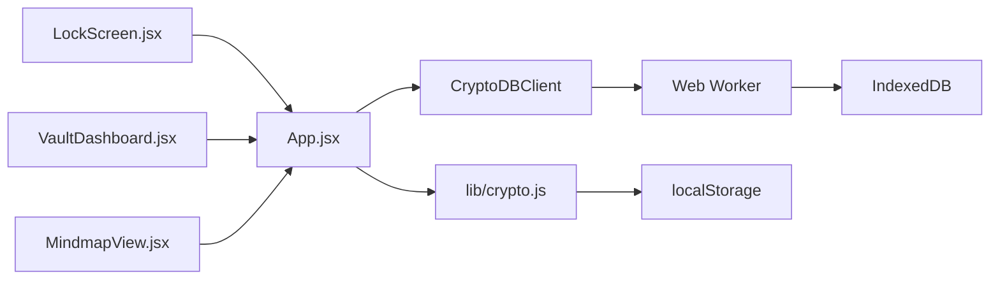

# Data Flow

<cite>
**Referenced Files in This Document**
- [src/main.jsx](file://src/main.jsx)
- [src/App.jsx](file://src/App.jsx)
- [src/lib/crypto.js](file://src/lib/crypto.js)
- [src/components/LockScreen.jsx](file://src/components/LockScreen.jsx)
- [src/components/VaultDashboard.jsx](file://src/components/VaultDashboard.jsx)
- [src/components/MindmapView.jsx](file://src/components/MindmapView.jsx)
- [src/components/ShaderBG.jsx](file://src/components/ShaderBG.jsx)
</cite>

## Table of Contents
1. [Introduction](#introduction)
2. [Project Structure](#project-structure)
3. [Core Components](#core-components)
4. [Architecture Overview](#architecture-overview)
5. [Detailed Component Analysis](#detailed-component-analysis)
6. [Dependency Analysis](#dependency-analysis)
7. [Performance Considerations](#performance-considerations)
8. [Troubleshooting Guide](#troubleshooting-guide)
9. [Conclusion](#conclusion)

## Introduction
This document explains OMNI-TODO’s data flow architecture from user interactions to encrypted persistence. It covers:
- How plain text content becomes encrypted payloads
- How IndexedDB transactions are managed inside a Web Worker
- How backup and restore operations work
- The encryption/decryption cycle triggered by state changes
- The role of CryptoDBClient in orchestrating database operations
- Integrity verification and error handling strategies

## Project Structure
The application is a React + Vite frontend with a hybrid storage strategy:
- Local encrypted vault persisted in browser storage
- IndexedDB-backed secure vault accessed via a dedicated Web Worker
- UI components for locking/unlocking, editing notes, and exporting/importing

**Diagram sources**
- [src/main.jsx:1-11](file://src/main.jsx#L1-L11)
- [src/App.jsx:166-190](file://src/App.jsx#L166-L190)
- [src/lib/crypto.js:40-110](file://src/lib/crypto.js#L40-L110)

**Section sources**
- [src/main.jsx:1-11](file://src/main.jsx#L1-L11)
- [src/App.jsx:166-190](file://src/App.jsx#L166-L190)

## Core Components
- LockScreen: Handles master password input, validation, and triggers unlock/create flows.
- VaultDashboard: Manages note CRUD, auto-save, export/import, and navigation.
- MindmapView: Provides mindmap editing and AI-powered extraction.
- CryptoDBClient: Wraps a Web Worker that performs cryptographic operations and IndexedDB transactions.
- lib/crypto: Provides encryption/decryption and file I/O helpers for the local encrypted vault.

**Section sources**
- [src/components/LockScreen.jsx:1-221](file://src/components/LockScreen.jsx#L1-L221)
- [src/components/VaultDashboard.jsx:1-800](file://src/components/VaultDashboard.jsx#L1-L800)
- [src/components/MindmapView.jsx:1-310](file://src/components/MindmapView.jsx#L1-L310)
- [src/App.jsx:166-190](file://src/App.jsx#L166-L190)
- [src/lib/crypto.js:1-112](file://src/lib/crypto.js#L1-L112)

## Architecture Overview
The system separates concerns across layers:
- UI: React components render and collect user input
- State: Centralized reducer manages app state
- Crypto: Two-layer cryptography:
  - lib/crypto: AES-GCM with PBKDF2 for local encrypted vault
  - Web Worker: AES-GCM + HMAC-SHA-256 for IndexedDB-backed vault
- Storage: localStorage for encrypted vault; IndexedDB for structured notes

**Diagram sources**
- [src/App.jsx:74-164](file://src/App.jsx#L74-L164)
- [src/App.jsx:166-190](file://src/App.jsx#L166-L190)
- [src/components/VaultDashboard.jsx:137-237](file://src/components/VaultDashboard.jsx#L137-L237)
- [src/lib/crypto.js:40-110](file://src/lib/crypto.js#L40-L110)

## Detailed Component Analysis

### LockScreen.jsx
- Purpose: Collects master password, toggles visibility, validates input, and triggers unlock/create flows.
- Behavior:
  - Unlock mode: Validates non-empty password, disables button while busy, invokes onUnlock callback.
  - Create mode: Enforces minimum password length and matching passwords, invokes onCreate callback.
- UI feedback: Busy indicators, error banners, and duress warning.

**Section sources**
- [src/components/LockScreen.jsx:1-221](file://src/components/LockScreen.jsx#L1-L221)

### VaultDashboard.jsx
- Purpose: Note editor, tag extraction, auto-save, export/import, and settings.
- Data transformations:
  - Auto-save debounced after edits; computes tags and preview, then calls client.exec('SAVE_NOTE').
  - Export: Uses client.exec('EXPORT_VAULT') to retrieve decrypted dumps and saves as .vault.
  - Import: Reads .vault file, sends ArrayBuffer to client.exec('IMPORT_VAULT'), merges with CRDT-like logic.
- State synchronization: Updates parent notes list and clears selection on lock.

**Section sources**
- [src/components/VaultDashboard.jsx:240-506](file://src/components/VaultDashboard.jsx#L240-L506)
- [src/components/VaultDashboard.jsx:137-237](file://src/components/VaultDashboard.jsx#L137-L237)

### CryptoDBClient and Web Worker
- CryptoDBClient:
  - Creates a Blob from inline worker code and wraps message passing with promises.
  - Maintains a callback registry keyed by message IDs.
- Web Worker responsibilities:
  - IndexedDB initialization and migrations (object stores: meta, content, system).
  - Session key derivation (PBKDF2) and dual-key scheme (AES-GCM + HMAC-SHA-256).
  - Encryption/decryption pipeline with IV and signature appended.
  - Integrity checks during decryption; throws errors for corrupted or tampered payloads.
  - Actions: LOGIN, LOCK, LOAD_CONTENT, SAVE_NOTE, DELETE_NOTE, EXPORT_VAULT, IMPORT_VAULT.
  - Duress mode: Triggers cryptographic shredding when a special PIN is used.

**Diagram sources**
- [src/App.jsx:166-190](file://src/App.jsx#L166-L190)
- [src/App.jsx:74-164](file://src/App.jsx#L74-L164)

**Section sources**
- [src/App.jsx:166-190](file://src/App.jsx#L166-L190)
- [src/App.jsx:74-164](file://src/App.jsx#L74-L164)

### lib/crypto.js
- Encryption/decryption:
  - PBKDF2-derived AES-GCM key with random salt and IV.
  - Payload format: BASE1:salt:iv:ciphertext.
  - Integrity: Separate HMAC signature appended to ciphertext.
- Persistent storage:
  - saveVault/loadVault wrap localStorage for the encrypted vault.
- File I/O:
  - saveVaultToFile integrates with the native file picker and falls back to download.
  - pickVaultFile reads .vault files for manual import.

**Diagram sources**
- [src/lib/crypto.js:7-38](file://src/lib/crypto.js#L7-L38)

**Section sources**
- [src/lib/crypto.js:1-112](file://src/lib/crypto.js#L1-L112)

### IndexedDB Transactions and Backup/Restore
- IndexedDB stores:
  - meta: note metadata (id, title, tags, preview, timestamps, deleted flag)
  - content: encrypted note bodies
  - system: master salt and other system variables
- Transactions:
  - READONLY for listing and fetching decrypted content
  - READWRITE for writes, deletes, and merges
- Backup/restore:
  - Export: Worker loads all meta and content, decrypts content, re-encrypts combined dump, returns ArrayBuffer
  - Import: Worker decrypts incoming dump, merges using last-write-wins semantics, re-encrypts and persists

**Diagram sources**
- [src/App.jsx:120-161](file://src/App.jsx#L120-L161)
- [src/components/VaultDashboard.jsx:137-237](file://src/components/VaultDashboard.jsx#L137-L237)

**Section sources**
- [src/App.jsx:120-161](file://src/App.jsx#L120-L161)
- [src/components/VaultDashboard.jsx:137-237](file://src/components/VaultDashboard.jsx#L137-L237)

### Auto-save and Local Encrypted Vault
- When unlocked and password known, the app periodically encrypts the entire state and saves to localStorage.
- On mount, if an encrypted vault exists, the UI switches to unlock mode.

**Diagram sources**
- [src/App.jsx:316-340](file://src/App.jsx#L316-L340)
- [src/lib/crypto.js:43-60](file://src/lib/crypto.js#L43-L60)

**Section sources**
- [src/App.jsx:316-340](file://src/App.jsx#L316-L340)
- [src/lib/crypto.js:43-60](file://src/lib/crypto.js#L43-L60)

## Dependency Analysis
- UI depends on App state and CryptoDBClient
- CryptoDBClient encapsulates Web Worker communication
- Web Worker encapsulates IndexedDB and cryptographic primitives
- lib/crypto handles local vault encryption and file I/O
- MindmapView integrates with the same reducer/state as VaultDashboard

**Diagram sources**
- [src/App.jsx:166-190](file://src/App.jsx#L166-L190)
- [src/lib/crypto.js:40-110](file://src/lib/crypto.js#L40-L110)

**Section sources**
- [src/App.jsx:166-190](file://src/App.jsx#L166-L190)
- [src/lib/crypto.js:40-110](file://src/lib/crypto.js#L40-L110)

## Performance Considerations
- Debounced auto-save: VaultDashboard delays saving after edits to reduce write frequency.
- Web Worker isolation: Cryptography and IndexedDB operations run off the main thread to keep UI responsive.
- Efficient exports: Worker streams content and signs/encrypts in memory to minimize disk I/O.
- File picker fallback: Uses native save dialog when available; otherwise falls back to Blob download.

[No sources needed since this section provides general guidance]

## Troubleshooting Guide
- Wrong password or corrupted data:
  - LockScreen displays an error banner; App catches and surfaces user-friendly messages.
- Duress trigger:
  - Special PIN initiates cryptographic shredding; UI renders a “destroyed” screen.
- Integrity failures:
  - Worker verifies HMAC before decrypting; errors thrown for corrupted payloads.
- Import/export errors:
  - Settings panel shows error status; UI retries or prompts for correct key/file.

**Section sources**
- [src/App.jsx:216-235](file://src/App.jsx#L216-L235)
- [src/App.jsx:79-84](file://src/App.jsx#L79-L84)
- [src/App.jsx:64-72](file://src/App.jsx#L64-L72)
- [src/components/VaultDashboard.jsx:137-237](file://src/components/VaultDashboard.jsx#L137-L237)

## Conclusion
OMNI-TODO implements a layered data flow:
- UI captures user input and state changes
- State is transformed and persisted either locally (encrypted) or in IndexedDB via a secure Web Worker
- Cryptography ensures confidentiality and integrity at rest and in transit
- Backup/restore operations leverage deterministic encryption and CRDT-like merging for robust recovery

[No sources needed since this section summarizes without analyzing specific files]