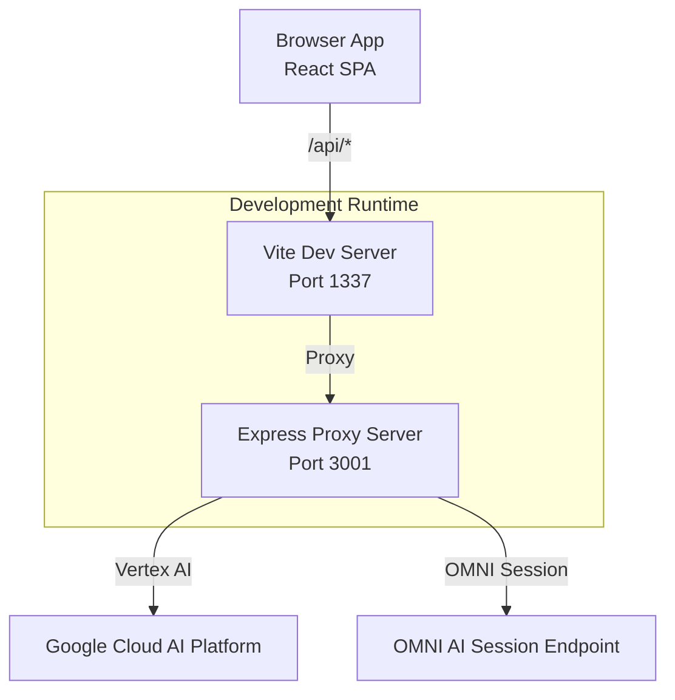
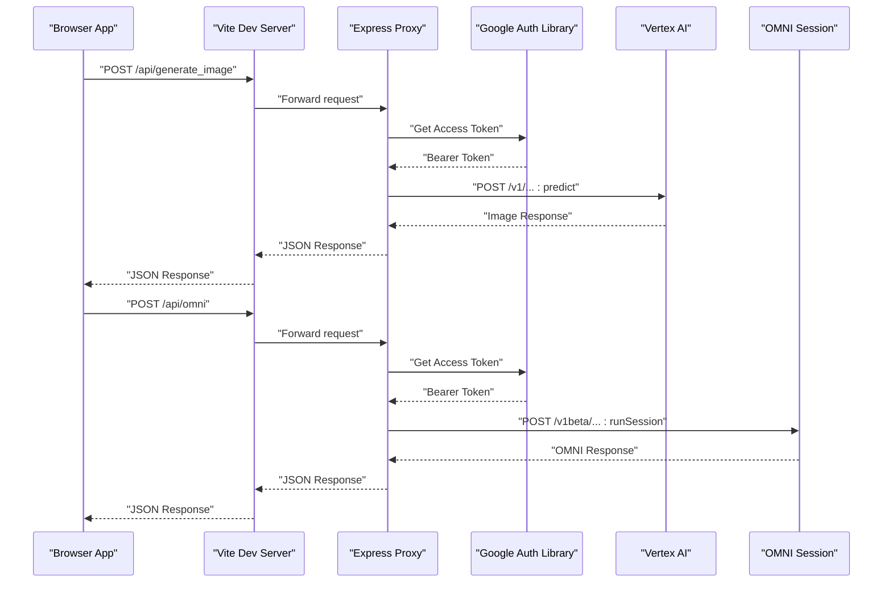
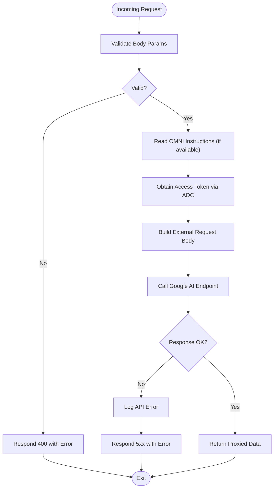
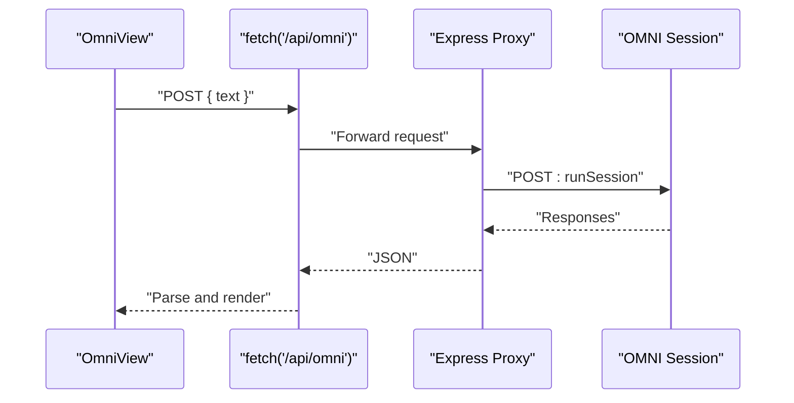
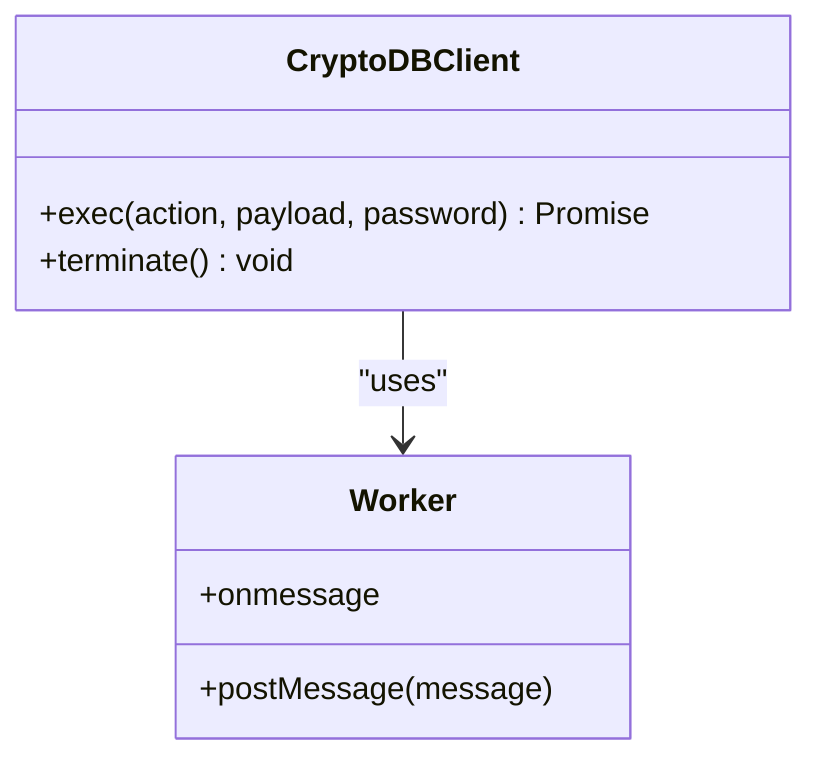
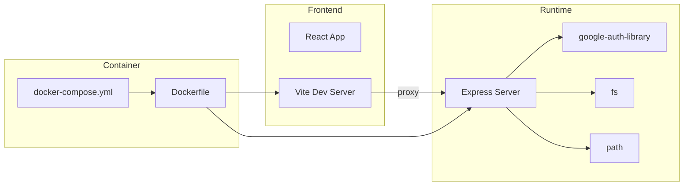

# Service Layer

<cite>
**Referenced Files in This Document**
- [server.js](file://server.js)
- [vite.config.js](file://vite.config.js)
- [docker-compose.yml](file://docker-compose.yml)
- [Dockerfile](file://Dockerfile)
- [package.json](file://package.json)
- [src/App.jsx](file://src/App.jsx)
- [src/main.jsx](file://src/main.jsx)
- [src/components/VaultDashboard.jsx](file://src/components/VaultDashboard.jsx)
- [src/lib/crypto.js](file://src/lib/crypto.js)
</cite>

## Table of Contents
1. [Introduction](#introduction)
2. [Project Structure](#project-structure)
3. [Core Components](#core-components)
4. [Architecture Overview](#architecture-overview)
5. [Detailed Component Analysis](#detailed-component-analysis)
6. [Dependency Analysis](#dependency-analysis)
7. [Performance Considerations](#performance-considerations)
8. [Troubleshooting Guide](#troubleshooting-guide)
9. [Conclusion](#conclusion)

## Introduction
This document describes the service layer architecture of OMNI-TODO, focusing on the Express proxy server that integrates with Google Cloud AI services, the frontend API routing and request/response processing, and the service abstraction layer that handles external API communications. It also covers proxy configuration for development and production, CORS handling, authentication flow, error handling strategies, fallback mechanisms, and performance optimization techniques for API calls.

## Project Structure
The application consists of:
- Frontend built with React and Vite, served on port 1337.
- A Node.js/Express proxy server on port 3001 that authenticates with Google Cloud and forwards requests to Vertex AI and OMNI AI endpoints.
- Dockerized runtime that runs both the proxy server and the Vite dev server.

**Diagram sources**
- [vite.config.js:7-17](file://vite.config.js#L7-L17)
- [server.js:10-133](file://server.js#L10-L133)

**Section sources**
- [vite.config.js:1-19](file://vite.config.js#L1-L19)
- [Dockerfile:29-32](file://Dockerfile#L29-L32)
- [docker-compose.yml:1-18](file://docker-compose.yml#L1-L18)

## Core Components
- Express Proxy Server
  - Provides CORS-enabled JSON middleware.
  - Implements two primary routes:
    - POST /api/omni: Sends user text to OMNI AI session endpoint via Google Auth credentials.
    - POST /api/generate_image: Sends prompts to Vertex AI Imagen model via Google Auth credentials.
  - Uses google-auth-library for Application Default Credentials (ADC) to obtain bearer tokens.
  - Reads optional OMNI system instructions from a configured file path and injects them into the OMNI request body.
  - Returns proxied responses or structured error payloads.

- Frontend Service Layer
  - React SPA that communicates with the proxy via /api endpoints.
  - Omni assistant view posts user messages to /api/omni and parses AI responses.
  - Gallery view posts prompts to /api/generate_image and displays generated images.
  - Settings view documents ADC usage and provides a setup script reference.

- Crypto Abstraction
  - Web Worker-based client for local vault encryption/decryption and IndexedDB-backed persistence.
  - Not part of the external API service layer but relevant to the overall service architecture.

**Section sources**
- [server.js:10-133](file://server.js#L10-L133)
- [src/components/VaultDashboard.jsx:747-907](file://src/components/VaultDashboard.jsx#L747-L907)
- [src/components/VaultDashboard.jsx:1036-1186](file://src/components/VaultDashboard.jsx#L1036-L1186)
- [src/App.jsx:167-190](file://src/App.jsx#L167-L190)

## Architecture Overview
The service layer follows a thin proxy pattern:
- The browser app sends requests to /api endpoints.
- Vite’s dev server proxies /api to the Express server running on localhost:3001.
- The Express server authenticates with Google Cloud using ADC, constructs request bodies, and forwards to Google AI endpoints.
- Responses are returned to the client after basic validation and error mapping.

**Diagram sources**
- [vite.config.js:11-16](file://vite.config.js#L11-L16)
- [server.js:83-129](file://server.js#L83-L129)

## Detailed Component Analysis

### Express Proxy Server
- Initialization and Middleware
  - Enables CORS globally and parses JSON bodies.
  - Initializes GoogleAuth with cloud-platform scope for ADC-based authentication.
- OMNI Route (/api/omni)
  - Validates presence of text.
  - Attempts to read OMNI system instructions from a configured path; falls back to defaults if unavailable.
  - Obtains an access token via ADC and forwards a structured request to the OMNI session endpoint.
  - On failure, logs the raw API response and returns a structured error payload.
  - On success, returns the proxied response.
- Image Generation Route (/api/generate_image)
  - Validates presence of prompt.
  - Obtains an access token via ADC and forwards a structured request to Vertex AI Imagen predict endpoint.
  - On failure, logs the raw API response and returns a structured error payload.
  - On success, returns the proxied response.
- Error Handling
  - Catches exceptions during request processing and responds with a 500 JSON payload containing an error message.
- Logging
  - Logs API errors and internal proxy errors for diagnostics.

**Diagram sources**
- [server.js:21-81](file://server.js#L21-L81)
- [server.js:83-129](file://server.js#L83-L129)

**Section sources**
- [server.js:10-16](file://server.js#L10-L16)
- [server.js:21-81](file://server.js#L21-L81)
- [server.js:83-129](file://server.js#L83-L129)

### Frontend Service Integration
- Omni Assistant View
  - Posts user messages to /api/omni.
  - Parses response for text content and executes extracted actions.
  - Handles network errors and displays a system message when OMNI is unreachable.
- Image Gallery View
  - Posts prompts to /api/generate_image.
  - Validates base64 image bytes and adds the generated image to state.
  - Displays errors encountered during generation.
- Settings View
  - Documents Application Default Credentials (ADC) usage and provides a setup script reference.

**Diagram sources**
- [src/components/VaultDashboard.jsx:747-818](file://src/components/VaultDashboard.jsx#L747-L818)
- [server.js:21-81](file://server.js#L21-L81)

**Section sources**
- [src/components/VaultDashboard.jsx:747-907](file://src/components/VaultDashboard.jsx#L747-L907)
- [src/components/VaultDashboard.jsx:1036-1186](file://src/components/VaultDashboard.jsx#L1036-L1186)

### Service Abstraction and Local Data
- CryptoDBClient
  - Wraps a Web Worker to perform cryptographic operations and IndexedDB transactions.
  - Provides a promise-based interface for login, lock, load content, save note, delete note, export/import vault.
  - Used by the dashboard to manage encrypted notes locally.
- Crypto Utilities
  - Provides encryption/decryption helpers and persistent storage wrappers for the vault.

**Diagram sources**
- [src/App.jsx:167-190](file://src/App.jsx#L167-L190)

**Section sources**
- [src/App.jsx:167-190](file://src/App.jsx#L167-L190)
- [src/lib/crypto.js:1-112](file://src/lib/crypto.js#L1-L112)

## Dependency Analysis
- Runtime Dependencies
  - Express, cors, google-auth-library, and Node fs/path for proxy server.
  - React, @vitejs/plugin-react, framer-motion, lucide-react for frontend.
- Dev/Build Dependencies
  - Vite, Tailwind, PostCSS, ESLint, and related plugins.
- Containerization
  - Dockerfile installs gcloud SDK and runs both servers concurrently.
  - docker-compose exposes ports 1337 and 3001 and mounts volumes for development.

**Diagram sources**
- [package.json:12-24](file://package.json#L12-L24)
- [Dockerfile:1-32](file://Dockerfile#L1-L32)
- [docker-compose.yml:1-18](file://docker-compose.yml#L1-L18)

**Section sources**
- [package.json:12-38](file://package.json#L12-L38)
- [Dockerfile:1-32](file://Dockerfile#L1-L32)
- [docker-compose.yml:1-18](file://docker-compose.yml#L1-L18)

## Performance Considerations
- Proxy Request Batching
  - Batch multiple small requests to reduce overhead when feasible.
- Response Caching
  - Cache successful responses for identical inputs where appropriate (e.g., repeated image prompts) to reduce latency and cost.
- Debounced UI Updates
  - The note editor debounces saves to avoid excessive writes; maintain similar patterns for AI requests.
- Concurrency Limits
  - Limit concurrent external API calls to prevent rate limiting and improve stability.
- Streaming Responses
  - If Google AI supports streaming, consider streaming to improve perceived performance.
- CDN and Edge Placement
  - Place the proxy behind a reverse proxy or CDN to reduce cold starts and latency.
- Environment Tuning
  - Adjust container CPU/memory limits and health checks in production.

## Troubleshooting Guide
- Authentication Failures
  - Ensure Application Default Credentials are configured in the environment where the proxy runs.
  - Verify the service account has permissions for Vertex AI and OMNI session endpoints.
- CORS Errors
  - CORS is enabled globally; confirm the browser is sending requests to /api endpoints and Vite proxy is active.
- Proxy Connectivity
  - Confirm Vite proxy target points to the Express server and both containers are reachable.
- Error Propagation
  - The proxy returns structured JSON errors with details when external APIs fail; inspect the response payload for actionable messages.
- Local Instructions
  - If OMNI instructions file is missing, the proxy continues with defaults; ensure the path is correct for deterministic behavior.

**Section sources**
- [server.js:10-16](file://server.js#L10-L16)
- [server.js:29-35](file://server.js#L29-L35)
- [server.js:69-72](file://server.js#L69-L72)
- [server.js:118-121](file://server.js#L118-L121)

## Conclusion
OMNI-TODO’s service layer uses a clean separation between the frontend and backend:
- The frontend focuses on user interactions and UI state, delegating AI tasks to the proxy.
- The proxy centralizes authentication, request shaping, and error handling for Google Cloud AI services.
- The architecture is containerized and designed for development convenience, with straightforward proxy configuration and robust error reporting.