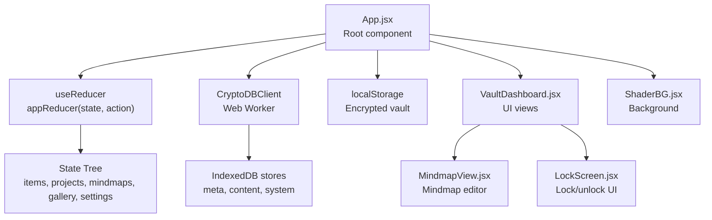
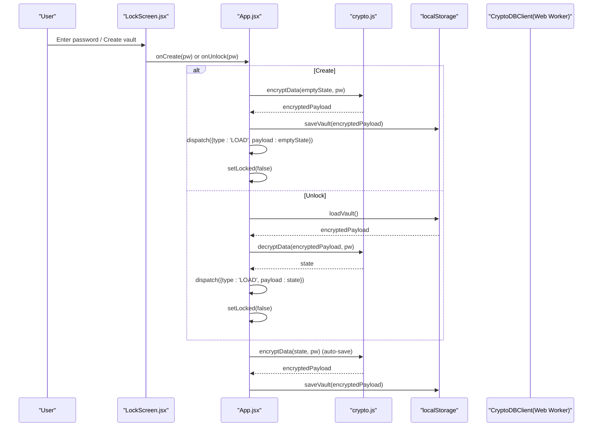
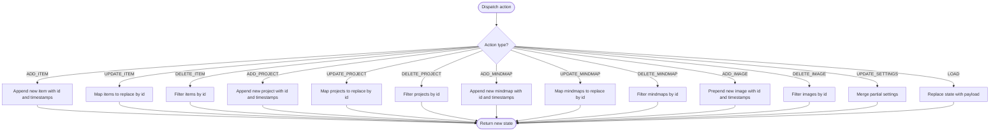
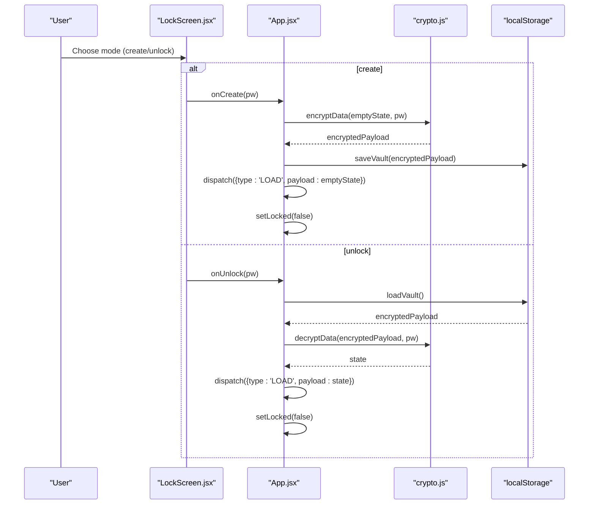
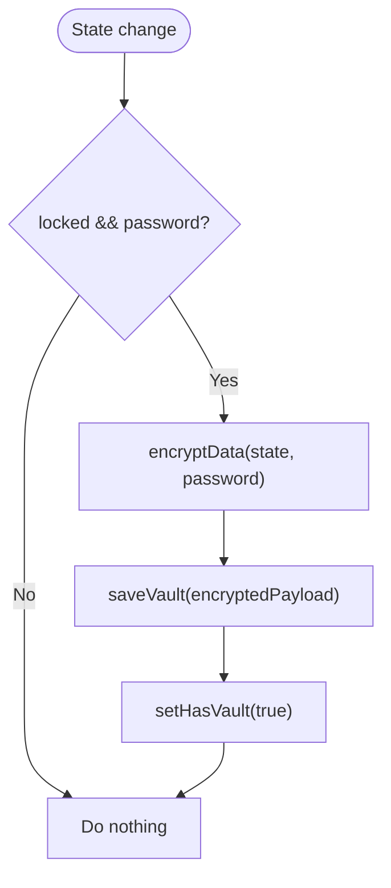
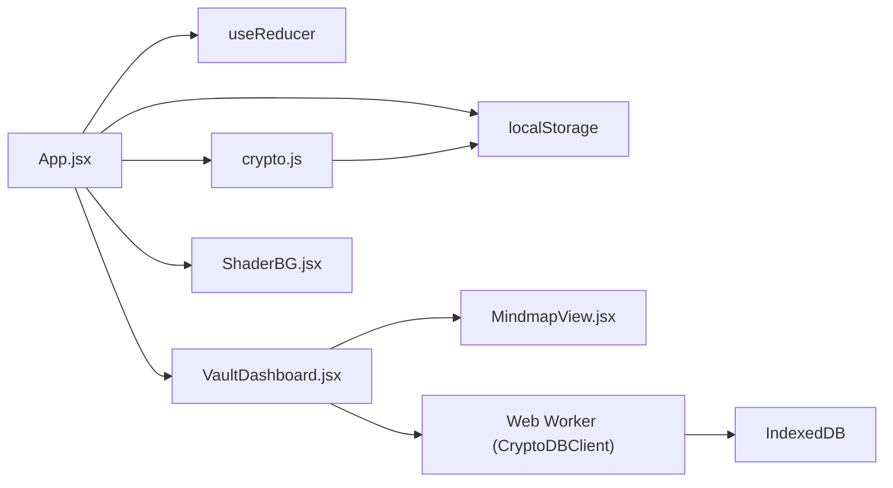

# State Management

<cite>
**Referenced Files in This Document**
- [App.jsx](file://src/App.jsx)
- [crypto.js](file://src/lib/crypto.js)
- [LockScreen.jsx](file://src/components/LockScreen.jsx)
- [VaultDashboard.jsx](file://src/components/VaultDashboard.jsx)
- [MindmapView.jsx](file://src/components/MindmapView.jsx)
- [ShaderBG.jsx](file://src/components/ShaderBG.jsx)
- [main.jsx](file://src/main.jsx)
- [package.json](file://package.json)
</cite>

## Table of Contents
1. [Introduction](#introduction)
2. [Project Structure](#project-structure)
3. [Core Components](#core-components)
4. [Architecture Overview](#architecture-overview)
5. [Detailed Component Analysis](#detailed-component-analysis)
6. [Dependency Analysis](#dependency-analysis)
7. [Performance Considerations](#performance-considerations)
8. [Troubleshooting Guide](#troubleshooting-guide)
9. [Conclusion](#conclusion)

## Introduction
This document explains OMNI-TODO’s state management architecture with a Redux-style reducer pattern implemented in the root application component. It covers the appReducer function, action types for managing items, projects, mindmaps, gallery, and settings; dual-mode state handling for lock/unlock operations; automatic encryption/decryption cycles; and data persistence strategies. It also documents the use of the useReducer hook for complex state updates, state normalization patterns, and performance optimization techniques. Finally, it explains the relationship between local state and encrypted storage and how state changes trigger automatic saves.

## Project Structure
The state management is centered around a single root component that orchestrates:
- Local state for UI flow (lock status, mode, error messages)
- A reducer-managed state tree for application data
- Encrypted storage via a dedicated crypto module
- A Web Worker-based IndexedDB layer for secure note storage

**Diagram sources**
- [App.jsx:308-438](file://src/App.jsx#L308-L438)
- [crypto.js:40-60](file://src/lib/crypto.js#L40-L60)
- [VaultDashboard.jsx:240-506](file://src/components/VaultDashboard.jsx#L240-L506)
- [MindmapView.jsx:7-307](file://src/components/MindmapView.jsx#L7-L307)
- [LockScreen.jsx:98-221](file://src/components/LockScreen.jsx#L98-L221)
- [ShaderBG.jsx:108-173](file://src/components/ShaderBG.jsx#L108-L173)

**Section sources**
- [App.jsx:308-438](file://src/App.jsx#L308-L438)
- [main.jsx:1-11](file://src/main.jsx#L1-L11)

## Core Components
- Root component with useReducer: Manages the entire app state tree and orchestrates encryption/decryption and persistence.
- Crypto utilities: Provide encryption/decryption and persistent storage helpers.
- Dashboard and views: Consume the reducer state and dispatch actions to update it.
- Lock screen: Handles creation and unlocking flows, including duress handling.

Key responsibilities:
- appReducer: Pure reducer handling all state mutations via explicit action types.
- Automatic persistence: useEffect triggers encryption and save to localStorage whenever state changes and the vault is unlocked.
- Dual-mode operation: Separate UI modes for “create” and “unlock,” with a third “duress” mode triggered by a special PIN.

**Section sources**
- [App.jsx:265-306](file://src/App.jsx#L265-L306)
- [App.jsx:326-340](file://src/App.jsx#L326-L340)
- [crypto.js:40-60](file://src/lib/crypto.js#L40-L60)
- [LockScreen.jsx:98-221](file://src/components/LockScreen.jsx#L98-L221)

## Architecture Overview
The state lifecycle follows a predictable flow:
- On mount, the app checks for an existing encrypted vault and sets UI mode accordingly.
- When unlocked, the reducer state is loaded from decrypted vault data.
- Every change to the reducer state triggers an automatic encryption and save cycle to localStorage.
- The dashboard and mindmap views read from the reducer state and dispatch actions to mutate it.
- Locking clears the reducer state and resets UI to locked mode.

**Diagram sources**
- [App.jsx:342-370](file://src/App.jsx#L342-L370)
- [App.jsx:326-340](file://src/App.jsx#L326-L340)
- [crypto.js:40-60](file://src/lib/crypto.js#L40-L60)

## Detailed Component Analysis

### Reducer and Action Types
The reducer manages a normalized state tree with the following keys:
- items: Array of heterogeneous entries (ideas, tasks, links, interesting)
- projects: Array of projects with metadata and issue lists
- mindmaps: Array of mindmap structures with nodes and edges
- gallery: Array of images
- settings: Theme, accent color, auto-lock preferences

Action types:
- ADD_ITEM, UPDATE_ITEM, DELETE_ITEM
- ADD_PROJECT, UPDATE_PROJECT, DELETE_PROJECT
- ADD_MINDMAP, UPDATE_MINDMAP, DELETE_MINDMAP
- ADD_IMAGE, DELETE_IMAGE
- UPDATE_SETTINGS
- LOAD (replace state with provided payload)

Behavior:
- Pure transformations returning new state objects
- Normalized arrays with stable identity for unchanged items
- Timestamps and IDs generated at creation time

**Diagram sources**
- [App.jsx:273-306](file://src/App.jsx#L273-L306)

**Section sources**
- [App.jsx:265-306](file://src/App.jsx#L265-L306)

### Lock/Unlock Dual Mode and Duress Handling
The app supports three UI modes:
- create: Prompt for master password twice and create a new vault
- unlock: Prompt for master password to open existing vault
- duress: Special “destroy on wrong PIN” mode

Flow:
- Creation validates password strength and confirms equality, then encrypts an empty state and saves to localStorage, then loads the state into the reducer and unlocks the UI.
- Unlocking loads the encrypted payload from localStorage, decrypts it with the provided password, and loads the decrypted state into the reducer.
- A special PIN triggers a cryptographic destruction sequence in the Web Worker, clearing IndexedDB and throwing an error handled by the lock screen.

**Diagram sources**
- [App.jsx:342-370](file://src/App.jsx#L342-L370)
- [LockScreen.jsx:98-221](file://src/components/LockScreen.jsx#L98-L221)

**Section sources**
- [App.jsx:342-370](file://src/App.jsx#L342-L370)
- [LockScreen.jsx:98-221](file://src/components/LockScreen.jsx#L98-L221)

### Automatic Encryption and Persistence
Automatic persistence is implemented via a side-effect that runs whenever the reducer state changes and the vault is unlocked:
- Encrypts the current state with the stored password
- Saves the encrypted payload to localStorage
- Sets a flag indicating the vault exists

This ensures that every reducer mutation is immediately persisted to encrypted storage without manual save actions.

**Diagram sources**
- [App.jsx:326-340](file://src/App.jsx#L326-L340)
- [crypto.js:40-60](file://src/lib/crypto.js#L40-L60)

**Section sources**
- [App.jsx:326-340](file://src/App.jsx#L326-L340)
- [crypto.js:40-60](file://src/lib/crypto.js#L40-L60)

### Relationship Between Local State and Encrypted Storage
- Local state: Managed by the reducer and UI components; includes items, projects, mindmaps, gallery, and settings.
- Encrypted storage: A single encrypted payload stored in localStorage; decrypted into the reducer state on unlock.
- Web Worker storage: Separate IndexedDB-backed storage for notes via a CryptoDBClient, used by the dashboard for note CRUD operations.

Implications:
- The reducer state is ephemeral while locked; it is reloaded from decrypted storage upon unlock.
- The dashboard’s note operations operate against IndexedDB through the Web Worker, independent of the reducer’s items/projects/mindmaps.

**Section sources**
- [App.jsx:308-438](file://src/App.jsx#L308-L438)
- [crypto.js:40-60](file://src/lib/crypto.js#L40-L60)
- [VaultDashboard.jsx:240-506](file://src/components/VaultDashboard.jsx#L240-L506)

### Middleware-Free Approach
The app avoids middleware by:
- Keeping state updates pure and centralized in the reducer
- Using useEffect hooks for side effects (encryption/persistence, note loading/saving)
- Passing dispatch to child components to keep updates explicit and testable

Benefits:
- Predictable state transitions
- Easy debugging and testing of reducers
- Clear separation of concerns between UI and persistence

**Section sources**
- [App.jsx:273-306](file://src/App.jsx#L273-L306)
- [App.jsx:326-340](file://src/App.jsx#L326-L340)

### State Transitions and Action Creators
Common transitions:
- Create vault: dispatch LOAD with empty state after encrypting and saving
- Unlock vault: dispatch LOAD with decrypted state after retrieving encrypted payload
- Lock vault: dispatch LOAD with empty state and clear password
- Edit item/project/mindmap/image: dispatch UPDATE_* with payload containing changed fields
- Add/delete entities: dispatch ADD_* or DELETE_* with appropriate payload

Example action creators (derived from usage):
- handleCreate(pw): Encrypts empty state, saves to localStorage, dispatches LOAD, sets unlocked
- handleUnlock(pw): Loads encrypted payload, decrypts, dispatches LOAD, sets unlocked
- handleLock(): Clears password, dispatches LOAD with empty state, sets locked

**Section sources**
- [App.jsx:342-370](file://src/App.jsx#L342-L370)
- [App.jsx:391-395](file://src/App.jsx#L391-L395)

### Views and Dispatch Patterns
- Base view (items): Reads selected item from state, writes back via UPDATE_ITEM or ADD_ITEM depending on whether editing existing
- Mindmap view: Dispatches ADD_MINDMAP, UPDATE_MINDMAP, DELETE_MINDMAP; integrates with AI extraction
- Settings panel: Uses CryptoDBClient to export/import vaults and to trigger LOCK

These patterns demonstrate:
- Localized UI state (selected item, search, sidebar visibility) combined with reducer-managed global state
- Explicit dispatch calls for all state mutations
- Declarative action payloads carrying only changed fields

**Section sources**
- [VaultDashboard.jsx:524-744](file://src/components/VaultDashboard.jsx#L524-L744)
- [MindmapView.jsx:7-307](file://src/components/MindmapView.jsx#L7-L307)
- [VaultDashboard.jsx:137-237](file://src/components/VaultDashboard.jsx#L137-L237)

## Dependency Analysis
External libraries and modules:
- React and hooks (useState, useReducer, useEffect)
- Framer Motion for animations
- @xyflow/react for mindmap editing
- Three.js for shader background rendering
- Local crypto primitives (SubtleCrypto) for encryption/decryption
- localStorage for encrypted vault persistence
- IndexedDB via a Web Worker for note storage

**Diagram sources**
- [package.json:12-37](file://package.json#L12-L37)
- [App.jsx:308-438](file://src/App.jsx#L308-L438)
- [crypto.js:40-60](file://src/lib/crypto.js#L40-L60)
- [VaultDashboard.jsx:240-506](file://src/components/VaultDashboard.jsx#L240-L506)
- [MindmapView.jsx:7-307](file://src/components/MindmapView.jsx#L7-L307)
- [ShaderBG.jsx:108-173](file://src/components/ShaderBG.jsx#L108-L173)

**Section sources**
- [package.json:12-37](file://package.json#L12-L37)
- [App.jsx:308-438](file://src/App.jsx#L308-L438)

## Performance Considerations
- useReducer: Centralized state updates minimize re-renders; immutable updates preserve referential equality for unchanged branches.
- Memoization: Mindmap view uses useMemo to compute active map, reducing unnecessary renders.
- Debounced autosave: The dashboard debounces note saves to reduce IndexedDB write pressure.
- Lazy imports: Three.js is dynamically imported to avoid blocking initial render.
- Efficient reducer updates: Map/filter operations on arrays are O(n); ensure payloads carry minimal necessary fields to reduce work.

Recommendations:
- Normalize deeply nested structures if growth becomes significant.
- Consider batching frequent updates if UI becomes jittery.
- Use stable IDs for items to improve React.memo effectiveness in child components.

[No sources needed since this section provides general guidance]

## Troubleshooting Guide
Common issues and resolutions:
- Incorrect password or corrupted data: Unlock attempts throw errors; display user-friendly messages and prevent lock screen from proceeding.
- Auto-save failures: Side-effect logs errors; verify encryption/decryption paths and localStorage availability.
- Duress PIN: Special PIN triggers vault destruction; ensure UI handles the resulting error and displays the duress screen.
- IndexedDB note operations: Errors during load/save/delete are caught and handled gracefully; ensure the Web Worker is initialized and session keys are derived.

**Section sources**
- [App.jsx:357-370](file://src/App.jsx#L357-L370)
- [App.jsx:326-340](file://src/App.jsx#L326-L340)
- [LockScreen.jsx:98-221](file://src/components/LockScreen.jsx#L98-L221)
- [VaultDashboard.jsx:258-300](file://src/components/VaultDashboard.jsx#L258-L300)

## Conclusion
OMNI-TODO implements a clean, Redux-style reducer pattern with a middleware-free design. The app uses a reducer to manage a normalized state tree for items, projects, mindmaps, gallery, and settings, while leveraging automatic encryption and persistence to keep user data secure and synchronized. The dual-mode lock/unlock flow, including a duress mechanism, provides robust security. Child components interact with the reducer via explicit dispatch calls, maintaining predictability and testability. The architecture balances simplicity with strong guarantees around encryption, persistence, and user experience.