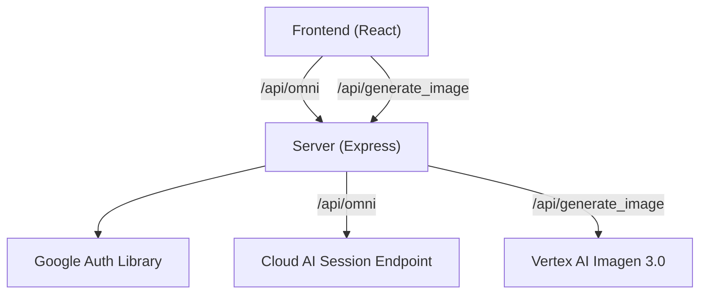
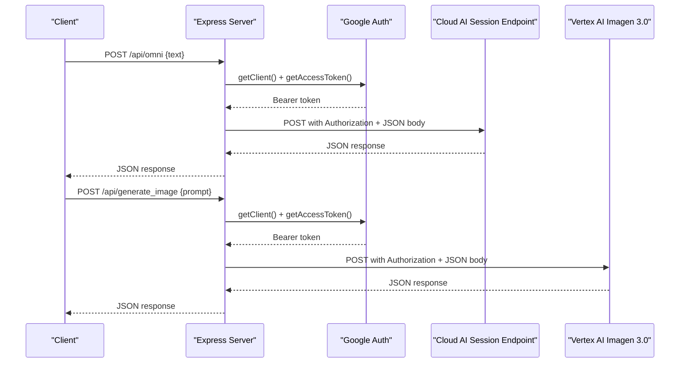
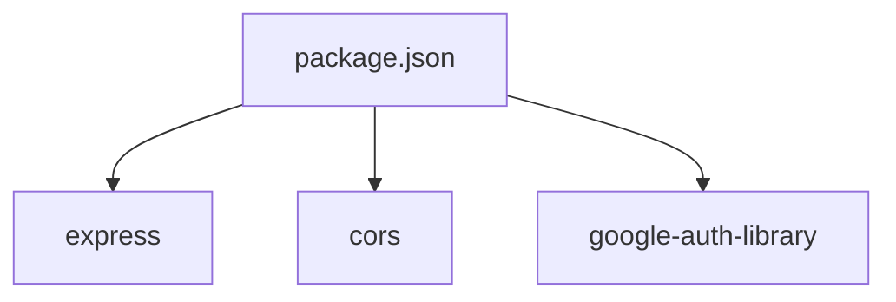

# API Endpoints

<cite>
**Referenced Files in This Document**
- [server.js](file://server.js)
- [package.json](file://package.json)
- [MindmapView.jsx](file://src/components/MindmapView.jsx)
- [VaultDashboard.jsx](file://src/components/VaultDashboard.jsx)
- [README.md](file://README.md)
</cite>

## Table of Contents
1. [Introduction](#introduction)
2. [Project Structure](#project-structure)
3. [Core Components](#core-components)
4. [Architecture Overview](#architecture-overview)
5. [Detailed Component Analysis](#detailed-component-analysis)
6. [Dependency Analysis](#dependency-analysis)
7. [Performance Considerations](#performance-considerations)
8. [Troubleshooting Guide](#troubleshooting-guide)
9. [Conclusion](#conclusion)

## Introduction
This document provides comprehensive API endpoint documentation for OMNI-TODO’s backend services. It covers:
- /api/omni: AI content extraction endpoint that forwards requests to a cloud AI service and returns structured results.
- /api/generate_image: Image generation endpoint powered by Vertex AI (Imagen 3.0) that accepts prompts and returns generated images.

The documentation includes request/response schemas, parameter validation, error handling, authentication requirements, rate limiting considerations, and examples. It also outlines API versioning, backward compatibility, and deprecation policies.

## Project Structure
The backend is implemented as a Node.js/Express server that exposes two primary endpoints:
- /api/omni: Proxies user queries to a cloud AI session endpoint after assembling a request with system instructions and user text.
- /api/generate_image: Proxies image generation requests to Vertex AI’s Imagen 3.0 model and returns base64-encoded image bytes.

The frontend integrates with these endpoints to power features like AI-powered mindmap generation and image gallery creation.

**Diagram sources**
- [server.js:13-16](file://server.js#L13-L16)
- [server.js:21-81](file://server.js#L21-L81)
- [server.js:83-129](file://server.js#L83-L129)
- [MindmapView.jsx:95-99](file://src/components/MindmapView.jsx#L95-L99)
- [VaultDashboard.jsx:1048-1052](file://src/components/VaultDashboard.jsx#L1048-L1052)

**Section sources**
- [server.js:1-135](file://server.js#L1-L135)
- [package.json:12-24](file://package.json#L12-L24)

## Core Components
- Express server initialization and middleware:
  - CORS enabled globally.
  - JSON body parsing enabled.
- Google Auth client configured with cloud-platform scope for accessing Google Cloud services.
- Two primary routes:
  - POST /api/omni: Validates presence of text, reads optional system instructions, obtains an access token, constructs a request body, and forwards to the cloud AI session endpoint.
  - POST /api/generate_image: Validates presence of prompt, obtains an access token, constructs a request body with instances and parameters, and forwards to Vertex AI Imagen 3.0.

**Section sources**
- [server.js:10-16](file://server.js#L10-L16)
- [server.js:21-81](file://server.js#L21-L81)
- [server.js:83-129](file://server.js#L83-L129)

## Architecture Overview
The server acts as a proxy to external AI services. It authenticates using Google Auth and forwards requests with appropriate headers and bodies. Responses are returned to clients with minimal transformation.

**Diagram sources**
- [server.js:21-81](file://server.js#L21-L81)
- [server.js:83-129](file://server.js#L83-L129)

## Detailed Component Analysis

### /api/omni: AI Content Extraction
Purpose:
- Accepts a user text input and returns AI-generated content extracted from it. The server augments the request with system instructions loaded from a local file path and forwards it to a cloud AI session endpoint.

Endpoints:
- Method: POST
- Path: /api/omni
- Content-Type: application/json

Request Schema:
- Required field:
  - text: string — The user-provided text to be processed by the AI.

Validation:
- Returns 400 with an error message if text is missing.

Processing:
- Reads optional system instructions from a predefined file path.
- Obtains a Bearer token via Google Auth.
- Constructs a request body containing:
  - config: session, app_version, deployment identifiers
  - inputs: array with a single object containing text combining system instructions and user text
- Sends a POST request to the cloud AI session endpoint with Authorization and Content-Type headers.
- On non-OK responses, logs the error and returns the upstream error with status code.
- On success, returns the received JSON unchanged.

Response Schema:
- JSON object returned directly from the cloud AI session endpoint. Typical fields observed in client code include:
  - responses: array of objects with text
  - reply: array of objects with text
- The frontend expects either responses[0].text or reply[0].text to extract the AI reply.

Error Handling:
- 400: Missing text.
- 500: Internal proxy error with a generic message and underlying error details.
- Non-2xx upstream responses: Propagated with status code and error details.

Security and Authentication:
- Uses Google Auth with cloud-platform scope to obtain a Bearer token.
- Authorization header is forwarded to the cloud AI session endpoint.

Rate Limiting:
- Not implemented in the server. Rate limits are governed by the upstream cloud AI service.

Examples:
- Request:
  - POST /api/omni
  - Headers: Content-Type: application/json
  - Body: {"text":"..."}
- Successful Response:
  - Status: 200
  - Body: { "responses": [ { "text": "..." } ] }
- Error Response:
  - Status: 400
  - Body: { "error": "Text is required" }

**Section sources**
- [server.js:21-81](file://server.js#L21-L81)
- [MindmapView.jsx:95-101](file://src/components/MindmapView.jsx#L95-L101)

### /api/generate_image: Image Generation via Vertex AI
Purpose:
- Accepts a textual prompt and generates an image using Vertex AI’s Imagen 3.0 model. The server forwards the request with configured parameters and returns the generated image as base64 data.

Endpoints:
- Method: POST
- Path: /api/generate_image
- Content-Type: application/json

Request Schema:
- Required field:
  - prompt: string — Descriptive text for the image to be generated.
- Optional parameters (embedded in request body):
  - instances: array of objects with prompt
  - parameters: object with:
    - sampleCount: number (default 1)
    - aspectRatio: string (default "1:1")

Validation:
- Returns 400 with an error message if prompt is missing.

Processing:
- Obtains a Bearer token via Google Auth.
- Constructs a request body with instances and parameters.
- Sends a POST request to Vertex AI Imagen 3.0 predict endpoint with Authorization and Content-Type headers.
- On non-OK responses, logs the error and returns the upstream error with status code.
- On success, returns the received JSON unchanged.

Response Schema:
- JSON object returned directly from Vertex AI. Typical fields observed in client code include:
  - predictions: array of objects with bytesBase64Encoded
- The frontend expects predictions[0].bytesBase64Encoded to construct a data URL for display.

Error Handling:
- 400: Missing prompt.
- 500: Internal server error with a generic message and underlying error details.
- Non-2xx upstream responses: Propagated with status code and error details.

Security and Authentication:
- Uses Google Auth with cloud-platform scope to obtain a Bearer token.
- Authorization header is forwarded to Vertex AI.

Rate Limiting:
- Not implemented in the server. Rate limits are governed by the upstream Vertex AI service.

Examples:
- Request:
  - POST /api/generate_image
  - Headers: Content-Type: application/json
  - Body: {"prompt":"...","parameters":{"sampleCount":1,"aspectRatio":"1:1"}}
- Successful Response:
  - Status: 200
  - Body: { "predictions": [ { "bytesBase64Encoded": "..." } ] }
- Error Response:
  - Status: 400
  - Body: { "error": "Prompt is required" }

**Section sources**
- [server.js:83-129](file://server.js#L83-L129)
- [VaultDashboard.jsx:1048-1076](file://src/components/VaultDashboard.jsx#L1048-L1076)

## Dependency Analysis
External dependencies relevant to API behavior:
- google-auth-library: Provides OAuth 2.0 credentials and access tokens for Google Cloud APIs.
- express: Web framework for routing and middleware.
- cors: Enables cross-origin requests.

**Diagram sources**
- [package.json:12-24](file://package.json#L12-L24)

**Section sources**
- [package.json:12-24](file://package.json#L12-L24)

## Performance Considerations
- Network latency: Both endpoints forward requests to external services; performance depends on network conditions and upstream availability.
- Token acquisition: Access tokens are fetched per request; consider caching tokens if throughput increases significantly.
- Payload sizes: Large prompts or complex inputs may increase latency; keep prompts concise for optimal performance.
- Frontend rendering: Mindmap and gallery views render dynamically; ensure efficient updates and avoid unnecessary re-renders.

## Troubleshooting Guide
Common issues and resolutions:
- Missing text or prompt:
  - Symptom: 400 error indicating a required field is missing.
  - Resolution: Ensure the request body includes text for /api/omni or prompt for /api/generate_image.
- Upstream errors:
  - Symptom: Non-2xx responses from cloud AI or Vertex AI.
  - Resolution: Inspect the returned error details and adjust request parameters or retry later.
- Authentication failures:
  - Symptom: 401 or permission errors when calling external endpoints.
  - Resolution: Verify Google Cloud credentials and permissions for the configured scope.
- Local instruction file not found:
  - Symptom: Warning logged when reading OMNI instructions fails.
  - Resolution: Ensure the instruction file path exists or leave it unset to use defaults.

Operational checks:
- Confirm server is running and listening on the expected port.
- Validate that CORS is enabled for browser-based clients.
- Monitor logs for detailed error messages during proxy requests.

**Section sources**
- [server.js:25-27](file://server.js#L25-L27)
- [server.js:87-89](file://server.js#L87-L89)
- [server.js:31-35](file://server.js#L31-L35)

## Conclusion
OMNI-TODO’s backend exposes two focused endpoints:
- /api/omni for AI content extraction with straightforward input validation and direct passthrough of upstream responses.
- /api/generate_image for image generation via Vertex AI with minimal request shaping and robust error propagation.

Both endpoints rely on Google Auth for secure access to external services. There is no explicit rate limiting or API versioning implemented in the server; upstream services govern quotas and compatibility. The frontend integrates these endpoints to deliver interactive features like AI mindmaps and image galleries.