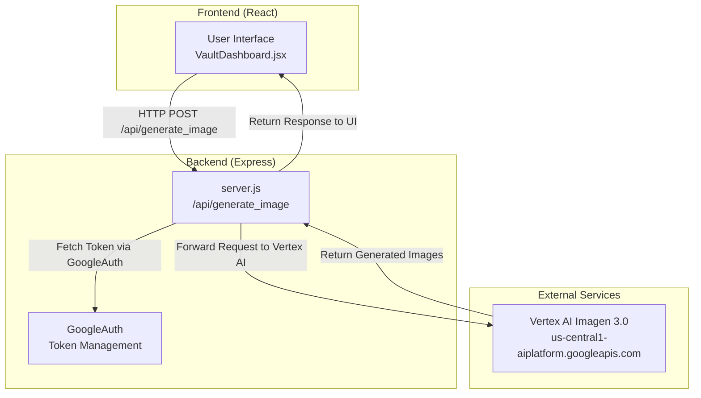
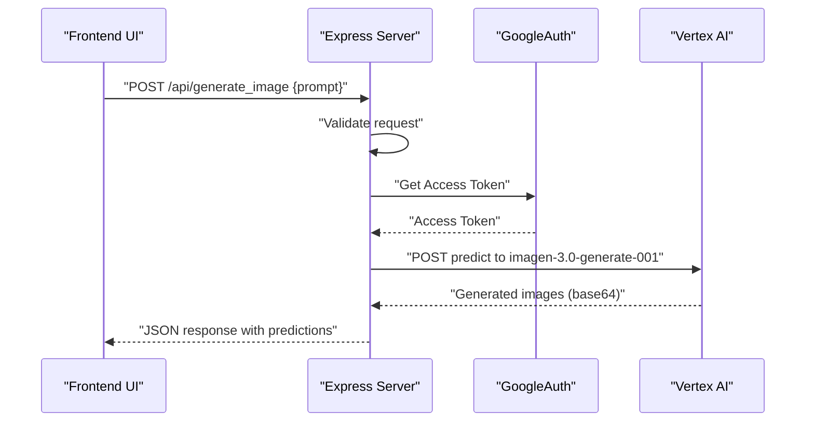
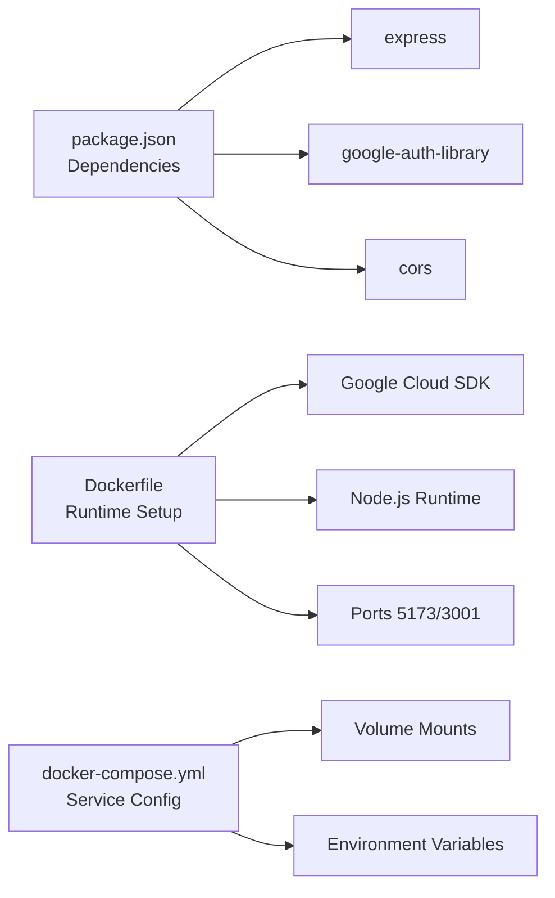

# /api/generate_image - Image Generation

<cite>
**Referenced Files in This Document**
- [server.js](file://server.js)
- [VaultDashboard.jsx](file://src/components/VaultDashboard.jsx)
- [package.json](file://package.json)
- [Dockerfile](file://Dockerfile)
- [docker-compose.yml](file://docker-compose.yml)
</cite>

## Table of Contents
1. [Introduction](#introduction)
2. [Project Structure](#project-structure)
3. [Core Components](#core-components)
4. [Architecture Overview](#architecture-overview)
5. [Detailed Component Analysis](#detailed-component-analysis)
6. [Dependency Analysis](#dependency-analysis)
7. [Performance Considerations](#performance-considerations)
8. [Troubleshooting Guide](#troubleshooting-guide)
9. [Conclusion](#conclusion)
10. [Appendices](#appendices)

## Introduction
This document provides comprehensive API documentation for the POST endpoint at /api/generate_image, which enables AI-powered image generation using Google Cloud Vertex AI’s Imagen 3.0 model. The endpoint accepts a prompt-based request, authenticates via GoogleAuth, forwards the request to Vertex AI, and returns generated images encoded in base64 format. It also documents the frontend integration, request/response schemas, error handling, and troubleshooting steps.

## Project Structure
The application consists of:
- A Node.js/Express backend that exposes the /api/generate_image endpoint and integrates with Google Cloud Vertex AI.
- A React frontend that sends requests to the backend and displays generated images.
- Docker configuration to run the backend server and the development frontend in a containerized environment.

**Diagram sources**
- [server.js:83-129](file://server.js#L83-L129)
- [VaultDashboard.jsx:1042-1076](file://src/components/VaultDashboard.jsx#L1042-L1076)

**Section sources**
- [server.js:1-135](file://server.js#L1-L135)
- [package.json:12-24](file://package.json#L12-L24)
- [Dockerfile:1-32](file://Dockerfile#L1-L32)
- [docker-compose.yml:1-18](file://docker-compose.yml#L1-L18)

## Core Components
- Backend endpoint: Implements the POST /api/generate_image with request validation, GoogleAuth token acquisition, and forwarding to Vertex AI.
- Frontend integration: Initiates requests from the UI, handles responses, and renders images.
- Authentication: Uses GoogleAuth to obtain an access token scoped to Google Cloud Platform.
- Vertex AI integration: Sends a predict request to the imagen-3.0-generate-001 model endpoint.

Key implementation references:
- Endpoint definition and handler: [server.js:83-129](file://server.js#L83-L129)
- Frontend request and response handling: [VaultDashboard.jsx:1042-1076](file://src/components/VaultDashboard.jsx#L1042-L1076)
- GoogleAuth initialization: [server.js:13-16](file://server.js#L13-L16)
- Vertex AI model endpoint: [server.js:107-114](file://server.js#L107-L114)

**Section sources**
- [server.js:83-129](file://server.js#L83-L129)
- [VaultDashboard.jsx:1042-1076](file://src/components/VaultDashboard.jsx#L1042-L1076)
- [server.js:13-16](file://server.js#L13-L16)
- [server.js:107-114](file://server.js#L107-L114)

## Architecture Overview
The request flow for /api/generate_image is as follows:
1. The frontend sends a POST request containing a prompt to /api/generate_image.
2. The backend validates the request, obtains a GoogleAuth access token, and constructs a Vertex AI predict request.
3. The backend forwards the request to Vertex AI and receives a response.
4. The backend returns the Vertex AI response to the frontend, which decodes and displays the image.

**Diagram sources**
- [server.js:83-129](file://server.js#L83-L129)
- [VaultDashboard.jsx:1042-1076](file://src/components/VaultDashboard.jsx#L1042-L1076)

## Detailed Component Analysis

### Endpoint Definition and Behavior
- Method: POST
- Path: /api/generate_image
- Purpose: Accepts a prompt and optional parameters, authenticates via GoogleAuth, and requests image generation from Vertex AI.

Request schema:
- Required:
  - prompt: string
- Optional:
  - sampleCount: integer (default 1)
  - aspectRatio: string (default "1:1")

Response schema:
- predictions: array of objects containing generated image data
- Each prediction object includes:
  - bytesBase64Encoded: string representing the generated image in base64 format

Error responses:
- 400 Bad Request: Missing prompt
- 500 Internal Server Error: Unexpected server errors
- Forwarded HTTP status from Vertex AI for generation failures

Frontend usage:
- The UI sends a POST request with the prompt and parses the base64 image data to render it.

References:
- Endpoint handler: [server.js:83-129](file://server.js#L83-L129)
- Frontend request: [VaultDashboard.jsx:1047-1052](file://src/components/VaultDashboard.jsx#L1047-L1052)
- Frontend response parsing: [VaultDashboard.jsx:1060](file://src/components/VaultDashboard.jsx#L1060)

**Section sources**
- [server.js:83-129](file://server.js#L83-L129)
- [VaultDashboard.jsx:1042-1076](file://src/components/VaultDashboard.jsx#L1042-L1076)

### Authentication and Authorization
- The backend initializes GoogleAuth with the scope for Google Cloud Platform.
- On each request, the backend retrieves an access token and attaches it to the Vertex AI request header as a Bearer token.

References:
- GoogleAuth initialization: [server.js:13-16](file://server.js#L13-L16)
- Token acquisition and usage: [server.js:91-114](file://server.js#L91-L114)

**Section sources**
- [server.js:13-16](file://server.js#L13-L16)
- [server.js:91-114](file://server.js#L91-L114)

### Vertex AI Integration
- Model endpoint: us-central1-aiplatform.googleapis.com
- Model: imagen-3.0-generate-001
- Request body includes:
  - instances: array with prompt
  - parameters: sampleCount and aspectRatio
- Response body includes predictions with base64-encoded image bytes

References:
- Vertex AI endpoint and request construction: [server.js:95-114](file://server.js#L95-L114)

**Section sources**
- [server.js:95-114](file://server.js#L95-L114)

### Frontend Integration
- The UI component sends a POST request to /api/generate_image with the prompt.
- On success, it extracts the base64 image from predictions and displays it.
- On failure, it shows an error message.

References:
- Request sending: [VaultDashboard.jsx:1047-1052](file://src/components/VaultDashboard.jsx#L1047-L1052)
- Response handling and rendering: [VaultDashboard.jsx:1060](file://src/components/VaultDashboard.jsx#L1060)

**Section sources**
- [VaultDashboard.jsx:1042-1076](file://src/components/VaultDashboard.jsx#L1042-L1076)

### Practical Examples

- Example request payload (minimal):
  - POST /api/generate_image
  - Body: { "prompt": "a serene mountain landscape at sunset" }

- Example request payload (with optional parameters):
  - POST /api/generate_image
  - Body: { "prompt": "a futuristic cityscape", "sampleCount": 2, "aspectRatio": "16:9" }

- Example successful response structure:
  - Status: 200 OK
  - Body: { "predictions": [ { "bytesBase64Encoded": "<base64_string>" }, ... ] }

- Example error response (missing prompt):
  - Status: 400 Bad Request
  - Body: { "error": "Prompt is required" }

- Example error response (Vertex AI failure):
  - Status: 500 Internal Server Error
  - Body: { "error": "Generation failed", "details": { /* Vertex AI error */ } }

Notes:
- The frontend expects predictions[0].bytesBase64Encoded to render the image.
- The UI wraps the base64 data into a data URI for display.

**Section sources**
- [server.js:83-129](file://server.js#L83-L129)
- [VaultDashboard.jsx:1042-1076](file://src/components/VaultDashboard.jsx#L1042-L1076)

## Dependency Analysis
- Runtime dependencies:
  - express: Web framework for the backend
  - google-auth-library: Handles Google OAuth tokens
  - cors: Enables cross-origin requests
- Containerization:
  - Dockerfile installs the Google Cloud SDK and runs both the Express server and Vite dev server.
  - docker-compose maps ports 1337 and 3001 and mounts the project directory.

**Diagram sources**
- [package.json:12-24](file://package.json#L12-L24)
- [Dockerfile:1-32](file://Dockerfile#L1-L32)
- [docker-compose.yml:1-18](file://docker-compose.yml#L1-L18)

**Section sources**
- [package.json:12-24](file://package.json#L12-L24)
- [Dockerfile:1-32](file://Dockerfile#L1-L32)
- [docker-compose.yml:1-18](file://docker-compose.yml#L1-L18)

## Performance Considerations
- Network latency: Expect delays due to external Vertex AI service calls.
- Base64 decoding: Rendering base64 images in the browser incurs CPU overhead; consider pre-decoding or lazy-loading large galleries.
- Concurrency: Limit simultaneous requests to avoid rate limiting or resource exhaustion.
- Caching: Store previously generated images to reduce repeated calls for identical prompts.

[No sources needed since this section provides general guidance]

## Troubleshooting Guide
Common issues and resolutions:
- Missing prompt:
  - Symptom: 400 Bad Request with an error indicating the prompt is required.
  - Resolution: Ensure the prompt field is present in the request body.

- Authentication failures:
  - Symptom: Vertex AI rejects the request due to invalid or missing token.
  - Resolution: Verify Application Default Credentials (ADC) are configured in the environment. The container includes the Google Cloud SDK; ensure credentials are available inside the container.

- Vertex AI generation failures:
  - Symptom: 500 Internal Server Error with forwarded details from Vertex AI.
  - Resolution: Review the details field for specific error codes and messages. Adjust the prompt or parameters accordingly.

- CORS errors:
  - Symptom: Browser blocks the request due to cross-origin restrictions.
  - Resolution: Confirm the backend is configured to accept requests from the frontend origin.

- Port accessibility:
  - Symptom: Cannot reach the backend at http://localhost:3001.
  - Resolution: Ensure the container exposes port 3001 and that the host port is mapped correctly in docker-compose.

References:
- Request validation and error handling: [server.js:83-129](file://server.js#L83-L129)
- Frontend request and error handling: [VaultDashboard.jsx:1042-1076](file://src/components/VaultDashboard.jsx#L1042-L1076)
- Container runtime and ports: [Dockerfile:23-31](file://Dockerfile#L23-L31), [docker-compose.yml:6-8](file://docker-compose.yml#L6-L8)

**Section sources**
- [server.js:83-129](file://server.js#L83-L129)
- [VaultDashboard.jsx:1042-1076](file://src/components/VaultDashboard.jsx#L1042-L1076)
- [Dockerfile:23-31](file://Dockerfile#L23-L31)
- [docker-compose.yml:6-8](file://docker-compose.yml#L6-L8)

## Conclusion
The /api/generate_image endpoint provides a streamlined interface for AI-powered image generation via Vertex AI. By validating inputs, acquiring tokens via GoogleAuth, and forwarding requests to the Imagen 3.0 model, it enables the frontend to render base64-encoded images. Proper configuration of ADC, careful handling of errors, and mindful performance considerations ensure reliable operation in production environments.

[No sources needed since this section summarizes without analyzing specific files]

## Appendices

### API Reference Summary
- Endpoint: POST /api/generate_image
- Content-Type: application/json
- Request body:
  - prompt (required): string
  - sampleCount (optional): integer (default 1)
  - aspectRatio (optional): string (default "1:1")
- Response body:
  - predictions: array of objects with bytesBase64Encoded
- Error responses:
  - 400 Bad Request: Missing prompt
  - 500 Internal Server Error: Unexpected server errors
  - Forwarded status from Vertex AI for generation failures

**Section sources**
- [server.js:83-129](file://server.js#L83-L129)
- [VaultDashboard.jsx:1042-1076](file://src/components/VaultDashboard.jsx#L1042-L1076)