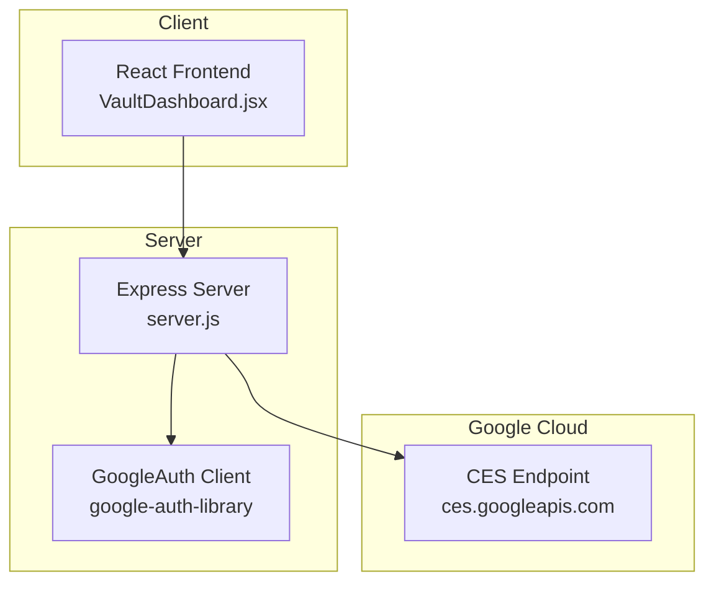
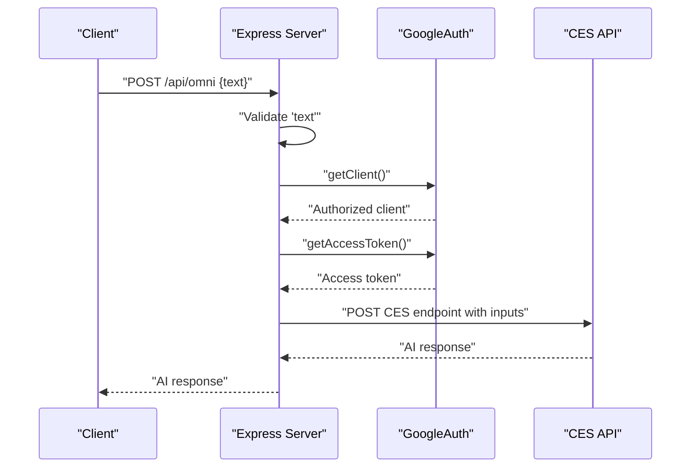
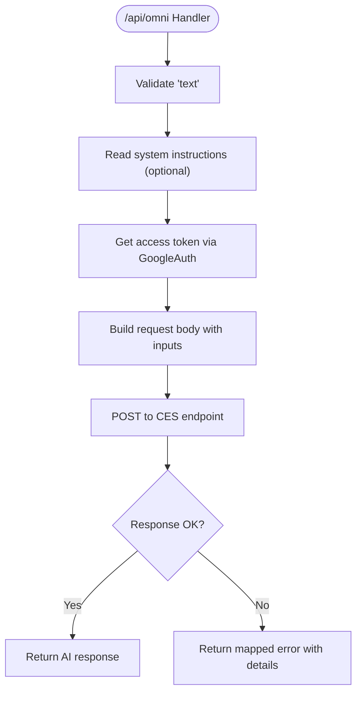
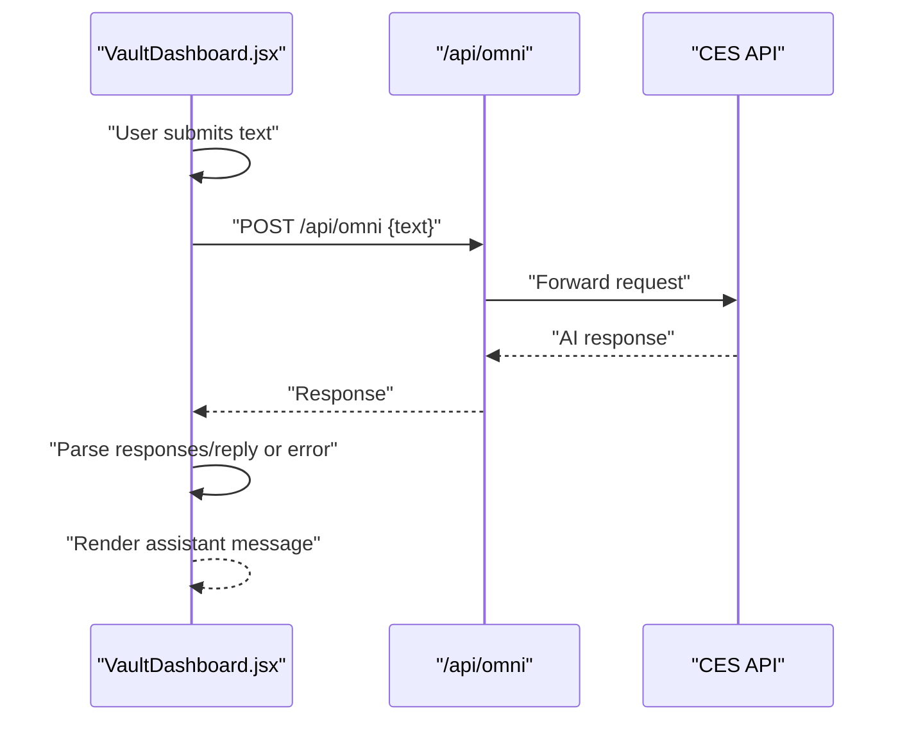
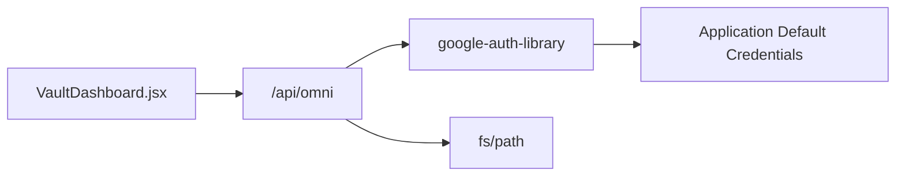

# /api/omni - Content Extraction

<cite>
**Referenced Files in This Document**
- [server.js](file://server.js)
- [VaultDashboard.jsx](file://src/components/VaultDashboard.jsx)
- [package.json](file://package.json)
- [docker-compose.yml](file://docker-compose.yml)
</cite>

## Table of Contents
1. [Introduction](#introduction)
2. [Project Structure](#project-structure)
3. [Core Components](#core-components)
4. [Architecture Overview](#architecture-overview)
5. [Detailed Component Analysis](#detailed-component-analysis)
6. [Dependency Analysis](#dependency-analysis)
7. [Performance Considerations](#performance-considerations)
8. [Troubleshooting Guide](#troubleshooting-guide)
9. [Conclusion](#conclusion)
10. [Appendices](#appendices)

## Introduction
This document provides comprehensive API documentation for the /api/omni endpoint, which performs AI-powered content extraction and processing. The endpoint accepts a POST request containing a text field, integrates with Google Cloud AI services via Application Default Credentials (ADC), and forwards the request to the Google Cloud CES service. It returns AI-generated content derived from the input text and handles various error conditions with appropriate HTTP status codes.

## Project Structure
The API is implemented in a Node.js/Express server with the following relevant components:
- Express server exposing the /api/omni endpoint
- Frontend component that sends requests to /api/omni
- Google Cloud authentication using google-auth-library
- Docker Compose configuration for local development

**Diagram sources**
- [server.js:1-135](file://server.js#L1-L135)
- [VaultDashboard.jsx:773-818](file://src/components/VaultDashboard.jsx#L773-L818)

**Section sources**
- [server.js:1-135](file://server.js#L1-L135)
- [package.json:12-24](file://package.json#L12-L24)
- [docker-compose.yml:1-18](file://docker-compose.yml#L1-L18)

## Core Components
- Express server with CORS and JSON middleware
- GoogleAuth initialization with cloud-platform scope
- /api/omni POST handler validating input and forwarding to Google Cloud
- Frontend integration sending text payloads and parsing responses

Key implementation references:
- Server initialization and middleware: [server.js:7-11](file://server.js#L7-L11)
- GoogleAuth setup: [server.js:13-16](file://server.js#L13-L16)
- Endpoint definition and handler: [server.js:21-81](file://server.js#L21-L81)
- Frontend request construction: [VaultDashboard.jsx:785-790](file://src/components/VaultDashboard.jsx#L785-L790)

**Section sources**
- [server.js:7-16](file://server.js#L7-L16)
- [server.js:21-81](file://server.js#L21-L81)
- [VaultDashboard.jsx:785-790](file://src/components/VaultDashboard.jsx#L785-L790)

## Architecture Overview
The /api/omni endpoint follows a proxy pattern:
1. Validates the incoming request for required fields
2. Reads optional system instructions from disk
3. Obtains an access token via GoogleAuth
4. Constructs a request body including the user text and system instructions
5. Forwards the request to the Google Cloud CES endpoint
6. Returns the AI response to the client

**Diagram sources**
- [server.js:21-81](file://server.js#L21-L81)

## Detailed Component Analysis

### Request Schema
- Method: POST
- Path: /api/omni
- Content-Type: application/json
- Required body field:
  - text: string (required)
- Optional behavior:
  - The server attempts to read system instructions from a fixed filesystem path and includes them in the request context

Validation rules:
- Missing text field results in HTTP 400 with an error message
- Malformed JSON or missing Content-Type header may be rejected by express.json()

Example request payloads:
- Minimal valid payload: {"text":"Summarize the benefits of renewable energy"}
- Payload with contextual instruction injection: The server constructs an internal request combining system instructions and user text

Response format:
- On success: The raw AI response returned from the Google Cloud CES endpoint
- On client error (missing text): {"error":"..."}
- On server error: {"error":"Internal proxy error","message":"..."}

Error handling:
- HTTP 400 for missing text
- HTTP 500 for internal proxy errors
- Propagation of non-OK responses from Google Cloud with details

Practical examples:
- Successful request: Client sends POST with text; server returns AI response
- Authentication failure: Access token retrieval fails; server logs and returns 500
- Google Cloud error: Non-OK response from CES; server logs and returns mapped error

**Section sources**
- [server.js:21-81](file://server.js#L21-L81)
- [VaultDashboard.jsx:785-818](file://src/components/VaultDashboard.jsx#L785-L818)

### Google Cloud Integration
Authentication flow:
- Uses Application Default Credentials (ADC) via google-auth-library
- Initializes GoogleAuth with cloud-platform scope
- Retrieves an access token for Authorization header

Forwarding to Google Cloud:
- Sends POST to https://ces.googleapis.com/...:runSession
- Includes config with session/app/version/deployment identifiers
- Wraps user text within inputs array, optionally prepended by system instructions

**Diagram sources**
- [server.js:21-81](file://server.js#L21-L81)

**Section sources**
- [server.js:13-16](file://server.js#L13-L16)
- [server.js:37-65](file://server.js#L37-L65)

### Frontend Integration
The React component sends requests to /api/omni and parses the response:
- Constructs JSON body with text field
- Handles successful responses by extracting AI text from either responses[0].text or reply[0].text
- Displays error messages when the backend returns an error object
- Provides user feedback during loading states

**Diagram sources**
- [VaultDashboard.jsx:773-818](file://src/components/VaultDashboard.jsx#L773-L818)

**Section sources**
- [VaultDashboard.jsx:773-818](file://src/components/VaultDashboard.jsx#L773-L818)

## Dependency Analysis
- Express server depends on:
  - cors for cross-origin support
  - google-auth-library for ADC-based authentication
  - fs/path for reading optional system instructions
- Frontend depends on:
  - Local server endpoint /api/omni
- Docker Compose exposes ports 1337 and 3001 for development

**Diagram sources**
- [package.json:12-24](file://package.json#L12-L24)
- [server.js:1-5](file://server.js#L1-L5)

**Section sources**
- [package.json:12-24](file://package.json#L12-L24)
- [server.js:1-5](file://server.js#L1-L5)
- [docker-compose.yml:6-8](file://docker-compose.yml#L6-L8)

## Performance Considerations
- Token acquisition overhead: Each request obtains a fresh access token; consider caching tokens if latency becomes a concern
- Network latency: The endpoint adds network hops to Google Cloud; monitor response times and implement retries if needed
- Request size: Including system instructions increases payload size; keep instructions concise
- Concurrency: Express server runs single-threaded by default; consider scaling for high load

## Troubleshooting Guide
Common issues and resolutions:
- Authentication failures
  - Ensure Application Default Credentials are configured locally or in the container
  - Confirm the service account has permissions for the target Google Cloud project and scope
  - Verify ADC setup script was executed and environment variables are present
- Invalid requests
  - Ensure the request body contains a valid JSON object with a non-empty text field
  - Confirm Content-Type: application/json header is set
- Google Cloud errors
  - Inspect the returned error details for specific causes
  - Check quotas and billing for the target project
- Internal proxy errors
  - Review server logs for stack traces
  - Validate that the system instructions file path exists or is accessible

Operational checks:
- Confirm the server is listening on port 3001
- Verify Docker Compose mounts and environment variables are correctly configured
- Test connectivity to ces.googleapis.com from the server environment

**Section sources**
- [server.js:77-80](file://server.js#L77-L80)
- [server.js:25-27](file://server.js#L25-L27)
- [docker-compose.yml:12-17](file://docker-compose.yml#L12-L17)

## Conclusion
The /api/omni endpoint provides a straightforward integration point for AI-powered content extraction. It validates inputs, authenticates via ADC, and proxies requests to Google Cloud CES while preserving AI responses for the client. Proper configuration of credentials and robust error handling are essential for reliable operation.

## Appendices

### API Definition
- Method: POST
- Path: /api/omni
- Headers:
  - Content-Type: application/json
- Request body:
  - text: string (required)
- Success response:
  - 200 OK with AI response object
- Error responses:
  - 400 Bad Request: Missing text field
  - 500 Internal Server Error: Proxy or authentication failure

### Example Requests and Responses
- Request
  - POST /api/omni
  - Body: {"text":"Explain quantum computing in simple terms"}
- Response
  - 200 OK: AI response object from Google Cloud
- Error
  - 400 Bad Request: {"error":"Text is required"}
  - 500 Internal Server Error: {"error":"Internal proxy error","message":"..."}