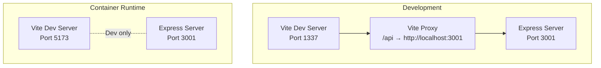
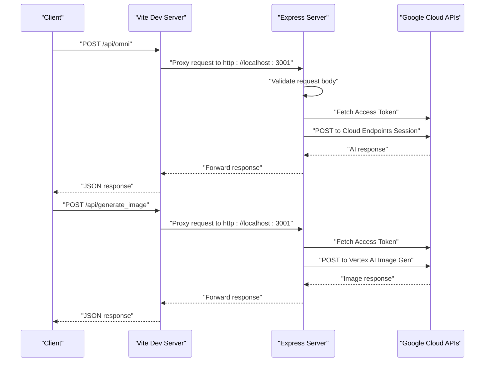
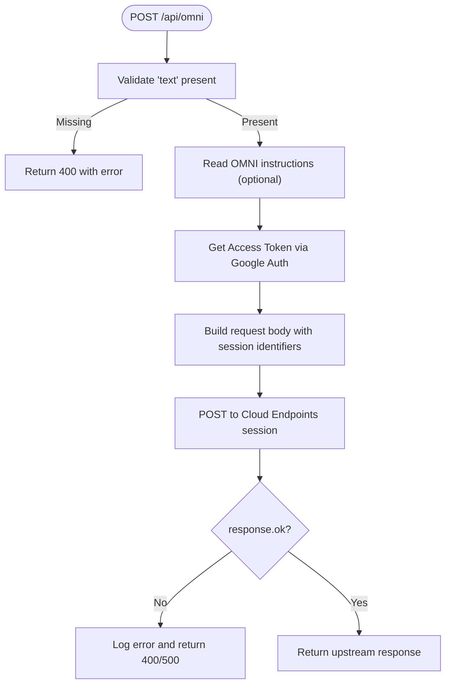
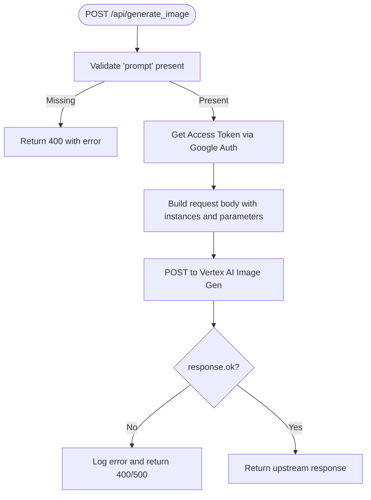
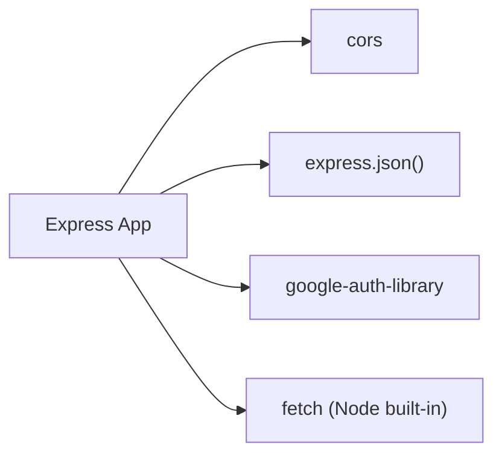

# Backend Services

<cite>
**Referenced Files in This Document**
- [server.js](file://server.js)
- [package.json](file://package.json)
- [vite.config.js](file://vite.config.js)
- [docker-compose.yml](file://docker-compose.yml)
- [Dockerfile](file://Dockerfile)
- [README.md](file://README.md)
</cite>

## Table of Contents
1. [Introduction](#introduction)
2. [Project Structure](#project-structure)
3. [Core Components](#core-components)
4. [Architecture Overview](#architecture-overview)
5. [Detailed Component Analysis](#detailed-component-analysis)
6. [Dependency Analysis](#dependency-analysis)
7. [Performance Considerations](#performance-considerations)
8. [Troubleshooting Guide](#troubleshooting-guide)
9. [Conclusion](#conclusion)

## Introduction
This document describes the backend services powering OMNI-TODO’s Express server. It covers the API endpoints for AI content extraction and image generation via Google Cloud, the Google Cloud authentication flow, CORS handling, request/response processing patterns, proxy configuration for development, and deployment via Docker Compose and Dockerfile. It also outlines middleware configuration, error handling strategies, and operational guidance for monitoring and debugging.

## Project Structure
The backend is a small Express server that:
- Initializes Google Auth for Google Cloud Platform
- Exposes two primary endpoints:
  - POST /api/omni for AI content extraction
  - POST /api/generate_image for image generation via Vertex AI
- Runs alongside a Vite-based frontend in development
- Is packaged for containerized deployment

**Diagram sources**
- [vite.config.js:7-17](file://vite.config.js#L7-L17)
- [Dockerfile:29-31](file://Dockerfile#L29-L31)
- [server.js:131-133](file://server.js#L131-L133)

**Section sources**
- [README.md:1-17](file://README.md#L1-L17)
- [vite.config.js:1-19](file://vite.config.js#L1-L19)
- [Dockerfile:1-32](file://Dockerfile#L1-L32)
- [docker-compose.yml:1-18](file://docker-compose.yml#L1-L18)

## Core Components
- Express application with JSON body parsing and CORS enabled globally
- Google Auth initialization scoped to cloud-platform
- Endpoint handlers:
  - POST /api/omni: extracts AI content using a Cloud Endpoints session
  - POST /api/generate_image: generates images via Vertex AI Image Generation
- Development proxy routing /api to the Express server
- Container runtime exposing both Vite and Express ports

Key behaviors:
- Both endpoints validate presence of required fields and return structured error responses on validation failures
- On successful upstream calls, responses are forwarded as-is
- Errors are logged and surfaced with appropriate HTTP status codes

**Section sources**
- [server.js:10-11](file://server.js#L10-L11)
- [server.js:14-16](file://server.js#L14-L16)
- [server.js:21-81](file://server.js#L21-L81)
- [server.js:83-129](file://server.js#L83-L129)
- [vite.config.js:11-16](file://vite.config.js#L11-L16)

## Architecture Overview
The backend architecture centers on Express handling API requests and delegating to Google Cloud services after obtaining an access token via google-auth-library. The Vite dev server proxies API requests to the Express server during development.

**Diagram sources**
- [server.js:21-81](file://server.js#L21-L81)
- [server.js:83-129](file://server.js#L83-L129)
- [vite.config.js:11-16](file://vite.config.js#L11-L16)

## Detailed Component Analysis

### Express Application Initialization
- Middleware:
  - CORS enabled globally
  - JSON body parser enabled
- Google Auth:
  - Initialized with cloud-platform scope
  - Used to obtain access tokens for upstream calls
- Port binding:
  - Listens on port 3001 and binds to 0.0.0.0 for container accessibility

Operational notes:
- Global CORS is convenient for development but should be restricted in production
- Binding to 0.0.0.0 enables container networking

**Section sources**
- [server.js:10-11](file://server.js#L10-L11)
- [server.js:14-16](file://server.js#L14-L16)
- [server.js:131-133](file://server.js#L131-L133)

### Endpoint: POST /api/omni
Purpose:
- Accepts a text payload and forwards it to a Cloud Endpoints session endpoint
- Optionally reads local OMNI instructions to augment the prompt

Processing logic:
- Validates presence of text
- Reads OMNI instructions from a fixed path (with graceful fallback if unreadable)
- Obtains an access token via Google Auth
- Builds a request body with session/app/deployment identifiers and inputs
- Sends a POST to the Cloud Endpoints session endpoint
- On non-OK responses, logs the error and returns a structured error
- On success, returns the upstream response unchanged

**Diagram sources**
- [server.js:21-81](file://server.js#L21-L81)

**Section sources**
- [server.js:21-81](file://server.js#L21-L81)

### Endpoint: POST /api/generate_image
Purpose:
- Accepts a prompt and generates an image via Vertex AI Image Generation

Processing logic:
- Validates presence of prompt
- Obtains an access token via Google Auth
- Builds a request body with instances and parameters (sampleCount, aspectRatio)
- Sends a POST to the Vertex AI Image Generation endpoint
- On non-OK responses, logs the error and returns a structured error
- On success, returns the upstream response unchanged

**Diagram sources**
- [server.js:83-129](file://server.js#L83-L129)

**Section sources**
- [server.js:83-129](file://server.js#L83-L129)

### Google Cloud Authentication Flow
- Uses google-auth-library to initialize GoogleAuth with cloud-platform scope
- Retrieves an access token via getClient().getAccessToken()
- Attaches Authorization: Bearer <token> to upstream requests

Security considerations:
- Scope is set to cloud-platform; adjust as needed for least privilege
- Tokens are fetched per-request; consider caching or reusing tokens if rate limits become a concern

**Section sources**
- [server.js:14-16](file://server.js#L14-L16)
- [server.js:38-40](file://server.js#L38-L40)
- [server.js:91-93](file://server.js#L91-L93)

### CORS Handling
- Enabled globally via app.use(cors())
- Allows cross-origin requests from any origin in development
- For production, configure specific origins and headers

**Section sources**
- [server.js:10](file://server.js#L10)

### Request/Response Processing Patterns
- Body parsing: express.json() ensures req.body is available
- Validation: explicit checks for required fields; returns structured errors
- Upstream calls: fetch with Authorization header and JSON body
- Error propagation: logs upstream errors and returns sanitized JSON errors

**Section sources**
- [server.js:11](file://server.js#L11)
- [server.js:25-27](file://server.js#L25-L27)
- [server.js:87-89](file://server.js#L87-L89)

### Proxy Configuration (Development)
- Vite dev server proxies /api to http://localhost:3001
- Ensures frontend can call backend endpoints without CORS complications during development

**Section sources**
- [vite.config.js:11-16](file://vite.config.js#L11-L16)

### Deployment Configuration
- Dockerfile:
  - Installs Node.js 20 slim
  - Installs Python3 and Google Cloud SDK
  - Copies package files, installs dependencies, builds app
  - Exposes ports 5173 (Vite) and 3001 (Express)
  - Starts both Vite and Express with host 0.0.0.0
- docker-compose.yml:
  - Builds the image and publishes ports 1337 and 3001
  - Shares volumes for hot reload
  - Optional gcloud credential sharing commented for Linux/Mac/Windows scenarios

**Section sources**
- [Dockerfile:1-32](file://Dockerfile#L1-L32)
- [docker-compose.yml:1-18](file://docker-compose.yml#L1-L18)

## Dependency Analysis
External libraries and their roles:
- express: Web framework hosting endpoints
- cors: Enables cross-origin requests
- google-auth-library: Handles Google OAuth2 access tokens for GCP
- dotenv: Included in dependencies; can be used to manage environment variables

**Diagram sources**
- [server.js:1-6](file://server.js#L1-L6)
- [package.json:12-24](file://package.json#L12-L24)

**Section sources**
- [package.json:12-24](file://package.json#L12-L24)

## Performance Considerations
- Token acquisition overhead: Each request obtains a fresh token; consider implementing token reuse or short-lived caching to reduce latency and cost
- Upstream latency: Cloud Endpoints and Vertex AI calls introduce network latency; add timeouts and circuit breaker patterns if needed
- Concurrency: Express defaults handle concurrent requests; monitor memory and CPU under load
- Logging: Current logging is basic; consider structured logging for observability

## Troubleshooting Guide
Common issues and remedies:
- Missing or invalid text/prompt:
  - Symptom: 400 error with validation message
  - Action: Ensure frontend sends required fields
- Google Auth failures:
  - Symptom: 500 error with internal server error
  - Action: Verify gcloud credentials and service account permissions; confirm cloud-platform scope
- CORS errors in development:
  - Symptom: Browser blocks requests despite global cors()
  - Action: Confirm Vite proxy targets http://localhost:3001
- Upstream API errors:
  - Symptom: Forwarded error from Cloud Endpoints or Vertex AI
  - Action: Inspect logged details and upstream status codes

Logging:
- Errors are logged to the console for OMNI and image generation flows
- Enhance logging with structured log entries and correlation IDs for production

**Section sources**
- [server.js:25-27](file://server.js#L25-L27)
- [server.js:87-89](file://server.js#L87-L89)
- [server.js:77-80](file://server.js#L77-L80)
- [server.js:125-128](file://server.js#L125-L128)

## Conclusion
OMNI-TODO’s backend is a focused Express service that integrates with Google Cloud for AI content extraction and image generation. It leverages google-auth-library for authentication, provides straightforward validation and error handling, and is designed for seamless development with Vite’s proxy. For production, tighten CORS, secure authentication, and implement robust logging and monitoring.