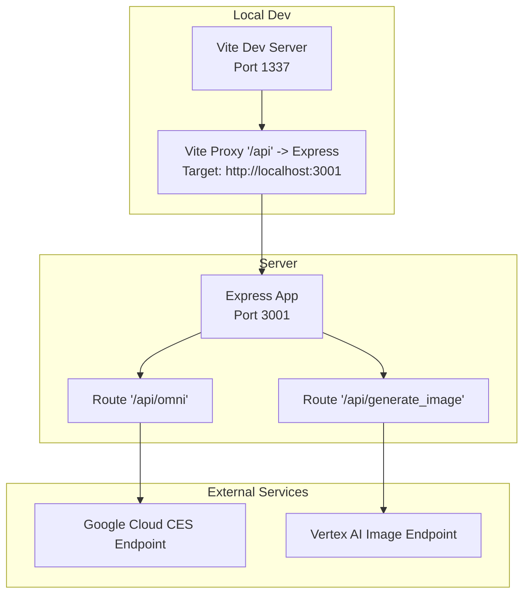
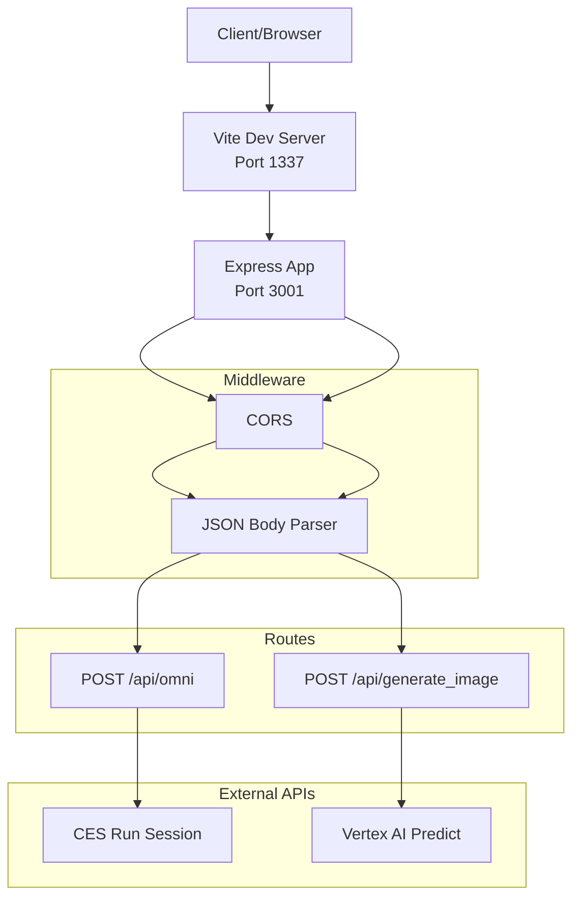
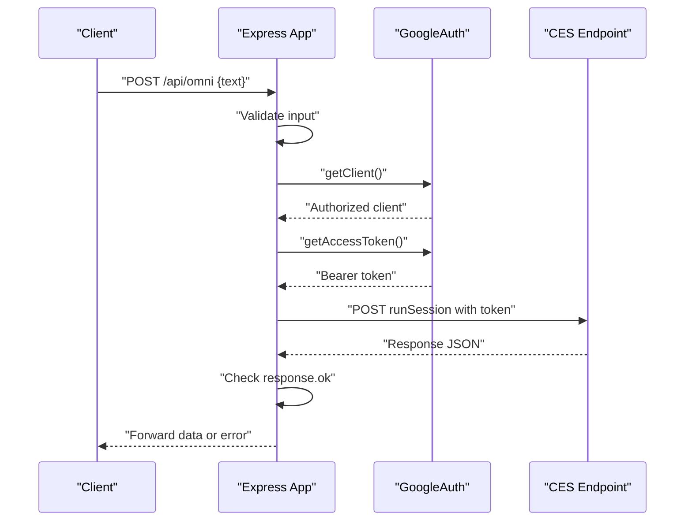
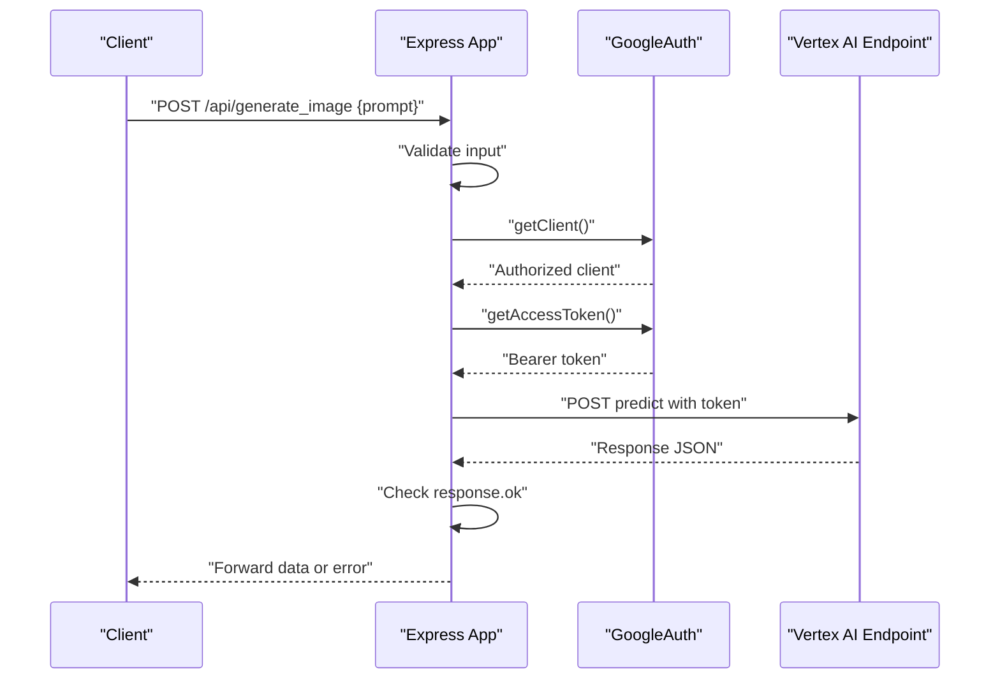
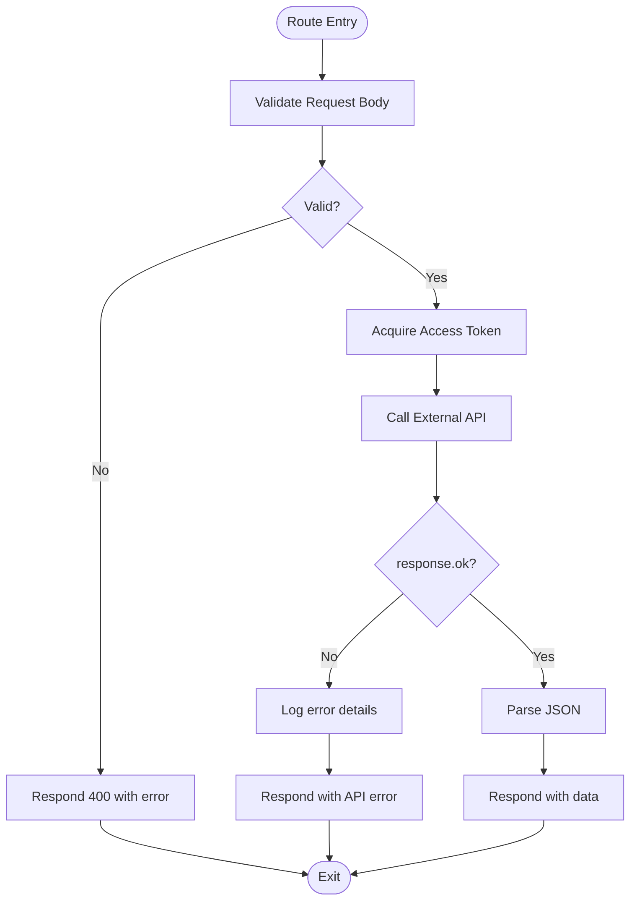
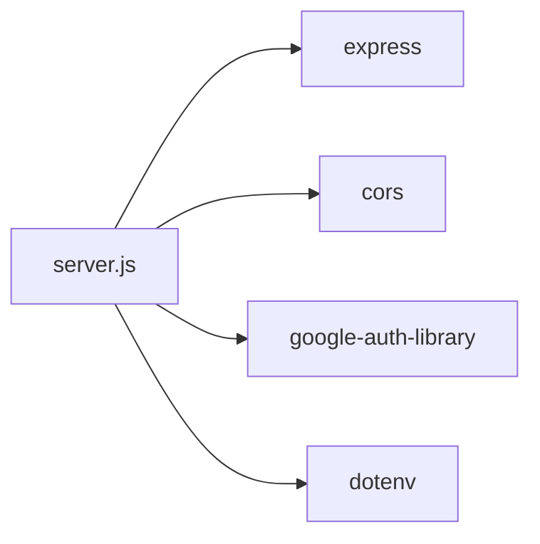

# Express Server

<cite>
**Referenced Files in This Document**
- [server.js](file://server.js)
- [package.json](file://package.json)
- [Dockerfile](file://Dockerfile)
- [docker-compose.yml](file://docker-compose.yml)
- [vite.config.js](file://vite.config.js)
</cite>

## Table of Contents
1. [Introduction](#introduction)
2. [Project Structure](#project-structure)
3. [Core Components](#core-components)
4. [Architecture Overview](#architecture-overview)
5. [Detailed Component Analysis](#detailed-component-analysis)
6. [Dependency Analysis](#dependency-analysis)
7. [Performance Considerations](#performance-considerations)
8. [Troubleshooting Guide](#troubleshooting-guide)
9. [Conclusion](#conclusion)
10. [Appendices](#appendices)

## Introduction
This document describes the Express server that powers OMNI-TODO’s backend proxy and development workflow. It covers server initialization, middleware configuration, route registration, error handling, environment and containerization setup, and operational considerations for local development and production deployment. The server exposes two primary endpoints: a proxy endpoint to an external AI service and an image generation endpoint backed by Vertex AI.

## Project Structure
The backend server is implemented as a single Express application with complementary development tooling:
- Express server entrypoint and routes
- Development proxy via Vite
- Containerization with Docker and docker-compose orchestration

**Diagram sources**
- [vite.config.js:7-17](file://vite.config.js#L7-L17)
- [server.js:21-129](file://server.js#L21-L129)

**Section sources**
- [server.js:1-135](file://server.js#L1-L135)
- [vite.config.js:1-19](file://vite.config.js#L1-L19)
- [Dockerfile:23-31](file://Dockerfile#L23-L31)
- [docker-compose.yml:6-17](file://docker-compose.yml#L6-L17)

## Core Components
- Express application initialization and middleware stack
- CORS and JSON body parsing middleware
- Route handlers for OMNI AI proxy and image generation
- Google Auth integration for bearer token acquisition
- Port binding strategy and host binding for containerized environments

Key implementation characteristics:
- Application instance creation and port constant
- Middleware pipeline: CORS and JSON body parsing
- Two asynchronous route handlers performing upstream requests
- Error handling with explicit status codes and structured responses
- Logging via console for error and informational events
- Host binding set to 0.0.0.0 for container accessibility

**Section sources**
- [server.js:7-11](file://server.js#L7-L11)
- [server.js:13-16](file://server.js#L13-L16)
- [server.js:21-81](file://server.js#L21-L81)
- [server.js:83-129](file://server.js#L83-L129)
- [server.js:131-133](file://server.js#L131-L133)

## Architecture Overview
The server follows a straightforward Express pattern:
- Centralized middleware configuration
- Route handlers encapsulate business logic and external service integration
- Asynchronous request processing with structured error propagation
- Development-time reverse proxy to avoid CORS concerns during local iteration

**Diagram sources**
- [server.js:10-11](file://server.js#L10-L11)
- [server.js:21-81](file://server.js#L21-L81)
- [server.js:83-129](file://server.js#L83-L129)

## Detailed Component Analysis

### Express Application Setup
- Creates an Express application instance.
- Configures CORS globally and enables JSON body parsing.
- Initializes Google Auth client for acquiring access tokens.
- Defines two POST routes under /api.

Operational notes:
- Uses a fixed port constant for server binding.
- Host binding set to 0.0.0.0 to enable container accessibility.
- No explicit error-handling middleware is defined; errors are handled per-route.

**Section sources**
- [server.js:7-11](file://server.js#L7-L11)
- [server.js:13-16](file://server.js#L13-L16)
- [server.js:131-133](file://server.js#L131-L133)

### Route Handlers and Request/Response Flow

#### OMNI Proxy Handler
- Validates presence of a required field in the request body.
- Reads optional system instructions from a configured path.
- Acquires an access token via Google Auth.
- Constructs a request body including system instructions and user input.
- Sends a POST request to the external CES endpoint.
- Parses and forwards the response, returning structured error messages on failure.

**Diagram sources**
- [server.js:21-81](file://server.js#L21-L81)

**Section sources**
- [server.js:21-81](file://server.js#L21-L81)

#### Image Generation Handler
- Validates presence of a prompt in the request body.
- Acquires an access token via Google Auth.
- Constructs a request body with model-specific parameters.
- Sends a POST request to the Vertex AI predict endpoint.
- Returns parsed response or structured error on failure.

**Diagram sources**
- [server.js:83-129](file://server.js#L83-L129)

**Section sources**
- [server.js:83-129](file://server.js#L83-L129)

### Security and Authentication
- CORS is enabled globally, allowing cross-origin requests from browsers.
- JSON body parsing is enabled to parse incoming request bodies.
- Authentication for external API calls is performed using Google Auth, which supplies a Bearer token for protected endpoints.
- Environment credentials for Google Auth are expected to be available in the runtime environment (e.g., via mounted credentials in containers).

**Section sources**
- [server.js:10-11](file://server.js#L10-L11)
- [server.js:13-16](file://server.js#L13-L16)

### Error Management
- Per-route try/catch blocks handle asynchronous operations.
- Explicit status codes are returned for validation failures (e.g., missing fields).
- On upstream API errors, the handler logs the error and returns the received error payload with appropriate status.
- On internal exceptions, a generic 500 response is returned with an error message.

**Diagram sources**
- [server.js:21-81](file://server.js#L21-L81)
- [server.js:83-129](file://server.js#L83-L129)

**Section sources**
- [server.js:25-27](file://server.js#L25-L27)
- [server.js:69-72](file://server.js#L69-L72)
- [server.js:77-80](file://server.js#L77-L80)
- [server.js:87-89](file://server.js#L87-L89)
- [server.js:118-121](file://server.js#L118-L121)
- [server.js:125-128](file://server.js#L125-L128)

## Dependency Analysis
Runtime dependencies relevant to the server:
- Express: Web framework
- cors: Cross-origin resource sharing
- google-auth-library: OAuth 2.0 and JWT handling for Google APIs
- dotenv: Optional environment variable support

Development and tooling:
- Vite: Frontend dev server and proxy
- Tailwind CSS and PostCSS: Styling pipeline
- ESLint: Linting configuration

**Diagram sources**
- [package.json:12-24](file://package.json#L12-L24)
- [server.js:1-6](file://server.js#L1-L6)

**Section sources**
- [package.json:12-24](file://package.json#L12-L24)
- [server.js:1-6](file://server.js#L1-L6)

## Performance Considerations
- Current implementation does not include caching, compression, or rate limiting middleware.
- Consider adding gzip/deflate compression for reducing payload sizes.
- Introduce request/response logging middleware for observability.
- Add input sanitization and size limits for JSON bodies to prevent abuse.
- Implement circuit breakers or retry/backoff for external API calls.
- Use environment variables for configurable timeouts and concurrency limits.

[No sources needed since this section provides general guidance]

## Troubleshooting Guide
Common issues and remedies:
- Missing or invalid credentials for Google Auth:
  - Ensure the runtime environment has appropriate credentials mounted or configured.
  - Confirm the service account has permissions for the target endpoints.
- CORS errors in development:
  - Verify the Vite proxy configuration targets the correct Express port.
  - Confirm the browser is sending requests to the proxied endpoint.
- Port conflicts:
  - Adjust the Express port or ensure the container port mapping is correct.
- Upstream API failures:
  - Inspect logged error responses and HTTP status codes.
  - Validate request body construction and required fields.

**Section sources**
- [vite.config.js:11-16](file://vite.config.js#L11-L16)
- [server.js:131-133](file://server.js#L131-L133)
- [server.js:69-72](file://server.js#L69-L72)
- [server.js:118-121](file://server.js#L118-L121)

## Conclusion
The Express server provides a focused backend for proxying requests to Google Cloud AI services and generating images via Vertex AI. Its design emphasizes simplicity and clarity, with per-route error handling and straightforward middleware configuration. For production readiness, consider adding logging, compression, input validation, and robust error handling middleware, along with environment-driven configuration and health checks.

[No sources needed since this section summarizes without analyzing specific files]

## Appendices

### Server Startup and Environment Configuration
- Local development:
  - The Express server listens on port 3001 and binds to 0.0.0.0 for container accessibility.
  - Vite runs on port 1337 with a proxy mapping /api to the Express server.
- Containerization:
  - Dockerfile installs dependencies, exposes ports 5173 and 3001, and starts both the Express server and Vite concurrently.
  - docker-compose maps host ports 1337 and 3001 to the container and mounts the project directory for hot reload.

**Section sources**
- [server.js:8](file://server.js#L8)
- [server.js:131-133](file://server.js#L131-L133)
- [vite.config.js:7-17](file://vite.config.js#L7-L17)
- [Dockerfile:23-31](file://Dockerfile#L23-L31)
- [docker-compose.yml:6-17](file://docker-compose.yml#L6-L17)

### Monitoring and Logging Strategies
- Add structured logging middleware to capture request IDs, timestamps, and response codes.
- Emit metrics for request latency, error rates, and upstream API response times.
- Implement a health check endpoint returning 200 OK when the server is ready.

[No sources needed since this section provides general guidance]

### Health Check Endpoint
- Add a GET /health route that validates connectivity to required external services and returns a success payload.

[No sources needed since this section provides general guidance]

### Scaling, Load Balancing, and Orchestration
- Horizontal scaling: Run multiple instances behind a load balancer.
- Container orchestration: Deploy using Kubernetes with readiness/liveness probes and autoscaling policies.
- External service quotas: Monitor and manage concurrent requests to external AI APIs.

[No sources needed since this section provides general guidance]