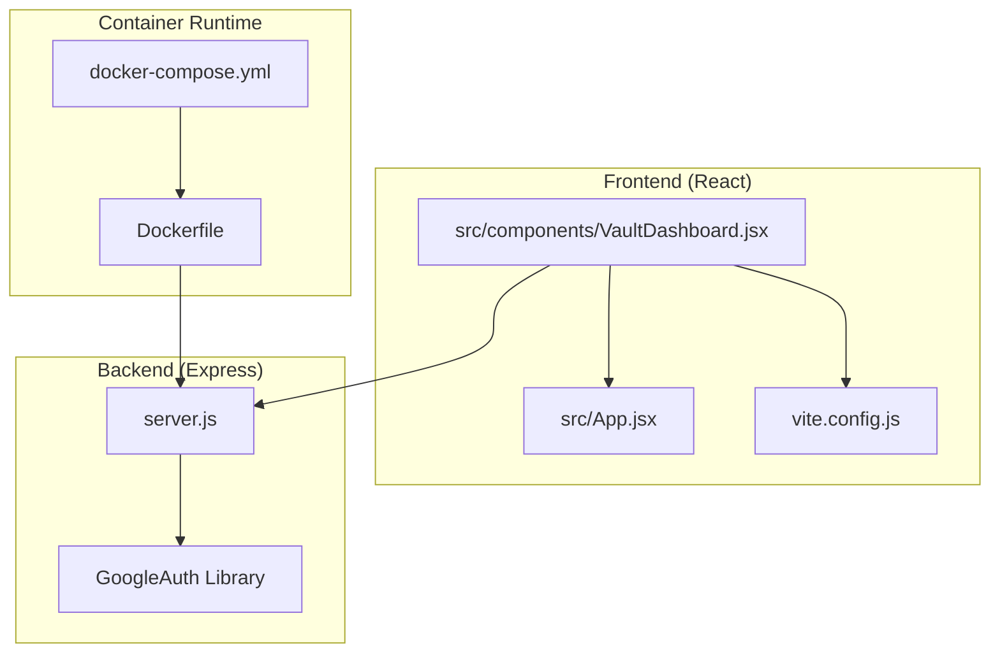
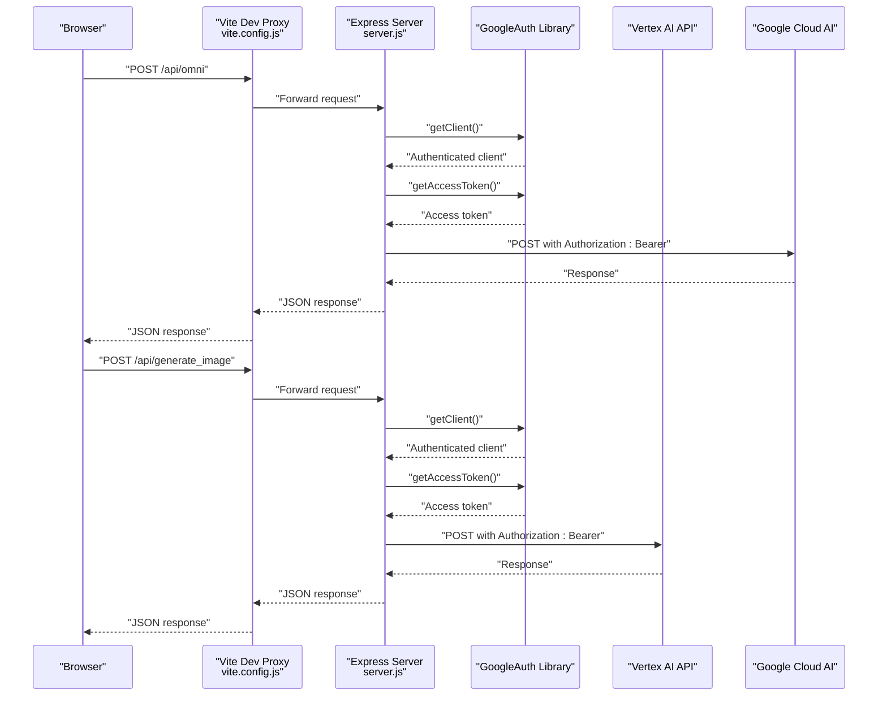
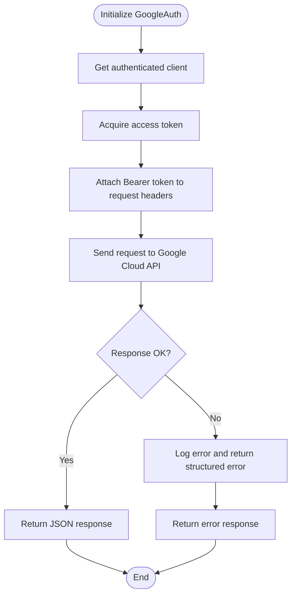
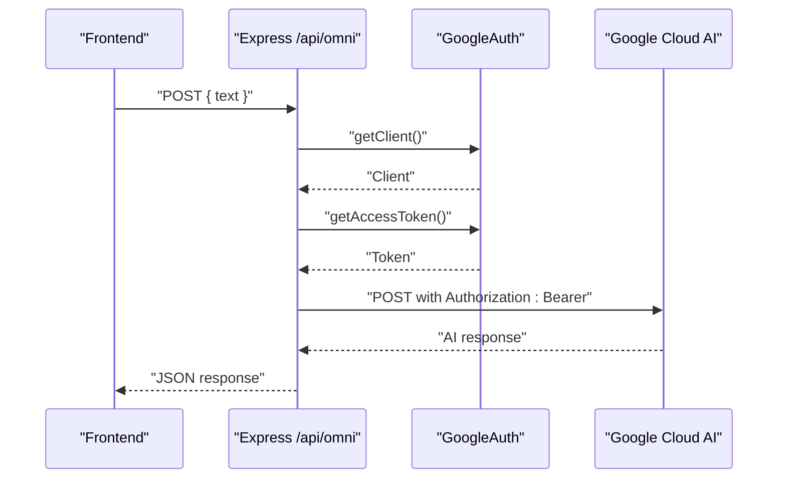
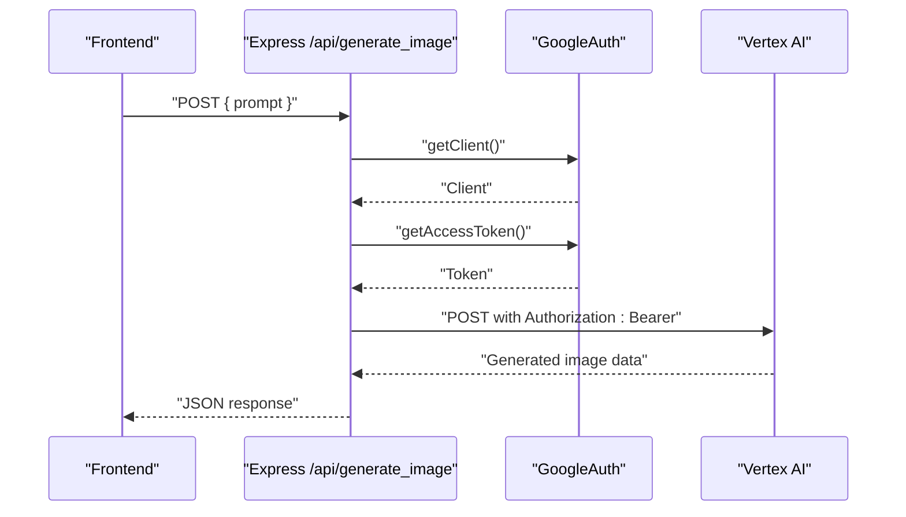
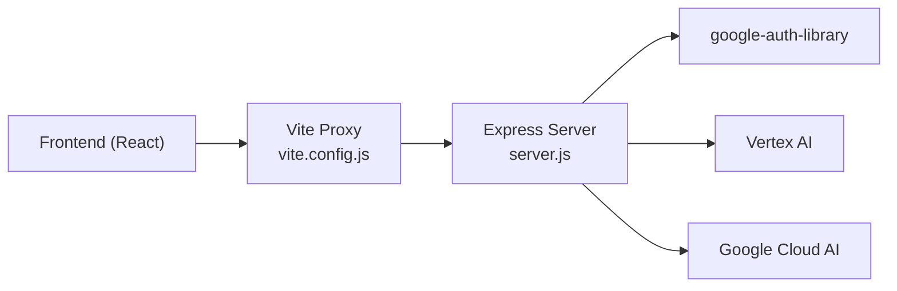

# Google Cloud Integration

<cite>
**Referenced Files in This Document**
- [README.md](file://README.md)
- [package.json](file://package.json)
- [server.js](file://server.js)
- [docker-compose.yml](file://docker-compose.yml)
- [Dockerfile](file://Dockerfile)
- [vite.config.js](file://vite.config.js)
- [src/App.jsx](file://src/App.jsx)
- [src/components/VaultDashboard.jsx](file://src/components/VaultDashboard.jsx)
</cite>

## Table of Contents
1. [Introduction](#introduction)
2. [Project Structure](#project-structure)
3. [Core Components](#core-components)
4. [Architecture Overview](#architecture-overview)
5. [Detailed Component Analysis](#detailed-component-analysis)
6. [Dependency Analysis](#dependency-analysis)
7. [Performance Considerations](#performance-considerations)
8. [Troubleshooting Guide](#troubleshooting-guide)
9. [Conclusion](#conclusion)
10. [Appendices](#appendices)

## Introduction
This document explains how OMNI-TODO integrates with Google Cloud services on the backend. It focuses on the Google Auth Library configuration, OAuth2 flow, and credential management. It also documents the authentication process for accessing Google Cloud services, including token acquisition, refresh mechanisms, and error handling. Additionally, it covers integrations with Vertex AI for image generation and Google Cloud AI for content processing. The guide includes service account configuration, API key management, security best practices, environment variable setup, authentication troubleshooting, quota management, billing configuration, resource limits, and cost optimization strategies.

## Project Structure
The backend is implemented as a Node.js/Express server that proxies requests to Google Cloud APIs. The frontend is a React application that communicates with the backend via a development proxy. Dockerization supports local development with shared credentials and port exposure.

**Diagram sources**
- [server.js:1-135](file://server.js#L1-L135)
- [vite.config.js:1-18](file://vite.config.js#L1-L18)
- [Dockerfile:1-31](file://Dockerfile#L1-L31)
- [docker-compose.yml:1-18](file://docker-compose.yml#L1-L18)

**Section sources**
- [README.md:1-17](file://README.md#L1-L17)
- [package.json:1-40](file://package.json#L1-L40)
- [server.js:1-135](file://server.js#L1-L135)
- [vite.config.js:1-18](file://vite.config.js#L1-L18)
- [Dockerfile:1-31](file://Dockerfile#L1-L31)
- [docker-compose.yml:1-18](file://docker-compose.yml#L1-L18)

## Core Components
- Express server with CORS and JSON middleware
- Google Auth Library initialization for cloud-platform scope
- OMNI proxy endpoint for Google Cloud AI content processing
- Vertex AI image generation endpoint
- Frontend proxy configuration to route /api to the backend server
- Dockerized runtime exposing ports and optionally sharing gcloud credentials

Key implementation references:
- Express server initialization and routes: [server.js:1-135](file://server.js#L1-L135)
- Google Auth Library dependency: [package.json:18-18](file://package.json#L18-L18)
- Frontend proxy configuration: [vite.config.js:11-16](file://vite.config.js#L11-L16)
- Dockerfile CMD and port exposure: [Dockerfile:29-31](file://Dockerfile#L29-L31)
- docker-compose volume and environment: [docker-compose.yml:9-17](file://docker-compose.yml#L9-L17)

**Section sources**
- [server.js:1-135](file://server.js#L1-L135)
- [package.json:18-18](file://package.json#L18-L18)
- [vite.config.js:11-16](file://vite.config.js#L11-L16)
- [Dockerfile:29-31](file://Dockerfile#L29-L31)
- [docker-compose.yml:9-17](file://docker-compose.yml#L9-L17)

## Architecture Overview
The system architecture connects the React frontend to the Express backend, which authenticates with Google Cloud using the Google Auth Library and forwards requests to Vertex AI and Google Cloud AI endpoints. Dockerization enables local development with optional credential sharing and port mapping.

**Diagram sources**
- [server.js:21-81](file://server.js#L21-L81)
- [server.js:83-129](file://server.js#L83-L129)
- [vite.config.js:11-16](file://vite.config.js#L11-L16)

## Detailed Component Analysis

### Google Auth Library Configuration
- Initialization: The GoogleAuth instance is configured with the cloud-platform scope to enable access to Google Cloud services.
- Token acquisition: The backend retrieves an access token via the library’s client to sign requests to Google Cloud APIs.
- Error handling: The backend logs errors and returns structured JSON responses for API failures.

Implementation references:
- GoogleAuth initialization: [server.js:14-16](file://server.js#L14-L16)
- Token retrieval and request signing: [server.js:38-40](file://server.js#L38-L40), [server.js:91-93](file://server.js#L91-L93)
- Error logging and response handling: [server.js:77-80](file://server.js#L77-L80), [server.js:118-121](file://server.js#L118-L121)

**Diagram sources**
- [server.js:14-16](file://server.js#L14-L16)
- [server.js:38-40](file://server.js#L38-L40)
- [server.js:91-93](file://server.js#L91-L93)
- [server.js:77-80](file://server.js#L77-L80)
- [server.js:118-121](file://server.js#L118-L121)

**Section sources**
- [server.js:14-16](file://server.js#L14-L16)
- [server.js:38-40](file://server.js#L38-L40)
- [server.js:91-93](file://server.js#L91-L93)
- [server.js:77-80](file://server.js#L77-L80)
- [server.js:118-121](file://server.js#L118-L121)

### OMNI Content Processing Endpoint
- Purpose: Accepts user text, reads local OMNI instructions, obtains an access token, and forwards a request to the Google Cloud AI endpoint.
- Request body composition: Includes session, app version, deployment identifiers and user/system instructions.
- Response handling: Returns the AI response or a structured error.

Implementation references:
- Route handler: [server.js:21-81](file://server.js#L21-L81)
- Token usage and headers: [server.js:38-40](file://server.js#L38-L40), [server.js:58-65](file://server.js#L58-L65)
- Error handling: [server.js:69-72](file://server.js#L69-L72), [server.js:77-80](file://server.js#L77-L80)

**Diagram sources**
- [server.js:21-81](file://server.js#L21-L81)
- [server.js:38-40](file://server.js#L38-L40)
- [server.js:58-65](file://server.js#L58-L65)

**Section sources**
- [server.js:21-81](file://server.js#L21-L81)
- [server.js:38-40](file://server.js#L38-L40)
- [server.js:58-65](file://server.js#L58-L65)
- [server.js:69-72](file://server.js#L69-L72)
- [server.js:77-80](file://server.js#L77-L80)

### Vertex AI Image Generation Endpoint
- Purpose: Generates images using Vertex AI’s multimodal model with a user-provided prompt.
- Request body: Instances array with the prompt and parameters such as sample count and aspect ratio.
- Response handling: Returns the generated image data or a structured error.

Implementation references:
- Route handler: [server.js:83-129](file://server.js#L83-L129)
- Token usage and headers: [server.js:91-93](file://server.js#L91-L93), [server.js:107-114](file://server.js#L107-L114)
- Error handling: [server.js:118-121](file://server.js#L118-L121), [server.js:125-128](file://server.js#L125-L128)

**Diagram sources**
- [server.js:83-129](file://server.js#L83-L129)
- [server.js:91-93](file://server.js#L91-L93)
- [server.js:107-114](file://server.js#L107-L114)

**Section sources**
- [server.js:83-129](file://server.js#L83-L129)
- [server.js:91-93](file://server.js#L91-L93)
- [server.js:107-114](file://server.js#L107-L114)
- [server.js:118-121](file://server.js#L118-L121)
- [server.js:125-128](file://server.js#L125-L128)

### Frontend Integration and Proxy
- The frontend sends requests to /api endpoints which are proxied to the backend server during development.
- The backend routes handle JSON payloads and return JSON responses.

Implementation references:
- Proxy configuration: [vite.config.js:11-16](file://vite.config.js#L11-L16)
- Frontend usage of /api endpoints: [src/components/VaultDashboard.jsx:786-790](file://src/components/VaultDashboard.jsx#L786-L790)

**Section sources**
- [vite.config.js:11-16](file://vite.config.js#L11-L16)
- [src/components/VaultDashboard.jsx:786-790](file://src/components/VaultDashboard.jsx#L786-L790)

### Docker and Environment Setup
- Dockerfile installs the Google Cloud SDK and exposes ports for Vite and the Express server.
- docker-compose shares the host’s gcloud credentials volume (commented instructions) and sets environment variables.
- Ports mapped: 1337 (Vite) and 3001 (Express).

Implementation references:
- Dockerfile CMD and ports: [Dockerfile:29-31](file://Dockerfile#L29-L31)
- docker-compose volumes and environment: [docker-compose.yml:9-17](file://docker-compose.yml#L9-L17)

**Section sources**
- [Dockerfile:29-31](file://Dockerfile#L29-L31)
- [docker-compose.yml:9-17](file://docker-compose.yml#L9-L17)

## Dependency Analysis
The backend depends on the Google Auth Library for credential management and token acquisition. The frontend depends on the development proxy to reach the backend server.

**Diagram sources**
- [package.json:18-18](file://package.json#L18-L18)
- [server.js:14-16](file://server.js#L14-L16)
- [vite.config.js:11-16](file://vite.config.js#L11-L16)

**Section sources**
- [package.json:18-18](file://package.json#L18-L18)
- [server.js:14-16](file://server.js#L14-L16)
- [vite.config.js:11-16](file://vite.config.js#L11-L16)

## Performance Considerations
- Token reuse: Reuse the access token per request lifecycle to avoid unnecessary refresh overhead.
- Concurrency: Limit concurrent outbound requests to Vertex AI and Google Cloud AI to prevent rate limiting.
- Caching: Cache static OMNI instructions locally to reduce file I/O overhead.
- Network timeouts: Configure appropriate timeouts for external API calls to avoid hanging connections.
- Container resources: Allocate sufficient CPU/memory to the container to handle concurrent requests.

## Troubleshooting Guide
Common issues and resolutions:
- Authentication failures
  - Verify Application Default Credentials (ADC) are properly configured in the environment or container.
  - Confirm the cloud-platform scope is included in the GoogleAuth initialization.
  - Check that the service account has required IAM permissions for Vertex AI and Google Cloud AI.
  - References: [server.js:14-16](file://server.js#L14-L16), [docker-compose.yml:12-14](file://docker-compose.yml#L12-L14)
- Token errors
  - Ensure the Google Auth Library can retrieve an access token before making API calls.
  - Reference: [server.js:38-40](file://server.js#L38-L40), [server.js:91-93](file://server.js#L91-L93)
- API errors
  - Inspect error logs and return structured error responses for debugging.
  - Reference: [server.js:69-72](file://server.js#L69-L72), [server.js:118-121](file://server.js#L118-L121), [server.js:77-80](file://server.js#L77-L80), [server.js:125-128](file://server.js#L125-L128)
- CORS issues
  - Confirm CORS middleware is enabled and origins are correctly configured.
  - Reference: [server.js:10-11](file://server.js#L10-L11)
- Port conflicts
  - Adjust exposed ports in Dockerfile and docker-compose.yml if conflicts occur.
  - References: [Dockerfile:26-27](file://Dockerfile#L26-L27), [docker-compose.yml:6-8](file://docker-compose.yml#L6-L8)
- Local development credentials
  - Share gcloud credentials with the container if running locally on Linux/Mac; adjust paths for Windows.
  - Reference: [docker-compose.yml:12-14](file://docker-compose.yml#L12-L14)

**Section sources**
- [server.js:14-16](file://server.js#L14-L16)
- [server.js:38-40](file://server.js#L38-L40)
- [server.js:91-93](file://server.js#L91-L93)
- [server.js:69-72](file://server.js#L69-L72)
- [server.js:118-121](file://server.js#L118-L121)
- [server.js:77-80](file://server.js#L77-L80)
- [server.js:125-128](file://server.js#L125-L128)
- [server.js:10-11](file://server.js#L10-L11)
- [Dockerfile:26-27](file://Dockerfile#L26-L27)
- [docker-compose.yml:6-8](file://docker-compose.yml#L6-L8)
- [docker-compose.yml:12-14](file://docker-compose.yml#L12-L14)

## Conclusion
OMNI-TODO’s backend integrates with Google Cloud services using the Google Auth Library for secure token acquisition and request signing. The Express server exposes endpoints for content processing and image generation via Vertex AI, while the frontend communicates through a development proxy. Proper credential configuration, error handling, and operational practices are essential for reliable integration and cost-effective usage.

## Appendices

### Security Best Practices
- Prefer Application Default Credentials (ADC) over long-lived API keys.
- Restrict OAuth scopes to the minimum required (cloud-platform).
- Rotate service account keys regularly and revoke unused credentials.
- Enforce least privilege IAM policies for the service account.
- Monitor and log authentication events and API errors.

### Environment Variable Setup
- ADC configuration: Ensure the environment is configured for ADC (e.g., running on GCP, workload identity, or gcloud application-default login).
- Optional: Share host gcloud credentials with the container for local development.
- References: [docker-compose.yml:12-14](file://docker-compose.yml#L12-L14), [src/components/VaultDashboard.jsx:1306-1320](file://src/components/VaultDashboard.jsx#L1306-L1320)

### Billing Configuration and Cost Optimization
- Enable billing for the Google Cloud project hosting Vertex AI and Google Cloud AI workloads.
- Set quotas and budgets to prevent unexpected costs.
- Use regional endpoints and optimize request sizes to reduce latency and cost.
- Implement retry with exponential backoff and circuit breaker patterns for resilience.
- Monitor API usage and costs via Cloud Console billing reports.