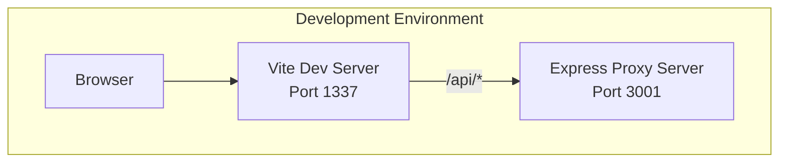
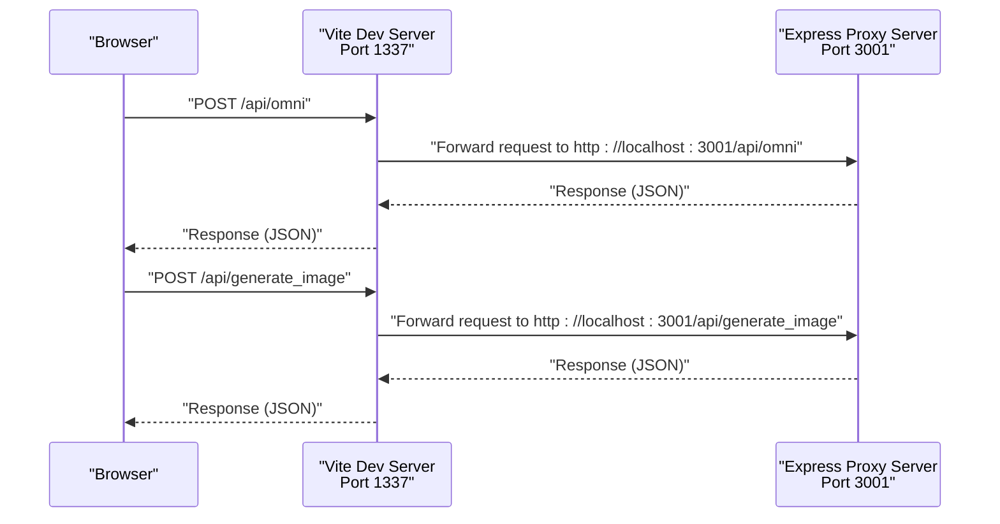

# Proxy Configuration

<cite>
**Referenced Files in This Document**
- [vite.config.js](file://vite.config.js)
- [package.json](file://package.json)
- [server.js](file://server.js)
- [docker-compose.yml](file://docker-compose.yml)
- [Dockerfile](file://Dockerfile)
- [MindmapView.jsx](file://src/components/MindmapView.jsx)
- [VaultDashboard.jsx](file://src/components/VaultDashboard.jsx)
</cite>

## Table of Contents
1. [Introduction](#introduction)
2. [Project Structure](#project-structure)
3. [Core Components](#core-components)
4. [Architecture Overview](#architecture-overview)
5. [Detailed Component Analysis](#detailed-component-analysis)
6. [Dependency Analysis](#dependency-analysis)
7. [Performance Considerations](#performance-considerations)
8. [Troubleshooting Guide](#troubleshooting-guide)
9. [Conclusion](#conclusion)

## Introduction
This document provides comprehensive proxy configuration guidance for OMNI-TODO's development and production environments. It explains how Vite's development proxy routes frontend requests to the backend Express server, details CORS behavior, and covers environment-specific configurations for local development, Docker-based setups, and production deployments. It also includes troubleshooting steps for common proxy and network connectivity issues, along with performance optimization recommendations.

## Project Structure
OMNI-TODO consists of:
- Frontend built with React and Vite, served on port 1337
- Backend Express server on port 3001
- Development proxy configured in Vite to forward API requests to the backend
- Optional Docker Compose setup exposing both ports and running both services

**Diagram sources**
- [vite.config.js:7-17](file://vite.config.js#L7-L17)
- [server.js:8](file://server.js#L8)

**Section sources**
- [vite.config.js:1-19](file://vite.config.js#L1-L19)
- [server.js:1-135](file://server.js#L1-L135)
- [docker-compose.yml:1-18](file://docker-compose.yml#L1-L18)
- [Dockerfile:23-32](file://Dockerfile#L23-L32)

## Core Components
- Vite development proxy: Routes "/api" requests to the backend server
- Express server: Provides CORS-enabled endpoints for AI and image generation
- Frontend components: Make requests to "/api/omni" and "/api/generate_image"

Key proxy behavior:
- Target URL: http://localhost:3001
- Path prefix: /api
- Origin change enabled for proper backend routing

**Section sources**
- [vite.config.js:11-16](file://vite.config.js#L11-L16)
- [server.js:10](file://server.js#L10)
- [MindmapView.jsx:95-99](file://src/components/MindmapView.jsx#L95-L99)
- [VaultDashboard.jsx:786-790](file://src/components/VaultDashboard.jsx#L786-L790)
- [VaultDashboard.jsx:1048-1052](file://src/components/VaultDashboard.jsx#L1048-L1052)

## Architecture Overview
The frontend communicates with the backend through Vite's development proxy. Requests to "/api/*" are forwarded to the Express server running on port 3001. The Express server enables CORS globally and exposes two primary endpoints:
- POST /api/omni: Processes natural language queries and returns structured data
- POST /api/generate_image: Generates images based on prompts

**Diagram sources**
- [vite.config.js:11-16](file://vite.config.js#L11-L16)
- [server.js:21-81](file://server.js#L21-L81)
- [server.js:83-129](file://server.js#L83-L129)

## Detailed Component Analysis

### Vite Proxy Configuration
- Port: 1337
- Host binding: Enabled for external access
- Allowed hosts: All
- Proxy rule: "/api" → "http://localhost:3001"
- Origin change: Enabled

Environment considerations:
- For Docker, bind Vite to 0.0.0.0 and ensure the container exposes port 1337
- When running behind a reverse proxy, adjust the proxy target accordingly

**Section sources**
- [vite.config.js:7-17](file://vite.config.js#L7-L17)
- [Dockerfile:31](file://Dockerfile#L31)

### Express Proxy Server
- Port: 3001
- CORS: Enabled globally
- Endpoints:
  - POST /api/omni: Accepts { text } and returns AI-derived data
  - POST /api/generate_image: Accepts { prompt } and returns generated image data

Security and error handling:
- Validates required fields and returns appropriate HTTP status codes
- Propagates upstream API errors with contextual messages

**Section sources**
- [server.js:8](file://server.js#L8)
- [server.js:10](file://server.js#L10)
- [server.js:21-81](file://server.js#L21-L81)
- [server.js:83-129](file://server.js#L83-L129)

### Frontend API Calls
- "/api/omni": Used by MindmapView and VaultDashboard for AI-powered mind maps and assistant responses
- "/api/generate_image": Used by VaultDashboard for image generation

These calls rely on Vite's proxy to reach the backend during development.

**Section sources**
- [MindmapView.jsx:95-99](file://src/components/MindmapView.jsx#L95-L99)
- [VaultDashboard.jsx:786-790](file://src/components/VaultDashboard.jsx#L786-L790)
- [VaultDashboard.jsx:1048-1052](file://src/components/VaultDashboard.jsx#L1048-L1052)

### Docker and Production Setup
- Ports exposed:
  - 1337 (Vite dev server)
  - 3001 (Express proxy server)
- Container runs both services concurrently:
  - node server.js
  - npx vite --host 0.0.0.0

Reverse proxy considerations:
- In production, replace Vite's proxy with a reverse proxy (e.g., Nginx, Traefik) that forwards "/api" to the backend service
- Ensure CORS headers are managed appropriately by the reverse proxy

**Section sources**
- [docker-compose.yml:6-8](file://docker-compose.yml#L6-L8)
- [Dockerfile:23-32](file://Dockerfile#L23-L32)

## Dependency Analysis
The frontend depends on Vite's proxy to route API traffic to the backend. The backend depends on Google Auth for external API access and Express middleware for request handling.

**Diagram sources**
- [MindmapView.jsx:95-99](file://src/components/MindmapView.jsx#L95-L99)
- [VaultDashboard.jsx:786-790](file://src/components/VaultDashboard.jsx#L786-L790)
- [VaultDashboard.jsx:1048-1052](file://src/components/VaultDashboard.jsx#L1048-L1052)
- [vite.config.js:11-16](file://vite.config.js#L11-L16)
- [server.js:14-16](file://server.js#L14-L16)

**Section sources**
- [package.json:14](file://package.json#L14)
- [server.js:14-16](file://server.js#L14-L16)

## Performance Considerations
- Development proxy latency: Minimal overhead; ensure Vite host binding allows external access when needed
- CORS overhead: Global CORS is convenient for development; in production, restrict origins and configure preflight caching
- Reverse proxy tuning: Enable gzip compression, connection pooling, and keep-alive for improved throughput
- Image generation: Offload heavy operations to background workers or dedicated services to prevent blocking the main thread

## Troubleshooting Guide

Common issues and resolutions:
- Proxy not forwarding requests
  - Verify Vite proxy target and path prefix
  - Confirm backend is reachable at http://localhost:3001
  - Check browser network tab for 404/502 responses

- CORS errors in development
  - Express server enables CORS globally; ensure no conflicting middleware overrides it
  - For production, configure origin restrictions and preflight handling

- Docker connectivity
  - Ensure ports 1337 and 3001 are mapped and accessible
  - Confirm Vite is bound to 0.0.0.0 in the container

- Reverse proxy misconfiguration
  - Validate "/api" path rewrite rules
  - Ensure headers like Content-Type and Authorization are preserved
  - Test endpoint availability via curl or browser developer tools

Debugging steps:
- Check Vite proxy logs for request forwarding failures
- Inspect Express server logs for upstream API errors
- Use curl to test endpoints independently of the frontend

**Section sources**
- [vite.config.js:11-16](file://vite.config.js#L11-L16)
- [server.js:10](file://server.js#L10)
- [docker-compose.yml:6-8](file://docker-compose.yml#L6-L8)
- [Dockerfile:31](file://Dockerfile#L31)

## Conclusion
OMNI-TODO's proxy setup leverages Vite's development proxy to seamlessly connect the frontend to the Express backend during development. The configuration is straightforward and effective for local workflows. For production, replace the development proxy with a robust reverse proxy, enforce stricter CORS policies, and tune performance characteristics for optimal reliability and speed.