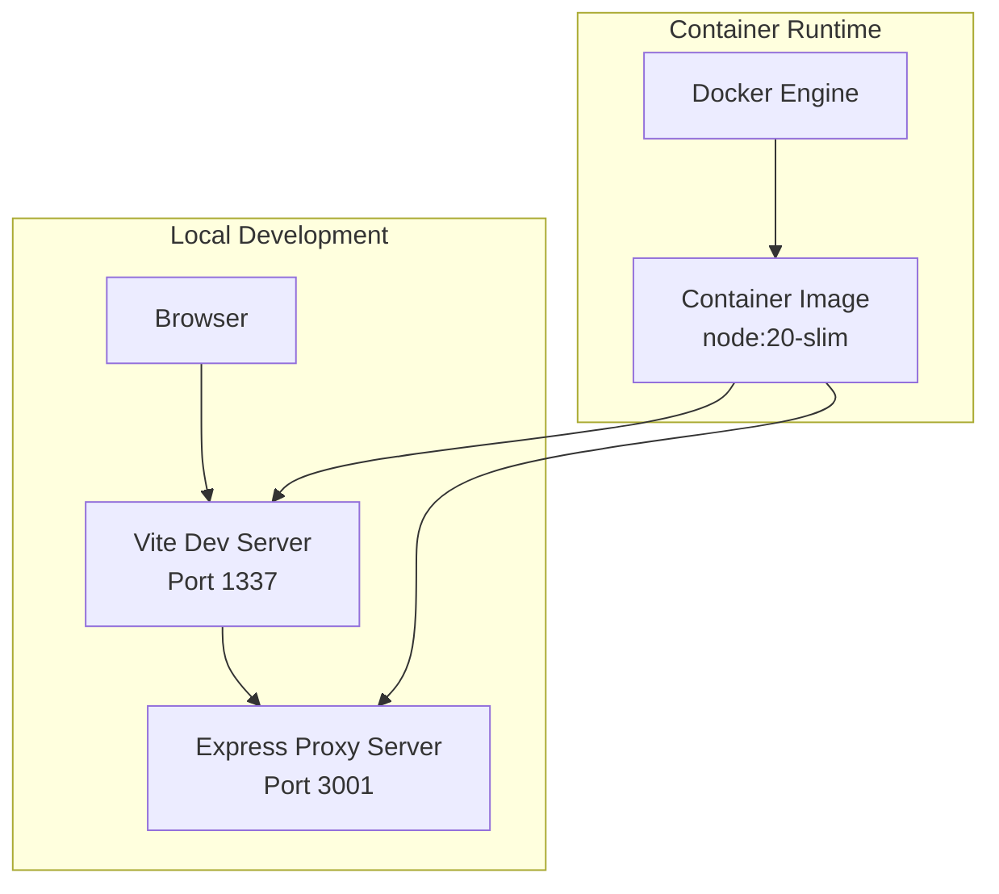
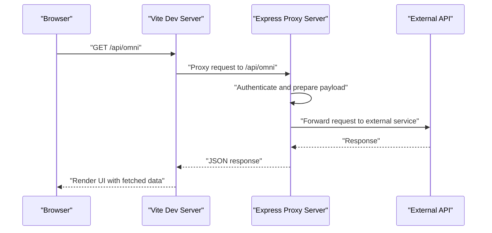
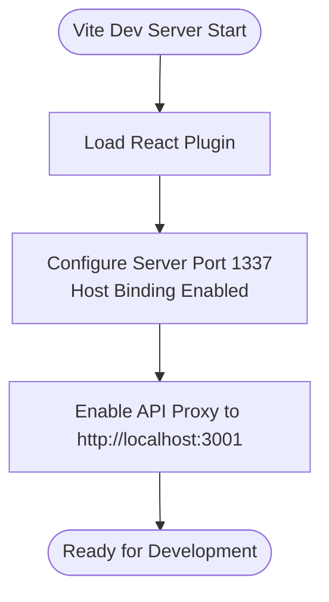
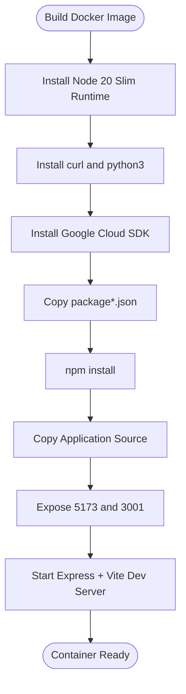
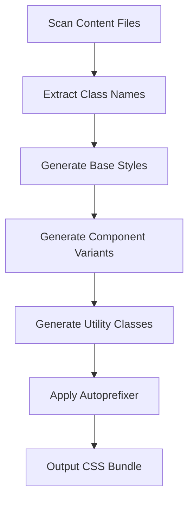
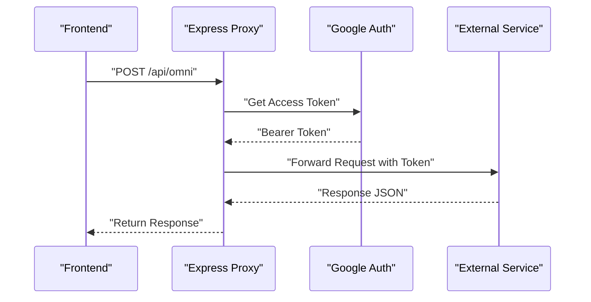
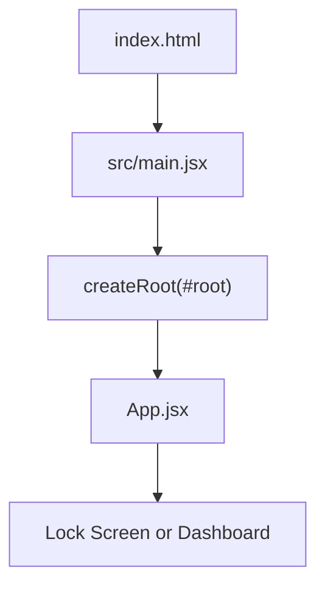
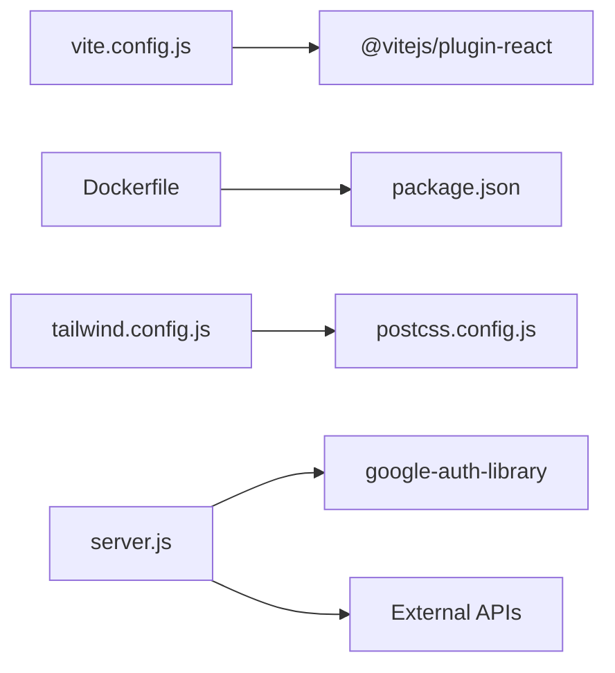

# Build and Deployment

<cite>
**Referenced Files in This Document**
- [vite.config.js](file://vite.config.js)
- [package.json](file://package.json)
- [Dockerfile](file://Dockerfile)
- [docker-compose.yml](file://docker-compose.yml)
- [.dockerignore](file://.dockerignore)
- [server.js](file://server.js)
- [tailwind.config.js](file://tailwind.config.js)
- [postcss.config.js](file://postcss.config.js)
- [index.html](file://index.html)
- [src/main.jsx](file://src/main.jsx)
- [src/App.jsx](file://src/App.jsx)
- [.gitignore](file://.gitignore)
- [README.md](file://README.md)
</cite>

## Table of Contents
1. [Introduction](#introduction)
2. [Project Structure](#project-structure)
3. [Core Components](#core-components)
4. [Architecture Overview](#architecture-overview)
5. [Detailed Component Analysis](#detailed-component-analysis)
6. [Dependency Analysis](#dependency-analysis)
7. [Performance Considerations](#performance-considerations)
8. [Security Hardening](#security-hardening)
9. [Monitoring Setup](#monitoring-setup)
10. [CI/CD Pipeline Considerations](#cicd-pipeline-considerations)
11. [Automated Testing Integration](#automated-testing-integration)
12. [Rollback Procedures](#rollback-procedures)
13. [Deployment Strategies](#deployment-strategies)
14. [Troubleshooting Guide](#troubleshooting-guide)
15. [Conclusion](#conclusion)

## Introduction
This document provides comprehensive build and deployment guidance for OMNI-TODO's containerized infrastructure. It covers Vite build configuration, Docker containerization, Tailwind CSS and PostCSS integration, and deployment strategies for development, staging, and production. It also includes CI/CD pipeline considerations, automated testing integration, rollback procedures, performance optimization, security hardening, and monitoring setup.

## Project Structure
The project follows a modern React + Vite frontend with an Express proxy server. The frontend is built with Vite and styled via Tailwind CSS and PostCSS. Containerization is handled by a single Dockerfile that runs both the Vite development server and the Express proxy server. Docker Compose orchestrates the container and exposes ports for local development.

**Diagram sources**
- [Dockerfile:1-32](file://Dockerfile#L1-L32)
- [docker-compose.yml:1-18](file://docker-compose.yml#L1-L18)
- [vite.config.js:7-17](file://vite.config.js#L7-L17)
- [server.js:131-133](file://server.js#L131-L133)

**Section sources**
- [README.md:1-17](file://README.md#L1-L17)
- [package.json:6-11](file://package.json#L6-L11)
- [index.html:1-14](file://index.html#L1-L14)
- [src/main.jsx:1-11](file://src/main.jsx#L1-L11)

## Core Components
- Vite configuration defines the React plugin, development server port, host binding, allowed hosts, and API proxy to the Express server.
- Dockerfile sets up the runtime environment, installs dependencies, exposes ports, and starts both the proxy server and Vite dev server.
- docker-compose.yml builds the image locally, maps ports, mounts volumes for live reload, and sets environment variables.
- Tailwind CSS and PostCSS configure content scanning, theme extension, and autoprefixing.
- Express proxy server handles API requests to external services and returns responses to the frontend.

**Section sources**
- [vite.config.js:1-19](file://vite.config.js#L1-L19)
- [Dockerfile:1-32](file://Dockerfile#L1-L32)
- [docker-compose.yml:1-18](file://docker-compose.yml#L1-L18)
- [tailwind.config.js:1-27](file://tailwind.config.js#L1-L27)
- [postcss.config.js:1-7](file://postcss.config.js#L1-L7)
- [server.js:1-135](file://server.js#L1-L135)

## Architecture Overview
The application architecture consists of:
- Frontend: React SPA built by Vite with hot module replacement and proxying API calls to the backend.
- Backend: Express proxy server handling authentication and forwarding requests to external APIs.
- Container: Single container running both the frontend dev server and the proxy server, exposing ports for development.

**Diagram sources**
- [vite.config.js:11-16](file://vite.config.js#L11-L16)
- [server.js:21-81](file://server.js#L21-L81)

## Detailed Component Analysis

### Vite Build Configuration
- Plugin: React plugin is enabled for JSX transformations.
- Server: Development server binds to port 1337 and allows external access with host binding enabled.
- Proxy: Requests to /api are proxied to the Express server running on localhost:3001.
- Scripts: Standard Vite scripts for dev, build, lint, and preview are defined.

**Diagram sources**
- [vite.config.js:5-17](file://vite.config.js#L5-L17)

**Section sources**
- [vite.config.js:1-19](file://vite.config.js#L1-L19)
- [package.json:6-11](file://package.json#L6-L11)

### Docker Containerization
- Base Image: Uses node:20-slim with additional packages for Google Cloud SDK installation.
- Dependencies: Installs Node.js dependencies from package.json.
- Ports: Exposes 5173 (Vite) and 3001 (Express) but publishes 1337 and 3001 for local development.
- Command: Starts both server.js and Vite dev server with host binding for external access.
- Volume Mounts: Mounts project directory and excludes node_modules for live reload.

**Diagram sources**
- [Dockerfile:1-32](file://Dockerfile#L1-L32)

**Section sources**
- [Dockerfile:1-32](file://Dockerfile#L1-L32)
- [docker-compose.yml:1-18](file://docker-compose.yml#L1-L18)
- [.dockerignore:1-6](file://.dockerignore#L1-L6)

### Tailwind CSS and PostCSS Integration
- Content: Scans index.html and all JS/JSX/TS/TSX files under src for class usage.
- Theme: Extends font family and maps semantic theme colors to CSS variables.
- PostCSS: Enables Tailwind CSS and Autoprefixer plugins.

**Diagram sources**
- [tailwind.config.js:3-6](file://tailwind.config.js#L3-L6)
- [postcss.config.js:1-7](file://postcss.config.js#L1-L7)

**Section sources**
- [tailwind.config.js:1-27](file://tailwind.config.js#L1-L27)
- [postcss.config.js:1-7](file://postcss.config.js#L1-L7)

### Express Proxy Server
- CORS: Enabled globally for development.
- Authentication: Uses Google Auth Library to obtain bearer tokens for external API calls.
- Routes:
  - /api/omni: Sends user text with system instructions to an external session endpoint.
  - /api/generate_image: Generates images using an external model endpoint.
- Logging: Logs errors and forwards API responses to clients.

**Diagram sources**
- [server.js:14-16](file://server.js#L14-L16)
- [server.js:21-81](file://server.js#L21-L81)

**Section sources**
- [server.js:1-135](file://server.js#L1-L135)

### Frontend Entry and App Shell
- Entry Point: Initializes React root and renders the App component.
- App Shell: Manages application state, theme, and conditional rendering between lock screen and dashboard.

**Diagram sources**
- [index.html:1-14](file://index.html#L1-L14)
- [src/main.jsx:1-11](file://src/main.jsx#L1-L11)
- [src/App.jsx:204-255](file://src/App.jsx#L204-L255)

**Section sources**
- [index.html:1-14](file://index.html#L1-L14)
- [src/main.jsx:1-11](file://src/main.jsx#L1-L11)
- [src/App.jsx:1-441](file://src/App.jsx#L1-L441)

## Dependency Analysis
- Vite depends on the React plugin and development server configuration.
- Dockerfile depends on package.json for dependency installation.
- Tailwind CSS depends on PostCSS configuration and content scanning.
- Express proxy depends on Google Auth Library and external API endpoints.

**Diagram sources**
- [vite.config.js:2](file://vite.config.js#L2)
- [Dockerfile:18](file://Dockerfile#L18)
- [package.json:25-37](file://package.json#L25-L37)
- [tailwind.config.js:1](file://tailwind.config.js#L1)
- [postcss.config.js:1](file://postcss.config.js#L1)
- [server.js:3](file://server.js#L3)

**Section sources**
- [vite.config.js:1-19](file://vite.config.js#L1-L19)
- [Dockerfile:1-32](file://Dockerfile#L1-L32)
- [package.json:12-38](file://package.json#L12-L38)
- [tailwind.config.js:1-27](file://tailwind.config.js#L1-L27)
- [postcss.config.js:1-7](file://postcss.config.js#L1-L7)
- [server.js:1-135](file://server.js#L1-L135)

## Performance Considerations
- Development server hot reload is enabled via Vite; ensure only necessary files are watched to reduce rebuild overhead.
- Tailwind CSS purging is not configured; consider adding purge options in production builds to minimize CSS size.
- Express proxy server should cache tokens and avoid redundant authentication calls when possible.
- Docker image layers can be optimized by installing only required packages and minimizing copy operations.

## Security Hardening
- Environment Variables: Store sensitive configuration (e.g., Google Cloud credentials) in environment variables managed by the container orchestrator.
- CORS: Restrict origins in production; currently enabled broadly for development convenience.
- Authentication: Ensure secure token handling and avoid logging sensitive data.
- Docker: Limit privileges and use non-root user where feasible; prune unused layers and images regularly.

## Monitoring Setup
- Health Checks: Add readiness/liveness probes for the containerized application.
- Logging: Centralize logs from both Vite and Express servers; consider structured logging for easier parsing.
- Metrics: Integrate metrics collection for API latency and error rates.
- Observability: Use distributed tracing for cross-service requests originating from the proxy server.

## CI/CD Pipeline Considerations
- Build Stage: Install dependencies, run linters, and produce production builds.
- Test Stage: Execute unit and integration tests against the built artifacts.
- Artifact Storage: Store build outputs and Docker images in a registry.
- Deploy Stage: Roll out to staging and production with canary or blue/green strategies.
- Rollback: Maintain versioned images and reversible configuration changes.

## Automated Testing Integration
- Unit Tests: Use a testing framework compatible with Vite and React components.
- Integration Tests: Validate API proxy endpoints and external service interactions.
- Linting: Enforce code quality with ESLint during CI.

**Section sources**
- [package.json:9-10](file://package.json#L9-L10)
- [README.md:14-17](file://README.md#L14-L17)

## Rollback Procedures
- Version Pinning: Tag Docker images with semantic versions for quick rollbacks.
- Configuration Drift: Keep environment-specific configurations in version control.
- Canary Releases: Gradually shift traffic back to the previous stable version if issues arise.

## Deployment Strategies
- Development:
  - Use docker-compose to run both Vite and Express locally with volume mounts for live reload.
  - Expose ports 1337 (Vite) and 3001 (Express) as defined in compose and Dockerfile.
- Staging:
  - Build production bundles with Vite and serve via a static web server or reverse proxy.
  - Run the Express proxy server separately or containerize it with environment-specific configuration.
- Production:
  - Optimize Tailwind CSS for production and enable minification.
  - Secure ingress with TLS termination and restrict CORS policies.
  - Use secrets management for Google Cloud credentials and rotate tokens periodically.

**Section sources**
- [docker-compose.yml:1-18](file://docker-compose.yml#L1-L18)
- [Dockerfile:23-31](file://Dockerfile#L23-L31)
- [vite.config.js:7-17](file://vite.config.js#L7-L17)
- [server.js:10-11](file://server.js#L10-L11)

## Troubleshooting Guide
- Vite Proxy Issues:
  - Verify proxy target matches the Express server address and port.
  - Ensure the Express server is reachable from the container network.
- Docker Build Failures:
  - Confirm package.json and lockfile are present before building.
  - Check .dockerignore exclusions for missing files.
- Express Authentication Errors:
  - Validate Google Auth credentials and scopes.
  - Inspect external API responses for detailed error messages.
- Hot Reload Not Working:
  - Confirm volume mounts are correctly configured in docker-compose.
  - Ensure the host binding is enabled for Vite.

**Section sources**
- [vite.config.js:11-16](file://vite.config.js#L11-L16)
- [Dockerfile:20-21](file://Dockerfile#L20-L21)
- [.dockerignore:1-6](file://.dockerignore#L1-L6)
- [server.js:37-81](file://server.js#L37-L81)
- [docker-compose.yml:9-11](file://docker-compose.yml#L9-L11)

## Conclusion
OMNI-TODO leverages Vite for fast development, Tailwind CSS for styling, and a single-container Docker setup for streamlined local development. By following the outlined build, deployment, and operational practices—covering CI/CD, testing, rollback, performance, security, and monitoring—you can reliably deploy and maintain the application across environments while preserving a smooth developer experience.