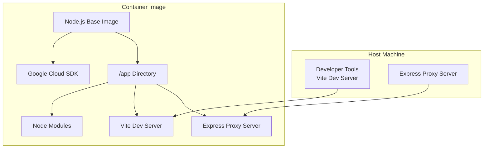
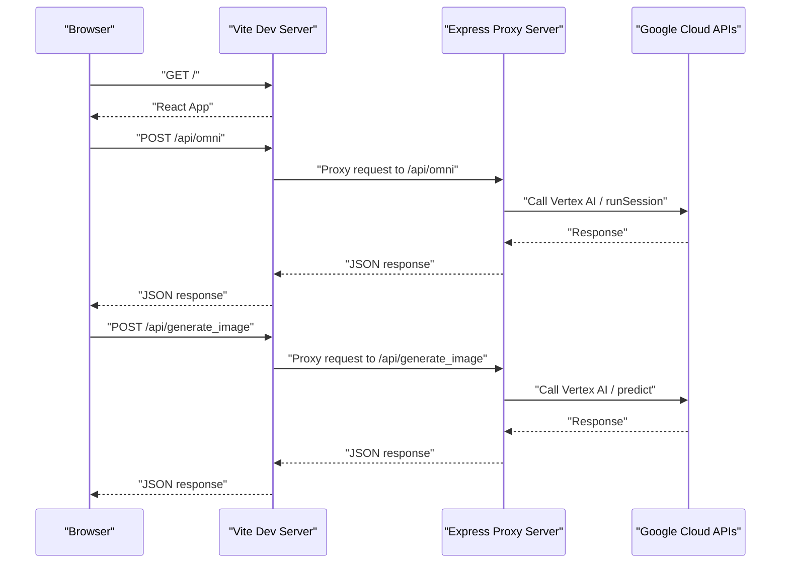
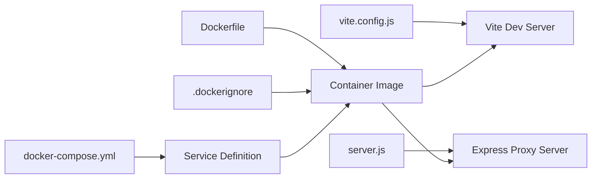

# Containerization

<cite>
**Referenced Files in This Document**
- [Dockerfile](file://Dockerfile)
- [docker-compose.yml](file://docker-compose.yml)
- [.dockerignore](file://.dockerignore)
- [package.json](file://package.json)
- [server.js](file://server.js)
- [vite.config.js](file://vite.config.js)
- [README.md](file://README.md)
</cite>

## Table of Contents
1. [Introduction](#introduction)
2. [Project Structure](#project-structure)
3. [Core Components](#core-components)
4. [Architecture Overview](#architecture-overview)
5. [Detailed Component Analysis](#detailed-component-analysis)
6. [Dependency Analysis](#dependency-analysis)
7. [Performance Considerations](#performance-considerations)
8. [Troubleshooting Guide](#troubleshooting-guide)
9. [Conclusion](#conclusion)
10. [Appendices](#appendices)

## Introduction
This document provides comprehensive containerization guidance for OMNI-TODO’s Docker-based deployment. It covers the Dockerfile configuration, docker-compose orchestration, .dockerignore optimization, container networking and port mapping, environment variable management, volume mounting strategies, and production deployment considerations including scaling, health checks, security hardening, resource limits, and monitoring.

## Project Structure
OMNI-TODO is a React + Vite frontend application with an Express proxy server that integrates with Google Cloud services. The containerization setup builds a single container that runs both the Vite development server and the Express proxy server concurrently.

**Diagram sources**
- [Dockerfile:1-32](file://Dockerfile#L1-L32)
- [server.js:1-135](file://server.js#L1-L135)
- [vite.config.js:1-19](file://vite.config.js#L1-L19)

**Section sources**
- [README.md:1-17](file://README.md#L1-L17)
- [Dockerfile:1-32](file://Dockerfile#L1-L32)
- [docker-compose.yml:1-18](file://docker-compose.yml#L1-L18)

## Core Components
- Dockerfile defines the base image, installs Google Cloud SDK prerequisites, sets up the application directory, copies dependencies and source, exposes ports, and starts both servers.
- docker-compose.yml orchestrates the container, mapping ports, mounting volumes, setting environment variables, and enabling automatic restarts.
- .dockerignore optimizes the build context by excluding unnecessary files and directories.
- server.js implements the Express proxy server that communicates with Google Cloud APIs.
- vite.config.js configures the Vite development server, including port, host binding, and API proxying to the backend.

Key runtime behaviors:
- The container exposes ports for Vite and the Express proxy server.
- The container runs both servers concurrently using a shell command.
- Volume mounts enable live development by sharing the host source code and avoiding mounting node_modules into the container.

**Section sources**
- [Dockerfile:1-32](file://Dockerfile#L1-L32)
- [docker-compose.yml:1-18](file://docker-compose.yml#L1-L18)
- [.dockerignore:1-6](file://.dockerignore#L1-L6)
- [server.js:1-135](file://server.js#L1-L135)
- [vite.config.js:1-19](file://vite.config.js#L1-L19)

## Architecture Overview
The container architecture runs two services in a single container:
- Vite development server for the React frontend.
- Express proxy server exposing endpoints to call Google Cloud services.

**Diagram sources**
- [server.js:21-81](file://server.js#L21-L81)
- [server.js:83-129](file://server.js#L83-L129)
- [vite.config.js:7-17](file://vite.config.js#L7-L17)

**Section sources**
- [server.js:1-135](file://server.js#L1-L135)
- [vite.config.js:1-19](file://vite.config.js#L1-L19)

## Detailed Component Analysis

### Dockerfile Configuration
- Base image: Uses a Node.js slim image suitable for development and build tasks.
- OS-level dependencies: Installs curl and Python3 to support Google Cloud SDK installation.
- Google Cloud SDK: Installs the SDK and updates PATH to include the SDK binaries.
- Working directory: Sets /app as the application directory.
- Dependency installation: Copies package metadata, installs dependencies, then copies the rest of the application.
- Ports: Exposes ports used by Vite and the Express proxy server.
- Command: Starts both the Express proxy server and Vite dev server concurrently, binding Vite to 0.0.0.0 for external access.

Security and optimization considerations:
- The image includes OS packages for SDK support; consider minimizing layers and removing cache after package installation.
- The CMD runs two processes; ensure proper signal handling and process supervision in production images.

**Section sources**
- [Dockerfile:1-32](file://Dockerfile#L1-L32)

### docker-compose Orchestration
- Version: Uses Compose v3.8.
- Service definition: Builds the image from the current directory.
- Port mapping: Maps host ports to container ports for Vite and the Express proxy server.
- Volume mounts: Shares the host source code into /app and excludes node_modules from mounting.
- Environment variables: Sets NODE_ENV to development.
- Restart policy: Enables automatic restarts.

Operational notes:
- The compose file does not define a separate network; containers share the default bridge network.
- No explicit health checks are configured; consider adding health checks for production deployments.

**Section sources**
- [docker-compose.yml:1-18](file://docker-compose.yml#L1-L18)

### .dockerignore Configuration
- Excludes node_modules, .git, dist, .env, and log files from the build context.
- Reduces build time and image size by preventing unnecessary files from being copied into the image.

**Section sources**
- [.dockerignore:1-6](file://.dockerignore#L1-L6)

### Express Proxy Server (server.js)
- CORS middleware enabled globally.
- JSON body parsing enabled.
- GoogleAuth initialized with cloud-platform scope.
- Endpoints:
  - POST /api/omni: Calls Vertex AI runSession endpoint.
  - POST /api/generate_image: Calls Vertex AI predict endpoint.
- Listens on port 3001 bound to 0.0.0.0.

Operational considerations:
- Hardcoded local instruction file path may cause failures in containerized environments; consider injecting via environment variables or mounting a configuration file.
- Authentication relies on GoogleAuth client; ensure credentials are available in the container environment.

**Section sources**
- [server.js:1-135](file://server.js#L1-L135)

### Vite Development Server (vite.config.js)
- Port: 1337.
- Host binding: Allows connections from external hosts.
- Proxy: Proxies API requests to the Express server running on localhost:3001.

**Section sources**
- [vite.config.js:1-19](file://vite.config.js#L1-L19)

### Package Scripts and Build Context
- Scripts include dev, build, lint, and preview.
- The build script uses Vite to produce a static site; while the Dockerfile currently focuses on development, production images should leverage the built assets.

**Section sources**
- [package.json:6-11](file://package.json#L6-L11)

## Dependency Analysis
The containerization stack depends on:
- Dockerfile for image construction.
- docker-compose.yml for service orchestration.
- .dockerignore for build context optimization.
- server.js for backend API integration.
- vite.config.js for frontend development server configuration.

**Diagram sources**
- [Dockerfile:1-32](file://Dockerfile#L1-L32)
- [docker-compose.yml:1-18](file://docker-compose.yml#L1-L18)
- [.dockerignore:1-6](file://.dockerignore#L1-L6)
- [server.js:1-135](file://server.js#L1-L135)
- [vite.config.js:1-19](file://vite.config.js#L1-L19)

**Section sources**
- [Dockerfile:1-32](file://Dockerfile#L1-L32)
- [docker-compose.yml:1-18](file://docker-compose.yml#L1-L18)
- [.dockerignore:1-6](file://.dockerignore#L1-L6)
- [server.js:1-135](file://server.js#L1-L135)
- [vite.config.js:1-19](file://vite.config.js#L1-L19)

## Performance Considerations
- Build context optimization: The .dockerignore configuration reduces build size and improves build times by excluding node_modules, .git, dist, .env, and logs.
- Layer caching: The Dockerfile installs dependencies before copying application code, allowing reuse of cached layers when dependencies do not change.
- Multi-stage builds: Consider introducing a production stage to reduce image size and improve security by separating build-time dependencies from runtime dependencies.
- Resource allocation: Configure CPU and memory limits in docker-compose for predictable performance and isolation.

[No sources needed since this section provides general guidance]

## Troubleshooting Guide
Common issues and resolutions:
- Port conflicts: Ensure host ports 1337 and 3001 are free before running the container.
- CORS errors: Verify that the Express server enables CORS and that the frontend proxy configuration targets the correct backend address.
- Google Cloud authentication failures: Confirm that the GoogleAuth client can obtain tokens; mount or configure credentials appropriately in the container environment.
- Vite not accessible externally: Ensure Vite is started with host binding enabled and the port is mapped in docker-compose.
- Volume mounting issues: Confirm that the host directory is writable and that node_modules is excluded from mounting to avoid conflicts.

**Section sources**
- [docker-compose.yml:6-17](file://docker-compose.yml#L6-L17)
- [vite.config.js:7-17](file://vite.config.js#L7-L17)
- [server.js:10-11](file://server.js#L10-L11)

## Conclusion
OMNI-TODO’s containerization setup provides a practical development environment by running both the Vite frontend and Express proxy server in a single container. For production, consider adopting multi-stage builds, adding health checks, enforcing resource limits, and integrating monitoring and logging solutions. Proper environment variable management and secure credential handling are essential for reliable deployments.

[No sources needed since this section summarizes without analyzing specific files]

## Appendices

### Production Deployment Strategies
- Multi-stage builds: Separate build and runtime stages to minimize image size and attack surface.
- Health checks: Add HTTP or TCP health checks to monitor server readiness.
- Secrets management: Store sensitive configuration in environment variables or secret managers; avoid embedding secrets in the image.
- Scaling: Use horizontal pod autoscaling or container replicas for stateless services; ensure shared state is externalized.
- Networking: Define custom networks and service discovery mechanisms for inter-service communication.
- Monitoring and logging: Integrate structured logging and metrics collection; set up alerts for critical events.

[No sources needed since this section provides general guidance]

### Security Best Practices
- Run containers as non-root users when feasible.
- Remove unnecessary packages and dependencies from the final image.
- Use read-only filesystems for application directories where possible.
- Restrict exposed ports and apply network policies.
- Regularly update base images and dependencies.
- Scan images for vulnerabilities during CI/CD pipelines.

[No sources needed since this section provides general guidance]