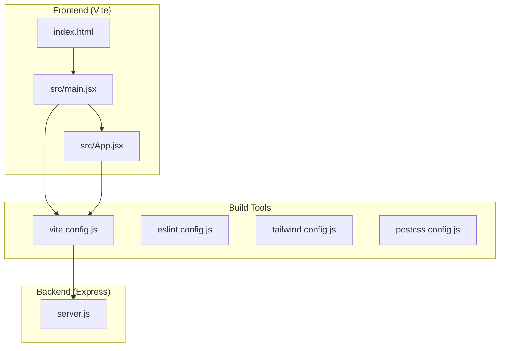
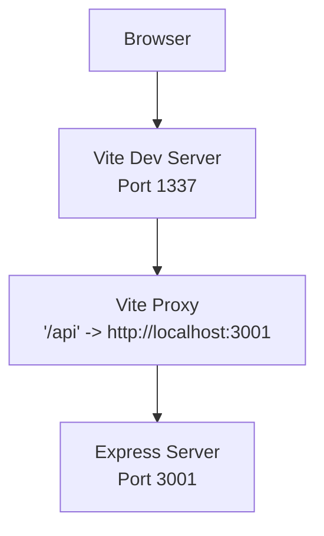
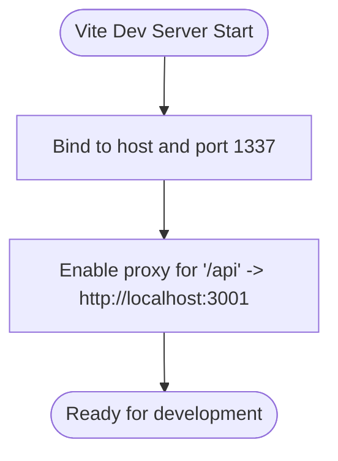
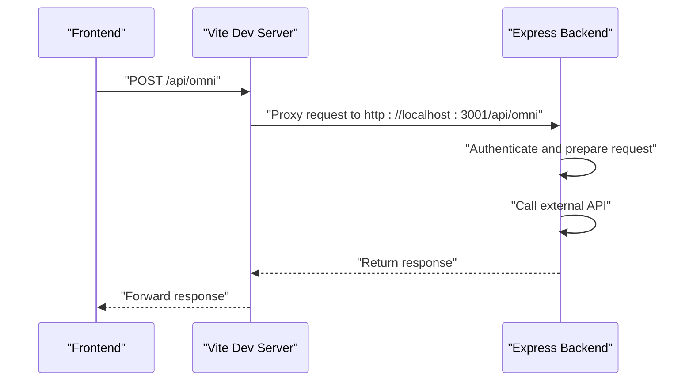
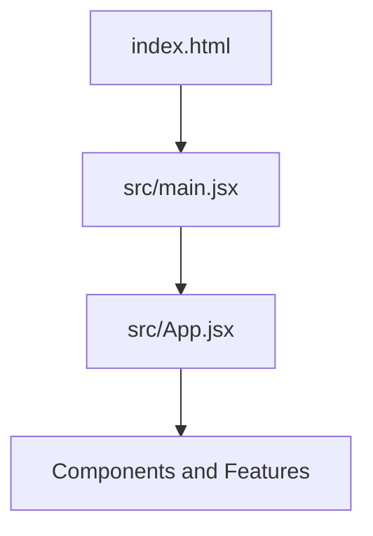
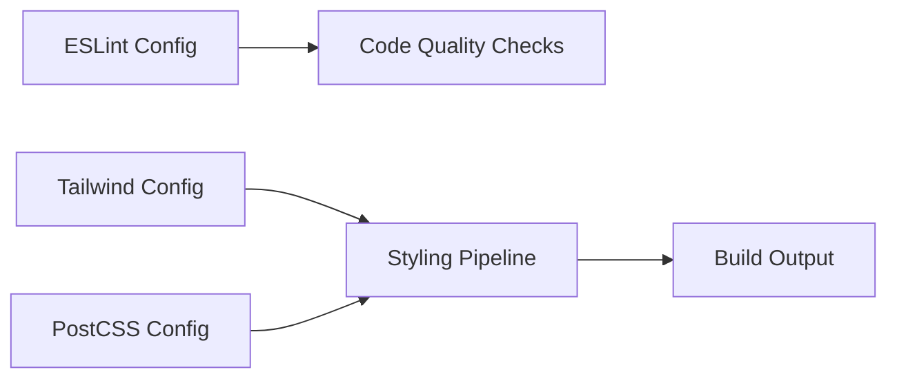
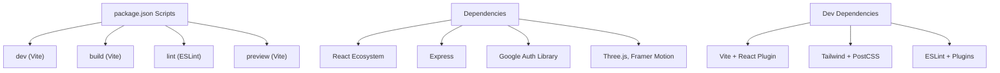
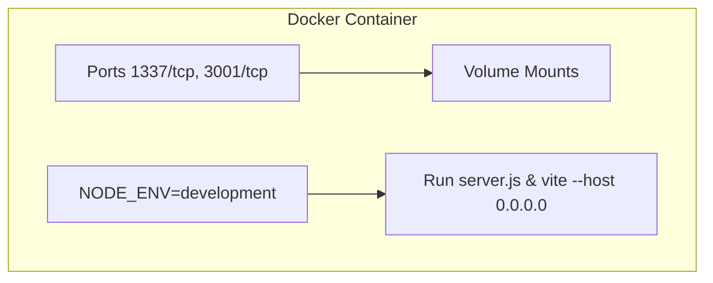
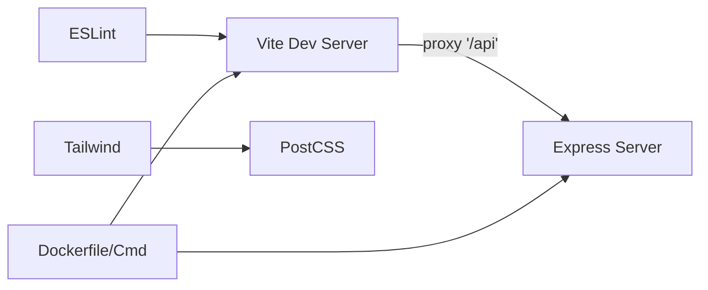

# Development Setup

<cite>
**Referenced Files in This Document**
- [package.json](file://package.json)
- [vite.config.js](file://vite.config.js)
- [server.js](file://server.js)
- [index.html](file://index.html)
- [src/main.jsx](file://src/main.jsx)
- [eslint.config.js](file://eslint.config.js)
- [tailwind.config.js](file://tailwind.config.js)
- [postcss.config.js](file://postcss.config.js)
- [docker-compose.yml](file://docker-compose.yml)
- [Dockerfile](file://Dockerfile)
- [README.md](file://README.md)
- [src/App.jsx](file://src/App.jsx)
- [src/lib/crypto.js](file://src/lib/crypto.js)
</cite>

## Table of Contents
1. [Introduction](#introduction)
2. [Project Structure](#project-structure)
3. [Core Components](#core-components)
4. [Architecture Overview](#architecture-overview)
5. [Detailed Component Analysis](#detailed-component-analysis)
6. [Dependency Analysis](#dependency-analysis)
7. [Performance Considerations](#performance-considerations)
8. [Troubleshooting Guide](#troubleshooting-guide)
9. [Conclusion](#conclusion)
10. [Appendices](#appendices)

## Introduction
This document provides a complete guide to setting up and developing the OMNI-TODO project locally. It covers Node.js and package manager requirements, dependency installation, Vite development server configuration, Express backend integration, environment variables, development scripts, project structure, file watching, hot module replacement, and troubleshooting tips. The guide is designed for developers who want a smooth local development experience with automatic browser refresh and seamless frontend-backend communication.

## Project Structure
OMNI-TODO follows a standard React + Vite monorepo-like layout with a frontend application and a small Express proxy server integrated into the same repository. The frontend is bootstrapped via Vite and renders the React application. The backend Express server exposes API endpoints proxied by Vite during development.

**Diagram sources**
- [index.html:1-14](file://index.html#L1-L14)
- [src/main.jsx:1-11](file://src/main.jsx#L1-L11)
- [src/App.jsx:1-441](file://src/App.jsx#L1-L441)
- [vite.config.js:1-19](file://vite.config.js#L1-L19)
- [eslint.config.js:1-22](file://eslint.config.js#L1-L22)
- [tailwind.config.js:1-27](file://tailwind.config.js#L1-L27)
- [postcss.config.js:1-7](file://postcss.config.js#L1-L7)
- [server.js:1-135](file://server.js#L1-L135)

**Section sources**
- [README.md:1-17](file://README.md#L1-L17)
- [index.html:1-14](file://index.html#L1-L14)
- [src/main.jsx:1-11](file://src/main.jsx#L1-L11)
- [src/App.jsx:1-441](file://src/App.jsx#L1-L441)
- [vite.config.js:1-19](file://vite.config.js#L1-L19)
- [eslint.config.js:1-22](file://eslint.config.js#L1-L22)
- [tailwind.config.js:1-27](file://tailwind.config.js#L1-L27)
- [postcss.config.js:1-7](file://postcss.config.js#L1-L7)
- [server.js:1-135](file://server.js#L1-L135)

## Core Components
- Frontend framework: React with Vite for fast development and HMR.
- Build pipeline: Tailwind CSS and PostCSS for styling, with ESLint for code quality.
- Backend proxy: Express server exposing endpoints consumed by the frontend.
- Development server: Vite dev server with a configured proxy to the backend.

Key capabilities:
- Hot Module Replacement (HMR) for instant UI updates.
- Automatic browser refresh triggered by file changes.
- Proxy configuration to route API calls from the frontend to the backend during development.

**Section sources**
- [package.json:1-40](file://package.json#L1-L40)
- [vite.config.js:1-19](file://vite.config.js#L1-L19)
- [server.js:1-135](file://server.js#L1-L135)
- [eslint.config.js:1-22](file://eslint.config.js#L1-L22)
- [tailwind.config.js:1-27](file://tailwind.config.js#L1-L27)
- [postcss.config.js:1-7](file://postcss.config.js#L1-L7)

## Architecture Overview
The development architecture centers around Vite’s dev server acting as the frontend entry point. Requests prefixed with /api are proxied to the Express backend server running on localhost. The frontend communicates with the backend through these proxied routes.

**Diagram sources**
- [vite.config.js:7-17](file://vite.config.js#L7-L17)
- [server.js:8-8](file://server.js#L8-L8)

**Section sources**
- [vite.config.js:1-19](file://vite.config.js#L1-L19)
- [server.js:1-135](file://server.js#L1-L135)

## Detailed Component Analysis

### Vite Development Server Configuration
- Port: The dev server listens on port 1337.
- Host binding: The server binds to all interfaces to enable external access when needed.
- Allowed hosts: Explicitly configured to allow all hosts.
- Proxy: Routes requests under /api to http://localhost:3001, enabling seamless integration with the Express backend.

**Diagram sources**
- [vite.config.js:7-17](file://vite.config.js#L7-L17)

**Section sources**
- [vite.config.js:1-19](file://vite.config.js#L1-L19)

### Express Backend Server
- CORS enabled globally to allow cross-origin requests from the dev server.
- JSON body parsing middleware.
- Two primary endpoints:
  - POST /api/omni: Proxies requests to an external Google Cloud endpoint using a service account token.
  - POST /api/generate_image: Proxies image generation requests to Vertex AI.
- Listens on port 3001 and logs startup messages.

**Diagram sources**
- [vite.config.js:11-16](file://vite.config.js#L11-L16)
- [server.js:21-81](file://server.js#L21-L81)

**Section sources**
- [server.js:1-135](file://server.js#L1-L135)

### Frontend Bootstrapping and Entry Point
- index.html defines the root element and loads the main script.
- src/main.jsx creates the React root and mounts App.
- src/App.jsx orchestrates the UI, including the lock screen, dashboard, and cryptographic operations.

**Diagram sources**
- [index.html:1-14](file://index.html#L1-L14)
- [src/main.jsx:1-11](file://src/main.jsx#L1-L11)
- [src/App.jsx:1-441](file://src/App.jsx#L1-L441)

**Section sources**
- [index.html:1-14](file://index.html#L1-L14)
- [src/main.jsx:1-11](file://src/main.jsx#L1-L11)
- [src/App.jsx:1-441](file://src/App.jsx#L1-L441)

### Build and Linting Tooling
- ESLint configuration enables recommended rules, React hooks, and React Refresh for Vite.
- Tailwind CSS configured to scan HTML and JSX sources.
- PostCSS configured with Tailwind and Autoprefixer.

**Diagram sources**
- [eslint.config.js:1-22](file://eslint.config.js#L1-L22)
- [tailwind.config.js:1-27](file://tailwind.config.js#L1-L27)
- [postcss.config.js:1-7](file://postcss.config.js#L1-L7)

**Section sources**
- [eslint.config.js:1-22](file://eslint.config.js#L1-L22)
- [tailwind.config.js:1-27](file://tailwind.config.js#L1-L27)
- [postcss.config.js:1-7](file://postcss.config.js#L1-L7)

### Package Scripts and Dependencies
- Scripts:
  - dev: Starts the Vite dev server.
  - build: Builds the production bundle.
  - lint: Runs ESLint across the project.
  - preview: Serves the production build locally.
- Dependencies include React, React DOM, Express, Google Auth Library, Three.js, Framer Motion, and others.
- Dev dependencies include Vite, React plugin, Tailwind CSS, PostCSS, ESLint, and related plugins.

**Diagram sources**
- [package.json:6-11](file://package.json#L6-L11)
- [package.json:12-38](file://package.json#L12-L38)

**Section sources**
- [package.json:1-40](file://package.json#L1-L40)

### Dockerized Development Environment
- Docker Compose exposes ports 1337 (Vite) and 3001 (Express).
- Shares application code and node_modules volume for efficient rebuilds.
- Sets NODE_ENV=development.
- Optional Google Cloud credentials mounting for Linux/Mac; Windows requires running gcloud auth login inside the container.
- Dockerfile runs both server.js and Vite concurrently with host binding for external access.

**Diagram sources**
- [docker-compose.yml:1-18](file://docker-compose.yml#L1-L18)
- [Dockerfile:1-32](file://Dockerfile#L1-L32)

**Section sources**
- [docker-compose.yml:1-18](file://docker-compose.yml#L1-L18)
- [Dockerfile:1-32](file://Dockerfile#L1-L32)

## Dependency Analysis
- Frontend-to-Backend Communication:
  - Vite proxy forwards /api routes to the Express server.
  - Express handles authentication via Google Auth Library and calls external APIs.
- Toolchain Coupling:
  - Tailwind and PostCSS are tightly coupled to the build pipeline.
  - ESLint enforces code quality aligned with React and Vite environments.
- Containerization:
  - Dockerfile ensures both servers run concurrently and ports are exposed consistently.

**Diagram sources**
- [vite.config.js:11-16](file://vite.config.js#L11-L16)
- [server.js:1-135](file://server.js#L1-L135)
- [tailwind.config.js:1-27](file://tailwind.config.js#L1-L27)
- [postcss.config.js:1-7](file://postcss.config.js#L1-L7)
- [eslint.config.js:1-22](file://eslint.config.js#L1-L22)
- [Dockerfile:29-31](file://Dockerfile#L29-L31)

**Section sources**
- [vite.config.js:1-19](file://vite.config.js#L1-L19)
- [server.js:1-135](file://server.js#L1-L135)
- [tailwind.config.js:1-27](file://tailwind.config.js#L1-L27)
- [postcss.config.js:1-7](file://postcss.config.js#L1-L7)
- [eslint.config.js:1-22](file://eslint.config.js#L1-L22)
- [Dockerfile:1-32](file://Dockerfile#L1-L32)

## Performance Considerations
- Prefer Yarn or npm for deterministic installs; ensure consistent versions across machines.
- Keep devDependencies minimal to reduce install time.
- Use Vite’s built-in HMR to avoid full page reloads during development.
- Tailwind’s purge/content scanning should be scoped to minimize build overhead.
- Avoid unnecessary proxy targets to reduce network round trips.

## Troubleshooting Guide
Common issues and resolutions:
- Port conflicts:
  - Vite runs on port 1337; Express runs on port 3001. Change ports in vite.config.js and server.js if needed.
- Proxy not forwarding requests:
  - Verify the proxy target and path match the frontend request URL.
- CORS errors:
  - Ensure CORS is enabled in Express and the frontend request matches the origin policy.
- Authentication failures:
  - Confirm Google Auth credentials and scopes are valid; ensure the service account has required permissions.
- Docker networking:
  - Access the dev server at http://localhost:1337; ensure ports are mapped correctly in docker-compose.yml.
- File watching and HMR:
  - If changes are not reflected, restart the Vite dev server; confirm file locations align with Vite’s watch patterns.
- IDE setup:
  - Configure ESLint and Prettier integrations; enable format-on-save and lint-on-save.
- Debugging:
  - Use browser devtools for frontend; inspect network tab for proxy responses.
  - Add console logs in Express routes for backend debugging.
  - Use React DevTools to inspect component state and props.

**Section sources**
- [vite.config.js:7-17](file://vite.config.js#L7-L17)
- [server.js:10-133](file://server.js#L10-L133)
- [docker-compose.yml:6-8](file://docker-compose.yml#L6-L8)
- [eslint.config.js:1-22](file://eslint.config.js#L1-L22)

## Conclusion
OMNI-TODO’s development environment combines Vite for rapid frontend iteration with an Express backend for API integration. By understanding the port configuration, proxy setup, and toolchain, developers can quickly spin up a productive local workflow with hot reloading, automatic refresh, and seamless API connectivity. Docker support further streamlines setup across platforms.

## Appendices

### Environment Variables and Secrets
- Google Auth Library expects proper credentials and scopes. Ensure the service account is configured and accessible in the runtime environment.
- For local development, configure credentials appropriately; in containers, follow the Dockerfile notes for credential mounting.

**Section sources**
- [server.js:14-16](file://server.js#L14-L16)

### IDE Setup Recommendations
- Enable ESLint integration and configure format-on-save.
- Install React DevTools and Vite extensions for enhanced debugging.
- Configure file watchers to exclude node_modules and dist folders.

**Section sources**
- [eslint.config.js:1-22](file://eslint.config.js#L1-L22)
- [README.md:14-17](file://README.md#L14-L17)

### Cryptographic Operations (Optional)
- The frontend includes a Web Worker-based encryption layer for secure note storage. This is independent of the development server but relevant for local testing of encryption/decryption flows.

**Section sources**
- [src/App.jsx:9-164](file://src/App.jsx#L9-L164)
- [src/lib/crypto.js:1-112](file://src/lib/crypto.js#L1-L112)