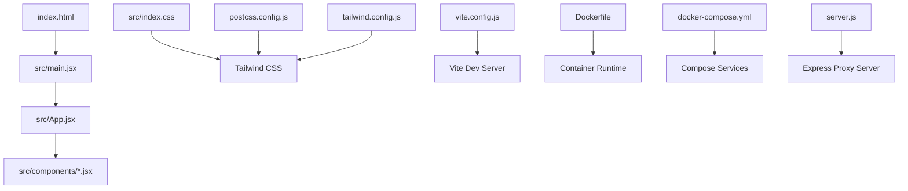
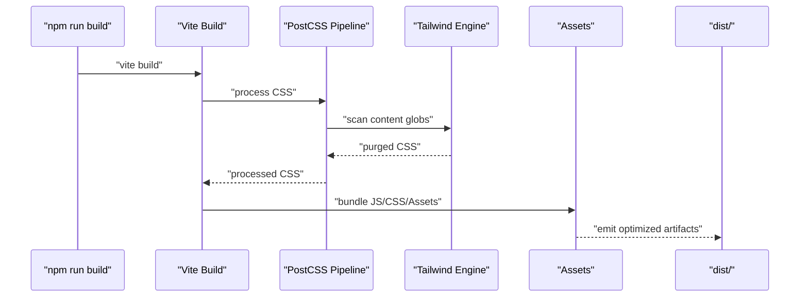
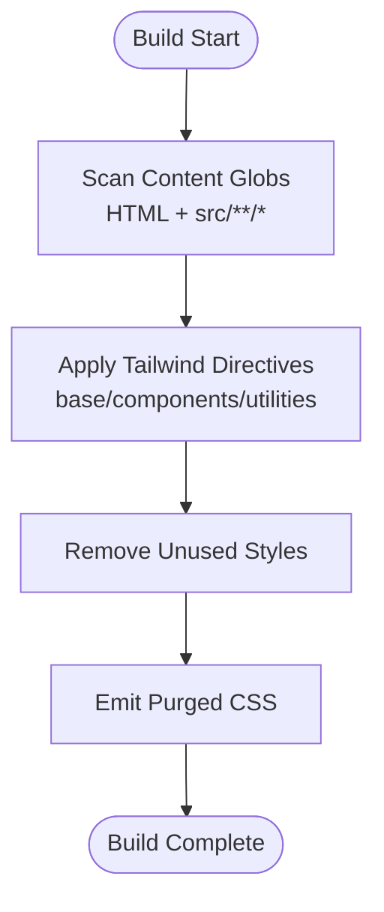
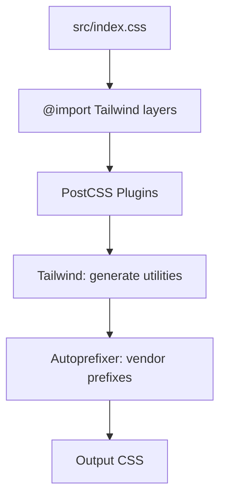
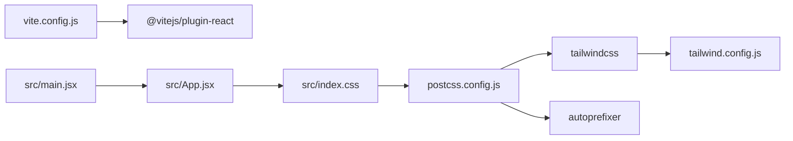

# Production Build

<cite>
**Referenced Files in This Document**
- [vite.config.js](file://vite.config.js)
- [package.json](file://package.json)
- [postcss.config.js](file://postcss.config.js)
- [tailwind.config.js](file://tailwind.config.js)
- [index.html](file://index.html)
- [src/index.css](file://src/index.css)
- [src/App.css](file://src/App.css)
- [src/main.jsx](file://src/main.jsx)
- [src/App.jsx](file://src/App.jsx)
- [Dockerfile](file://Dockerfile)
- [docker-compose.yml](file://docker-compose.yml)
- [server.js](file://server.js)
</cite>

## Table of Contents
1. [Introduction](#introduction)
2. [Project Structure](#project-structure)
3. [Core Components](#core-components)
4. [Architecture Overview](#architecture-overview)
5. [Detailed Component Analysis](#detailed-component-analysis)
6. [Dependency Analysis](#dependency-analysis)
7. [Performance Considerations](#performance-considerations)
8. [Troubleshooting Guide](#troubleshooting-guide)
9. [Conclusion](#conclusion)
10. [Appendices](#appendices)

## Introduction
This document describes the production build configuration and deployment strategy for OMNI-TODO. It focuses on the Vite production build pipeline, asset optimization, code splitting, Tailwind CSS purging, PostCSS processing, and build scripts. It also covers environment-specific build configurations, conditional compilation strategies, performance metrics collection, bundle size analysis, and build verification processes tailored to the current repository setup.

## Project Structure
The build system centers around Vite with React and Tailwind CSS. Key files include the Vite configuration, PostCSS configuration, Tailwind configuration, and the application entry points. The Docker setup runs both the Vite development server and a backend proxy server for API access during development.

**Diagram sources**
- [index.html](file://index.html)
- [src/main.jsx](file://src/main.jsx)
- [src/App.jsx](file://src/App.jsx)
- [src/index.css](file://src/index.css)
- [postcss.config.js](file://postcss.config.js)
- [tailwind.config.js](file://tailwind.config.js)
- [vite.config.js](file://vite.config.js)
- [Dockerfile](file://Dockerfile)
- [docker-compose.yml](file://docker-compose.yml)
- [server.js](file://server.js)

**Section sources**
- [vite.config.js](file://vite.config.js)
- [package.json](file://package.json)
- [postcss.config.js](file://postcss.config.js)
- [tailwind.config.js](file://tailwind.config.js)
- [index.html](file://index.html)
- [src/index.css](file://src/index.css)
- [src/main.jsx](file://src/main.jsx)
- [src/App.jsx](file://src/App.jsx)
- [Dockerfile](file://Dockerfile)
- [docker-compose.yml](file://docker-compose.yml)
- [server.js](file://server.js)

## Core Components
- Vite configuration defines the React plugin, dev server, and proxy settings. Production builds use the default Vite behavior unless extended.
- PostCSS pipeline applies Tailwind directives and autoprefixing.
- Tailwind CSS scans source files and HTML to purge unused styles.
- Application entry points import global CSS and render the React root.
- Build scripts in package.json provide dev, build, preview, and lint commands.

**Section sources**
- [vite.config.js](file://vite.config.js)
- [package.json](file://package.json)
- [postcss.config.js](file://postcss.config.js)
- [tailwind.config.js](file://tailwind.config.js)
- [index.html](file://index.html)
- [src/index.css](file://src/index.css)
- [src/main.jsx](file://src/main.jsx)
- [src/App.jsx](file://src/App.jsx)

## Architecture Overview
The production build pipeline integrates Vite’s bundler, PostCSS/Tailwind for CSS processing, and asset optimization. The Docker environment supports development and local testing, while the production runtime depends on the built assets served statically.

**Diagram sources**
- [package.json](file://package.json)
- [vite.config.js](file://vite.config.js)
- [postcss.config.js](file://postcss.config.js)
- [tailwind.config.js](file://tailwind.config.js)
- [src/index.css](file://src/index.css)

## Detailed Component Analysis

### Vite Production Build Configuration
- Plugins: React plugin is configured for JSX/JS transformations.
- Dev server: Port, host, and proxy are configured for development; production builds use default bundling.
- No explicit production-only plugins or rollup options are present in the current configuration.

Optimization and defaults:
- Vite’s default production build includes minification, code splitting, and asset hashing. These behaviors are not overridden in the current configuration.

Build scripts:
- The build script invokes Vite’s production build command.

**Section sources**
- [vite.config.js](file://vite.config.js)
- [package.json](file://package.json)

### Tailwind CSS Purging and Scanning
- Content scanning: Tailwind scans HTML and all source files under src for class usage.
- Theme and design tokens: Tailwind reads CSS variables and theme extensions from the Tailwind configuration.
- Purge behavior: Unused styles are removed during build when Tailwind processes the CSS pipeline.

**Diagram sources**
- [tailwind.config.js](file://tailwind.config.js)
- [src/index.css](file://src/index.css)

**Section sources**
- [tailwind.config.js](file://tailwind.config.js)
- [src/index.css](file://src/index.css)

### PostCSS Processing Pipeline and CSS Optimization
- PostCSS plugins: Tailwind and Autoprefixer are applied in sequence.
- CSS layers: Tailwind layers (base, components, utilities) are imported and processed.
- Design tokens: CSS variables define theme palettes and component styles.
- Optimization: Autoprefixer adds vendor prefixes; Tailwind purges unused utilities.

**Diagram sources**
- [postcss.config.js](file://postcss.config.js)
- [src/index.css](file://src/index.css)

**Section sources**
- [postcss.config.js](file://postcss.config.js)
- [src/index.css](file://src/index.css)

### Asset Optimization, Minification, Compression, and Cache Optimization
- Minification: Vite minifies JavaScript and CSS in production by default.
- Code splitting: Vite performs automatic code splitting for dynamic imports and route-based chunks.
- Asset hashing: Vite emits hashed filenames for static assets to enable long-term caching.
- Compression: No explicit compression step is configured in the repository. Consider adding gzip or brotli compression via a CDN or web server for production delivery.

Recommendations aligned with current setup:
- Integrate a CDN or web server that serves compressed assets.
- Ensure cache headers are configured for immutable assets (hashed filenames).

**Section sources**
- [package.json](file://package.json)
- [vite.config.js](file://vite.config.js)

### Bundle Analysis and Performance Metrics Collection
- Current configuration does not include a bundle analyzer plugin. To analyze bundle composition and sizes, add a plugin to the Vite configuration and run the build with analyzer reporting enabled.
- Performance metrics collection can be integrated via lightweight analytics or monitoring hooks in the application code, but no such instrumentation is present in the repository.

**Section sources**
- [vite.config.js](file://vite.config.js)

### Environment-Specific Build Configurations and Conditional Compilation
- Environment variables: The repository does not define environment-specific Vite configs or conditional compilation flags. Build behavior is controlled by the default Vite configuration.
- Containerization: The Dockerfile and docker-compose.yml define development-time service orchestration and environment variables. For production deployments, consider extending the Dockerfile to build assets and serve them via a static server.

**Section sources**
- [Dockerfile](file://Dockerfile)
- [docker-compose.yml](file://docker-compose.yml)
- [vite.config.js](file://vite.config.js)

### Build Scripts and Artifacts
- Available scripts:
  - dev: starts the Vite dev server
  - build: produces production-ready artifacts in dist/
  - preview: serves the dist/ folder locally
  - lint: runs ESLint
- The build script relies on Vite’s default production behavior.

**Section sources**
- [package.json](file://package.json)

### Build Verification Processes
- Preview: Use the preview script to validate the production build locally.
- Manual checks: Inspect the dist/ directory for emitted assets, hashed filenames, and absence of development-only code.
- Optional: Add automated tests or linters to CI to verify build correctness.

**Section sources**
- [package.json](file://package.json)

## Dependency Analysis
The build pipeline depends on Vite, PostCSS, Tailwind, and related plugins. The application entry renders the React root and imports global styles.

**Diagram sources**
- [vite.config.js](file://vite.config.js)
- [postcss.config.js](file://postcss.config.js)
- [tailwind.config.js](file://tailwind.config.js)
- [src/index.css](file://src/index.css)
- [src/main.jsx](file://src/main.jsx)
- [src/App.jsx](file://src/App.jsx)

**Section sources**
- [vite.config.js](file://vite.config.js)
- [postcss.config.js](file://postcss.config.js)
- [tailwind.config.js](file://tailwind.config.js)
- [src/index.css](file://src/index.css)
- [src/main.jsx](file://src/main.jsx)
- [src/App.jsx](file://src/App.jsx)

## Performance Considerations
- Code splitting: Rely on Vite’s default chunking strategy for route-based and dynamic imports.
- CSS purging: Keep content globs accurate to avoid shipping unused styles.
- Asset optimization: Enable CDN-level compression and appropriate cache headers for production delivery.
- Bundle analysis: Add a bundle analyzer to identify large dependencies and optimize imports.

[No sources needed since this section provides general guidance]

## Troubleshooting Guide
- Build fails due to missing dependencies: Ensure all dependencies are installed before building.
- CSS not applying: Verify Tailwind directives are present and content globs include all relevant files.
- Dev/prod differences: Confirm environment variables and server proxy settings are not affecting production behavior.
- Docker build issues: Validate the Dockerfile installs dependencies and copies application files correctly.

**Section sources**
- [package.json](file://package.json)
- [tailwind.config.js](file://tailwind.config.js)
- [postcss.config.js](file://postcss.config.js)
- [Dockerfile](file://Dockerfile)
- [docker-compose.yml](file://docker-compose.yml)

## Conclusion
OMNI-TODO’s production build leverages Vite’s default production optimizations, PostCSS/Tailwind for CSS processing and purging, and a straightforward asset pipeline. Extending the configuration with a bundle analyzer, optional compression, and environment-specific overrides would further improve observability and performance for production deployments.

[No sources needed since this section summarizes without analyzing specific files]

## Appendices
- Application entry and rendering:
  - The React root mounts the App component and imports global styles.
  - Global CSS includes Tailwind layers and theme variables.

**Section sources**
- [src/main.jsx](file://src/main.jsx)
- [src/App.jsx](file://src/App.jsx)
- [src/index.css](file://src/index.css)