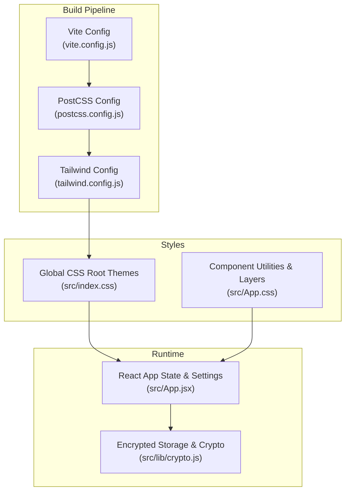
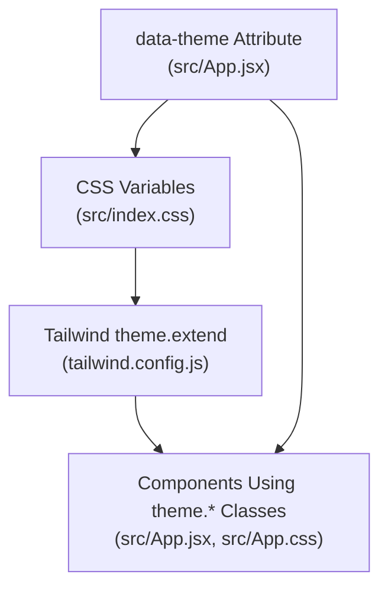
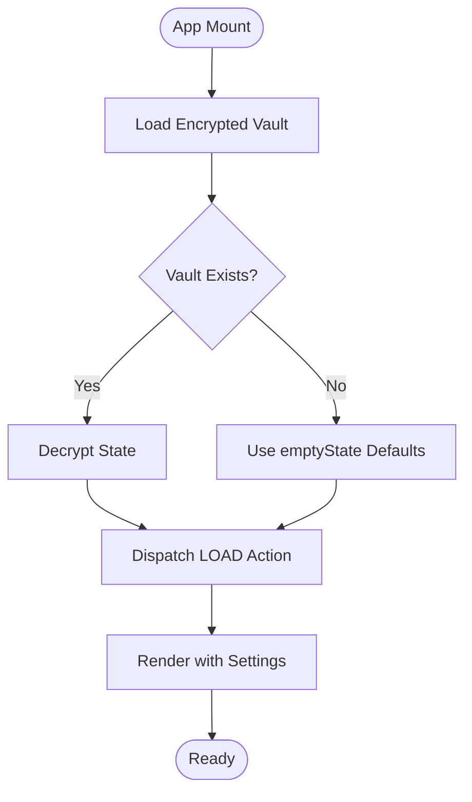
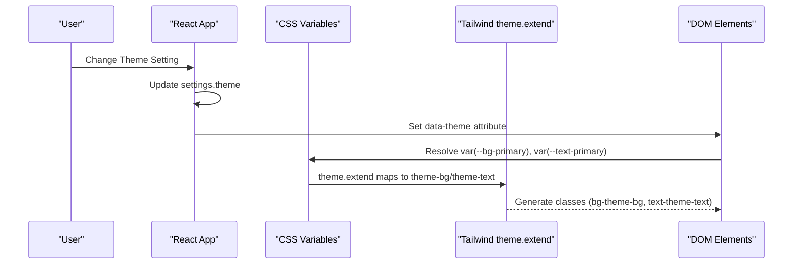
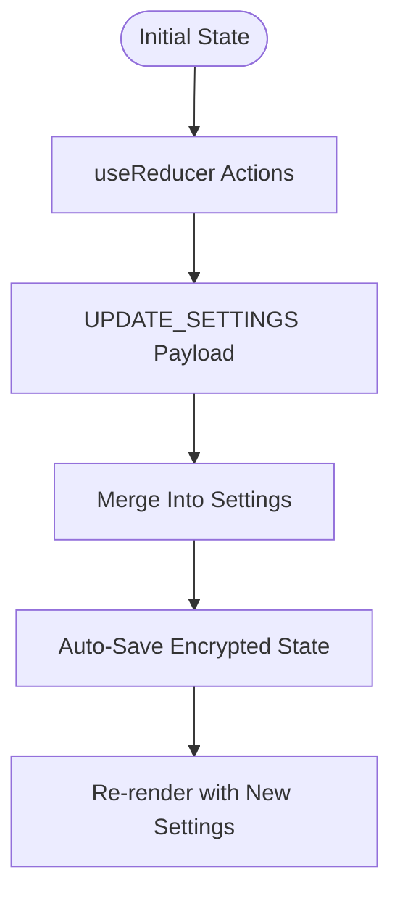
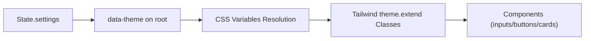
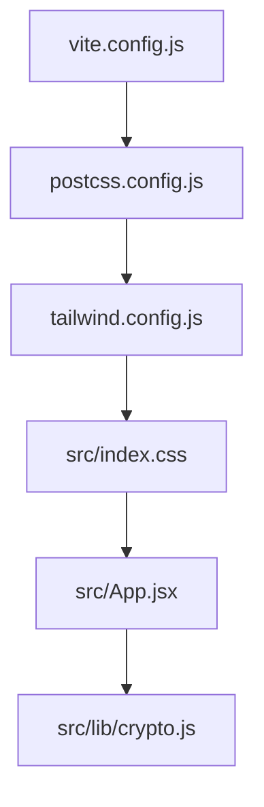

# Application Settings

<cite>
**Referenced Files in This Document**
- [tailwind.config.js](file://tailwind.config.js)
- [src/index.css](file://src/index.css)
- [src/App.jsx](file://src/App.jsx)
- [src/App.css](file://src/App.css)
- [src/lib/crypto.js](file://src/lib/crypto.js)
- [vite.config.js](file://vite.config.js)
- [postcss.config.js](file://postcss.config.js)
- [index.html](file://index.html)
- [package.json](file://package.json)
</cite>

## Table of Contents
1. [Introduction](#introduction)
2. [Project Structure](#project-structure)
3. [Core Components](#core-components)
4. [Architecture Overview](#architecture-overview)
5. [Detailed Component Analysis](#detailed-component-analysis)
6. [Dependency Analysis](#dependency-analysis)
7. [Performance Considerations](#performance-considerations)
8. [Troubleshooting Guide](#troubleshooting-guide)
9. [Conclusion](#conclusion)
10. [Appendices](#appendices)

## Introduction
This document explains OMNI-TODO’s application settings and configuration system. It focuses on:
- The emptyState configuration object and its role in defining default application behavior
- The theme system configuration using CSS custom properties and Tailwind’s theme.extend integration
- Application state configuration, feature flags, and runtime customization options
- Practical examples for modifying defaults, adding new configuration options, and validating settings
- How application settings relate to component-level customization
- Persistence mechanisms, migration strategies, and environment-specific settings

## Project Structure
The configuration system spans CSS custom properties, Tailwind configuration, and React state management. The build pipeline integrates PostCSS and Tailwind, while the frontend uses React hooks and IndexedDB/Web Workers for secure persistence.

**Diagram sources**
- [vite.config.js:1-19](file://vite.config.js#L1-L19)
- [postcss.config.js:1-7](file://postcss.config.js#L1-L7)
- [tailwind.config.js:1-27](file://tailwind.config.js#L1-L27)
- [src/index.css:1-146](file://src/index.css#L1-L146)
- [src/App.css:1-185](file://src/App.css#L1-L185)
- [src/App.jsx:265-441](file://src/App.jsx#L265-L441)
- [src/lib/crypto.js:1-112](file://src/lib/crypto.js#L1-L112)

**Section sources**
- [vite.config.js:1-19](file://vite.config.js#L1-L19)
- [postcss.config.js:1-7](file://postcss.config.js#L1-L7)
- [tailwind.config.js:1-27](file://tailwind.config.js#L1-L27)
- [src/index.css:1-146](file://src/index.css#L1-L146)
- [src/App.jsx:265-441](file://src/App.jsx#L265-L441)
- [src/App.css:1-185](file://src/App.css#L1-L185)
- [src/lib/crypto.js:1-112](file://src/lib/crypto.js#L1-L112)

## Core Components
- emptyState: Defines default application state, including lists, projects, mindmaps, gallery, and settings such as theme, color, autoLock, and lockTimeout.
- Theme system: CSS custom properties in :root and data-theme selectors, consumed by Tailwind via theme.extend and applied in components.
- Runtime state: useReducer manages application state and settings updates; settings are persisted via encrypted storage.
- Component-level customization: Components consume settings through className attributes and inline styles derived from state and CSS variables.

**Section sources**
- [src/App.jsx:265-306](file://src/App.jsx#L265-L306)
- [src/index.css:7-50](file://src/index.css#L7-L50)
- [tailwind.config.js:7-24](file://tailwind.config.js#L7-L24)
- [src/App.jsx:410-437](file://src/App.jsx#L410-L437)
- [src/App.css:5-185](file://src/App.css#L5-L185)

## Architecture Overview
The configuration architecture connects global CSS themes, Tailwind’s extension layer, and React state. The theme is selected via data-theme on the root element and propagated to Tailwind classes and CSS variables.

**Diagram sources**
- [src/index.css:7-50](file://src/index.css#L7-L50)
- [tailwind.config.js:7-24](file://tailwind.config.js#L7-L24)
- [src/App.jsx:410-412](file://src/App.jsx#L410-L412)
- [src/App.css:5-185](file://src/App.css#L5-L185)

## Detailed Component Analysis

### emptyState Configuration Object
Purpose:
- Provides baseline application state for new users and during lock/reset scenarios.
- Ensures predictable defaults for items, projects, mindmaps, gallery, and settings.

Structure highlights:
- settings: theme, color, autoLock, lockTimeout
- Lists: items, projects, mindmaps, gallery

Behavior:
- Used as initial state for the reducer
- Reset to this state when locking the app
- Updated via UPDATE_SETTINGS actions

**Diagram sources**
- [src/App.jsx:316-324](file://src/App.jsx#L316-L324)
- [src/App.jsx:342-355](file://src/App.jsx#L342-L355)
- [src/App.jsx:361-370](file://src/App.jsx#L361-L370)
- [src/App.jsx:391-395](file://src/App.jsx#L391-L395)
- [src/App.jsx:265-306](file://src/App.jsx#L265-L306)

**Section sources**
- [src/App.jsx:265-306](file://src/App.jsx#L265-L306)
- [src/App.jsx:316-324](file://src/App.jsx#L316-L324)
- [src/App.jsx:342-355](file://src/App.jsx#L342-L355)
- [src/App.jsx:361-370](file://src/App.jsx#L361-L370)
- [src/App.jsx:391-395](file://src/App.jsx#L391-L395)

### Theme System Configuration
CSS custom properties:
- :root and [data-theme="..."] blocks define --bg-primary, --bg-secondary, --text-primary, --text-secondary, --accent-color, --accent-hover, --border-color, and glass-related variables.
- Tailwind consumes these via theme.extend.colors.theme.* so components can use theme-bg, theme-text, etc.

Integration:
- src/App.jsx applies data-theme based on state.settings.theme
- Tailwind compiles classes using var(--...) mapped from theme.extend

**Diagram sources**
- [src/App.jsx:410-412](file://src/App.jsx#L410-L412)
- [src/index.css:7-50](file://src/index.css#L7-L50)
- [tailwind.config.js:12-22](file://tailwind.config.js#L12-L22)

**Section sources**
- [src/index.css:7-50](file://src/index.css#L7-L50)
- [tailwind.config.js:7-24](file://tailwind.config.js#L7-L24)
- [src/App.jsx:410-412](file://src/App.jsx#L410-L412)

### Application State, Feature Flags, and Runtime Customization
State management:
- useReducer maintains items, projects, mindmaps, gallery, and settings
- UPDATE_SETTINGS merges partial settings into current settings
- Auto-save writes encrypted state to persistent storage after changes

Feature flags and customization:
- theme: selects among predefined data-theme variants
- color: influences shader and button accents
- autoLock: toggles automatic locking behavior
- lockTimeout: controls idle timeout for auto-lock

**Diagram sources**
- [src/App.jsx:273-306](file://src/App.jsx#L273-L306)
- [src/App.jsx:326-340](file://src/App.jsx#L326-L340)
- [src/lib/crypto.js:43-60](file://src/lib/crypto.js#L43-L60)

**Section sources**
- [src/App.jsx:273-306](file://src/App.jsx#L273-L306)
- [src/App.jsx:326-340](file://src/App.jsx#L326-L340)
- [src/lib/crypto.js:43-60](file://src/lib/crypto.js#L43-L60)

### Component-Level Customization
How settings influence components:
- Root container uses data-theme and theme-* classes for background/text
- Shader background adapts color based on theme selection
- Utility classes (e.g., input-field, btn-gold) rely on CSS variables for colors and borders
- Tailwind utilities map to theme.* via theme.extend

**Diagram sources**
- [src/App.jsx:410-412](file://src/App.jsx#L410-L412)
- [src/index.css:67-118](file://src/index.css#L67-L118)
- [tailwind.config.js:12-22](file://tailwind.config.js#L12-L22)

**Section sources**
- [src/App.jsx:410-412](file://src/App.jsx#L410-L412)
- [src/index.css:67-118](file://src/index.css#L67-L118)
- [tailwind.config.js:12-22](file://tailwind.config.js#L12-L22)

## Dependency Analysis
- Build-time: Vite + PostCSS + Tailwind compile CSS and inject theme variables
- Runtime: React reads settings, updates data-theme, and persists state securely

**Diagram sources**
- [vite.config.js:1-19](file://vite.config.js#L1-L19)
- [postcss.config.js:1-7](file://postcss.config.js#L1-L7)
- [tailwind.config.js:1-27](file://tailwind.config.js#L1-L27)
- [src/index.css:1-146](file://src/index.css#L1-L146)
- [src/App.jsx:265-441](file://src/App.jsx#L265-L441)
- [src/lib/crypto.js:1-112](file://src/lib/crypto.js#L1-L112)

**Section sources**
- [vite.config.js:1-19](file://vite.config.js#L1-L19)
- [postcss.config.js:1-7](file://postcss.config.js#L1-L7)
- [tailwind.config.js:1-27](file://tailwind.config.js#L1-L27)
- [src/index.css:1-146](file://src/index.css#L1-L146)
- [src/App.jsx:265-441](file://src/App.jsx#L265-L441)
- [src/lib/crypto.js:1-112](file://src/lib/crypto.js#L1-L112)

## Performance Considerations
- CSS variable resolution is efficient; avoid excessive re-renders by batching settings updates
- Tailwind compilation occurs at build time; keep theme.extend minimal to reduce CSS size
- Auto-save triggers frequently; throttle or debounce if needed to reduce write pressure

## Troubleshooting Guide
Common issues and resolutions:
- Theme not applying: Verify data-theme attribute on the root element and ensure CSS variables are present for the selected theme
- Tailwind classes not reflecting theme: Confirm theme.extend mapping matches CSS variable names
- Settings reset unexpectedly: Check reducer logic for UPDATE_SETTINGS and ensure lock resets to emptyState
- Persistence failures: Inspect encrypted storage functions and error handling paths

**Section sources**
- [src/App.jsx:410-412](file://src/App.jsx#L410-L412)
- [tailwind.config.js:12-22](file://tailwind.config.js#L12-L22)
- [src/App.jsx:299-300](file://src/App.jsx#L299-L300)
- [src/App.jsx:391-395](file://src/App.jsx#L391-L395)
- [src/lib/crypto.js:43-60](file://src/lib/crypto.js#L43-L60)

## Conclusion
OMNI-TODO’s configuration system combines CSS custom properties, Tailwind’s theme.extend, and React state to deliver a flexible, themeable, and secure application. The emptyState ensures consistent defaults, while runtime settings enable user-driven customization. Encrypted persistence safeguards user data, and the build pipeline integrates seamlessly with Tailwind for efficient styling.

## Appendices

### A. Modifying Default Settings
- Adjust emptyState defaults for new users or feature rollouts
- Update theme variables in :root and [data-theme="..."] blocks
- Extend Tailwind theme.extend to support new semantic tokens

**Section sources**
- [src/App.jsx:265-306](file://src/App.jsx#L265-L306)
- [src/index.css:7-50](file://src/index.css#L7-L50)
- [tailwind.config.js:7-24](file://tailwind.config.js#L7-L24)

### B. Adding New Configuration Options
- Add keys to settings in emptyState
- Provide sensible defaults and validation in reducers
- Expose UI controls to update settings via UPDATE_SETTINGS
- Map new tokens to CSS variables and Tailwind classes

**Section sources**
- [src/App.jsx:299-300](file://src/App.jsx#L299-L300)
- [src/App.jsx:265-306](file://src/App.jsx#L265-L306)
- [src/index.css:7-50](file://src/index.css#L7-L50)
- [tailwind.config.js:12-22](file://tailwind.config.js#L12-L22)

### C. Configuration Validation
- Validate settings updates to prevent invalid states (e.g., unknown theme values)
- Normalize values (e.g., clamp lockTimeout)
- Surface errors to users and fallback to safe defaults

**Section sources**
- [src/App.jsx:273-306](file://src/App.jsx#L273-L306)

### D. Configuration Persistence and Migration
- Encrypted persistence: Serialize state, encrypt, and store in secure storage
- Migration strategy: On load, detect old schema versions and transform to current structure
- Backward compatibility: Preserve legacy keys during migration

**Section sources**
- [src/lib/crypto.js:20-38](file://src/lib/crypto.js#L20-L38)
- [src/lib/crypto.js:43-60](file://src/lib/crypto.js#L43-L60)

### E. Environment-Specific Settings
- Build-time: Configure Vite proxy and host/port in vite.config.js
- Runtime: Use environment variables for feature flags or external service endpoints
- Theming: Keep environment-specific overrides minimal; prefer CSS variable scoping

**Section sources**
- [vite.config.js:7-17](file://vite.config.js#L7-L17)
- [package.json:12-11](file://package.json#L12-L11)