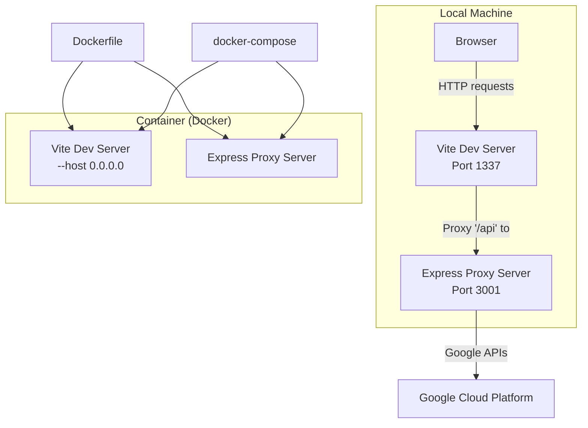
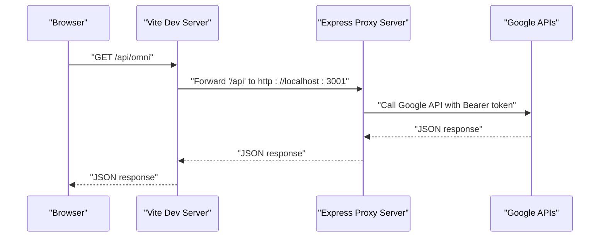
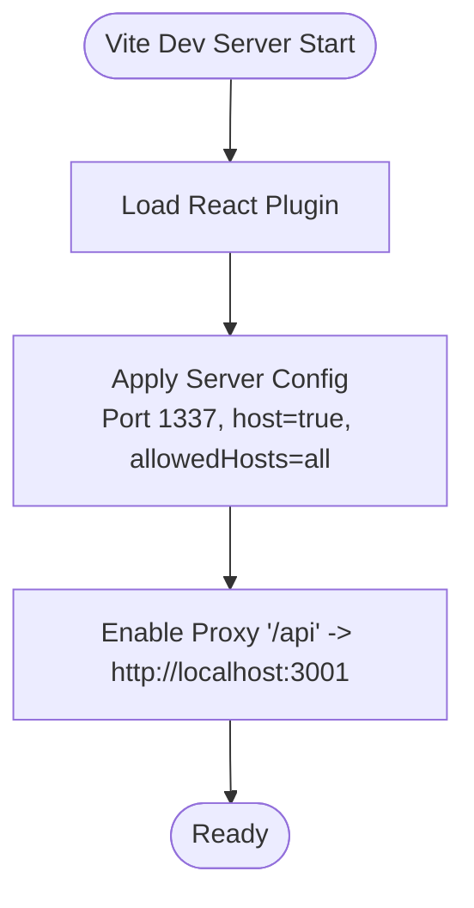
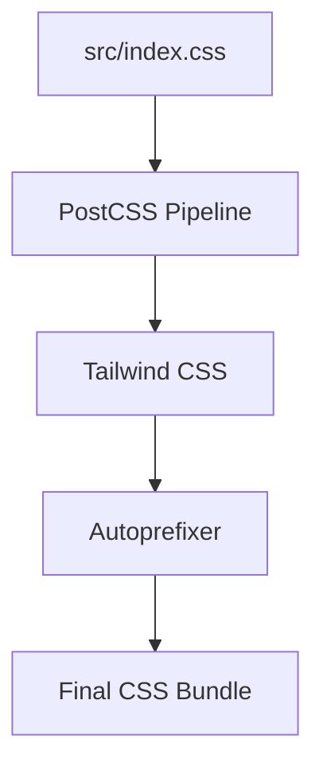
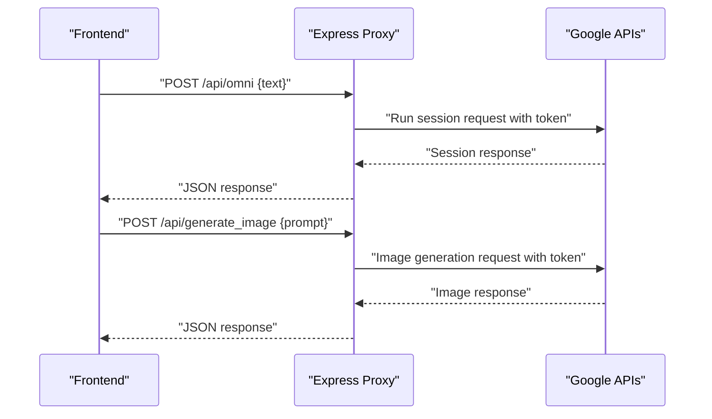
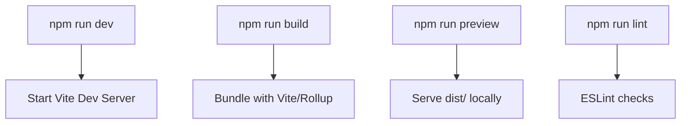
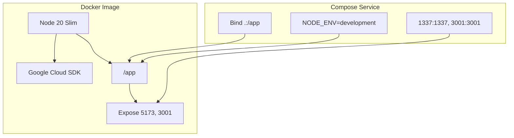
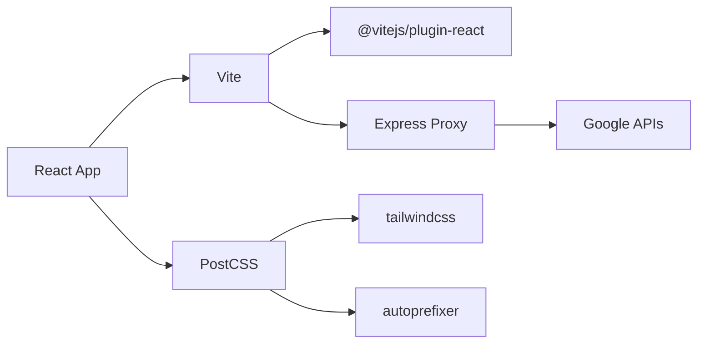

# Build and Development Configuration

<cite>
**Referenced Files in This Document**
- [vite.config.js](file://vite.config.js)
- [package.json](file://package.json)
- [postcss.config.js](file://postcss.config.js)
- [tailwind.config.js](file://tailwind.config.js)
- [server.js](file://server.js)
- [Dockerfile](file://Dockerfile)
- [docker-compose.yml](file://docker-compose.yml)
- [.dockerignore](file://.dockerignore)
- [eslint.config.js](file://eslint.config.js)
- [index.html](file://index.html)
- [src/index.css](file://src/index.css)
- [src/App.jsx](file://src/App.jsx)
</cite>

## Table of Contents
1. [Introduction](#introduction)
2. [Project Structure](#project-structure)
3. [Core Components](#core-components)
4. [Architecture Overview](#architecture-overview)
5. [Detailed Component Analysis](#detailed-component-analysis)
6. [Dependency Analysis](#dependency-analysis)
7. [Performance Considerations](#performance-considerations)
8. [Troubleshooting Guide](#troubleshooting-guide)
9. [Conclusion](#conclusion)
10. [Appendices](#appendices)

## Introduction
This document explains OMNI-TODO’s build and development configuration. It covers Vite’s development server and proxy setup, PostCSS and Tailwind CSS processing, package scripts for development, build, and preview, environment variables and Docker integration, asset handling, bundling strategies, hot reload behavior, and deployment preparation. The goal is to help developers understand how the frontend and backend services are orchestrated during development and how to prepare for production builds.

## Project Structure
The project follows a conventional React + Vite setup with a companion Express proxy server. Key configuration files are centralized at the repository root, while CSS is processed via PostCSS and Tailwind. Dockerization enables local development with both the Vite dev server and the Express proxy server running concurrently.

**Diagram sources**
- [vite.config.js:7-17](file://vite.config.js#L7-L17)
- [server.js:131-133](file://server.js#L131-L133)
- [Dockerfile:31](file://Dockerfile#L31)
- [docker-compose.yml:7-8](file://docker-compose.yml#L7-L8)

**Section sources**
- [vite.config.js:1-19](file://vite.config.js#L1-L19)
- [server.js:1-135](file://server.js#L1-L135)
- [Dockerfile:1-32](file://Dockerfile#L1-L32)
- [docker-compose.yml:1-18](file://docker-compose.yml#L1-L18)

## Core Components
- Vite configuration defines the React plugin, development server port, host binding, allowed hosts, and an API proxy to the Express server.
- PostCSS configuration enables Tailwind and Autoprefixer for CSS processing.
- Tailwind configuration scans HTML and JSX sources and defines theme tokens mapped to CSS variables.
- Package scripts provide commands for development, building, previewing, and linting.
- Docker Compose and Dockerfile orchestrate local development with both servers and expose ports for browser access.
- ESLint flat config ensures recommended rules for React Hooks, React Refresh, and browser globals.

**Section sources**
- [vite.config.js:5-18](file://vite.config.js#L5-L18)
- [postcss.config.js:1-7](file://postcss.config.js#L1-L7)
- [tailwind.config.js:1-27](file://tailwind.config.js#L1-L27)
- [package.json:6-11](file://package.json#L6-L11)
- [Dockerfile:23-31](file://Dockerfile#L23-L31)
- [docker-compose.yml:15-17](file://docker-compose.yml#L15-L17)
- [eslint.config.js:1-22](file://eslint.config.js#L1-L22)

## Architecture Overview
The development stack comprises:
- Vite dev server serving the React application on port 1337.
- Express proxy server on port 3001 handling protected Google Cloud API calls.
- A proxy route in Vite that forwards "/api" requests to the Express server.
- Docker Compose exposing ports 1337 and 3001 for external access.
- PostCSS/Tailwind processing CSS with CSS variables and layered utilities.

**Diagram sources**
- [vite.config.js:11-16](file://vite.config.js#L11-L16)
- [server.js:21-81](file://server.js#L21-L81)

## Detailed Component Analysis

### Vite Configuration
- Plugin: React plugin is enabled for JSX transformations and Fast Refresh.
- Server:
  - Port: 1337
  - Host: bound to all interfaces
  - Allowed hosts: configured broadly
  - Proxy: routes "/api" to the Express server at localhost:3001 with origin change enabled
- Hot reload: enabled by default in Vite dev mode; no explicit overrides in the config.

**Diagram sources**
- [vite.config.js:5-18](file://vite.config.js#L5-L18)

**Section sources**
- [vite.config.js:5-18](file://vite.config.js#L5-L18)

### PostCSS and Tailwind CSS
- PostCSS plugins:
  - Tailwind CSS: processes directives and generates utility classes.
  - Autoprefixer: adds vendor prefixes for supported browsers.
- Tailwind configuration:
  - Content scanning includes HTML and all JSX/TSX under src.
  - Theme extends font families and maps semantic colors to CSS variables.
  - No additional plugins are loaded.
- CSS source:
  - Uses Tailwind directives to generate base, components, and utilities layers.
  - CSS variables define theme tokens for light, dark, and cyberpunk themes.
  - Layered utilities and components define reusable UI patterns.

**Diagram sources**
- [postcss.config.js:1-7](file://postcss.config.js#L1-L7)
- [tailwind.config.js:3-26](file://tailwind.config.js#L3-L26)
- [src/index.css:3-146](file://src/index.css#L3-L146)

**Section sources**
- [postcss.config.js:1-7](file://postcss.config.js#L1-L7)
- [tailwind.config.js:1-27](file://tailwind.config.js#L1-L27)
- [src/index.css:1-146](file://src/index.css#L1-L146)

### Express Proxy Server
- CORS enabled globally.
- JSON body parsing enabled.
- Two primary routes:
  - POST "/api/omni": forwards to Google Cloud runSession endpoint with Bearer token.
  - POST "/api/generate_image": forwards to Vertex AI image generation endpoint with Bearer token.
- Error handling logs and returns structured JSON errors for both client and server failures.
- Listens on port 3001 and binds to 0.0.0.0 for container accessibility.

**Diagram sources**
- [server.js:21-81](file://server.js#L21-L81)
- [server.js:83-129](file://server.js#L83-L129)

**Section sources**
- [server.js:1-135](file://server.js#L1-L135)

### Package Scripts and Workflows
- Development: runs Vite dev server.
- Build: produces optimized static assets.
- Preview: serves built assets locally for testing.
- Lint: runs ESLint across the project.

**Diagram sources**
- [package.json:6-11](file://package.json#L6-L11)

**Section sources**
- [package.json:6-11](file://package.json#L6-L11)

### Environment Variables and Docker Integration
- Dockerfile:
  - Base image: Node 20 slim.
  - Installs curl and Python3 for Google Cloud SDK support.
  - Copies package files, installs dependencies, and copies application code.
  - Exposes ports 5173 (Vite) and 3001 (Express).
  - Runs both servers concurrently with Vite bound to 0.0.0.0 for container access.
- docker-compose.yml:
  - Builds from current directory.
  - Maps host ports 1337 and 3001 to container ports 1337 and 3001 respectively.
  - Shares project volume and excludes node_modules.
  - Sets NODE_ENV=development.
- .dockerignore:
  - Ignores node_modules, Git metadata, dist, environment files, and logs.

**Diagram sources**
- [Dockerfile:1-32](file://Dockerfile#L1-L32)
- [docker-compose.yml:3-17](file://docker-compose.yml#L3-L17)
- [.dockerignore:1-5](file://.dockerignore#L1-L5)

**Section sources**
- [Dockerfile:1-32](file://Dockerfile#L1-L32)
- [docker-compose.yml:1-18](file://docker-compose.yml#L1-L18)
- [.dockerignore:1-5](file://.dockerignore#L1-L5)

### Asset Handling and Bundling Strategies
- Vite handles JavaScript/JSX bundling and asset optimization for production builds.
- CSS is processed via PostCSS with Tailwind and Autoprefixer; Tailwind’s purge-like scanning targets HTML and JSX sources to remove unused styles.
- Assets referenced in HTML (e.g., favicon) are served from the public directory and resolved at build time.

**Section sources**
- [tailwind.config.js:3-6](file://tailwind.config.js#L3-L6)
- [src/index.css:3-5](file://src/index.css#L3-L5)
- [index.html:5](file://index.html#L5)

### Development vs Production Configuration
- Development:
  - Vite dev server with hot module replacement and proxy to Express.
  - Docker Compose exposes ports for local browser access.
- Production:
  - Build script generates optimized static assets.
  - Preview script serves the built assets locally for verification.
  - No proxy is needed; API calls would be handled by the backend service in production.

**Section sources**
- [package.json:7-10](file://package.json#L7-L10)
- [vite.config.js:7-17](file://vite.config.js#L7-L17)

## Dependency Analysis
The build system relies on a small set of focused dependencies:
- Vite and React plugin power the dev server and bundling.
- PostCSS, Tailwind, and Autoprefixer process CSS.
- Express and CORS handle API proxying.
- ESLint enforces code quality.

**Diagram sources**
- [package.json:25-37](file://package.json#L25-L37)
- [vite.config.js:6](file://vite.config.js#L6)
- [postcss.config.js:2-4](file://postcss.config.js#L2-L4)
- [server.js:10-11](file://server.js#L10-L11)

**Section sources**
- [package.json:12-38](file://package.json#L12-L38)
- [vite.config.js:6](file://vite.config.js#L6)
- [postcss.config.js:2-4](file://postcss.config.js#L2-L4)
- [server.js:10-11](file://server.js#L10-L11)

## Performance Considerations
- Use Vite’s built-in code splitting and dynamic imports for lazy-loading components.
- Keep Tailwind scanning scoped to minimize CSS bundle size.
- Prefer CSS variables for theming to avoid duplicating styles.
- Enable production builds for performance testing using the preview command.
- Avoid unnecessary re-renders in React components to reduce runtime overhead.

## Troubleshooting Guide
- Proxy not working:
  - Verify Vite proxy target matches the Express server address and port.
  - Confirm allowed hosts and host binding settings.
- CORS errors:
  - Ensure CORS middleware is enabled in the Express server.
- Google API authentication:
  - Confirm Bearer token retrieval and request body formatting.
  - Check network connectivity and API quotas.
- Docker access:
  - Ensure ports 1337 and 3001 are free on the host.
  - Confirm the container is running both servers concurrently.

**Section sources**
- [vite.config.js:11-16](file://vite.config.js#L11-L16)
- [server.js:10-11](file://server.js#L10-L11)
- [Dockerfile:31](file://Dockerfile#L31)
- [docker-compose.yml:7-8](file://docker-compose.yml#L7-L8)

## Conclusion
OMNI-TODO’s build system centers on Vite for fast development and bundling, PostCSS/Tailwind for efficient CSS processing, and an Express proxy server for secure Google Cloud API access. Dockerization streamlines local development by running both services together. Following the scripts and configurations outlined here will enable smooth development, reliable builds, and predictable deployments.

## Appendices
- Example API route usage in the frontend:
  - The application uses Tailwind utilities and theme variables defined in CSS.
  - Theming switches via data attributes applied to the root element.

**Section sources**
- [src/App.jsx:238-254](file://src/App.jsx#L238-L254)
- [src/index.css:7-50](file://src/index.css#L7-L50)