# Configuration and Customization

<cite>
**Referenced Files in This Document**
- [package.json](file://package.json)
- [vite.config.js](file://vite.config.js)
- [tailwind.config.js](file://tailwind.config.js)
- [postcss.config.js](file://postcss.config.js)
- [eslint.config.js](file://eslint.config.js)
- [src/index.css](file://src/index.css)
- [src/App.css](file://src/App.css)
- [src/main.jsx](file://src/main.jsx)
- [src/App.jsx](file://src/App.jsx)
- [server.js](file://server.js)
- [Dockerfile](file://Dockerfile)
- [docker-compose.yml](file://docker-compose.yml)
</cite>

## Table of Contents
1. [Introduction](#introduction)
2. [Project Structure](#project-structure)
3. [Core Components](#core-components)
4. [Architecture Overview](#architecture-overview)
5. [Detailed Component Analysis](#detailed-component-analysis)
6. [Dependency Analysis](#dependency-analysis)
7. [Performance Considerations](#performance-considerations)
8. [Troubleshooting Guide](#troubleshooting-guide)
9. [Conclusion](#conclusion)
10. [Appendices](#appendices)

## Introduction
This document explains how to configure and customize OMNI-TODO’s flexible architecture. It covers application settings (themes, performance, feature flags), Tailwind CSS customization, Vite build and dev server configuration, ESLint rules, environment variables and runtime options, component theming, animations, and configuration validation/migration strategies. The goal is to enable safe, repeatable customization while preserving the app’s security-first design and responsive UI.

## Project Structure
OMNI-TODO is a React application with a dedicated backend proxy service. Build-time configuration is handled via Vite, PostCSS, and Tailwind CSS. Code quality is enforced by ESLint. Runtime customization is exposed through CSS custom properties, component props, and environment-driven behavior.

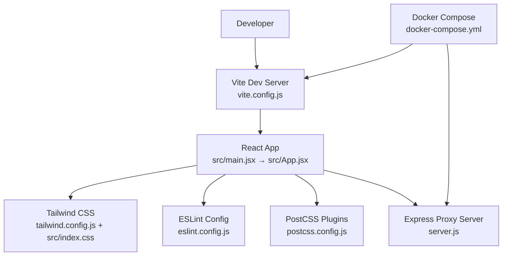

**Diagram sources**
- [vite.config.js:1-19](file://vite.config.js#L1-L19)
- [src/main.jsx:1-11](file://src/main.jsx#L1-L11)
- [src/App.jsx:204-255](file://src/App.jsx#L204-L255)
- [tailwind.config.js:1-27](file://tailwind.config.js#L1-L27)
- [src/index.css:1-146](file://src/index.css#L1-L146)
- [eslint.config.js:1-22](file://eslint.config.js#L1-L22)
- [postcss.config.js:1-7](file://postcss.config.js#L1-L7)
- [server.js:1-135](file://server.js#L1-L135)
- [docker-compose.yml:1-18](file://docker-compose.yml#L1-L18)

**Section sources**
- [package.json:1-40](file://package.json#L1-L40)
- [vite.config.js:1-19](file://vite.config.js#L1-L19)
- [tailwind.config.js:1-27](file://tailwind.config.js#L1-L27)
- [postcss.config.js:1-7](file://postcss.config.js#L1-L7)
- [eslint.config.js:1-22](file://eslint.config.js#L1-L22)
- [src/index.css:1-146](file://src/index.css#L1-L146)
- [src/App.css:1-185](file://src/App.css#L1-L185)
- [src/main.jsx:1-11](file://src/main.jsx#L1-L11)
- [src/App.jsx:204-255](file://src/App.jsx#L204-L255)
- [server.js:1-135](file://server.js#L1-L135)
- [Dockerfile:1-32](file://Dockerfile#L1-L32)
- [docker-compose.yml:1-18](file://docker-compose.yml#L1-L18)

## Core Components
- Vite configuration controls the dev server, port, host binding, and API proxy to the backend.
- Tailwind CSS integrates with PostCSS and exposes theme tokens via CSS variables for runtime switching.
- ESLint enforces recommended rules for React and React Refresh.
- Express server acts as a proxy to external AI services and handles local file-based vault operations.
- Docker Compose runs both the frontend dev server and backend proxy together.

**Section sources**
- [vite.config.js:1-19](file://vite.config.js#L1-L19)
- [tailwind.config.js:1-27](file://tailwind.config.js#L1-L27)
- [postcss.config.js:1-7](file://postcss.config.js#L1-L7)
- [eslint.config.js:1-22](file://eslint.config.js#L1-L22)
- [server.js:1-135](file://server.js#L1-L135)
- [Dockerfile:1-32](file://Dockerfile#L1-L32)
- [docker-compose.yml:1-18](file://docker-compose.yml#L1-L18)

## Architecture Overview
The runtime architecture centers on a theme system driven by CSS variables and Tailwind’s theme extension. Components consume theme tokens through Tailwind utilities and custom layer classes. The app supports multiple built-in themes and dynamic switching via a data attribute. Animation and motion are integrated via Framer Motion for transitions.

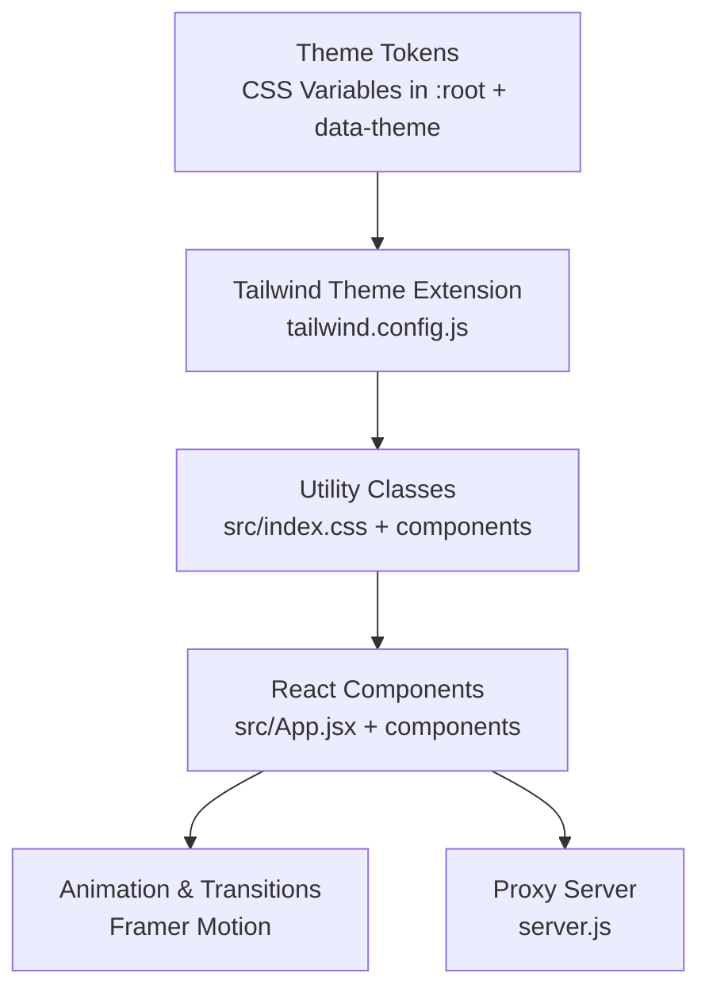

**Diagram sources**
- [src/index.css:7-50](file://src/index.css#L7-L50)
- [tailwind.config.js:7-24](file://tailwind.config.js#L7-L24)
- [src/index.css:67-118](file://src/index.css#L67-L118)
- [src/App.jsx:204-255](file://src/App.jsx#L204-L255)

## Detailed Component Analysis

### Theme Configuration and Component Theming
- Built-in themes are defined using CSS custom properties under :root and theme-specific selectors. Tailwind consumes these via a dedicated theme namespace to map semantic tokens to utilities.
- Components apply theme-aware classes (e.g., bg-theme-bg, text-theme-text, border-theme-border) and dynamic attributes (e.g., data-theme) to switch themes at runtime.
- The app demonstrates theme switching in the top-level App wrapper and uses theme-dependent visuals in ShaderBG and other components.

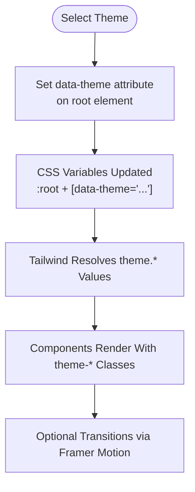

**Diagram sources**
- [src/index.css:7-50](file://src/index.css#L7-L50)
- [tailwind.config.js:7-24](file://tailwind.config.js#L7-L24)
- [src/App.jsx:204-255](file://src/App.jsx#L204-L255)

**Section sources**
- [src/index.css:1-146](file://src/index.css#L1-L146)
- [tailwind.config.js:1-27](file://tailwind.config.js#L1-L27)
- [src/App.jsx:204-255](file://src/App.jsx#L204-L255)

### Tailwind CSS Customization System
- Content scanning includes HTML and all TypeScript/JSX sources to purge unused styles.
- Font family is extended to a modern sans stack.
- A custom theme namespace maps semantic tokens to CSS variables for consistent theming across components.
- Additional custom utilities and components are defined in Tailwind layers for glassmorphism effects, navigation items, buttons, and scrollbars.

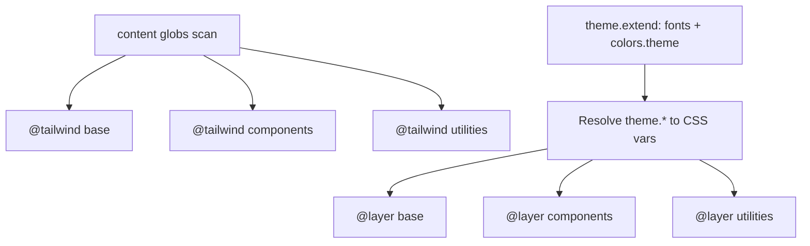

**Diagram sources**
- [tailwind.config.js:3-6](file://tailwind.config.js#L3-L6)
- [tailwind.config.js:7-24](file://tailwind.config.js#L7-L24)
- [src/index.css:3-5](file://src/index.css#L3-L5)
- [src/index.css:67-118](file://src/index.css#L67-L118)

**Section sources**
- [tailwind.config.js:1-27](file://tailwind.config.js#L1-L27)
- [src/index.css:1-146](file://src/index.css#L1-L146)

### Vite Configuration for Development and Production
- Plugin stack includes React Fast Refresh for rapid feedback during development.
- Dev server binds to host and exposes a proxy route for API traffic to the backend service.
- Port and host settings are centralized for predictable local development.

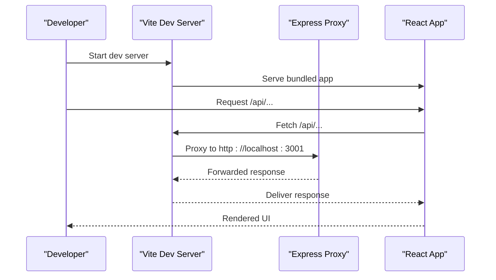

**Diagram sources**
- [vite.config.js:5-18](file://vite.config.js#L5-L18)
- [server.js:21-81](file://server.js#L21-L81)

**Section sources**
- [vite.config.js:1-19](file://vite.config.js#L1-L19)
- [package.json:6-11](file://package.json#L6-L11)

### ESLint Configuration for Code Quality
- Extends recommended rules for JS and JSX, plus React Hooks and React Refresh presets.
- Global browser environment is enabled for DOM APIs.
- Ignores the dist folder to avoid linting generated artifacts.

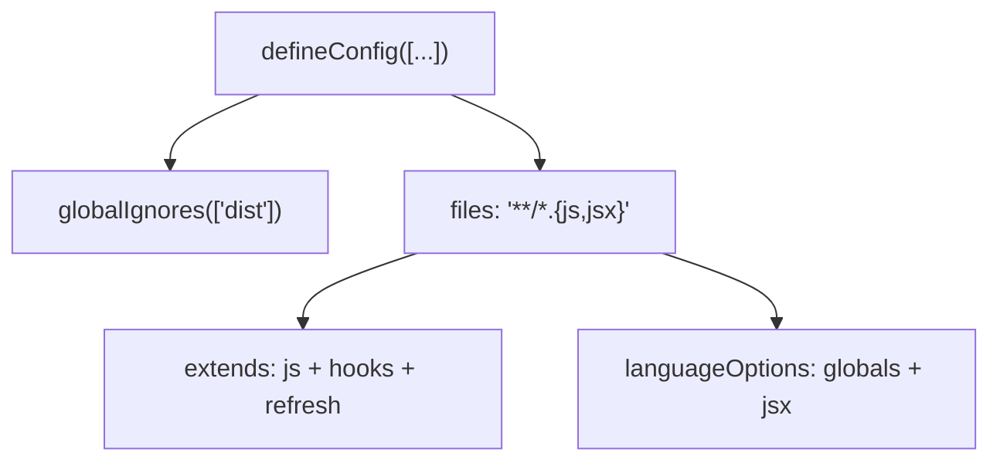

**Diagram sources**
- [eslint.config.js:7-21](file://eslint.config.js#L7-L21)

**Section sources**
- [eslint.config.js:1-22](file://eslint.config.js#L1-L22)

### Environment Variables, Feature Flags, and Runtime Customization
- Environment variables are surfaced via Docker Compose and the container runtime. The project includes dotenv for local environments.
- Feature flags and runtime options are embedded in component state and settings:
  - Theme selection and color preferences
  - Auto-lock behavior and timeout
  - API authentication method (ADC vs API key)
- The proxy server reads local instruction files and forwards requests to external AI services, controlled by environment and runtime conditions.

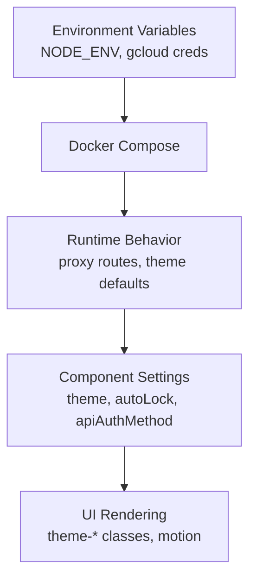

**Diagram sources**
- [docker-compose.yml:15-16](file://docker-compose.yml#L15-L16)
- [src/App.jsx:265-300](file://src/App.jsx#L265-L300)
- [src/components/VaultDashboard.jsx:1242-1296](file://src/components/VaultDashboard.jsx#L1242-L1296)
- [server.js:19-35](file://server.js#L19-L35)

**Section sources**
- [docker-compose.yml:1-18](file://docker-compose.yml#L1-18)
- [Dockerfile:1-32](file://Dockerfile#L1-L32)
- [package.json:14-16](file://package.json#L14-L16)
- [src/App.jsx:265-300](file://src/App.jsx#L265-L300)
- [src/components/VaultDashboard.jsx:1242-1296](file://src/components/VaultDashboard.jsx#L1242-L1296)
- [server.js:19-35](file://server.js#L19-L35)

### Animation Frameworks and Visual Customization
- Framer Motion powers page transitions and presence animations for smooth UX.
- CSS keyframe animations and Tailwind utilities provide subtle enhancements (e.g., floating elements).
- Glassmorphism effects are standardized via reusable component utilities.

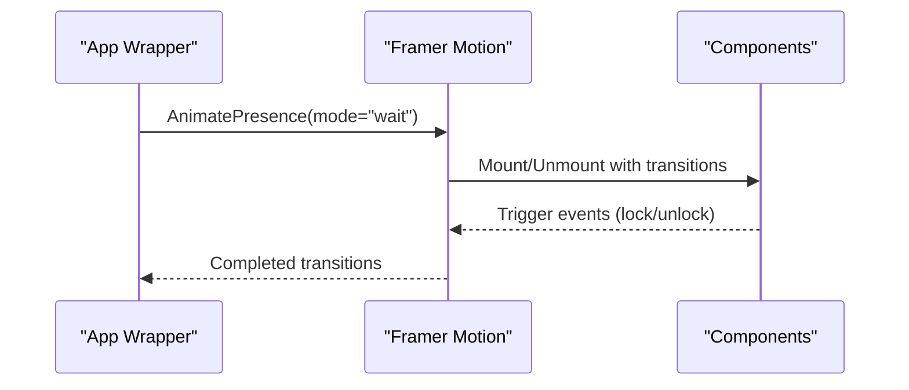

**Diagram sources**
- [src/App.jsx:4-5](file://src/App.jsx#L4-L5)
- [src/App.jsx:240-252](file://src/App.jsx#L240-L252)
- [src/index.css:136-146](file://src/index.css#L136-L146)

**Section sources**
- [src/App.jsx:4-5](file://src/App.jsx#L4-L5)
- [src/App.jsx:240-252](file://src/App.jsx#L240-L252)
- [src/index.css:136-146](file://src/index.css#L136-L146)

### Responsive Design Breakpoints and Utility Extensions
- Tailwind’s default breakpoints apply across components and pages.
- Additional responsive utilities and component variants are defined in CSS layers to adapt layouts for mobile and tablet screens.

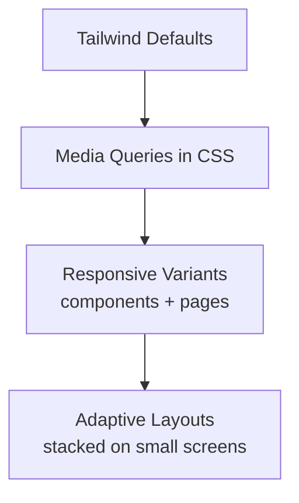

**Diagram sources**
- [src/App.css:67-96](file://src/App.css#L67-L96)
- [src/App.css:139-153](file://src/App.css#L139-L153)

**Section sources**
- [src/App.css:1-185](file://src/App.css#L1-L185)

### Configuration Validation, Defaults, and Migration Strategies
- Defaults are defined in component state and reducers to ensure a consistent baseline experience.
- Validation occurs at runtime when interacting with the proxy server and IndexedDB-backed vault:
  - Missing or invalid request bodies produce explicit errors.
  - Decryption failures and integrity checks surface meaningful messages.
- Migration strategies:
  - Introduce new settings keys alongside existing ones and merge defaults.
  - Keep backward compatibility by checking for optional fields and falling back to legacy values.
  - Version IndexedDB stores when introducing breaking schema changes.

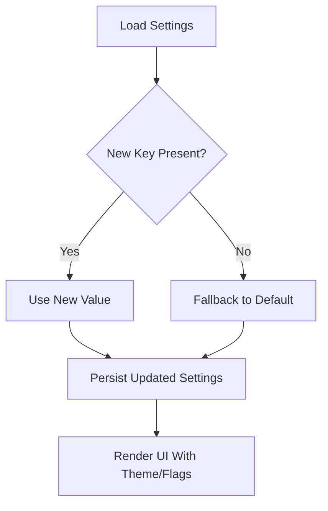

**Diagram sources**
- [src/App.jsx:265-300](file://src/App.jsx#L265-L300)

**Section sources**
- [src/App.jsx:265-300](file://src/App.jsx#L265-L300)

## Dependency Analysis
- Build-time: Vite orchestrates bundling; PostCSS/Tailwind process CSS; ESLint validates JS/JSX.
- Runtime: Express proxy depends on Google Auth library and environment credentials; React app depends on Tailwind utilities and motion libraries.

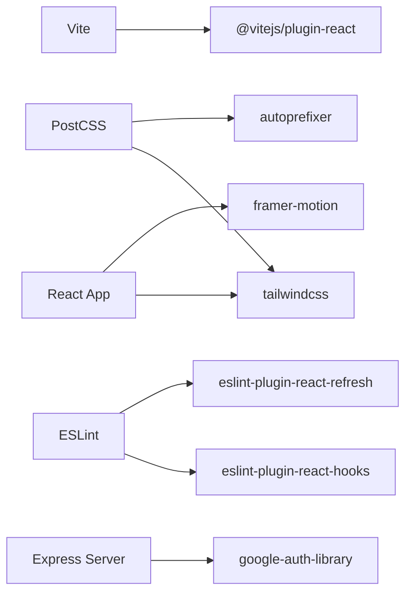

**Diagram sources**
- [package.json:25-38](file://package.json#L25-L38)
- [postcss.config.js:1-7](file://postcss.config.js#L1-L7)
- [eslint.config.js:1-22](file://eslint.config.js#L1-L22)
- [server.js:3-3](file://server.js#L3-L3)
- [src/App.jsx:204-255](file://src/App.jsx#L204-L255)

**Section sources**
- [package.json:12-38](file://package.json#L12-L38)
- [server.js:1-135](file://server.js#L1-L135)
- [src/App.jsx:204-255](file://src/App.jsx#L204-L255)

## Performance Considerations
- Prefer CSS custom properties for theme tokens to minimize reflows and enable efficient runtime switching.
- Use Tailwind’s layer system to scope heavy utilities and reduce bundle bloat.
- Keep proxy endpoints minimal and cacheable where appropriate; avoid unnecessary network round trips.
- Enable production builds with minification and tree-shaking via Vite for optimal performance.

## Troubleshooting Guide
- Proxy server errors:
  - Verify backend endpoint URLs and authentication tokens.
  - Confirm local instruction file path availability and read permissions.
- Theme rendering issues:
  - Ensure data-theme attribute is applied to the root element.
  - Confirm Tailwind scans the correct paths and rebuilds after changes.
- Lint errors:
  - Review ESLint configuration and fix recommended rule violations.
- Docker/container issues:
  - Confirm exposed ports and volume mounts.
  - Ensure environment variables are passed correctly and credentials are configured.

**Section sources**
- [server.js:19-35](file://server.js#L19-L35)
- [src/index.css:7-50](file://src/index.css#L7-L50)
- [tailwind.config.js:3-6](file://tailwind.config.js#L3-L6)
- [eslint.config.js:7-21](file://eslint.config.js#L7-L21)
- [docker-compose.yml:6-8](file://docker-compose.yml#L6-L8)
- [Dockerfile:23-31](file://Dockerfile#L23-L31)

## Conclusion
OMNI-TODO’s configuration model combines a robust theme system, modular build pipeline, and runtime customization points. By leveraging CSS variables, Tailwind layers, and component state, teams can safely introduce new themes, features, and integrations while maintaining code quality and performance. Use the provided defaults and migration strategies to evolve the configuration over time without disrupting existing functionality.

## Appendices
- Quick reference for key configuration locations:
  - Vite: [vite.config.js:1-19](file://vite.config.js#L1-L19)
  - Tailwind: [tailwind.config.js:1-27](file://tailwind.config.js#L1-L27), [postcss.config.js:1-7](file://postcss.config.js#L1-L7), [src/index.css:1-146](file://src/index.css#L1-L146)
  - ESLint: [eslint.config.js:1-22](file://eslint.config.js#L1-L22)
  - Proxy server: [server.js:1-135](file://server.js#L1-L135)
  - Docker: [Dockerfile:1-32](file://Dockerfile#L1-L32), [docker-compose.yml:1-18](file://docker-compose.yml#L1-L18)
  - App entry and theming: [src/main.jsx:1-11](file://src/main.jsx#L1-L11), [src/App.jsx:204-255](file://src/App.jsx#L204-L255)