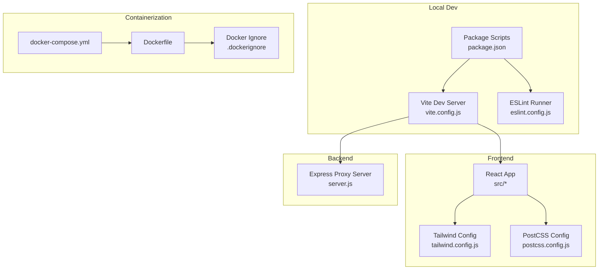
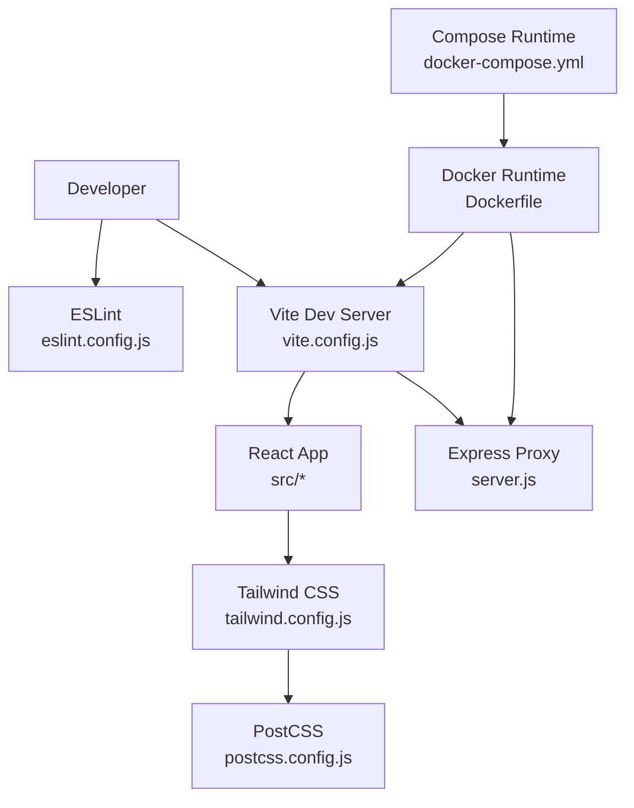
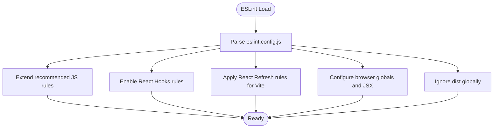
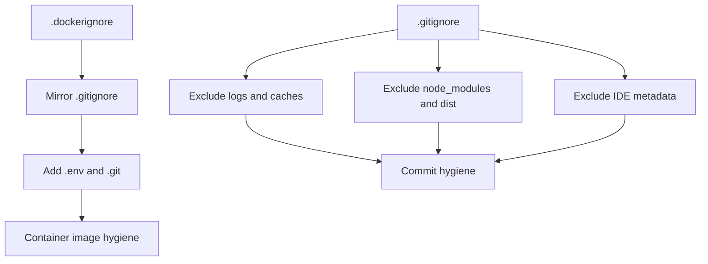
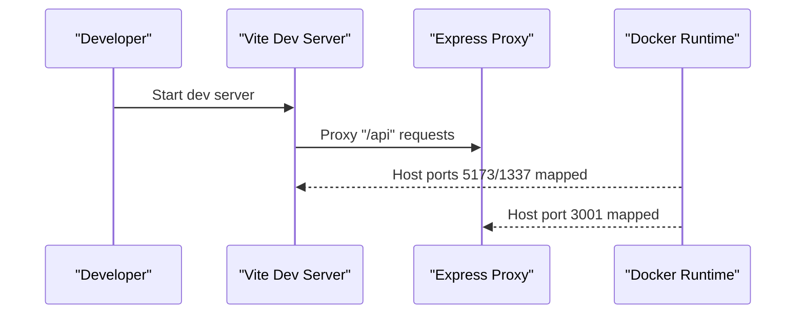
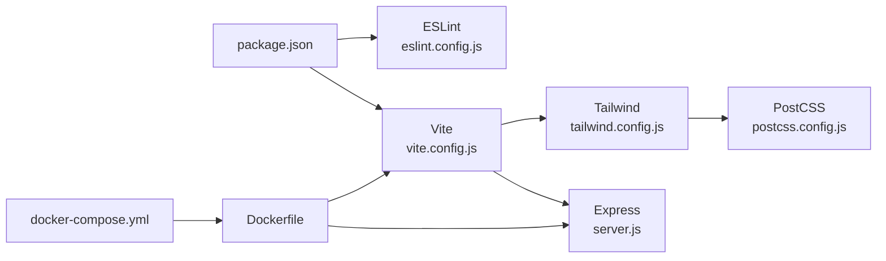

# Development Tools and Quality Assurance

<cite>
**Referenced Files in This Document**
- [eslint.config.js](file://eslint.config.js)
- [.gitignore](file://.gitignore)
- [.dockerignore](file://.dockerignore)
- [package.json](file://package.json)
- [vite.config.js](file://vite.config.js)
- [postcss.config.js](file://postcss.config.js)
- [tailwind.config.js](file://tailwind.config.js)
- [Dockerfile](file://Dockerfile)
- [docker-compose.yml](file://docker-compose.yml)
- [server.js](file://server.js)
- [README.md](file://README.md)
</cite>

## Table of Contents
1. [Introduction](#introduction)
2. [Project Structure](#project-structure)
3. [Core Components](#core-components)
4. [Architecture Overview](#architecture-overview)
5. [Detailed Component Analysis](#detailed-component-analysis)
6. [Dependency Analysis](#dependency-analysis)
7. [Performance Considerations](#performance-considerations)
8. [Troubleshooting Guide](#troubleshooting-guide)
9. [Conclusion](#conclusion)
10. [Appendices](#appendices)

## Introduction
This document describes OMNI-TODO’s development tools and quality assurance configuration. It covers ESLint setup, code formatting and linting rules, version control and containerization exclusions via .gitignore and .dockerignore, code quality guidelines, development environment setup, debugging aids, IDE configurations, code review processes, style consistency enforcement, and continuous integration considerations. Guidance is grounded in the repository’s actual configuration files.

## Project Structure
The project is a React application using Vite for development and build, Tailwind CSS for styling, and an Express proxy server for external API integration. Containerization is supported via Docker and docker-compose.

**Diagram sources**
- [vite.config.js](file://vite.config.js)
- [eslint.config.js](file://eslint.config.js)
- [package.json](file://package.json)
- [tailwind.config.js](file://tailwind.config.js)
- [postcss.config.js](file://postcss.config.js)
- [server.js](file://server.js)
- [Dockerfile](file://Dockerfile)
- [docker-compose.yml](file://docker-compose.yml)
- [.dockerignore](file://.dockerignore)

**Section sources**
- [README.md](file://README.md)
- [package.json](file://package.json)
- [vite.config.js](file://vite.config.js)
- [tailwind.config.js](file://tailwind.config.js)
- [postcss.config.js](file://postcss.config.js)
- [server.js](file://server.js)
- [Dockerfile](file://Dockerfile)
- [docker-compose.yml](file://docker-compose.yml)
- [.dockerignore](file://.dockerignore)

## Core Components
- ESLint configuration defines recommended JavaScript rules, React Hooks plugin, React Refresh plugin tailored for Vite, browser globals, and JSX support. It also ignores the dist folder globally.
- Version control exclusions exclude logs, package manager cache files, IDE metadata, and distribution artifacts.
- Containerization exclusions mirror local dev ignores plus .env and .git to avoid bundling unnecessary files.
- Package scripts provide dev, build, lint, and preview commands.
- Vite dev server runs on port 1337 with host binding and proxies /api to the Express server on localhost:3001.
- Tailwind CSS scans HTML and JS/JSX sources under src and supports a theming system using CSS variables.
- PostCSS enables Tailwind and Autoprefixer.
- Dockerfile installs Node, Python, curl, and Google Cloud SDK, exposes ports 5173 and 3001, and starts both the Express server and Vite dev server.
- docker-compose builds the image, maps ports 1337 and 3001, mounts the project directory, and optionally shares gcloud credentials.

**Section sources**
- [eslint.config.js](file://eslint.config.js)
- [.gitignore](file://.gitignore)
- [.dockerignore](file://.dockerignore)
- [package.json](file://package.json)
- [vite.config.js](file://vite.config.js)
- [tailwind.config.js](file://tailwind.config.js)
- [postcss.config.js](file://postcss.config.js)
- [Dockerfile](file://Dockerfile)
- [docker-compose.yml](file://docker-compose.yml)

## Architecture Overview
The development stack integrates Vite for fast frontend iteration, ESLint for code quality, Tailwind for styling, and an Express proxy server for third-party integrations. Containerization is provided by Docker and docker-compose for consistent local environments.

**Diagram sources**
- [eslint.config.js](file://eslint.config.js)
- [vite.config.js](file://vite.config.js)
- [tailwind.config.js](file://tailwind.config.js)
- [postcss.config.js](file://postcss.config.js)
- [server.js](file://server.js)
- [Dockerfile](file://Dockerfile)
- [docker-compose.yml](file://docker-compose.yml)

## Detailed Component Analysis

### ESLint Configuration
- Rule Sets and Extensions
  - Extends recommended JavaScript rules.
  - Enables React Hooks linting.
  - Applies React Refresh rules optimized for Vite.
- Language Options
  - Browser globals enabled.
  - JSX parsing enabled.
- Global Ignores
  - The dist directory is globally ignored.

**Diagram sources**
- [eslint.config.js](file://eslint.config.js)

**Section sources**
- [eslint.config.js](file://eslint.config.js)

### Version Control and Containerization Exclusions
- .gitignore
  - Excludes logs, package manager debug logs, node_modules, dist, dist-ssr, and *.local.
  - Excludes editor-specific directories and files (.vscode, .idea, .DS_Store, Visual Studio files).
- .dockerignore
  - Mirrors .gitignore with node_modules, .git, dist, .env, and *.log.

**Diagram sources**
- [.gitignore](file://.gitignore)
- [.dockerignore](file://.dockerignore)

**Section sources**
- [.gitignore](file://.gitignore)
- [.dockerignore](file://.dockerignore)

### Code Quality Guidelines
- Linting
  - Run the lint script to enforce configured rules across the project.
- Formatting Standards
  - Tailwind CSS and PostCSS are configured; ensure consistent class usage and CSS variable-based theming.
- Style Consistency
  - Tailwind content globs scan index.html and src/**/*.{js,ts,jsx,tsx}, ensuring unused CSS is purged and styles remain scoped to components.
- Code Review Processes
  - Enforce PR checks that run lint and build steps prior to merging.
  - Maintain a shared .gitignore and .dockerignore across contributors to prevent accidental commits of generated or sensitive files.

**Section sources**
- [package.json](file://package.json)
- [tailwind.config.js](file://tailwind.config.js)
- [postcss.config.js](file://postcss.config.js)
- [.gitignore](file://.gitignore)
- [.dockerignore](file://.dockerignore)

### Pre-commit Hooks and Automated Testing Integration
- Pre-commit Hooks
  - Configure a pre-commit hook to run the lint script before allowing commits. This prevents problematic code from entering the repository.
- Automated Testing Integration
  - Add a test script in package.json and integrate it into CI pipelines to run unit and integration tests.
  - Example pattern: include a test command in scripts and ensure CI jobs invoke it during pull requests and pushes.

Note: No existing pre-commit or test scripts are present in the repository; adding them is recommended for quality assurance.

**Section sources**
- [package.json](file://package.json)

### Development Environment Setup
- Local Development
  - Use Vite dev server on port 1337 with host binding and proxy to the Express server on port 3001.
  - Install dependencies and run the dev script to start the frontend and backend together.
- Containerized Development
  - Build and run with docker-compose to align local and CI environments.
  - Optionally mount gcloud credentials for authentication in the container.

**Diagram sources**
- [vite.config.js](file://vite.config.js)
- [server.js](file://server.js)
- [Dockerfile](file://Dockerfile)
- [docker-compose.yml](file://docker-compose.yml)

**Section sources**
- [vite.config.js](file://vite.config.js)
- [server.js](file://server.js)
- [Dockerfile](file://Dockerfile)
- [docker-compose.yml](file://docker-compose.yml)
- [package.json](file://package.json)

### Debugging Tools and IDE Configurations
- IDE Recommendations
  - Use VS Code extensions.json for shared extension preferences.
  - Keep editor directories excluded via .gitignore to avoid committing IDE metadata.
- Debugging
  - Vite dev server runs on port 1337; attach browser debugger to inspect React components.
  - Express server logs errors and responses; use console output to troubleshoot API calls.

**Section sources**
- [.gitignore](file://.gitignore)
- [vite.config.js](file://vite.config.js)
- [server.js](file://server.js)

### Continuous Integration Considerations
- CI Pipeline Suggestion
  - Install dependencies, run lint, build, and optional tests.
  - Use docker-compose to validate container startup and port exposure.
- Secrets Management
  - Exclude .env and .git from version control and container images.
  - Provide secrets via CI environment variables or secret managers.

**Section sources**
- [package.json](file://package.json)
- [.dockerignore](file://.dockerignore)
- [.gitignore](file://.gitignore)
- [docker-compose.yml](file://docker-compose.yml)

## Dependency Analysis
The project’s development toolchain is modular and explicit, with clear separation between frontend tooling (Vite, ESLint, Tailwind, PostCSS) and backend tooling (Express, Google Auth library). Docker encapsulates runtime dependencies and exposes ports for both frontend and backend.

**Diagram sources**
- [package.json](file://package.json)
- [eslint.config.js](file://eslint.config.js)
- [vite.config.js](file://vite.config.js)
- [tailwind.config.js](file://tailwind.config.js)
- [postcss.config.js](file://postcss.config.js)
- [server.js](file://server.js)
- [Dockerfile](file://Dockerfile)
- [docker-compose.yml](file://docker-compose.yml)

**Section sources**
- [package.json](file://package.json)
- [eslint.config.js](file://eslint.config.js)
- [vite.config.js](file://vite.config.js)
- [tailwind.config.js](file://tailwind.config.js)
- [postcss.config.js](file://postcss.config.js)
- [server.js](file://server.js)
- [Dockerfile](file://Dockerfile)
- [docker-compose.yml](file://docker-compose.yml)

## Performance Considerations
- Vite dev server is configured to bind to all hosts and proxy API traffic, enabling efficient local development.
- Tailwind scanning targets HTML and JS/JSX sources under src, minimizing CSS bundle size.
- Docker image installs only necessary packages for Node and Google Cloud SDK, keeping the footprint lean.

[No sources needed since this section provides general guidance]

## Troubleshooting Guide
- Lint Failures
  - Run the lint script to identify and fix rule violations flagged by ESLint.
- Port Conflicts
  - Ensure ports 1337 (Vite) and 3001 (Express) are free; adjust vite.config.js if needed.
- Proxy Issues
  - Verify the /api proxy target matches the Express server address and port.
- Docker Build/Run Errors
  - Confirm dependencies are installed and ports are exposed as defined in Dockerfile and docker-compose.yml.
- Google Auth Errors
  - Ensure proper authentication setup and that the Express server can obtain access tokens for external APIs.

**Section sources**
- [package.json](file://package.json)
- [vite.config.js](file://vite.config.js)
- [server.js](file://server.js)
- [Dockerfile](file://Dockerfile)
- [docker-compose.yml](file://docker-compose.yml)

## Conclusion
OMNI-TODO’s development and QA setup leverages modern tooling: Vite for rapid development, ESLint for code quality, Tailwind and PostCSS for styling, and Docker for reproducible environments. By adhering to the configured exclusions, integrating pre-commit hooks and automated tests, and following the outlined troubleshooting steps, teams can maintain a consistent, reliable development workflow.

[No sources needed since this section summarizes without analyzing specific files]

## Appendices
- Additional Notes
  - The README highlights official React plugins and suggests TypeScript for production-grade linting.
  - Consider adopting TypeScript and ts-eslint for stricter type-aware linting in future iterations.

**Section sources**
- [README.md](file://README.md)