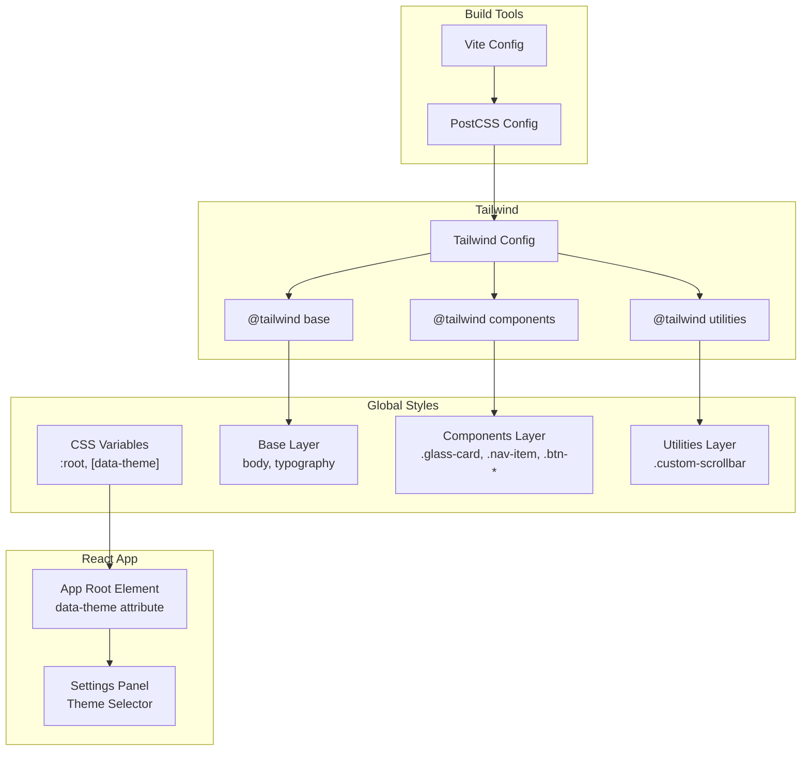
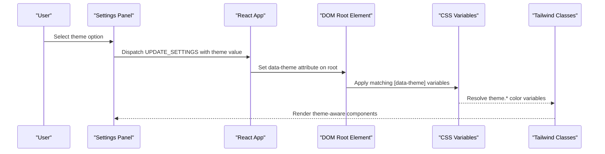
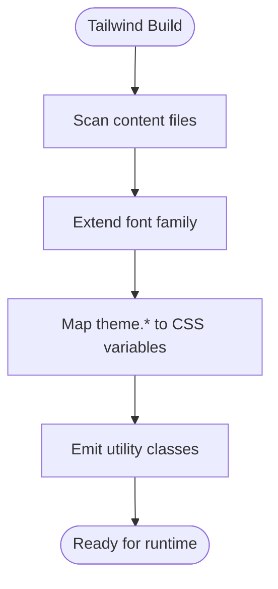
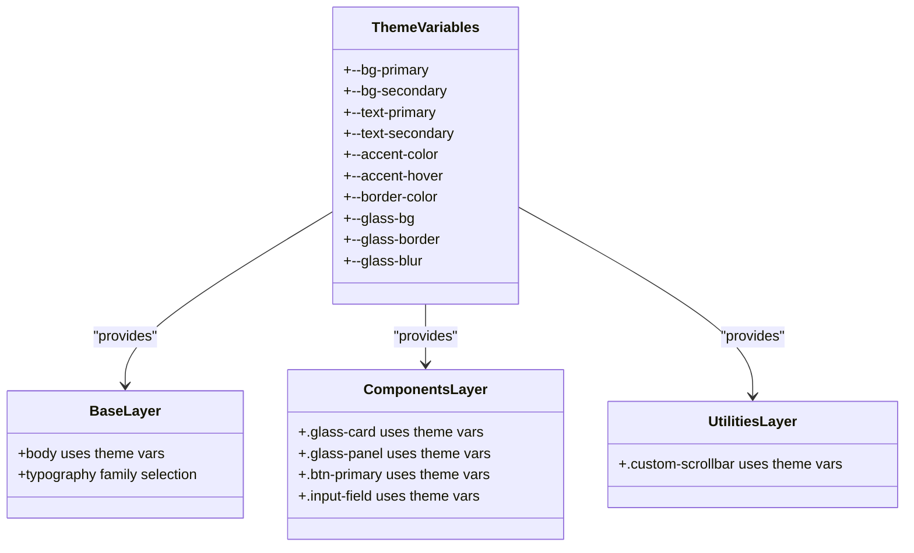
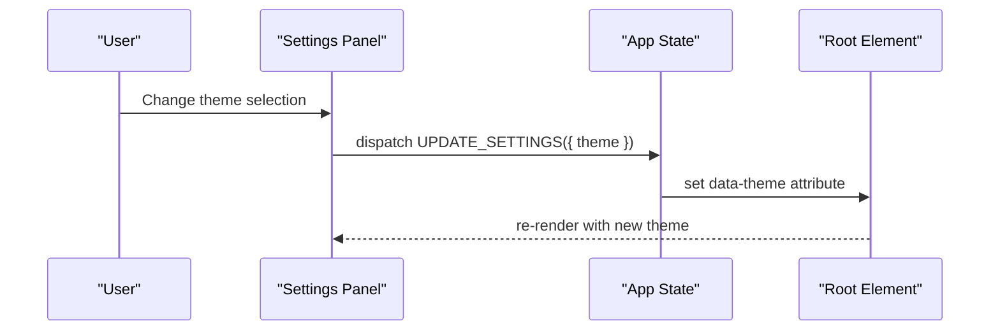
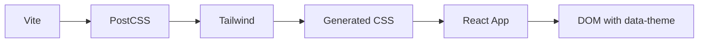

# Styling and Theming System

<cite>
**Referenced Files in This Document**
- [tailwind.config.js](file://tailwind.config.js)
- [postcss.config.js](file://postcss.config.js)
- [src/index.css](file://src/index.css)
- [src/App.jsx](file://src/App.jsx)
- [src/components/VaultDashboard.jsx](file://src/components/VaultDashboard.jsx)
- [src/App.css](file://src/App.css)
- [package.json](file://package.json)
- [vite.config.js](file://vite.config.js)
</cite>

## Table of Contents
1. [Introduction](#introduction)
2. [Project Structure](#project-structure)
3. [Core Components](#core-components)
4. [Architecture Overview](#architecture-overview)
5. [Detailed Component Analysis](#detailed-component-analysis)
6. [Dependency Analysis](#dependency-analysis)
7. [Performance Considerations](#performance-considerations)
8. [Troubleshooting Guide](#troubleshooting-guide)
9. [Conclusion](#conclusion)

## Introduction
This document explains OMNI-TODO’s styling and theming architecture. It covers Tailwind CSS configuration, Inter font integration, CSS custom properties, theme.color mapping, dynamic theming via CSS variables, responsive design, utility class extensions, and theme switching with persistent preferences. It also provides practical guidance for creating custom themes, modifying color schemes, and extending the design system while maintaining consistency across components.

## Project Structure
The styling system is organized around three pillars:
- Tailwind CSS configuration defines content scanning, custom fonts, and theme.color mapping to CSS variables.
- Global CSS establishes CSS custom properties for themes and Tailwind utility classes.
- React components apply theme-aware classes and persist user preferences.

**Diagram sources**
- [vite.config.js:1-19](file://vite.config.js#L1-L19)
- [postcss.config.js:1-7](file://postcss.config.js#L1-L7)
- [tailwind.config.js:1-27](file://tailwind.config.js#L1-L27)
- [src/index.css:1-146](file://src/index.css#L1-L146)
- [src/App.jsx:410-412](file://src/App.jsx#L410-L412)
- [src/components/VaultDashboard.jsx:1229-1237](file://src/components/VaultDashboard.jsx#L1229-L1237)

**Section sources**
- [tailwind.config.js:1-27](file://tailwind.config.js#L1-L27)
- [postcss.config.js:1-7](file://postcss.config.js#L1-L7)
- [src/index.css:1-146](file://src/index.css#L1-L146)
- [src/App.jsx:410-412](file://src/App.jsx#L410-L412)
- [src/components/VaultDashboard.jsx:1229-1237](file://src/components/VaultDashboard.jsx#L1229-L1237)

## Core Components
- Tailwind configuration
  - Content scanning pattern includes HTML and all JSX/TSX files under src.
  - Font family extension sets Inter as the default sans font.
  - theme.color maps semantic keys to CSS variables for dynamic theming.
- CSS custom properties
  - Defines primary, secondary, text, border, accent, and glass variables.
  - Provides multiple named themes via [data-theme] selectors.
- Utility and component layers
  - Tailwind utilities and component classes consume theme variables.
- Theme switching
  - React app applies data-theme on the root element and persists user selection.

**Section sources**
- [tailwind.config.js:3-24](file://tailwind.config.js#L3-L24)
- [src/index.css:7-50](file://src/index.css#L7-L50)
- [src/index.css:52-134](file://src/index.css#L52-L134)
- [src/App.jsx:410-412](file://src/App.jsx#L410-L412)
- [src/components/VaultDashboard.jsx:1229-1237](file://src/components/VaultDashboard.jsx#L1229-L1237)

## Architecture Overview
The theming pipeline connects configuration, CSS variables, and React components:

**Diagram sources**
- [src/components/VaultDashboard.jsx:1229-1237](file://src/components/VaultDashboard.jsx#L1229-L1237)
- [src/App.jsx:410-412](file://src/App.jsx#L410-L412)
- [src/index.css:7-50](file://src/index.css#L7-L50)
- [tailwind.config.js:12-22](file://tailwind.config.js#L12-L22)

## Detailed Component Analysis

### Tailwind CSS Configuration
- Content scanning
  - Scans index.html and all files under src for class usage.
- Font family
  - Extends sans font stack to include Inter and system-ui fallbacks.
- Color mapping
  - Introduces a semantic theme namespace that maps to CSS variables:
    - theme.bg → var(--bg-primary)
    - theme.panel → var(--bg-secondary)
    - theme.text → var(--text-primary)
    - theme.muted → var(--text-secondary)
    - theme.accent → var(--accent-color)
    - theme["accent-hover"] → var(--accent-hover)
    - theme.border → var(--border-color)

**Diagram sources**
- [tailwind.config.js:3-24](file://tailwind.config.js#L3-L24)

**Section sources**
- [tailwind.config.js:3-24](file://tailwind.config.js#L3-L24)

### CSS Custom Properties and Themes
- Root and theme variants
  - :root and [data-theme="liwood"] define warm paper-like colors.
  - [data-theme="dark"] defines dark elegance palette.
  - [data-theme="cyberpunk"] defines a neon cyber theme.
- Base layer
  - body adopts background and text colors from current theme.
  - Typography families are applied conditionally.
- Components layer
  - Glass cards and panels use theme variables for backdrop effects and borders.
  - Buttons and inputs inherit theme colors for consistent visuals.
- Utilities layer
  - Scrollbar pseudo-elements adapt to theme colors.

**Diagram sources**
- [src/index.css:7-65](file://src/index.css#L7-L65)
- [src/index.css:67-134](file://src/index.css#L67-L134)

**Section sources**
- [src/index.css:7-65](file://src/index.css#L7-L65)
- [src/index.css:67-134](file://src/index.css#L67-L134)

### Theme Switching Mechanism
- Root element attribute
  - The root element receives data-theme based on user settings.
- Settings panel
  - A select control updates the theme setting in state.
- Persistence
  - User preferences are stored in application state and persisted via encrypted storage; the theme preference is part of the saved state.

**Diagram sources**
- [src/components/VaultDashboard.jsx:1229-1237](file://src/components/VaultDashboard.jsx#L1229-L1237)
- [src/App.jsx:410-412](file://src/App.jsx#L410-L412)

**Section sources**
- [src/components/VaultDashboard.jsx:1229-1237](file://src/components/VaultDashboard.jsx#L1229-L1237)
- [src/App.jsx:410-412](file://src/App.jsx#L410-L412)

### Responsive Design and Breakpoints
- Global CSS
  - Uses media queries targeting 1024px for responsive layouts.
- Tailwind
  - No custom screens are defined; default Tailwind breakpoints apply.
- Practical guidance
  - Prefer Tailwind responsive modifiers (e.g., sm:, md:, lg:) for component-level responsiveness.
  - Keep layout breakpoints consistent with existing media queries.

**Section sources**
- [src/index.css:67-104](file://src/index.css#L67-L104)
- [tailwind.config.js:1-27](file://tailwind.config.js#L1-L27)

### Utility Class Extensions
- Component utilities
  - .glass-card and .glass-panel encapsulate theme-aware glass morphism.
  - .custom-scrollbar adapts to theme colors for scrollbars.
- Button and input utilities
  - .btn-primary and .btn-gold use theme colors for backgrounds and text.
  - .input-field inherits theme colors for borders and placeholders.
- Best practice
  - Encapsulate theme-dependent styles in reusable utilities to avoid duplication.

**Section sources**
- [src/index.css:67-134](file://src/index.css#L67-L134)

### Creating Custom Themes
Steps to add a new theme:
1. Define CSS variables for the new theme in the appropriate [data-theme] block.
2. Optionally add a new option in the settings panel select element.
3. Ensure Tailwind utilities continue to reference theme.* variables so they resolve to the new theme’s CSS variables.
4. Test across components to confirm consistent rendering.

Example references:
- Theme definition blocks: [src/index.css:7-50](file://src/index.css#L7-L50)
- Theme selector: [src/components/VaultDashboard.jsx:1229-1237](file://src/components/VaultDashboard.jsx#L1229-L1237)

**Section sources**
- [src/index.css:7-50](file://src/index.css#L7-L50)
- [src/components/VaultDashboard.jsx:1229-1237](file://src/components/VaultDashboard.jsx#L1229-L1237)

### Modifying Color Schemes
- Adjust values in the [data-theme] blocks to alter palettes.
- Maintain contrast ratios for text and backgrounds.
- Update accent and hover states consistently for interactive elements.

**Section sources**
- [src/index.css:7-50](file://src/index.css#L7-L50)

### Extending the Design System
- Add new semantic tokens in CSS variables for frequently used combinations.
- Create new component utilities that consume theme.* variables.
- Document new tokens and utilities to maintain consistency.

**Section sources**
- [src/index.css:67-134](file://src/index.css#L67-L134)
- [tailwind.config.js:12-22](file://tailwind.config.js#L12-L22)

## Dependency Analysis
- Build toolchain
  - Vite orchestrates development and build processes.
  - PostCSS processes Tailwind directives.
  - Tailwind generates utilities from configuration.
- Runtime dependencies
  - React components rely on Tailwind utilities and CSS variables.
  - Theme switching depends on updating the root data-theme attribute.

**Diagram sources**
- [vite.config.js:1-19](file://vite.config.js#L1-L19)
- [postcss.config.js:1-7](file://postcss.config.js#L1-L7)
- [tailwind.config.js:1-27](file://tailwind.config.js#L1-L27)
- [src/App.jsx:410-412](file://src/App.jsx#L410-L412)

**Section sources**
- [package.json:1-40](file://package.json#L1-L40)
- [vite.config.js:1-19](file://vite.config.js#L1-L19)
- [postcss.config.js:1-7](file://postcss.config.js#L1-L7)
- [tailwind.config.js:1-27](file://tailwind.config.js#L1-L27)
- [src/App.jsx:410-412](file://src/App.jsx#L410-L412)

## Performance Considerations
- CSS variable resolution is efficient; keep theme.* mappings minimal and focused.
- Avoid excessive nested media queries; prefer Tailwind responsive utilities for layout.
- Limit the number of distinct themes to reduce CSS bundle size.

## Troubleshooting Guide
- Theme not applying
  - Verify the root element has the correct data-theme attribute.
  - Confirm the [data-theme] block for the selected theme is present in CSS.
- Colors appear incorrect
  - Check that theme.* utilities map to the intended CSS variables.
  - Ensure the theme variable values are defined for the selected theme.
- Utilities not reflecting theme changes
  - Confirm Tailwind is processing the CSS layers and that utilities reference theme.* variables.

**Section sources**
- [src/App.jsx:410-412](file://src/App.jsx#L410-L412)
- [src/index.css:7-50](file://src/index.css#L7-L50)
- [tailwind.config.js:12-22](file://tailwind.config.js#L12-L22)

## Conclusion
OMNI-TODO’s theming system leverages Tailwind CSS with a robust CSS variable foundation. The configuration maps semantic theme keys to CSS variables, enabling dynamic theme switching controlled by a React settings panel. By encapsulating theme-dependent styles in utilities and maintaining consistent tokens, teams can extend the design system safely and efficiently across components.