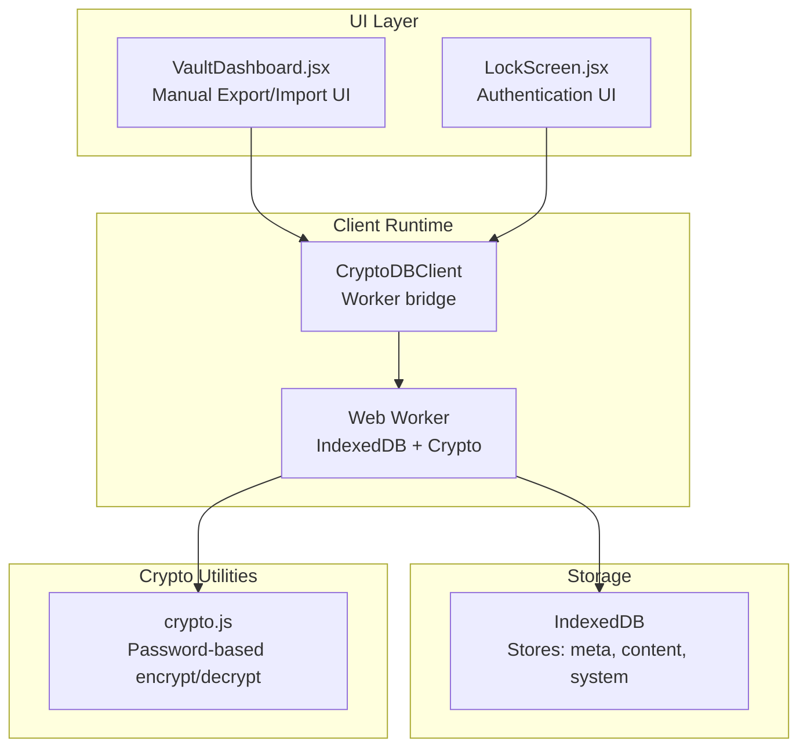
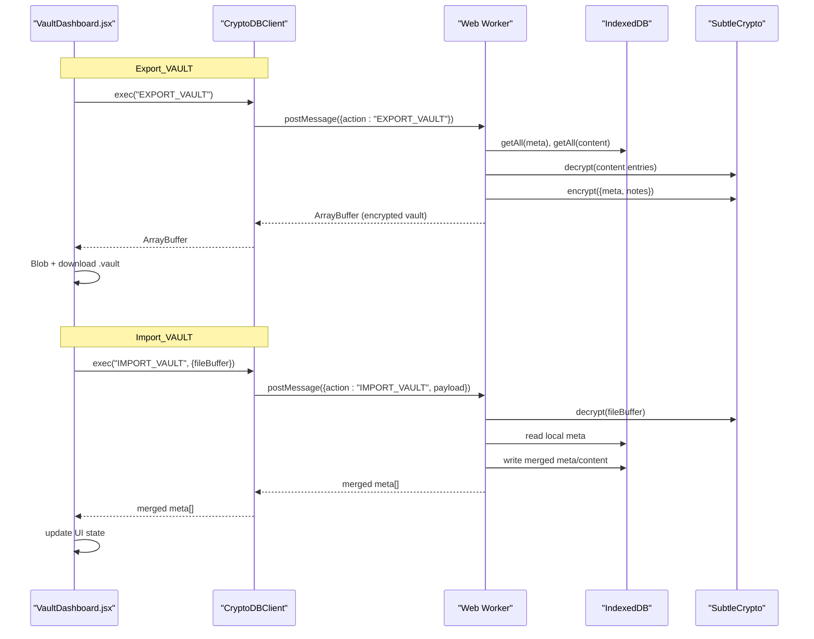
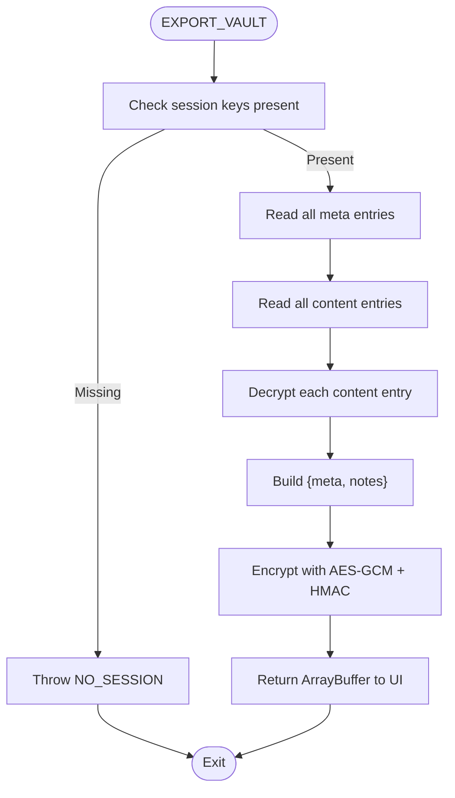
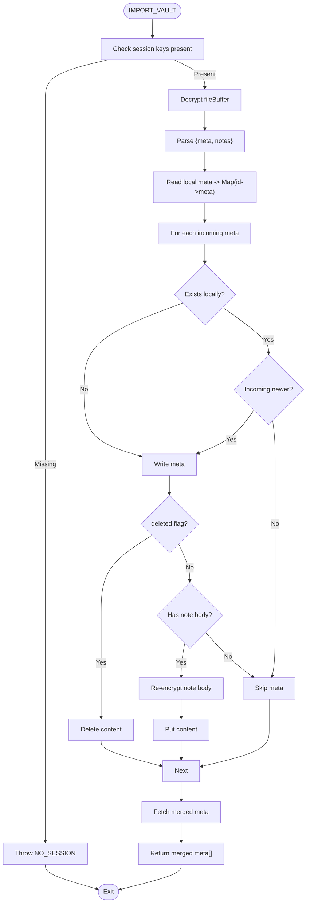
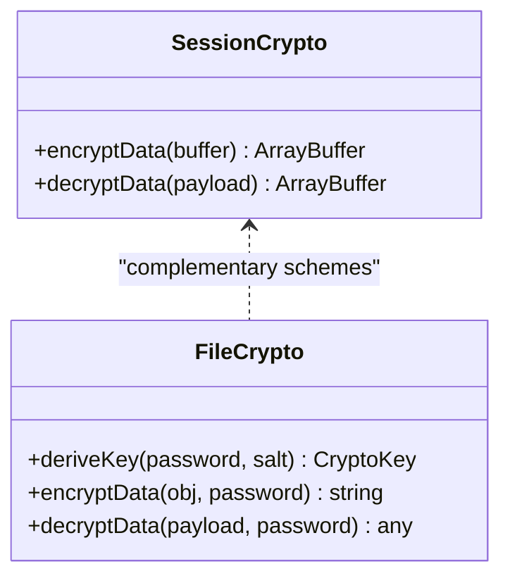
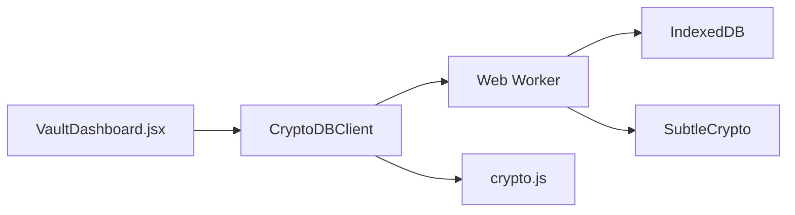

# Backup and Restore

<cite>
**Referenced Files in This Document**
- [App.jsx](file://src/App.jsx)
- [VaultDashboard.jsx](file://src/components/VaultDashboard.jsx)
- [crypto.js](file://src/lib/crypto.js)
- [LockScreen.jsx](file://src/components/LockScreen.jsx)
</cite>

## Table of Contents
1. [Introduction](#introduction)
2. [Project Structure](#project-structure)
3. [Core Components](#core-components)
4. [Architecture Overview](#architecture-overview)
5. [Detailed Component Analysis](#detailed-component-analysis)
6. [Dependency Analysis](#dependency-analysis)
7. [Performance Considerations](#performance-considerations)
8. [Troubleshooting Guide](#troubleshooting-guide)
9. [Conclusion](#conclusion)
10. [Appendices](#appendices)

## Introduction
This document describes OMNI-TODO’s backup and restore system with a focus on the EXPORT_VAULT and IMPORT_VAULT operations. It explains the encryption and decryption workflows, the vault export format, file structure, version compatibility, import conflict resolution and integrity verification, and provides guidance for manual export/import procedures. It also covers security considerations, cross-platform compatibility, and migration between installations.

## Project Structure
The backup and restore functionality spans several modules:
- A client-side IndexedDB-backed vault with a dedicated inline Web Worker for cryptographic operations.
- A settings panel that exposes manual export/import actions.
- A small crypto utility library for password-based encryption/decryption of standalone payloads (used for persistent vault storage and file I/O).

**Diagram sources**
- [VaultDashboard.jsx:137-171](file://src/components/VaultDashboard.jsx#L137-L171)
- [App.jsx:166-190](file://src/App.jsx#L166-L190)
- [App.jsx:10-28](file://src/App.jsx#L10-L28)
- [crypto.js:1-112](file://src/lib/crypto.js#L1-L112)

**Section sources**
- [VaultDashboard.jsx:137-171](file://src/components/VaultDashboard.jsx#L137-L171)
- [App.jsx:10-28](file://src/App.jsx#L10-L28)
- [crypto.js:1-112](file://src/lib/crypto.js#L1-L112)

## Core Components
- Export/Import orchestration and UI:
  - Manual export triggers a client action that requests the worker to produce a vault payload and downloads a .vault file.
  - Manual import reads a .vault file, sends it to the worker for decryption and merge, then updates the UI with merged metadata.
- Cryptographic engine:
  - The worker performs AES-GCM encryption with HMAC-SHA-256 integrity verification for note content and vault exports.
  - A separate password-based scheme is used for persistent vault storage and file I/O.
- Storage model:
  - IndexedDB stores three object stores: meta (note metadata), content (encrypted note bodies), and system (runtime variables like masterSalt).

Key responsibilities:
- Export_VAULT: Collects all note metadata and decrypted note bodies, packages them, encrypts with session keys, and returns a binary payload.
- Import_VAULT: Decrypts an incoming vault payload, merges metadata using a last-write-wins strategy, and writes updated content back to IndexedDB.

**Section sources**
- [VaultDashboard.jsx:141-171](file://src/components/VaultDashboard.jsx#L141-L171)
- [App.jsx:120-161](file://src/App.jsx#L120-L161)
- [App.jsx:54-72](file://src/App.jsx#L54-L72)
- [crypto.js:20-38](file://src/lib/crypto.js#L20-L38)

## Architecture Overview
The backup and restore pipeline integrates UI, client, worker, IndexedDB, and crypto utilities.

**Diagram sources**
- [VaultDashboard.jsx:141-171](file://src/components/VaultDashboard.jsx#L141-L171)
- [App.jsx:120-161](file://src/App.jsx#L120-L161)
- [App.jsx:54-72](file://src/App.jsx#L54-L72)

## Detailed Component Analysis

### Export_VAULT Workflow
- Action: EXPORT_VAULT
- Steps:
  - Retrieve all metadata and content from IndexedDB.
  - Decrypt each content entry using session keys and collect note bodies.
  - Package metadata and decrypted note bodies into a JSON object.
  - Encrypt the packaged payload using AES-GCM with a fresh IV and sign with HMAC-SHA-256.
  - Return the resulting ArrayBuffer to the UI for download.

**Diagram sources**
- [App.jsx:120-132](file://src/App.jsx#L120-L132)
- [App.jsx:54-72](file://src/App.jsx#L54-L72)

**Section sources**
- [VaultDashboard.jsx:141-158](file://src/components/VaultDashboard.jsx#L141-L158)
- [App.jsx:120-132](file://src/App.jsx#L120-L132)
- [App.jsx:54-72](file://src/App.jsx#L54-L72)

### Import_VAULT Workflow
- Action: IMPORT_VAULT
- Steps:
  - Decrypt the incoming ArrayBuffer using session keys.
  - Parse the decrypted payload into metadata and note bodies.
  - Read local metadata and build a map keyed by note ID.
  - For each incoming metadata:
    - If absent locally or newer than local, update meta.
    - If deleted flag is set, remove content.
    - Otherwise, if a note body exists for the ID, re-encrypt and write content.
  - Re-fetch merged metadata and return to UI.

**Diagram sources**
- [App.jsx:134-161](file://src/App.jsx#L134-L161)
- [App.jsx:54-72](file://src/App.jsx#L54-L72)

**Section sources**
- [VaultDashboard.jsx:160-171](file://src/components/VaultDashboard.jsx#L160-L171)
- [App.jsx:134-161](file://src/App.jsx#L134-L161)
- [App.jsx:54-72](file://src/App.jsx#L54-L72)

### Encryption and Decryption Workflows
- Session encryption (used for note content and vault exports):
  - AES-GCM with a random 96-bit IV per record.
  - HMAC-SHA-256 signature over IV + ciphertext for integrity.
  - Payload format: IV (12 bytes) + HMAC (32 bytes) + ciphertext.
  - Integrity verification occurs before decryption.
- Password-based encryption (used for persistent vault storage and file I/O):
  - PBKDF2 with SHA-256, configurable iterations, salted key derivation.
  - AES-GCM with a random IV per encryption.
  - Payload format: BASE1:salt:iv:ciphertext.

**Diagram sources**
- [App.jsx:54-72](file://src/App.jsx#L54-L72)
- [crypto.js:7-38](file://src/lib/crypto.js#L7-L38)

**Section sources**
- [App.jsx:54-72](file://src/App.jsx#L54-L72)
- [crypto.js:7-38](file://src/lib/crypto.js#L7-L38)

### Vault Export Format and File Structure
- File extension: .vault
- Content type: application/octet-stream
- Internal structure:
  - Encrypted JSON payload produced by EXPORT_VAULT.
  - The payload is a binary AES-GCM + HMAC envelope containing a JSON object with:
    - meta: array of note metadata entries.
    - notes: array of note bodies (IDs matched to meta).
- Versioning:
  - The worker runs under IndexedDB version 2; the vault file itself does not carry a version field. Backward compatibility depends on the worker’s ability to decrypt and merge older structures.

**Section sources**
- [VaultDashboard.jsx:141-158](file://src/components/VaultDashboard.jsx#L141-L158)
- [App.jsx:120-132](file://src/App.jsx#L120-L132)
- [App.jsx:11-28](file://src/App.jsx#L11-L28)

### Import Conflict Resolution and Integrity Verification
- Conflict resolution:
  - Last-write-wins based on updated timestamps.
  - Deletions are respected: if an incoming metadata entry is marked deleted, the content is removed.
- Integrity verification:
  - Import validates HMAC signature before decrypting the vault payload.
  - On corruption or tampering, decryption fails and the operation aborts.

**Section sources**
- [App.jsx:134-161](file://src/App.jsx#L134-L161)
- [App.jsx:64-72](file://src/App.jsx#L64-L72)

### Manual Export/Import Procedures
- Manual export:
  - Click “Export .vault” in the settings panel.
  - The client invokes EXPORT_VAULT, receives an ArrayBuffer, and saves it as a .vault file.
- Manual import:
  - Click “Import .vault” and select a .vault file.
  - The client reads the file into an ArrayBuffer and invokes IMPORT_VAULT.
  - On success, the UI updates with merged metadata.

**Section sources**
- [VaultDashboard.jsx:141-171](file://src/components/VaultDashboard.jsx#L141-L171)

### Security Considerations
- Authentication:
  - Master password unlocks the session and derives session keys.
  - A duress PIN triggers a cryptographic wipe of stored content.
- Integrity:
  - HMAC verification prevents tampering with vault payloads.
- Transport:
  - .vault files are downloaded locally; protect them with OS-level protections.
- Cross-device:
  - The vault is encrypted with session keys derived from the master password; ensure the same password is used on target devices.

**Section sources**
- [App.jsx:7-7](file://src/App.jsx#L7-L7)
- [App.jsx:79-81](file://src/App.jsx#L79-L81)
- [App.jsx:44-52](file://src/App.jsx#L44-L52)
- [LockScreen.jsx:38-62](file://src/components/LockScreen.jsx#L38-L62)

### Cross-Platform Compatibility and Migration
- IndexedDB is used for storage; it is available in modern browsers and persists per origin.
- Migration steps:
  - Unlock on the source device and export .vault.
  - Unlock on the destination device and import .vault.
  - Verify merged metadata and content.

**Section sources**
- [App.jsx:11-28](file://src/App.jsx#L11-L28)
- [VaultDashboard.jsx:141-171](file://src/components/VaultDashboard.jsx#L141-L171)

## Dependency Analysis
- UI depends on CryptoDBClient to execute vault operations.
- CryptoDBClient posts messages to the worker and resolves promises with results or errors.
- The worker manages IndexedDB transactions and cryptographic operations.
- crypto.js provides password-based encryption for persistent storage and file I/O.

**Diagram sources**
- [VaultDashboard.jsx:137-171](file://src/components/VaultDashboard.jsx#L137-L171)
- [App.jsx:166-190](file://src/App.jsx#L166-L190)
- [App.jsx:10-28](file://src/App.jsx#L10-L28)
- [crypto.js:1-112](file://src/lib/crypto.js#L1-L112)

**Section sources**
- [VaultDashboard.jsx:137-171](file://src/components/VaultDashboard.jsx#L137-L171)
- [App.jsx:166-190](file://src/App.jsx#L166-L190)
- [App.jsx:10-28](file://src/App.jsx#L10-L28)
- [crypto.js:1-112](file://src/lib/crypto.js#L1-L112)

## Performance Considerations
- Export scans all content entries and decrypts each to build the vault payload; large vaults will take longer.
- Import performs a local read of metadata and a loop over incoming metadata; performance scales with the number of note entries.
- AES-GCM and HMAC operations are hardware-accelerated in modern browsers.

[No sources needed since this section provides general guidance]

## Troubleshooting Guide
Common issues and resolutions:
- Wrong password or corrupted vault:
  - Symptom: Import/export fails with an error indicating invalid key or file.
  - Resolution: Verify the password and ensure the .vault file is intact.
- Integrity compromised:
  - Symptom: Decryption fails due to HMAC mismatch.
  - Resolution: Do not modify the .vault file; re-export from a known-good installation.
- No session:
  - Symptom: Operations fail with a session-related error.
  - Resolution: Unlock with the correct master password before exporting or importing.
- Duress trigger:
  - Symptom: Vault wiped and an error is thrown.
  - Resolution: Do not enter the duress PIN intentionally; recover from backups.

**Section sources**
- [VaultDashboard.jsx:203-217](file://src/components/VaultDashboard.jsx#L203-L217)
- [App.jsx:79-81](file://src/App.jsx#L79-L81)
- [App.jsx:64-72](file://src/App.jsx#L64-L72)

## Conclusion
OMNI-TODO’s backup and restore system centers on a robust export/import pipeline secured by AES-GCM with HMAC integrity checks. Exports capture both metadata and decrypted note bodies for packaging and re-encryption, while imports apply a last-write-wins merge strategy with deletion support. The system provides manual controls, strong cryptographic guarantees, and straightforward migration paths across compatible environments.

## Appendices

### Appendix A: Backup Scheduling and Automation
- The codebase does not implement automated backup scheduling or recurring exports. Users rely on manual export/import via the settings panel.

**Section sources**
- [VaultDashboard.jsx:141-158](file://src/components/VaultDashboard.jsx#L141-L158)

### Appendix B: File Format Standards
- .vault files:
  - MIME type: application/octet-stream
  - Extension: .vault
  - Internal format: Binary AES-GCM + HMAC envelope containing JSON with meta and notes arrays.

**Section sources**
- [VaultDashboard.jsx:141-158](file://src/components/VaultDashboard.jsx#L141-L158)
- [App.jsx:120-132](file://src/App.jsx#L120-L132)

### Appendix C: Example Operations
- Export:
  - UI action: Click “Export .vault”
  - Outcome: A .vault file is downloaded containing the encrypted vault payload.
- Import:
  - UI action: Select a .vault file
  - Outcome: The vault is decrypted, merged, and the UI reflects updated metadata.

**Section sources**
- [VaultDashboard.jsx:141-171](file://src/components/VaultDashboard.jsx#L141-L171)
- [App.jsx:134-161](file://src/App.jsx#L134-L161)