# Data Management

<cite>
**Referenced Files in This Document**
- [src/App.jsx](file://src/App.jsx)
- [src/lib/crypto.js](file://src/lib/crypto.js)
- [src/components/VaultDashboard.jsx](file://src/components/VaultDashboard.jsx)
- [src/components/LockScreen.jsx](file://src/components/LockScreen.jsx)
- [src/components/MindmapView.jsx](file://src/components/MindmapView.jsx)
- [server.js](file://server.js)
- [src/main.jsx](file://src/main.jsx)
</cite>

## Table of Contents
1. [Introduction](#introduction)
2. [Project Structure](#project-structure)
3. [Core Components](#core-components)
4. [Architecture Overview](#architecture-overview)
5. [Detailed Component Analysis](#detailed-component-analysis)
6. [Dependency Analysis](#dependency-analysis)
7. [Performance Considerations](#performance-considerations)
8. [Troubleshooting Guide](#troubleshooting-guide)
9. [Conclusion](#conclusion)
10. [Appendices](#appendices)

## Introduction
This document explains OMNI-TODO’s data management system with a focus on secure storage, encryption, IndexedDB-backed persistence, transactions, migrations, and user workflows. It covers:
- Encrypted note storage and retrieval
- Tagging and search
- Project management and issue tracking
- Gallery image generation and storage
- Backup and restore via encrypted vault files and JSON exports
- Data models, encryption workflows, and security considerations

## Project Structure
The application is a React + Vite frontend with a Web Worker for IndexedDB-backed encrypted note storage and a small Express proxy server for AI/image generation.

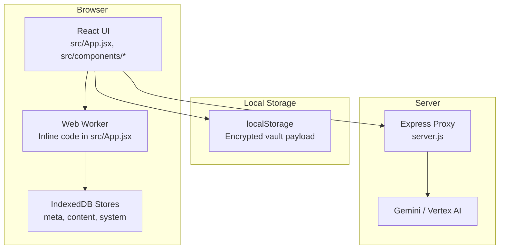

**Diagram sources**
- [src/App.jsx:9-190](file://src/App.jsx#L9-L190)
- [src/lib/crypto.js:40-112](file://src/lib/crypto.js#L40-L112)
- [server.js:21-129](file://server.js#L21-L129)

**Section sources**
- [src/main.jsx:1-11](file://src/main.jsx#L1-L11)
- [src/App.jsx:1-255](file://src/App.jsx#L1-L255)

## Core Components
- Secure note engine with IndexedDB and SubtleCrypto
- Encrypted vault persistence using localStorage
- UI dashboard for notes, projects, mindmaps, and gallery
- File system access for import/export
- AI proxy for generating mindmaps and images

**Section sources**
- [src/App.jsx:9-190](file://src/App.jsx#L9-L190)
- [src/lib/crypto.js:1-112](file://src/lib/crypto.js#L1-L112)
- [src/components/VaultDashboard.jsx:1-508](file://src/components/VaultDashboard.jsx#L1-L508)

## Architecture Overview
The system separates concerns:
- UI handles user interactions and state
- Web Worker encapsulates IndexedDB transactions and cryptographic operations
- LocalStorage stores a single encrypted vault payload for file-based backup/restore
- Express proxy integrates with external AI services

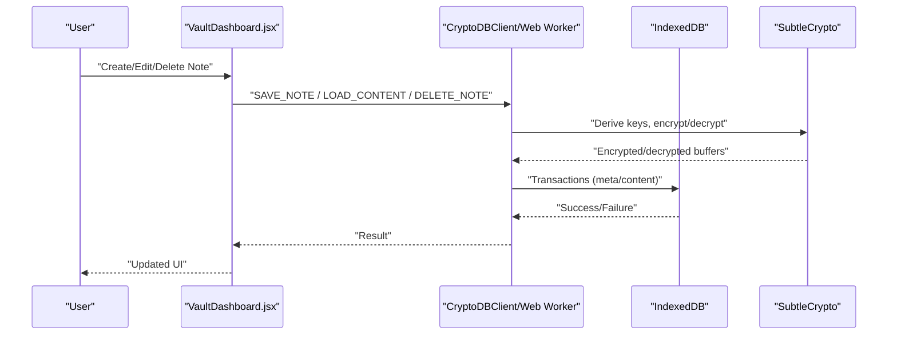

**Diagram sources**
- [src/App.jsx:167-190](file://src/App.jsx#L167-L190)
- [src/App.jsx:74-163](file://src/App.jsx#L74-L163)

## Detailed Component Analysis

### Secure Note Engine (IndexedDB + Encryption)
- IndexedDB stores:
  - meta: per-note metadata (id, title, tags, preview, timestamps, deleted flag)
  - content: encrypted note bodies
  - system: master salt and session keys derived per session
- Encryption:
  - Session keys derived from password and stored salt
  - AES-GCM for confidentiality; HMAC-SHA-256 for authenticity
  - Integrity verification before decryption
- Transactions:
  - Read/write transactions for meta and content stores
  - Tombstone pattern for deletes (mark deleted, clear content)
- Migration:
  - Versioned IndexedDB upgrade path creates stores on first run

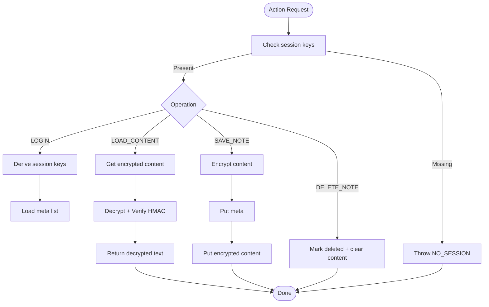

**Diagram sources**
- [src/App.jsx:33-72](file://src/App.jsx#L33-L72)
- [src/App.jsx:74-163](file://src/App.jsx#L74-L163)

**Section sources**
- [src/App.jsx:11-28](file://src/App.jsx#L11-L28)
- [src/App.jsx:33-72](file://src/App.jsx#L33-L72)
- [src/App.jsx:74-163](file://src/App.jsx#L74-L163)

### Encrypted Vault Persistence (localStorage)
- Single encrypted payload stored under a fixed key
- Used for:
  - Initial vault existence detection
  - Importing/exporting the entire app state
- File-based backup/restore:
  - Export to .vault file
  - Open .vault file and load into memory

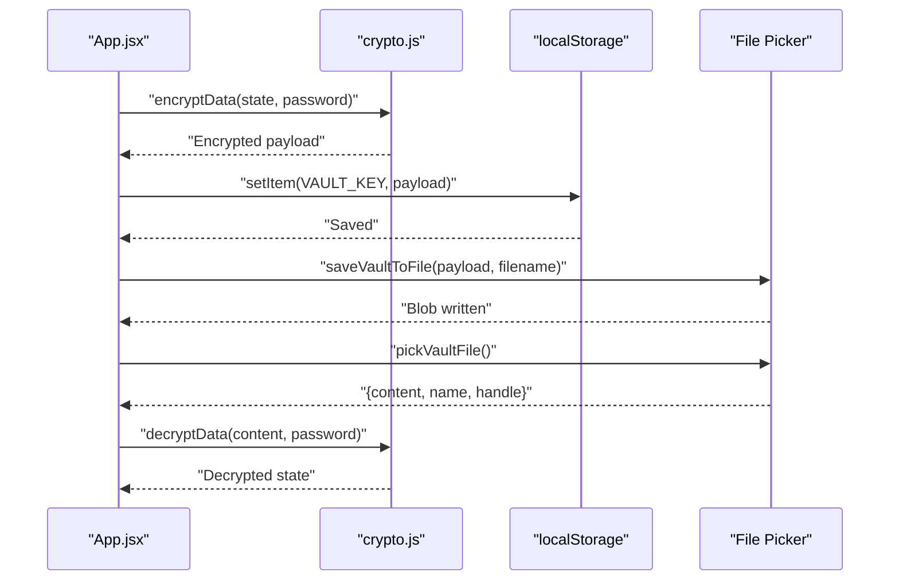

**Diagram sources**
- [src/lib/crypto.js:40-112](file://src/lib/crypto.js#L40-L112)
- [src/App.jsx:326-407](file://src/App.jsx#L326-L407)

**Section sources**
- [src/lib/crypto.js:1-112](file://src/lib/crypto.js#L1-L112)
- [src/App.jsx:316-407](file://src/App.jsx#L316-L407)

### Notes, Tags, and Search
- Creation: generates a new note id, initializes metadata, saves immediately
- Editing: debounced auto-save after 1.5 seconds
- Tag extraction: scans title and content for tag-like tokens
- Preview: truncated text excluding tags
- Deletion: tombstone delete (marks deleted, clears content)
- Search: filters by title, preview, or tags; supports active tag filter

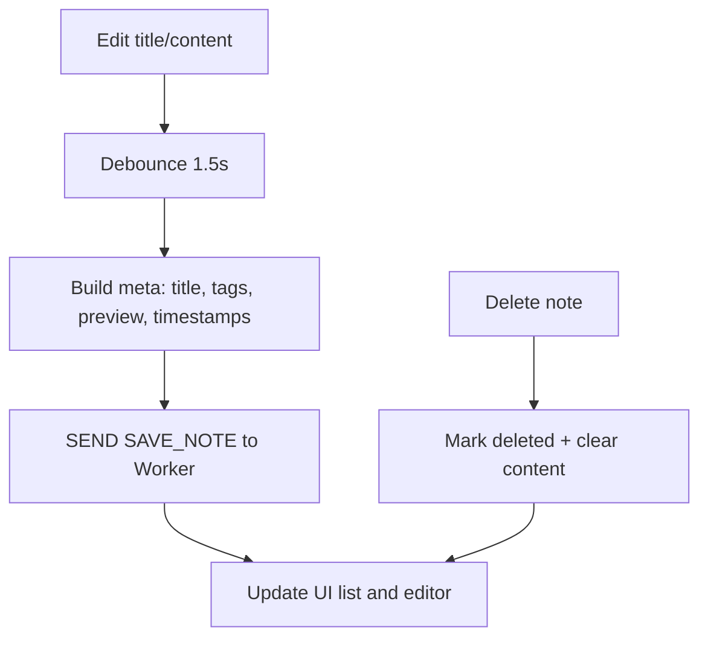

**Diagram sources**
- [src/components/VaultDashboard.jsx:276-316](file://src/components/VaultDashboard.jsx#L276-L316)

**Section sources**
- [src/components/VaultDashboard.jsx:11-14](file://src/components/VaultDashboard.jsx#L11-L14)
- [src/components/VaultDashboard.jsx:276-316](file://src/components/VaultDashboard.jsx#L276-L316)

### Project Management and Collaboration
- Projects: CRUD with progress bars and issue placeholders
- Collaboration: UI surfaces “Board” and “Issue” actions; actual integrations are placeholders in this codebase
- Progress monitoring: per-project progress percentage rendered visually

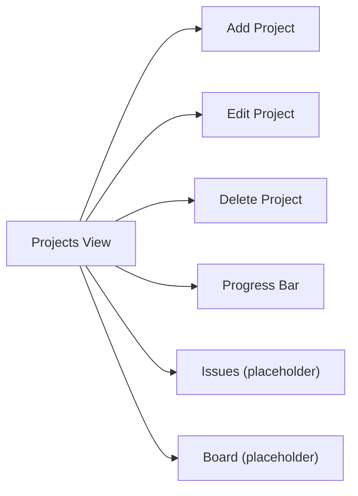

**Diagram sources**
- [src/components/VaultDashboard.jsx:912-1033](file://src/components/VaultDashboard.jsx#L912-L1033)

**Section sources**
- [src/components/VaultDashboard.jsx:912-1033](file://src/components/VaultDashboard.jsx#L912-L1033)

### Gallery System (Images)
- AI image generation via proxy endpoint
- Local gallery stores generated images with prompts and timestamps
- Grid view with hover actions to delete or expand

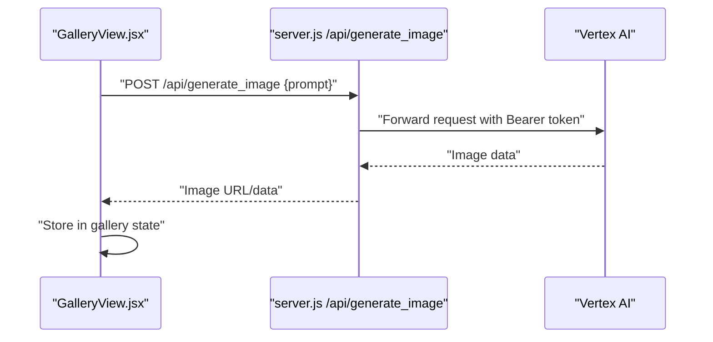

**Diagram sources**
- [src/components/VaultDashboard.jsx:1036-1146](file://src/components/VaultDashboard.jsx#L1036-L1146)
- [server.js:83-129](file://server.js#L83-L129)

**Section sources**
- [src/components/VaultDashboard.jsx:1036-1146](file://src/components/VaultDashboard.jsx#L1036-L1146)
- [server.js:83-129](file://server.js#L83-L129)

### Backup and Restore Procedures
- Encrypted vault export/import:
  - Export: Worker loads all meta and content, decrypts content, re-encrypts combined payload, returns ArrayBuffer to UI for download
  - Import: UI sends ArrayBuffer to Worker; merges using last-write-wins semantics on updated timestamps
- JSON export/import:
  - Exports current app state as JSON (unencrypted)
  - Imports JSON into app state

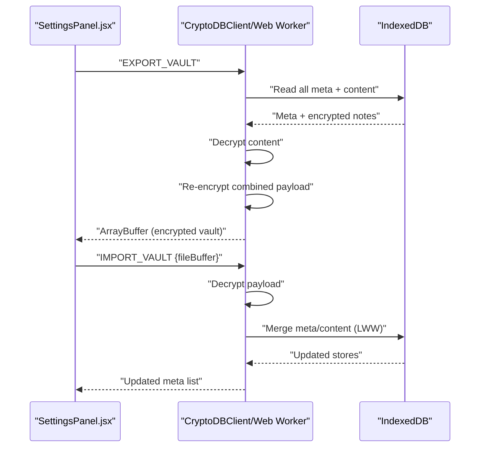

**Diagram sources**
- [src/components/VaultDashboard.jsx:137-237](file://src/components/VaultDashboard.jsx#L137-L237)
- [src/App.jsx:120-161](file://src/App.jsx#L120-L161)

**Section sources**
- [src/components/VaultDashboard.jsx:137-237](file://src/components/VaultDashboard.jsx#L137-L237)
- [src/App.jsx:120-161](file://src/App.jsx#L120-L161)

### Data Models
- Note metadata (stored in meta store):
  - id: unique identifier
  - title: string
  - tags: array of tag strings
  - preview: string (truncated content without tags)
  - created: timestamp
  - updated: timestamp
  - deleted: boolean flag
- Note content (stored in content store):
  - id: matches meta id
  - data: encrypted buffer
- System variables (stored in system store):
  - masterSalt: PBKDF2 salt for session key derivation
- App state (stored in encrypted vault):
  - items: general entries (ideas/tasks/links)
  - projects: project list with issues
  - mindmaps: mindmap structures
  - gallery: image records with prompt and timestamp
  - settings: theme, color, auto-lock preferences

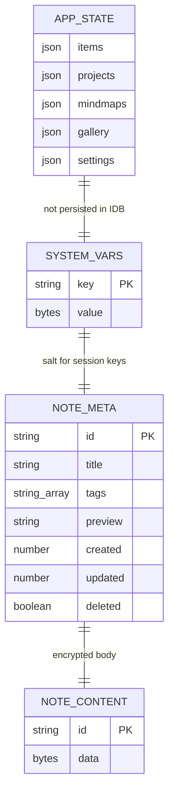

**Diagram sources**
- [src/App.jsx:11-28](file://src/App.jsx#L11-L28)
- [src/App.jsx:30-31](file://src/App.jsx#L30-L31)
- [src/App.jsx:265-306](file://src/App.jsx#L265-L306)

**Section sources**
- [src/App.jsx:11-28](file://src/App.jsx#L11-L28)
- [src/App.jsx:265-306](file://src/App.jsx#L265-L306)

### Encryption Workflows
- Master key derivation:
  - PBKDF2 with SHA-256 and 250k+ iterations for the persistent vault encryption
  - PBKDF2 with a salt tweak for session keys (AES-GCM and HMAC)
- Payload format:
  - Encrypted vault: BASE1:salt:iv:ciphertext
  - In-DB payload: IV + HMAC + AES-GCM ciphertext
- Integrity:
  - HMAC verification before decryption
  - Throws errors for corrupted or tampered payloads

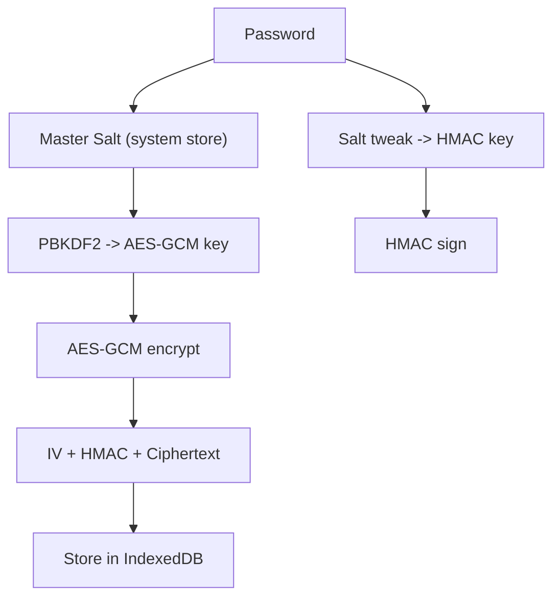

**Diagram sources**
- [src/lib/crypto.js:7-38](file://src/lib/crypto.js#L7-L38)
- [src/App.jsx:54-72](file://src/App.jsx#L54-L72)

**Section sources**
- [src/lib/crypto.js:1-112](file://src/lib/crypto.js#L1-L112)
- [src/App.jsx:54-72](file://src/App.jsx#L54-L72)

### Security Considerations
- At-rest:
  - Notes are encrypted at rest in IndexedDB
  - Vault file is encrypted and optionally downloaded for off-device storage
- In-transit:
  - AI requests go through a proxy with Bearer token authentication
- Session security:
  - Session keys are cleared on lock
  - Duress PIN triggers cryptographic shredding of IndexedDB content
- Integrity:
  - HMAC verification prevents tampering
  - Corrupted or mismatched payloads cause explicit errors

**Section sources**
- [src/App.jsx:8, 79-87:8-87](file://src/App.jsx#L8-L87)
- [src/App.jsx:44-52](file://src/App.jsx#L44-L52)
- [src/App.jsx:64-72](file://src/App.jsx#L64-L72)
- [src/components/LockScreen.jsx:80-87](file://src/components/LockScreen.jsx#L80-L87)

## Dependency Analysis
- UI depends on:
  - CryptoDBClient for IndexedDB operations
  - localStorage for vault persistence
  - File APIs for import/export
- Worker depends on:
  - IndexedDB for durable storage
  - SubtleCrypto for encryption/decryption
- Proxy depends on:
  - Google Auth for bearer token acquisition
  - External AI endpoints for generation

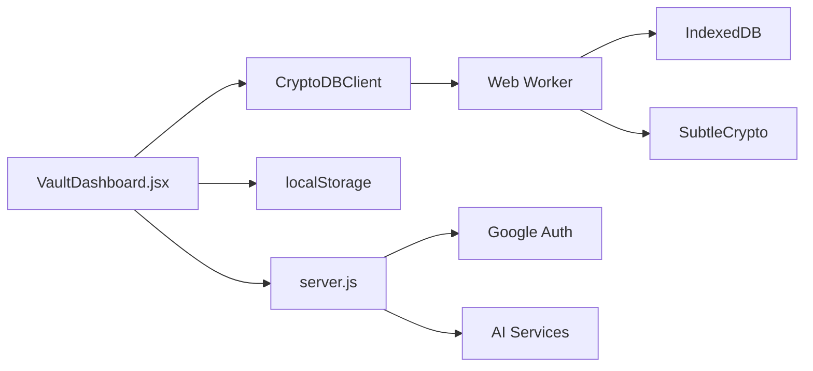

**Diagram sources**
- [src/App.jsx:167-190](file://src/App.jsx#L167-L190)
- [src/components/VaultDashboard.jsx:137-237](file://src/components/VaultDashboard.jsx#L137-L237)
- [server.js:13-16](file://server.js#L13-L16)

**Section sources**
- [src/App.jsx:167-190](file://src/App.jsx#L167-L190)
- [src/components/VaultDashboard.jsx:137-237](file://src/components/VaultDashboard.jsx#L137-L237)
- [server.js:13-16](file://server.js#L13-L16)

## Performance Considerations
- IndexedDB:
  - Batch reads/writes in transactions for bulk operations
  - Tombstone deletes avoid large content writes
- Encryption:
  - PBKDF2 iteration counts are high; consider caching session keys during active sessions
- UI:
  - Debounced autosave reduces write frequency
  - Virtualized lists recommended for large galleries or note lists

## Troubleshooting Guide
- Login fails:
  - Wrong password or corrupted vault payload
  - Check error messages returned by unlock handlers
- Duress triggered:
  - PIN 6666 initiates cryptographic shredding; data is unrecoverable
- Export/Import issues:
  - Ensure correct file type and valid encrypted payload
  - For JSON import, verify valid JSON structure
- AI/image generation:
  - Proxy requires network access and valid credentials
  - Inspect server logs for 5xx errors

**Section sources**
- [src/App.jsx:216-226](file://src/App.jsx#L216-L226)
- [src/components/LockScreen.jsx:80-87](file://src/components/LockScreen.jsx#L80-L87)
- [src/components/VaultDashboard.jsx:137-237](file://src/components/VaultDashboard.jsx#L137-L237)
- [server.js:77-81](file://server.js#L77-L81)

## Conclusion
OMNI-TODO implements a robust, client-side encrypted data management system. Notes are securely stored in IndexedDB with strong encryption and integrity checks, while the UI provides seamless creation, editing, tagging, search, and backup/restore workflows. The gallery and project views demonstrate extensibility, and the Express proxy enables AI-driven features. Adhering to the documented procedures ensures secure, reliable data lifecycle management.

## Appendices

### Data Lifecycle Management
- Create: Initialize metadata and save immediately
- Edit: Debounced autosave updates metadata and content
- Delete: Tombstone delete preserves audit trail
- Backup: Export encrypted vault or JSON for off-device storage
- Restore: Import vault or JSON to recover state

**Section sources**
- [src/components/VaultDashboard.jsx:276-316](file://src/components/VaultDashboard.jsx#L276-L316)
- [src/components/VaultDashboard.jsx:137-237](file://src/components/VaultDashboard.jsx#L137-L237)