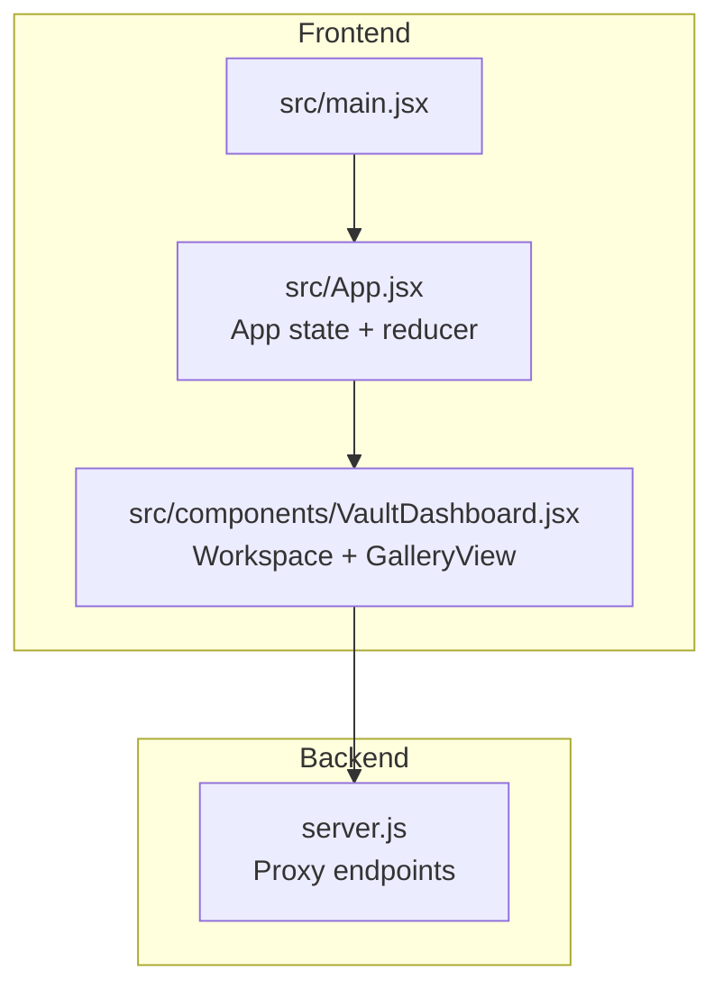
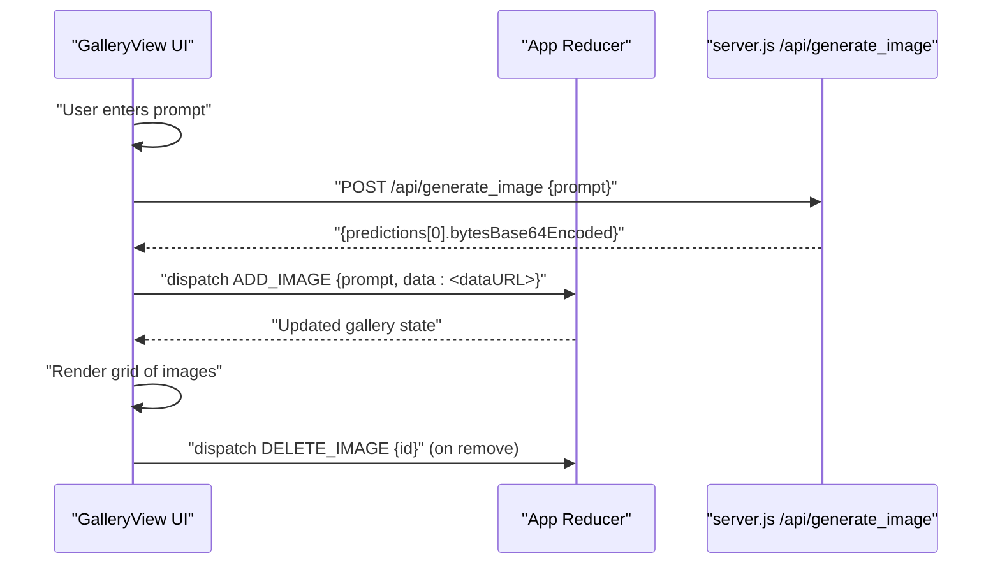
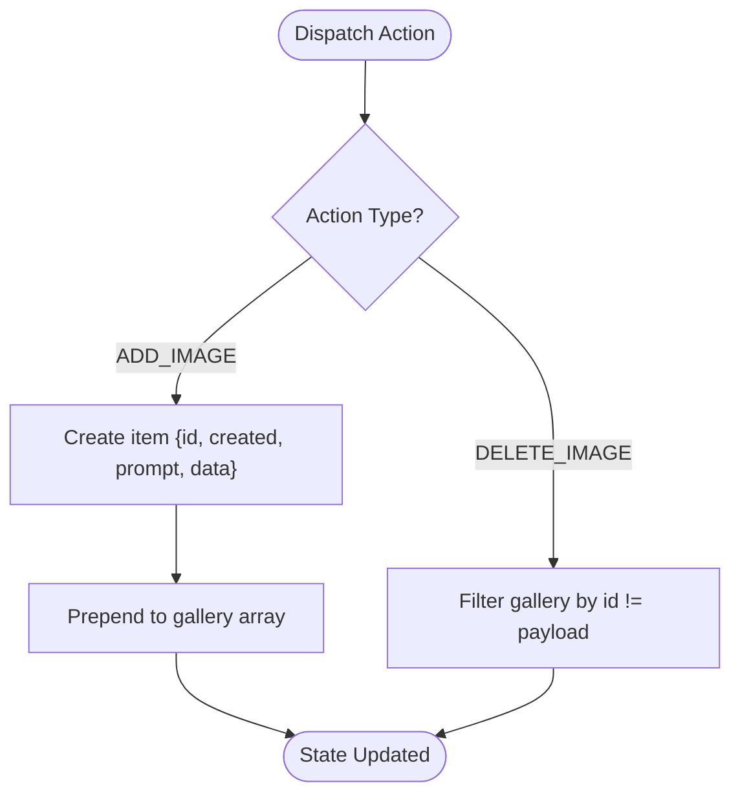
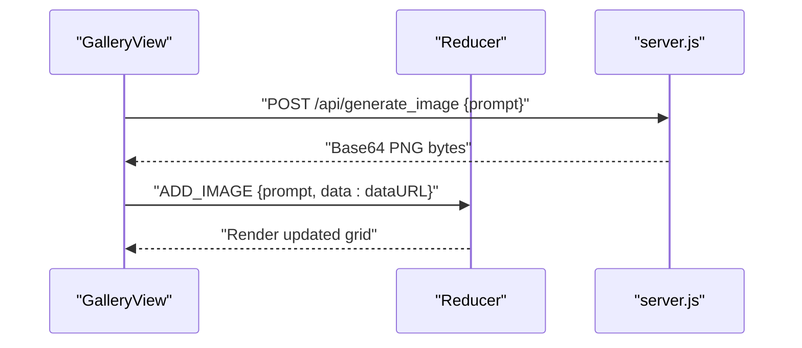
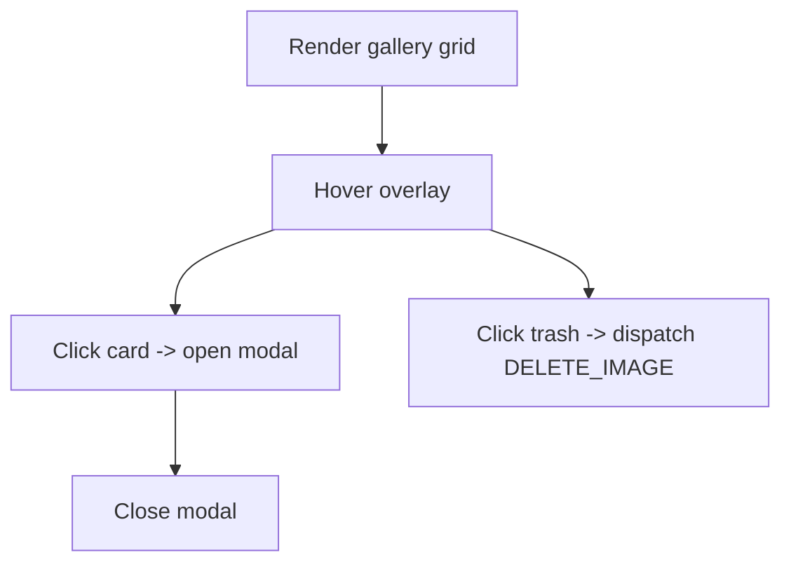
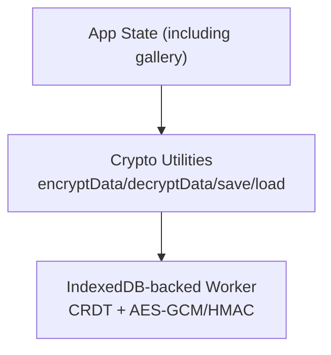
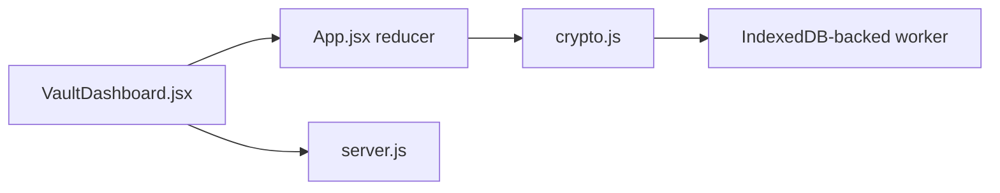

# Gallery System

<cite>
**Referenced Files in This Document**
- [README.md](file://README.md)
- [server.js](file://server.js)
- [src/App.jsx](file://src/App.jsx)
- [src/components/VaultDashboard.jsx](file://src/components/VaultDashboard.jsx)
- [src/lib/crypto.js](file://src/lib/crypto.js)
- [src/main.jsx](file://src/main.jsx)
</cite>

## Table of Contents
1. [Introduction](#introduction)
2. [Project Structure](#project-structure)
3. [Core Components](#core-components)
4. [Architecture Overview](#architecture-overview)
5. [Detailed Component Analysis](#detailed-component-analysis)
6. [Dependency Analysis](#dependency-analysis)
7. [Performance Considerations](#performance-considerations)
8. [Troubleshooting Guide](#troubleshooting-guide)
9. [Conclusion](#conclusion)

## Introduction
This document describes the image gallery functionality in OMNI-TODO. It covers the image data model, upload and generation workflows, display and interaction, state management operations, storage mechanisms, and integration with the main application state. It also addresses error handling, performance considerations, and security concerns for image storage and access.

## Project Structure
The gallery feature spans the frontend application state and UI, and a backend proxy service for AI image generation. The main application state includes a gallery array alongside other domain areas (items, projects, mindmaps). The gallery view is integrated into the VaultDashboard workspace.

**Diagram sources**
- [src/main.jsx:1-11](file://src/main.jsx#L1-L11)
- [src/App.jsx:265-306](file://src/App.jsx#L265-L306)
- [src/components/VaultDashboard.jsx:1524-1528](file://src/components/VaultDashboard.jsx#L1524-L1528)
- [server.js:1-135](file://server.js#L1-L135)

**Section sources**
- [src/main.jsx:1-11](file://src/main.jsx#L1-L11)
- [src/App.jsx:265-306](file://src/App.jsx#L265-L306)
- [src/components/VaultDashboard.jsx:1524-1528](file://src/components/VaultDashboard.jsx#L1524-L1528)
- [server.js:1-135](file://server.js#L1-L135)

## Core Components
- Application state and reducer define the gallery slice and actions to manage images.
- The VaultDashboard integrates a gallery workspace tab and renders the image grid.
- A backend proxy endpoint generates images using Vertex AI and returns base64-encoded PNG bytes.
- Local encryption and persistence are handled by the crypto utilities and IndexedDB-backed worker.

Key state and UI integration points:
- Gallery state shape and actions are defined in the app reducer.
- The gallery view dispatches ADD_IMAGE and DELETE_IMAGE actions.
- Generated images are stored as data URLs in the gallery state.

**Section sources**
- [src/App.jsx:265-306](file://src/App.jsx#L265-L306)
- [src/components/VaultDashboard.jsx:1042-1186](file://src/components/VaultDashboard.jsx#L1042-L1186)
- [server.js:83-129](file://server.js#L83-L129)

## Architecture Overview
The gallery workflow connects the UI to the backend and state management:

**Diagram sources**
- [src/components/VaultDashboard.jsx:1042-1186](file://src/components/VaultDashboard.jsx#L1042-L1186)
- [server.js:83-129](file://server.js#L83-L129)
- [src/App.jsx:295-298](file://src/App.jsx#L295-L298)

## Detailed Component Analysis

### Image Data Model
Each gallery item is a plain object with:
- id: Unique identifier generated at insertion time.
- created: ISO timestamp indicating creation time.
- prompt: The user’s original prompt used to generate the image.
- data: A data URL containing the base64-encoded PNG image.

These fields are populated when adding an image to the gallery and used for rendering and deletion.

**Section sources**
- [src/App.jsx:295-296](file://src/App.jsx#L295-L296)
- [src/components/VaultDashboard.jsx:1063-1069](file://src/components/VaultDashboard.jsx#L1063-L1069)

### Gallery State Management Operations
- ADD_IMAGE: Inserts a new image at the head of the gallery array with current timestamp and provided fields.
- DELETE_IMAGE: Removes an image by id from the gallery array.

These operations are pure reducers that update the gallery slice of the state.

**Diagram sources**
- [src/App.jsx:295-298](file://src/App.jsx#L295-L298)

**Section sources**
- [src/App.jsx:295-298](file://src/App.jsx#L295-L298)

### Image Upload and Organization
- Upload workflow: The gallery view accepts a text prompt and triggers a backend call to generate an image. On success, it dispatches ADD_IMAGE with a data URL derived from the returned base64 bytes.
- Organization: Images are stored in the order they were added, with the newest at the front of the gallery array.

**Diagram sources**
- [src/components/VaultDashboard.jsx:1042-1186](file://src/components/VaultDashboard.jsx#L1042-L1186)
- [server.js:83-129](file://server.js#L83-L129)
- [src/App.jsx:295-296](file://src/App.jsx#L295-L296)

**Section sources**
- [src/components/VaultDashboard.jsx:1042-1186](file://src/components/VaultDashboard.jsx#L1042-L1186)
- [server.js:83-129](file://server.js#L83-L129)

### Image Display and Interaction
- Grid rendering: The gallery view maps over the gallery array and renders each image as a card with overlay controls.
- Interactions:
  - Clicking a card opens an expanded modal showing the full image and metadata.
  - Removing an image dispatches DELETE_IMAGE by id.

**Diagram sources**
- [src/components/VaultDashboard.jsx:1108-1186](file://src/components/VaultDashboard.jsx#L1108-L1186)

**Section sources**
- [src/components/VaultDashboard.jsx:1108-1186](file://src/components/VaultDashboard.jsx#L1108-L1186)

### Storage Mechanisms and Persistence
- In-memory state: The gallery lives in the React state managed by the reducer.
- Persistence: The main application state is persisted to encrypted storage via the crypto utilities and IndexedDB-backed worker. Gallery items are part of the persisted state snapshot.
- Encrypted storage: The crypto utilities provide encryption/decryption and local storage APIs used by the main app state.

**Diagram sources**
- [src/App.jsx:102-104](file://src/App.jsx#L102-L104)
- [src/lib/crypto.js:20-38](file://src/lib/crypto.js#L20-L38)
- [src/lib/crypto.js:43-60](file://src/lib/crypto.js#L43-L60)

**Section sources**
- [src/App.jsx:102-104](file://src/App.jsx#L102-L104)
- [src/lib/crypto.js:20-38](file://src/lib/crypto.js#L20-L38)
- [src/lib/crypto.js:43-60](file://src/lib/crypto.js#L43-L60)

### File Format Support and Thumbnail Generation
- File format: Generated images are returned as base64-encoded PNG bytes and stored as data URLs.
- Thumbnails: No explicit thumbnail generation is implemented in the codebase; images are rendered at full resolution in the grid and modal.

**Section sources**
- [src/components/VaultDashboard.jsx:1060-1069](file://src/components/VaultDashboard.jsx#L1060-L1069)

### Integration with Main Application State
- The gallery is a dedicated slice of the global state, separate from notes and other domain areas.
- The VaultDashboard integrates the gallery into the workspace tabs and coordinates navigation and rendering.

**Section sources**
- [src/App.jsx:265-306](file://src/App.jsx#L265-L306)
- [src/components/VaultDashboard.jsx:1524-1528](file://src/components/VaultDashboard.jsx#L1524-L1528)

## Dependency Analysis
The gallery feature depends on:
- Frontend state management via a reducer.
- UI rendering and user interactions in the gallery view.
- Backend proxy for image generation.
- Encryption and persistence utilities for state storage.

**Diagram sources**
- [src/components/VaultDashboard.jsx:1042-1186](file://src/components/VaultDashboard.jsx#L1042-L1186)
- [src/App.jsx:295-298](file://src/App.jsx#L295-L298)
- [server.js:83-129](file://server.js#L83-L129)
- [src/lib/crypto.js:20-38](file://src/lib/crypto.js#L20-L38)

**Section sources**
- [src/components/VaultDashboard.jsx:1042-1186](file://src/components/VaultDashboard.jsx#L1042-L1186)
- [src/App.jsx:295-298](file://src/App.jsx#L295-L298)
- [server.js:83-129](file://server.js#L83-L129)
- [src/lib/crypto.js:20-38](file://src/lib/crypto.js#L20-L38)

## Performance Considerations
- Rendering large galleries: The gallery view uses animated presence and per-item layout animations. For very large collections, consider virtualization or pagination to reduce DOM nodes and re-renders.
- Data URLs: Storing images as data URLs increases memory usage. For large collections, consider offloading to IndexedDB blobs or server-side storage with signed URLs.
- Encryption overhead: Persisting large state snapshots incurs CPU cost. Batch updates and debounced saves help mitigate frequent re-encryption.
- Image generation latency: Backend calls are asynchronous; ensure UI remains responsive and show loading states during generation.

[No sources needed since this section provides general guidance]

## Troubleshooting Guide
Common issues and remedies:
- Corrupted or invalid image data:
  - Symptom: Errors when generating images or displaying images.
  - Causes: Backend errors, missing base64 bytes, or malformed responses.
  - Resolution: Validate response status and presence of predictions; surface user-friendly error messages; retry on transient failures.
- Gallery not updating after generation:
  - Verify that ADD_IMAGE is dispatched with the correct payload and that the reducer prepends the item.
- Deleting an image does not take effect:
  - Confirm DELETE_IMAGE is dispatched with the correct id and that the reducer filters the array properly.
- Security and integrity:
  - The main app state is encrypted and integrity-protected. Ensure prompts and images are not logged or exposed outside the app.

**Section sources**
- [src/components/VaultDashboard.jsx:1056-1076](file://src/components/VaultDashboard.jsx#L1056-L1076)
- [src/App.jsx:295-298](file://src/App.jsx#L295-L298)

## Conclusion
The OMNI-TODO gallery system integrates AI-generated image creation, in-memory state management, and secure persistence. It supports adding and removing images, displaying them in a responsive grid, and expanding them for viewing. For large-scale usage, consider optimizing rendering, reducing memory footprint, and implementing server-side storage with access controls.