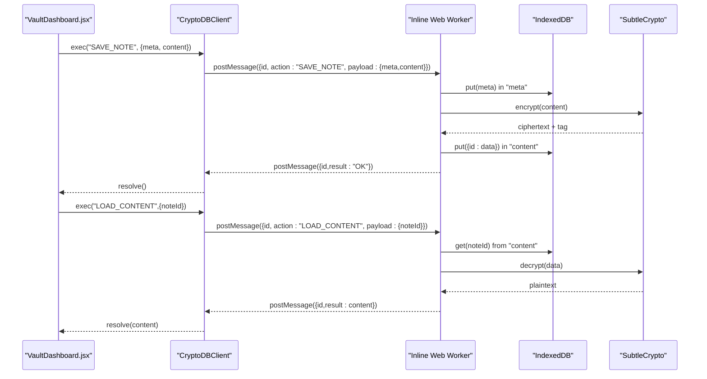
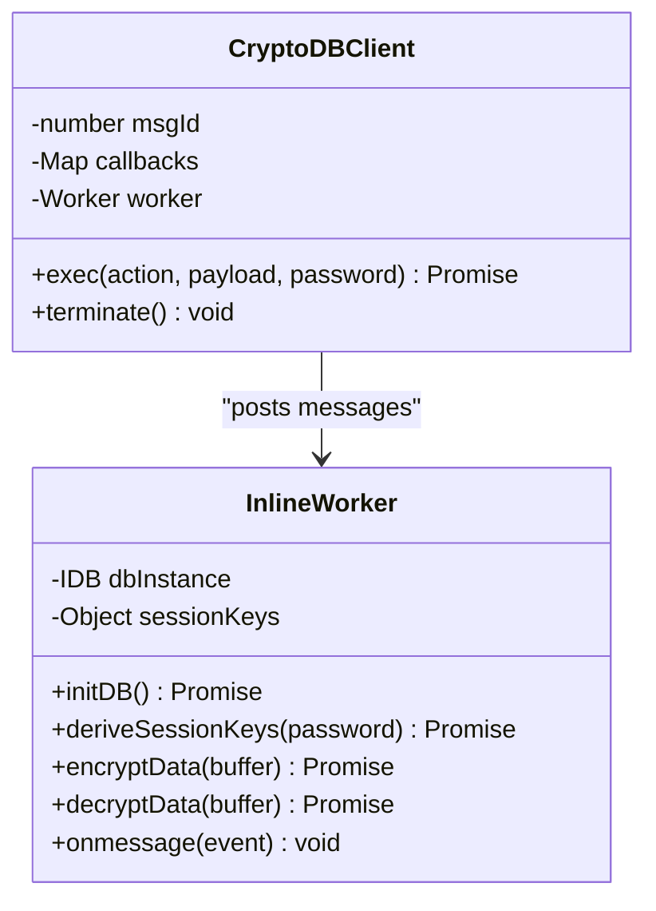
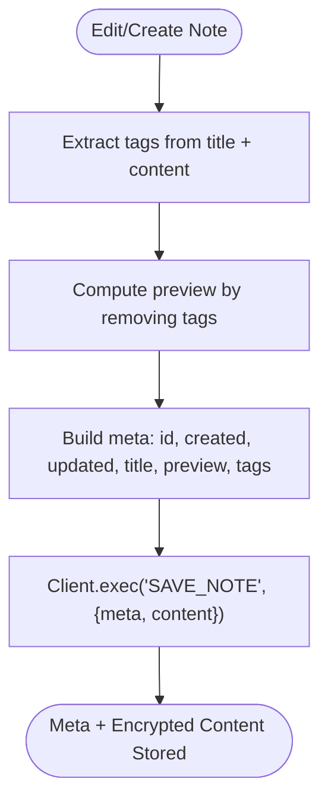
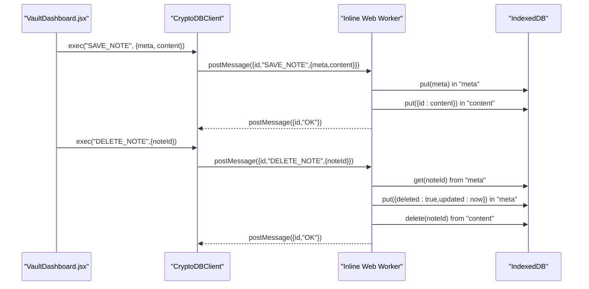
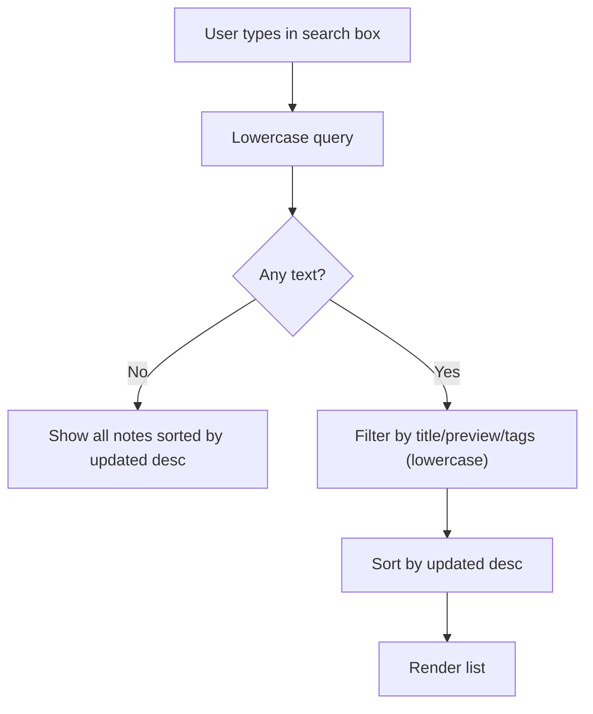
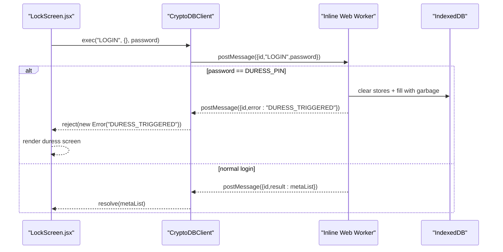
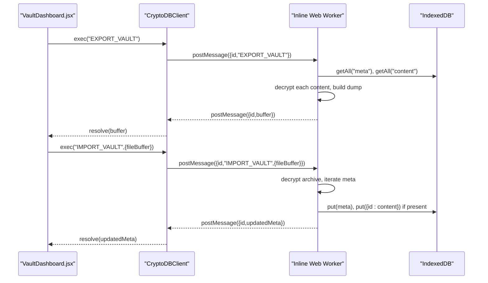
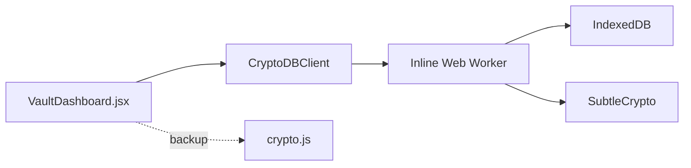

# Note System

<cite>
**Referenced Files in This Document**
- [App.jsx](file://src/App.jsx)
- [VaultDashboard.jsx](file://src/components/VaultDashboard.jsx)
- [LockScreen.jsx](file://src/components/LockScreen.jsx)
- [crypto.js](file://src/lib/crypto.js)
- [main.jsx](file://src/main.jsx)
</cite>

## Table of Contents
1. [Introduction](#introduction)
2. [Project Structure](#project-structure)
3. [Core Components](#core-components)
4. [Architecture Overview](#architecture-overview)
5. [Detailed Component Analysis](#detailed-component-analysis)
6. [Dependency Analysis](#dependency-analysis)
7. [Performance Considerations](#performance-considerations)
8. [Troubleshooting Guide](#troubleshooting-guide)
9. [Conclusion](#conclusion)

## Introduction
This document explains OMNI-TODO’s note management system with a focus on the encrypted note lifecycle: creation, editing, deletion, metadata handling, content encryption, and storage. It also covers note organization via tags and search, the IndexedDB-backed storage architecture, and the Web Worker-based encryption/decryption pipeline. The system integrates IndexedDB for persistent storage, SubtleCrypto for cryptographic operations, and a Web Worker to keep the UI responsive during heavy crypto workloads.

## Project Structure
The note system spans several modules:
- Application shell and Web Worker definition live in the main application file.
- The dashboard component orchestrates note CRUD, search, tag extraction, and auto-save.
- Lock screen handles authentication and duress behavior.
- A separate crypto library supports file-based vault encryption/decryption for backup/import/export.

```mermaid
graph TB
subgraph "UI Layer"
LS["LockScreen.jsx"]
VD["VaultDashboard.jsx"]
end
subgraph "App Layer"
APP["App.jsx<br/>CryptoDBClient + Inline Web Worker"]
end
subgraph "Storage Layer"
IDB["IndexedDB Stores:<br/>meta, content, system"]
end
subgraph "Crypto Layer"
SC["SubtleCrypto<br/>AES-GCM + HMAC"]
WKR["Web Worker<br/>Crypto Operations"]
end
subgraph "Backup Layer"
CRYPTOJS["crypto.js<br/>File-based Vault Encryption"]
end
LS --> APP
VD --> APP
APP <- --> WKR
WKR --> IDB
WKR --> SC
VD -. backup/export/import .-> CRYPTOJS
```

**Diagram sources**
- [App.jsx:10-164](file://src/App.jsx#L10-L164)
- [VaultDashboard.jsx:240-506](file://src/components/VaultDashboard.jsx#L240-L506)
- [LockScreen.jsx:5-91](file://src/components/LockScreen.jsx#L5-L91)
- [crypto.js:20-38](file://src/lib/crypto.js#L20-L38)

**Section sources**
- [App.jsx:10-164](file://src/App.jsx#L10-L164)
- [VaultDashboard.jsx:240-506](file://src/components/VaultDashboard.jsx#L240-L506)
- [LockScreen.jsx:5-91](file://src/components/LockScreen.jsx#L5-L91)
- [crypto.js:20-38](file://src/lib/crypto.js#L20-L38)

## Core Components
- CryptoDBClient: Manages a Web Worker, assigns message IDs, and resolves promises for each action.
- Inline Web Worker: Implements IndexedDB schema, session key derivation, encryption/decryption, and note operations.
- VaultDashboard: Provides the editor UI, handles note selection, auto-save, tag extraction, search, and CRUD actions.
- LockScreen: Handles unlock/create flows and duress PIN behavior.
- crypto.js: Provides file-based vault encryption/decryption and persistence helpers for export/import.

Key responsibilities:
- IndexedDB stores: meta (metadata), content (encrypted note bodies), system (master salt).
- Encryption: AES-GCM for confidentiality, HMAC for integrity.
- Session keys: derived per-session from the master password using PBKDF2.

**Section sources**
- [App.jsx:167-190](file://src/App.jsx#L167-L190)
- [App.jsx:10-164](file://src/App.jsx#L10-L164)
- [VaultDashboard.jsx:240-506](file://src/components/VaultDashboard.jsx#L240-L506)
- [LockScreen.jsx:5-91](file://src/components/LockScreen.jsx#L5-L91)
- [crypto.js:20-38](file://src/lib/crypto.js#L20-L38)

## Architecture Overview
The note lifecycle is handled asynchronously via the CryptoDBClient and the Web Worker. The UI triggers actions, the client posts messages to the worker, which performs IndexedDB transactions and cryptographic operations, then responds with results.



**Diagram sources**
- [App.jsx:99-104](file://src/App.jsx#L99-L104)
- [App.jsx:88-97](file://src/App.jsx#L88-L97)
- [VaultDashboard.jsx:276-300](file://src/components/VaultDashboard.jsx#L276-L300)
- [VaultDashboard.jsx:258-266](file://src/components/VaultDashboard.jsx#L258-L266)

**Section sources**
- [App.jsx:99-104](file://src/App.jsx#L99-L104)
- [App.jsx:88-97](file://src/App.jsx#L88-L97)
- [VaultDashboard.jsx:276-300](file://src/components/VaultDashboard.jsx#L276-L300)
- [VaultDashboard.jsx:258-266](file://src/components/VaultDashboard.jsx#L258-L266)

## Detailed Component Analysis

### CryptoDBClient and Inline Web Worker
- CryptoDBClient encapsulates a Web Worker and message routing. It assigns monotonically increasing IDs and resolves/rejects promises based on worker responses.
- The inline worker script defines IndexedDB stores, derives session keys from the master password, and implements:
  - LOGIN: checks duress PIN, derives keys, loads non-deleted metadata.
  - LOAD_CONTENT: retrieves encrypted content, decrypts, and returns plaintext.
  - SAVE_NOTE: persists metadata and encrypted content.
  - DELETE_NOTE: marks note deleted and removes content.
  - EXPORT_VAULT: dumps decrypted notes and re-encrypts the archive.
  - IMPORT_VAULT: merges incoming vault using last-write-wins semantics.



**Diagram sources**
- [App.jsx:167-190](file://src/App.jsx#L167-L190)
- [App.jsx:10-164](file://src/App.jsx#L10-L164)

**Section sources**
- [App.jsx:167-190](file://src/App.jsx#L167-L190)
- [App.jsx:10-164](file://src/App.jsx#L10-L164)

### Note Data Model and Metadata Handling
- Meta schema fields include: id, created, updated, title, preview, tags, deleted flag.
- Preview is generated by stripping tags from content.
- Tags are extracted from both title and content using a regular expression pattern.
- Sorting defaults to updated descending in the note list.



**Diagram sources**
- [VaultDashboard.jsx:276-300](file://src/components/VaultDashboard.jsx#L276-L300)
- [VaultDashboard.jsx:11-14](file://src/components/VaultDashboard.jsx#L11-L14)

**Section sources**
- [VaultDashboard.jsx:276-300](file://src/components/VaultDashboard.jsx#L276-L300)
- [VaultDashboard.jsx:11-14](file://src/components/VaultDashboard.jsx#L11-L14)

### CRUD Operations: SAVE_NOTE and DELETE_NOTE
- SAVE_NOTE:
  - UI computes tags and preview.
  - Client sends meta and content to worker.
  - Worker writes meta to meta store and encrypted content to content store.
- DELETE_NOTE:
  - Worker sets deleted=true and updates timestamp in meta store, deletes content record.



**Diagram sources**
- [App.jsx:99-104](file://src/App.jsx#L99-L104)
- [App.jsx:106-119](file://src/App.jsx#L106-L119)
- [VaultDashboard.jsx:276-300](file://src/components/VaultDashboard.jsx#L276-L300)
- [VaultDashboard.jsx:311-316](file://src/components/VaultDashboard.jsx#L311-L316)

**Section sources**
- [App.jsx:99-104](file://src/App.jsx#L99-L104)
- [App.jsx:106-119](file://src/App.jsx#L106-L119)
- [VaultDashboard.jsx:276-300](file://src/components/VaultDashboard.jsx#L276-L300)
- [VaultDashboard.jsx:311-316](file://src/components/VaultDashboard.jsx#L311-L316)

### Search and Tagging Features
- Search filters notes by title, preview, and tags.
- Tag sidebar lists unique tags and allows quick filtering.
- Active tag filter is supported alongside text search.



**Diagram sources**
- [VaultDashboard.jsx:32-42](file://src/components/VaultDashboard.jsx#L32-L42)

**Section sources**
- [VaultDashboard.jsx:32-42](file://src/components/VaultDashboard.jsx#L32-L42)

### Authentication and Duress Behavior
- LOGIN action derives session keys and returns non-deleted metadata.
- If the user enters the duress PIN, the worker performs a cryptographic shred of IndexedDB and throws a specific error.
- The UI interprets this error to show the duress screen.



**Diagram sources**
- [App.jsx:79-84](file://src/App.jsx#L79-L84)
- [App.jsx:80-80](file://src/App.jsx#L80-L80)
- [App.jsx:44-51](file://src/App.jsx#L44-L51)
- [LockScreen.jsx:5-91](file://src/components/LockScreen.jsx#L5-L91)

**Section sources**
- [App.jsx:79-84](file://src/App.jsx#L79-L84)
- [App.jsx:80-80](file://src/App.jsx#L80-L80)
- [App.jsx:44-51](file://src/App.jsx#L44-L51)
- [LockScreen.jsx:5-91](file://src/components/LockScreen.jsx#L5-L91)

### Backup and Restore: Export/Import
- EXPORT_VAULT:
  - Decrypts all stored notes and packages them with metadata into a single archive.
  - Re-encrypts the archive with the current session keys and returns the buffer.
- IMPORT_VAULT:
  - Decrypts the uploaded archive.
  - Merges metadata using last-write-wins semantics and re-encrypts missing content records.



**Diagram sources**
- [App.jsx:120-133](file://src/App.jsx#L120-L133)
- [App.jsx:134-161](file://src/App.jsx#L134-L161)
- [VaultDashboard.jsx:141-171](file://src/components/VaultDashboard.jsx#L141-L171)

**Section sources**
- [App.jsx:120-133](file://src/App.jsx#L120-L133)
- [App.jsx:134-161](file://src/App.jsx#L134-L161)
- [VaultDashboard.jsx:141-171](file://src/components/VaultDashboard.jsx#L141-L171)

### File-Based Vault Encryption (Backup/Restore)
While the primary note storage uses IndexedDB inside the Web Worker, the UI also supports exporting/importing a file-based vault using a different encryption scheme. This complements the in-app backup/export/import features.

- Encryption: PBKDF2-derived AES-GCM key with random salt/IV.
- Decryption: Validates format and derives key from password.
- Persistence: LocalStorage for vault file content; File System Access API for downloads/saves.

**Section sources**
- [crypto.js:20-38](file://src/lib/crypto.js#L20-L38)
- [crypto.js:43-60](file://src/lib/crypto.js#L43-L60)
- [crypto.js:81-110](file://src/lib/crypto.js#L81-L110)

## Dependency Analysis
- UI depends on CryptoDBClient for all note operations.
- CryptoDBClient depends on the Inline Web Worker.
- The Web Worker depends on IndexedDB and SubtleCrypto.
- Export/Import uses the file-based crypto module independently of the Web Worker.



**Diagram sources**
- [App.jsx:167-190](file://src/App.jsx#L167-L190)
- [VaultDashboard.jsx:240-506](file://src/components/VaultDashboard.jsx#L240-L506)
- [crypto.js:20-38](file://src/lib/crypto.js#L20-L38)

**Section sources**
- [App.jsx:167-190](file://src/App.jsx#L167-L190)
- [VaultDashboard.jsx:240-506](file://src/components/VaultDashboard.jsx#L240-L506)
- [crypto.js:20-38](file://src/lib/crypto.js#L20-L38)

## Performance Considerations
- Auto-save debouncing: Changes debounce after 1.5 seconds to reduce IndexedDB write frequency.
- Encryption cost: AES-GCM and HMAC are performed in the Web Worker to avoid blocking the UI thread.
- IndexedDB batching: SAVE_NOTE writes meta and content in separate transactions; consider grouping related writes if needed.
- Large collections: Filtering/search is client-side; consider virtualization for very large note sets.
- Export/Import: Full decryption/encryption of all notes occurs in the worker; avoid triggering during frequent edits.

[No sources needed since this section provides general guidance]

## Troubleshooting Guide
Common issues and resolutions:
- Corrupted data or wrong password:
  - LOGIN returns an error; the UI displays a user-friendly message and does not unlock.
  - Export/Import errors surface as generic failures; verify the password and file integrity.
- Duress PIN triggered:
  - Entering the duress PIN causes a cryptographic shred of IndexedDB and renders a duress screen.
- Decryption errors:
  - LOAD_CONTENT catches decryption errors and returns empty content; check for tampering or storage corruption.
- Integrity compromise:
  - HMAC verification failures cause decryption to fail; indicates tampering or data corruption.

**Section sources**
- [App.jsx:216-226](file://src/App.jsx#L216-L226)
- [App.jsx:80-80](file://src/App.jsx#L80-L80)
- [App.jsx:94-96](file://src/App.jsx#L94-L96)
- [App.jsx:127-129](file://src/App.jsx#L127-L129)
- [VaultDashboard.jsx:141-171](file://src/components/VaultDashboard.jsx#L141-L171)

## Conclusion
OMNI-TODO’s note system combines IndexedDB-backed encrypted storage with a Web Worker to deliver secure, responsive note management. The CryptoDBClient abstracts asynchronous operations, while the worker enforces strong cryptography and robust storage semantics. Users benefit from tag-based organization, search, auto-save, and safe backup/restore workflows, all while keeping sensitive data encrypted at rest and in transit.