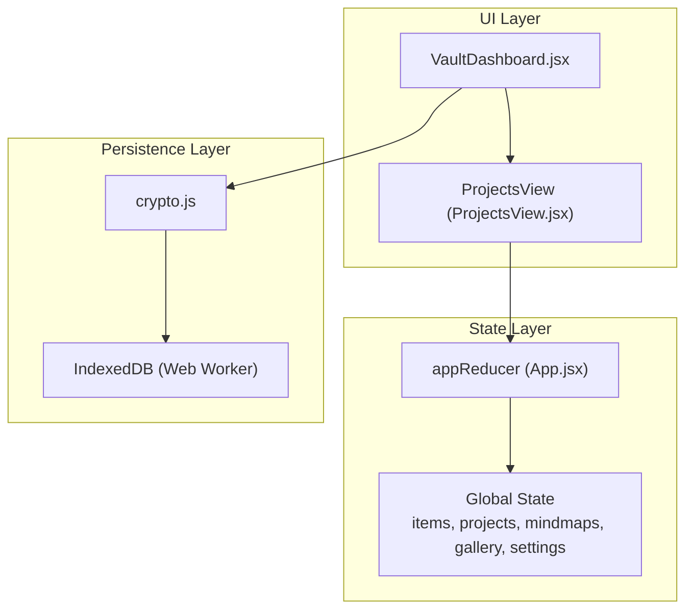
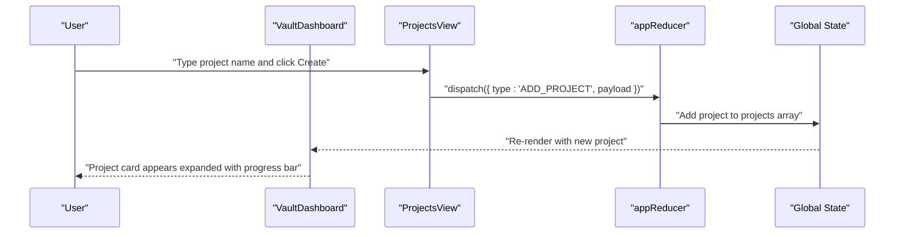
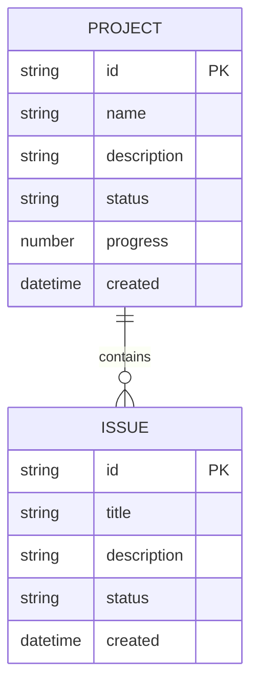
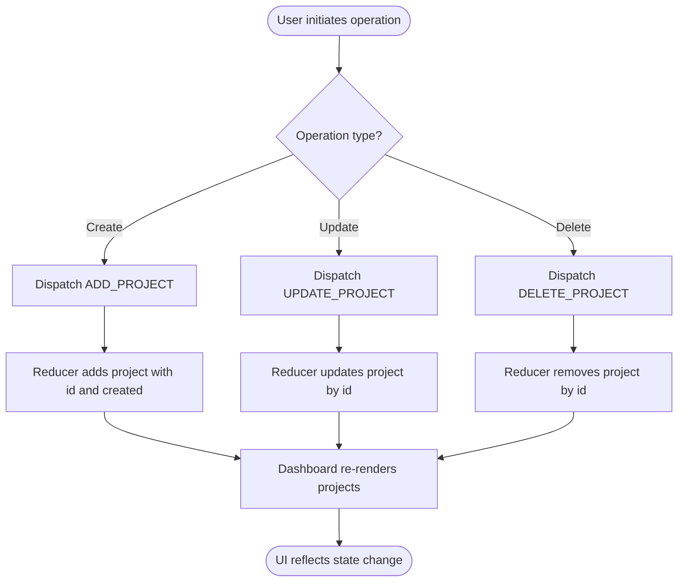
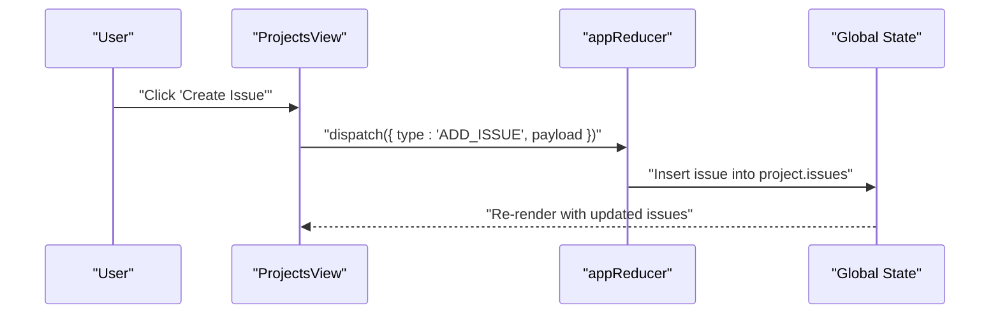
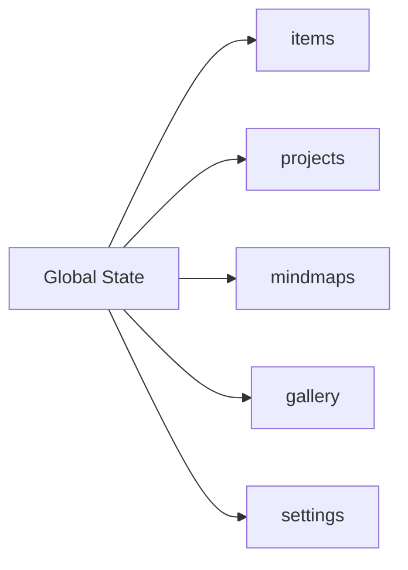
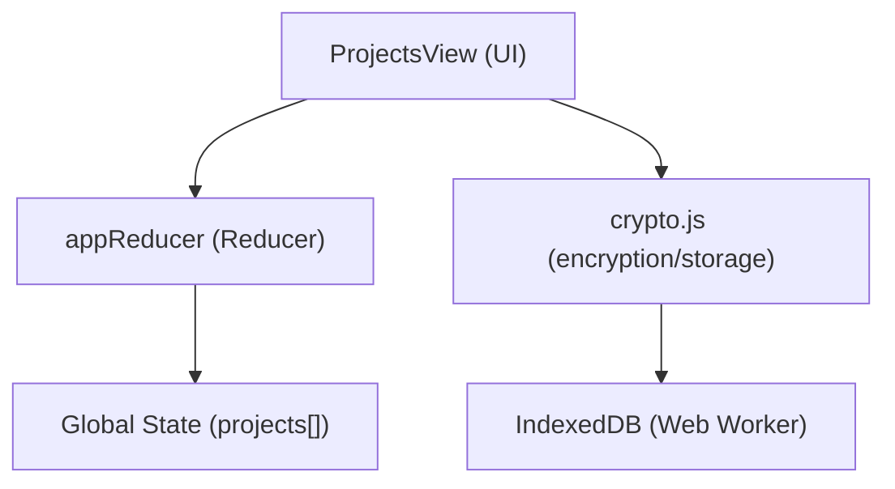

# Project Management

<cite>
**Referenced Files in This Document**
- [README.md](file://README.md)
- [src/App.jsx](file://src/App.jsx)
- [src/components/VaultDashboard.jsx](file://src/components/VaultDashboard.jsx)
- [src/lib/crypto.js](file://src/lib/crypto.js)
- [src/main.jsx](file://src/main.jsx)
</cite>

## Table of Contents
1. [Introduction](#introduction)
2. [Project Structure](#project-structure)
3. [Core Components](#core-components)
4. [Architecture Overview](#architecture-overview)
5. [Detailed Component Analysis](#detailed-component-analysis)
6. [Dependency Analysis](#dependency-analysis)
7. [Performance Considerations](#performance-considerations)
8. [Troubleshooting Guide](#troubleshooting-guide)
9. [Conclusion](#conclusion)

## Introduction
This document explains OMNI-TODO’s project management capabilities as implemented in the current codebase. It focuses on the project data model, state transitions via the reducer, UI views for project creation and expansion, and integration with the broader state management and persistence layers. It also outlines how projects relate to other data types (notes, mindmaps, gallery) and how data is persisted and exported.

## Project Structure
The project management features are primarily implemented in the dashboard and reducer layers:
- The global state reducer defines project-related actions and initializes the projects array.
- The dashboard renders a dedicated “Projects” view that allows creating, expanding, and deleting projects.
- Persistence is handled by a separate encryption and storage layer, which is used by the vault note system and can be extended for projects.

**Diagram sources**
- [src/components/VaultDashboard.jsx:1389-1540](file://src/components/VaultDashboard.jsx#L1389-L1540)
- [src/App.jsx:265-306](file://src/App.jsx#L265-L306)
- [src/lib/crypto.js:1-112](file://src/lib/crypto.js#L1-L112)

**Section sources**
- [src/App.jsx:265-306](file://src/App.jsx#L265-L306)
- [src/components/VaultDashboard.jsx:1389-1540](file://src/components/VaultDashboard.jsx#L1389-L1540)
- [src/lib/crypto.js:1-112](file://src/lib/crypto.js#L1-L112)

## Core Components
- Global state shape includes a projects array alongside items, mindmaps, gallery, and settings.
- The reducer supports:
  - ADD_PROJECT: creates a new project with id, created timestamp, and empty issues array.
  - UPDATE_PROJECT: updates an existing project by id.
  - DELETE_PROJECT: removes a project by id.
- The ProjectsView provides:
  - A form to create a new project with default status and progress.
  - Collapsible project cards showing created date and issue count.
  - Delete controls per project.

These components together enable basic project lifecycle management within the app state.

**Section sources**
- [src/App.jsx:265-306](file://src/App.jsx#L265-L306)
- [src/components/VaultDashboard.jsx:911-1033](file://src/components/VaultDashboard.jsx#L911-L1033)

## Architecture Overview
The project management flow integrates UI, state, and persistence:

**Diagram sources**
- [src/components/VaultDashboard.jsx:911-952](file://src/components/VaultDashboard.jsx#L911-L952)
- [src/App.jsx:273-288](file://src/App.jsx#L273-L288)

## Detailed Component Analysis

### Project Data Model
- Project record fields:
  - id: unique identifier
  - created: ISO timestamp
  - issues: array of issues (initially empty)
  - name: string
  - description: string
  - status: string (default initialized to a planning state)
  - progress: number (default initialized to 0)

- Initialization and updates:
  - Creation action adds a project with defaults.
  - Update action replaces a project by id.
  - Deletion action removes a project by id.

**Diagram sources**
- [src/App.jsx:281-288](file://src/App.jsx#L281-L288)

**Section sources**
- [src/App.jsx:265-306](file://src/App.jsx#L265-L306)

### Project Lifecycle Operations
- Creation:
  - UI triggers dispatch with ADD_PROJECT and payload containing name, description, status, progress.
  - Reducer appends a new project with id and created timestamp.
- Updates:
  - UI can update project fields; dispatch triggers UPDATE_PROJECT.
  - Reducer replaces the project by id.
- Deletion:
  - UI triggers DELETE_PROJECT with the project id.
  - Reducer filters the project from the array.

**Diagram sources**
- [src/components/VaultDashboard.jsx:916-928](file://src/components/VaultDashboard.jsx#L916-L928)
- [src/App.jsx:281-288](file://src/App.jsx#L281-L288)

**Section sources**
- [src/components/VaultDashboard.jsx:911-1033](file://src/components/VaultDashboard.jsx#L911-L1033)
- [src/App.jsx:273-288](file://src/App.jsx#L273-L288)

### Issue Tracking Within Projects
- Current state:
  - Projects include an issues array.
  - The ProjectsView UI exposes buttons to “Create Issue” and open a “Board,” but does not render or manage issues in the current code.
- Future extension points:
  - Define issue actions (ADD_ISSUE, UPDATE_ISSUE, DELETE_ISSUE) in the reducer.
  - Add UI to list and edit issues inside the expanded project card.
  - Integrate status and resolution workflows (open, in-progress, review, done).

**Diagram sources**
- [src/components/VaultDashboard.jsx:1008-1015](file://src/components/VaultDashboard.jsx#L1008-L1015)
- [src/App.jsx:273-288](file://src/App.jsx#L273-L288)

**Section sources**
- [src/components/VaultDashboard.jsx:954-1018](file://src/components/VaultDashboard.jsx#L954-L1018)
- [src/App.jsx:281-288](file://src/App.jsx#L281-L288)

### Progress Monitoring, Team Collaboration, and Milestone Tracking
- Progress monitoring:
  - ProjectsView displays a progress bar and percentage; UI allows updating progress.
- Team collaboration:
  - No explicit team or assignee fields are present in the current project model.
- Milestone tracking:
  - No milestones are modeled in the current project data.

Recommendations for future enhancement:
- Add fields: teamMembers[], milestones[], dueDate, priority.
- Extend reducer with actions to manage milestones and assignees.
- Add UI panels for team members and milestone lists.

**Section sources**
- [src/components/VaultDashboard.jsx:994-1006](file://src/components/VaultDashboard.jsx#L994-L1006)

### Integration with State Management and Other Data Types
- Projects share the global state with:
  - items: used by the “Base” view for ideas/tasks/links.
  - mindmaps: separate from projects.
  - gallery: unrelated to projects.
  - settings: theme and lock timeout.
- Persistence:
  - The vault note system uses a separate encryption/storage pipeline (not tied to projects).
  - Projects can be persisted by exporting/importing the global state JSON or by extending the vault pipeline to include projects.

**Diagram sources**
- [src/App.jsx:265-271](file://src/App.jsx#L265-L271)

**Section sources**
- [src/App.jsx:265-306](file://src/App.jsx#L265-L306)
- [src/components/VaultDashboard.jsx:1389-1540](file://src/components/VaultDashboard.jsx#L1389-L1540)

### Examples of Project Operations, State Transitions, and Persistence Patterns
- Example: Create a project
  - UI: ProjectsView form captures name.
  - Dispatch: ADD_PROJECT with payload { name, description: "", status: "planning", progress: 0 }.
  - Reducer: Append project with id and created timestamp.
  - UI: Project card expands with progress bar.
- Example: Update progress
  - UI: Slider or input updates project.progress.
  - Dispatch: UPDATE_PROJECT with id and new progress.
  - Reducer: Replace project by id.
- Example: Delete a project
  - UI: Click trash icon confirms deletion.
  - Dispatch: DELETE_PROJECT with id.
  - Reducer: Filter project from array.
- Persistence pattern:
  - Export state JSON from SettingsView.
  - Import JSON back via LOAD action to restore projects.

**Section sources**
- [src/components/VaultDashboard.jsx:916-928](file://src/components/VaultDashboard.jsx#L916-L928)
- [src/components/VaultDashboard.jsx:1188-1386](file://src/components/VaultDashboard.jsx#L1188-L1386)
- [src/App.jsx:281-288](file://src/App.jsx#L281-L288)

## Dependency Analysis
- UI depends on the reducer for state mutations.
- The reducer operates on the global state object.
- Persistence is handled by a separate module and is not currently wired to projects.

**Diagram sources**
- [src/components/VaultDashboard.jsx:911-1033](file://src/components/VaultDashboard.jsx#L911-L1033)
- [src/App.jsx:273-306](file://src/App.jsx#L273-L306)
- [src/lib/crypto.js:1-112](file://src/lib/crypto.js#L1-L112)

**Section sources**
- [src/components/VaultDashboard.jsx:1389-1540](file://src/components/VaultDashboard.jsx#L1389-L1540)
- [src/App.jsx:273-306](file://src/App.jsx#L273-L306)
- [src/lib/crypto.js:1-112](file://src/lib/crypto.js#L1-L112)

## Performance Considerations
- Project rendering uses animated layout; keep the projects list reasonably sized to avoid layout thrashing.
- Avoid frequent deep updates to project objects; batch updates when possible.
- Persisting large states can be expensive; consider incremental saves or debounced exports.

## Troubleshooting Guide
- Project not appearing after creation:
  - Verify dispatch is called with ADD_PROJECT and payload includes required fields.
  - Confirm reducer appends to projects and UI re-renders.
- Progress bar not updating:
  - Ensure UPDATE_PROJECT is dispatched with the project id and progress field.
- Deleting a project fails:
  - Confirm DELETE_PROJECT payload is the numeric id and reducer filters correctly.

**Section sources**
- [src/components/VaultDashboard.jsx:916-928](file://src/components/VaultDashboard.jsx#L916-L928)
- [src/App.jsx:281-288](file://src/App.jsx#L281-L288)

## Conclusion
OMNI-TODO provides a foundational project management system with a clean data model and reducer-driven state updates. Projects support creation, updates, and deletion, with UI scaffolding for progress monitoring and issue creation. Extending the system to include full issue tracking, team collaboration, and milestone management would align with current UI patterns and state design.