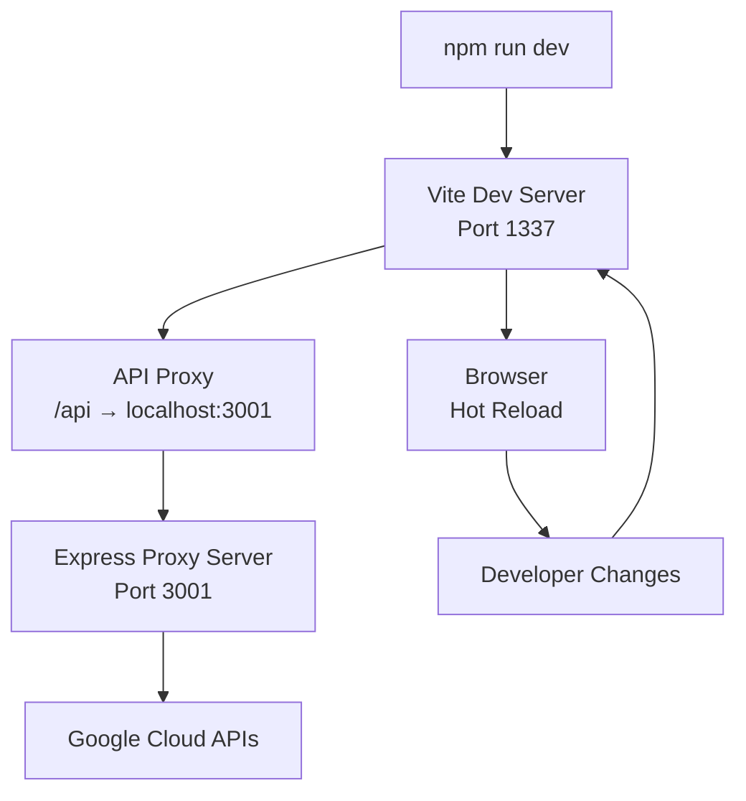
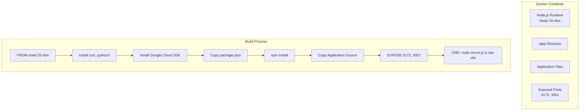
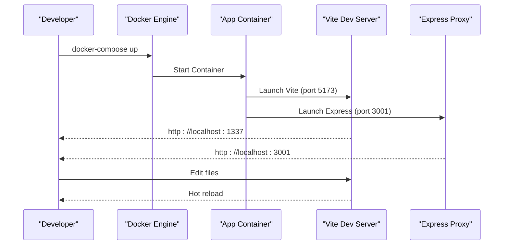
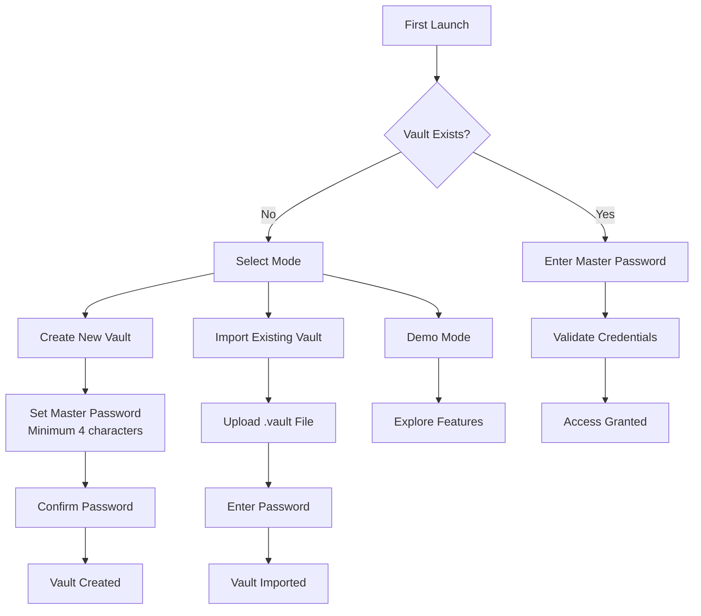
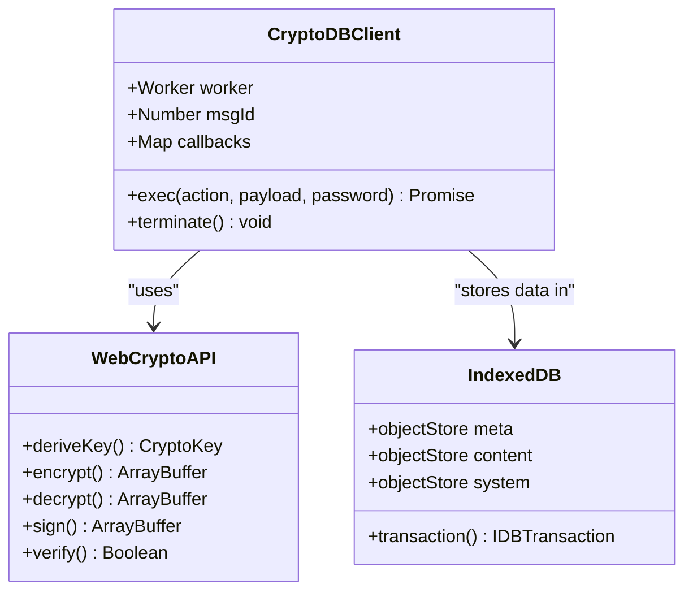
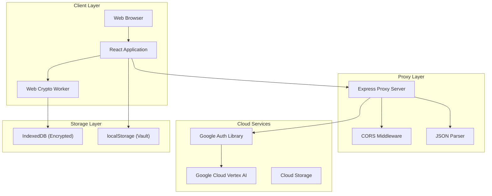
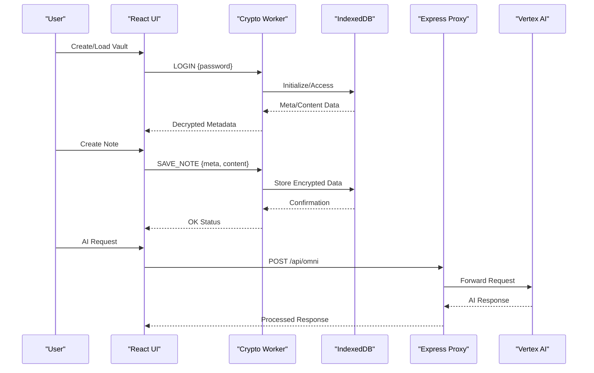

# Getting Started

<cite>
**Referenced Files in This Document**
- [README.md](file://README.md)
- [package.json](file://package.json)
- [vite.config.js](file://vite.config.js)
- [Dockerfile](file://Dockerfile)
- [docker-compose.yml](file://docker-compose.yml)
- [server.js](file://server.js)
- [src/main.jsx](file://src/main.jsx)
- [src/App.jsx](file://src/App.jsx)
- [src/lib/crypto.js](file://src/lib/crypto.js)
- [src/components/LockScreen.jsx](file://src/components/LockScreen.jsx)
- [src/components/VaultDashboard.jsx](file://src/components/VaultDashboard.jsx)
- [tailwind.config.js](file://tailwind.config.js)
- [index.html](file://index.html)
- [src/index.css](file://src/index.css)
</cite>

## Table of Contents
1. [Introduction](#introduction)
2. [Prerequisites](#prerequisites)
3. [Installation](#installation)
4. [Local Development Setup](#local-development-setup)
5. [Docker Containerization](#docker-containerization)
6. [First Run and Initial Setup](#first-run-and-initial-setup)
7. [Basic Usage Examples](#basic-usage-examples)
8. [Architecture Overview](#architecture-overview)
9. [Troubleshooting Guide](#troubleshooting-guide)
10. [Conclusion](#conclusion)

## Introduction
OMNI-TODO is a React-based secure note-taking and personal assistant application with integrated AI capabilities. It features:
- Encrypted local storage using modern web cryptography
- Real-time AI assistance via Google Cloud Vertex AI
- Rich media generation and gallery management
- Cross-platform productivity workflows

The application combines a modern React frontend with a lightweight Express proxy server for cloud integrations, all containerized for easy deployment.

## Prerequisites
Before installing OMNI-TODO, ensure you have the following knowledge and tools:

### JavaScript/ES6 Knowledge
- Modern JavaScript syntax (arrow functions, destructuring, async/await)
- ES6 modules and import/export statements
- DOM manipulation and event handling
- Understanding of promises and async programming patterns

### React Fundamentals
- Component-based architecture and JSX syntax
- React hooks (useState, useEffect, useRef)
- Props and component composition
- State management patterns
- Event handling and form processing

### Encryption Concepts
- Symmetric encryption (AES-GCM)
- Asymmetric encryption basics
- Cryptographic key derivation (PBKDF2)
- Message authentication codes (HMAC)
- Secure random number generation
- Cryptographic storage patterns

### Node.js Basics
- Package management with npm/yarn
- Module system and require/import
- Express.js fundamentals
- Environment variables and configuration
- Process management and scripting

### Docker Containerization Understanding
- Docker fundamentals and container concepts
- Dockerfile best practices
- Multi-stage builds and layer optimization
- Volume mounting and persistent storage
- Port mapping and networking
- Environment variable injection
- Compose orchestration patterns

## Installation

### Prerequisites Check
Ensure you have the following installed:
- Node.js 18+ (LTS recommended)
- npm 8+ or yarn
- Git for version control
- Docker Desktop (for containerized deployment)

### Clone and Initialize
```bash
git clone <repository-url>
cd omni-todo
npm install
```

### Environment Setup
Create a `.env` file in the project root:
```env
NODE_ENV=development
PORT=3001
GOOGLE_APPLICATION_CREDENTIALS=/path/to/service-account.json
```

**Section sources**
- [package.json:1-40](file://package.json#L1-L40)
- [server.js:1-135](file://server.js#L1-L135)

## Local Development Setup

### Development Server Configuration
The project uses Vite for fast development with hot module replacement:



**Diagram sources**
- [vite.config.js:1-19](file://vite.config.js#L1-L19)
- [server.js:1-135](file://server.js#L1-L135)

### Development Scripts
Available npm scripts:
- `npm run dev`: Start development server with hot reload
- `npm run build`: Production build with Vite
- `npm run preview`: Preview production build locally
- `npm run lint`: Run ESLint for code quality

### Hot Reload and Debugging
- Automatic browser refresh on file changes
- Source map support for debugging
- Console logging for development errors
- React Developer Tools compatibility

**Section sources**
- [vite.config.js:1-19](file://vite.config.js#L1-L19)
- [package.json:6-11](file://package.json#L6-L11)

## Docker Containerization

### Docker Build Process
The application uses a multi-service Docker setup:



**Diagram sources**
- [Dockerfile:1-32](file://Dockerfile#L1-L32)

### Service Orchestration
Docker Compose manages the development environment:



**Diagram sources**
- [docker-compose.yml:1-18](file://docker-compose.yml#L1-L18)
- [Dockerfile:23-32](file://Dockerfile#L23-L32)

### Container Configuration
Key Docker settings:
- Base image: node:20-slim (optimized size)
- Working directory: /app
- Port exposure: 5173 (Vite), 3001 (Express)
- Volume mounts for development
- Environment variable injection
- Restart policies for reliability

**Section sources**
- [Dockerfile:1-32](file://Dockerfile#L1-L32)
- [docker-compose.yml:1-18](file://docker-compose.yml#L1-L18)

## First Run and Initial Setup

### Initial Vault Creation
The application provides three ways to initialize your vault:



**Diagram sources**
- [src/components/LockScreen.jsx:98-221](file://src/components/LockScreen.jsx#L98-L221)
- [src/App.jsx:316-370](file://src/App.jsx#L316-L370)

### Master Password Configuration
Security guidelines for master passwords:
- Minimum 8 characters recommended
- Mix of letters, numbers, and special characters
- Avoid dictionary words or personal information
- Never reuse passwords from other services
- Store securely using a password manager

### Encryption Implementation
The vault uses modern cryptographic standards:



**Diagram sources**
- [src/App.jsx:167-190](file://src/App.jsx#L167-L190)
- [src/lib/crypto.js:1-112](file://src/lib/crypto.js#L1-L112)

**Section sources**
- [src/components/LockScreen.jsx:98-221](file://src/components/LockScreen.jsx#L98-L221)
- [src/App.jsx:316-407](file://src/App.jsx#L316-L407)
- [src/lib/crypto.js:1-112](file://src/lib/crypto.js#L1-L112)

## Basic Usage Examples

### Creating Your First Note
1. Open the application in your browser
2. Select "Create New Vault" on the lock screen
3. Enter your master password twice
4. Click "Create" to initialize your vault
5. Navigate to the Notes tab
6. Click "New Note" to create your first encrypted note
7. Type your content and save automatically after typing

### Using the AI Assistant
1. Go to the "OMNI AI" tab
2. Type your request in the input field
3. Press Enter or click Send
4. Review the AI response in the chat interface
5. Execute suggested actions by clicking the action buttons

### Generating Images
1. Navigate to the "Gallery" tab
2. Enter a descriptive prompt in the input field
3. Click "Create" or press Enter
4. View generated images in the gallery
5. Click any image to expand and view details

### Exporting and Importing Data
1. Go to Settings → Management
2. Click "Export .vault (Encrypted)"
3. Save the .vault file to your preferred location
4. To restore, upload the .vault file during unlock
5. Enter your master password to access restored data

**Section sources**
- [src/components/VaultDashboard.jsx:746-907](file://src/components/VaultDashboard.jsx#L746-L907)
- [src/components/VaultDashboard.jsx:1035-1186](file://src/components/VaultDashboard.jsx#L1035-L1186)
- [src/components/VaultDashboard.jsx:1188-1386](file://src/components/VaultDashboard.jsx#L1188-L1386)

## Architecture Overview

### System Architecture
The application follows a modern web architecture pattern:



**Diagram sources**
- [src/main.jsx:1-11](file://src/main.jsx#L1-L11)
- [src/App.jsx:167-190](file://src/App.jsx#L167-L190)
- [server.js:1-135](file://server.js#L1-L135)

### Component Interaction Flow


**Diagram sources**
- [src/App.jsx:216-233](file://src/App.jsx#L216-L233)
- [src/App.jsx:99-105](file://src/App.jsx#L99-L105)
- [server.js:21-81](file://server.js#L21-L81)

**Section sources**
- [src/main.jsx:1-11](file://src/main.jsx#L1-L11)
- [src/App.jsx:167-190](file://src/App.jsx#L167-L190)
- [server.js:1-135](file://server.js#L1-L135)

## Troubleshooting Guide

### Common Development Issues

#### Port Conflicts
**Problem**: Port 1337 or 3001 already in use
**Solution**: 
```bash
# Find processes using the ports
lsof -i :1337
lsof -i :3001

# Kill conflicting processes or change ports in configuration
```

#### CORS Errors
**Problem**: Cross-origin requests blocked
**Solution**: Verify CORS middleware is properly configured
```javascript
// server.js should include:
app.use(cors());
```

#### Google Cloud Authentication
**Problem**: AI features unavailable
**Solution**: 
1. Set up Application Default Credentials
2. Verify GOOGLE_APPLICATION_CREDENTIALS environment variable
3. Test credentials with gcloud auth application-default login

#### Docker Build Issues
**Problem**: Container fails to start
**Solution**:
```bash
# Rebuild with cache clearing
docker-compose build --no-cache

# Check container logs
docker-compose logs app

# Verify volume mounts
docker-compose config
```

### Environment-Specific Problems

#### Windows Development
- Use WSL2 for optimal Docker performance
- Ensure Windows Defender doesn't block Docker
- Use PowerShell instead of Command Prompt for better compatibility

#### macOS Development
- Allocate sufficient RAM to Docker Desktop (8GB+ recommended)
- Ensure proper file permissions for mounted volumes
- Use Rosetta for ARM64 emulation if needed

#### Linux Development
- Add user to docker group: `sudo usermod -aG docker $USER`
- Configure firewall for exposed ports
- Use systemd for automatic startup

### Performance Optimization
- Enable production builds for performance testing
- Monitor bundle size with Vite's built-in analyzer
- Optimize asset loading and lazy imports
- Use browser caching for static resources

**Section sources**
- [server.js:10-11](file://server.js#L10-L11)
- [vite.config.js:7-17](file://vite.config.js#L7-L17)
- [Dockerfile:23-32](file://Dockerfile#L23-L32)

## Conclusion
OMNI-TODO provides a secure, feature-rich platform for personal knowledge management with integrated AI assistance. The combination of modern React development practices, robust encryption, and cloud integration creates a powerful yet accessible productivity tool.

Key benefits:
- End-to-end encryption ensures data privacy
- AI integration enhances productivity workflows
- Containerized deployment simplifies setup and scaling
- Modular architecture supports future feature expansion
- Comprehensive backup and export capabilities

For continued development, consider implementing additional security features, expanding AI capabilities, and adding collaborative features while maintaining the current security-first approach.