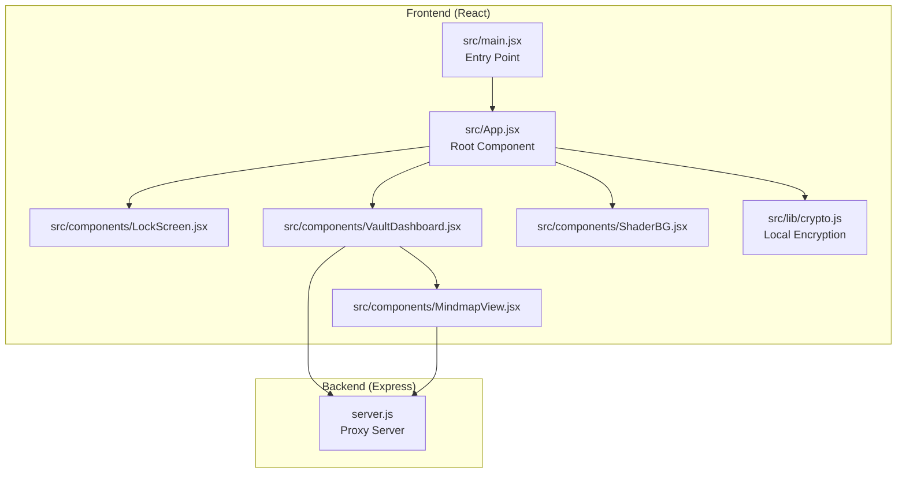
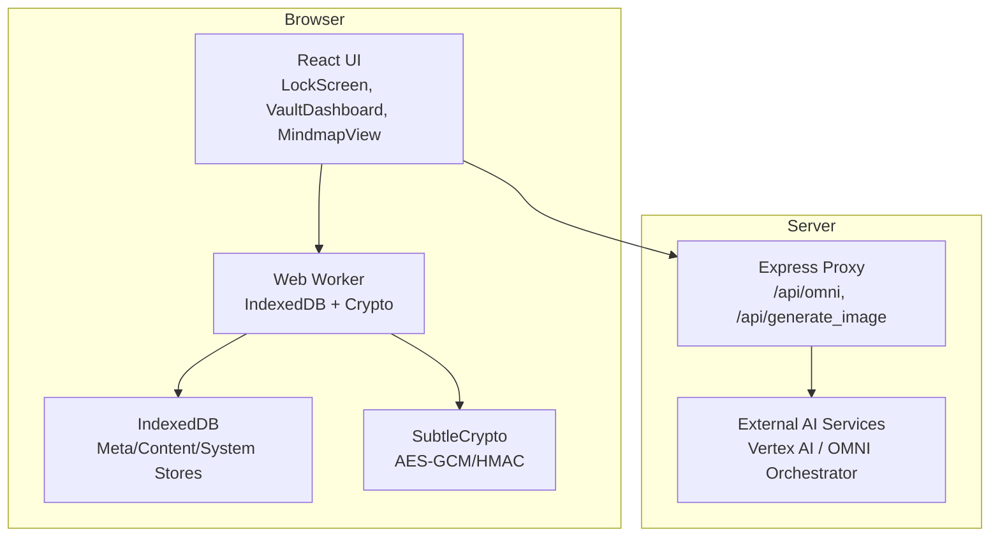
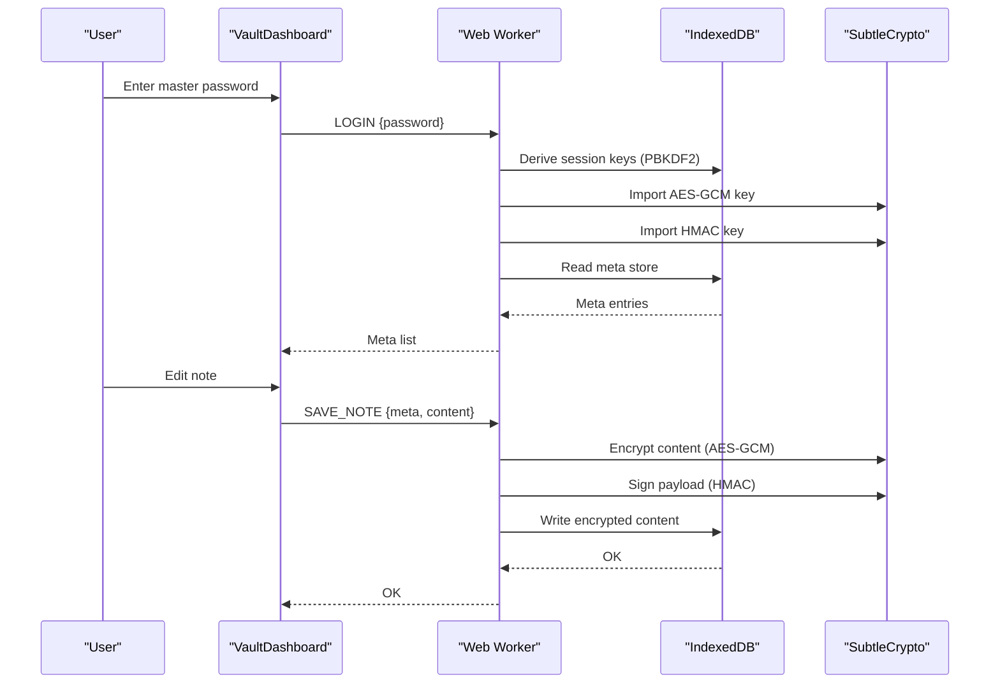
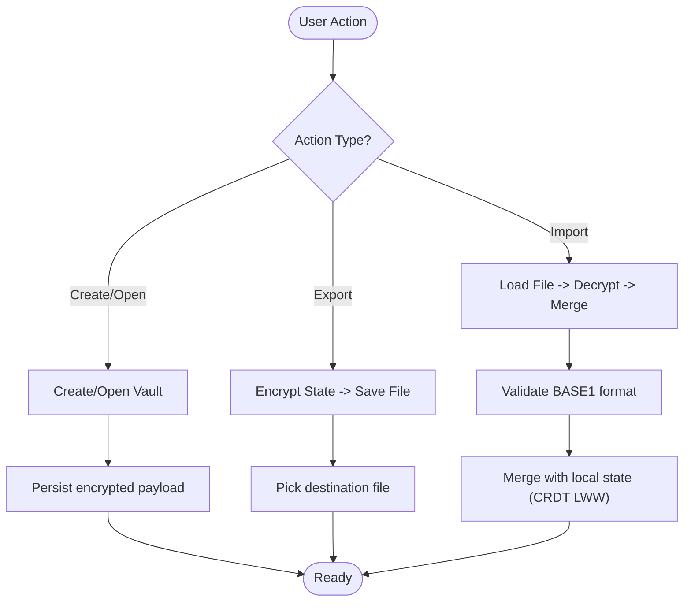
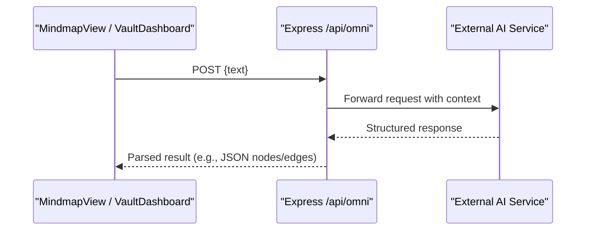
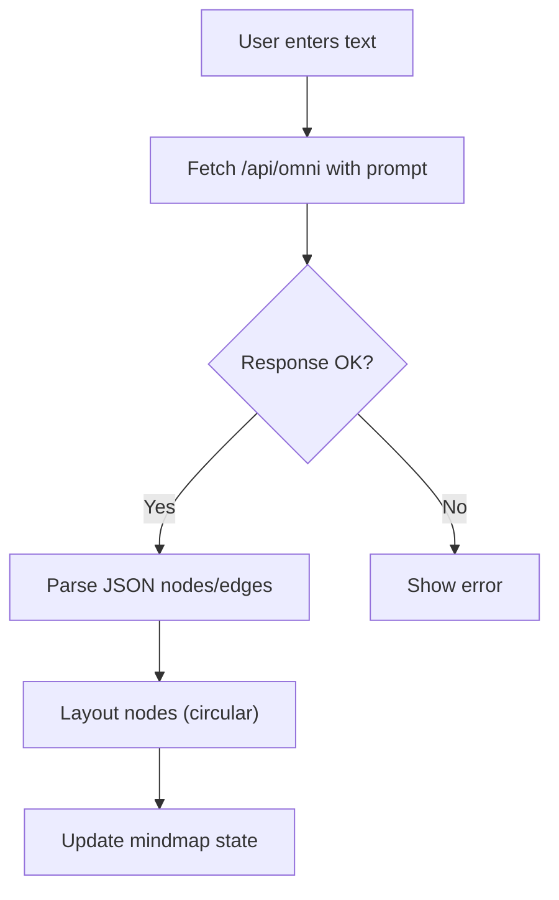
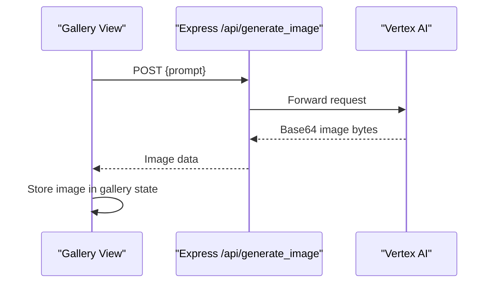
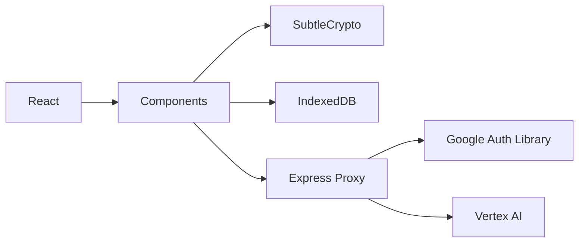

# Project Overview

<cite>
**Referenced Files in This Document**
- [README.md](file://README.md)
- [package.json](file://package.json)
- [server.js](file://server.js)
- [src/lib/crypto.js](file://src/lib/crypto.js)
- [src/App.jsx](file://src/App.jsx)
- [src/main.jsx](file://src/main.jsx)
- [src/components/LockScreen.jsx](file://src/components/LockScreen.jsx)
- [src/components/VaultDashboard.jsx](file://src/components/VaultDashboard.jsx)
- [src/components/MindmapView.jsx](file://src/components/MindmapView.jsx)
- [src/components/ShaderBG.jsx](file://src/components/ShaderBG.jsx)
</cite>

## Table of Contents
1. [Introduction](#introduction)
2. [Project Structure](#project-structure)
3. [Core Components](#core-components)
4. [Architecture Overview](#architecture-overview)
5. [Detailed Component Analysis](#detailed-component-analysis)
6. [Dependency Analysis](#dependency-analysis)
7. [Performance Considerations](#performance-considerations)
8. [Troubleshooting Guide](#troubleshooting-guide)
9. [Conclusion](#conclusion)

## Introduction
OMNI-TODO is a secure personal knowledge management application designed to keep your sensitive data private while enabling powerful productivity features. It implements a zero-knowledge architecture where encryption and decryption occur locally in your browser, ensuring that no plaintext data ever leaves your device. The application combines a React frontend with a lightweight Express proxy server for AI integrations, delivering a seamless experience for secure note-taking, AI-powered content generation, mind mapping, and image gallery management.

Key value propositions:
- Zero-knowledge architecture: Your data remains encrypted at rest and in transit, protected by a master password known only to you.
- Master password protection: Strong PBKDF2-derived keys protect your vault; a duress PIN triggers cryptographic shredding to prevent forced disclosure.
- Web Worker encryption: All cryptographic operations run inside a dedicated Web Worker, isolating sensitive logic from the main thread and preventing memory leaks.
- Local-first design: Encrypted vaults persist in IndexedDB and can be exported/imported as .vault files for backup and synchronization.

Target audience:
- Privacy-conscious professionals who need secure note-taking and project planning.
- Researchers and writers managing sensitive research materials.
- Developers seeking a zero-trust personal knowledge base with AI augmentation.

## Project Structure
The project follows a modern React + Vite frontend architecture with a small Express proxy server for AI services. The frontend is organized around a central App component that orchestrates the lock screen, vault dashboard, and specialized views (mind maps and gallery). Cryptographic primitives are encapsulated in a dedicated module, while the Express server proxies requests to external AI APIs.

**Diagram sources**
- [src/main.jsx:1-11](file://src/main.jsx#L1-L11)
- [src/App.jsx:1-255](file://src/App.jsx#L1-L255)
- [src/components/LockScreen.jsx:1-221](file://src/components/LockScreen.jsx#L1-L221)
- [src/components/VaultDashboard.jsx:1-800](file://src/components/VaultDashboard.jsx#L1-L800)
- [src/components/MindmapView.jsx:1-310](file://src/components/MindmapView.jsx#L1-L310)
- [src/components/ShaderBG.jsx:1-176](file://src/components/ShaderBG.jsx#L1-L176)
- [src/lib/crypto.js:1-112](file://src/lib/crypto.js#L1-L112)
- [server.js:1-135](file://server.js#L1-L135)

**Section sources**
- [README.md:1-17](file://README.md#L1-L17)
- [package.json:1-40](file://package.json#L1-L40)
- [src/main.jsx:1-11](file://src/main.jsx#L1-L11)
- [src/App.jsx:1-255](file://src/App.jsx#L1-L255)

## Core Components
- Lock Screen: Handles master password creation and unlocking, with a duress PIN safeguard.
- Vault Dashboard: Provides note editing, tag-based filtering, export/import, and session controls.
- Mindmap View: Interactive mind mapping with AI-driven extraction from text.
- Gallery Management: AI image generation and gallery browsing with expandable previews.
- Cryptographic Layer: PBKDF2-based key derivation, AES-GCM encryption, HMAC integrity verification, and IndexedDB-backed storage via a Web Worker.

Practical use cases:
- Secure note taking: Create, edit, and organize notes with automatic encryption and local persistence.
- AI-powered content generation: Use the OMNI proxy to generate structured content and mind maps from prompts.
- Visual project planning: Build and refine mind maps, then export/import vaults for offline access.

**Section sources**
- [src/components/LockScreen.jsx:1-221](file://src/components/LockScreen.jsx#L1-L221)
- [src/components/VaultDashboard.jsx:1-800](file://src/components/VaultDashboard.jsx#L1-L800)
- [src/components/MindmapView.jsx:1-310](file://src/components/MindmapView.jsx#L1-L310)
- [src/lib/crypto.js:1-112](file://src/lib/crypto.js#L1-L112)
- [src/App.jsx:1-255](file://src/App.jsx#L1-L255)

## Architecture Overview
OMNI-TODO employs a zero-knowledge architecture with encryption and decryption performed entirely in the browser. The Express server acts as a thin proxy to external AI services, passing only processed prompts and receiving structured responses. The frontend uses a Web Worker to manage IndexedDB transactions and cryptographic operations, ensuring sensitive data never resides in the main thread’s memory.

**Diagram sources**
- [src/App.jsx:9-164](file://src/App.jsx#L9-L164)
- [src/App.jsx:167-190](file://src/App.jsx#L167-L190)
- [src/lib/crypto.js:1-112](file://src/lib/crypto.js#L1-L112)
- [server.js:21-81](file://server.js#L21-L81)
- [server.js:83-129](file://server.js#L83-L129)

## Detailed Component Analysis

### Zero-Knowledge Vault and Master Password Protection
OMNI-TODO implements a robust zero-knowledge architecture:
- Master password protection: PBKDF2-derived keys are used to encrypt and decrypt the vault. The password is never stored; only derived keys are held in memory during the session.
- Duress PIN: A special PIN triggers cryptographic shredding of IndexedDB content and displays a duress screen, ensuring data destruction if forced.
- Web Worker encryption: All cryptographic operations (AES-GCM encryption/decryption, HMAC signing/verification) run inside a Web Worker, isolating sensitive logic and preventing exposure in main-thread memory.

**Diagram sources**
- [src/App.jsx:74-163](file://src/App.jsx#L74-L163)
- [src/App.jsx:167-190](file://src/App.jsx#L167-L190)

**Section sources**
- [src/App.jsx:7-255](file://src/App.jsx#L7-L255)
- [src/lib/crypto.js:1-112](file://src/lib/crypto.js#L1-L112)

### Encrypted Data Vault (LocalStorage + File Export/Import)
The application supports both in-browser encrypted storage and portable .vault files:
- Local storage: Encrypted vault payload is persisted to localStorage for quick access.
- File operations: Users can open .vault files, export the current vault, and import backups.
- File picker integration: Uses the File System Access API when available, with a fallback download mechanism.

**Diagram sources**
- [src/App.jsx:326-407](file://src/App.jsx#L326-L407)
- [src/lib/crypto.js:40-112](file://src/lib/crypto.js#L40-L112)

**Section sources**
- [src/App.jsx:316-407](file://src/App.jsx#L316-L407)
- [src/lib/crypto.js:40-112](file://src/lib/crypto.js#L40-L112)

### AI Integration Capabilities
The Express proxy enables AI-assisted workflows:
- OMNI Assistant: Sends user prompts to an external service, parsing structured responses for tasks like extracting reminders and suggesting projects.
- Image Generation: Proxies requests to Vertex AI for generating images from prompts, storing results in the gallery.

**Diagram sources**
- [src/components/MindmapView.jsx:95-152](file://src/components/MindmapView.jsx#L95-L152)
- [src/components/VaultDashboard.jsx:1042-1076](file://src/components/VaultDashboard.jsx#L1042-L1076)
- [server.js:21-81](file://server.js#L21-L81)

**Section sources**
- [server.js:1-135](file://server.js#L1-L135)
- [src/components/MindmapView.jsx:1-310](file://src/components/MindmapView.jsx#L1-L310)
- [src/components/VaultDashboard.jsx:1042-1076](file://src/components/VaultDashboard.jsx#L1042-L1076)

### Mind Mapping Functionality
The mind map view integrates with AI to extract structured nodes and edges from text, then renders an interactive graph:
- AI-driven extraction: Prompts the OMNI assistant to return JSON describing nodes and edges.
- Graph rendering: Uses @xyflow/react for draggable nodes and edges, with a minimap and controls.
- Manual editing: Supports adding nodes manually and connecting them.

**Diagram sources**
- [src/components/MindmapView.jsx:78-152](file://src/components/MindmapView.jsx#L78-L152)

**Section sources**
- [src/components/MindmapView.jsx:1-310](file://src/components/MindmapView.jsx#L1-L310)

### Gallery Management
The gallery view allows generating and organizing AI-created images:
- Prompt-based generation: Sends prompts to the proxy endpoint for image generation.
- Storage and display: Stores base64-encoded images in state and renders a responsive grid with expandable previews.
- Cleanup: Supports deleting images and expanding to full-screen modal.

**Diagram sources**
- [src/components/VaultDashboard.jsx:1042-1076](file://src/components/VaultDashboard.jsx#L1042-L1076)
- [server.js:83-129](file://server.js#L83-L129)

**Section sources**
- [src/components/VaultDashboard.jsx:1042-1186](file://src/components/VaultDashboard.jsx#L1042-L1186)
- [server.js:83-129](file://server.js#L83-L129)

## Dependency Analysis
- Frontend dependencies: React, @xyflow/react for mind maps, three.js for shader backgrounds, framer-motion for animations, lucide-react for icons.
- Backend dependencies: express, cors, google-auth-library for authentication with external AI services.
- Security libraries: Web Crypto API (SubtleCrypto) for PBKDF2, AES-GCM, and HMAC operations.

**Diagram sources**
- [package.json:12-24](file://package.json#L12-L24)
- [server.js:1-8](file://server.js#L1-L8)
- [src/App.jsx:1-255](file://src/App.jsx#L1-L255)

**Section sources**
- [package.json:1-40](file://package.json#L1-L40)
- [server.js:1-135](file://server.js#L1-L135)

## Performance Considerations
- Web Worker isolation: Offloads cryptographic operations and IndexedDB transactions to a separate thread, reducing main-thread contention.
- Debounced autosave: Notes are saved after a short delay to minimize write frequency.
- Efficient rendering: React.memo and memoization reduce unnecessary re-renders in lists and mind maps.
- Lazy loading: Three.js and @xyflow/react are dynamically imported to optimize initial load.

## Troubleshooting Guide
Common issues and resolutions:
- Incorrect master password: Results in decryption errors; verify password and ensure vault integrity.
- Duress PIN triggered: Displays a duress screen and performs cryptographic shredding; ensure the PIN is not confused with the master password.
- Proxy API errors: Check network connectivity and authentication; review server logs for detailed error messages.
- File import failures: Ensure the .vault file starts with the correct format identifier and is readable.

**Section sources**
- [src/App.jsx:216-233](file://src/App.jsx#L216-L233)
- [src/App.jsx:316-370](file://src/App.jsx#L316-L370)
- [server.js:77-80](file://server.js#L77-L80)

## Conclusion
OMNI-TODO delivers a privacy-first personal knowledge management platform with strong cryptographic guarantees and practical productivity features. Its zero-knowledge architecture, Web Worker encryption, and Express proxy server combine to provide a secure yet flexible environment for secure note-taking, AI-assisted content creation, visual planning, and media organization. By keeping sensitive data encrypted and local, while offering powerful integrations, OMNI-TODO empowers users to manage their knowledge securely and efficiently.