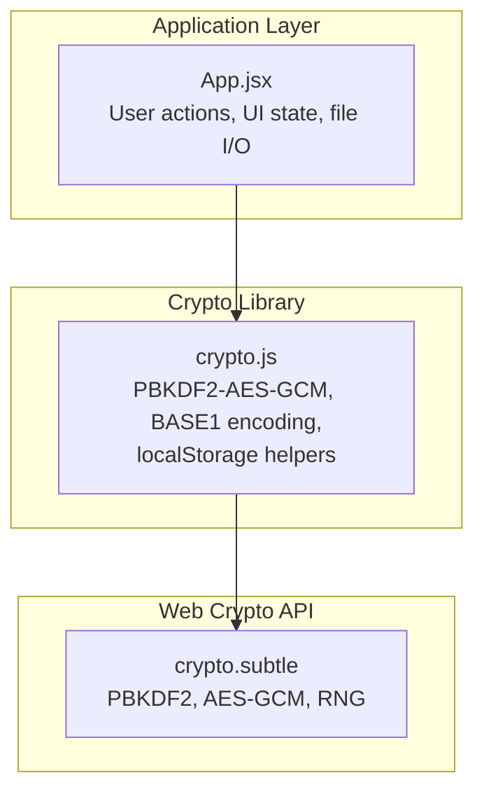
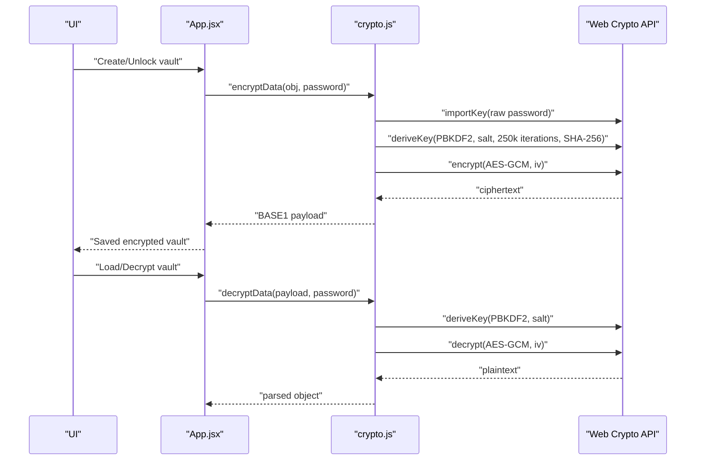
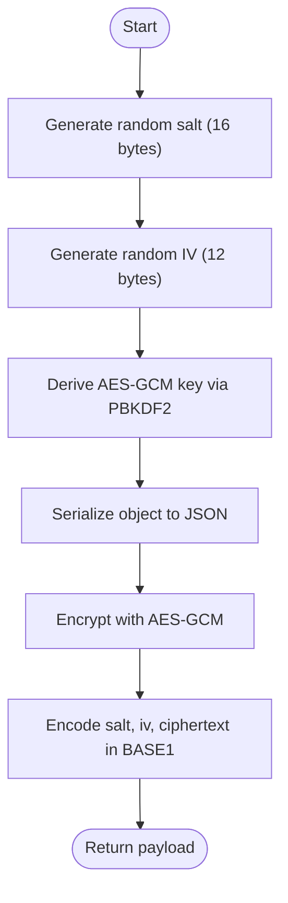
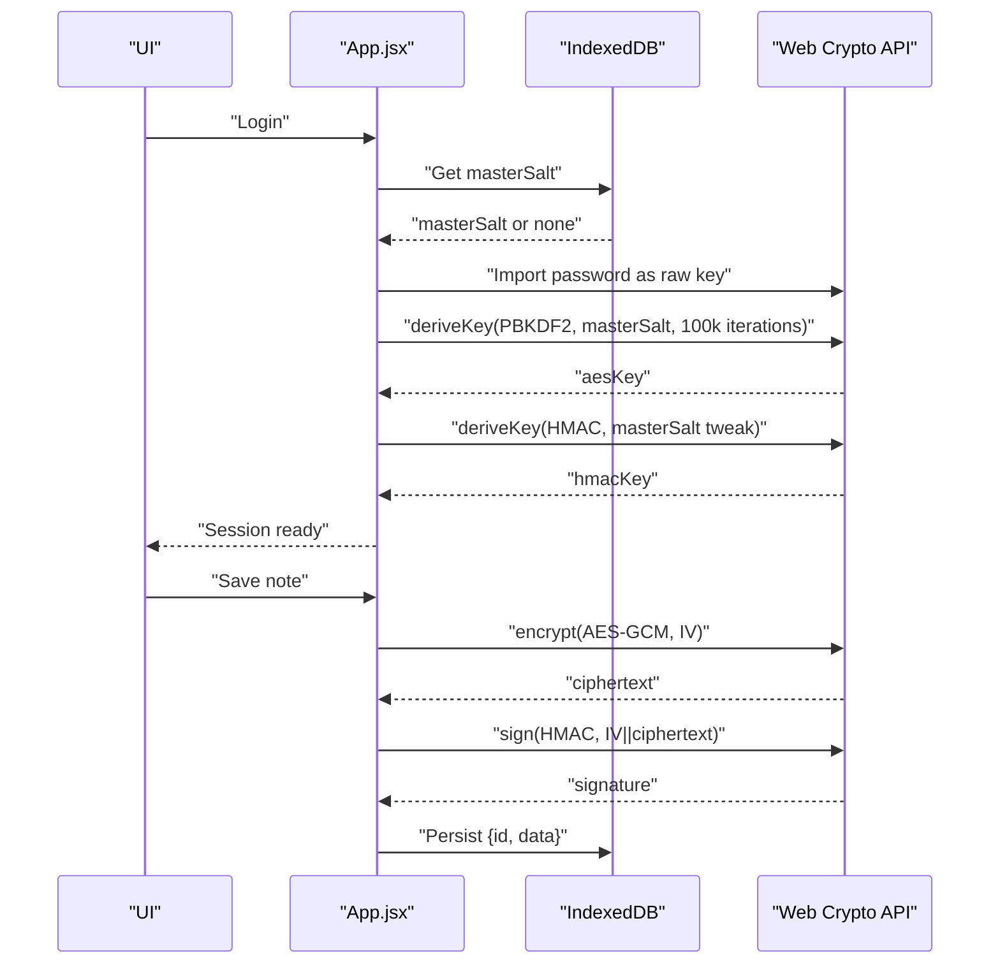
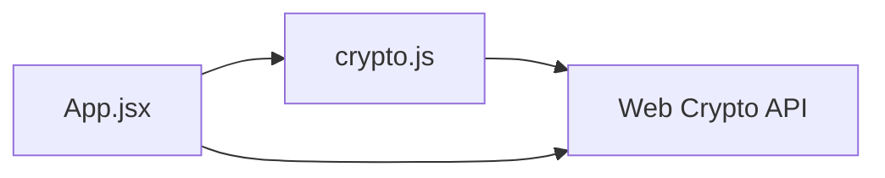

# Cryptographic Foundation

<cite>
**Referenced Files in This Document**
- [crypto.js](file://src/lib/crypto.js)
- [App.jsx](file://src/App.jsx)
</cite>

## Table of Contents
1. [Introduction](#introduction)
2. [Project Structure](#project-structure)
3. [Core Components](#core-components)
4. [Architecture Overview](#architecture-overview)
5. [Detailed Component Analysis](#detailed-component-analysis)
6. [Dependency Analysis](#dependency-analysis)
7. [Performance Considerations](#performance-considerations)
8. [Troubleshooting Guide](#troubleshooting-guide)
9. [Conclusion](#conclusion)

## Introduction
This document explains OMNI-TODO’s cryptographic foundation, focusing on the Web Crypto API-based implementation for secure local data protection. It covers:
- PBKDF2 key derivation with 250,000 iterations using SHA-256
- AES-GCM-256 encryption with 12-byte IVs
- Random salt and IV generation using the browser’s cryptographically secure RNG
- The BASE1 encoding format for serialized payloads
- Security properties and best practices for each primitive
- Implementation details from the crypto library and the main application

## Project Structure
The cryptographic logic is split across two primary modules:
- A lightweight crypto library that handles password-based encryption/decryption and persistent storage helpers
- The main application module that orchestrates user actions, manages sessions, and integrates IndexedDB-backed encryption with HMAC integrity checks

**Diagram sources**
- [crypto.js:1-112](file://src/lib/crypto.js#L1-L112)
- [App.jsx:166-190](file://src/App.jsx#L166-L190)

**Section sources**
- [crypto.js:1-112](file://src/lib/crypto.js#L1-L112)
- [App.jsx:166-190](file://src/App.jsx#L166-L190)

## Core Components
- Password-based encryption/decryption using PBKDF2 and AES-GCM
- Serialization format BASE1 for salts, IVs, and ciphertext
- Persistent storage helpers for vault files and browser storage
- Session-scoped encryption with AES-GCM and HMAC integrity verification (in the main app)

Key responsibilities:
- Derive a 256-bit AES-GCM key from a user password and a random salt
- Generate a fresh 12-byte IV per encryption operation
- Serialize the salt, IV, and ciphertext into a BASE1 payload
- Decrypt and parse payloads back into structured data

Security highlights:
- PBKDF2 with 250,000 iterations and SHA-256 increases cost for brute-force attempts
- AES-GCM provides confidentiality and authenticity with built-in AEAD
- Randomness from the browser’s CSPRNG ensures unpredictability

**Section sources**
- [crypto.js:7-38](file://src/lib/crypto.js#L7-L38)
- [crypto.js:40-110](file://src/lib/crypto.js#L40-L110)

## Architecture Overview
The system uses the Web Crypto API for all cryptographic operations. Two distinct workflows coexist:
- Lightweight vault encryption/decryption using PBKDF2-AES-GCM with BASE1 serialization
- IndexedDB-backed vault with session keys derived from a master salt, combined with AES-GCM and HMAC for integrity

**Diagram sources**
- [crypto.js:7-38](file://src/lib/crypto.js#L7-L38)
- [App.jsx:308-370](file://src/App.jsx#L308-L370)

## Detailed Component Analysis

### PBKDF2 Key Derivation (250,000 Iterations, SHA-256)
- Purpose: Convert a user-supplied password into a strong symmetric key suitable for AES-GCM
- Parameters:
  - Hash: SHA-256
  - Iterations: 250,000
  - Salt: Randomly generated per encryption operation (16 bytes)
- Workflow:
  - Import password as raw material
  - Derive a 256-bit AES-GCM key with extract-then-expand semantics
  - Use the derived key for subsequent encryption/decryption

Security properties:
- High iteration count significantly raises computational cost for brute-force attacks
- SHA-256 provides collision resistance and a robust pseudorandom function
- Random salt prevents precomputation attacks and rainbow table usage

Implementation notes:
- The salt is regenerated for each encryption, ensuring unique keys per message
- The derived key is scoped to AES-GCM with 256-bit length

**Section sources**
- [crypto.js:7-18](file://src/lib/crypto.js#L7-L18)

### AES-GCM-256 Encryption Parameters
- Mode: AES-GCM
- Key length: 256 bits
- Initialization vector (IV): 12 bytes (recommended for GCM)
- Authentication tag: Implicitly handled by the Web Crypto API; decryption validates authenticity

Security properties:
- Confidentiality and authenticity in a single operation
- IV reuse is catastrophic in GCM; random IV per encryption mitigates this risk
- Tag verification prevents tampering

Implementation notes:
- IV is randomly generated for each encryption
- Ciphertext is produced by the Web Crypto API and included in the BASE1 payload

**Section sources**
- [crypto.js:20-27](file://src/lib/crypto.js#L20-L27)

### Random Salt and IV Generation
- Entropy source: Browser’s cryptographically secure RNG via the Web Crypto API
- Salt: 16 bytes (128 bits)
- IV: 12 bytes (96 bits)

Security considerations:
- CSPRNG ensures unpredictability and resistance to bias
- Unique per-message prevents deterministic patterns and IV misuse

**Section sources**
- [crypto.js:21-22](file://src/lib/crypto.js#L21-L22)

### BASE1 Encoding Format
- Structure: BASE1:salt:iv:ciphertext
- Encoding: Base64 for each component
- Parsing: Split by “:” and decode each segment back to binary

Security considerations:
- Human-readable format aids portability and manual inspection
- Integrity relies on PBKDF2 and AES-GCM; the format itself does not alter cryptographic guarantees

**Section sources**
- [crypto.js:4-5](file://src/lib/crypto.js#L4-L5)
- [crypto.js:26](file://src/lib/crypto.js#L26)
- [crypto.js:29-37](file://src/lib/crypto.js#L29-L37)

### Encryption and Decryption Workflows
- Encryption:
  - Generate random salt and IV
  - Derive AES-GCM key from password and salt
  - Encrypt serialized JSON with AES-GCM
  - Serialize as BASE1 payload
- Decryption:
  - Parse BASE1 payload
  - Re-derive key using the provided salt
  - Decrypt ciphertext with IV
  - Deserialize JSON

**Diagram sources**
- [crypto.js:20-27](file://src/lib/crypto.js#L20-L27)

**Section sources**
- [crypto.js:20-38](file://src/lib/crypto.js#L20-L38)

### Session-Based Vault (IndexedDB + AES-GCM + HMAC)
The main application defines a separate, more advanced workflow for session-scoped encryption:
- Master salt persisted in IndexedDB system store
- Session keys derived from the master salt and password:
  - AES-GCM key for encryption/decryption
  - HMAC key for integrity verification (derived with a salt tweak)
- Payload format: IV (12 bytes) + HMAC (32 bytes) + ciphertext

Security properties:
- Separate keys for encryption and integrity
- HMAC verification prevents tampering before decryption
- Master salt rotation is supported via IndexedDB

**Diagram sources**
- [App.jsx:33-42](file://src/App.jsx#L33-L42)
- [App.jsx:54-72](file://src/App.jsx#L54-L72)

**Section sources**
- [App.jsx:33-72](file://src/App.jsx#L33-L72)

### Best Practices and Security Considerations
- PBKDF2 iteration count:
  - 250,000 iterations increase cost for offline brute-force attempts
  - Balance usability vs. security; adjust based on target device performance
- IV uniqueness:
  - Always generate a fresh 12-byte IV per encryption
  - Never reuse IVs with the same key
- Salt management:
  - Store the salt with the ciphertext; it does not need to be secret
  - Ensure per-message salts to prevent deterministic encryption
- Integrity:
  - Prefer AES-GCM for AEAD; verify tags before decryption
  - In session mode, HMAC verification precedes decryption
- Entropy sources:
  - Rely on the browser’s CSPRNG for salts and IVs
- Data serialization:
  - Use UTF-8 encoded JSON; encode binary components with Base64
- Error handling:
  - Validate payload format and lengths before processing
  - Distinguish between corruption and wrong password errors

**Section sources**
- [crypto.js:20-38](file://src/lib/crypto.js#L20-L38)
- [App.jsx:64-72](file://src/App.jsx#L64-L72)

## Dependency Analysis
- crypto.js depends on the Web Crypto API for:
  - PBKDF2 key derivation
  - AES-GCM encryption/decryption
  - Random number generation for salts and IVs
- App.jsx composes:
  - Local vault encryption/decryption via crypto.js
  - IndexedDB-backed vault with session keys and HMAC integrity
  - File picker APIs for importing/exporting vaults

**Diagram sources**
- [crypto.js:1-112](file://src/lib/crypto.js#L1-L112)
- [App.jsx:166-190](file://src/App.jsx#L166-L190)

**Section sources**
- [crypto.js:1-112](file://src/lib/crypto.js#L1-L112)
- [App.jsx:166-190](file://src/App.jsx#L166-L190)

## Performance Considerations
- PBKDF2 cost:
  - 250,000 iterations are computationally expensive; expect noticeable delays during unlock/create
  - On slower devices, consider reducing iterations while maintaining acceptable security
- AES-GCM throughput:
  - Modern browsers implement hardware-accelerated AES; performance is generally good
- Serialization overhead:
  - Base64 encoding adds ~33% size; acceptable for small documents
- IndexedDB I/O:
  - Batch writes and minimize transaction sizes for frequent saves

## Troubleshooting Guide
Common issues and resolutions:
- Bad format error when decrypting:
  - Occurs if the payload does not start with the expected prefix or lacks required segments
  - Verify the payload was saved/exported intact and not manually edited
- Wrong password or corrupted data:
  - PBKDF2-derived key mismatch leads to decryption failure
  - Confirm the correct password and that the stored payload is unmodified
- Integrity compromised:
  - HMAC verification fails if the payload was altered
  - Do not edit exported files; re-import from the original source
- Corrupted payload:
  - Insufficient bytes for IV/HMAC/ciphertext
  - Re-export and re-import the vault

**Section sources**
- [crypto.js:29-37](file://src/lib/crypto.js#L29-L37)
- [App.jsx:64-72](file://src/App.jsx#L64-L72)

## Conclusion
OMNI-TODO’s cryptographic foundation combines PBKDF2 with AES-GCM for robust, portable encryption of user data. The BASE1 format enables human-readable storage and easy file exchange, while the Web Crypto API ensures standards-compliant, secure operations. The main application augments this with a session-based workflow that adds HMAC integrity checks and IndexedDB-backed persistence. Adhering to the best practices outlined here will help maintain strong security posture across environments and devices.