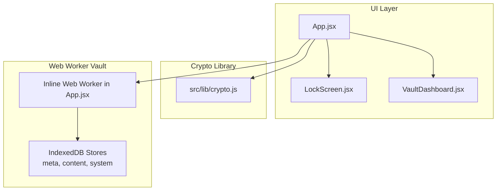
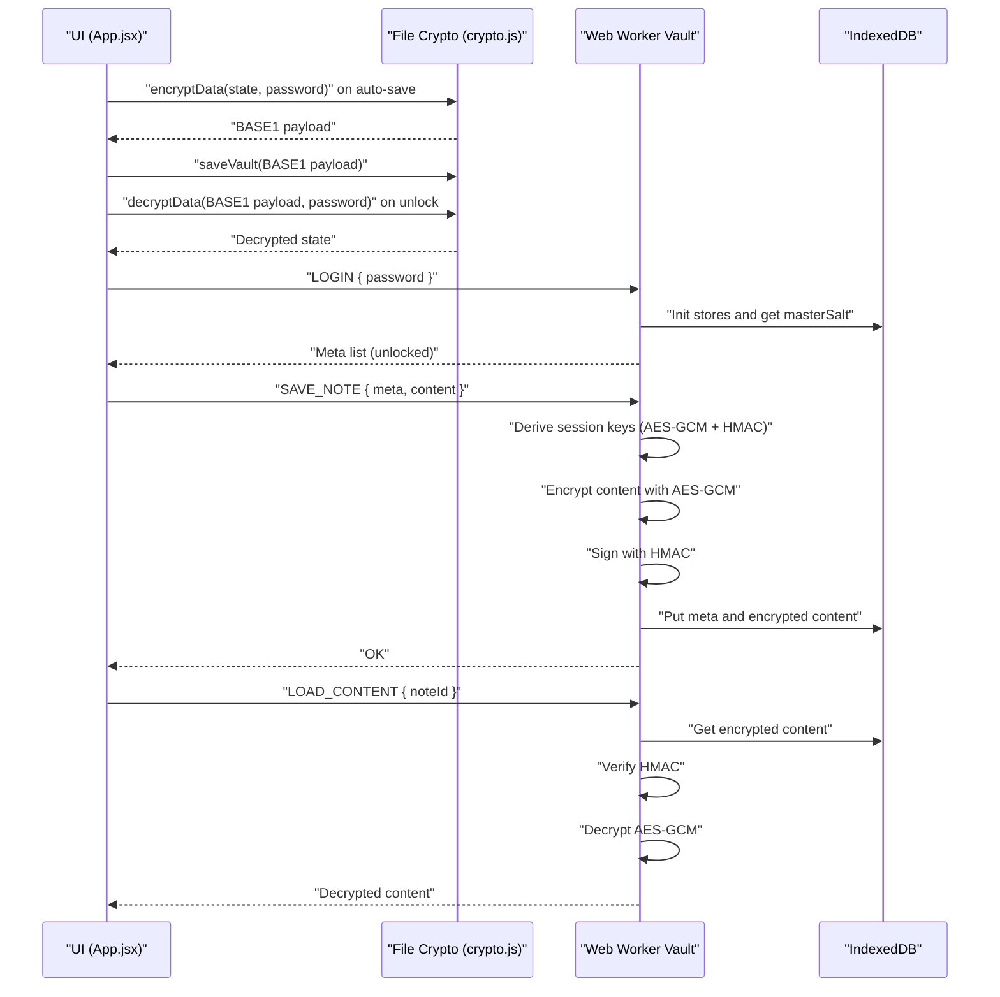
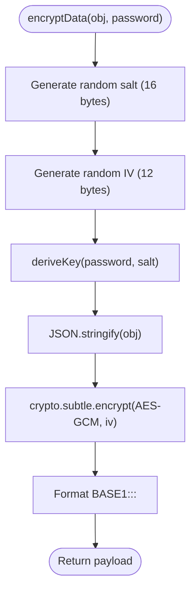
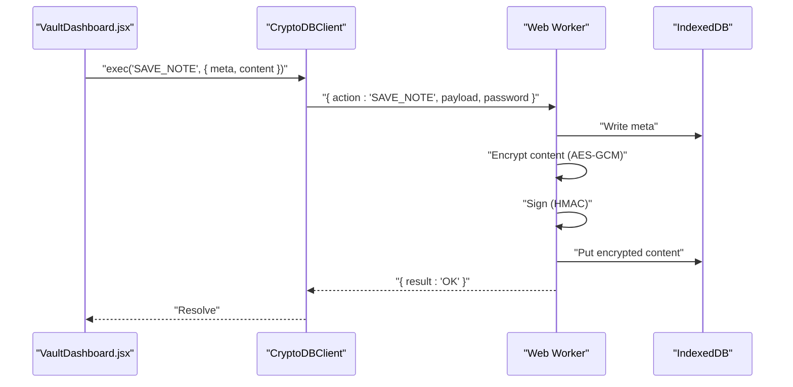
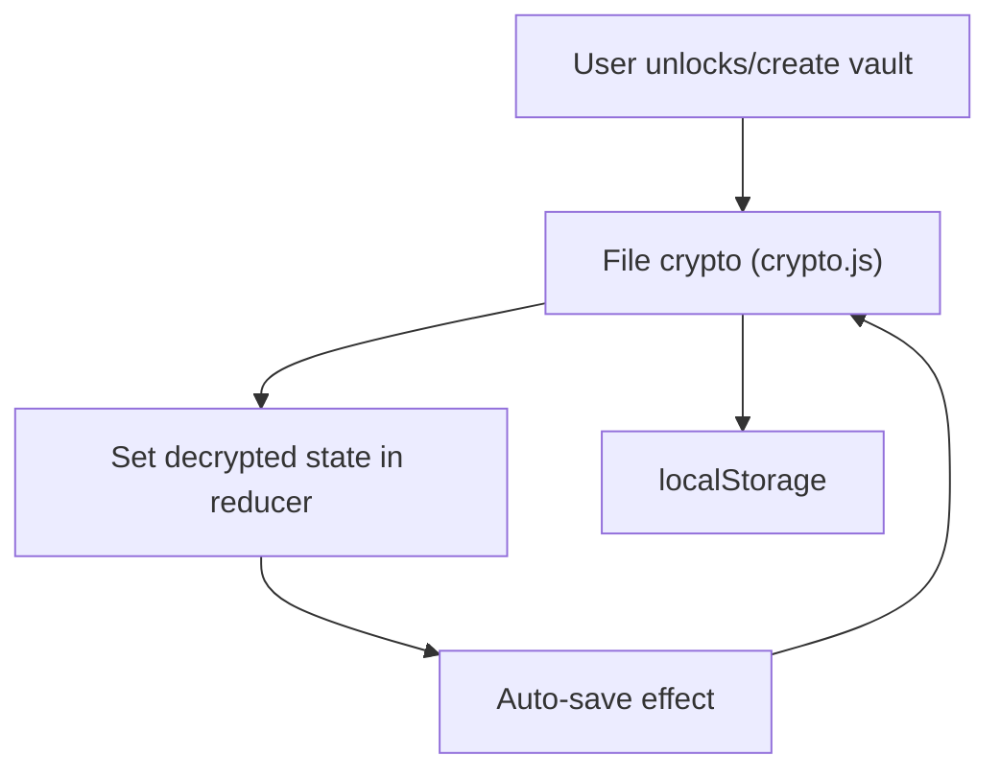
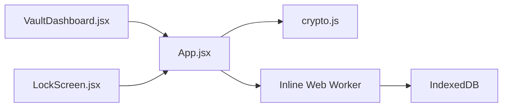

# Encryption Engine

<cite>
**Referenced Files in This Document**
- [crypto.js](file://src/lib/crypto.js)
- [App.jsx](file://src/App.jsx)
- [LockScreen.jsx](file://src/components/LockScreen.jsx)
- [VaultDashboard.jsx](file://src/components/VaultDashboard.jsx)
- [main.jsx](file://src/main.jsx)
- [package.json](file://package.json)
</cite>

## Table of Contents
1. [Introduction](#introduction)
2. [Project Structure](#project-structure)
3. [Core Components](#core-components)
4. [Architecture Overview](#architecture-overview)
5. [Detailed Component Analysis](#detailed-component-analysis)
6. [Dependency Analysis](#dependency-analysis)
7. [Performance Considerations](#performance-considerations)
8. [Troubleshooting Guide](#troubleshooting-guide)
9. [Conclusion](#conclusion)

## Introduction
This document explains OMNI-TODO’s encryption engine implementation with a focus on:
- Web Worker-based architecture for cryptographic operations
- The encryptData and decryptData functions
- The BASE1 payload format
- Complete encryption workflow: salt generation, IV creation, key derivation, and authenticated encryption with AES-GCM
- Integration with App.jsx state management for automatic encryption/decryption cycles
- Practical examples, error handling, and performance considerations
- Zero-knowledge implications and how the encryption engine ensures data confidentiality even from the application itself

## Project Structure
The encryption engine spans two primary areas:
- A lightweight crypto library for file-based vault encryption/decryption
- A Web Worker-based IndexedDB-backed vault for real-time note editing with authenticated encryption

**Diagram sources**
- [App.jsx:10-164](file://src/App.jsx#L10-L164)
- [crypto.js:1-112](file://src/lib/crypto.js#L1-L112)

**Section sources**
- [main.jsx:1-11](file://src/main.jsx#L1-L11)
- [package.json:12-24](file://package.json#L12-L24)

## Core Components
- File-based vault encryption/decryption:
  - Functions: deriveKey, encryptData, decryptData, saveVault, loadVault, saveVaultToFile, pickVaultFile
  - Payload format: BASE1:<salt>:<iv>:<ciphertext>
- Web Worker vault:
  - CryptoDBClient wrapper around an inline Web Worker
  - Actions: LOGIN, LOCK, LOAD_CONTENT, SAVE_NOTE, DELETE_NOTE, EXPORT_VAULT, IMPORT_VAULT
  - Authenticated encryption: AES-GCM with HMAC-SHA-256 for integrity

**Section sources**
- [crypto.js:7-38](file://src/lib/crypto.js#L7-L38)
- [crypto.js:40-112](file://src/lib/crypto.js#L40-L112)
- [App.jsx:167-190](file://src/App.jsx#L167-L190)
- [App.jsx:74-164](file://src/App.jsx#L74-L164)

## Architecture Overview
The system separates concerns:
- UI state and persistence (React) manages user sessions and triggers encryption/decryption
- File-based crypto handles vault creation/unlock and export/import
- Web Worker vault performs authenticated encryption/decryption of note content and metadata

**Diagram sources**
- [crypto.js:20-38](file://src/lib/crypto.js#L20-L38)
- [App.jsx:167-190](file://src/App.jsx#L167-L190)
- [App.jsx:74-164](file://src/App.jsx#L74-L164)

## Detailed Component Analysis

### File-Based Vault Encryption Engine (crypto.js)
- Purpose: Encrypt/decrypt entire application state into a single BASE1 payload stored in localStorage or exported/imported as a .vault file.
- Key primitives:
  - deriveKey: PBKDF2 with SHA-256, 250000 iterations, returns AES-GCM key
  - encryptData: Generates random salt and IV, derives key, encrypts JSON, formats BASE1 payload
  - decryptData: Parses BASE1, derives key, decrypts, parses JSON
- Storage helpers: saveVault/loadVault for localStorage; saveVaultToFile/pickVaultFile for file-based backup/restore

**Diagram sources**
- [crypto.js:20-27](file://src/lib/crypto.js#L20-L27)
- [crypto.js:7-18](file://src/lib/crypto.js#L7-L18)

**Section sources**
- [crypto.js:7-38](file://src/lib/crypto.js#L7-L38)
- [crypto.js:40-112](file://src/lib/crypto.js#L40-L112)

### Web Worker Vault Engine (Inline Worker in App.jsx)
- Purpose: Real-time, authenticated encryption of individual note content and metadata inside a browser sandbox.
- Session lifecycle:
  - LOGIN: Derives session keys (AES-GCM and HMAC) from password and persisted masterSalt; returns filtered meta list
  - LOCK: Clears session keys
  - LOAD_CONTENT: Retrieves encrypted content, verifies HMAC, decrypts AES-GCM
  - SAVE_NOTE: Encrypts content, signs, writes meta and encrypted content
  - DELETE_NOTE: Marks meta deleted and removes content
  - EXPORT_VAULT: Decrypts all notes, re-encrypts with AES-GCM+HMAC, returns ArrayBuffer for download
  - IMPORT_VAULT: Decrypts imported vault, merges with local meta/content using LWW (last writer wins) semantics
- Integrity: HMAC verification prevents tampering; AES-GCM provides confidentiality and authenticity per record

**Diagram sources**
- [App.jsx:167-190](file://src/App.jsx#L167-L190)
- [App.jsx:74-164](file://src/App.jsx#L74-L164)

**Section sources**
- [App.jsx:167-190](file://src/App.jsx#L167-L190)
- [App.jsx:74-164](file://src/App.jsx#L74-L164)

### BASE1 Payload Format
- Structure: BASE1:<salt_b64>:<iv_b64>:<ciphertext_b64>
- Parsing: Split by “:” and validate scheme; decode base64 segments to typed arrays; derive key with PBKDF2; decrypt with AES-GCM; parse JSON
- Validation: Reject malformed payloads early to prevent invalid key derivation

**Section sources**
- [crypto.js:20-38](file://src/lib/crypto.js#L20-L38)

### Integration with App.jsx State Management
- Automatic encryption/decryption:
  - On unlock: decrypt BASE1 payload and load state into reducer
  - On create: encrypt empty state and persist
  - On change: auto-save encrypted payload to localStorage
- UI integration:
  - LockScreen triggers unlock/create flows
  - VaultDashboard orchestrates note CRUD and delegates encrypted operations to the Web Worker

**Diagram sources**
- [App.jsx:316-340](file://src/App.jsx#L316-L340)
- [App.jsx:357-370](file://src/App.jsx#L357-L370)
- [crypto.js:20-38](file://src/lib/crypto.js#L20-L38)

**Section sources**
- [App.jsx:316-340](file://src/App.jsx#L316-L340)
- [App.jsx:357-370](file://src/App.jsx#L357-L370)
- [LockScreen.jsx:98-119](file://src/components/LockScreen.jsx#L98-L119)

## Dependency Analysis
- Dependencies:
  - crypto.subtle for PBKDF2, AES-GCM, HMAC
  - localStorage for file-based vault persistence
  - IndexedDB for Web Worker vault
  - Web Worker for off-main-thread crypto and IndexedDB access
- Coupling:
  - App.jsx composes both file and Web Worker engines
  - VaultDashboard coordinates UI events and delegates to CryptoDBClient
  - LockScreen triggers unlock/create flows that depend on file crypto

**Diagram sources**
- [App.jsx:167-190](file://src/App.jsx#L167-L190)
- [crypto.js:1-112](file://src/lib/crypto.js#L1-L112)

**Section sources**
- [App.jsx:167-190](file://src/App.jsx#L167-L190)
- [crypto.js:1-112](file://src/lib/crypto.js#L1-L112)

## Performance Considerations
- PBKDF2 iterations:
  - File crypto uses 250000 iterations for strong key derivation
  - Web Worker uses 100000 iterations for session keys; acceptable trade-off for interactive UX
- IV reuse:
  - Random IV per encryption; never reuse IV with the same key
- HMAC overhead:
  - Adds 32-byte tag per record; negligible compared to AES-GCM cost
- IndexedDB I/O:
  - Batch operations and transaction boundaries minimize latency
- Auto-save debouncing:
  - Debounced saving reduces write pressure; adjust timing as needed

[No sources needed since this section provides general guidance]

## Troubleshooting Guide
- Bad format errors:
  - BASE1 parsing requires exactly four colon-separated parts and correct scheme
- Decryption failures:
  - Wrong password or corrupted payload
  - Verify payload starts with BASE1 and contains valid base64 segments
- Integrity compromise:
  - HMAC verification failure indicates tampering or corruption
- No session:
  - Web Worker actions require an active session established by LOGIN
- Duress trigger:
  - Using the configured PIN triggers cryptographic shredding of IndexedDB content

**Section sources**
- [crypto.js:29-38](file://src/lib/crypto.js#L29-L38)
- [App.jsx:74-164](file://src/App.jsx#L74-L164)

## Conclusion
OMNI-TODO’s encryption engine combines:
- A robust file-based vault using PBKDF2-AES-GCM with BASE1 payloads
- A Web Worker vault with AES-GCM + HMAC for authenticated note storage
- Seamless UI integration that keeps sensitive data encrypted at rest and in transit
- Zero-knowledge guarantees: even the application cannot access plaintext content without the user’s password

[No sources needed since this section summarizes without analyzing specific files]