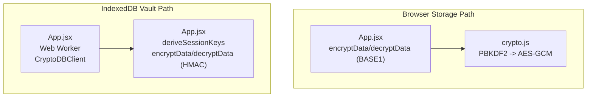
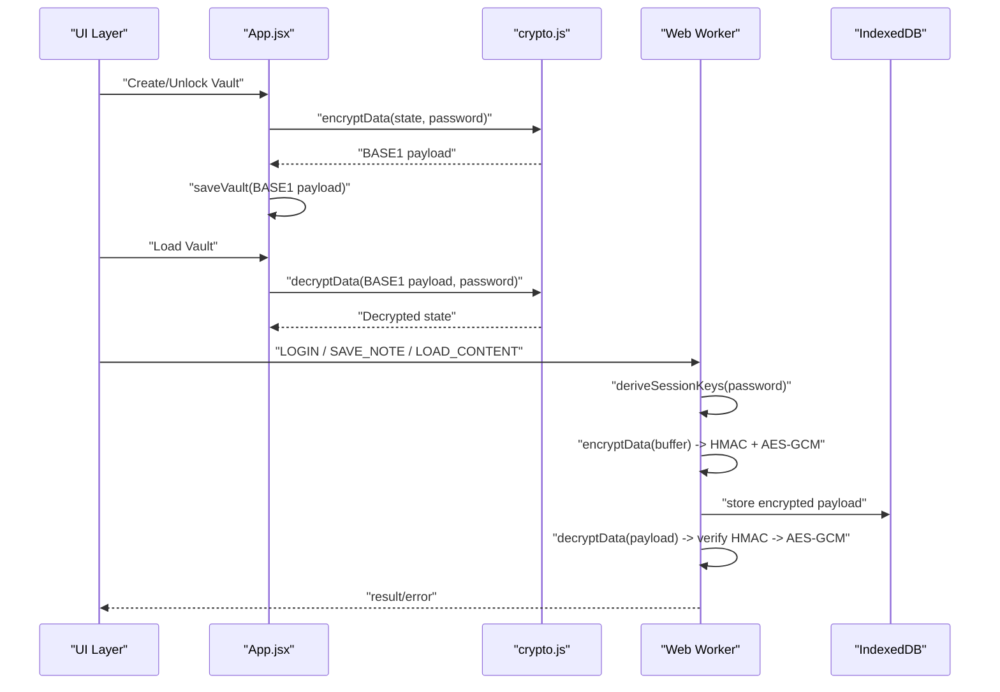
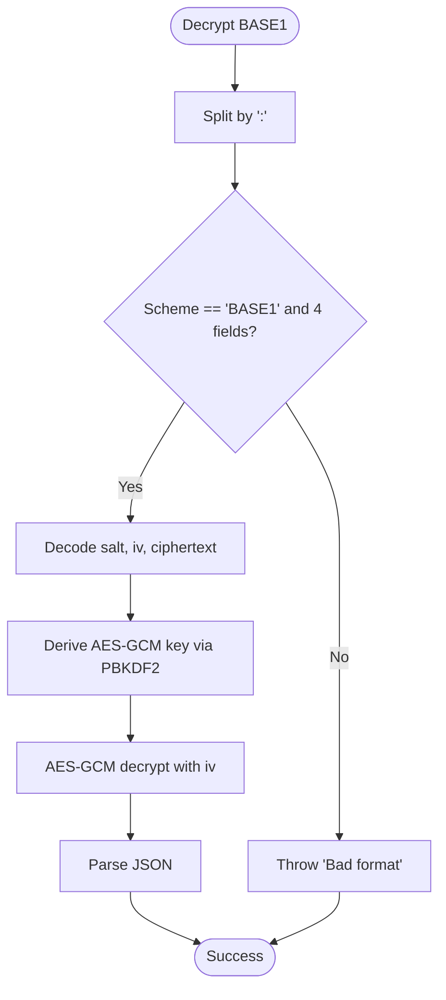
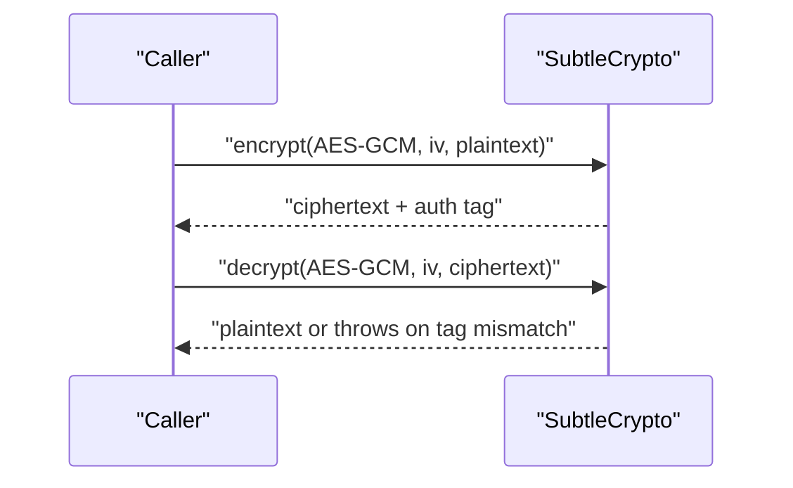
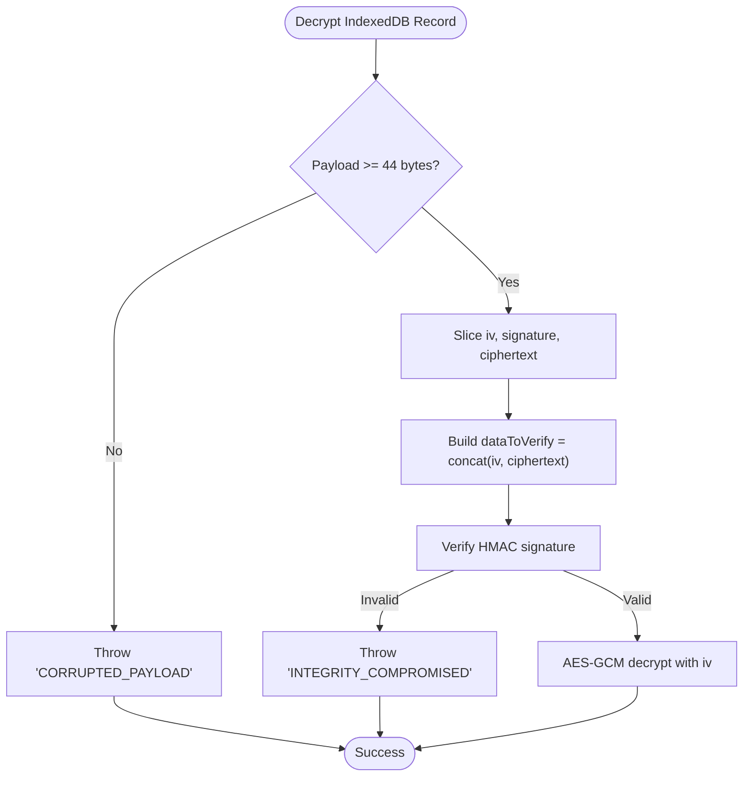
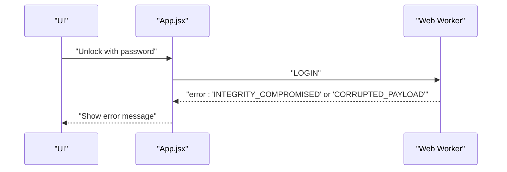
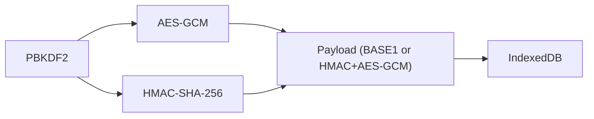

# Integrity Verification

<cite>
**Referenced Files in This Document**
- [crypto.js](file://src/lib/crypto.js)
- [App.jsx](file://src/App.jsx)
- [LockScreen.jsx](file://src/components/LockScreen.jsx)
- [VaultDashboard.jsx](file://src/components/VaultDashboard.jsx)
</cite>

## Table of Contents
1. [Introduction](#introduction)
2. [Project Structure](#project-structure)
3. [Core Components](#core-components)
4. [Architecture Overview](#architecture-overview)
5. [Detailed Component Analysis](#detailed-component-analysis)
6. [Dependency Analysis](#dependency-analysis)
7. [Performance Considerations](#performance-considerations)
8. [Troubleshooting Guide](#troubleshooting-guide)
9. [Conclusion](#conclusion)

## Introduction
This document explains OMNI-TODO’s data integrity verification mechanisms. It focuses on how AES-GCM provides confidentiality and authenticity, how initialization vectors prevent replay attacks, and how the system validates integrity during decryption. It also documents the BASE1 payload format (including salt, IV, and ciphertext), the HMAC-based integrity checks, and the error-handling behavior for tampered or corrupted data. Finally, it outlines common integrity attack scenarios and how the system mitigates them.

## Project Structure
The integrity verification spans two distinct cryptographic pathways:
- A lightweight, browser-based encryption/decryption pipeline using AES-GCM with PBKDF2-derived keys and a simple BASE1 payload format.
- A more robust IndexedDB-backed vault with AES-GCM + HMAC-SHA-256 integrated encryption and explicit integrity verification in a Web Worker.

**Diagram sources**
- [crypto.js:20-38](file://src/lib/crypto.js#L20-L38)
- [App.jsx:262-370](file://src/App.jsx#L262-L370)
- [App.jsx:33-72](file://src/App.jsx#L33-L72)

**Section sources**
- [crypto.js:1-112](file://src/lib/crypto.js#L1-L112)
- [App.jsx:167-190](file://src/App.jsx#L167-L190)
- [App.jsx:33-72](file://src/App.jsx#L33-L72)

## Core Components
- BASE1 payload format: A colon-separated string containing a scheme identifier and three base64-encoded segments: salt, IV, and ciphertext. The decryptor reconstructs the salt and IV, derives the AES-GCM key, and verifies the integrity of the ciphertext using AES-GCM’s built-in authentication tag.
- AES-GCM with PBKDF2: Keys are derived from the user password and a random salt. The IV is randomly generated per encryption and included in the payload.
- HMAC-based integrity (IndexedDB vault): A separate HMAC-SHA-256 signature is computed over the concatenation of IV and ciphertext, stored alongside the encrypted data. Decryption first verifies the HMAC signature against the reconstructed data, then proceeds with AES-GCM decryption.

**Section sources**
- [crypto.js:20-38](file://src/lib/crypto.js#L20-L38)
- [App.jsx:33-72](file://src/App.jsx#L33-L72)

## Architecture Overview
The system enforces integrity at two layers:
- Application-level encryption for ephemeral storage (BASE1 payload).
- Vault-level encryption with integrated integrity verification in a Web Worker.

**Diagram sources**
- [crypto.js:20-38](file://src/lib/crypto.js#L20-L38)
- [App.jsx:262-370](file://src/App.jsx#L262-L370)
- [App.jsx:33-72](file://src/App.jsx#L33-L72)

## Detailed Component Analysis

### BASE1 Payload Format and Validation
- Format: BASE1:salt:iv:ciphertext, where each segment is base64-encoded.
- Validation steps:
  - Verify the scheme identifier and field count.
  - Decode salt, IV, and ciphertext.
  - Derive AES-GCM key using PBKDF2 with the decoded salt.
  - Decrypt using AES-GCM with the decoded IV.
  - On success, parse the resulting plaintext as JSON.

**Diagram sources**
- [crypto.js:29-38](file://src/lib/crypto.js#L29-L38)

**Section sources**
- [crypto.js:20-38](file://src/lib/crypto.js#L20-L38)

### AES-GCM Authentication Tag Verification
- AES-GCM provides both confidentiality and authenticity. During decryption, the cipher verifies the built-in authentication tag embedded with the ciphertext. If the tag fails, the entire operation fails, preventing tampering.
- Initialization vectors (IVs) are randomly generated per encryption and included in the payload. Because each IV is unique, reusing an IV with the same key weakens security and enables replay attacks. AES-GCM requires a unique IV per encryption operation.

**Diagram sources**
- [crypto.js:20-38](file://src/lib/crypto.js#L20-L38)

**Section sources**
- [crypto.js:20-38](file://src/lib/crypto.js#L20-L38)

### HMAC-Based Integrity (IndexedDB Vault)
- The IndexedDB vault path integrates HMAC-SHA-256 with AES-GCM:
  - Random IV per record.
  - Encrypt with AES-GCM.
  - Compute HMAC over the concatenation of IV and ciphertext.
  - Store IV, HMAC signature, and ciphertext together.
  - On decrypt, verify HMAC first; only if valid, proceed with AES-GCM decryption.
- This layered approach ensures that even if an attacker modifies ciphertext or IV, the HMAC verification will fail, and decryption will not occur.

**Diagram sources**
- [App.jsx:64-72](file://src/App.jsx#L64-L72)

**Section sources**
- [App.jsx:33-72](file://src/App.jsx#L33-L72)

### Error Propagation and Tamper Handling
- Tampered or corrupted data triggers explicit errors:
  - BASE1 format errors: “Bad format”.
  - IndexedDB payload errors: “CORRUPTED_PAYLOAD”, “INTEGRITY_COMPROMISED”.
  - UI surfaces these messages to the user and prevents access to invalid data.
- The system does not attempt to partially recover or salvage corrupted data; it rejects it outright.

**Diagram sources**
- [App.jsx:216-226](file://src/App.jsx#L216-L226)
- [App.jsx:64-72](file://src/App.jsx#L64-L72)

**Section sources**
- [App.jsx:216-226](file://src/App.jsx#L216-L226)
- [App.jsx:64-72](file://src/App.jsx#L64-L72)

### Security Benefits of Integrated Encryption with Authentication
- AES-GCM with a unique IV per encryption provides:
  - Confidentiality: Only holders of the derived key can read the plaintext.
  - Authenticity: The built-in tag ensures ciphertext integrity.
  - Non-repudiation-like property: Without the key and correct IV, tampering is detectable.
- HMAC adds an additional layer of integrity protection in the IndexedDB vault, ensuring that modifications to IV or ciphertext are caught before AES-GCM decryption.

**Section sources**
- [crypto.js:20-38](file://src/lib/crypto.js#L20-L38)
- [App.jsx:33-72](file://src/App.jsx#L33-L72)

### Common Integrity Attack Scenarios and Mitigations
- Replay attacks:
  - Mitigation: Unique IV per encryption; AES-GCM IV reuse is strongly discouraged. The system generates a fresh IV for each encryption.
- Ciphertext modification:
  - Mitigation: AES-GCM tag verification fails; HMAC verification (in IndexedDB path) fails before AES-GCM decryption.
- IV tampering:
  - Mitigation: HMAC covers IV + ciphertext; any change invalidates the signature.
- Format corruption (BASE1):
  - Mitigation: Strict parsing and validation; non-compliant payloads are rejected immediately.

**Section sources**
- [crypto.js:20-38](file://src/lib/crypto.js#L20-L38)
- [App.jsx:64-72](file://src/App.jsx#L64-L72)

## Dependency Analysis
- Application-level encryption depends on:
  - PBKDF2 for key derivation.
  - AES-GCM for encryption/decryption.
  - Base64 encoding for payload serialization.
- IndexedDB vault depends on:
  - PBKDF2 for deriving AES-GCM and HMAC keys.
  - HMAC-SHA-256 for integrity signatures.
  - IndexedDB for persistent storage.

**Diagram sources**
- [crypto.js:7-18](file://src/lib/crypto.js#L7-L18)
- [App.jsx:33-42](file://src/App.jsx#L33-L42)

**Section sources**
- [crypto.js:7-18](file://src/lib/crypto.js#L7-L18)
- [App.jsx:33-42](file://src/App.jsx#L33-L42)

## Performance Considerations
- PBKDF2 iteration counts:
  - Application-level: 250000 iterations for PBKDF2.
  - IndexedDB vault: 100000 iterations for PBKDF2.
- Iteration counts balance security and responsiveness; higher iterations increase resistance to brute-force attacks but may slow down key derivation.
- AES-GCM is efficient and hardware-accelerated in modern browsers; HMAC adds minimal overhead compared to the cost of PBKDF2.

[No sources needed since this section provides general guidance]

## Troubleshooting Guide
- Symptom: “Bad format” during unlock.
  - Cause: The payload does not match the BASE1 scheme or is malformed.
  - Action: Re-import a valid .vault file or recreate the vault.
- Symptom: “INTEGRITY_COMPROMISED” or “CORRUPTED_PAYLOAD”.
  - Cause: The stored data was altered or the file is incomplete.
  - Action: Restore from a known-good backup; do not attempt manual edits.
- Symptom: “NO_SESSION” during vault operations.
  - Cause: Attempting to operate without an active session (no password).
  - Action: Unlock the vault first.
- Symptom: “DURESS_TRIGGERED”.
  - Cause: The duress PIN was entered, triggering cryptographic shredding.
  - Action: Data is irrecoverably destroyed; create a new vault.

**Section sources**
- [crypto.js:30-31](file://src/lib/crypto.js#L30-L31)
- [App.jsx:66-71](file://src/App.jsx#L66-L71)
- [App.jsx:89](file://src/App.jsx#L89)
- [App.jsx:79-81](file://src/App.jsx#L79-L81)

## Conclusion
OMNI-TODO employs robust integrity verification across two complementary paths:
- BASE1 payloads ensure AES-GCM confidentiality and authenticity with strict format validation.
- IndexedDB vaults integrate HMAC-SHA-256 with AES-GCM, enforcing integrity checks before decryption and rejecting tampered data with explicit errors.

These mechanisms collectively prevent replay attacks, detect ciphertext and IV tampering, and safeguard user data against common integrity threats.