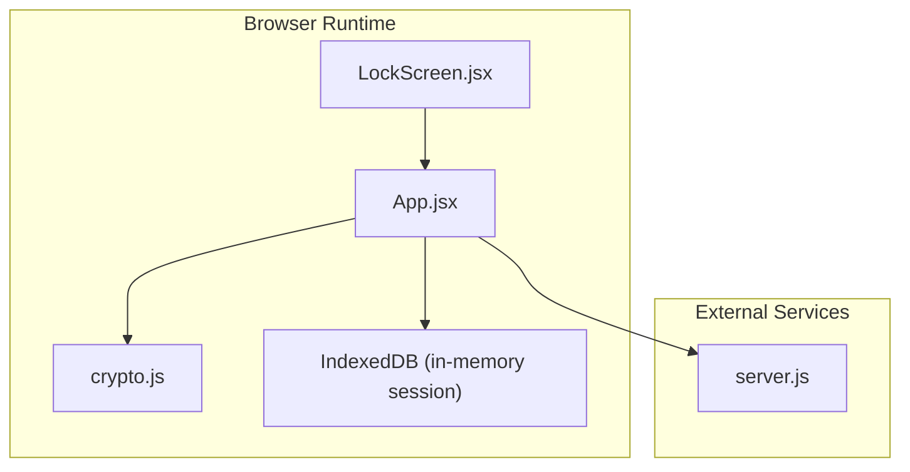
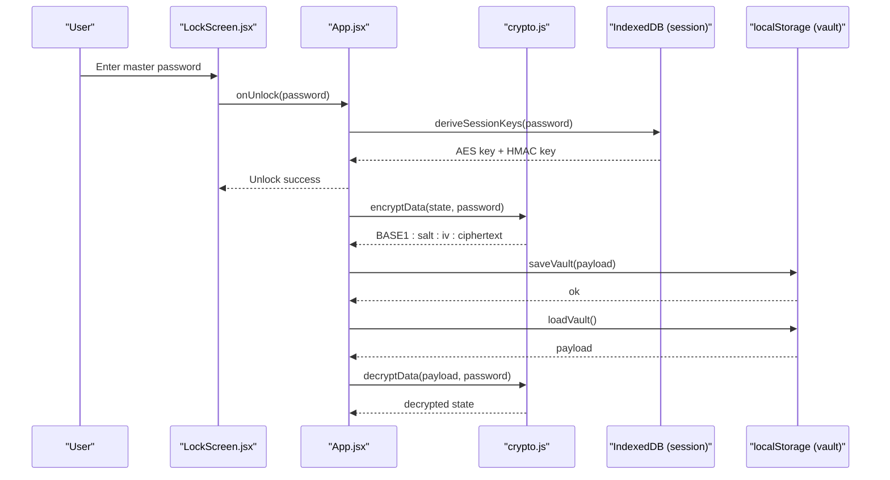
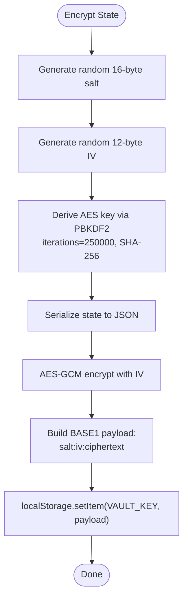
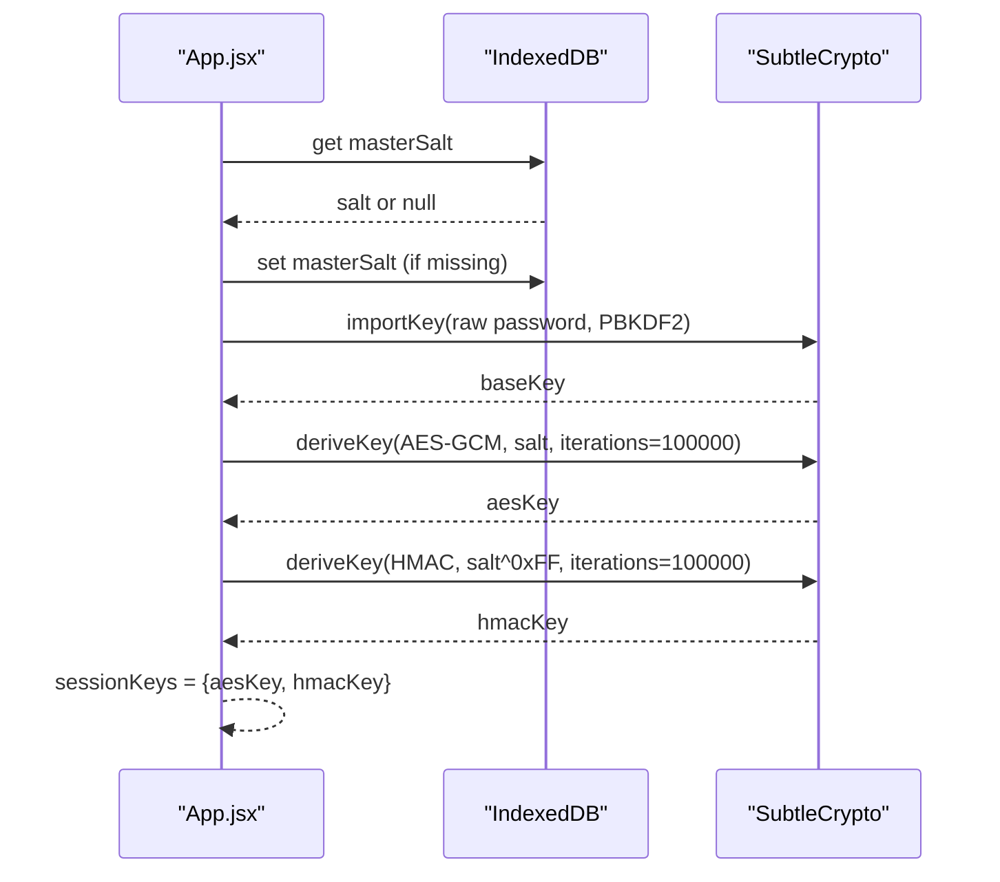
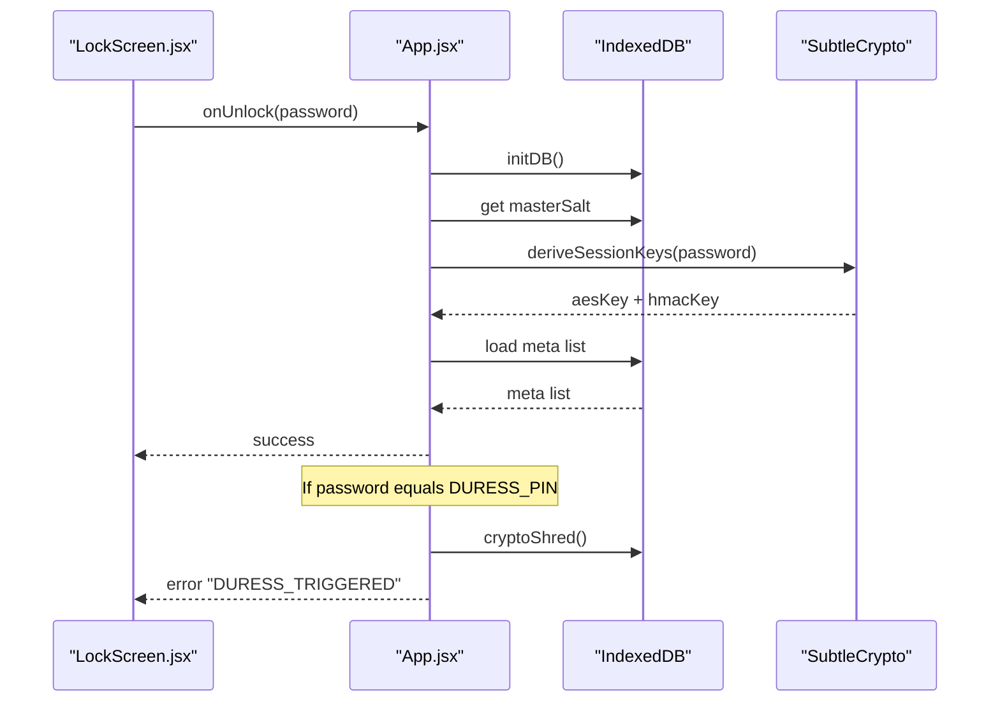
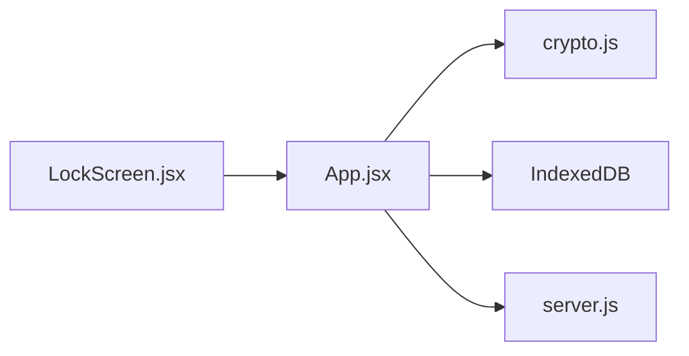

# Key Management

<cite>
**Referenced Files in This Document**
- [crypto.js](file://src/lib/crypto.js)
- [App.jsx](file://src/App.jsx)
- [LockScreen.jsx](file://src/components/LockScreen.jsx)
- [server.js](file://server.js)
- [package.json](file://package.json)
</cite>

## Table of Contents
1. [Introduction](#introduction)
2. [Project Structure](#project-structure)
3. [Core Components](#core-components)
4. [Architecture Overview](#architecture-overview)
5. [Detailed Component Analysis](#detailed-component-analysis)
6. [Dependency Analysis](#dependency-analysis)
7. [Performance Considerations](#performance-considerations)
8. [Troubleshooting Guide](#troubleshooting-guide)
9. [Conclusion](#conclusion)

## Introduction
This document explains OMNI-TODO’s key management system with a focus on:
- Master password protection and PBKDF2-based key derivation
- Configurable iteration counts and their security implications
- Secure storage of encrypted vault data in localStorage
- Authentication flow integration and duress-mode behavior
- Practical guidance for password-based key derivation in browser environments

The system uses two distinct key derivation mechanisms:
- A lightweight, user-facing encryption scheme for persistent vault storage
- A session-based key derivation for in-memory IndexedDB operations with separate AES-GCM and HMAC keys

## Project Structure
The key management logic spans several modules:
- Cryptographic primitives and vault persistence live in a dedicated library module
- Application-level authentication and session lifecycle orchestrate key derivation and storage
- UI components present the lock screen and manage user interactions
- A proxy server handles external AI services unrelated to key management

**Diagram sources**
- [LockScreen.jsx:1-221](file://src/components/LockScreen.jsx#L1-L221)
- [App.jsx:1-441](file://src/App.jsx#L1-L441)
- [crypto.js:1-112](file://src/lib/crypto.js#L1-L112)
- [server.js:1-135](file://server.js#L1-L135)

**Section sources**
- [crypto.js:1-112](file://src/lib/crypto.js#L1-L112)
- [App.jsx:1-441](file://src/App.jsx#L1-L441)
- [LockScreen.jsx:1-221](file://src/components/LockScreen.jsx#L1-L221)
- [server.js:1-135](file://server.js#L1-L135)

## Core Components
- PBKDF2-based key derivation for user passwords
- AES-GCM encryption for vault data
- Local storage for encrypted vault persistence
- Session-based key derivation with separate AES and HMAC keys
- Duress-mode cryptographic destruction

Key responsibilities:
- Derive a 256-bit AES-GCM key from the user’s master password and a random salt
- Encrypt application state with a fresh random IV and encode metadata in a structured payload
- Persist the encrypted payload to localStorage
- On unlock, load the encrypted payload, derive the key using the stored salt, and decrypt
- For session operations, derive separate AES and HMAC keys from the same password and salt, enabling authenticated encryption

Security highlights:
- Random salts and IVs are generated per operation
- Iteration counts are configured per scheme to balance security and performance
- Integrity is protected by HMAC alongside AES-GCM

**Section sources**
- [crypto.js:7-38](file://src/lib/crypto.js#L7-L38)
- [crypto.js:43-60](file://src/lib/crypto.js#L43-L60)
- [App.jsx:33-42](file://src/App.jsx#L33-L42)
- [App.jsx:64-72](file://src/App.jsx#L64-L72)

## Architecture Overview
The key management architecture separates concerns between persistent vault encryption and session-based operations:

**Diagram sources**
- [LockScreen.jsx:105-119](file://src/components/LockScreen.jsx#L105-L119)
- [App.jsx:216-226](file://src/App.jsx#L216-L226)
- [App.jsx:33-42](file://src/App.jsx#L33-L42)
- [crypto.js:20-38](file://src/lib/crypto.js#L20-L38)
- [crypto.js:43-60](file://src/lib/crypto.js#L43-L60)

## Detailed Component Analysis

### Persistent Vault Encryption (localStorage)
This component manages long-term encrypted storage of the user’s application state.

Key behaviors:
- Generates a random 16-byte salt and 12-byte IV per encryption
- Uses PBKDF2 with SHA-256 and 250,000 iterations to derive a 256-bit AES-GCM key
- Encrypts serialized state and returns a BASE1 payload containing salt, iv, and ciphertext
- Stores the payload in localStorage under a fixed key
- Loads and parses the payload on startup, validates format, and derives the key to decrypt

**Diagram sources**
- [crypto.js:20-27](file://src/lib/crypto.js#L20-L27)
- [crypto.js:43-60](file://src/lib/crypto.js#L43-L60)

Security considerations:
- Salt and IV are randomly generated per encryption, preventing reuse attacks
- PBKDF2 iteration count of 250,000 provides strong resistance to brute-force attempts
- Payload format is validated before decryption to prevent malformed input errors

**Section sources**
- [crypto.js:7-18](file://src/lib/crypto.js#L7-L18)
- [crypto.js:20-38](file://src/lib/crypto.js#L20-L38)
- [crypto.js:43-60](file://src/lib/crypto.js#L43-L60)

### Session-Based Key Derivation (IndexedDB)
This component manages short-lived session keys derived from the user’s master password and a persistent master salt.

Key behaviors:
- Retrieves or generates a master salt persisted in IndexedDB system store
- Derives an AES-GCM key and an HMAC key from the same password and salt
- Uses a derived HMAC salt (bitwise XOR of the master salt) to ensure distinct key material
- Encrypts data with AES-GCM and signs with HMAC for integrity verification
- Decrypts data by verifying HMAC before decrypting AES-GCM

**Diagram sources**
- [App.jsx:33-42](file://src/App.jsx#L33-L42)
- [App.jsx:54-72](file://src/App.jsx#L54-L72)

Security considerations:
- Separate AES and HMAC keys improve isolation between confidentiality and integrity
- Using a derived HMAC salt ensures that even if AES and HMAC share the same password, they do not produce identical keys
- HMAC verification occurs before decryption to detect tampering

**Section sources**
- [App.jsx:33-42](file://src/App.jsx#L33-L42)
- [App.jsx:54-72](file://src/App.jsx#L54-L72)

### Authentication Flow and Duress Mode
The authentication flow integrates key derivation with UI and session lifecycle.

**Diagram sources**
- [LockScreen.jsx:105-119](file://src/components/LockScreen.jsx#L105-L119)
- [App.jsx:216-226](file://src/App.jsx#L216-L226)
- [App.jsx:79-84](file://src/App.jsx#L79-L84)
- [App.jsx:44-52](file://src/App.jsx#L44-L52)

Security considerations:
- Duress PIN triggers immediate cryptographic destruction of IndexedDB content
- Session keys are cleared upon lock to minimize exposure
- UI surfaces warnings about duress behavior to inform users

**Section sources**
- [App.jsx:7-7](file://src/App.jsx#L7-L7)
- [App.jsx:79-84](file://src/App.jsx#L79-L84)
- [App.jsx:44-52](file://src/App.jsx#L44-L52)
- [LockScreen.jsx:80-87](file://src/components/LockScreen.jsx#L80-L87)

## Dependency Analysis
High-level dependencies:
- UI depends on App for authentication callbacks
- App orchestrates IndexedDB operations and calls crypto primitives
- crypto.js encapsulates PBKDF2, AES-GCM, and localStorage persistence
- server.js provides unrelated AI proxy services

**Diagram sources**
- [LockScreen.jsx:1-221](file://src/components/LockScreen.jsx#L1-L221)
- [App.jsx:1-441](file://src/App.jsx#L1-L441)
- [crypto.js:1-112](file://src/lib/crypto.js#L1-L112)
- [server.js:1-135](file://server.js#L1-L135)

**Section sources**
- [package.json:12-24](file://package.json#L12-L24)
- [server.js:1-135](file://server.js#L1-L135)

## Performance Considerations
- PBKDF2 iteration counts:
  - Persistent vault encryption uses 250,000 iterations for strong offline attack resistance
  - Session key derivation uses 100,000 iterations for interactive responsiveness
- Randomness:
  - Salts and IVs are generated per operation to prevent deterministic patterns
- Storage:
  - Encrypted payload is stored in localStorage; consider IndexedDB for larger datasets to avoid quota limitations
- UI responsiveness:
  - Session operations occur in a Web Worker to keep the UI responsive

[No sources needed since this section provides general guidance]

## Troubleshooting Guide
Common issues and resolutions:
- Bad format error during decryption:
  - Indicates the payload does not match the expected BASE1 format or is corrupted
  - Verify the payload starts with the correct prefix and contains exactly three colon-separated segments after the prefix
- Incorrect password or corrupted data:
  - Decryption fails if the password is wrong or the stored payload is invalid
  - Re-enter the correct master password or restore from a valid .vault file
- Duress triggered:
  - Entering the duress PIN initiates cryptographic destruction of IndexedDB content
  - After triggering, the app reports a specific error and displays a duress screen
- Export/import failures:
  - Ensure the exported .vault file begins with the BASE1 prefix and contains valid encrypted content
  - Confirm the password used for export/import matches the original vault password

**Section sources**
- [crypto.js:29-38](file://src/lib/crypto.js#L29-L38)
- [App.jsx:222-226](file://src/App.jsx#L222-L226)
- [App.jsx:79-84](file://src/App.jsx#L79-L84)

## Conclusion
OMNI-TODO’s key management system combines:
- Strong PBKDF2-based key derivation with high iteration counts for both persistent and session contexts
- AES-GCM for confidentiality and HMAC for integrity
- Secure randomization of salts and IVs
- Robust authentication flow with duress-mode protection

Best practices observed:
- Use PBKDF2 with SHA-256 and sufficiently high iteration counts for master passwords
- Separate AES and HMAC keys for stronger security isolation
- Persist only minimal metadata (salt) required for key derivation
- Store encrypted payloads in secure locations and warn users about duress behavior

[No sources needed since this section summarizes without analyzing specific files]