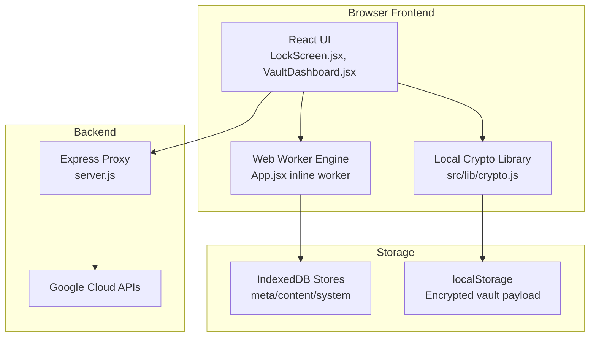
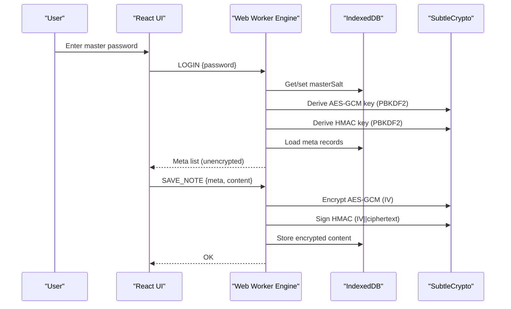
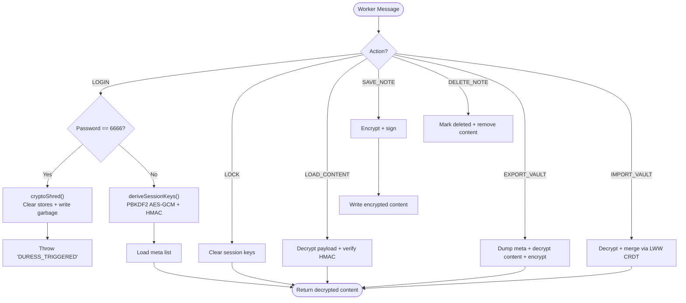
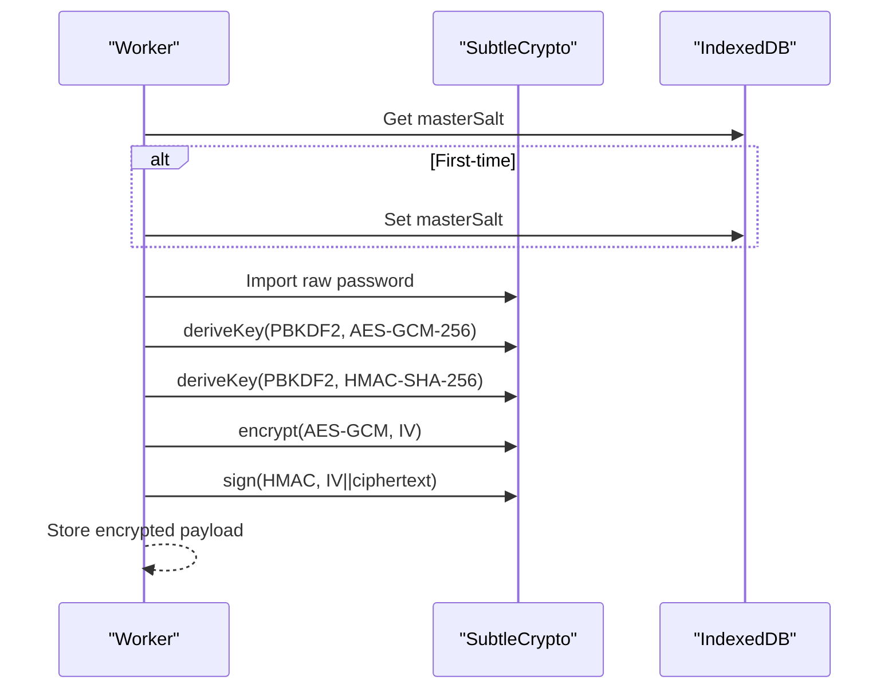
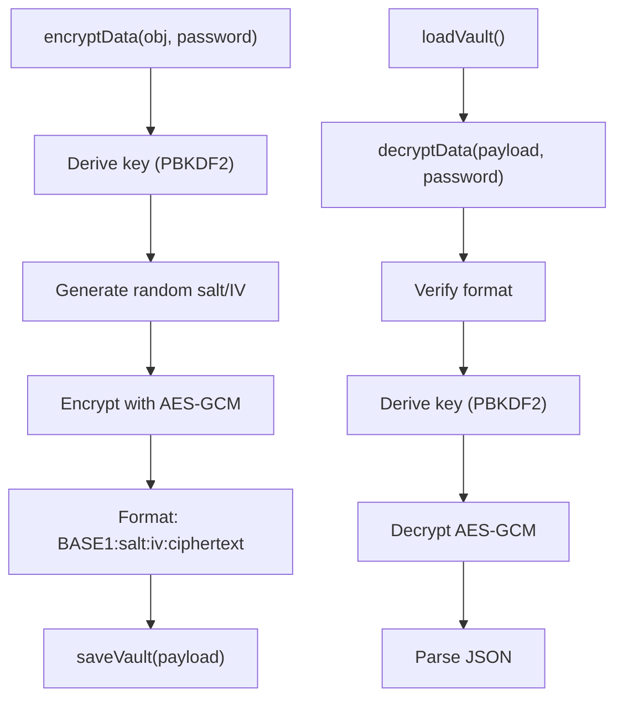
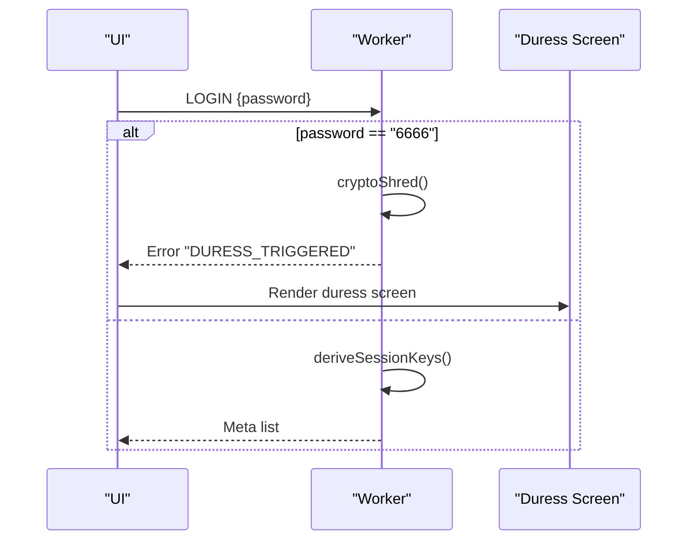
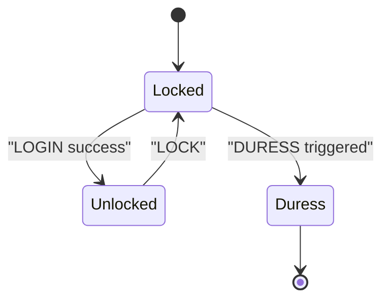
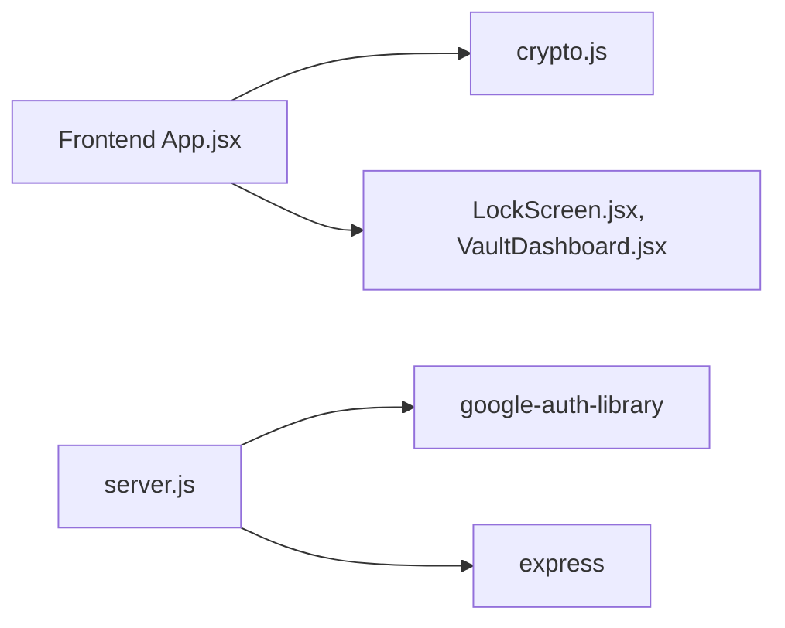

# Security Architecture

<cite>
**Referenced Files in This Document**
- [crypto.js](file://src/lib/crypto.js)
- [App.jsx](file://src/App.jsx)
- [LockScreen.jsx](file://src/components/LockScreen.jsx)
- [VaultDashboard.jsx](file://src/components/VaultDashboard.jsx)
- [server.js](file://server.js)
- [package.json](file://package.json)
</cite>

## Table of Contents
1. [Introduction](#introduction)
2. [Project Structure](#project-structure)
3. [Core Components](#core-components)
4. [Architecture Overview](#architecture-overview)
5. [Detailed Component Analysis](#detailed-component-analysis)
6. [Dependency Analysis](#dependency-analysis)
7. [Performance Considerations](#performance-considerations)
8. [Troubleshooting Guide](#troubleshooting-guide)
9. [Conclusion](#conclusion)
10. [Appendices](#appendices)

## Introduction
This document describes the security architecture of OMNI-TODO’s cryptographic implementation. It explains how user data remains encrypted at rest and in transit, details the zero-knowledge design, and documents the Web Worker-based encryption engine, PBKDF2 key derivation, AES-GCM-256 encryption with HMAC integrity verification, and the master password protection system including the duress detection mechanism with a 6666 PIN fallback. It also covers state management patterns, integrity measures, threat model considerations, and security testing methodologies.

## Project Structure
OMNI-TODO is a browser-first application with a frontend that performs all cryptographic operations locally. The backend server is used for AI proxying and does not handle sensitive user data.

**Diagram sources**
- [App.jsx:9-164](file://src/App.jsx#L9-L164)
- [crypto.js:40-112](file://src/lib/crypto.js#L40-L112)
- [LockScreen.jsx:1-221](file://src/components/LockScreen.jsx#L1-L221)
- [VaultDashboard.jsx:137-237](file://src/components/VaultDashboard.jsx#L137-L237)
- [server.js:1-135](file://server.js#L1-L135)

**Section sources**
- [App.jsx:1-258](file://src/App.jsx#L1-L258)
- [crypto.js:1-112](file://src/lib/crypto.js#L1-L112)
- [LockScreen.jsx:1-221](file://src/components/LockScreen.jsx#L1-L221)
- [VaultDashboard.jsx:137-237](file://src/components/VaultDashboard.jsx#L137-L237)
- [server.js:1-135](file://server.js#L1-L135)

## Core Components
- Zero-knowledge encryption engine in a Web Worker that derives keys, encrypts, and authenticates data using AES-GCM and HMAC.
- Local PBKDF2-based key derivation with high iteration counts and random salts.
- IndexedDB-backed secure storage for metadata and encrypted content.
- Master password protection with a duress PIN that triggers cryptographic destruction.
- Local storage of encrypted vault payloads for offline persistence.
- UI-driven state management with explicit locking and error handling.

**Section sources**
- [App.jsx:9-164](file://src/App.jsx#L9-L164)
- [crypto.js:7-38](file://src/lib/crypto.js#L7-L38)
- [LockScreen.jsx:58-87](file://src/components/LockScreen.jsx#L58-L87)

## Architecture Overview
The system follows a strict zero-knowledge model:
- All cryptographic operations occur inside the browser.
- The Web Worker manages session keys, encryption, integrity checks, and IndexedDB operations.
- The UI communicates with the Web Worker via a message-based protocol.
- Encrypted vault payloads are persisted to localStorage for offline access.
- The backend is used solely for AI proxying and does not touch user secrets.

**Diagram sources**
- [App.jsx:74-163](file://src/App.jsx#L74-L163)
- [App.jsx:33-42](file://src/App.jsx#L33-L42)

## Detailed Component Analysis

### Web Worker-Based Encryption Engine
The Web Worker encapsulates the entire cryptographic pipeline:
- Initializes IndexedDB stores for metadata, content, and system variables.
- Derives session keys from the master password using PBKDF2 with a stored masterSalt.
- Encrypts content with AES-GCM and signs with HMAC-SHA-256 for integrity.
- Implements a duress PIN that triggers cryptographic destruction of all data.

**Diagram sources**
- [App.jsx:74-163](file://src/App.jsx#L74-L163)
- [App.jsx:44-52](file://src/App.jsx#L44-L52)
- [App.jsx:33-42](file://src/App.jsx#L33-L42)

**Section sources**
- [App.jsx:9-164](file://src/App.jsx#L9-L164)

### PBKDF2 Key Derivation and AES-GCM-256 with HMAC Integrity
- Session keys are derived from the master password using PBKDF2 with SHA-256 and 100,000 iterations.
- A masterSalt is stored in IndexedDB and reused across sessions.
- AES-GCM-256 is used for confidentiality with a fresh IV per operation.
- HMAC-SHA-256 verifies integrity and authenticity of the ciphertext.

**Diagram sources**
- [App.jsx:33-42](file://src/App.jsx#L33-L42)
- [App.jsx:54-72](file://src/App.jsx#L54-L72)

**Section sources**
- [App.jsx:33-42](file://src/App.jsx#L33-L42)
- [App.jsx:54-72](file://src/App.jsx#L54-L72)

### Local Vault Persistence and File Export/Import
- The legacy vault encryption library persists encrypted payloads to localStorage with a BASE1 scheme.
- File export/import uses a binary format combining IV, HMAC signature, and AES-GCM ciphertext.

**Diagram sources**
- [crypto.js:20-38](file://src/lib/crypto.js#L20-L38)
- [crypto.js:43-60](file://src/lib/crypto.js#L43-L60)

**Section sources**
- [crypto.js:20-38](file://src/lib/crypto.js#L20-L38)
- [crypto.js:43-60](file://src/lib/crypto.js#L43-L60)

### Master Password Protection and Duress Detection
- The master password unlocks the session and derives session keys.
- Entering the 6666 PIN triggers cryptographic destruction of all data and displays a duress screen.
- On successful login, the UI hides the error and transitions to the dashboard.

**Diagram sources**
- [App.jsx:79-84](file://src/App.jsx#L79-L84)
- [App.jsx:216-226](file://src/App.jsx#L216-L226)
- [LockScreen.jsx:80-87](file://src/components/LockScreen.jsx#L80-L87)

**Section sources**
- [App.jsx:7-8](file://src/App.jsx#L7-L8)
- [App.jsx:79-84](file://src/App.jsx#L79-L84)
- [App.jsx:216-226](file://src/App.jsx#L216-L226)
- [LockScreen.jsx:80-87](file://src/components/LockScreen.jsx#L80-L87)

### State Management Patterns and UI Security
- The UI maintains a locked/unlocked state and error messages.
- Auto-save writes encrypted payloads to localStorage after changes.
- Export/Import uses the Web Worker to encrypt/decrypt vault dumps.

**Diagram sources**
- [App.jsx:204-255](file://src/App.jsx#L204-L255)
- [App.jsx:216-226](file://src/App.jsx#L216-L226)

**Section sources**
- [App.jsx:204-255](file://src/App.jsx#L204-L255)
- [VaultDashboard.jsx:137-237](file://src/components/VaultDashboard.jsx#L137-L237)

## Dependency Analysis
- Frontend dependencies include React, Framer Motion, Tailwind, and Lucide icons. No cryptographic libraries are bundled in the frontend.
- The backend proxy depends on Express and google-auth-library for external API access.

**Diagram sources**
- [package.json:12-24](file://package.json#L12-L24)
- [server.js:14-16](file://server.js#L14-L16)

**Section sources**
- [package.json:12-24](file://package.json#L12-L24)
- [server.js:14-16](file://server.js#L14-L16)

## Performance Considerations
- PBKDF2 iteration counts are high (100,000 for session keys; 250,000 in legacy library). Expect noticeable delays on low-end devices during unlock and save operations.
- AES-GCM and HMAC operations are hardware-accelerated via SubtleCrypto.
- IndexedDB writes are batched per note save; consider debouncing UI edits to reduce write frequency.

[No sources needed since this section provides general guidance]

## Troubleshooting Guide
Common issues and resolutions:
- Incorrect password or corrupted payload: The UI shows an error and prevents unlocking. Verify the password and ensure the vault file is intact.
- DURESS triggered: Entering the 6666 PIN destroys all data and renders the duress screen. There is no recovery path for destroyed data.
- Integrity compromised: Decryption fails if the HMAC signature does not match. This indicates tampering or corruption.
- Export/Import errors: Ensure the file starts with the expected format and the password is correct.

**Section sources**
- [App.jsx:216-226](file://src/App.jsx#L216-L226)
- [App.jsx:64-72](file://src/App.jsx#L64-L72)
- [LockScreen.jsx:58-87](file://src/components/LockScreen.jsx#L58-L87)

## Conclusion
OMNI-TODO implements a robust zero-knowledge architecture with strong cryptographic primitives. All secrets remain in the browser, and user data is protected at rest and in transit. The Web Worker-based engine centralizes security logic, while the UI enforces state transitions and user feedback. The duress mechanism adds a practical defense against coercion. Adhering to the documented patterns and threat model ensures continued security.

[No sources needed since this section summarizes without analyzing specific files]

## Appendices

### Cryptographic Specifications
- Key derivation: PBKDF2 with SHA-256, 100,000 iterations for session keys; 250,000 iterations in legacy library.
- Symmetric encryption: AES-GCM-256 with random IV per record.
- Integrity: HMAC-SHA-256 over (IV || ciphertext).
- Storage: IndexedDB for structured data; localStorage for encrypted vault payloads.

**Section sources**
- [App.jsx:33-42](file://src/App.jsx#L33-L42)
- [crypto.js:7-18](file://src/lib/crypto.js#L7-L18)
- [crypto.js:20-38](file://src/lib/crypto.js#L20-L38)

### Threat Model Considerations
- Coercion: 6666 PIN triggers cryptographic destruction to protect secrets under duress.
- Tampering: HMAC verification prevents modification of stored content.
- Exposure: All secrets are derived from the master password and never leave the browser.
- Backend: The proxy server does not handle user secrets; it only forwards authenticated requests to external APIs.

**Section sources**
- [App.jsx:79-84](file://src/App.jsx#L79-L84)
- [App.jsx:64-72](file://src/App.jsx#L64-L72)
- [server.js:21-81](file://server.js#L21-L81)

### Security Testing Methodologies
- Unit-level: Validate PBKDF2 outputs with known vectors, test HMAC verification failures, and simulate corrupted payloads.
- Integration-level: Exercise the Web Worker message protocol for all actions (LOGIN, SAVE_NOTE, LOAD_CONTENT, DELETE_NOTE, EXPORT_VAULT, IMPORT_VAULT).
- End-to-end: Test full lifecycle including creation, unlock, edit, save, export, import, and lock.
- Stress: Measure unlock/save latency under high iteration counts and large vault sizes.
- Penetration: Attempt to bypass the duress PIN, tamper with IndexedDB, and intercept localStorage payloads.

[No sources needed since this section provides general guidance]