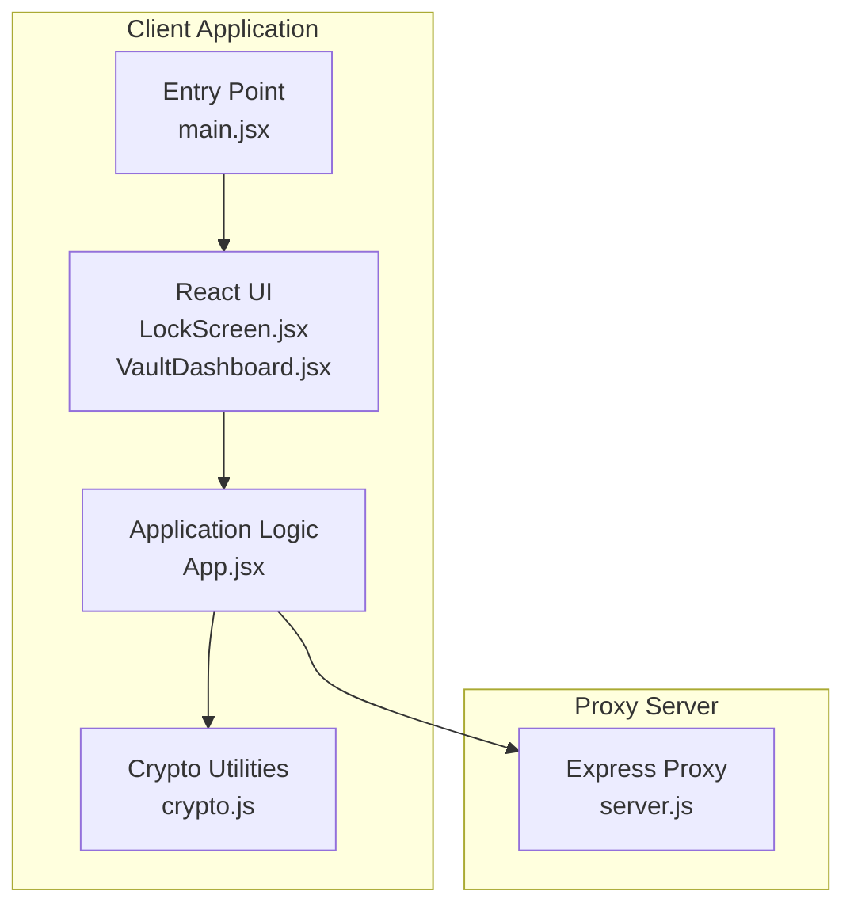
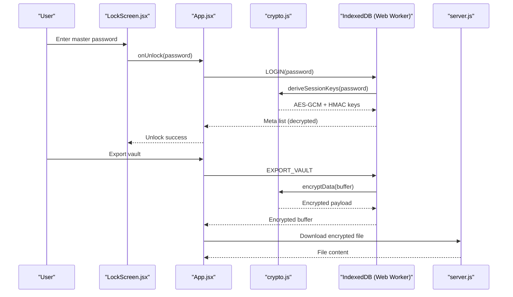
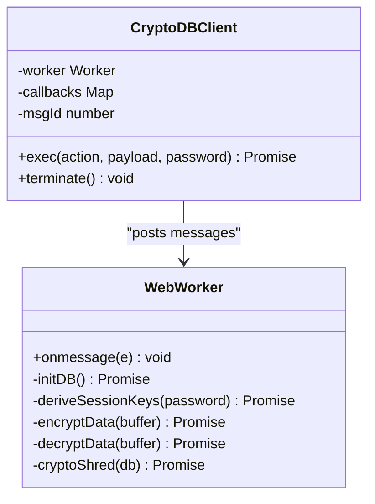
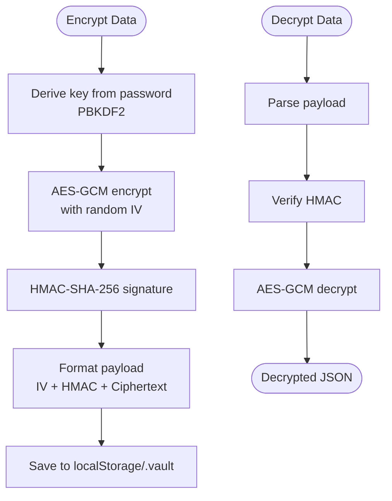
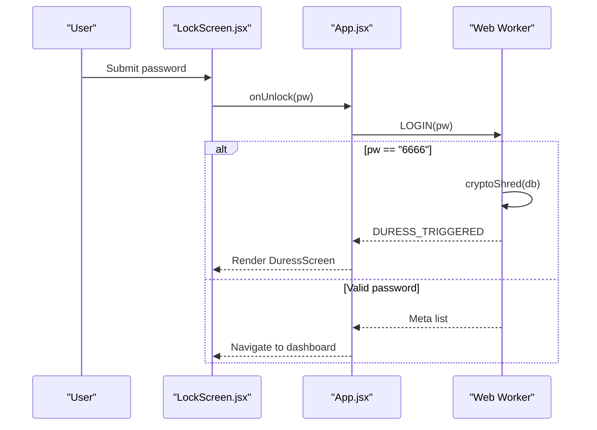
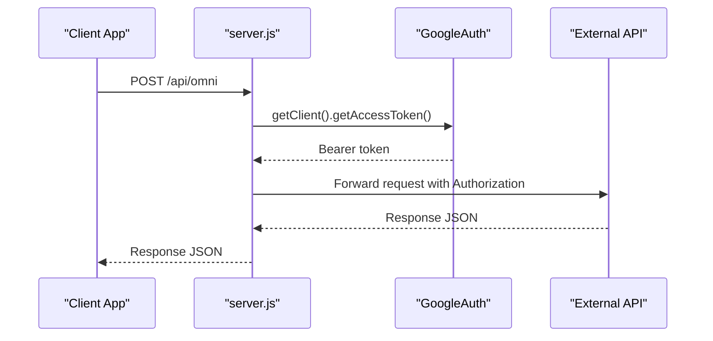
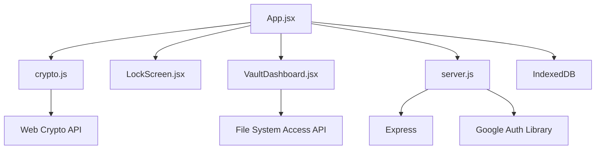

# Threat Model and Security Considerations

<cite>
**Referenced Files in This Document**
- [README.md](file://README.md)
- [package.json](file://package.json)
- [server.js](file://server.js)
- [src/lib/crypto.js](file://src/lib/crypto.js)
- [src/App.jsx](file://src/App.jsx)
- [src/components/LockScreen.jsx](file://src/components/LockScreen.jsx)
- [src/components/VaultDashboard.jsx](file://src/components/VaultDashboard.jsx)
- [src/main.jsx](file://src/main.jsx)
</cite>

## Table of Contents
1. [Introduction](#introduction)
2. [Project Structure](#project-structure)
3. [Core Components](#core-components)
4. [Architecture Overview](#architecture-overview)
5. [Detailed Component Analysis](#detailed-component-analysis)
6. [Dependency Analysis](#dependency-analysis)
7. [Performance Considerations](#performance-considerations)
8. [Threat Model Analysis](#threat-model-analysis)
9. [Security Recommendations](#security-recommendations)
10. [Conclusion](#conclusion)

## Introduction
This document presents a comprehensive threat model and security analysis for OMNI-TODO's zero-knowledge architecture. It identifies potential attack vectors, evaluates the effectiveness of implemented protections, and provides actionable recommendations to strengthen security boundaries. The analysis covers brute force password attacks, side-channel risks, man-in-the-middle scenarios, browser-based vulnerabilities, the zero-knowledge design, the duress detection system with 6666 PIN fallback, client-side encryption, and protection against malicious insiders.

## Project Structure
OMNI-TODO is a React + Vite frontend application with integrated client-side cryptography and a lightweight Express proxy server for cloud service integration. The security-critical components reside in:
- Client-side cryptography utilities and zero-knowledge database client
- Lock screen and authentication flow
- Encrypted vault persistence and export/import mechanisms
- Proxy server for external API communication

**Diagram sources**
- [src/App.jsx:1-441](file://src/App.jsx#L1-L441)
- [src/lib/crypto.js:1-112](file://src/lib/crypto.js#L1-L112)
- [src/components/LockScreen.jsx:1-221](file://src/components/LockScreen.jsx#L1-L221)
- [src/components/VaultDashboard.jsx:1-200](file://src/components/VaultDashboard.jsx#L1-L200)
- [src/main.jsx:1-11](file://src/main.jsx#L1-L11)
- [server.js:1-135](file://server.js#L1-L135)

**Section sources**
- [README.md:1-17](file://README.md#L1-L17)
- [package.json:1-40](file://package.json#L1-L40)

## Core Components
- Zero-knowledge database client with IndexedDB-backed storage and Web Crypto-based encryption
- Client-side encryption utilities for persistent vault storage and file-based export/import
- Lock screen with master password authentication and duress detection
- Proxy server for secure external API communication with Google Auth integration

**Section sources**
- [src/App.jsx:1-441](file://src/App.jsx#L1-L441)
- [src/lib/crypto.js:1-112](file://src/lib/crypto.js#L1-L112)
- [src/components/LockScreen.jsx:1-221](file://src/components/LockScreen.jsx#L1-L221)
- [server.js:1-135](file://server.js#L1-L135)

## Architecture Overview
The system follows a zero-knowledge model where sensitive data is encrypted on the client before being stored locally or exported. Authentication relies on a master password derived via PBKDF2, with no server-side secrets. Communication with external services is mediated by a proxy server that authenticates using Google Auth credentials.

**Diagram sources**
- [src/components/LockScreen.jsx:1-221](file://src/components/LockScreen.jsx#L1-L221)
- [src/App.jsx:1-441](file://src/App.jsx#L1-L441)
- [src/lib/crypto.js:1-112](file://src/lib/crypto.js#L1-L112)
- [server.js:1-135](file://server.js#L1-L135)

## Detailed Component Analysis

### Zero-Knowledge Database Client (Web Worker)
The Web Worker encapsulates all cryptographic operations and IndexedDB interactions. It derives session keys from the master password and performs AES-GCM encryption with HMAC verification for integrity. The worker enforces strict session boundaries and supports export/import operations.

**Diagram sources**
- [src/App.jsx:167-190](file://src/App.jsx#L167-L190)
- [src/App.jsx:10-164](file://src/App.jsx#L10-L164)

**Section sources**
- [src/App.jsx:10-164](file://src/App.jsx#L10-L164)
- [src/App.jsx:167-190](file://src/App.jsx#L167-L190)

### Client-Side Encryption Utilities
The crypto module implements PBKDF2-based key derivation and AES-GCM encryption for persistent vault storage. It supports saving/loading encrypted vaults to/from localStorage and exporting to file system via the File System Access API with fallback to downloads.

**Diagram sources**
- [src/lib/crypto.js:7-38](file://src/lib/crypto.js#L7-L38)

**Section sources**
- [src/lib/crypto.js:1-112](file://src/lib/crypto.js#L1-L112)

### Lock Screen and Authentication Flow
The lock screen captures the master password, validates inputs, and triggers unlock. The application logic routes to the Web Worker for session establishment and manages error states. The duress detection mechanism monitors for a specific PIN and triggers cryptographic destruction of local data.

**Diagram sources**
- [src/components/LockScreen.jsx:1-221](file://src/components/LockScreen.jsx#L1-L221)
- [src/App.jsx:7-235](file://src/App.jsx#L7-L235)
- [src/App.jsx:74-87](file://src/App.jsx#L74-L87)

**Section sources**
- [src/components/LockScreen.jsx:1-221](file://src/components/LockScreen.jsx#L1-L221)
- [src/App.jsx:7-235](file://src/App.jsx#L7-L235)

### Proxy Server for External APIs
The proxy server handles requests to external AI services, obtaining bearer tokens via Google Auth and forwarding requests with proper CORS handling. It acts as a trusted intermediary to limit exposure of credentials and enforce request/response validation.

**Diagram sources**
- [server.js:13-81](file://server.js#L13-L81)
- [server.js:83-129](file://server.js#L83-L129)

**Section sources**
- [server.js:1-135](file://server.js#L1-L135)

## Dependency Analysis
The application depends on modern web APIs and libraries for cryptography, UI, and proxy functionality. Key dependencies include:
- Web Crypto API for PBKDF2, AES-GCM, and HMAC operations
- IndexedDB for structured client-side storage
- File System Access API for secure file export
- Express and Google Auth Library for proxy server

**Diagram sources**
- [src/App.jsx:1-441](file://src/App.jsx#L1-L441)
- [src/lib/crypto.js:1-112](file://src/lib/crypto.js#L1-L112)
- [src/components/LockScreen.jsx:1-221](file://src/components/LockScreen.jsx#L1-L221)
- [src/components/VaultDashboard.jsx:1-200](file://src/components/VaultDashboard.jsx#L1-L200)
- [server.js:1-135](file://server.js#L1-L135)
- [package.json:12-38](file://package.json#L12-L38)

**Section sources**
- [package.json:12-38](file://package.json#L12-L38)

## Performance Considerations
- PBKDF2 iteration counts are set to high values to resist brute-force attacks but may impact unlock performance. Consider adaptive parameters or user feedback during key derivation.
- AES-GCM provides authenticated encryption with minimal overhead; HMAC verification adds integrity checks without significant latency.
- IndexedDB operations are asynchronous; ensure UI responsiveness by avoiding long-running transactions on the main thread.

[No sources needed since this section provides general guidance]

## Threat Model Analysis

### Brute Force Password Attacks
- Current mitigations:
  - High PBKDF2 iteration counts in both persistent and session cryptography reduce effective brute-force rate.
  - Master password enforced on unlock; no server-side password validation occurs.
- Attack surface:
  - Offline dictionary/brute-force attempts against stored vaults if password is weak.
  - Online guessing attempts against unlock flow if not rate-limited.
- Risk assessment:
  - Medium risk if passwords are weak; mitigated by strong iteration counts and zero-knowledge design.
- Mitigations:
  - Enforce minimum password length and complexity.
  - Implement client-side rate limiting and exponential backoff.
  - Consider adaptive iteration scaling based on device capability.

**Section sources**
- [src/lib/crypto.js:7-18](file://src/lib/crypto.js#L7-L18)
- [src/App.jsx:33-42](file://src/App.jsx#L33-L42)
- [src/components/LockScreen.jsx:105-119](file://src/components/LockScreen.jsx#L105-L119)

### Side-Channel Attacks
- Current mitigations:
  - PBKDF2 with high iteration counts and constant-time operations via Web Crypto.
  - HMAC verification performed after decryption to prevent timing leaks.
- Attack surface:
  - Timing channels during key derivation and decryption.
  - Memory traces of decrypted data in browser memory.
- Risk assessment:
  - Low to medium depending on browser implementation and device capabilities.
- Mitigations:
  - Use dedicated WebAssembly modules for constant-time operations if available.
  - Clear sensitive buffers promptly after use.
  - Avoid storing intermediate values in global state.

**Section sources**
- [src/lib/crypto.js:64-72](file://src/lib/crypto.js#L64-L72)
- [src/App.jsx:64-72](file://src/App.jsx#L64-L72)

### Man-in-the-Middle Scenarios
- Current mitigations:
  - Proxy server handles external API calls; credentials are scoped and rotated via Google Auth.
  - CORS enabled for controlled cross-origin requests.
- Attack surface:
  - Network interception of client-proxy communications.
  - Compromised proxy server forwarding malicious requests.
- Risk assessment:
  - Medium risk; depends on network security and proxy hardening.
- Mitigations:
  - Enforce HTTPS for all proxy endpoints.
  - Implement certificate pinning or HPKP where applicable.
  - Add request/response integrity checks and audit logs.

**Section sources**
- [server.js:10-11](file://server.js#L10-L11)
- [server.js:21-81](file://server.js#L21-L81)

### Browser-Based Vulnerabilities
- Current mitigations:
  - CSP policies and secure defaults in Vite development environment.
  - No third-party analytics or trackers in the UI.
- Attack surface:
  - XSS via compromised user input or malicious extensions.
  - CSRF through unprotected endpoints (none present).
  - Local storage theft via XSS or session fixation.
- Risk assessment:
  - Medium risk due to XSS potential; zero-knowledge reduces impact.
- Mitigations:
  - Implement Content-Security-Policy headers.
  - Sanitize and validate all user inputs.
  - Use SameSite cookies and secure flags for any server interactions.

**Section sources**
- [src/components/VaultDashboard.jsx:137-200](file://src/components/VaultDashboard.jsx#L137-L200)

### Zero-Knowledge Architecture Principles
- Principle: Secrets never leave the client.
- Implementation:
  - Master password derives encryption keys; server receives only encrypted data.
  - Exported vaults are encrypted and can only be decrypted with the correct password.
- Benefits:
  - Protection against server-side breaches and insider threats.
  - Strong confidentiality guarantees for stored content.
- Limitations:
  - No password recovery; loss of master password results in permanent data loss.
  - Client-side compromise can expose decrypted data.

**Section sources**
- [src/lib/crypto.js:20-38](file://src/lib/crypto.js#L20-L38)
- [src/App.jsx:120-133](file://src/App.jsx#L120-L133)

### Duress Detection System (6666 PIN Fallback)
- Mechanism:
  - Special PIN triggers immediate cryptographic destruction of local data.
  - On detection, the Web Worker overwrites content stores with random garbage and clears metadata/system stores.
- Security implications:
  - Prevents coercion by forcing irreversible data destruction.
  - Requires careful UX to avoid accidental activation.
- Risk assessment:
  - Low risk of accidental trigger; high benefit for coercion resistance.
- Mitigations:
  - Provide prominent warnings and confirmation dialogs.
  - Consider secondary confirmation for duress actions.

**Section sources**
- [src/App.jsx:7-7](file://src/App.jsx#L7-L7)
- [src/App.jsx:44-52](file://src/App.jsx#L44-L52)
- [src/App.jsx:79-80](file://src/App.jsx#L79-L80)
- [src/components/LockScreen.jsx:80-87](file://src/components/LockScreen.jsx#L80-L87)

### Client-Side Encryption and Integrity
- Encryption:
  - AES-GCM with random IVs ensures confidentiality and authenticity.
  - PBKDF2 with high iteration counts secures key derivation.
- Integrity:
  - HMAC-SHA-256 verifies ciphertext integrity before decryption.
- Protection against malicious insiders:
  - Even if server is compromised, attackers cannot access plaintext without the master password.
- Limitations:
  - Client-side compromise can expose decrypted content.
  - Exported vaults are only as secure as the password strength.

**Section sources**
- [src/lib/crypto.js:20-38](file://src/lib/crypto.js#L20-L38)
- [src/lib/crypto.js:64-72](file://src/lib/crypto.js#L64-L72)

## Security Recommendations

### Immediate Actions
- Enforce minimum password requirements and complexity checks on creation.
- Implement client-side rate limiting and exponential backoff for unlock attempts.
- Add explicit user confirmation for duress activation.
- Harden proxy server with HTTPS enforcement and certificate pinning.

### Medium-Term Improvements
- Introduce adaptive PBKDF2 iteration scaling based on device performance.
- Add request/response integrity checks and audit logs to the proxy server.
- Implement CSP headers and sanitize all user inputs to prevent XSS.
- Consider hardware-backed key derivation on supported devices.

### Long-Term Enhancements
- Migrate to WebAssembly modules for constant-time cryptographic operations.
- Add multi-device synchronization with secure key exchange protocols.
- Implement secure enclave integration for sensitive operations on supported platforms.

[No sources needed since this section provides general guidance]

## Conclusion
OMNI-TODO demonstrates a robust zero-knowledge architecture with strong client-side encryption, effective duress detection, and secure proxy integration. While the current design provides solid protection against many threats, additional measures—particularly around password policy enforcement, rate limiting, and proxy hardening—are recommended to further strengthen resilience against brute force, side-channel, and browser-based attacks. The zero-knowledge principle remains central to protecting user data from malicious insiders and server compromises, provided that client-side security and user education remain prioritized.